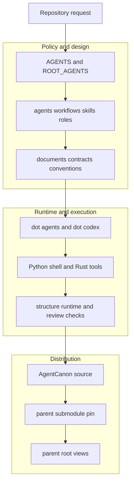

# agent-canon
<!--
@dependency-start
contract reference
responsibility Documents agent-canon for this repository.
upstream design PHILOSOPHY.md AgentCanon design-time philosophy.
upstream design AGENTS.md shared canon runtime contract
upstream design responsibility-scope.toml AgentCanon path responsibility scope map.
upstream design documents/tools/semantic_index.md semantic-index command and result contract.
upstream implementation rust/agent-canon/src/structured_analysis.rs structured document and responsibility analysis.
upstream design LICENSE AgentCanon license text
upstream design documents/agent-canon/agent-canon-licensing-policy.md AgentCanon license boundary
downstream design CONTAINER_OPERATIONS.md top-level container and devcontainer operation rulebook.
@dependency-end
-->


このディレクトリは `agent-canon` 自体の source tree です。
template や派生 repo に配布する shared agent canon の正本をここに置きます。

## First Read Path

この README は、AgentCanon source tree の役割、構造モデル、目的別 route、runtime profile、検索導線、保守ルールを扱います。
Codex の自動 instruction は Codex home の global guidance の後、検出された
project root から current working directory までの `AGENTS.override.md` /
`AGENTS.md` / configured fallback file chain で決まります。この AgentCanon
source tree が project root のときの repo instruction entrypoint は
`AGENTS.md` です。人がこの repo を読む入口は次の順で固定します。

1. `README.md`
1. `PHILOSOPHY.md`
1. `documents/README.md`
1. `agents/README.md`
1. `agents/workflows/README.md`

`PHILOSOPHY.md` は設計時哲学の正本、`documents/README.md` は root
`documents/` の索引、`agents/README.md` は workflow / skill / runtime hub、
`agents/workflows/README.md` は workflow selector です。
`agents/canonical/README.md` は layout appendix として扱い、最初の hub にはしません。
AgentCanon 自体の source、shared runtime、sync、PR 運用、責務 scope を確認するときにこの README を読みます。

## 全体設計

この section は AgentCanon 自身の shared runtime、policy、tool、配布境界を
所有します。Template や派生 project の domain 構造と active contract は扱わず、
親 repository の `README.md` がそれぞれ所有します。

### 設計目的

AgentCanon は、Codex が repository task を再現可能な責務単位で進めるための
policy、workflow、skill、role、tool、validation contract を一つの source tree
で管理する shared agent runtime です。個別 project の domain logic を所有せず、
request から owner、設計、実装 handoff、検証、closeout までを接続する共通基盤を
提供します。

設計上の中心は、人が読む規約、機械可読 contract、runtime adapter、実行 tool を
分離しながら、同じ責務 graph で結ぶことです。規約だけ、checker だけ、生成された
runtime view だけが独立して正本になる状態を避け、変更理由から実装と検証までを
dependency edge で追跡できる構造にします。

### システムモデル



`AGENTS.md` と `ROOT_AGENTS.md` は repository instruction の入口です。
`agents/` は workflow family、skill dependency、subagent role、communication
protocol を所有します。`documents/` は設計、規約、runtime profile、構造、tool
contract を責務 directory ごとに所有します。

`.agents/` と `.codex/` は Codex が発見する runtime adapter です。`tools/` と
`rust/` は contract を実行可能な command と checker にします。`tests/` は
AgentCanon 自身の tool、workflow、policy mechanism を検証し、`evidence/`、
`reports/`、`memory/`、`notes/` はそれぞれ定義された保持期間と読者目的に従って
判断材料を保存します。

### Task の流れ

1. Repository instruction が user request と現在の構造を読み、責務 owner を選びます。
1. Workflow と skill dependency が、設計、実装 handoff、review、validation の順序を構成します。
1. Tool と runtime adapter が、選択された contract を決定論的な操作へ変換します。
1. Validator が変更した責務と対応する property を確認し、finding を owner に戻します。
1. Accepted source change を AgentCanon の branch と PR で統合し、parent は commit pin と root view を更新します。

### 配布境界

AgentCanon 単体 repository は、この tree 全体を source of truth として扱います。
Template と派生 repository は `vendor/agent-canon/` の commit pin を shared source
identity とし、root view から必要な runtime surface を公開します。Project 固有の
source、active contract、実験、private state は親 repository が所有し、AgentCanon
の共有 policy に取り込みません。

配布と root view の詳細は
[Shared Runtime Surfaces](documents/runtime/SHARED_RUNTIME_SURFACES.md)、親側の
最低限構造は [親レポ構造](documents/parent-repository/README.md)、利用能力と検証範囲は
[Runtime Profiles And Check Matrix](documents/runtime/runtime-profiles-and-check-matrix.md)
が所有します。

### 設計上の不変条件

- 各 policy、schema、tool、artifact は一つの責務 owner を持ちます。
- Human-readable policy と machine-readable contract は同じ設計判断を表し、生成物を別正本にしません。
- Workflow は owner と依存関係から実行順を導き、prompt keyword や file 数から scope を決めません。
- Tool は contract を実行し、tool 固有の policy を追加しません。
- Validation は変更した property に対応し、無関係な full check を完了条件にしません。
- Parent repository は pin と view を通して共有 runtime を利用し、AgentCanon source を複製しません。
- Project 固有の code、secret、raw log、実験状態は AgentCanon の共有 source から分離します。
- AgentCanon source の変更は branch、review、PR、main readback を経てから parent pin に反映します。

## このディレクトリの役割

- workflow canon の正本
- skill / subagent / runtime instruction の正本
- shared runtime helper と validation helper の正本
- shared canon の evidence-keyed update transaction と source PR 運用の正本
- design-time philosophy の正本

この役割を読んだ後は、どの責務がどの path に属するかを次の構造モデルで確認する。

## 構造モデル

この repo の全体構造は、top-level directory 名だけではなく、
`responsibility-scope.toml` と canonical graph で読む。dependency manifest は
Rust `ManifestParser` が一度だけ source snapshot に取り込み、parent-owned
`.agent-canon/knowledge-graph/graph.sqlite` へ他の producer facts と共に
materialize される。consumer は `agent-canon graph status/query/context` を使い、
source header を再解析しない。

2026-07-08 の機械解析では、repo structure contract 対象 path は 1024、
import responsibility 対象 file は 285、document inventory 対象 document は
450 だった。scope 定義の逸脱、import responsibility finding、active document
inventory finding は 0 件です。document inventory の historical record は 23
件で、closed issue record と stale historical filename だけです。この解析結果は、
責務 scope、top-level surface、大きい directory の内部構造、historical record
の順に読む。

### 責務 Scope

`responsibility-scope.toml` は broad directory scope と cross-directory scope
を同時に扱う。以前は `eval-and-hook-evidence` と broad scope が 13 file で
重なっていたため、現在は broad scope 側の `exclude_paths` で evidence
control-plane file を差し引く。2026-06-06 の再解析では、`exclude_paths`
適用後に複数 scope へ属する tracked file は 0 件である。

| Scope | 種別 | 主な path | 役割 |
| --- | --- | --- | --- |
| `runtime-entrypoints` | primary | `AGENTS.md`, `ROOT_AGENTS.md`, `.agents/**`, `.codex/**`, `.devcontainer/**`, `.vscode/**`, `agents/**` | agent runtime の入口、workflow canon、skill、hook、runtime / editor config。 |
| `shared-tooling` | primary | `tools/**`, `rust/**`, `helper_inventory_guard_policy.json` | shared automation、static gate、OOP checker、Rust CLI、tool catalog。 |
| `shared-policy-documents` | primary | `README.md`, `CONTAINER_OPERATIONS.md`, `responsibility-scope.toml`, `documents/**`, `notes/**`, `memory/**`, `references/**` | policy、convention、container、bootstrap、tool documentation、記憶と参照資料。 |
| `test-surfaces` | primary | `tests/**` | shared tools、workflow、責務 policy を検証する test surface。 |
| `github-automation` | primary | `.github/**` | GitHub Actions、Issue / PR template、GitHub-facing entrypoint。 |
| `operational-issues` | primary | `issues/**` | durable local issue files と GitHub Issue mirror metadata。 |
| `external-skill-vendor` | primary | `vendor/**` | third-party skill など、AgentCanon 内部の external dependency 置き場。 |
| `eval-and-hook-evidence` | cross-directory primary | `evidence/**`, `documents/runtime-log-archive*.md`, `tools/agent_tools/runtime_log_*.py` | hook、skill、workflow、behavior eval の evidence と log archive control plane。 |

`eval-and-hook-evidence` に移した file は、元の broad scope から除外する。

| 除外元 scope | `exclude_paths` の意味 |
| --- | --- |
| `runtime-entrypoints` | hook archive evidence is owned by the runtime archive tool surface. |
| `shared-policy-documents` | `documents/runtime-log-archive*.md` は policy directory 内にあるが、primary owner は evidence scope。 |
| `shared-tooling` | `tools/agent_tools/runtime_log_*.py` は tooling directory 内にあるが、primary owner は evidence scope。 |

Top-level surface は次のように読む。`Tracked` は `git ls-files`、`Manifest`
は `@dependency-start` marker を持つ tracked file の数です。

| Path | Tracked | Manifest | 構造上の責務 |
| --- | ---: | ---: | --- |
| root files | 9 | 7 | `README.md`、`PHILOSOPHY.md`、`ROOT_AGENTS.md`、`responsibility-scope.toml` などの root entrypoint と root policy。 |
| `.agents/` | 42 | 42 | Codex skill discovery 用の runtime skill entrypoint。 |
| `.codex/` | 61 | 61 | Codex config、role TOML、hook runtime surface。 |
| `.devcontainer/` | 6 | 6 | AgentCanon source の devcontainer script と linked parent config が使う共有 runtime surface。 |
| `.vscode/` | 4 | 4 | shared VS Code defaults and validation tasks。 |
| `.github/` | 12 | 12 | GitHub workflow、Issue / PR template、GitHub agent entrypoint。 |
| `agents/` | 143 | 143 | workflow、skill canon、task catalog の human-facing hub。`agents/evals/` は旧 manifest path の compatibility stub。 |
| `templates/` | — | — | centralized AgentCanon template source: agent artifacts、documents、experiment scaffold、GitHub source。 |
| `evidence/` | 8 | 8 | tracked eval manifest source と evidence contract。run output は `.agent-canon/log-archive/` に置き、legacy `agents/evals/results/` は migration input としてだけ扱う。 |
| `codex-cli-guide/` | 14 | 14 | OpenAI Codex CLI 日本語 guide の分割 source。 |
| `completion-first-review/` | 14 | 14 | completion-first 改善 review の index と説明。 |
| `documents/` | 115 | 113 | shared policy、運用規約、tool / structured-analysis / prose graph docs。runtime log archive docs は `eval-and-hook-evidence` scope。 |
| `issues/` | 21 | 21 | AgentCanon operational finding の open / closed issue record。 |
| `memory/` | 3 | 3 | user preference と agent philosophy の durable memory。 |
| `notes/` | 30 | 30 | knowledge、guardrail、theme、failure、branch、worktree notes。 |
| `references/` | 3 | 3 | workflow、tool、research の外部参照索引。OpenAI / Codex product evidence は `$openai-docs` source route を参照する。 |
| `rust/` | 15 | 14 | `agent-canon` Rust CLI implementation。 |
| `tests/` | 97 | 96 | shared tool と responsibility policy の test suite。 |
| `tools/` | 171 | 171 | Python / shell / Rust wrapper を含む shared automation surface。runtime log archive tools は `eval-and-hook-evidence` scope。 |
| `vendor/` | 3 | 3 | third-party skill vendor contract と adapter metadata。 |

### 現在の Review Finding

structured-analysis / document-inventory の 2026-07-08 review では active
finding は 0 件です。これは `issues/open/` にある active operational finding
を置き換えるものではない。残る 23 件は closed issue record と stale
historical filename の inventory です。これらは active rule や現行 workflow
ではなく、`issues/README.md` と `issues/closed/README.md` が管理する履歴証拠
として読む。新しい scope は closed issue へ追記せず、新しい open issue、
正本文書、または owner surface に戻す。

### 大きい Directory の Child 表

| Parent | Main children |
| --- | --- |
| `agents/` | `skills/`, `workflows/`, `canonical/`, compatibility `evals/` |
| `evidence/` | `agent-evals/` |
| `tools/` | `agent_tools/`, `ci/`, `docs/`, `oop/`, `experiments/`, `static_analysis/`, `validation/` |
| `documents/` | `tools/`, `conventions/`, `structured-analysis/`, `prose-reasoning-graph/`, `design/` |
| `.codex/` | `agents/`, `hooks/`, shared `config.toml` |
| `.github/` | `workflows/`, `ISSUE_TEMPLATE/`, `PULL_REQUEST_TEMPLATE/` |
| `tests/` | `agent_tools/`, `tools/`, `fixtures/` |
| `notes/` | `knowledge/`, `guardrails/`, `themes/`, `experiments/`, `failures/`, `branches/`, `worktrees/` |

この構造表を更新するときは、AgentCanon root から次を実行し、結果を確認してから
README を直す。

```bash
agent-canon structured-analysis document-inventory --root . \
  --json-out reports/agentcanon-structure/document_inventory.json \
  --markdown-out reports/agentcanon-structure/document_inventory.md
python3 tools/agent_tools/responsibility_scope.py --root . --format json \
  > reports/agentcanon-structure/responsibility_scope.json
```

## 目的別ルート

この README は最初の読者ラダーだけを持ちます。詳細な catalog や
tool / skill の個別一覧は、それぞれの hub と machine-readable source に戻します。

| 目的 | 次に読む入口 | そこで決めること |
| --- | --- | --- |
| 設計思想を確認する | `PHILOSOPHY.md` | AgentCanon が守る抽象責務と安定原則 |
| 文書の所在を探す | `documents/README.md` | policy、runtime、tool docs、template contract の責務 owner |
| agent workflow を選ぶ | `agents/README.md` | workflow、skill、subagent、runtime entrypoint の入口 |
| workflow family を選ぶ | `agents/workflows/README.md` | task family、stage、review route |
| shared surface を修復する | `documents/runtime/SHARED_RUNTIME_SURFACES.md` | root view、symlink/copy、submodule source の扱い |
| AgentCanon 更新を進める | `documents/agent-canon/agent-canon-update-route.md` | source transaction、PR/readback、projection frontier の唯一の入口 |
| runtime profile と validation を選ぶ | `documents/runtime/runtime-profiles-and-check-matrix.md` | changed path と risk class から実行 gate を選ぶ |
| shared tool を使う | `tools/README.md` | root `tools/` view から呼ぶ実行入口 |

読み進めるときは、この表から 1 行だけ選びます。複数行を横断する必要が出た場合は、
その理由を run bundle、issue、または PR body に残します。

## OpenAI / Codex Source Route

OpenAI / Codex の current product evidence、API reference、model selection、
model upgrade、prompt-upgrade guidance、Codex manual、official-domain web
alternate route は AgentCanon 内で個別 URL や alternate route 文書として二重管理しない。
host-provided `$openai-docs` skill を正本 route とし、AgentCanon 側には local
decision artifact だけを残す。

- workflow / bibliography policy:
  `agents/workflows/workflow-references.md`
- Codex runtime configuration:
  `documents/codex/codex-configuration-reference.md`
- implementation / runtime source record:
  `references/agent-canon-technology-bibliography.md`
- skill discovery rule:
  `agents/skills/README.md`

role TOML の model 値や checked-in config の実値は runtime source ですが、
それらの変更根拠は `$openai-docs` で確認します。README、workflow docs、
bibliography、configuration guide に OpenAI docs の alternate route copy を増やしては
いけません。

## Runtime Profiles

AgentCanon exposes shared runtime surfaces so template and derived repositories
can opt into them without copying implementation. Exposed does not mean always
active. The activation and validation policy is
[Runtime Profiles And Check Matrix](documents/runtime/runtime-profiles-and-check-matrix.md).

- Agent runtime surfaces are active when an agent performs or reviews work.
- GitHub automation, devcontainer, Docker, experiment, C++, memory, and
  maintenance surfaces are profile-specific.
- Full repo validation is still available, but day-to-day checks should be
  selected by changed path and risk class.
- The 2026-05-16 500-item audit is resolved in
  [Template / AgentCanon Audit Resolution](documents/agent-canon/template-agent-canon-audit-resolution.md).

## 利用時のディレクトリ / リンク構成

AgentCanon 単体 repo では、この tree 自体を source of truth として扱います。
Template や派生 repo では `vendor/agent-canon/` を clean pin/runtime projection
として扱い、source edit は topic workspace の独立 cloneで行います。親レポの
期待構造、Symlink / checked copy / regular surface の使い分け、各 directory の
役割は [親レポ構造](documents/parent-repository/README.md) に集約します。
この README は入口だけを示し、親レポの directory 構造を複製しません。

root view の修復と検証:

```bash
AGENT_CANON_COMMIT_REQUEST_EVIDENCE="evidence:$(sha256sum agents/workflows/agent-canon-pr-workflow.md | awk '{print $1}')" \
  PYTHONPATH=vendor/agent-canon/tools:tools python3 -m agent_tools.agent_canon_source_root \
    exec tools/sync_agent_canon.sh link-root
PYTHONPATH=vendor/agent-canon/tools:tools python3 -m agent_tools.agent_canon_source_root \
  exec tools/sync_agent_canon.sh check
bash tools/agent_tools/run_repo_dependency_review.sh --fail-missing
```

remote の正本:

- AgentCanon canonical remote は `documents/agent-canon/agent-canon-github-remote.md` を見ます。
- Template canonical remote は `documents/contracts/template-github-remote.md` を見ます。
- reusable module distribution は GitHub PR / main SHA を正本にします。repo-specific local Git repair は shared module architecture から分離します。

## 検索導線

正確な symbol、path、error message だけはまず `rg` で探します。それ以外の
広い概念、長い query、近い tool、既存 helper の再利用候補、編集 surface
選定では、`rg` より先に responsibility-based search を走らせます。
この導線は `ROOT_AGENTS.md` の Default Search And Routing と
`documents/tools/semantic_index.md` の command / result contract に従う。

```bash
tools/bin/agent-canon semantic-index context-pack --root . \
  --query-file /tmp/query.txt --max-cells 12 --format text
python3 tools/agent_tools/search.py \
  --purpose "find owning responsibility and existing surface" \
  --providers text,semantic,tool,header-deps,code-deps,vector --format json
tools/bin/agent-canon semantic-index thin-docs --root . --top-k 10 --format text
```

semantic-index の DB が無い場合は先に build します:

```bash
tools/bin/agent-canon semantic-index build --root .
```

JSON 出力や旧 `vector_search.py` 互換 helper の扱いは、`ROOT_AGENTS.md` と
`documents/tools/semantic_index.md` を正本にします。検索で対象 path と source
packet を絞ったら、以後の保守では正本 surface を直接編集し、root view や
生成物を別の truth surface にしない。

## 保守ルール

- template root の symlink view や synced copy を直接編集しません。
- shared canon を直すときはこの directory を source of truth にします。
- root surface を戻すときは次を使います。

```bash
AGENT_CANON_COMMIT_REQUEST_EVIDENCE="evidence:$(sha256sum agents/workflows/agent-canon-pr-workflow.md | awk '{print $1}')" \
  PYTHONPATH=vendor/agent-canon/tools:tools python3 -m agent_tools.agent_canon_source_root \
    exec tools/sync_agent_canon.sh link-root
PYTHONPATH=vendor/agent-canon/tools:tools python3 -m agent_tools.agent_canon_source_root \
  exec tools/sync_agent_canon.sh check
```

## upstream sync

template 側で shared canon sourceを直すときは、topic workspace source cloneを使います。
`dependency_module_change.py prepare` は task owner の非空 owner evidence と
`workspace/<topic-slug>/<repo-name>` の exact identity を検証したうえで実行します。
この repo-local lifecycle command の作成・再利用・使用には operation-level の追加承認を
要求しません。作業完了時は同じ canonical lifecycle の `cleanup` に candidate CAS、PR
lifecycle、必要な publication readback を渡し、`CleanupProof` receipt が返った場合だけ
`--apply` を使います。proof 不一致や unknown dirty/collision は保持します。共有 checkout
の raw Git mutation は引き続き protected authority route です。

```bash
python3 tools/agent_tools/dependency_module_change.py --root <parent-repo> prepare \
  --topic <topic> --module vendor/agent-canon --branch <source-branch> \
  --owner-evidence <owner-evidence>
git -C <SOURCE_CLONE> push origin HEAD
```

update / branch / PR の詳細は `agents/workflows/agent-canon-pr-workflow.md` を見ます。
canonical remote の詳細は `documents/agent-canon/agent-canon-github-remote.md` を見ます。

## License

AgentCanon is licensed under Apache License 2.0. See [LICENSE](LICENSE) and
[documents/agent-canon/agent-canon-licensing-policy.md](documents/agent-canon/agent-canon-licensing-policy.md).

Parent repositories may use a different root project license, but AgentCanon
submodule content and root views into AgentCanon retain the AgentCanon license.
Third-party skills or assets under `vendor/` must keep upstream URL, revision,
and license metadata before they are enabled. GitHub-sourced third-party
repositories attach under `vendor/<asset-class>/<github-owner>/<import-id>/`
with a manifest-backed adapter instead of being copied into canonical runtime
paths.
