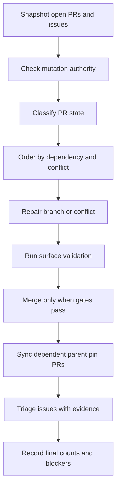

# pr-processing
<!--
@dependency-start
responsibility Documents PR Processing Skill for this repository.
upstream design ../canonical/skills.md skill canon registry
upstream design ../workflows/pr-queue-cleanup-workflow.md AgentCanon source and parent pin PR cleanup workflow
upstream design ../workflows/agent-canon-pr-workflow.md AgentCanon source PR workflow
upstream design ../../documents/agent-canon-update-route.md AgentCanon source PR versus parent pin route
downstream implementation ../../.agents/skills/pr-processing/SKILL.md exposes this workflow as a runtime skill
@dependency-end
-->

## Purpose

GitHub PR と Issue queue を、場当たりの `gh pr merge` ではなく、inventory、
authority、conflict、validation、merge、Issue 処理、closeout evidence の順に
処理します。

この skill は、PR / Issue 処理の実行順と証跡を固定します。個別のコード修正は
対象 surface に応じて `python-review`、`cpp-review`、`md-style-check`、
`agent-canon-update` などへ接続します。

## Use When

- user が PR を処理、merge、conflict 解消、queue cleanup、ready 化するよう求めた
- open PR の依存順、merge 順、branch protection、required checks を整理する
- AgentCanon source PR と template / derived repo の parent pin PR を連動処理する
- GitHub Issue と local issue ledger の stale / duplicate / resolved 判定を行う
- PR body、evidence comment、run bundle に merge 判断の証跡を残す

## Boundary

- GitHub / repo の mutation authority は、この skill が勝手に作りません。merge、
  close、ready 化、branch delete、review dismissal は current user request または
  tracked maintainer policy が必要です。
- conflict 解消の実装そのものは通常の task workflow の責務です。この skill は、
  どの PR をどの順番で直し、どの validation を通してから merge するかを固定します。
- AgentCanon source PR と parent pin PR がつながっている場合は、
  `agent-canon-update` と `pr-queue-cleanup-workflow.md` を使い、source merge と
  parent pin 同期を分けます。

## Processing Graph

## Procedure

1. Queue snapshot を作ります。
   - `gh pr list --state open --json number,title,headRefName,baseRefName,isDraft,mergeable,reviewDecision,statusCheckRollup,updatedAt`
   - `gh issue list --state open --json number,title,labels,updatedAt,url`
   - 必要な PR は `gh pr view <n> --json ...` と `gh pr checks <n>` で詳細を見る
1. Mutation authority を分けます。
   - read inspection
   - branch update / conflict repair
   - PR body or comment update
   - mark ready
   - merge
   - issue close / reopen / label update
1. PR を状態分類します。
   - `ready`: mergeable、green、non-draft、blocking review なし
   - `behind`: strict checks のため base 追随が必要
   - `conflicting`: head branch 上で conflict 解消が必要
   - `draft`: ready 化 authority と evidence が必要
   - `checks-failing`: failure log と修正 surface が必要
   - `review-blocked`: requested changes / review request が残っている
   - `dependent-pin`: source PR merge 後の parent pin / root view PR
   - `stale`: base、目的、Issue、既存 main との差分を再判定する
1. Merge order を決めます。
   - shared source PR を先に処理する
   - AgentCanon source PR は parent pin PR より先に merge する
   - 同じ root/runtime surface に触る PR は一つずつ main に取り込む
   - conflict は、先に入れる PR が確定してから後続 PR の head branch で解く
1. Conflict repair は head branch 上で行います。
   - `git fetch origin`
   - `git switch <head-branch>`
   - `git merge origin/<base>` または repo の標準 update route
   - conflict file を最小差分で直し、対象 validation を rerun する
   - force push は explicit authority がある場合だけ使う
1. Merge gate を確認します。
   - PR is open
   - PR is not draft
   - mergeable
   - required checks pass
   - blocking review なし
   - validation evidence が PR body、comment、または run bundle にある
   - repo の GitHub automation authority fields が必要なら visible になっている
1. Issue を処理します。
   - resolved: merge PR / commit / policy reference を書いて close
   - duplicate: canonical issue を示して close
   - obsolete / not planned: なぜ現在の責務に残さないかを書く
   - active: residual work、owner、next validation を追記して open のまま残す
   - local issue ledger は削除せず、`issues/closed/` など正本の lifecycle に従う
1. Closeout を残します。
   - PR action table
   - Issue action table
   - merge SHA
   - remaining blockers
   - validation commands
   - final open PR count
   - final open Issue count

## AgentCanon Queue

AgentCanon source PR と template / derived PR が連動している場合は、次を固定します。

1. Source PR を先に green にする。
1. Source PR を merge する。
1. Parent repo で `make agent-canon-ensure-latest` を実行する。
1. `bash tools/sync_agent_canon.sh link-root` と `check` を通す。
1. Parent pin / root-view PR を作るか更新する。
1. Parent PR gate を通してから ready / merge 判断を行う。

この細部は `agents/workflows/pr-queue-cleanup-workflow.md` を正本にします。
