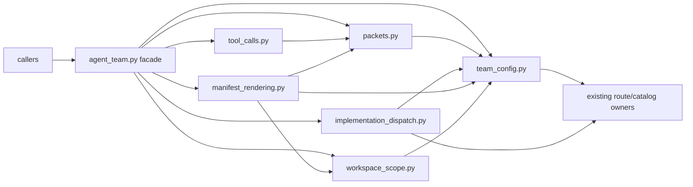

<!--
@dependency-start
contract design
responsibility Defines the approved Python module-boundary target for AgentTeam runtime orchestration.
upstream design README.md design index and evidence-ledger policy
upstream design dependency-manifest-design.md dependency graph and claim-evidence contract
upstream design ../runtime/SHARED_RUNTIME_SURFACES.md shared AgentCanon surface ownership
upstream design ../../agents/COMMUNICATION_PROTOCOL.md active-design packet and caller readback contract
upstream design ../../agents/canonical/CODEX_WORKFLOW.md workflow and repository-changing gate
downstream implementation ../../tools/agent_tools/agent_team.py facade and public-surface source
downstream implementation ../../tools/agent_tools/team_config.py owner source identity
downstream implementation ../../tools/agent_tools/packets.py owner source identity
downstream implementation ../../tools/agent_tools/tool_calls.py owner source identity
downstream implementation ../../tools/agent_tools/implementation_dispatch.py owner source identity
downstream implementation ../../tools/agent_tools/manifest_rendering.py owner source identity
downstream implementation ../../tools/agent_tools/workspace_scope.py owner source identity
upstream implementation ../../tools/agent_tools/helper_function_inventory.py function/class inventory producer
upstream implementation ../../tools/agent_tools/scan_code_dependencies.sh static import-edge producer
downstream implementation ../../tools/agent_tools/bootstrap_agent_run.py run-bundle caller
downstream implementation ../../tools/agent_tools/bootstrap_agent_run.py task-start caller
downstream implementation ../../tools/agent_tools/task_close.py close-agent caller
downstream implementation ../../tools/agent_tools/check_agent_runtime_alignment.py runtime alignment caller
downstream implementation ../../tools/agent_tools/validate_role_write_scope.py write-scope caller
downstream implementation ../../tools/agent_tools/workflow_monitor.py lifecycle event caller
downstream implementation ../../tools/agent_tools/check_design_doc_claims.py changed design claim checker
downstream design README.md AgentCanon design reader index
@dependency-end
-->

# AgentTeam module boundary

## Reader Map

この文書は、Python runtime の責務分割を実装者と reviewer が同じ caller/API `tools/agent_tools/agent_team.py`
evidence から再現するための design contract です。最初に tree と exact
inventory を読み、次に current/target map と DAG を `tools/agent_tools/agent_team.py` から読みます。その後に import
mode と side effect、migration wave、validation oracle、rollback を読みます。
この文書が決めるのは module boundary と公開 API 契約 `565e833b49d895577562d8ede040247fa21f951b41527ca9cfab983a71d9228a` と target owner set（`team_config.py`、`packets.py`、`tool_calls.py`、`implementation_dispatch.py`、`manifest_rendering.py`、`workspace_scope.py`、`agent_team.py` facade）であり、実装コードの移動そのもの
ではありません。

最初の図は、現在の一枚岩から target owner `tools/agent_tools/agent_team.py` への責務移動 `565e833b49d895577562d8ede040247fa21f951b41527ca9cfab983a71d9228a` と、最後に残る facade の
問い「どの依存がどの owner を通るか」を答えます。図は caller の全列挙や実行順を
表すものではありません。



## 1. 構造契約と設計の境界

| 項目 | 固定値 |
| --- | --- |
| audience | AgentTeam 実装者、runtime caller の owner、Python reviewer |
| decision context | 一つの `agent_team.py` を六つの replaceable owner と facade に分ける |
| first artifact | 上記の Mermaid dependency DAG |
| source-to-structure map | current source `tools/agent_tools/agent_team.py` と caller inventory は 2–4 節、target map は 5 節、検証は 9 節 |
| document unit | Python runtime の module boundary `tools/agent_tools/agent_team.py`、public import surface、side effect、validation route `565e833b49d895577562d8ede040247fa21f951b41527ca9cfab983a71d9228a` |
| document split decision | `split:semantic-index-module-boundaries.md`。Rust CLI/cache は別 owner、別 compiler、別 behavior oracle |
| invalid split boundaries | line count、token budget、chunking convenience、近い path、同じ test oracle |
| validation gate | fresh graph、`agent-canon docs check`、changed design claim checker、既存 Python static/behavior checks |

行数や token 数で module を割りません。各 owner `tools/agent_tools/team_config.py` は独立した責務、依存方向 `565e833b49d895577562d8ede040247fa21f951b41527ca9cfab983a71d9228a`、
validation route、rollback 単位を持つ replaceable responsibility unit `tools/agent_tools/agent_team.py` とします `565e833b49d895577562d8ede040247fa21f951b41527ca9cfab983a71d9228a`。

## 2. Evidence And Assumption Ledger

- Evidence sources は `tools/agent_tools/agent_team.py`、
  `tools/agent_tools/helper_function_inventory.py`、
  `tools/agent_tools/scan_code_dependencies.sh` です。inventory
  の対象 source は AgentCanon origin/main source snapshot
  `ebba9ea058ec61abad6cdaf96f22badf2784c8b3` です。
- Approved target-state contract は
  `565e833b49d895577562d8ede040247fa21f951b41527ca9cfab983a71d9228a`
  です。この token を持つ claim は reviewer が確定した未実装 target であり、current
  behavior の evidence とは分類しません。
- caller evidence は `tools/agent_tools/bootstrap_agent_run.py`、
  `tools/agent_tools/bootstrap_agent_run.py`、
  `tools/agent_tools/task_close.py`、
  `tools/agent_tools/check_agent_runtime_alignment.py`、
  `tools/agent_tools/doc_start.py`、
  `tools/agent_tools/evaluate_agent_run.py`、
  `tools/agent_tools/evaluate_codex_agent_roles.py`、
  `tools/agent_tools/skill_shim_materializer.py`、
  `tools/agent_tools/smoke_test_research_perspective_pack.py`、
  `tools/agent_tools/validate_role_write_scope.py`、
  `tools/agent_tools/waterfall_gate_check.py`、
  `tools/agent_tools/work_log.py`、
  `tools/agent_tools/workflow_monitor.py` から収集します。
- 静的 import graph は `agent_team.py` の package 分岐で
  `capacity_handshake`、`implementation_route`、`model_profile_registry`、
  `agent_canon_source_root`、`artifact_identity` を読み、route、skill packet、
  task authority、lifecycle contract を `tools/agent_tools/agent_team.py` が接続することを示します。これは実装済みの
  behavior であり、target module の ownership ではありません。
- Assumptions は `tools/agent_tools/agent_team.py` の既存 caller observable API、生成 artifact、template text、
  YAML/JSON field、例外型、stdout/stderr、exit status を移行中に維持することです。
  実装者は未列挙の public symbol を facade に追加しません。
- Assumption contract は `normalization` を `tools/agent_tools/agent_team.py` の packet/path 入力 identity と出力 shape を
  変えない behavior-preserving 変換として登録し、owner 移動で意味を変更しません。
- `agent_team.py` に現れる `capacity_handshake`、`implementation_route` などの
  module object と `_closeout_projection` のような private helper は caller test が
  参照していても public API ではありません。test は owner module の explicit symbol
  を import する形へ移します。

## 3. Current tree と exact caller/API inventory

### 3.1 対象 tree

fresh clone の責務対象は次の一つの source file `tools/agent_tools/agent_team.py` とその直接 caller です。

```text
tools/
└── agent_tools/
    ├── agent_team.py
    ├── bootstrap_agent_run.py
    ├── task_close.py
    ├── check_agent_runtime_alignment.py
    ├── validate_role_write_scope.py
    └── workflow_monitor.py
```

`agent_team.py` の current declaration inventory は AST で top-level
`FunctionDef`/`ClassDef` を列挙し、caller inventory は同じ commit の Python AST
`ImportFrom` と `agent_team.<name>` を列挙して作ります。文字列検索だけを public API
判定に使いません。追加の path evidence は `tools/catalog.yaml` と
`tests/agent_tools/test_agent_team_templates.py` です。

### 3.2 production caller の exact import sets

下表は `from agent_team import ...` の実際の名前を省略せず、同じ import set を共有
する caller は set 名で一度だけ定義します。`agent_team.py` 自身の定義は caller に
数えません。

| set | caller |
| --- | --- |
| `STARTER_SET` | `tools/agent_tools/bootstrap_agent_run.py` |
| `ALIGNMENT_SET` | `tools/agent_tools/check_agent_runtime_alignment.py` |
| `DOC_START_SET` | `tools/agent_tools/doc_start.py` |
| `EVALUATE_SET` | `tools/agent_tools/evaluate_codex_agent_roles.py` |
| `PACK_SET` | `tools/agent_tools/smoke_test_research_perspective_pack.py` |
| `CLOSE_SET` | `tools/agent_tools/task_close.py` |
| `SCOPE_SET` | `tools/agent_tools/validate_role_write_scope.py` |
| `WATERFALL_SET` | `tools/agent_tools/waterfall_gate_check.py` |
| `SINGLE_SET` | `tools/agent_tools/evaluate_agent_run.py`、`tools/agent_tools/work_log.py` |
| `TOOL_CALL_SET` | `tools/agent_tools/skill_shim_materializer.py` |
| `MONITOR_SET` | `tools/agent_tools/workflow_monitor.py` |

`STARTER_SET` は `ACTIVE_DESIGN_PACKET_SCHEMA`, `ActiveDesignPacketConfig`,
`AgentTypeSelection`, `Role`, `RunBundleSpec`, `TaskCatalog`, `TeamConfig`,
`capacity_start_output_lines`, `codex_agent_model_matrix_for_roles`,
`codex_runtime_max_depth`, `codex_runtime_max_threads`,
`contract_complete_implementation_policy_output_lines`, `create_run_bundle`,
`current_stage_skills`, `default_quality_check_policy_output_lines`,
`default_review_pack_ids_for_task`, `default_specialists_for_task`,
`deferred_stage_skills`, `enable_choices`, `expand_enabled_specialists`,
`format_agent_type_selections`, `format_subagent_role_instance_wave_chunks`,
`format_subagent_wave`, `format_subagent_wave_chunks`, `language_review_candidates`,
`load_task_catalog`, `load_team_config`, `make_run_id`, `parse_active_design_packet_input`,
`parse_agent_type_selections`, `pre_handoff_gate_status_output_lines`,
`pre_handoff_scope_policy_output_lines`, `recommended_dynamic_expansion_wave_slots`,
`recommended_dynamic_expansion_waves`, `recommended_initial_subagent_wave`,
`repo_tool_routing_policy_output_lines`, `resolve_cross_cutting_document_packet`,
`resolve_report_root`, `resolve_role_document_packet`, `resolve_task_spec`,
`resolve_workflow_family`, `run_active_design_packet`,
`same_role_subagent_policy_output_lines`, `select_roles`,
`standard_agent_wave_sequence_output_lines`, `subagent_wave_record_command`,
`suggested_public_skills`, `task_ids`, `user_facing_language_policy_output_lines`,
`validate_agent_type_selections`, `workflow_spawn_budget` です。

`ALIGNMENT_SET` は `ROOT`, `Role`, `RunBundleSpec`, `TaskCatalog`, `TeamConfig`,
`codex_runtime_max_depth`, `codex_runtime_max_threads`, `create_run_bundle`,
`declared_team_capacity_derivation`, `default_specialists_for_task`,
`load_task_catalog`, `load_team_config`, `recommended_dynamic_expansion_wave_slots`,
`recommended_initial_subagent_wave`, `required_output_templates_missing`,
`resolve_active_design_packet_config`, `resolve_cross_cutting_document_packet`,
`resolve_role`, `resolve_role_document_packet`, `select_roles`, `task_ids`,
`workflow_spawn_budget`, `workflow_topology_policy_violations` です。

`DOC_START_SET` は `RunBundleSpec`, `create_run_bundle`, `load_task_catalog`,
`load_team_config`, `make_run_id`, `resolve_report_root`, `select_roles`,
`specialist_role_ids` です。`EVALUATE_SET` は `Role`,
`declared_team_capacity_derivation`, `default_specialists_for_task`,
`load_task_catalog`, `load_team_config`, `recommended_dynamic_expansion_wave_slots`,
`recommended_initial_subagent_wave`, `select_roles`, `workflow_spawn_budget`,
`workflow_topology_policy_violations` です。

`PACK_SET` は `ActiveDesignPacketConfig`, `RunBundleSpec`, `create_run_bundle`,
`load_task_catalog`, `load_team_config`, `resolve_role`, `resolve_role_write_scope`,
`run_active_design_packet` です。`CLOSE_SET` は
`CloseAgentLifecycleEvidence`, `materialize_close_agent_tool_call`,
`resolve_report_root` です。`SCOPE_SET` は `load_directory_snapshot`,
`load_team_config`, `validate_role_write_scope`, `write_directory_snapshot`,
`write_workspace_change_snapshot` です。

`WATERFALL_SET` は `ACTIVE_DESIGN_PACKET_ARTIFACT_FIELDS`,
`ACTIVE_DESIGN_PACKET_FIELDS`, `ACTIVE_DESIGN_PACKET_SCHEMA`,
`ReportBundleArtifactPathError`, `active_design_packet_mapping`,
`normalize_active_design_packet_config`, `resolve_report_bundle_artifact_path`,
`resolve_report_root` です。`SINGLE_SET` は `resolve_report_root`、
`TOOL_CALL_SET` は `materialize_skill_tool_call_token`、`MONITOR_SET` は
`resolve_report_root`, `schedule_wave_row` です。

test caller は `tests/agent_tools/test_agent_team_templates.py` の次の exact set も確認します。

| test caller | 現在参照する名前 | target での扱い |
| --- | --- | --- |
| `tests/agent_tools/test_agent_team_templates.py` | `render_template`, `suggested_public_skills`, `load_team_config`, `resolve_active_design_packet_config`, `dispatch_fixed_implementation`、`_closeout_projection`、`capacity_handshake`、`implementation_route` | `render_template` は `manifest_rendering.py`、他の承認済み symbol は各 owner を直接 import する。private helper と module object の参照は削除し、公開 behavior で検証する |
| `tests/agent_tools/test_check_agent_runtime_alignment.py` | `TaskCatalog`, `codex_runtime_max_depth`, `load_team_config`, `resolve_active_design_packet_config`, `resolve_cross_cutting_document_packet`, `resolve_document_section_locators`, `resolve_role`, `resolve_role_document_packet`, `workflow_topology_policy_violations` | owner module を直接 import する |
| `tests/agent_tools/test_evaluate_codex_agent_roles.py` | `load_task_catalog`, `load_team_config`, `recommended_dynamic_expansion_wave_slots`, `recommended_initial_subagent_wave`, `select_roles` | facade または owner module の explicit API |
| `tests/agent_tools/test_bootstrap_and_close.py` | `AgentTypeSelection`, `load_team_config`, `validate_agent_type_selections`, `CloseAgentLifecycleEvidence`, `active_design_packet_mapping`, `default_quality_check_agent_types`, `load_task_catalog`, `materialize_close_agent_tool_call`, `recommended_dynamic_expansion_wave_slots`, `recommended_initial_subagent_wave`, `resolve_active_design_packet_config`, `select_roles`, `unique_codex_agents_for_roles`, `workflow_spawn_budget` | public facade の allowlist または owner module に移す |
| `tests/agent_tools/test_waterfall_gate_check.py` | `ACTIVE_DESIGN_PACKET_SCHEMA`, `RunBundleSpec`, `active_design_packet_mapping`, `active_design_packet_reference_projection`, `load_team_config`, `normalize_active_design_packet_config`, `resolve_active_design_packet_config` | packet/config owner の explicit API に移す |

### 3.3 direct-script と package import の current contract

`tools/agent_tools/agent_team.py` は `__package__` が truthy の
package import では相対 import を使い、falsey の direct-script import では同じ
module を top-level import します。`route`, `skill_tool_commands`, `task_authority`,
`update_lifecycle_contract` は両 mode で top-level import のままです。この inventory
は mode 差が既存の caller contract であることを示し、target では次を固定します。

- package mode は `from agent_tools import agent_team` と owner module の relative
  import を使い、`agent_team.__all__` の承認済み allowlist だけを公開します。
- direct-script mode は `PYTHONPATH` で `tools/agent_tools` を解決した既存の実行形を
  保持します。各 owner の明示 import branch は package と direct の両方で同じ定義を
  参照し、alias、wrapper、module 注入による compatibility wiring は作りません。
- import は設定ファイルの読み込み、template rendering、report の作成、snapshot の
  書き込み、capacity reservation を実行しません。これらは明示的な callable の
  side effect とします。
- `agent_team.py` に新しい暗黙の `main()` を作らず、current file の library import
  semantics を保ちます。実行入口を追加する場合は別の明示 CLI contract とします。

## 4. Current responsibility map と side effect map

| current surface `tools/agent_tools/agent_team.py` | 実際に混在する責務 | observable effect |
| --- | --- | --- |
| `agent_team.py` の 603–911 行付近 | YAML config/catalog、role と wave の dataclass、run spec、capacity binding | import 時は定義のみ、load callable は config を読む |
| `agent_team.py` の 982–1360 行付近 | active-design packet schema、normalization、reference projection | malformed packet は `RuntimeError` 系の既存失敗を返す |
| `agent_team.py` の 1536–1778 行付近 | ToolCall token と close-agent lifecycle | ToolCall の schema、gate、receipt を materialize |
| `agent_team.py` の 2082–2646 行付近 | capacity、agent type、fixed implementation dispatch | capacity handshake と route materialization |
| `agent_team.py` の 2742–3180 行付近 | wave、role、stage、selected output | deterministic ordering と selection output |
| `agent_team.py` の 3215–4770 行付近 | document packet、template、manifest、prompt rendering | template/file read と manifest text の生成 |
| `agent_team.py` の 4787–5264 行付近 | write scope、changed files、directory/workspace snapshots | path read、git read、JSON snapshot write |

既存の `capacity_handshake.py`、`implementation_route.py`、
`model_profile_registry.py`、`update_lifecycle_contract.py` は今回の新 module の
内側へ複製しません。それぞれの既存 owner を dependency として維持します。

## 5. Target responsibility map と path mapping

### 5.1 target modules

| target path | owner | current symbol cluster | 公開境界 |
| --- | --- | --- | --- |
| `tools/agent_tools/team_config.py` | config/catalog/base types | `WritePolicy`, `Role`, `SubagentWaveSlot`, `AgentTypeSelection`, `StageWave`, `TeamConfig`, `TaskCatalog`, `RunBundleSpec`, `CapacityHandshakeConsumerBinding`, `load_team_config`, `load_task_catalog`, role/task/workflow/stage selection | `WritePolicy` と config/catalog の dataclass、loader、resolver、型検証だけ。scope result type、template rendering、write は持たない |
| `tools/agent_tools/packets.py` | document/active-design packets | `DocumentSectionLocator`, `DocumentPacketEntry`, `RoleDocumentPacket`, `ActiveDesignClause`, `ActiveDesignPacketEntry`, `ActiveDesignPacketConfig`、active packet normalization/mapping/reference projection、document packet resolution | packet schema、identity、reference、section locator だけ。manifest line rendering は持たない |
| `tools/agent_tools/tool_calls.py` | ToolCall materialization | `materialize_tool_call_token`, `materialize_skill_tool_call_token`, `materialize_dynamic_route_tool_call_token`, `CloseAgentLifecycleEvidence`, `materialize_close_agent_tool_call` | ToolCall と close receipt の typed output だけ。capacity reservation は持たない |
| `tools/agent_tools/implementation_dispatch.py` | capacity + fixed implementation dispatch | `ImplementationDispatch`、capacity derivation/runtime/projection、agent type selection、spawn budget、`dispatch_fixed_implementation` | capacity reservation、eligibility、dispatch の state transition。prompt/manifest text は持たない |
| `tools/agent_tools/manifest_rendering.py` | manifest/prompt/topology rendering | policy output lines、wave formatting、`build_manifest`、manifest sections、`render_role_topology`、`render_subagent_prompt_packet`、template helper | deterministic text projection と template expansion。config load、git snapshot、capacity mutation は持たない |
| `tools/agent_tools/workspace_scope.py` | report paths/write scope/snapshots | `RoleWriteScope`, `resolve_workspace_document_path`, `resolve_report_root`, `ReportBundleArtifactPathError`, report artifact path、role scope、changed-path/snapshot helpers、`slugify`, `make_run_id` | `RoleWriteScope`、path validation、scope read、snapshot read/write。manifest schema は持たない |
| `tools/agent_tools/agent_team.py` | canonical public orchestration entrypoint | `run_workflow_family`, `run_active_design_packet`, `create_run_bundle` と explicit facade re-export | orchestration sequence と allowlist のみ。private helper/module object は export しない |

型名は capability owner の module に一度だけ置きます。たとえば
`ActiveDesignPacketConfig` を `team_config.py` に複製せず `packets.py` の型として
扱い、`ImplementationDispatch` を packet namespace の便利な型名にしません。
`WritePolicy` は config 入力の identity として `team_config.py` が定義し、
`RoleWriteScope` は scope 判定結果の identity として `workspace_scope.py` が定義します。
production caller の AST inventory が class identity の re-export を要求する場合だけ、
その承認済み class object を `agent_team.py` から再公開します。別名 class、subclass、
duplicate dataclass は作りません。ただし `RoleWriteScope` は
`tools/agent_tools/workspace_scope.py` の owner-only type とし、facade re-export の
候補に含めません。

### 5.2 `agent_team.py` facade allowlist

facade の allowlist は実装後に `__all__` として固定します。下記以外の top-level
name は import compatibility に使いません。current production caller の exact
import set を移行完了まで満たし、test-only の private/module-object access は
allowlist に追加しません。

`__all__` は一覧表示だけでなく実 module namespace の public-name 制約として実装します。
`agent_team.py` が orchestration のために使う internal collaborator は
`_TeamConfig`、`_resolve_role_write_scope` のような leading-underscore alias だけで
束縛し、承認済み export だけを public name へ明示代入します。実装後は
`{name for name in vars(agent_team) if not name.startswith("_")}` と
`set(agent_team.__all__)` を一致させます。underscore alias は Python 上の attribute
なので明示 import できても public API ではありません。`ImportError` を要求するのは、
旧 forbidden facade name として削除する `ROOT`、`RoleWriteScope`、`render_template`、
`capacity_handshake`、`implementation_route`、`model_profile_registry`、
`update_lifecycle_contract` だけです。この facade contract の owner は
`tools/agent_tools/agent_team.py` です。

- base/config: `Role`, `RunBundleSpec`, `TaskCatalog`, `TeamConfig`,
  `AgentTypeSelection`, `ReportBundleArtifactPathError`,
  `ACTIVE_DESIGN_PACKET_SCHEMA`, `ACTIVE_DESIGN_PACKET_FIELDS`,
  `ACTIVE_DESIGN_PACKET_ARTIFACT_FIELDS`
- config/catalog: `load_team_config`, `load_task_catalog`, `specialist_role_ids`,
  `resolve_role`, `resolve_task_spec`, `resolve_workflow_family`, `select_roles`,
  `task_ids`, `enable_choices`, `expand_enabled_specialists`, `default_specialists_for_task`,
  `current_stage_skills`, `deferred_stage_skills`, `workflow_spawn_budget`,
  `workflow_topology_policy_violations`, `required_output_templates_missing`,
  `codex_runtime_max_threads`, `codex_runtime_max_depth`,
  `codex_agent_model_matrix_for_roles`
- packet: `ActiveDesignPacketConfig`, `normalize_active_design_packet_config`,
  `parse_active_design_packet_input`, `active_design_packet_mapping`,
  `active_design_packet_reference_projection`, `resolve_active_design_packet_config`,
  `resolve_cross_cutting_document_packet`, `resolve_role_document_packet`
- dispatch: `declared_team_capacity_derivation`, `capacity_runtime_for_spec`,
  `dispatch_fixed_implementation`, `recommended_initial_subagent_wave`,
  `recommended_dynamic_expansion_waves`, `recommended_dynamic_expansion_wave_slots`,
  `unique_codex_agents_for_roles`, `default_quality_check_agent_types`,
  `parse_agent_type_selections`, `format_agent_type_selections`,
  `validate_agent_type_selections`, `agent_type_selection_map`,
  `capacity_start_output_lines`
- ToolCall/lifecycle: `materialize_skill_tool_call_token`,
  `materialize_close_agent_tool_call`, `CloseAgentLifecycleEvidence`
- rendering/orchestration: `create_run_bundle`, `run_active_design_packet`,
  `run_workflow_family`, `format_subagent_wave`, `format_subagent_wave_chunks`,
  `format_subagent_role_instance_wave_chunks`,
  `suggested_public_skills`, `default_review_pack_ids_for_task`,
  `default_quality_check_policy_output_lines`, `contract_complete_implementation_policy_output_lines`,
  `pre_handoff_gate_status_output_lines`, `pre_handoff_scope_policy_output_lines`,
  `repo_tool_routing_policy_output_lines`, `same_role_subagent_policy_output_lines`,
  `standard_agent_wave_sequence_output_lines`, `user_facing_language_policy_output_lines`,
  `language_review_candidates`, `subagent_wave_record_command`
- workspace/scope: `resolve_report_root`, `resolve_report_bundle_artifact_path`,
  `resolve_role_write_scope`, `validate_role_write_scope`, `load_directory_snapshot`,
  `write_directory_snapshot`, `write_workspace_change_snapshot`, `schedule_wave_row`,
  `make_run_id`

`capacity_handshake`、`implementation_route`、`model_profile_registry`、
`update_lifecycle_contract` は module object として re-export しません。
`_closeout_projection`、その他 leading underscore の helper、dataclass の private
method、monkey-patch target は public API ではありません。packet invariant は future
owner `tools/agent_tools/packets.py`、ToolCall invariant は future owner
`tools/agent_tools/tool_calls.py`、scope/snapshot invariant は future owner
`tools/agent_tools/workspace_scope.py`、capacity/dispatch invariant は future owner
`tools/agent_tools/implementation_dispatch.py`、rendering invariant は future owner
`tools/agent_tools/manifest_rendering.py` の named callable と behavior oracle で検証します。

`ROOT` は facade から export しません。root を必要とする caller は
`agent_canon_source_root` の accessor を呼ぶか、owner 内の local constant を使います。
`render_template` の public owner は `manifest_rendering.py` だけであり、
`agent_team.py` は同名を import または re-export しません。以上の確定 target は
`565e833b49d895577562d8ede040247fa21f951b41527ca9cfab983a71d9228a` に属します。

## 6. Target DAG、invariants、side effects

```text
agent_team.py
├── team_config.py
│   └── existing route/catalog/task-authority owners
├── packets.py
│   └── team_config.py
├── tool_calls.py
│   ├── packets.py
│   └── existing lifecycle/route owners
├── implementation_dispatch.py
│   ├── team_config.py
│   └── existing capacity/implementation/model owners
├── manifest_rendering.py
│   ├── team_config.py
│   ├── packets.py
│   └── workspace_scope.py
└── workspace_scope.py
    └── team_config.py
```

この DAG では `team_config.py` が `workspace_scope.py`、`manifest_rendering.py`、
`packets.py` を import しません。`packets.py` は rendering を import せず、
`implementation_dispatch.py` は manifest を import しません。`agent_team.py` は
最後に依存を束ねます。owner module の internal collaborator は underscore alias で
import し、allowlist の symbol だけを public namespace へ明示代入します。

invariant は次のとおりです。

- import は定義を登録するだけで、config/template/report/snapshot/capacity の I/O を
  発生させません。
- packet identity、reference prefix、field set は future owner
  `tools/agent_tools/packets.py` への移動前後で一致します。
- ToolCall schema と close receipt は future owner `tools/agent_tools/tool_calls.py` への
  移動前後で一致します。
- manifest section 順序、template replacement、rendered bytes は future owner
  `tools/agent_tools/manifest_rendering.py` への移動前後で一致します。
- capacity reservation は future owner `tools/agent_tools/implementation_dispatch.py` の一つの state transition
  であり、二重予約、解放漏れ、dispatch 前の prompt mutation を許しません。
- workspace scope と snapshot digest は future owner
  `tools/agent_tools/workspace_scope.py` が allowed file/directory の境界で判定し、
  manifest rendering は path 判定を再実装しません。
- direct-script/package の二つの import mode は同じ callable identity と例外/戻り値
  shape を返します。
- facade は internal collaborator を leading-underscore alias だけで束縛し、public
  names を `__all__` と一致させます。underscore alias の明示 import 可能性は API
  承認を意味しません。型名は capability owner に一度だけ存在します。

side effect の責務は `load_team_config` 等の明示 loader、`create_run_bundle` 等の
明示 writer、`write_*_snapshot` 等の明示 snapshot writer、dispatch の capacity
mutation に限定します。module import、pure normalization、pure rendering、path
resolution は side-effect free とします。

## 7. Allowed / forbidden semantic delta

| 種類 | 許可する差分 | 許可しない差分 |
| --- | --- | --- |
| structure | file split、relative/absolute import shim、`__all__`、private helper の所在変更 | caller が知らない新 namespace、line-count split、型の重複 |
| API | owner module の明示 import、facade の列挙済み class/callable identity、underscore collaborator alias、test import の移動 | `RoleWriteScope`/`ROOT`/`render_template` の facade export、allowlist 外 public name、private helper、module object、monkey-patch target、compatibility wrapper |
| runtime | import graph の整理、同じ callable の参照元変更 | config/template/report の schema、ToolCall field、stdout/stderr、exit status、exception class の変更 |
| data | packet と manifest の同じ field/order/identity、同じ snapshot digest | YAML/JSON key、template text、path normalization `tools/agent_tools/workspace_scope.py`、capacity state、write scope の意味変更 `565e833b49d895577562d8ede040247fa21f951b41527ca9cfab983a71d9228a` |
| validation | static inventory の追加、owner ごとの test file 移動 | impossible-input 専用 test、実装を満たすための oracle/tolerance の弱化 |

`agent_team.py` の split は behavior-preserving `Implementation Boundary Change` です。
CLI、config、packet、manifest、capacity、scope の仕様変更は別 design decision とし、
この文書の migration に混ぜません。

## 8. Migration waves と rollback

1. **Preflight: source packet 固定** — `agent_team.py` の AST declaration、production
   caller import、test caller、import mode、helper/code dependency の readback を
   保存し、`__all__` と `vars(agent_team)` の public-name 一致、旧 forbidden facade
   names の explicit import failure を review します。
2. **Wave 1: config/scope owner** — `team_config.py` へ `WritePolicy` と config/catalog
   定義を、`workspace_scope.py` へ `RoleWriteScope` と path/snapshot 定義を移します。
   `RoleWriteScope` の production/test caller を同じ wave で owner direct import へ変更し、
   facade re-export を作らず、移した定義を `agent_team.py` から同じ wave で削除します。
3. **Wave 2: packet/ToolCall owner** — `packets.py` と `tool_calls.py` へ定義を移し、
   caller import と owner tests を同時に更新して、移した旧定義を `agent_team.py` から
   同じ wave で削除します。
4. **Wave 3: dispatch/rendering owner** — `implementation_dispatch.py` と
   `manifest_rendering.py` へ定義を移し、capacity と rendered output の oracle を
   readback して、移した旧定義を `agent_team.py` から同じ wave で削除します。
   `render_template` の caller は `manifest_rendering.py` へ直接移します。
5. **Wave 4: canonical orchestration finalization** — `create_run_bundle`、
   `run_active_design_packet`、`run_workflow_family` と承認済み re-export だけを
   `agent_team.py` に残します。残る internal definition は owner へ移して同じ wave で
   削除し、`ROOT` caller は accessor/local constant へ移します。internal collaborator を
   underscore alias に変え、`vars(agent_team)` の public names を `__all__` と一致させます。
   underscore alias は明示 import 可能でも public API inventory へ加えません。

各 migration wave は、definition move、caller/test import update、旧 definition delete、
static/behavior readback を一つの commit に含めます。private forwarding、module object
forwarding、monkey-patch seam、temporary alias、wrapper、fallback、compatibility wiring、
二重定義はどの wave にも置きません。失敗時は wave 全体を最後の成功 commit へ戻し、
生成 report/snapshot は削除せず `tools/agent_tools/workspace_scope.py` の read-only evidence として比較します。この確定順序は `565e833b49d895577562d8ede040247fa21f951b41527ca9cfab983a71d9228a`
`565e833b49d895577562d8ede040247fa21f951b41527ca9cfab983a71d9228a` に属します。

## 9. Compiler/static trust と behavior oracle

static/compiler 系は shape と依存方向を信頼し、behavior oracle は observable
runtime を信頼します。

| 判定 | 一次 evidence | oracle |
| --- | --- | --- |
| owner/path/DAG | `tools/agent_tools/scan_code_dependencies.sh`、Python AST、`helper_function_inventory.py` | import graph に cycle がないこと、各 symbol に一 owner があること |
| public surface | `agent_team.py` の `__all__`、`vars(agent_team)`、caller AST、`git grep` | public names と `__all__` が一致し、旧 forbidden facade names だけが explicit import で `ImportError` になること。underscore alias は判定対象外 |
| Python shape | pyright/ruff と owner module import | direct/package の同一 return/exception shape |
| packet/config | `ACTIVE_DESIGN_PACKET_SCHEMA`、future owner `tools/agent_tools/packets.py` の field inventories | normalization、reference projection、malformed input の既存エラー |
| ToolCall | future owner `tools/agent_tools/tool_calls.py` の typed schema inventory | token/receipt/stdout-stderr equality |
| rendering | future owner `tools/agent_tools/manifest_rendering.py` の template/manifest source inventory | rendered bytes、heading/order、required output、stdout/stderr |
| workspace | future owner `tools/agent_tools/workspace_scope.py` と `tools/agent_tools/validate_role_write_scope.py` | allowed path、snapshot digest、atomic write |
| dispatch | future owner `tools/agent_tools/implementation_dispatch.py` と既存 capacity owner | reservation/release、eligibility、capacity receipt |

コンパイラや static checker は import、型、未使用/循環、公開名の形を保証できますが、
生成 artifact の意味や副作用の正しさを `tools/agent_tools/agent_team.py` の static evidence だけでは保証しません。behavior oracle は既存 caller の
smoke/test、manifest bytes、JSON snapshot、capacity receipt、stdout/stderr/exit status
を `tests/agent_tools/test_agent_team_templates.py` で直接比較します。test は line count や到達しない impossible input を oracle にしません。

## 10. Design-To-Implementation Trace

| clause | current evidence | target mechanism | completion evidence |
| --- | --- | --- | --- |
| `RC-01` | `tools/agent_tools/agent_team.py` と caller AST | 六 owner module + underscore collaborator alias を持つ facade の一つの DAG | public names と `__all__` の集合一致、旧 forbidden facade names の explicit import failure、cycle-free import readback |
| `RC-02` | `tools/agent_tools/bootstrap_agent_run.py` | `team_config.py` が `WritePolicy`、`workspace_scope.py` が facade re-export なしで `RoleWriteScope`、`implementation_dispatch.py` が capacity を所有 | owner direct import readback と capacity/scope behavior oracle |
| `RC-03` | `tools/agent_tools/agent_team.py` の packet declarations | `packets.py` が identity/reference/normalization を所有 | packet field/reference equality |
| `RC-04` | `tools/agent_tools/skill_shim_materializer.py` | `tool_calls.py` が ToolCall materialization を所有 | schema/receipt/stdout-stderr equality |
| `RC-05` | `tools/agent_tools/validate_role_write_scope.py`、`workflow_monitor.py` | `workspace_scope.py` と `manifest_rendering.py` の side-effect boundary | snapshot/scope/manifest oracle |
| `RC-06` | package branch と direct branch の imports | 両 branch で同じ underscore collaborator alias と明示 public assignment | 両 mode の import/behavior smoke |
| `RC-07` | test caller の `_closeout_projection`、`capacity_handshake`、`implementation_route` | test は explicit owner API のみを import し、underscore collaborator の明示 import 可能性を API 承認に使わない | `capacity_handshake`、`implementation_route` 等の旧 forbidden facade names だけが失敗する negative check |
| `RC-08` | `tools/agent_tools/check_design_doc_claims.py` | fresh graph と changed claim check | graph `status=fresh`、docs pass、claim findings 0 |

`RC-01` から `RC-08` はこの design pass の request clauses です。実装者は各 wave
の commit message と review packet で該当 clause を再掲し、future module path を
実装後の graph source identities（`tools/agent_tools/agent_team.py` facade と六つの owner module）に接続します `565e833b49d895577562d8ede040247fa21f951b41527ca9cfab983a71d9228a`。

## 11. Rollback と旧内部 surface の削除条件

旧 `agent_team.py` の各 definition は、移動 wave 内で caller/test import、owner test、
direct/package smoke、generated output comparison を通した後、同じ wave で削除します。
削除対象は旧 definition、unlisted import、module object 参照、private helper fixture、
monkey-patch fixture、stale dependency header です。旧 path alias、forwarder、wrapper、
wildcard import、allowlist 外 public binding、`globals()` への注入は残しません。

rollback は wave の最後の成功 commit に戻す設計で、target module の一部だけを残す
中間状態を採用しません。rollback 後も source inventory と checker evidence を更新し、
実装後は target claim を owner source identities（`team_config.py`、`packets.py`、`tool_calls.py`、`implementation_dispatch.py`、`manifest_rendering.py`、`workspace_scope.py`、`agent_team.py` facade）へ readback して settled behavior として記述します `565e833b49d895577562d8ede040247fa21f951b41527ca9cfab983a71d9228a`。

## 12. 確定した設計判断

- `ROOT` は `agent_team.py` から公開しません。caller は
  `agent_canon_source_root` の accessor または owner-local constant へ移ります。
- `team_config.py` は `WritePolicy` を所有し、`workspace_scope.py` は
  `RoleWriteScope` を owner-only type として所有します。`RoleWriteScope` は
  `agent_team.py` から re-export せず、caller は owner module から直接 import します。
- `render_template` は `manifest_rendering.py` だけが公開し、`agent_team.py` は
  import/re-export しません。
- `agent_team.py` の internal collaborator は underscore alias だけで束縛し、
  `__all__` と実 namespace の public names を一致させます。underscore alias は明示
  import 可能でも API ではなく、`ImportError` は旧 forbidden facade names だけに
  要求します。
- 各 migration wave は移した definition を同じ wave で旧 owner から削除します。
  private helper、module object、monkey-patch target、temporary compatibility wiring は
  API または migration mechanism にしません。

これらは approved target-state contract
`565e833b49d895577562d8ede040247fa21f951b41527ca9cfab983a71d9228a`
の確定判断であり、owner source identities（六つの owner module と `tools/agent_tools/agent_team.py` facade）、implementation mechanism、validation route に未解決分岐はありません `565e833b49d895577562d8ede040247fa21f951b41527ca9cfab983a71d9228a`。
