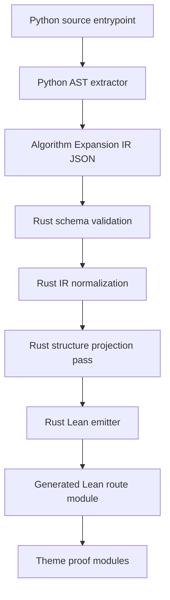

<!--
@dependency-start
responsibility Defines the generic Algorithm IR to Lean lowering architecture.
upstream implementation ../tools/algorithm_expansion_ir.md documents Python AST extraction input.
upstream design ../../agents/skills/formal-proof-workflow.md defines proof workflow consumption.
downstream design ../tools/algorithm_ir_to_lean.md documents operator-facing command usage.
downstream implementation ../../rust/agent-canon/src/algorithm_ir_to_lean.rs lowers Algorithm IR into Lean artifacts.
downstream implementation ../../tools/agent_tools/algorithm_proof_theme_runner.py calls the Rust lowering command.
@dependency-end
-->

# Algorithm IR To Lean Design

## Structure Contract

```text
structure_kind=refactor-design
audience=AgentCanon tool implementers and proof-workflow maintainers
decision_context=replace the old Python IR-to-Lean lowering with a generic compiler-style pipeline
first_artifact=concept-diagram AST-to-Lean ownership boundary
first_artifact_question=which layer owns parsing, normalization, structure projection, and Lean emission?
visual_plan=mermaid because the design is a multi-stage compiler pipeline with ownership boundaries
source_to_structure_map=algorithm_expansion_ir.py -> Python AST extraction; algorithm_ir_to_lean.rs -> Rust lowering; algorithm_proof_theme_runner.py -> orchestration; formal-proof-workflow -> proof consumer contract
metric_or_delta_contract=allowed delta: remove PDIPM-specific lowering and old Python lowering; forbidden delta: change target algorithm runtime behavior or encode theorem-specific proof facts in the generic lowering tool
ordered_structure=goal, non-goals, pipeline, IR boundary, structure expansion, Lean emission, validation, migration
invalid_interpretations=this design is not a convergence proof and does not authorize algorithm-specific hardcoding in the lowering tool
validation_gate=Rust unit tests plus regeneration of a proof theme from Python AST IR through Rust Lean emission
```

## Goal

The lowering path must work for any Python algorithm entrypoint that can be
represented by Algorithm Expansion IR. The tool chain is a compiler pipeline:

1. Python parses Python source and emits syntax-preserving Algorithm IR.
1. Rust validates and normalizes that IR.
1. Rust emits Lean data and route definitions.
1. Proof files consume the emitted route definitions and add theorem-specific
   mathematics outside the generic lowering tool.

The generic lowering tool must not know PDIPM field names, KKT symbols,
MINRES symbols, residual names, or a theorem's intended proof path.

## Non-Goals

- Do not translate or prove convergence inside `algorithm-ir-to-lean`.
- Do not emit PDIPM-specific typed structures such as `State`, `Direction`, or
  `stepUpdate`.
- Do not parse Python source strings in Rust. Rust consumes Python AST JSON
  already emitted by the Python extractor.
- Do not use expression strings as proof semantics. Strings remain display
  metadata only.
- Do not introduce wrappers whose only purpose is to preserve old generated
  file names or old proof shortcuts.

## Pipeline



The split follows standard compiler structure: Python owns source-language AST
handling, while the target backend owns lowering from an intermediate
representation into the target artifact. Python's standard `ast` module is the
source parser because it tracks Python grammar changes. LLVM Kaleidoscope and
MLIR's Toy tutorial both separate frontend AST work from lower-level IR and
code generation; this design follows that separation for proof artifacts.

References:

- Python `ast` documentation: <https://docs.python.org/3/library/ast.html>
- LLVM Kaleidoscope code-generation tutorial:
  <https://llvm.org/docs/tutorial/MyFirstLanguageFrontend/LangImpl03.html>
- MLIR Toy tutorial: <https://mlir.llvm.org/docs/Tutorials/Toy/>

## Python Extraction Contract

`algorithm_expansion_ir.py` is the only Python part of this path. It parses
source files without importing target modules and emits:

- `nodes`: implementation symbols and source spans.
- `edges`: recursive call/import/instance flow.
- `code_facts`: assignment and return equations.
- `expression_ast`: JSON serialization of the Python AST expression for each
  code fact.
- `control_facts`: statement-level branch and loop facts.

Python may use `ast.unparse` only for human-readable display strings. Rust must
ignore those strings for semantic lowering.

## Rust Lowering Contract

`agent-canon algorithm-ir-to-lean` consumes Algorithm IR JSON and performs all
IR-to-Lean work:

1. Validate required top-level IR fields.
1. Lower `expression_ast` into a generic Lean expression tree.
1. Normalize access chains such as `carry.x`, `state.answer.status`, and
   `problem.constraints[i]` into a structure projection representation.
1. Lower control facts into generic branch and loop records.
1. Emit ordered substitution routes per source symbol.

The emitted Lean module is data and route evidence, not a theorem-specific
model. Any typed theorem-facing specialization belongs in a separate proof
module that consumes the generated route module.

## Structure Expansion

Structure expansion happens after IR extraction and before Lean emission. This
is deliberate:

- Python AST extraction should preserve source structure rather than guessing a
  proof-oriented representation.
- Rust can normalize `Attribute`, `Subscript`, constructor keyword calls, and
  destructuring uniformly across algorithms.
- Proof modules can request theorem-specific projections from the generated
  access paths without re-running source extraction.

The normalized representation should be generic:

```text
ProjectionPath(root, segments)
segment = attribute(name) | index(expr) | slice(lower, upper, step)
```

Examples:

- `carry.x` becomes `ProjectionPath("carry", [attribute("x")])`.
- `direction.dlam_eq` becomes
  `ProjectionPath("direction", [attribute("dlam_eq")])`.
- `constraints[i].value` becomes
  `ProjectionPath("constraints", [index(i), attribute("value")])`.

No pass may contain a table that maps `_pdipm_step_update` to `x_next`,
`s_next`, `lam_eq_next`, or similar algorithm-specific names.

## Lean Emission

The generic Lean output contains:

- an `Expr` inductive for lowered operations;
- a `ProjectionPath` representation for structure access;
- `CodeEquation` records for assignment and return equations;
- one named `fact_... : CodeEquation` Lean definition per code fact, so proof
  modules consume generated equations directly instead of indexing anonymous
  lists;
- `ControlFact` records for branches and loops;
- `SubstitutionRoute` definitions grouped by implementation symbol.

The generated file must not contain:

- raw-expression escape constructors;
- interpreter axioms such as `Env`, `Value`, `eval`, or `bind`;
- PDIPM-specific typed records;
- theorem-specific assumptions or certificates.

## Theme Proof Usage

Proof themes should import generated route modules and add their own typed
mathematical interpretation. For PDIPM, the proof theme may define PDIPM
state, residual, KKT, or step lemmas, but those definitions must be justified
by consuming generic generated equations and projection paths.

This keeps the proof path auditable:

1. Source code changes regenerate Algorithm IR.
1. Rust lowering regenerates generic Lean route evidence.
1. Theme proof files either still typecheck or expose the missing bridge.

## Migration Plan

1. Remove the previous Python lowering command.
1. Remove old tests that execute the previous lowering script.
1. Add the Rust `algorithm-ir-to-lean` command to the AgentCanon CLI.
1. Update the theme runner to call the Rust command.
1. Remove algorithm-specific generated shapes from the generic lowering command.
1. Regenerate proof-theme Lean route modules.
1. Update docs and skills to point only at the Rust lowering command.

## Validation

Minimum validation for this refactor:

- Rust unit tests for AST-expression lowering.
- Rust unit tests for projection-path normalization.
- Rust unit tests for control-fact lowering.
- A proof-theme regeneration smoke test from Python AST IR through Rust Lean
  output.
- A stale-reference search proving the deleted Python lowering command is no
  longer documented or invoked.
