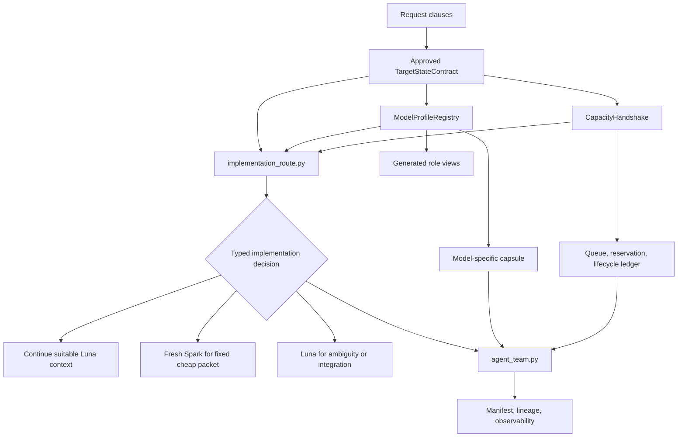

<!--
@dependency-start
contract design
responsibility Defines Target-State-First Spark implementation routing and model/profile-specific prompt materialization.
upstream design ../README.md design-document index and canonical design ownership
upstream design dependency-manifest-design.md dependency evidence and header contract
upstream design ../runtime/SHARED_RUNTIME_SURFACES.md AgentCanon source/view ownership
upstream design ../conventions/object-oriented-design.md OOP responsibility and dependency-direction rules
upstream design ../runtime/runtime-profiles-and-check-matrix.md validation profile and closeout routing
upstream design ../../agents/task_catalog.yaml workflow activation and role topology
upstream design ../../agents/agents_config.json permanent role ownership and artifact policy
upstream design ../../agents/canonical/CODEX_SUBAGENTS.md subagent inventory and handoff contract
upstream design ../../agents/COMMUNICATION_PROTOCOL.md context capsule and lineage contract
upstream design ../../agents/canonical/CODEX_WORKFLOW.md executable workflow gates
upstream design ../../agents/skills/agent-orchestration.md routing and handoff rules
upstream design ../../agents/skills/subagent-bootstrap.md writer selection and lifecycle rules
upstream design ../../agents/skills/task-routing.md public route/tool ownership rules
upstream design ../../agents/skills/oop-type-design.md approved OOP type and capability-route ownership
upstream implementation ../../tools/agent_tools/skill_route_catalog.py canonical explicit skill capability catalog/index owner
upstream implementation ../../tools/agent_tools/capability_route.py canonical explicit skill capability preflight/decision owner
upstream implementation ../../tools/agent_tools/check_design_doc_claims.py current implementation-backed design claim checker
downstream implementation ../../tools/agent_tools/agent_team.py packet projection, queueing, lineage, and generated views
downstream implementation ../../tools/agent_tools/route.py existing public skill route composition/rendering; implementation-model imports forbidden
downstream implementation ../../tools/agent_tools/check_agent_runtime_alignment.py static runtime/profile/view checker
downstream implementation ../../tools/agent_tools/evaluate_codex_agent_roles.py role/profile/capacity evaluation
downstream implementation ../../tools/agent_tools/evaluate_skill_workflow_prompts.py prompt-contract evaluation
downstream design ./README.md design index entry
@dependency-end
-->

# Codex Spark implementation routing and model-specific prompt materialization

Status: target structure rebound exactly once to AgentCanon main
`404678e1e9c242737e2f610e98743328931edd8f` (tree
`2d04030ea757d275936a6c1f441a05a67190402d`) and frozen by
`user-contract://2026-07-18/decision-sufficiency-freeze-v1`; implementation is
the immediate transition.

Path convention: paths in this document are AgentCanon-relative because the
review root is an isolated AgentCanon clone. In the template parent, resolve
the same path beneath `vendor/agent-canon/`. A source packet carries both the
relative path and its root key (`agent_canon` or `workspace`); a worker may not
infer a different path from checkout layout.

This document is the implementation contract for making `spark_worker` a
first-class implementation-worker candidate after design or repair is fixed.
It is design-only: no source, runtime configuration, generated view, test, or
workflow implementation is changed by this document's creation. The worker
must use this document and its approved successor packet, not chat history, as
the implementation authority.

## Evidence And Assumption Ledger

- Evidence sources: AgentCanon main commit
  `404678e1e9c242737e2f610e98743328931edd8f` and tree
  `2d04030ea757d275936a6c1f441a05a67190402d`; current configuration and owner
  paths `.codex/config.toml`
  (`42143eef0837dde325d52296c3c3b1fe74d5d48476c832ff97af46e377c3e49f`),
  `.codex/README.md`
  (`07783939c5bfd9f2be7f948ab3491244720d25d8d7027abb356db39bf22989b4`),
  `agents/task_catalog.yaml`
  (`63214bd1fd2c43ae6dff0af392e535f45a250c33474e8331aa454067fadc7fff`),
  `agents/agents_config.json`
  (`1e4ad31a154d6bf85c989ac441d9a54f26d937de5d23e27684c369b8f42440a5`),
  `agents/canonical/CODEX_SUBAGENTS.md`
  (`2a0965c7ae6583ea6d2597d7941e04eac1f1730d1154f729b521fc71137b1169`),
  `agents/canonical/CODEX_WORKFLOW.md`
  (`cf6b4940fdaebb0e5019b6451e91fe420a8710b1258c8950fb4f824cbb3e426a`),
  and `agents/COMMUNICATION_PROTOCOL.md`
  (`9213c4ff92a814298da78b8db34425765e256908de4f5178cf9ceeb95272cff6`).
- Evidence sources: current executable views `.codex/agents/worker.toml`
  (`571d8df93d186a45025968af806ab60a1539fc107c9de25bd47dd9cecd1d7913`)
  and `.codex/agents/spark_worker.toml`
  (`c662747cde3d7dbfbcd945d9eae73b2a2ad2d86b5c5e62f0c5f28b187f84cb94`)
  establish the eight executable TOML fields and current
  Luna/Spark model tuples; all 34 view paths are inventoried in section 2.3.
- Evidence sources: the landed explicit-skill/OOP predecessor identities are
  `agents/skills/oop-type-design.md`
  (`147906d68db1c24eed3c12a53f07c914130d9fe99c53977af94a0613c424e1c6`),
  `tools/agent_tools/skill_route_catalog.py`
  (`c09ef7d29a378aa31000157847e7d742cea77e734c4cc2c155d712c582161e28`),
  `tools/agent_tools/capability_route.py`
  (`f9bdc819cae5f66c7f3450f2948fde7d89668a9248e57e80b153b5de90534482`),
  and `tools/agent_tools/route.py`
  (`544ce80bfba6be4817f28e4c16801483f9e929e5502a6e7698d7f328f50e4ee7`).
- Evidence sources: user-observed runtime events establish only that a
  completed-but-open descendant occupied a slot until close, a subsequent
  spawn then succeeded, the runtime emitted a thread-limit rejection, and a
  distinct model-capacity rejection was observed. They do not establish a
  universal numeric platform cap or that configured 24 was ignored.
- Assumptions: Sol/Luna/Spark/mini role assignments and the required semantic
  changes are explicit request inputs. Runtime performance superiority is not
  assumed; future assignment changes require the paired attributed gate in
  section 11. Platform capacity remains unknown unless a provenance-bearing
  runtime readback supplies it.
- Parent-doc alignment: current parents govern their existing behavior until
  this approved TargetStateContract is implemented. Contradictory
  minimal/incremental/static-budget prose is a named replacement set, not
  evidence that the target behavior already exists.
- Refactor handoff: the OOP predecessor is landed and read-only. The planned
  sibling `tools/agent_tools/implementation_route.py` owns fixed
  implementation-packet/profile decisions without adding policy to
  `tools/agent_tools/route.py`.
- Implementation gap evidence: P5 readback recorded
  `StructuralDesignGap(P1_P2_OWNER_CLI_ENTRYPOINTS)` after the P1 and P2
  modules passed their original owner tests but exposed neither of the CLI
  entrypoints named by the frozen P5 validation boundary. The repair changes
  only those predecessor public/API and owner-gate shapes: P1 owns
  `model_profile_registry_cli_v1`, P2 owns `capacity_handshake_cli_v1`, and P5
  consumes their successful gate identities without reimplementing either
  invariant.

Claims in this artifact have three evidence classes: `current_state` uses the
identities above; `request_contract` uses the RC clauses below; `target_state`
is an approved but not-yet-implemented obligation closed only by final
source/view/checker/eval readback. An unverified assumption blocks approval.
The implementation extends `check_design_doc_claims.py` with this typed class
distinction; it must not satisfy a target-state claim by pretending a planned
file already exists.

## 1. Request clauses and decision authority

The following clause IDs are frozen for this design pass.

| ID | Requirement | Authority |
| --- | --- | --- |
| RC-01 | Make `spark_worker` a first-class implementation-worker option only after the target design/repair is fixed. | Current request |
| RC-02 | Route by typed capability and immutable packet evidence; do not use keywords, tool availability alone, or compatibility fallback. | Current request |
| RC-03 | Keep Luna responsible for ambiguous design, causal repair, cross-owner integration, and review. | Current request |
| RC-04 | Specialize prompt construction per configured model/profile with exact capsule schema, context boundary, reasoning/verbosity, return schema, and checkpoint behavior. | Current request |
| RC-05 | Reuse a suitable accumulated agent context for the same selected role and immutable packet; before a fixed packet becomes Spark-eligible, select the initial fresh Spark only when it is cheaper than continuing a suitable reasoning worker. Once Decision Sufficiency fixes `execute_spark`, a reasoning-worker continuation cannot override it; reuse is then limited to the already-launched Spark for that same packet. | Current request |
| RC-06 | Preserve parent lineage and nested-agent observability. | Current request |
| RC-07 | Use one canonical typed model/profile registry with generated role views; do not duplicate prompt prose or profile configuration. | Current request |
| RC-08 | Keep model/profile selection out of `route.py`; integrate with the landed OOP capability-routing owners through a declared seam and order. | Current request, active integration note, and main `404678e1` rebind |
| RC-09 | Apply Target-State-First universally to every repository-changing task. | Global contract update |
| RC-10 | Add a typed `TargetStateContract`; Spark eligibility requires it to be frozen, hashed, and approved. | Global contract update |
| RC-11 | Replace contradictory minimal, incremental, conservative, provisional-handoff, and compatibility-default language on owning surfaces. | Global contract update |
| RC-12 | Distinguish requested/configured, platform effective, workflow DAG demand/budget, write-scope, and nested-reservation capacity; schedule rather than lose work when the runtime saturates. | Capacity evidence update |
| RC-13 | Define capacity handshake/readback, typed saturation, complete descendant lifecycle observability, automatic close, reservation release, capacity ledger ownership, queueing, and session-reload/restart-required semantics. | Capacity evidence update |
| RC-14 | Remove fixed active-four/write-two and hard-ceiling wording/checkers. Generate the requested upper limit from the declared team topology, prove loader/restart readback, and never probe capacity with disposable spawns. | Capacity evidence update plus direct setting-change clause |
| RC-15 | Plan empirical evaluation with actual fresh Spark fixed-task runs, Luna unresolved-task controls, and gpt-5.4-mini only for skill comprehensibility. | Current request |
| RC-16 | Write the design, obtain independent prompt-config and detailed-design review, repair until APPROVE, then return the exact design SHA and Spark-ready implementation packet. | Current request |
| RC-17 | Type every orchestration/model-packet trust boundary as input identity -> owned invariant -> evidence identity -> downstream consumer; downstream consumes upstream evidence identity and does not duplicate the upstream invariant check. | Current request |
| RC-18 | Materialize skill-specific tool calls as machine-readable canonical `tool_id` plus argument-schema `ToolCall` tokens from the same profile/capsule source; natural language carries intent and typed failure semantics only. | Current request |
| RC-19 | Treat requested/configured capacity, platform effective capacity, workflow DAG demand, write cap, and nested reservation as separate typed values; fix effective capacity at startup, emit typed restart-required evidence when reload is unavailable, and implement queued degradation without failed-spawn loss. | Current request |
| RC-20 | Treat terminal-but-open descendants as a first-class lifecycle-leak hypothesis: parent readback must expose the full descendant topology and statuses, completed or errored agents must close reliably and release reservations, and the capacity ledger must prove the release before promotion. | New capacity evidence |
| RC-21 | Make the lifecycle transition spawned -> active -> durable result/error evidence -> handed back -> all descendants closure verified -> closed -> reservation released canonical across orchestration, bootstrap, subagents, communication, and task close; completed-open, errored-open, missing handback, unknown descendant, or reservation leak fails closeout. Parent and child update the same typed ledger, and generated closeout packets include `close_agent` ToolCall tokens. | Current request |
| RC-22 | Add Decision Sufficiency/value-of-information: for all plausible states consistent with current evidence, if owner, edit mechanism, and validation action are identical, further investigation is forbidden and execution starts. Every additional read/search/check/review must name the decision and alternative branches it can change; no task-size class or hardcoded search/read/time/count budget may substitute for this test. A fixed packet routes directly to Spark and one owner gate. | Current request |
| RC-23 | Record model-service capacity rejection as a typed event distinct from thread/capacity-ledger saturation; neither event may be inferred from the other or trigger a compatibility model fallback. | Current request |
| RC-24 | Change the repository worker upper-limit setting to the topology-generated value, then publish, merge, and read back the approved implementation through the explicitly user-authorized AgentCanon PR transaction. | Direct user authorization |
| RC-25 | Integrate the Decision Sufficiency invariant directly into agent orchestration: do not preclassify task size; reject every read/search/check/review that lacks a machine-readable next decision and outcome-to-action branches; when all plausible states preserve owner, edit action, and validation action, route exactly one fixed packet to one Spark worker and one owning gate with no broad/history exploration, duplicate review, or extra agent; reopen investigation only when failure or new evidence makes those actions diverge. | Current request |
| RC-26 | A complete target structure is implementation-executable: it fixes every implementation-relevant owner, type/API/config/schema shape, path, dependency direction, transition, deletion/replacement mapping, and validation boundary, with no unresolved design decision. Approval transitions immediately to one direct materialization pass for each complete responsibility unit, followed by its owning gate. Spark performs no architectural interpretation; a structural contradiction returns one typed design-gap finding, the gap is repaired once, and the same Spark context resumes. Compile/static failures remain implementation feedback. Higher-reasoning coder substitution, smaller slices, speculative tests, repeated preflight, rollback checkpoints, and conservative fallback are forbidden compensations. | Current request |

Sol owns routing, packet construction, capacity readback, continuation-vs-
fresh choice, integration, promotion, and closeout. Luna owns unresolved design
or repair judgment, cross-owner conflict, and review judgments, including ship
review. Sol may promote or close out only after the required Luna decision is
approved; `revise` or `escalate` is blocking and cannot be overridden by a
second review. Spark owns only the exact implementation unit granted by an
approved packet and materializes that complete unit directly. A Luna
implementation profile remains valid only where the frozen responsibility
graph itself assigns Luna the cross-owner integration unit; Luna is never
substituted after Spark finds a structural gap. `skill_evaluator` owns only an explicit frozen
skill-evaluation scenario.

## 2. Abstract Design Frame

This frame is intentionally before the file-level plan. File scope is derived
from it and may not be reinterpreted by the implementation worker.

### 2.0 Frozen vocabulary and type conventions

The following types are introduced before any later section uses them. All
field names are snake_case, all digests are lowercase hexadecimal SHA-256, and
all serialized records use the listed field order. `Ref` values are immutable
artifact references; `Sha256` is a 64-character digest; `Id` values are opaque
stable identifiers; `Timestamp` is an RFC 3339 UTC timestamp; `uint64` values
are non-negative integers.

```text
KnownCapacity = uint64
CapacityValue = KnownCapacity | unknown
Status = pending | active | approved | completed | errored | failed | closed |
         queued | blocked | cancelled
AgentRuntimeStatus = pending_init | running | completed | errored | interrupted |
                     shutdown | not_found
TerminalExecutionStatus = completed | errored | cancelled
CloseReadbackStatus = completed | errored | interrupted | shutdown | not_found
LifecycleStatus = spawned | active | cancellation_requested |
                  durable_result_or_error_evidence |
                  durable_cancellation_evidence | handed_back |
                  descendants_closure_verified | close_requested | closed |
                  reservation_released
ToolCallToken = { token_version, call_id, tool_id, argument_schema_id,
                  arguments, failure_schema_id }
```

`TargetStateContract`, `ImplementationExecutionContract`,
`FixedImplementationPacket`,
`DecisionSufficiencyRecord`, `CapacitySnapshot`, `ThreadSaturationEvent`,
`ModelCapacityEvent`, `CapacityLedger`, `TrustBoundaryRecord`, and
`CloseoutPacket` are canonical typed records owned by the surfaces named in
the responsibility model. Later sections give their complete field order;
they are not free-form dictionaries or prose conventions. A missing required
field, an unknown enum value, or a digest mismatch is a typed validation
failure.

The OOP capability-routing predecessor is landed on main
`404678e1e9c242737e2f610e98743328931edd8f`. Its exact owners are
`tools/agent_tools/skill_route_catalog.py` for the explicit skill capability
catalog/index and `tools/agent_tools/capability_route.py` for raw-argv
preflight/immutable explicit-skill decisions; `tools/agent_tools/route.py`
composes and renders that public CLI route. This design does not modify or
duplicate those owners. The new sibling `implementation_route.py` consumes an
already fixed implementation packet and emits only a worker/profile/continuity
decision for `agent_team.py`; `route.py` never imports it.

### 2.1 Responsibility model

The design has five canonical layers.

1. **Target-state layer** — `TargetStateContract` fixes the completed
   responsibility graph, final paths, boundaries, public shapes, deletion set,
   dependency direction, migration order, and final validation/readback
   boundary. It is immutable once its digest is approved.
2. **Implementation-packet routing layer** — new
   `implementation_route.py` owns Spark eligibility, Decision Sufficiency,
   continuation-vs-fresh choice, and saturation-aware implementation candidate
   scheduling over an immutable `FixedImplementationPacket`. It has no skill
   catalog/index or keyword/prompt inference. The landed explicit-skill owners
   remain unchanged, `route.py` does not import this layer, and `agent_team.py`
   is its sole runtime consumer.
3. **Model-profile and prompt-materialization layer** — the new canonical
   `model_profile_registry` owner validates typed profiles, renders generated
   role views, and materializes a model-specific prompt capsule. It never
   infers eligibility from prose or keywords.
4. **Workflow/team layer** — `agent_team.py` projects packets into run
   manifests, records lineage, reserves nested capacity, queues ready work,
   reclaims terminal slots, and exposes observability. `task_catalog.yaml`
   activates roles and stage topology; it does not duplicate model prose or
   capacity arithmetic.
5. **Runtime/view/checker layer** — `.codex/config.toml` exposes configured
   runtime settings; generated `.codex/agents/*.toml` views expose executable
   role settings; checkers and evals verify that views match the canonical
   registry and that no forbidden fallback or duplicate surface remains.

Every transition between these layers carries a typed trust-boundary record.
An owner proves its own invariant once, publishes an evidence identity, and
the downstream owner verifies the identity and consumes the result; it does
not rerun the upstream invariant as a second source of truth.

### 2.2 Concept graph

The diagram answers which owner produces each decision or evidence identity
before `agent_team.py` can launch a worker.



`route.py` is intentionally absent from this implementation-decision graph. It
composes the landed explicit-skill `capability_route.py` and has no import edge
to `implementation_route.py`, `model_profile_registry.py`, or
`capacity_handshake.py`.

The dependency direction is one-way:

```text
TargetStateContract --> implementation_route --> model_profile_registry
TargetStateContract --> capacity_handshake --> agent_team
task_catalog / agents_config --> generated views and activation checks
agent_team --> implementation_route
skill_route_catalog --> capability_route --> route.py
route.py -X-> implementation_route
model_profile_registry -X-> route.py
capacity_handshake -X-> route.py
```

The profile materializer must not call either landed explicit-skill owner.
`implementation_route.py` alone consumes a verified fixed implementation
packet, continuity evidence, and capacity evidence, selects one already-
registered profile, and passes a typed materialization request to
`model_profile_registry.py`. `skill_route_catalog.py`, `capability_route.py`,
and `route.py` never select an implementation model/profile. This prevents
circular policy and keeps both decision families replaceable.

### 2.3 Target-State-First contract

Every repository-changing task must carry a typed `TargetStateContract` before
editing or implementation handoff. Intake may discover evidence and may queue
read-only work, but an intake packet, provisional run bundle, or nearest-file
finding is not an implementation authorization.

The canonical field order is:

```text
TargetStateContract {
  contract_version: uint64
  contract_id: Id
  request_clause_ids: nonempty list[Id]
  responsibility_graph: ResponsibilityGraph
  final_path_layout: FinalPathLayout
  owner_invariant_boundaries: OwnerInvariantBoundaries
  public_api_config_schema_shapes: PublicShapeIndex
  deletion_replacement_set: DeletionReplacementIndex
  dependency_import_direction: ImportDirectionContract
  integration_migration_order: nonempty list[Id]
  final_validation_readback_boundary: ValidationReadbackBoundary
  implementation_execution_contract: ImplementationExecutionContract
  fixed_evidence_refs: FixedEvidenceRefs
  design_freeze_authority_ref: Ref
  review_history_ref: Ref
  contract_sha256: Sha256
  status: approved | superseded
}

ResponsibilityGraph {
  graph_id: Id
  write_policy: deny_unlisted
  units: nonempty list[ResponsibilityUnit]
  edges: list[DependencyEdge]
}

ResponsibilityUnit {
  unit_id: Id
  exact_owner: Id
  responsibility: string
  owner_invariants: nonempty list[Id]
  allowed_write_set: list[Ref]
  forbidden_write_set: list[Ref]
  deletion_set: list[Ref]
  replacement_set: list[Ref]
  implementation_profile: Id
  owner_gate_id: Id
  predecessors: list[Id]
}

DependencyEdge = "<predecessor_unit_id>-><successor_unit_id>"

FinalPathLayout {
  retained_or_added_source_paths: nonempty list[Ref]
  generated_view_glob: Ref
  generated_view_count: uint64
  generated_run_artifacts: list[Ref]
  deleted_paths: list[Ref]
  moved_paths: list[Ref]
}

OwnerInvariantBoundaries {
  unit_records_source: Ref
  unlisted_write_policy: deny
  landed_oop_owner_write_policy: read_only_hash_bound
  shared_checkout_write_policy: forbidden
}

PublicShapeIndex {
  registry_schema_id: Id
  capacity_policy_schema_id: Id
  capacity_consumer_binding_schema_id: Id
  target_state_schema_id: Id
  implementation_execution_contract_schema_id: Id
  implementation_packet_schema_id: Id
  release_authority_schema_id: Id
  release_transaction_schema_id: Id
  branch_guard_readback_schema_id: Id
  prompt_capsule_schema_ids: nonempty list[Id]
  tool_schema_ids: list[Id]
  task_catalog_capacity_shape: list[Ref]
  team_manifest_capacity_shape: list[Ref]
  public_functions: nonempty list[Id]
}

DeletionReplacementIndex {
  unit_records_source: Ref
  compatibility_layers: forbidden
  provisional_duplicate_truth: forbidden
}

ImportDirectionContract {
  required_edges: list[Id]
  forbidden_edges: list[Id]
}

ValidationReadbackBoundary {
  production_first_checks: nonempty list[string]
  static_readbacks: nonempty list[Id]
  independent_review_gate: Id
  release_readback: nonempty list[Id]
}

ImplementationExecutionContract {
  implementation_executable: true
  unresolved_design_decision_ids: empty list[Id]
  transition_guard: approved_target_and_empty_unresolved_design_decisions
  materialization_scope: complete_responsibility_unit
  materialization_mode: one_direct_pass
  owning_gate_timing: after_completed_structure
  checkpoint_semantics: observational_nonblocking
  implementation_feedback_classes:
    [compile_failure, static_validation_failure,
     deterministic_acceptance_failure]
  design_reopen_trigger: target_structure_contradiction
  structural_gap_action: repair_gap_once_then_resume_same_worker
  same_worker_context_required_after_gap_repair: true
  prohibited_compensations:
    [higher_reasoning_coder_substitution, micro_slice_split,
     speculative_test_expansion, repeated_preflight,
     rollback_checkpoint_gate, conservative_fallback,
     compatibility_layer]
}

FixedEvidenceRefs {
  bound_base_commit: Sha256
  bound_base_tree: Sha256
  oop_type_design_sha256: Sha256
  skill_route_catalog_sha256: Sha256
  capability_route_sha256: Sha256
  route_sha256: Sha256
  configured_max_threads_source_sha256: Sha256
  configured_max_threads_current_file_value: uint64
  configured_max_threads_target_file_value: uint64
  configured_max_threads_target_derivation_ref: Ref
  configured_max_threads_loaded_value: uint64 | unknown_until_startup_handshake
  declared_team_peak_family_id: Id
  declared_team_peak_direct_frontier_count: uint64
  declared_team_peak_nested_reservation_count: uint64
  platform_advertised_effective_cap: CapacityValue
  observed_thread_error_class: runtime_thread_spawn_rejected
  observed_primary_capacity_hypothesis: completed_open_reservation_leak
  observed_model_error_class: model_capacity_rejected
  decision_sufficiency_record_id: Id
  design_freeze_authority_ref: Ref
  implementation_packet_set_ref: Ref
  mutation_authority_id: Id
}
```

Field semantics are fixed:

- `responsibility_graph` names the complete final nodes, edges, replaceable
  units, and cross-owner boundaries. A partial graph is invalid.
- `final_path_layout` names every retained canonical source, generated view,
  deleted path, and moved path. No worker may invent a compatibility path.
- `owner_invariant_boundaries` names each owner, responsibility, invariant,
  write scope, and forbidden responsibility.
- `public_api_config_schema_shapes` fixes public symbols, config keys, packet
  schemas, CLI flags, and generated manifest fields before editing.
- `deletion_replacement_set` records old prose, old config, duplicate helper,
  wrapper, view, and path entries to delete or replace, plus their migration
  consumers.
- `dependency_import_direction` records header and code/import edges and
  rejects a reverse edge or import cycle.
- `integration_migration_order` is a DAG of canonical owner changes,
  generated-view refreshes, caller migration, checker updates, and removal.
- `final_validation_readback_boundary` names the exact checkers, tests, evals,
  generated-view comparison, queue/readback evidence, and final source paths.
- `implementation_execution_contract` proves that the target is executable,
  not merely explanatory. Its unresolved-design list must be empty. Passing
  the transition guard dispatches the complete responsibility unit immediately
  for one direct materialization pass; packet acknowledgements and edit or
  validation observations do not interleave another approval gate. The owning
  gate runs only after the completed structure is materialized.
- A compile, static-validation, or deterministic-acceptance failure stays in
  the same implementation pass. Only evidence of a contradiction in an owner,
  public shape, path, dependency, transition, deletion/replacement mapping, or
  validation boundary is a `target_structure_contradiction`. Spark returns one
  typed structural gap; the parent repairs that exact gap and resumes the same
  Spark context. It may not substitute a reasoning coder, split the unit,
  expand tests speculatively, repeat preflight, or introduce a rollback or
  conservative compatibility route.
- `fixed_evidence_refs` includes source packet digests, base/predecessor
  identities, dependency graph, responsibility-scope result, stale-surface
  result, Decision Sufficiency record, max-threads loader evidence, and
  capacity snapshot.
- `design_freeze_authority_ref` records the decision authority that closes the
  target. `review_history_ref` preserves earlier reviewer evidence but does not
  create another pre-implementation gate.
- `status=approved` is the only status accepted by a write-capable handoff.
  Any evidence that changes the target state creates a new contract digest and
  requires design and flow re-review before work resumes.

The design is therefore complete before implementation, but not frozen forever:
new request, owner, dependency, or checker evidence may revise the target state.
Revision is a design change, not an incremental implementation exception. Once
the target is complete and no such contradiction exists, implementation is the
immediate default; precautionary investigation or review has no transition.

#### Concrete target-state instance for this design

The completed machine-readable instance is
`/tmp/spark-design-isolation-84SDBM/target-state-contract-v1.json`. Its full-file
SHA-256 is
`1f38419ad25a942b098924c8a3a001e4be14f39d02698527f20a386f6e9006a4`;
its verified canonical-contract digest is
`e8ae83767a4c3a7edb10a59f611c9f949ac8ea0563dcf844329f2be95c9a2762`.
The latter uses the canonical byte grammar defined below: compact sorted UTF-8
JSON followed by exactly one LF, with `contract_sha256` omitted. The stored
value and a fresh computation must be equal before review or handoff.

That instance contains every field in the ordered schema above. It fixes
request clauses `RC-01` through `RC-26`; responsibility units
`U0_claim_evidence`, `U1_model_profile_registry`, `U2_capacity_handshake`,
`U3_implementation_route`, `U4_team_lifecycle_integration`,
`U5_runtime_profile_projection`, `U6_policy_document_projection`, and
`U7_final_integration_readback`; all predecessor edges; each unit's exact owner,
invariants, allowed write set, critical forbidden paths, deny-unlisted policy,
deletion/replacement selectors, implementation profile, and one owner gate;
the final source/generated/deleted/moved path layout; closed public API/config
schema IDs and function names; required and forbidden import edges; the exact
integration order; production-first checks and final PR/merge/projection
readback; immutable base/predecessor/config evidence; review refs; digest; and
`status=approved` as the final target value. `status=approved` is a target-state
claim backed by the direct Decision Sufficiency freeze authority. The handoff
gate separately requires that authority identity and live capacity bindings;
historical review records are evidence, not another design wave.

The companion is the sole canonical instance. Any Markdown table or list below
is a reader projection checked against its digest; it cannot add, remove, or
reassign a path or responsibility. The implementation packet set is the
generated role view of this instance at
`/tmp/spark-design-isolation-84SDBM/implementation-packet-set-v1.json`, with
full-file SHA-256
`9bc9360b04edb4d96d0af63ab9d3c8f75dfadf1f5922ecfd16c4f378a644ad3f`
and verified canonical packet-set digest
`0a905876b9c01fb54535dd5395ac472a3485df8cf8c571ae148e357780d28c48`.
Packet selection and order are already fixed there; a worker cannot choose a
unit later.

The following is the non-authoritative reader path index for that completed
instance:

```text
projection_id: codex_spark_model_profile_routing_reader_index_v1
source_contract_id: codex_spark_model_profile_routing_v1
base_commit: 404678e1e9c242737e2f610e98743328931edd8f
base_tree: 2d04030ea757d275936a6c1f441a05a67190402d
projection_status: generated_from_verified_contract
canonical_root: agent_canon
bound_predecessor_paths:
  - agents/skills/oop-type-design.md
  - tools/agent_tools/skill_route_catalog.py
  - tools/agent_tools/capability_route.py
  - tools/agent_tools/route.py
source_paths:
  - agents/model_profiles.toml
  - agents/capacity_policy.toml
  - tools/agent_tools/model_profile_registry.py
  - tools/agent_tools/capacity_handshake.py
  - tools/agent_tools/implementation_route.py
  - tools/agent_tools/agent_team.py
  - tools/agent_tools/task_start.py
  - tools/agent_tools/bootstrap_agent_run.py
  - tools/agent_tools/task_close.py
generated_view_paths:
  - .codex/agents/artifact_reviewer.toml
  - .codex/agents/benchmark_reviewer.toml
  - .codex/agents/citation_evidence_reviewer.toml
  - .codex/agents/cpp_reviewer.toml
  - .codex/agents/detailed_design_reviewer.toml
  - .codex/agents/detailed_designer.toml
  - .codex/agents/diff_triage_reviewer.toml
  - .codex/agents/docs_workflow_steward.toml
  - .codex/agents/document_flow_reviewer.toml
  - .codex/agents/execution_planner.toml
  - .codex/agents/experiment_runner.toml
  - .codex/agents/explorer.toml
  - .codex/agents/fair_data_reviewer.toml
  - .codex/agents/literature_researcher.toml
  - .codex/agents/logic_gap_reviewer.toml
  - .codex/agents/long_form_writer.toml
  - .codex/agents/manager_reviewer.toml
  - .codex/agents/ml_science_reviewer.toml
  - .codex/agents/notation_definition_reviewer.toml
  - .codex/agents/oop_readability_reviewer.toml
  - .codex/agents/plan_reviewer.toml
  - .codex/agents/project_reviewer.toml
  - .codex/agents/prompt_config_reviewer.toml
  - .codex/agents/python_reviewer.toml
  - .codex/agents/report_reviewer.toml
  - .codex/agents/reproducibility_reviewer.toml
  - .codex/agents/requirements_organizer.toml
  - .codex/agents/reviewer.toml
  - .codex/agents/scientific_computing_reviewer.toml
  - .codex/agents/ship_reviewer.toml
  - .codex/agents/skill_evaluator.toml
  - .codex/agents/spark_worker.toml
  - .codex/agents/test_designer.toml
  - .codex/agents/worker.toml
policy_paths:
  - agents/task_catalog.yaml
  - agents/agents_config.json
  - agents/canonical/CODEX_SUBAGENTS.md
  - agents/canonical/CODEX_WORKFLOW.md
  - agents/canonical/README.md
  - agents/README.md
  - agents/COMMUNICATION_PROTOCOL.md
  - agents/skills/agent-orchestration.md
  - agents/skills/subagent-bootstrap.md
  - agents/skills/task-routing.md
  - AGENTS.md
  - ROOT_AGENTS.md
  - documents/codex/AGENTS_COORDINATION.md
  - documents/README.md
  - documents/runtime/SHARED_RUNTIME_SURFACES.md
  - documents/design/dependency-manifest-design.md
  - documents/design/README.md
  - documents/design/codex-spark-implementation-routing.md
  - documents/codex/prompt-skill-evaluation-checklist.md
  - .codex/config.toml
  - .codex/README.md
evidence_paths:
  - evidence/agent-evals/agent_behavior_eval.toml
  - evidence/agent-evals/skill_workflow_prompt_eval.toml
checker_paths:
  - tools/agent_tools/check_agent_runtime_alignment.py
  - tools/agent_tools/evaluate_codex_agent_roles.py
  - tools/agent_tools/evaluate_skill_workflow_prompts.py
  - tools/agent_tools/check_design_doc_claims.py
test_paths:
  - tests/agent_tools/test_model_profile_registry.py
  - tests/agent_tools/test_implementation_route.py
  - tests/agent_tools/test_capacity_handshake.py
  - tests/agent_tools/test_check_design_doc_claims.py
  - tests/agent_tools/test_task_close.py
  - tests/agent_tools/test_agent_team_templates.py
  - tests/agent_tools/test_check_agent_runtime_alignment.py
  - tests/agent_tools/test_evaluate_codex_agent_roles.py
  - tests/agent_tools/test_evaluate_skill_workflow_prompts.py
```

The exact replacement set is: numeric budget/hard-cap statements in
`agents/task_catalog.yaml`, `agents/canonical/CODEX_SUBAGENTS.md`,
`agents/canonical/CODEX_WORKFLOW.md`, `agents/skills/subagent-bootstrap.md`,
and `.codex/README.md`; duplicated model/prompt fields in the 34 generated
role views above; generic prompt construction branches in
`tools/agent_tools/agent_team.py`; and duplicate lifecycle/queue arithmetic
outside `tools/agent_tools/capacity_handshake.py` and
`tools/agent_tools/task_close.py`; task-size/risk labels or hardcoded
read/search/check/review/time/count budgets used as investigation authority;
any precautionary micro-slice, speculative-test, repeated-preflight,
rollback-checkpoint, worker-substitution, or conservative fallback branch after
the executable target transition guard passes; and any branch that conflates
model-service capacity with thread exhaustion.
These are replacement/deletion targets,
not compatibility surfaces.

The final import direction is:

```text
implementation_route -> model_profile_registry
implementation_route -> capacity_handshake
agent_team -> model_profile_registry
agent_team -> capacity_handshake
agent_team -> implementation_route
task_close -> capacity_handshake
skill_route_catalog -> capability_route -> route
route -X-> implementation_route
route -X-> model_profile_registry
route -X-> capacity_handshake
checkers/evals -> registry, handshake, team, task_close (read-only)
```

The integration DAG is: bind the landed OOP owners at main `404678e1`; add
registry, Decision Sufficiency, implementation-route, and capacity types; add
materializers and ledger APIs; migrate team/closeout;
regenerate all 34 views; migrate catalog/config/docs while preserving
`route.py` as the public task-routing owner; update checkers/tests/evals;
remove replacement surfaces; perform final readback. Each node is an
independently complete responsibility unit in the final DAG and materializes
once against its final structure before its owning gate. No reverse import,
worker-selected path, precautionary micro-slice, or interleaved review is
permitted.

The final readback boundary is the exact source/view/checker/test list above,
the pinned landed OOP owner files and hashes, the generated-view digest
manifest, Decision Sufficiency evidence, the shared capacity ledger/closeout
packet, and the empirical scenario evidence.
`TargetStateContract.contract_sha256` is the SHA-256 of the canonical byte
grammar below with `contract_sha256` omitted.
The implementation packet must embed this concrete instance and its digest;
it may not replace it with a summary.

#### Canonical JSON digest byte grammar

Contract, individual packet, and packet-set identities use one grammar:

```text
canonical_json_line(record, omitted_self_field) =
  json.dumps(
    record without omitted_self_field,
    ensure_ascii=false,
    sort_keys=true,
    separators=(",", ":")
  ).encode("utf-8") + b"\n"
digest = sha256(canonical_json_line(...)).hexdigest()
```

There is no leading byte, indentation, intra-record whitespace, CR, blank line,
or second terminal LF. The contract omits only `contract_sha256`. Each
individual packet omits only its own `packet_sha256`. Packet digests are
computed first and stored in their packet records. The packet set then omits
only `packet_set_sha256`; it includes every stored individual `packet_sha256`.
The full-file SHA-256 identities are separately computed over the exact pretty-
printed artifact files and must never be substituted for canonical record
digests.

The production fixture
`tests/agent_tools/test_model_profile_registry.py::test_canonical_digest_contract_packet_and_set`
must cover all three levels and assert the current known contract digest
`e8ae83767a4c3a7edb10a59f611c9f949ac8ea0563dcf844329f2be95c9a2762`,
all eight packet digests in section 13, and packet-set digest
`0a905876b9c01fb54535dd5395ac472a3485df8cf8c571ae148e357780d28c48`.
It also asserts that hashing the compact bytes without the required LF, with a
second LF, or with the self-digest field present fails identity validation. The
design-time checker-equivalent commands use `jq -cS` without `-j`; its exactly
one output LF is part of the digest by this grammar.

The reviewed Markdown, canonical `TargetStateContract`, and static
implementation packet set form one design transaction. Their digests are fixed
before freeze; the parent does not select a unit or fill a design field after
freeze. After freeze it may bind only the packet's listed runtime slots:
the direct user freeze identity, predecessor candidate digests, current
capacity snapshot/reservation, and lineage. Handoff remains blocked until
`TargetStateContract.status=approved`; its digest verifies; prompt-config,
`detailed-design`, and `document-flow` history is durably retained; the direct
`decision_sufficiency_user_freeze_ref` authorizes this exact Markdown SHA; the
landed OOP owner files verify against main `404678e1` and tree
`2d04030e`; the packet-set
digest and selected static packet verify; and the capacity handshake has
produced current-session readback. No placeholder, unlisted runtime slot, or
stale predecessor ref is accepted. A `StructuralDesignGap` changes only the
contradicted target field, renews the Markdown/contract/packet identities, and
resumes the same Spark under a renewed direct freeze; it does not start another
review wave or mutate closed target fields in place.

### 2.3.1 Decision Sufficiency and value of information

The model-profile/context materialization owner defines the record; the
implementation-route owner evaluates it. Let `E` be the immutable evidence
snapshot, `H(E)` the nonempty set of plausible states consistent with `E`, and
`A(h) = (owner, edit_mechanism, validation_action)` for each `h` in `H(E)`.
If `A(h)` is identical for every plausible state, the decision is sufficient:
further investigation is forbidden and execution starts. Confidence,
repository size, task-size labels, elapsed time, token count, read count,
search count, or a hardcoded budget cannot override this rule.
There is no prior `simple`/`complex` classification. The only routing test is
whether the complete owner/edit/validation action is invariant over `H(E)`.

The exact ordered record is:

```text
DecisionSufficiencyRecord {
  record_version: uint64
  decision_id: Id
  evidence_snapshot_ref: Ref
  evidence_snapshot_sha256: Sha256
  plausible_state_set_ref: Ref
  plausible_state_set_sha256: Sha256
  plausible_state_ids: nonempty list[Id]
  owner_by_state: map[Id, Id]
  edit_mechanism_by_state: map[Id, Id]
  validation_action_by_state: map[Id, Id]
  action_equivalence: identical | divergent
  decision_that_more_evidence_can_change: Id | none
  evidence_request_ref: Ref | none
  fixed_packet_ref: Ref | none
  fixed_packet_sha256: Sha256 | none
  owner_gate_id: Id | none
  next_action: execute_spark | continue_luna | investigate | blocked
  status: completed | blocked
}

EvidenceRequest {
  request_version: uint64
  request_id: Id
  decision_id: Id
  decision_that_can_change: Id
  operation: read | search | check | review
  evidence_source_ref: Ref
  outcome_branches: nonempty list[Id]
  action_by_outcome: map[Id, OwnerEditValidationAction]
  stopping_condition: string
  status: proposed | authorized | rejected
}

OwnerEditValidationAction {
  owner: Id
  edit_mechanism: Id
  validation_action: Id
}
```

An `EvidenceRequest` is valid only when at least two plausible outcomes map to
different `OwnerEditValidationAction` values and the named decision is still
open. If every outcome preserves the same action, the materializer emits
`no_value_of_information`, rejects the read/search/check/review, and sets
`next_action=execute_spark` for a Spark-eligible fixed packet. It does not ask
for a smaller sample or another reviewer. The machine-readable request must
name `decision_that_can_change`, every plausible `outcome_branch`, and its
complete owner/edit/validation action; natural-language rationale cannot
authorize the operation. A fixed Spark packet is sent directly to exactly one
fresh `spark_worker`; after its deterministic validations, exactly one named
owner gate consumes the result. Broad exploration, history investigation,
duplicate review gates, and additional agents are forbidden on that route.
A validation failure or new evidence reopens investigation only if recomputing
`A(h)` produces `action_equivalence=divergent`; otherwise the same owner,
edit mechanism, and validation action continue. Divergent actions route the
bounded ambiguity to the suitable accumulated Luna context; they do not create
a generic search loop.

When the verified target's `implementation_execution_contract` is executable
and its unresolved-design list is empty, `execute_spark` is the immediate
transition for a Spark-owned unit. The worker performs one direct
materialization pass over the complete unit. A packet acknowledgement,
edit-boundary observation, compile check, static check, or deterministic
acceptance check records progress but cannot insert a precautionary approval,
rollback, or research transition. Compile and ordinary validation failures
remain implementation feedback to that worker. Only a typed
`target_structure_contradiction` can return control to design; after that exact
gap is repaired and the packet digest is renewed, the same Spark instance is
resumed. Substituting Luna, starting a second Spark, splitting the unit, or
adding speculative tests is not a valid response to the gap.

This prohibition applies to investigation and implementation-model decisions.
The landed explicit-skill CLI's `--risk` parsing is a separate OOP-owned public
input and is not imported or projected into Decision Sufficiency; this design
neither treats it as task size nor lets it authorize another read, route, or
worker. Any future attempt to connect that value to `implementation_route.py`
is a forbidden dependency and design-review blocker.

The route packet carries the Decision Sufficiency record and any authorized
evidence-request identity. Sol sees the full state/action projection, Luna sees
only the divergent states and decision it must settle, Spark sees only the
verified `identical` result and fixed packet, and `skill_evaluator` sees a
frozen comprehensibility scenario. Downstream consumers trust the materializer
evidence identity and do not enumerate `H(E)` again.

### 2.4 Spark eligibility predicate

The implementation-route owner owns this predicate and emits a typed
`SparkEligibilityDecision`. The model-profile owner only validates that the
selected Spark profile exists and can materialize the packet.

Spark is eligible only when all of the following are true:

1. `TargetStateContract.status=approved`, its digest is verified, and its
   `ImplementationExecutionContract` says `implementation_executable=true`
   with an empty unresolved-design list.
2. The Abstract Design Frame and responsibility graph are complete enough to
   execute: every implementation-relevant owner, type/API/config/schema shape,
   path, dependency direction, transition, deletion/replacement mapping, and
   validation boundary is fixed.
3. The exact owner and write set are fixed and belong to one replaceable,
   responsibility-complete unit; dependent files are allowed only when they
   are inside that one owner unit and the final integration is specified.
4. The immutable Implementation Source Packet exists with a digest and lists
   every read-before-edit artifact, allowed path, forbidden path, expected
   output, and validation route.
5. Requirements, plan, and detailed target structure are fixed; the direct
   Decision Sufficiency freeze identity verifies; `design_issue_blocker` is
   absent. Earlier reviewer evidence is retained but does not delay execution.
6. Algorithm, API, config, schema, naming, dependency direction, deletion
   set, integration order, and test oracle are all resolved.
7. `DecisionSufficiencyRecord.action_equivalence=identical`,
   `next_action=execute_spark`, and its evidence identity verifies.
8. Public interface and external dependency behavior are unchanged for this
   unit, unless the approved target-state contract explicitly places the
   change inside the unit and fixes the new shape. Spark never interprets the
   shape.
9. Acceptance and static validation are deterministic and locally executable.
10. The unit does not require causal diagnosis, ambiguous design, cross-owner
   integration, research synthesis, review judgment, or unresolved oracle
   design. Those remain Luna responsibilities.
11. Before Spark eligibility is fixed, context continuity evidence proves that
    the initial fresh packet is cheaper and safer than continuing any suitable
    reasoning worker; the parent records both cost estimates and the rejected
    continuation reason. After `action_equivalence=identical` and
    `next_action=execute_spark`, that rejected reasoning continuation cannot
    override the route. Only an already-launched Spark with the same immutable
    packet may be continued instead of launching a second Spark.
12. The capacity handshake grants or queues a real slot; Spark is never used as
    a failed-spawn compatibility fallback.

If any predicate is false, the result is `ineligible` or `queued`, never a
silent worker substitution. A deliberate Luna continuation is a new typed
capability decision, not a compatibility layer.

After launch, Spark distinguishes implementation feedback from a structural
design gap with these closed records:

```text
ImplementationFeedback {
  feedback_version: uint64
  failure_class: compile_failure | static_validation_failure |
    deterministic_acceptance_failure
  packet_ref: Ref
  packet_sha256: Sha256
  command_or_check_id: Id
  evidence_ref: Ref
  next_action: continue_same_implementation_pass
  status: active
}

StructuralDesignGap {
  gap_version: uint64
  gap_id: Id
  worker_agent_id: Id
  packet_ref: Ref
  packet_sha256: Sha256
  contradicted_target_field_ref: Ref
  contradiction_evidence_ref: Ref
  missing_fixed_decision: Id
  repair_owner_id: Id
  resume_requirement: same_worker_same_responsibility_unit
  status: blocked
}
```

`StructuralDesignGap` is valid only when materialization would require Spark to
choose an owner, public shape, path, dependency direction, transition,
deletion/replacement mapping, or validation boundary absent from or
contradicted by the approved target. The repair transaction changes that exact
target field, renews the design/packet identities and required delta approval,
then resumes `worker_agent_id`. Compile errors, static findings, and ordinary
acceptance failures cannot populate this record and cannot activate another
designer, coder, slice, test plan, or compatibility route.

### 2.5 Non-goals

- No keyword-based model selection, prompt substring routing, or tool-
  availability-only routing.
- No model quality claim from static configuration or aggregate token counts.
- No direct implementation by `route.py`.
- No new generic prompt that attempts to serve Sol, Luna, Spark, and
  `skill_evaluator` equally.
- No hidden history injection, broad repository context, or unbounded raw log
  inclusion in a fresh Spark capsule.
- No provisional compatibility wrapper, old prompt kept in parallel, or
  generated view edited as a second source of truth.
- No capacity probing by disposable agent spawns.
- No static assumption that configured 24 is the effective runtime ceiling.
- No test-design activation before the owning production mechanism exists,
  except that static schema/checker tests for the new packet contracts are
  part of the production mechanism validation.
- No interleaved precautionary micro-slice, speculative test, repeated
  preflight, rollback checkpoint, or extra review between an executable target
  transition and the completed responsibility-unit owner gate.

### 2.6 Future extension layers

The following are reserved, not implemented by this design:

- GPU/resource-aware profiles that add resource capabilities to
  `CapabilityPacket` without adding profile-specific prose elsewhere.
- Additional low-latency worker models that implement the same typed capsule
  contract and pass the same eligibility gate.
- Model-specific context compression policies that preserve source packet and
  target-state digests.
- A distributed capacity provider that supplies an authenticated platform cap
  to the handshake without changing the workflow DAG contract.

### 2.7 Evaluation axes

Every candidate and implementation evaluation uses these axes:

- token cost of parent packet, fresh packet, and continuation;
- context continuity and accumulated-context reuse;
- responsibility ownership and boundary clarity;
- target-state completeness and absence of hidden worker choices;
- latency and queue behavior under runtime saturation and lifecycle leaks;
- failure mode containment and typed recovery;
- prompt comprehensibility by `skill_evaluator`;
- deterministic validation, generated-view parity, lineage completeness, and
  user-visible readback.

### 2.8 Canonical-surface relationships

The current ownership precedent is preserved where it is useful and changed
only where the new canonical owner is explicit:

| Surface | Current role | Target role |
| --- | --- | --- |
| `agents/task_catalog.yaml` | Workflow family, activation, topology, and numeric spawn budget | Activation and topology references only; numeric capacity policy moves to the capacity owner |
| `agents/agents_config.json` | Permanent role ownership, artifacts, allowed candidate agent types | Permanent role ownership plus `profile_id` references; no duplicated model/prompt prose |
| The 34 exact `.codex/agents/*.toml` paths listed in section 2.3 | Executable role model/reasoning and role instructions | Generated executable role views from the typed registry; no hand-edited profile/prompt truth |
| `.codex/config.toml` | Parent/runtime registry and configured runtime settings | Runtime registration plus `configured_max_threads`; no duplicated workflow budget or capsule prose |
| `agents/canonical/CODEX_SUBAGENTS.md` | Inventory, activation, handoff, and model mapping | Human-facing projection of the typed registry, capacity contract, and lifecycle ledger |
| `agents/COMMUNICATION_PROTOCOL.md` | Capsule fields and lineage contract | Adds `TargetStateContract`, profile-specific projection, and capacity lineage fields |
| `tools/agent_tools/agent_team.py` | Packet projection and manifest generation | Consumes materializer/handshake, queues, reserves, reclaims, and records readback |
| `tools/agent_tools/route.py` | Public catalog-backed skill/area/prompt router | Preserve current task-routing ownership; it must not import or expose implementation capability/model selection |
| `tools/agent_tools/check_agent_runtime_alignment.py` | Runtime alignment checker | Validates registry, generated views, capacity references, and role/profile constraints |
| `tools/agent_tools/evaluate_codex_agent_roles.py` | Static role/model evaluation | Adds target-state, profile, Spark-gate, saturation, and attribution checks |
| `tools/agent_tools/evaluate_skill_workflow_prompts.py` | Frozen prompt checklist evaluator | Checks generated profile/capsule prompt surfaces without becoming the registry owner |
| `documents/design/dependency-manifest-design.md` | Dependency-header and manifest contract | Adds exact new-owner/header edges and rejects undocumented registry/handshake/ledger imports |
| `documents/runtime/SHARED_RUNTIME_SURFACES.md` | Shared source/view policy | Records AgentCanon source, generated role-view, and template-root projection ownership |
| `AGENTS.md`, `ROOT_AGENTS.md`, `documents/codex/AGENTS_COORDINATION.md` | Root/handoff guidance | Projects Target-State-First, queue/reclaim, and closeout lifecycle requirements without independent model/capacity prose |

### 2.9 Typed trust boundary and evidence handoff

The orchestration and model packet contract uses one ordered trust boundary:

```text
input identity -> owned invariant -> evidence identity -> downstream consumer
```

The canonical types are:

```text
InputIdentity {
  identity_version: uint64
  packet_ref: Ref
  packet_sha256: Sha256
  target_state_contract_ref: Ref
  target_state_contract_sha256: Sha256
  parent_lineage_id: Id
}

OwnedInvariant {
  invariant_id: Id
  owner_id: Id
  predicate: Id
  scope: list[Ref]
  checker_ref: Ref
  required_inputs: list[Id]
}

EvidenceIdentity {
  evidence_ref: Ref
  evidence_sha256: Sha256
  producer_owner_id: Id
  checker_status: approved | completed | failed
  observed_at: Timestamp
}

DownstreamConsumer {
  consumer_id: Id
  required_evidence_ids: nonempty list[Id]
  owned_invariant_ids: list[Id]
  trust_policy: verify_identity_then_trust_owned_invariant
}

TrustBoundaryRecord {
  boundary_version: uint64
  input_identity: InputIdentity
  owned_invariant: OwnedInvariant
  evidence_identity: EvidenceIdentity
  downstream_consumer: DownstreamConsumer
  status: approved | failed
}
```

The owner named by `OwnedInvariant` checks only that invariant against the
identified input and publishes `EvidenceIdentity`. A downstream consumer
verifies the evidence reference, digest, producer, and status, then trusts the
upstream result. It does not duplicate the upstream predicate; it checks only
its own `owned_invariant_ids` and records the upstream evidence dependency.
Digest/schema validation is identity validation, not a second semantic check.

The orchestration/model packet therefore has these mandatory fields:

```text
trust_boundary_ref
input_identity
upstream_evidence_ids
owned_invariant_ids
downstream_trust_policy
```

The boundary sequence is fixed. The target-state owner proves the target
contract; the implementation-route owner proves Spark eligibility; the
model-profile owner proves profile/schema/materialization identity; the team
projector proves reservation, packet, and lineage identity; and the worker or
reviewer proves only its assigned implementation or review invariants. Later
stages consume prior evidence and must not re-open or duplicate an earlier
decision. A missing, stale, or contradictory evidence identity is a typed
boundary failure that returns to the owning stage.

Design-claim evidence follows the same boundary instead of equating planned
files with current implementation:

```text
ClaimEvidenceRecord {
  record_version: uint64
  claim_id: Id
  claim_text_sha256: Sha256
  evidence_class: current_state | request_contract | target_state | assumption
  input_identity: InputIdentity
  owner_id: Id
  evidence_ids: list[Ref]
  request_clause_ids: list[Id]
  target_state_contract_sha256: Sha256 | none
  final_readback_action_id: Id | none
  status: verified | approved_pending_implementation | blocked
}
```

`check_design_doc_claims.py` remains the claim-check owner but gains this
typed ledger parser. `current_state` still requires existing dependency or
implementation evidence; `request_contract` requires an exact RC identity;
`target_state` requires the approved target-state digest and a deterministic
final readback action; `assumption` must be verified or remains blocking. The
checker reports those classes separately and never counts
`approved_pending_implementation` as current implementation evidence. After
implementation, every target-state record must transition to `verified` from
the named readback before closeout.

This design specifies the trust contract and packet fields only. It does not
implement the update transaction that atomically updates the registry, source
config, generated views, manifests, or checkers; that implementation belongs
to the post-approval source packet and its own complete responsibility unit.

### 2.10 Canonical nested-agent lifecycle transaction

Every parent and nested child uses this required transition sequence:

```text
spawned
  -> active
  -> durable result/error evidence
  -> handed back
  -> all descendants closure verified
  -> close requested
  -> closed
  -> reservation released
```

Explicit user cancellation is the only alternate execution branch:

```text
active -> cancellation requested -> durable cancellation evidence -> handed back
  -> all descendants closure verified -> close requested -> closed
  -> reservation released
```

The sequence is a contract, not a best-effort monitor convention. Both
`completed` and `errored` are terminal runtime observations, and both must
produce durable result-or-error evidence, a durable handed-back record,
postorder closure of every descendant, a successful close readback, and
reservation release. `interrupted` is normalized to `cancelled` only when the
ledger contains explicit user-cancellation authority and durable cancellation
evidence. `shutdown` is a close-operation readback, not a pre-close execution
terminal state, and `not_found` is a lifecycle failure until a prior closed
readback with matching identity is present. The child is authoritative for its own `active`,
durable-result/error, and handed-back records when it can publish them; the
parent runtime adapter materializes the exact terminal/error handback when the
child cannot return normally. The parent is authoritative for all-descendant
closure verification and reservation release. Both still update the same
`CapacityLedger`: the child
publishes its transition, and the parent appends the reconciliation/closure
transition through the ledger owner. Both updates address the same `ledger_ref`
and are idempotent by `(session_id, agent_id, transition_sequence, actor_id)`.
The parent manifest exposes the full topology, including every nested
descendant and parent-child edge, with terminal status, result/error evidence
identity, handback state, close state, and reservation state. An unobserved or
unknown descendant is not treated as absent.

The canonical closeout packet is:

```text
CloseoutPacket {
  packet_version: uint64
  work_id: Id
  parent_lineage_id: Id
  ledger_ref: Ref
  lifecycle_transition: LifecycleStatus
  durable_result_refs: list[Ref]
  handed_back_evidence_refs: list[Ref]
  all_descendants_closure_verified: bool
  unknown_descendant_ids: list[Id]
  completed_open_agent_ids: list[Id]
  errored_open_agent_ids: list[Id]
  cancelled_open_agent_ids: list[Id]
  leaked_reservation_ids: list[Id]
  close_agent_tool_calls: list[CloseAgentCallRecord]
  final_readback_ref: Ref
  status: completed | failed
}

CloseAgentCallRecord {
  agent_id: Id
  terminal_execution_status: completed | errored | cancelled
  reservation_id: Id
  ledger_ref: Ref
  tool_call_token: ToolCallToken
  close_readback_status: completed | errored | interrupted | shutdown |
    not_found | pending
  close_readback_ref: Ref | none
  status: materialized | close_requested | closed | failed
}
```

Each entry in `close_agent_tool_calls` is an automatically materialized
`ToolCallToken` from the canonical registry, with `tool_id=close_agent` and an
exact argument schema. One token is present for every terminal descendant in
postorder. It is included even when the runtime later reports a typed
`runtime_no_close_operation` failure; the failure is evidence, not permission
to omit the token. A closeout has `status=failed` if any descendant is
completed-but-open, errored-but-open, not durably handed back, unknown to the
ledger, cancelled-but-open, or associated with an unreleased reservation. The
closeout checker may not replace those failures with a warning or infer that a
slot is free.

## 3. Independent candidate designs

Two designs were considered independently before file scope was selected.

### Candidate A — declarative profile registry with generated role views

Create `agents/model_profiles.toml` as the single typed registry. Create
`tools/agent_tools/model_profile_registry.py` as its parser, validator, typed
materializer, and generated-view producer. The registry contains the six
currently supported model profiles, capsule schemas, field order, context
allow/deny rules, return schemas, role bindings, and view metadata. Existing
role TOMLs become generated views. A separate
`tools/agent_tools/implementation_route.py` owner decides fixed-packet
eligibility and selects a registered profile. It is a sibling of the landed
explicit-skill `capability_route.py`, not an extension of `route.py`.
`agent_team.py` uses the materializer and capacity handshake.

### Candidate B — extend `agents_config.json` and keep role TOMLs authoritative

Add model profiles and capsule prose directly to `agents/agents_config.json`,
then let `agent_team.py` combine those values with existing role TOMLs at
runtime. `route.py` would remain the convenient selection surface, while
static checks compare the two stores. Capacity fields would remain in each
workflow family in `task_catalog.yaml`.

### Candidate comparison

| Axis | Candidate A | Candidate B |
| --- | --- | --- |
| Token cost | One compact typed registry plus profile-specific projection; fresh Spark receives only its schema and packet. | Repeated role TOML and JSON prose; every packet must reconcile two sources. |
| Context continuity | Stable profile/capsule digest lets parent continue or fresh-start with explicit cost evidence. | Reconciliation of two mutable sources makes continuation identity and packet digest less reliable. |
| Responsibility ownership | Separate registry, implementation-packet router, landed skill-capability owners, capacity owner, team projector, and views match current owner boundaries. | `agents_config`, role TOMLs, catalog, and `route.py` overlap; explicit-skill and implementation-model decisions have no clean seam. |
| Failure modes | Generated-view drift, missing profile, and stale digest fail closed with typed diagnostics. | Configuration skew, precedence ambiguity, duplicate prompt prose, and hidden route policy. |
| Migration | One source is introduced, views are generated, then old duplicate prose/config is deleted. | Old duplicates remain indefinitely to preserve precedence compatibility. |
| Capacity | A dedicated handshake can queue ready work and reclaim slots independently of model selection. | Numeric budgets stay duplicated and cannot represent runtime saturation or lifecycle reclaim without per-family patches. |
| Reviewability | One canonical registry plus generated views is statically diffable and empirically attributable. | Reviewers must infer which of two stores wins. |

Candidate B is rejected. It violates RC-07, reintroduces the route/policy
collision already removed on main `404678e1`, and retains contradictory numeric and
prompt surfaces. Candidate A is the recommended design. There is no third
compatibility design: the old surfaces are migration views with explicit
removal, not parallel truth.

## 4. Recommended target design

### 4.1 Canonical model/profile registry

New canonical source: `agents/model_profiles.toml`.

The same owner module exposes one closed executable check surface. It is part
of P1, not a P5 integration helper:

```text
model_profile_registry_cli_v1 {
  entrypoint: tools/agent_tools/model_profile_registry.py::main
  argv_order: [--root, --check-role-views]
  root: Path = "."
  check_role_views: literal true
  success_output: "MODEL_PROFILE_ROLE_VIEWS=pass"
  success_exit: 0
  drift_or_schema_failure_exit: 1
}
```

`main(argv: Sequence[str] | None = None) -> int` loads the canonical registry,
materializes every declared role view in memory, and compares it byte-for-byte
with the executable view. It never repairs a view in check mode. P1's owner
gate must cover both matching and drifted fixtures before P5 may consume the
CLI result identity.

The file is a typed declarative registry with these top-level sections and
order:

```text
registry_version
profiles
capsule_schemas
role_instruction_clauses
role_instruction_templates
profile_bindings_generated
tool_call_schemas
decision_sufficiency_policy
generated_views
materialization_policy
```

The TOML schema is closed (`additional_properties=false`) and field types are
fixed:

```text
registry_version: uint64 = 1

profiles.<profile_id> {
  model: nonempty string
  reasoning_effort: low | medium | high | xhigh
  capabilities: nonempty list[Id]
  forbidden_capabilities: list[Id]
  capsule_schema_id: Id
  role_instruction_template_id: Id
  return_schema_id: Id | absent
  return_schema_by_role: map[agent_type, Id] | absent
  view_paths: list[Ref]
  cost_bucket: low_latency | standard | high_assurance | evaluator
  continuation_policy: parent_session | continue_when_suitable |
    continue_same_packet_when_suitable | fresh_independent_review |
    fresh_eval_scenario
}

capsule_schemas.<capsule_schema_id> {
  ordered_fields: nonempty list[Id]
  required_fields: nonempty list[Id]
  allowed_context_kinds: list[Id]
  excluded_context_kinds: list[Id]
  reasoning_expectation: Id
  verbosity_expectation: terse | compact | findings_first
  return_schema_selector: Id
  checkpoint_policy_id: Id
}

role_instruction_clauses.<clause_id> {
  clause_version: uint64
  intent_text: nonempty string
  typed_failure_semantic_ids: list[Id]
  required_capabilities: list[Id]
  forbidden_capabilities: list[Id]
  reuse_source_refs: nonempty list[Ref]
  golden_semantic_ids: nonempty list[Id]
  source_owner_id: model_profile_registry
}

role_instruction_templates.<template_id> {
  template_version: uint64
  ordered_clause_ids: nonempty list[Id] | absent
  ordered_clause_ids_by_role: map[agent_type, nonempty list[Id]] | absent
  required_clause_ids: nonempty list[Id]
  role_contract_projection_fields: [owns, required_outputs, write_policy]
  capsule_projection_fields: [allowed_context_kinds,
    excluded_context_kinds, reasoning_expectation, verbosity_expectation,
    return_schema_selector, checkpoint_policy_id, continuation_policy]
  tool_projection_mode: machine_readable_tokens_only
  render_grammar_id: codex_developer_instructions_v1
  output_field: developer_instructions
}

profile_bindings_generated {
  logical_role_source: "agents/agents_config.json"
  external_parent_source: ".codex/config.toml"
  bindings: map[agent_type, profile_id]
  source_sha256: Sha256
}

tool_call_schemas.<argument_schema_id> {
  properties: map[Id, scalar_type]
  required: list[Id]
  additional_properties: false
  validation_ref: Ref
  failure_schema_id: Id
}

decision_sufficiency_policy {
  action_tuple_fields: [owner, edit_mechanism, validation_action]
  evidence_request_operations: [read, search, check, review]
  identical_action: execute_spark
  divergent_action: continue_luna | investigate | blocked
  fixed_packet_owner_gate_count: 1
  task_size_classification: forbidden
  hardcoded_read_search_check_review_time_count_budget: forbidden
  duplicate_upstream_invariant_check: forbidden
}

generated_views.<agent_type> {
  output_path: Ref
  source_profile_id: profile_id
  source_logical_role_id: Id
  dependency_header_source: generated
  projection_fields: [name, description, nickname_candidates, sandbox_mode,
    approval_policy, model, model_reasoning_effort, developer_instructions]
  field_sources: {
    name: agents_config.agent_views
    description: agents_config.agent_views
    nickname_candidates: agents_config.agent_views
    sandbox_mode: agents_config.agent_views
    approval_policy: agents_config.agent_views
    model: model_profiles.profiles
    model_reasoning_effort: model_profiles.profiles
    developer_instructions: model_profiles.role_instruction_templates
  }
  projection_mechanism: model_profile_registry.materialize_role_instructions
  source_digests: { agents_config_sha256, model_profiles_sha256,
    materializer_version }
}

materialization_policy {
  unknown_profile: reject
  missing_role_binding: reject
  ambiguous_return_schema: reject
  forbidden_context: reject
  digest_mismatch: reject
  target_state_not_implementation_executable: reject
  unresolved_design_decisions: reject
  architectural_interpretation_required: typed_structural_design_gap
  implementation_feedback: continue_same_pass
  structural_gap_resume: same_worker_only
  interleaved_precautionary_gate: forbidden
  compatibility_fallback: forbidden
}
```

`agents/agents_config.json` is the sole owner of logical role ownership,
artifacts, candidate agent types, and the target `agent_views` records for
`name`, `description`, `nickname_candidates`, `sandbox_mode`, and
`approval_policy`. The registry owns profile/model/reasoning, capsule,
ToolCall, role-instruction templates, and materialization data.
`developer_instructions` is rendered once from the registry template plus the
referenced typed logical-role contract; no free-form instruction prose remains
in a generated TOML or task catalog. The generated role binding is a read-only
projection of `agents_config.json`; it is not independent truth and cannot
reassign a role. The generator rejects any executable custom-agent field not
listed above, a missing field source, a hand-authored field after the generated
header, or a view digest mismatch.

The target logical-role view schema is closed:

```text
agents_config.agent_views.<agent_type> {
  name: Id
  description: nonempty string
  nickname_candidates: nonempty list[string]
  sandbox_mode: read-only | workspace-write
  approval_policy: never
  logical_role_id: Id
  role_contract_ref: Ref
  profile_id: Id
  capsule_schema_id: Id
}
```

`role_contract_ref` resolves to the existing typed `owns`, required-output,
artifact, and write-policy record in `agents_config.json`; it is not another
prompt string. `model_profile_registry.py` combines that record with the one
profile instruction template and capsule policy to produce
`developer_instructions`.

The profile/template binding is total and fixed:

```text
sol_parent_high -> sol_parent_instructions_v1
luna_reasoning_high -> luna_reasoning_instructions_v1
luna_implementation_xhigh -> luna_implementation_instructions_v1
luna_ship_xhigh -> luna_ship_instructions_v1
spark_implementation_low -> spark_implementation_instructions_v1
mini_skill_evaluator_medium -> mini_skill_evaluator_instructions_v1
```

The clause inventory is also total. The quoted cells below are the exact
`intent_text`; they are canonical instruction prose, not examples:

| Clause ID | Exact intent text | Typed failure semantics | Explicit reuse sources / golden semantic IDs |
| --- | --- | --- | --- |
| `identity_trust_v1` | Verify this capsule and its input identities, then consume producer-owned evidence identities without rechecking their owned invariants. | `stale_input_identity`, `missing_upstream_evidence`, `trust_boundary_violation` | `agents/COMMUNICATION_PROTOCOL.md` context/evidence boundary; `input_identity_verified`, `no_duplicate_upstream_check` |
| `target_state_first_v1` | For repository changes, require an implementation-executable target that fixes every owner, public shape, path, dependency, transition, deletion/replacement mapping, and validation boundary; when its unresolved-design list is empty, immediately materialize the complete responsibility unit once and run its owning gate after completion. | `target_state_missing`, `target_state_stale`, `target_state_not_executable`, `unresolved_design_decision`, `unlisted_final_path` | `AGENTS.md` Design Integrity Gate, `.codex/agents/worker.toml`; `approved_design_required`, `implementation_executable_target`, `complete_responsibility_unit`, `immediate_direct_materialization` |
| `decision_sufficiency_v1` | When every evidence-consistent state has the same owner, edit mechanism, and validation action, start that action and do not add a read, search, check, or review. | `action_divergence`, `unauthorized_evidence_request` | `agents/canonical/CODEX_WORKFLOW.md` evidence routing; `named_decision_and_branches`, `identical_action_executes` |
| `owner_write_scope_v1` | Write only the packet's exact allowed set, preserve forbidden and unlisted paths, and return any owner-boundary conflict. | `write_scope_violation`, `owner_boundary_conflict`, `scope_broadening` | `.codex/agents/worker.toml`, `.codex/agents/spark_worker.toml`; `allowed_paths_only`, `no_silent_scope_expansion` |
| `validation_failure_v1` | Run the named deterministic validations after materialization; compile, static, and deterministic acceptance failures remain implementation feedback in the same pass unless evidence contradicts the fixed target structure, and neither intent nor oracle may be weakened. | `validation_failed`, `implementation_feedback_misclassified`, `oracle_change_forbidden`, `intent_change_forbidden` | `.codex/agents/worker.toml`, `.codex/agents/reviewer.toml`; `canonical_failure_taxonomy_ref`, `intent_preserved`, `implementation_feedback_not_design_reopen` |
| `tool_tokens_v1` | Use only materialized ToolCall tokens; natural language carries intent and typed failure semantics and never restates a command or argument schema. | `missing_tool_token`, `invalid_tool_token`, `tool_pseudocommand_forbidden` | `agents/skills/subagent-bootstrap.md`, `agents/COMMUNICATION_PROTOCOL.md`; `canonical_tool_id`, `closed_argument_schema` |
| `lineage_closeout_v1` | Record parent lineage and shared-ledger transitions; after durable handback, verify descendant closure, close terminal agents, and release reservations only after close readback. | `missing_handback`, `unknown_descendant`, `terminal_agent_open`, `reservation_leak` | `agents/canonical/CODEX_SUBAGENTS.md`, `agents/skills/subagent-bootstrap.md`; `full_descendant_topology`, `close_before_release` |
| `sol_orchestration_v1` | Own route selection, packet materialization, capacity readback, continuation choice, integration, promotion, and closeout; after the executable-target guard passes, dispatch implementation immediately and do not interleave precautionary slices, tests, preflight, rollback checkpoints, or reviews. | `parent_role_broadening`, `implementation_transition_delayed`, `missing_owner_gate`, `review_override_forbidden` | `agents/canonical/CODEX_SUBAGENTS.md`; `parent_integrates`, `immediate_implementation_transition`, `review_decision_blocks` |
| `sol_capacity_queue_v1` | Reserve from current readback, queue unchanged ready work when unavailable, and never infer configured, thread, or model capacity from another capacity identity. | `capacity_identity_conflation`, `failed_spawn_task_loss`, `model_fallback_forbidden` | `.codex/README.md`, `agents/canonical/CODEX_SUBAGENTS.md`; `queue_preserves_packet`, `capacity_inputs_distinct` |
| `luna_owned_judgment_v1` | Resolve only the assigned ambiguous design, causal repair, cross-owner integration, authoring, investigation, execution, or review contract and return its role-specific schema. | `unowned_judgment`, `silent_target_revision`, `ambiguous_return_schema` | current Luna role TOMLs plus `agents/agents_config.json`; `logical_role_projection`, `role_specific_return` |
| `luna_independent_review_v1` | Review the exact completed artifact or candidate at its owning gate, return findings first with approve, revise, or escalate, and never edit or interleave the materialization pass. | `review_write_forbidden`, `review_before_completed_structure`, `missing_exact_identity`, `noncanonical_verdict` | `.codex/agents/reviewer.toml`, `.codex/agents/ship_reviewer.toml`; `findings_first`, `post_completion_exact_candidate_review` |
| `luna_implementation_v1` | Implement the approved cross-owner or causal-repair responsibility unit once against its final dependency order, then return every changed file, validation result, blocker, remaining final-DAG unit, and next gate; do not use micro-slices or compatibility staging. | `cross_owner_order_violation`, `design_issue_blocker`, `micro_slice_forbidden`, `incomplete_return` | `.codex/agents/worker.toml`; `design_trace_required`, `direct_complete_unit_materialization`, `remaining_work_reported` |
| `luna_ship_v1` | Judge final clause coverage, deletion/readback, validation, lifecycle closure, and release readiness; approval is required before merge. | `ship_gate_incomplete`, `stale_candidate`, `closeout_incomplete` | `.codex/agents/ship_reviewer.toml`; `final_clause_coverage`, `release_readiness` |
| `spark_fixed_execution_v1` | Execute literally one implementation-executable, target-state-complete owner unit in one direct materialization pass from its immutable source anchors, exact identifiers, write set, and deterministic validations; add no architectural interpretation. | `spark_packet_incomplete`, `spark_scope_broadening`, `spark_design_invention`, `micro_slice_forbidden` | `.codex/agents/spark_worker.toml`; `fixed_packet_only`, `one_direct_materialization_pass`, `low_latency_literal_execution` |
| `spark_stop_boundary_v1` | If materialization requires an unfixed owner, public shape, path, dependency, transition, deletion/replacement mapping, or validation boundary, return one typed structural design gap; after that gap is repaired, resume this same worker and do not substitute a reasoning coder, split the unit, or add tests. | `target_structure_contradiction`, `same_worker_resume_required`, `worker_substitution_forbidden`, `micro_slice_forbidden`, `speculative_test_forbidden` | `.codex/agents/spark_worker.toml`; `structural_design_gap`, `same_spark_resume`, `no_compensation_fallback` |
| `mini_eval_only_v1` | Read only the frozen scenario and listed dependencies, perform no repository write or nested delegation, and report observed skill comprehensibility in the fixed evaluation schema. | `scenario_scope_violation`, `repository_write_forbidden`, `nested_agent_forbidden` | `.codex/agents/skill_evaluator.toml`; `fresh_scenario_only`, `observational_report_only` |

The ordered template bindings are exact:

```text
sol_parent_instructions_v1:
  [identity_trust_v1, target_state_first_v1, decision_sufficiency_v1,
   sol_orchestration_v1, sol_capacity_queue_v1, tool_tokens_v1,
   lineage_closeout_v1, validation_failure_v1]

luna_reasoning_instructions_v1 for DesignDecision, AuthoringResult,
InvestigationResult, ExecutionResult, and TestDesignActivationDecision roles:
  [identity_trust_v1, target_state_first_v1, decision_sufficiency_v1,
   luna_owned_judgment_v1, tool_tokens_v1, lineage_closeout_v1,
   validation_failure_v1]

luna_reasoning_instructions_v1 for every ReviewDecision role:
  [identity_trust_v1, target_state_first_v1, decision_sufficiency_v1,
   luna_owned_judgment_v1, luna_independent_review_v1, tool_tokens_v1,
   lineage_closeout_v1, validation_failure_v1]

luna_implementation_instructions_v1:
  [identity_trust_v1, target_state_first_v1, decision_sufficiency_v1,
   luna_owned_judgment_v1, luna_implementation_v1, tool_tokens_v1,
   lineage_closeout_v1, validation_failure_v1]

luna_ship_instructions_v1:
  [identity_trust_v1, target_state_first_v1, luna_independent_review_v1,
   luna_ship_v1, tool_tokens_v1, lineage_closeout_v1,
   validation_failure_v1]

spark_implementation_instructions_v1:
  [identity_trust_v1, target_state_first_v1, decision_sufficiency_v1,
   owner_write_scope_v1, spark_fixed_execution_v1, spark_stop_boundary_v1,
   tool_tokens_v1, lineage_closeout_v1, validation_failure_v1]

mini_skill_evaluator_instructions_v1:
  [identity_trust_v1, mini_eval_only_v1, tool_tokens_v1,
   validation_failure_v1]
```

For a single-role template, `ordered_clause_ids` is required and
`ordered_clause_ids_by_role` is absent. For the multi-role
`luna_reasoning_instructions_v1`, the inverse applies and the map contains one
entry for every role in the exact return-schema partition below. Both fields
together or neither field fail schema validation.

Per-role binding is a total expansion, not inheritance: external Sol maps to
`sol_parent_instructions_v1`; every role in the `DesignDecision`,
`AuthoringResult`, `InvestigationResult`, `ExecutionResult`, `ReviewDecision`,
and `TestDesignActivationDecision` partitions below maps to
`luna_reasoning_instructions_v1` and its corresponding exact role list above;
`worker` maps to
`luna_implementation_instructions_v1`; `ship_reviewer` maps to
`luna_ship_instructions_v1`; `spark_worker` maps to
`spark_implementation_instructions_v1`; and `skill_evaluator` maps to
`mini_skill_evaluator_instructions_v1`. The generator expands every named role
to an explicit binding record and rejects inheritance, omission, overlap, or
reordering.

Golden parity is bound to the 34-view current-base manifest
`c3f752d57aeefb0d5294ec8c3b18027f808a44be2bca0dd708ac4f88fe6a7a48`
(`sha256sum` per exact view, bytewise-sort records, then SHA-256). The registry
test fixture maps every `golden_semantic_id` above to exactly one clause and its
listed reuse source, rejects an unmapped or duplicate semantic, renders all 34
views, and compares the closed eight-field output and clause order. It stores
identities and semantic IDs, not a second prose copy.

`codex_developer_instructions_v1` renders UTF-8/LF with one terminal newline and
this exact section order: `Agent contract`, `Intent clauses`, `Role contract`,
`Context contract`, `Response contract`, `Checkpoint and continuation`, and
`Typed failures`. Each intent line is `- [<clause_id>] <intent_text>` in the
selected ordered-clause list. The role section serializes `owns`,
`required_outputs`, and `write_policy` in that field order; the context section
serializes allowed then excluded kinds; the response section names exactly one
return schema and verbosity; the checkpoint section names checkpoint then
continuation IDs; and typed failures are sorted by first clause occurrence then
ID. Empty optional lists render as `none`. Tool IDs, arguments, shell syntax,
and argument schemas never render into prose; route-time tokens occupy only the
typed capsule/route-packet field. The golden test compares the complete
rendered bytes, not substrings.

The clause records are the only natural-language instruction truth. Templates
contain clause identities and a closed rendering grammar, not a second prose
copy. The materializer validates the profile/template/capsule capability sets,
renders clauses in `ordered_clause_ids` order, projects the typed role
contract, and emits ToolCall tokens without pseudo-command prose. Unknown,
missing, duplicate, or capability-incompatible clause/template bindings fail
closed.

The supported profile IDs and fixed runtime values are:

| Profile ID | Model | Reasoning | Capsule | Return | Bound roles | Generated view paths |
| --- | --- | --- | --- | --- | --- | --- |
| `sol_parent_high` | `gpt-5.6-sol` | `high` | `sol_parent_capsule_v1` | `ParentDecision` | external parent runtime binding owned by `.codex/config.toml` | no role TOML; parent config projection |
| `luna_reasoning_high` | `gpt-5.6-luna` | `high` | `luna_reasoning_capsule_v1` | exact `return_schema_by_role` mapping below | exact generated role IDs in mapping below | corresponding role TOMLs |
| `luna_implementation_xhigh` | `gpt-5.6-luna` | `xhigh` | `luna_implementation_capsule_v1` | `ReasoningImplementationResult` | `worker`, broad implementation | `worker.toml` |
| `luna_ship_xhigh` | `gpt-5.6-luna` | `xhigh` | `luna_ship_capsule_v1` | `ShipReviewDecision` | `ship_reviewer` | `ship_reviewer.toml` |
| `spark_implementation_low` | `gpt-5.3-codex-spark` | `low` | `spark_implementation_capsule_v1` | `SparkImplementationResult` | `spark_worker` only | `spark_worker.toml` |
| `mini_skill_evaluator_medium` | `gpt-5.4-mini` | `medium` | `mini_skill_evaluator_capsule_v1` | `SkillEvaluationResult` | `skill_evaluator` only, explicit T14 | `skill_evaluator.toml` |

`luna_implementation_xhigh` and `luna_ship_xhigh` may share an immutable
runtime tuple but have different role capabilities and capsule projections;
the registry must not collapse their responsibility contracts merely because
their model strings match.

The capability and continuation values are closed enums, not prose tags:

| Profile ID | Required capabilities | Forbidden capabilities | Cost | Continuation |
| --- | --- | --- | --- | --- |
| `sol_parent_high` | `orchestrate`, `packet_materialization`, `capacity_readback`, `integration`, `closeout` | `repository_write`, `independent_review` | `standard` | `parent_session` |
| `luna_reasoning_high` | `ambiguous_design`, `causal_repair`, `cross_owner_integration`, `independent_review` | `fresh_fixed_packet_fast_path`, `profile_selection` | `standard` | `continue_when_suitable` |
| `luna_implementation_xhigh` | `reasoned_implementation`, `causal_repair`, `cross_owner_integration` | `profile_selection`, `silent_target_state_revision` | `high_assurance` | `continue_when_suitable` |
| `luna_ship_xhigh` | `ship_review`, `integration_review` | `repository_write`, `profile_selection` | `high_assurance` | `fresh_independent_review` |
| `spark_implementation_low` | `fixed_packet_implementation` | `ambiguous_design`, `causal_repair`, `cross_owner_integration`, `independent_review`, `profile_selection`, `scope_expansion` | `low_latency` | `continue_same_packet_when_suitable` |
| `mini_skill_evaluator_medium` | `skill_comprehensibility_evaluation` | `production_routing`, `repository_write`, `design_authority`, `implementation_review`, `nested_agents` | `evaluator` | `fresh_eval_scenario` |

The materializer validates equality with these sets; capability inheritance,
wildcards, and implicit defaults are forbidden.

The context and response policy is also closed per profile. Each list cell is
an exact registry enum list, not illustrative prose:

| Profile ID | Allowed context kinds | Excluded context kinds | Reasoning expectation | Verbosity | Return selector | Checkpoint policy |
| --- | --- | --- | --- | --- | --- | --- |
| `sol_parent_high` | `request_clauses`, `full_target_state`, `implementation_execution_contract`, `full_decision_sufficiency`, `upstream_evidence_identities`, `accumulated_context_refs`, `full_descendant_topology`, `capacity_snapshot`, `route_decisions`, `child_results` | `child_private_reasoning`, `unselected_raw_search`, `untrusted_history`, `tool_pseudocommands` | `parent_integration_and_route_decision_high` | `compact` | `ParentDecision` | `sol_stage_entry_child_handoff_integration_closeout_v1` |
| `luna_reasoning_high` | `request_clauses`, `target_state_or_revision`, `implementation_execution_contract`, `bounded_divergent_states`, `authorized_evidence_request`, `causal_evidence`, `cross_owner_graph`, `assigned_artifact_or_diff`, `accumulated_context_refs`, `upstream_evidence_identities` | `unbounded_history`, `unselected_raw_search`, `unowned_write_context`, `hidden_parent_reasoning`, `tool_pseudocommands` | `causal_design_or_independent_findings_high` | `findings_first` | `return_schema_by_role` | `luna_reasoning_by_return_schema_v1` |
| `luna_implementation_xhigh` | `request_clauses`, `approved_target_state`, `implementation_execution_contract`, `cross_owner_graph`, `immutable_source_anchors`, `validation_contracts`, `assigned_review_findings`, `accumulated_context_refs`, `upstream_evidence_identities` | `unbounded_history`, `unowned_paths`, `unapproved_target_alternatives`, `compatibility_fallbacks`, `micro_slice_plans`, `tool_pseudocommands` | `reasoned_complete_cross_owner_materialization_xhigh` | `compact` | `ReasoningImplementationResult` | `luna_packet_unit_validation_integration_v1` |
| `luna_ship_xhigh` | `request_clauses`, `approved_target_state`, `final_candidate_diff`, `validation_readback`, `deletion_readback`, `lineage_closeout_readback`, `upstream_evidence_identities` | `broad_history`, `hidden_parent_reasoning`, `unapproved_alternatives`, `unrelated_modules`, `tool_pseudocommands` | `independent_ship_judgment_xhigh` | `findings_first` | `ShipReviewDecision` | `ship_packet_ack_decision_v1` |
| `spark_implementation_low` | `request_clauses`, `target_state_projection`, `implementation_execution_contract`, `identical_action_evidence`, `immutable_source_anchors`, `exact_write_set`, `deterministic_validation`, `tool_call_tokens`, `lineage_and_reservation` | `broad_history`, `raw_review_reports`, `raw_dependency_reports`, `unresolved_alternatives`, `architectural_alternatives`, `hidden_parent_reasoning`, `unrelated_modules`, `stale_views`, `micro_slice_plans`, `tool_pseudocommands` | `literal_one_pass_fixed_packet_execution_low` | `terse` | `SparkImplementationResult` | `spark_packet_ack_edit_validation_v1` |
| `mini_skill_evaluator_medium` | `frozen_scenario_packet`, `skill_under_test`, `listed_prompt_dependencies`, `static_commands`, `tool_call_tokens`, `scoring_contract` | `production_route_state`, `full_target_state_unless_scenario`, `prior_reports`, `hidden_team_context`, `broad_history`, `nested_agents`, `repository_write` | `observational_skill_comprehension_medium` | `compact` | `SkillEvaluationResult` | `mini_scenario_ack_report_v1` |

`luna_reasoning_by_return_schema_v1` resolves checkpoints only after the total
role-to-return mapping below: design/authoring/investigation packets use
`packet_ack -> evidence_boundary -> artifact_readback`; execution packets use
`packet_ack -> execution_boundary -> result_readback`; review packets use
`review_packet_ack -> review_decision`; test-design packets use
`risk_packet_ack -> activation_decision`. No role may inherit another row's
context or checkpoint defaults.

`spark_packet_ack_edit_validation_v1` emits `packet_ack`, `edit_boundary`, and
`validation_readback` as append-only observability records. None pauses work,
creates a rollback point, authorizes a smaller slice, or invokes another gate;
the sole gate follows the completed responsibility unit. If the worker emits a
`StructuralDesignGap`, its same `agent_id` remains reserved and resumes after
the exact packet repair. `luna_packet_unit_validation_integration_v1` has the
same non-interleaving rule for a responsibility unit whose frozen graph assigns
cross-owner integration to Luna. Review checkpoint policies apply only after
the completed candidate identity exists.

The registry owns no natural-language task selection. Each profile entry has:

```text
profile_id
model
reasoning_effort
capabilities
forbidden_capabilities
capsule_schema_id
role_instruction_template_id
return_schema_id (singleton profiles only)
return_schema_by_role
view_paths
cost_bucket
continuation_policy
```

`return_schema_by_role` is total and deterministic. For
`luna_reasoning_high`, the current generated role IDs are partitioned as:

```text
DesignDecision:
  [detailed_designer, execution_planner, requirements_organizer]
AuthoringResult:
  [docs_workflow_steward, long_form_writer]
InvestigationResult:
  [explorer, literature_researcher]
ExecutionResult:
  [experiment_runner]
ReviewDecision:
  [artifact_reviewer, benchmark_reviewer, citation_evidence_reviewer,
   cpp_reviewer, detailed_design_reviewer, diff_triage_reviewer,
   document_flow_reviewer, fair_data_reviewer,
   logic_gap_reviewer, manager_reviewer,
   ml_science_reviewer, notation_definition_reviewer, oop_readability_reviewer,
   plan_reviewer, project_reviewer, prompt_config_reviewer, python_reviewer,
   report_reviewer, reproducibility_reviewer, reviewer,
   scientific_computing_reviewer]
TestDesignActivationDecision:
  [test_designer]
```

`worker`, `ship_reviewer`, `spark_worker`, and `skill_evaluator` are excluded
from this profile and have their own profiles. Materialization rejects a
missing, overlapping, or extra role mapping; no profile row may use an
ambiguous `or` return declaration.

`return_schema_id` is present only for a profile bound to one role. A profile
bound to multiple roles must omit it and provide a total
`return_schema_by_role`; the schema validator rejects both fields together or
neither field.

The target `agents_config.json` projection makes every one of the 34 physical
role views owned: logical `docs_workflow_steward.codex_agents` contains
`docs_workflow_steward` and `long_form_writer`, while logical
`change_reviewer.codex_agents` contains `oop_readability_reviewer` in addition
to its existing review candidates. `sol_parent_high` is deliberately outside
`agents_config.json`: `.codex/config.toml` owns the single external parent
runtime binding. No physical agent type appears in more than one logical-role
binding for profile generation.

The profile-specific return schemas are fixed as:

```text
ValidationFailureRecord {
  failing_contract: Id
  observation_level: Id
  cause_classification: Id
  intent_preservation: Id
  evidence: list[Ref]
  taxonomy_source_ref: "documents/runtime/runtime-profiles-and-check-matrix.json"
  taxonomy_reader_ref: "documents/runtime/runtime-profiles-and-check-matrix.md"
  same_intent_repair_or_escalation: Id
  repair_or_escalation_owner: Id
  repair_or_escalation_result: Id
  result_artifact_refs: list[Ref]
}

AuthoringResult {
  schema_version: uint64
  artifact_refs: list[Ref]
  changed_files: list[Ref]
  request_clause_ids: list[Id]
  target_state_contract_sha256: Sha256
  source_evidence_refs: list[Ref]
  reader_or_workflow_contract_results: map[Id, pass | fail | blocked]
  validation_failure: ValidationFailureRecord | none
  remaining_work_ids: list[Id]
  next_gate: Id
  design_issue_blocker: string | none
  parent_lineage_id: Id
  status: completed | blocked
}

InvestigationResult {
  schema_version: uint64
  decision_id: Id
  authorized_evidence_request_id: Id
  observed_branch_id: Id
  evidence_refs: list[Ref]
  owner_edit_validation_action: OwnerEditValidationAction
  decision_resolved: bool
  unresolved_state_ids: list[Id]
  next_gate: Id
  parent_lineage_id: Id
  status: completed | blocked
}

ExecutionResult {
  schema_version: uint64
  run_id: Id
  request_clause_ids: list[Id]
  input_packet_sha256: Sha256
  command_or_tool_evidence_refs: list[Ref]
  output_artifact_refs: list[Ref]
  validation_results: map[Id, pass | fail | blocked]
  validation_failure: ValidationFailureRecord | none
  remaining_work_ids: list[Id]
  next_gate: Id
  parent_lineage_id: Id
  status: completed | blocked
}

TestDesignActivationDecision {
  schema_version: uint64
  status: completed | blocked
  activation: activate | skip
  owning_mechanism_ref: Ref
  unresolved_risk_ids: list[Id]
  existing_validation_refs: list[Ref]
  test_plan_ref: Ref | none
  design_issue_blocker: string | none
}

SkillEvaluationResult {
  schema_version: uint64
  command: string | none
  artifacts: list[string]
  authority: string
  route: string
  requirement_results: map[string, pass | fail | malformed]
  retry_count: uint64
  ambiguity: none | token
  extra_refs: list[Ref]
  scenario_id: Id
  iteration: uint64
  provenance: fresh
  evaluation_status: pass | fail
  feedback_actions_resolved: false
  learning_capture_complete: false
}
```

The taxonomy slugs are never copied into this registry or prompt prose. The
materializer supplies only the two canonical references above and validates
each slug against the JSON owner. Whenever any validation result is `fail`,
`validation_failure` is mandatory; otherwise it is `none`.

All remaining return schemas are equally closed and ordered. `Finding` is
`{finding_id: Id, severity: blocker | major | minor, owner: Id, summary:
string, evidence_refs: list[Ref], required_change: string}`. No return schema
permits extra fields.

```text
ParentDecision {
  schema_version: uint64
  decision_id: Id
  selected_capability: Id | none
  selected_agent_type: Id | none
  selected_profile_id: Id | none
  context_continuity_decision: continue_existing | fresh_context | queue | blocked
  packet_ref: Ref | none
  packet_sha256: Sha256 | none
  decision_sufficiency_ref: Ref
  evidence_request_ref: Ref | none
  capacity_snapshot_ref: Ref
  queued_work_ids: list[Id]
  next_gate: Id
  blockers: list[string]
  parent_lineage_id: Id
  status: completed | blocked | queued
}

DesignDecision {
  schema_version: uint64
  decision_id: Id
  artifact_ref: Ref | none
  artifact_sha256: Sha256 | none
  decision: fixed | revised | blocked
  request_clause_results: map[Id, pass | fail]
  unresolved_decision_ids: list[Id]
  evidence_refs: list[Ref]
  design_issue_blocker: string | none
  parent_lineage_id: Id
  status: completed | blocked
}

ReviewDecision {
  schema_version: uint64
  review_id: Id
  artifact_ref: Ref
  artifact_sha256: Sha256
  verdict: approve | revise | escalate
  findings: list[Finding]
  clause_results: map[Id, pass | fail | not_applicable]
  evidence_refs: list[Ref]
  next_gate: Id
  parent_lineage_id: Id
  status: completed | blocked
}

ReasoningImplementationResult {
  schema_version: uint64
  result_id: Id
  changed_files: list[Ref]
  request_clause_ids: list[Id]
  target_state_contract_sha256: Sha256
  implementation_execution_contract_ref: Ref
  materialization_pass: one_direct_pass
  decision_sufficiency_ref: Ref
  owner_gate_id: Id
  design_trace_refs: list[Ref]
  validation_results: map[Id, pass | fail | blocked]
  validation_failure: ValidationFailureRecord | none
  diff_summary: string
  remaining_work_ids: list[Id]
  next_gate: Id
  design_issue_blocker: string | none
  parent_lineage_id: Id
  status: completed | blocked
}

ShipReviewDecision {
  schema_version: uint64
  review_id: Id
  target_state_contract_sha256: Sha256
  candidate_ref: Ref
  candidate_sha256: Sha256
  verdict: approve | revise | escalate
  findings: list[Finding]
  validation_readback_results: map[Id, pass | fail | missing]
  deletion_replacement_readback: pass | fail
  lineage_closeout_readback: pass | fail
  next_gate: merge | repair | redesign
  parent_lineage_id: Id
  status: completed | blocked
}

SparkImplementationResult {
  schema_version: uint64
  result_id: Id
  changed_files: list[Ref]
  request_clause_ids: list[Id]
  target_state_contract_sha256: Sha256
  implementation_execution_contract_ref: Ref
  materialization_pass: one_direct_pass
  decision_sufficiency_ref: Ref
  owner_gate_id: Id
  design_trace_refs: list[Ref]
  validation_results: map[Id, pass | fail | blocked]
  validation_failure: ValidationFailureRecord | none
  implementation_feedback: list[ImplementationFeedback]
  diff_summary: string
  remaining_work_ids: list[Id]
  next_gate: Id
  structural_design_gap: StructuralDesignGap | none
  parent_lineage_id: Id
  observability: Ref
  status: completed | blocked
}
```

Skill-owned tool calls are represented in this same registry and capsule
schema, never reconstructed from prose. The canonical token types are:

```text
ToolArgumentSchema {
  argument_schema_id: Id
  version: uint64
  properties: map[Id, scalar_type]
  required: list[Id]
  additional_properties: false
  validation_ref: Ref
  failure_schema_id: Id
}

ToolCallToken {
  token_version: uint64
  call_id: Id
  tool_id: Id
  argument_schema_id: Id
  arguments: map[Id, scalar]
  failure_schema_id: Id
}

SkillToolCallBinding {
  skill_id: Id
  tool_id: Id
  argument_schema_id: Id
  failure_schema_id: Id
  allowed_profiles: nonempty list[Id]
}
```

The registry includes this lifecycle binding:

```text
SkillToolCallBinding {
  skill_id: subagent-bootstrap
  tool_id: close_agent
  argument_schema_id: close_agent_args_v1
  failure_schema_id: close_agent_failure_v1
  allowed_profiles: [sol_parent_high, luna_reasoning_high,
                     luna_implementation_xhigh, luna_ship_xhigh,
                     spark_implementation_low]
}

close_agent_args_v1: ToolArgumentSchema {
  argument_schema_id: close_agent_args_v1
  version: 1
  properties: {
    target: nonempty string
  }
  required: [target]
  additional_properties: false
  validation_ref: tools/agent_tools/model_profile_registry.py::validate_tool_call_token
}

close_agent_failure_v1 {
  failure_version: 1
  call_id: Id
  target: Id
  code: agent_not_terminal | unknown_agent | runtime_close_rejected |
        runtime_no_close_operation | ledger_mismatch | reservation_mismatch |
        close_readback_not_found
  evidence_ref: Ref
  retryable: boolean
  status: failed
}
```

`close_agent_args_v1` is byte-for-byte aligned with the runtime tool's
machine-readable argument surface: one required `target` and no extra
property. Parent lineage, terminal execution status, reservation identity, and
ledger identity belong to `CloseAgentCallRecord`; they are never smuggled into
tool arguments or restated as pseudo-command prose. The materializer binds
`target=CloseAgentCallRecord.agent_id`, validates the token, and includes both
records in one content-addressed closeout packet.

The generated closeout packet uses this token directly. It does not describe
`close_agent` as a pseudo-command in natural language.

The route packet contains the canonical `tool_id`, exact argument-schema ID,
and validated arguments as machine-readable tokens. Natural-language fields
contain only human-readable intent and typed failure semantics; they must not
restate a pseudo-command, shell syntax, positional convention, or tool schema.
The checker rejects a packet whose natural-language tool instruction has no
matching token, whose token is not bound to the selected skill/profile, or
whose argument schema is duplicated in prose.

New identifier names are fixed here. No worker may rename them. Existing local
precedent supplies `spark_worker`, `worker`, `skill_evaluator`,
`model_reasoning_effort`, and `agent_type`; the new `profile_id`,
`capsule_schema_id`, `TargetStateContract`, `DecisionSufficiencyRecord`,
`CapacitySnapshot`, `ThreadSaturationEvent`, and `ModelCapacityEvent` are
required because no existing stable names cover typed model-profile
materialization, value-of-information closure, thread saturation, or
model-service capacity. Rejected names are
`model_config` (too broad and conflicts with runtime config), `prompt_router`
(implies selection policy), and `spark_mode` (confuses capability with model).

The registry owns typed profile metadata and prompt materialization. The
generated `.codex/agents/*.toml` files remain the executable settings surface
consumed by Codex, and `.codex/config.toml` remains the runtime registration
and runtime-setting surface. Neither generated view is an independent truth
source: the checker compares each view with the registry digest, and a drifted
view is invalid until regenerated. This is a deliberate refinement of the
current ownership prose, not a hidden precedence rule.

### 4.2 Canonical materializer interface

New source: `tools/agent_tools/model_profile_registry.py`.

The implementation must expose these typed symbols and no alternate public
selection API:

```text
TargetStateContract
ImplementationExecutionContract
DecisionSufficiencyRecord
EvidenceRequest
OwnerEditValidationAction
ModelProfile
PromptCapsuleSchema
PromptMaterializationRequest
MaterializedPromptCapsule
ToolArgumentSchema
ToolCallToken
MaterializedRoutePacket
ToolCallMaterializationRequest
GeneratedRoleView
ModelProfileRegistry
ValidationIssue
ValidationResult
EvidenceRequestDecision
ModelProfileRegistryError
ImplementationFeedback
StructuralDesignGap
load_model_profile_registry(root) -> ModelProfileRegistry
validate_target_state_contract(contract) -> ValidationResult
validate_decision_sufficiency(record) -> ValidationResult
authorize_evidence_request(record, request) -> EvidenceRequestDecision
materialize_prompt_capsule(registry, request) -> MaterializedPromptCapsule
materialize_tool_call_token(registry, request) -> ToolCallToken
materialize_route_packet(registry, request) -> MaterializedRoutePacket
generate_role_views(registry, output_root, *, check_only) -> tuple[GeneratedRoleView, ...]
```

Every exposed record is closed and uses this exact field order. The shared
`additional_properties=false` rule applies to every record in this block:

```text
ValidationIssue {
  issue_id: Id
  code: missing_field | unknown_field | unknown_enum | invalid_type |
    digest_mismatch | stale_identity | forbidden_context | capability_mismatch |
    duplicate_binding | unresolved_decision | target_state_not_executable |
    architectural_interpretation_required | invalid_tool_token
  field_path: string
  evidence_refs: list[Ref]
}

ValidationResult {
  result_version: uint64
  valid: bool
  issues: list[ValidationIssue]
  validated_identity_sha256: Sha256 | none
}

EvidenceRequestDecision {
  decision_version: uint64
  request_id: Id
  decision: authorize | forbid | blocked
  decision_that_can_change: Id | none
  branch_ids: list[Id]
  fixed_action: OwnerEditValidationAction | none
  evidence_refs: list[Ref]
}

ModelProfile {
  profile_id: Id
  model: nonempty string
  reasoning_effort: low | medium | high | xhigh
  capabilities: nonempty list[Id]
  forbidden_capabilities: list[Id]
  capsule_schema_id: Id
  role_instruction_template_id: Id
  return_schema_id: Id | none
  return_schema_by_role: map[Id, Id] | none
  view_paths: list[Ref]
  cost_bucket: low_latency | standard | high_assurance | evaluator
  continuation_policy: parent_session | continue_when_suitable |
    continue_same_packet_when_suitable | fresh_independent_review |
    fresh_eval_scenario
}

PromptCapsuleSchema {
  capsule_schema_id: Id
  ordered_fields: nonempty list[Id]
  required_fields: nonempty list[Id]
  allowed_context_kinds: list[Id]
  excluded_context_kinds: list[Id]
  reasoning_expectation: Id
  verbosity_expectation: terse | compact | findings_first
  return_schema_selector: Id
  checkpoint_policy_id: Id
}

PromptMaterializationRequest {
  request_version: uint64
  request_id: Id
  profile_id: Id
  agent_type: Id
  logical_role_id: Id
  target_state_contract_ref: Ref
  target_state_contract_sha256: Sha256
  implementation_execution_contract_ref: Ref
  fixed_packet_ref: Ref
  fixed_packet_sha256: Sha256
  context_items: ordered list[ContextItem]
  tool_call_token_refs: list[Ref]
  parent_lineage_id: Id
}

ContextItem {
  context_kind: Id
  evidence_identity: Id
  content_ref: Ref
  content_sha256: Sha256
  producer_owner_id: Id
}

MaterializedPromptCapsule {
  capsule_version: uint64
  capsule_id: Id
  capsule_schema_id: Id
  profile_id: Id
  agent_type: Id
  ordered_context_items: list[ContextItem]
  developer_instructions: string
  tool_call_tokens: list[ToolCallToken]
  reasoning_expectation: Id
  verbosity_expectation: terse | compact | findings_first
  return_schema_id: Id
  checkpoint_policy_id: Id
  continuation_policy: Id
  source_registry_sha256: Sha256
  target_state_contract_sha256: Sha256
  implementation_execution_contract_ref: Ref
  fixed_packet_sha256: Sha256
  capsule_sha256: Sha256
}

ToolCallMaterializationRequest {
  request_version: uint64
  call_id: Id
  skill_id: Id
  profile_id: Id
  tool_id: Id
  argument_schema_id: Id
  arguments: map[Id, scalar]
  parent_lineage_id: Id
}

MaterializedRoutePacket {
  packet_version: uint64
  packet_id: Id
  selected_capability_id: Id
  selected_profile_id: Id
  prompt_capsule_ref: Ref
  prompt_capsule_sha256: Sha256
  intent_text: string
  typed_failure_semantic_ids: list[Id]
  tool_call_tokens: list[ToolCallToken]
  upstream_evidence_ids: list[Id]
  trust_boundary_ref: Ref
  packet_sha256: Sha256
}

GeneratedRoleView {
  view_version: uint64
  agent_type: Id
  output_path: Ref
  rendered_fields: ordered map[Id, scalar]
  source_agents_config_sha256: Sha256
  source_registry_sha256: Sha256
  materializer_version: string
  output_sha256: Sha256
  status: generated | matches | differs
}

ModelProfileRegistry {
  registry_version: uint64
  profiles: map[Id, ModelProfile]
  capsule_schemas: map[Id, PromptCapsuleSchema]
  role_instruction_clauses: map[Id, RoleInstructionClause]
  role_instruction_templates: map[Id, RoleInstructionTemplate]
  tool_call_schemas: map[Id, ToolArgumentSchema]
  generated_views: map[Id, GeneratedViewDefinition]
  registry_sha256: Sha256
}

ModelProfileRegistryError {
  error_version: uint64
  operation: load | validate | materialize_capsule | materialize_tool_token |
    materialize_route_packet | generate_role_views
  code: source_missing | parse_failed | schema_failed | digest_mismatch |
    stale_identity | forbidden_context | unresolved_decision |
    target_state_not_executable | architectural_interpretation_required |
    invalid_tool_token | generated_view_drift
  field_path: string | none
  evidence_refs: list[Ref]
  retryable: false
}
```

`ContextItem`, `RoleInstructionClause`, `RoleInstructionTemplate`, and
`GeneratedViewDefinition` are registry-owned records with the exact fields in
sections 4.1 and this block; aliases or open dictionaries are forbidden.
`load_model_profile_registry`, both prompt materializers, and
`generate_role_views` either return the declared success type or raise only
`ModelProfileRegistryError`. The CLI serializes that error unchanged and exits
with status 2. Both validators and `authorize_evidence_request` always return
their declared result record and never encode failure as truthy prose. Golden
tests validate field order, enum closure, additional-property rejection, digest
canonicalization, and every failure branch.

`materialize_prompt_capsule` accepts an already selected `profile_id` and an
immutable request. It rejects an unknown profile, a schema mismatch, a stale
target-state digest, an incomplete packet, or forbidden context. It does not
call `route.py`, scan for keywords, inspect arbitrary history, or choose a
fallback profile.

`generate_role_views` renders `.codex/agents/*.toml` from the registry and
returns a digest for every view. `check_only=true` is used by static checks;
write mode is a controlled generator operation in the implementation wave.
Hand-edited generated views fail the generated-artifact check.

For skill-only tool calls, `materialize_route_packet` is the sole constructor
of `tool_call_tokens`. It runs after capability selection and before capsule
rendering; its output digest is included in the route packet, model capsule,
and trust boundary. The materializer validates token/schema identity only. It
does not select a tool, interpret intent, or add a compatibility call.

The closeout handoff is explicit: `agent_team.py` calls
`materialize_tool_call_token` with `skill_id=subagent-bootstrap`,
`tool_id=close_agent`, and `argument_schema_id=close_agent_args_v1`, then embeds
one returned token per terminal descendant in
`CloseoutPacket.close_agent_tool_calls`. `task_close.py`
only validates the token identity/arguments against the shared ledger and does
not construct a second close command. A missing token, wrong digest, or
argument mismatch fails closeout.

The landed OOP predecessor is fixed as follows:

- `skill_route_catalog.py` owns explicit skill capability catalog/index;
- `capability_route.py` owns raw-argv preflight and immutable explicit-skill
  decisions;
- `route.py` composes/renders that public route;
- none of those three owns worker/profile selection or prompt materialization.

Their main/file identities are recorded in section 9. The new
`implementation_route.py` owns only immutable implementation-packet decisions.
It imports the registry and capacity interfaces but does not import
`skill_route_catalog.py`, `capability_route.py`, or `route.py`; none of those
owners imports it.

The design-time packet artifact has one closed schema. All eight records carry
the same fields in the same order; profile-specific values use a tagged value
or an empty list, never an extra property:

```text
ImplementationPacketSet {
  packet_set_version: uint64
  packet_set_id: Id
  target_state_contract_ref: Ref
  target_state_contract_sha256: Sha256
  design_artifact_ref: Ref
  design_artifact_sha256_binding: approved_design_artifact_sha256
  bound_base_commit: Sha256
  bound_base_tree: Sha256
  packet_order: nonempty list[Id]
  packets: nonempty list[StaticImplementationPacket]
  packet_set_sha256: Sha256
}

StaticImplementationPacket {
  packet_id: Id
  packet_sha256: Sha256
  responsibility_unit_id: Id
  profile_id: Id
  objective: string
  request_clause_ids: nonempty list[Id]
  exact_owner: Id
  write_set_projection: nonempty list[Ref] | empty_for_nonwriting_final_gate
  deletion_replacement_projection: DeletionReplacementProjection
  design_section_anchors: nonempty list[DesignSectionAnchor]
  immutable_source_anchors: nonempty list[SourceAnchor]
  approved_identifiers_and_names: list[Id]
  fixed_public_shape_ids: list[Id]
  dependency_import_direction: list[Id]
  decision_sufficiency: DecisionSufficiencyProjection
  owner_gate_id: Id
  acceptance_checks: nonempty list[ValidationAction]
  static_validation_commands: nonempty list[string]
  tool_call_token_templates: list[ToolCallTokenTemplate]
  capacity_setting_rule: TopologyGeneratedCapacitySetting | none
  unresolved_algorithm_decisions: list[Id]
  unresolved_api_decisions: list[Id]
  unresolved_schema_decisions: list[Id]
  unresolved_oracle_decisions: list[Id]
  causal_repair_required: bool
  cross_owner_integration_required: bool
  runtime_binding_requirements: nonempty list[Id]
  checkpoint_policy: Id
  return_schema_id: Id
}

DesignSectionAnchor {
  artifact_ref: "documents/design/codex-spark-implementation-routing.md"
  artifact_sha256_binding: approved_design_artifact_sha256
  section_id: Id
  heading_selector: string
}

DecisionSufficiencyProjection {
  record_id: Id
  plausible_state_ids: nonempty list[Id]
  fixed_action: OwnerEditValidationAction
  action_equivalence: identical | divergent
  further_investigation: forbidden | authorized_named_only
  authorized_evidence_request_ids: list[Id]
}

DeletionReplacementProjection {
  deletion_set: list[Ref]
  replacement_set: list[Ref]
}

ToolCallTokenTemplate {
  skill_id: Id
  tool_id: Id
  argument_schema_id: Id
  argument_bindings: map[Id, Id]
  failure_schema_id: Id
}

TopologyGeneratedCapacitySetting {
  source_ref: "agents/task_catalog.yaml::role_topology_defaults"
  derivation_id: declared_team_peak_plus_nested_reservations_v1
  current_source_value: 24
  generated_target_value: 26
  peak_family_id: research_driven_change
  direct_frontier_count: 20
  nested_reservation_count: 6
  loader_readback_required: true
}
```

`additional_properties=false` applies to the set, packet, and every nested
record above. `packet_order` must equal the packet IDs exactly once, and each
packet ID must equal its responsibility-unit projection. Every
`design_section_anchor` selects a section inside the single content-addressed
approved design artifact; a materializer binds the one approved SHA and cannot
substitute an unreviewed excerpt. Every existing path in a packet write set is
covered by a `write_target` `SourceAnchor` or an exact path/digest manifest
anchor; every new path is covered by `base_state=absent`. Read-only inputs and
predecessor gates use their own `anchor_purpose`. Expanded `write_target`
coverage must equal the write set, with neither missing nor extra paths, and
every read-before-edit input must be explicitly anchored.

The static-to-runtime mapping is also closed: the materializer validates the
packet-set digest and target-state digest; selects only the next ready ID from
`packet_order`; copies owner, clauses, write/deletion sets, design anchors,
source anchors, names, shapes, imports, action, gate, checks, token templates,
capacity rule, checkpoint, and return schema without modification; and binds
only the enumerated review/candidate/capacity/lineage identities from
`runtime_binding_requirements`. Those copies become the corresponding fields
of `FixedImplementationPacket`; no runtime path search, identifier choice,
schema choice, oracle choice, or prose summary is a materialization step.

```text
FixedImplementationPacket {
  packet_version: uint64
  packet_id: Id
  static_packet_sha256: Sha256
  packet_set_ref: Ref
  packet_set_sha256: Sha256
  request_clause_ids: nonempty list[Id]
  target_state_contract_ref: Ref
  target_state_contract_sha256: Sha256
  implementation_execution_contract_ref: Ref
  materialization_mode: one_direct_pass
  decision_sufficiency_ref: Ref
  decision_sufficiency_sha256: Sha256
  abstract_design_frame_ref: Ref
  exact_owner: Id
  exact_write_set: nonempty list[Ref]
  forbidden_write_set: list[Ref]
  deletion_replacement_set_ref: Ref
  immutable_source_packet_ref: Ref
  immutable_source_packet_sha256: Sha256
  immutable_source_anchors: nonempty list[SourceAnchor]
  approved_identifiers_and_names: list[Id]
  fixed_public_shape_ids: list[Id]
  acceptance_checks: nonempty list[ValidationAction]
  static_validation_commands: nonempty list[string]
  unresolved_algorithm_decisions: list[Id]
  unresolved_api_decisions: list[Id]
  unresolved_schema_decisions: list[Id]
  unresolved_oracle_decisions: list[Id]
  causal_repair_required: bool
  cross_owner_integration_required: bool
  deterministic_acceptance_fixed: bool
  public_shape_fixed: bool
  dependency_change_required: bool
  context_continuity_decision_ref: Ref
  capacity_snapshot_ref: Ref
  capacity_reservation_ref: Ref
  owner_gate_id: Id
  parent_lineage_id: Id
  resume_worker_agent_id: Id | none
}

SparkEligibilityEvidence {
  evidence_version: uint64
  target_state_approved: bool
  target_state_implementation_executable: bool
  unresolved_design_decision_count: uint64
  responsibility_graph_complete: bool
  owner_write_set_exact: bool
  source_packet_immutable: bool
  design_review_approved: bool
  document_flow_review_approved_when_active: bool
  all_design_blockers_resolved: bool
  all_algorithm_api_schema_oracle_decisions_resolved: bool
  deterministic_acceptance_fixed: bool
  static_validation_fixed: bool
  no_causal_repair: bool
  no_cross_owner_integration: bool
  no_architectural_interpretation_required: bool
  public_shape_unchanged_or_fixed: bool
  dependency_direction_fixed: bool
  decision_sufficiency_identical: bool
  fresh_packet_cheaper_than_suitable_continuation: bool
  capacity_slot_granted_or_queueable: bool
  evidence_refs: nonempty list[Ref]
}

SparkEligibilityDecision {
  decision_version: uint64
  decision_id: Id
  eligibility: eligible | ineligible | queued
  selected_agent_type: spark_worker | worker | none
  selected_profile_id: spark_implementation_low |
    luna_implementation_xhigh | none
  reason_codes: nonempty list[Id]
  evidence_ref: Ref
  context_continuity_decision_ref: Ref
  capacity_action: reserve | continue_existing | queue | blocked
  parent_lineage_id: Id
  resume_worker_agent_id: Id | none
}

resolve_implementation_candidate(
  fixed_implementation_packet,
  capacity_snapshot,
  continuity_decision
) -> SparkEligibilityDecision
```

The team-to-implementation seam is equally fixed and remains inside
`tools/agent_tools/implementation_route.py`:

```text
ImplementationRouteRequest {
  request_version: uint64
  request_clause_ids: nonempty list[Id]
  fixed_implementation_packet_ref: Ref
  fixed_implementation_packet_sha256: Sha256
  target_state_contract_ref: Ref
  target_state_contract_sha256: Sha256
  implementation_execution_contract_ref: Ref
  decision_sufficiency_ref: Ref
  decision_sufficiency_sha256: Sha256
  context_continuity_decision_ref: Ref
  capacity_snapshot_ref: Ref
  parent_lineage_id: Id
  resume_worker_agent_id: Id | none
  structural_design_gap_ref: Ref | none
}

ImplementationRouteResult {
  result_version: uint64
  decision_ref: Ref
  selected_agent_type: spark_worker | worker | none
  selected_profile_id: spark_implementation_low |
    luna_implementation_xhigh | none
  packet_ref: Ref | none
  packet_sha256: Sha256 | none
  capacity_action: reserve | continue_existing | queue | blocked
  resume_worker_agent_id: Id | none
  next_gate: Id
  failure: ImplementationRouteFailure | none
  status: completed | queued | blocked
}

ImplementationRouteFailure {
  failure_version: uint64
  code: stale_packet | target_state_not_approved |
    target_state_not_implementation_executable | action_divergent |
    unresolved_design_decision | unsuitable_profile | capacity_unavailable |
    missing_continuity_evidence | fresh_spark_cost_not_lower |
    continuation_identity_mismatch | duplicate_spark_launch |
    predecessor_gate_missing | structural_design_gap_packet_stale |
    same_worker_resume_mismatch | implementation_feedback_misclassified
  owner_id: implementation_route
  evidence_refs: list[Ref]
  retryable: bool
  status: failed
}

SourceAnchor {
  anchor_purpose: write_target | read_only_input | predecessor_gate
  ref: Ref
  selector: string | none
  sha256: Sha256 | none
  manifest_sha256: Sha256 | none
  manifest_canonicalization: Id | none
  path_count: uint64 | none
  base_state: absent | none
  required_predecessor_gate: Id | none
  required_gate: Id | none
}

ValidationAction {
  command: string
  oracle: Id
}

route_implementation(
  request: ImplementationRouteRequest
) -> ImplementationRouteResult
```

`agent_team.py` loads the referenced typed packet and calls this seam.
For `decision_sufficiency_identical=true`, `selected_agent_type=spark_worker`.
`capacity_action=continue_existing` is valid only when the referenced child
result proves the same `work_id`, immutable packet SHA, `spark_worker` type,
and nonterminal suitable context; otherwise the initial action is `reserve` or
`queue`, never reasoning-worker continuation. `fresh_spark_cost_not_lower`
keeps the packet Spark-ineligible and selects the explicit Luna continuation
before an `execute_spark` record can be materialized. Downstream scheduling
trusts this route evidence and does not repeat the cost or identity check.
Once the executable target and `execute_spark` record exist, a structural-gap
repair request must carry the prior `worker_agent_id` and renewed packet
identity; the result is `continue_existing` for that same Spark or a typed
`same_worker_resume_mismatch`. It cannot select Luna or another Spark. Compile,
static, and deterministic acceptance feedback never calls this candidate
resolver again; it returns to the same implementation pass.
`tools/agent_tools/route.py` remains the landed public explicit-skill route
composition/renderer; it neither imports `implementation_route` nor exposes
model/profile/capacity selection.
Missing implementation packet/profile/capability evidence is a typed error or
queue result from the implementation-route owner; there is no compatibility
fallback.

### 4.3 Typed capacity owner and handshake

New canonical policy source: `agents/capacity_policy.toml`.
New implementation owner: `tools/agent_tools/capacity_handshake.py`.

The capacity owner also exposes the closed projection-check CLI consumed by
P5:

```text
capacity_handshake_cli_v1 {
  entrypoint: tools/agent_tools/capacity_handshake.py::main
  argv_order: [--root, --check-config-projection, --expected-max-threads]
  root: Path = "."
  check_config_projection: literal true
  expected_max_threads: positive uint64
  success_output: "CAPACITY_CONFIG_PROJECTION=pass"
  success_exit: 0
  loader_or_projection_failure_exit: 1
}
```

`main(argv: Sequence[str] | None = None) -> int` loads the canonical policy,
derives the requested value from its declared topology witness, reads
`.codex/config.toml` through provenance-bearing loader evidence, and succeeds
only when the derived request, configured value, and explicit expected value
are identical. It does not infer a platform cap or mutate configuration. P2's
owner gate covers `26`, mismatch, malformed loader input, and restart-required
separation before P5 consumes the result.

`capacity_policy.toml` owns reservation rules, queue semantics, and generated
workflow capacity derivation. It must not copy a platform cap or accept a
hand-picked numeric family default. The current source value
`.codex/config.toml` `[agents].max_threads = 24` is replacement input evidence,
not the target and not a platform hard ceiling. The target value is generated
from the declared task/team topology: the maximum evidence-gated direct DAG
frontier plus the stage-owner reservations required to keep its nested child
waves observable. The closed derivation below yields `20 + 6 = 26`, so the
implementation must materialize `[agents].max_threads = 26` and then prove the
loader readback or emit typed `restart_required` evidence for the old session.

The TOML schema and algorithms are closed. The exact canonical keys are:

```text
policy_version: uint64 = 1
policy_id: "topology_derived_v1"

topology_derivation {
  total_slot_derivation: max_legal_concurrent_open_frontier
  workflow_budget_derivation: requested_total_capacity
  write_slot_derivation: max_pairwise_disjoint_write_frontier
  parent_slot_weight: 1
  descendant_slot_weight: 1
  nested_reservation_accounting: count_once
  unknown_platform_behavior: min_known_then_queue_on_runtime_rejection
}

reservation_policy {
  idempotency_fields: [work_id, packet_sha256]
  terminal_open_consumes_slot: true
  release_requires: [durable_handback, descendants_closure_verified,
    close_readback]
  completed_open_action: close_then_readback
  errored_open_action: durable_error_handback_then_close_then_readback
  unknown_descendant_action: fail_closeout
}

queue_policy {
  preserve_packet_and_profile: true
  promotion_order: dependency_then_priority_then_work_id
  thread_rejection_action: queue_ready_work
  model_rejection_action: queue_same_model_packet
  compatibility_fallback: forbidden
}

runtime_config_change_policy {
  config_key: "agents.max_threads"
  target_value_derivation: declared_team_peak_plus_nested_reservations
  target_value: 26
  required_predicates: [approved_target_state, valid_declared_team_topology,
    generated_value_matches_topology_witness, source_anchor_matches_current_24]
  missing_predicate_action: fail_generation
  unavailable_reload_action: emit_restart_required
  disposable_spawn_probe: forbidden
}

generated_manifest_policy {
  output_key: "run.capacity_request.requested_total_capacity"
  topology_proof_key: "run.capacity_request.topology_proof_ref"
  capacity_policy_key: "run.capacity_request.capacity_policy_ref"
  loader_evidence_key: "run.capacity_request.loader_evidence_ref"
  numeric_family_default: forbidden
}
```

`additional_properties=false` applies to every table. The semantic slot weight
`1` means one runtime thread reservation and is not a workflow budget. `26` is
a generated projection asserted together with its enumerated witness, not an
independent policy constant. No numeric active/write family default or
platform value appears in this policy.

The declared topology derivation is closed and machine-readable:

```text
DeclaredTeamTopologyDerivation {
  derivation_version: uint64 = 1
  topology_source: "agents/task_catalog.yaml::role_topology_defaults"
  workflow_role_source: "agents/task_catalog.yaml::workflow_families[].roles"
  direct_frontier_stage_class: reviewer
  nested_owner_stage_class: producer
  final_stage_class: final
  excluded_nested_role_ids: [skill_evaluator]
  isolated_direct_role_ids: [skill_evaluator]
  family_records: nonempty list[DeclaredFamilyCapacity]
  peak_family_id: research_driven_change
  peak_direct_frontier_role_ids: [artifact_reviewer, benchmark_reviewer,
    change_reviewer, citation_evidence_reviewer, cpp_reviewer, design_reviewer,
    document_flow_reviewer, experiment_reviewer, fair_data_reviewer,
    logic_gap_reviewer, manager_reviewer, ml_science_reviewer,
    notation_definition_reviewer, python_reviewer, report_reviewer,
    reproducibility_reviewer, research_reviewer, schedule_reviewer,
    scientific_computing_reviewer, test_designer]
  peak_nested_owner_role_ids: [designer, experimenter, implementer, manager,
    researcher, scheduler]
  peak_direct_frontier_count: 20
  peak_nested_reservation_count: 6
  requested_max_threads: 26
  derivation_sha256: Sha256
}

DeclaredFamilyCapacity {
  workflow_family_id: Id
  direct_frontier_role_ids: list[Id]
  nested_owner_role_ids: list[Id]
  final_frontier_role_ids: list[Id]
  direct_frontier_count: uint64
  nested_reservation_count: uint64
  final_frontier_count: uint64
  requested_thread_count: uint64
}
```

For each family, the generator intersects its declared role set with the role
IDs in each `stage_waves[].stage_class` and adds only the explicitly declared
isolated direct roles. The legal nested peak keeps each
producer stage owner open while its evidence-gated reviewer child frontier is
active, so `requested_thread_count = direct_frontier_count +
nested_reservation_count`; it compares that value with the final-only frontier
and selects the larger. `skill_evaluation` is an isolated `1 + 0` topology:
`skill_evaluator` is eval-only and cannot reserve descendants. The family
records are generated for every workflow family:

| Family | Direct frontier | Nested owner reservations | Final frontier | Generated request |
| --- | ---: | ---: | ---: | ---: |
| `owner_bounded_change` | 5 | 2 | 2 | 7 |
| `scoped_change` | 9 | 4 | 3 | 13 |
| `research_driven_change` | 20 | 6 | 3 | 26 |
| `large_delivery` | 10 | 4 | 3 | 14 |
| `platform_and_environment` | 10 | 5 | 3 | 15 |
| `comprehensive_development` | 14 | 6 | 3 | 20 |
| `adaptive_improvement_loop` | 17 | 6 | 3 | 23 |
| `skill_evaluation` | 1 | 0 | 0 | 1 |

The global config value is their maximum, which is the enumerated
research-driven value `26`. Adding,
removing, or reclassifying a role changes the witness and regenerated config;
editing the number alone fails alignment.

The topology witness and derivation are exact:

```text
TopologyCapacityNode {
  node_id: Id
  node_kind: parent | descendant
  predecessor_ids: list[Id]
  descendant_parent_id: Id | none
  total_slot_weight: 1
  write_slot_weight: 0 | 1
  allowed_write_paths: list[Ref]
  exclusion_ids: list[Id]
}

TopologyCapacityWitness {
  witness_version: uint64
  target_state_contract_sha256: Sha256
  declared_team_topology_ref: Ref
  declared_team_topology_sha256: Sha256
  node_records: nonempty list[TopologyCapacityNode]
  legal_frontier_ids: nonempty list[Id]
  peak_frontier_node_ids: nonempty list[Id]
  peak_write_frontier_node_ids: list[Id]
  requested_total_capacity: uint64 = 26
  workflow_dag_peak_demand: uint64
  nested_reservation_count: uint64
  workflow_dag_budget: uint64
  write_scope_cap: uint64
  witness_sha256: Sha256
  status: approved | failed
}
```

A legal run frontier contains the parent lineage exactly once and any set of
open descendant nodes whose predecessors are satisfied, exclusions are absent,
and each nested parent edge is present. Its maximum slot sum is
`workflow_dag_peak_demand`; the nested subset is recorded separately and
counted once. `requested_total_capacity` is loaded from the validated declared
team topology and must equal `26`. `workflow_dag_budget` is generated as
`min(requested_total_capacity, workflow_dag_peak_demand)`; no family constant
may clamp it. `write_scope_cap` is the
maximum sum of `write_slot_weight` over a legal frontier whose nonempty write
path sets are pairwise disjoint. The witness enumerates the maximizing node
IDs, so the result is read back rather than trusted as an unexplained number.
`task_start.py` and `bootstrap_agent_run.py` generate the witness and manifest
projection; `capacity_handshake.py` independently validates graph legality and
both canonical digests, then returns loader evidence. It does not search for a
larger or smaller budget.

Changing `.codex/config.toml` is mandatory in this target state. The generator
replaces the anchored current value `24` with the declared-topology witness
value `26`; a different current anchor or a different generated value fails
before write. Platform admission is deliberately not a config-generation
predicate: it constrains the startup handshake and queue, not the requested
upper-limit source. A failed disposable spawn may never supply platform
evidence. A completed-open, errored-open, unknown-descendant, or reservation
leak is closed/reconciled before admission, but does not revert the generated
config to 24. If the active session cannot reload, the file remains 26 while
the session emits typed `restart_required` evidence and schedules against its
last loader-proven configured value.

Required deterministic oracles are: reject cycles, missing parent, duplicate
node, overlapping write frontier, unproved nested parent, and digest mismatch;
derive parent-plus-two-disjoint-descendants as total 3/write 2; count a nested
reservation once; derive every family record and the global `20 + 6 = 26`
maximum; reject a hand-edited or stale `max_threads`; materialize 26; read back
26 in a fresh session; and emit loader-proven `restart_required` while queuing
when the current session still reports 24.

The capacity owner exposes only these public functions:

```text
load_capacity_policy(root) -> CapacityPolicy
derive_topology_capacity(policy, nodes, target_state_contract_sha256)
  -> TopologyCapacityWitness
perform_capacity_handshake(request: CapacityHandshakeRequest)
  -> CapacitySnapshot
reserve_capacity(work_id, packet_sha256, write_scope, snapshot_ref,
  expected_ledger_revision) -> ReservationResult
enqueue_ready_work(item: ReadyWorkItem) -> QueueResult
record_lifecycle_transition(
  ledger_ref: Ref,
  transition: LifecycleTransitionRecord,
  expected_ledger_revision: uint64
) -> LedgerWriteResult
materialize_closeout_packet(ledger_ref, parent_lineage_id) -> CloseoutPacket
```

`CapacityPolicy` is the immutable parsed projection of the exact TOML tables
above plus `policy_sha256`. These functions accept no keyword prompt, task-size
class, numeric family default, or compatibility option. Parse/schema/digest,
graph, loader, stale-ledger, reservation, and closeout failures use the closed
`CapacityOperationFailure` or `LifecycleCloseoutFailure` records defined in
this section; no public function returns a prose-only error or silently repairs
its input.

`capacity_handshake.py` owns `LifecycleStatus`,
`DescendantLifecycleRecord`, `CapacityLedger`, `LifecycleTransitionRecord`,
`LedgerWriteResult`, `ParentChildEdge`, `DescendantTopologyReadback`,
`CloseoutPacket`, `CloseAgentCallRecord`, `LifecycleCloseoutFailure`, the single
CAS above, and `materialize_closeout_packet`. `agent_team.py` and
`task_close.py` import and consume those names; neither redefines a lifecycle
enum, record, transition function, closeout record, or reservation arithmetic.
Their closed consumer projection is:

```text
CapacityHandshakeConsumerBinding {
  binding_version: uint64
  provider_owner_id: capacity_handshake
  consumer_owner_ids: [agent_team, task_close]
  allowed_api_ids: [reserve_capacity, enqueue_ready_work,
    record_lifecycle_transition, materialize_closeout_packet]
  provider_type_ids: [LifecycleStatus, DescendantLifecycleRecord,
    CapacityLedger, LifecycleTransitionRecord, LedgerWriteResult,
    ParentChildEdge, DescendantTopologyReadback, CloseoutPacket,
    CloseAgentCallRecord, LifecycleCloseoutFailure]
  duplicate_definition_policy: forbidden
}
```

The configured value is accepted only with loader provenance:

```text
MaxThreadsLoaderEvidence {
  evidence_version: uint64
  source_path: Ref
  source_sha256: Sha256
  config_key: "agents.max_threads"
  loader_id: Id
  loader_version: string
  file_value: uint64
  loaded_value: uint64
  session_id: Id
  session_generation: uint64
  loaded_at: Timestamp
  readback_ref: Ref
  reload_state: current | restart_required | unavailable
  status: completed | failed
}
```

`configured_max_threads` means `loaded_value`, never a text parse performed by
a downstream consumer. A differing `file_value` produces typed
`restart_required` evidence; the running session continues with the proven
loaded value and no component pretends the edit is live.

The run-local requested worker setting has an equally explicit loader:

```text
RequestedCapacityLoaderEvidence {
  evidence_version: uint64
  source_path: "team_manifest.yaml"
  source_sha256: Sha256
  config_key: "run.capacity_request.requested_total_capacity"
  capacity_policy_ref: "agents/capacity_policy.toml"
  capacity_policy_sha256: Sha256
  topology_proof_ref: Ref
  topology_proof_sha256: Sha256
  target_state_contract_sha256: Sha256
  generator_id: Id
  generator_version: string
  file_value: uint64
  loaded_value: uint64
  session_id: Id
  startup_generation: uint64
  loaded_at: Timestamp
  readback_ref: Ref
  status: completed | failed
}
```

`task_start.py`/`bootstrap_agent_run.py` generate this manifest field from the
final DAG witness and canonical capacity policy; they do not copy a family
constant. `requested_capacity` means this `loaded_value`. A mismatch among the
policy, topology, target-state, file, and loaded identities blocks startup.
Changing the requested setting regenerates the manifest and creates a new
startup generation; changing `.codex/config.toml` additionally requires the
runtime reload evidence below.

Every capacity value, including an explicit `unknown`, has one producer-owned
identity:

```text
CapacityInputEvidence {
  evidence_version: uint64
  constraint_kind: requested_capacity | configured_max_threads |
    platform_advertised_effective_cap | currently_available_runtime_slots |
    workflow_dag_demand |
    workflow_dag_budget | write_scope_cap | nested_capacity_reservation
  value: CapacityValue
  source_owner_id: Id
  source_ref: Ref
  source_sha256: Sha256
  producer_id: Id
  producer_version: string
  session_id: Id
  startup_generation: uint64
  observed_at: Timestamp
  status: completed | failed
}

SessionCapacityContract {
  contract_version: uint64
  session_id: Id
  startup_generation: uint64
  target_state_contract_sha256: Sha256
  input_evidence_refs: map[constraint_kind, Ref]
  requested_capacity: CapacityValue
  configured_max_threads: CapacityValue
  platform_advertised_effective_cap: CapacityValue
  currently_available_runtime_slots: CapacityValue
  workflow_dag_peak_demand: uint64
  workflow_dag_budget: uint64
  workflow_dag_peak_write_demand: uint64
  write_scope_cap: uint64
  startup_nested_capacity_reservation: uint64
  effective_total_capacity: uint64
  effective_write_capacity: uint64
  generation_sha256: Sha256
  created_at: Timestamp
  status: approved | failed
}
```

`configured_max_threads` uses `MaxThreadsLoaderEvidence` and requested
capacity uses `RequestedCapacityLoaderEvidence` as their specialized
`CapacityInputEvidence` records. Requested capacity comes from the canonical
policy and final DAG proof; DAG demand comes from the maximum independent ready
frontier of the completed responsibility graph; write scope comes from the
maximum disjoint-write frontier; nested reservation comes from the startup
ledger. Platform/tool input names its runtime readback producer. Bare numeric
values without these identities are rejected.

The handshake reads, in order:

```text
CapacityHandshakeRequest {
  session_id: Id
  parent_lineage_id: Id
  requested_capacity: CapacityValue
  requested_capacity_evidence_ref: Ref
  configured_max_threads: CapacityValue
  max_threads_loader_evidence_ref: Ref
  platform_advertised_effective_cap: CapacityValue
  platform_cap_evidence_ref: Ref
  currently_available_runtime_slots: CapacityValue
  currently_available_runtime_slots_evidence_ref: Ref
  workflow_dag_demand: uint64
  workflow_dag_demand_evidence_ref: Ref
  workflow_dag_budget: uint64
  workflow_dag_budget_evidence_ref: Ref
  write_scope_cap: uint64
  write_scope_cap_evidence_ref: Ref
  nested_capacity_reservation: uint64
  nested_capacity_reservation_evidence_ref: Ref
  capacity_ledger_ref: Ref
  topology_readback_ref: Ref
  queued_ready_work_count: uint64
  session_reload_generation: uint64
}
```

The readback returns:

```text
CapacitySnapshot {
  snapshot_version: uint64
  session_id: Id
  observed_at: Timestamp
  session_capacity_contract_ref: Ref
  session_capacity_generation_sha256: Sha256
  requested_capacity: CapacityValue
  configured_max_threads: CapacityValue
  configured_file_max_threads: CapacityValue
  max_threads_loader_evidence_ref: Ref
  platform_advertised_effective_cap: CapacityValue
  currently_available_runtime_slots: CapacityValue
  workflow_dag_demand: uint64
  workflow_dag_budget: uint64
  write_scope_cap: uint64
  nested_capacity_reservation: uint64
  capacity_ledger_ref: Ref
  descendant_lifecycle_readback_ref: Ref
  active_open_descendant_count: uint64
  completed_open_descendant_count: uint64
  errored_open_descendant_count: uint64
  cancelled_open_descendant_count: uint64
  unknown_descendant_count: uint64
  closed_descendant_count: uint64
  released_reservation_count: uint64
  reserved_total_capacity: uint64
  reserved_write_capacity: uint64
  available_total_capacity: uint64
  available_write_capacity: uint64
  effective_total_capacity: uint64
  effective_write_capacity: uint64
  remaining_total_slots: uint64
  remaining_write_slots: uint64
  evidence_refs: nonempty list[Ref]
  session_reload_required: bool
  readback_status: current | restart_required | failed
}
```

The arithmetic is explicit:

```text
effective_total_capacity = min_known(
  configured_max_threads,
  platform_advertised_effective_cap,
  currently_available_runtime_slots
)
reserved_total_capacity = capacity_ledger.open_total_reservations
available_total_capacity = max(
  0,
  effective_total_capacity - reserved_total_capacity
)
reserved_write_capacity = capacity_ledger.open_write_reservations
available_write_capacity = max(
  0,
  session_capacity_contract.effective_write_capacity - reserved_write_capacity
)
effective_write_capacity = session_capacity_contract.effective_write_capacity
remaining_total_slots = available_total_capacity
remaining_write_slots = min(available_total_capacity, available_write_capacity)
```

At startup the capacity owner computes `effective_total_capacity` exactly as
the minimum of loader-proven configured capacity, platform-advertised capacity
when known, and the producer-owned current-availability readback when known.
`requested_capacity=26`, `workflow_dag_peak_demand`, and
`workflow_dag_budget` remain demand/scheduling fields and never masquerade as a
runtime ceiling. Admission is limited to `min(available_total_capacity,
workflow_dag_budget)` ready items, and `effective_write_capacity=min(
effective_total_capacity, workflow_dag_peak_write_demand, write_scope_cap)`.
`PlatformCap =
known(uint64) | unknown`; `min_known` omits `unknown` values and returns the
minimum of known constraints. If every platform/runtime bound is unknown, it
uses the loader-proven configured value and marks the missing readbacks; it
never coerces `unknown` to zero or infinity.

The session contract and every snapshot are immutable, content-addressed
records. A reservation/closure creates a new snapshot over the same session
contract and changes only reserved/available/remaining fields. New owner,
dependency, loader, platform-advertisement, budget, or write-scope evidence
requires a new startup generation (and restart when runtime sources changed),
never an in-place recomputation. A live thread-slot rejection emits
`runtime_thread_spawn_rejected`; a model-service rejection emits the separate
`ModelCapacityEvent`. Both preserve the immutable queue item and observed error
identity, but only the thread event changes thread-capacity readback.
`requested_capacity`, `configured_max_threads`,
`platform_advertised_effective_cap`, `workflow_dag_demand`,
`workflow_dag_budget`, `write_scope_cap`, and
`nested_capacity_reservation` remain separate typed fields even when their
values coincide. Nested reservations are one provenance-bearing subset of the
ledger's `reserved_total_capacity`; they are not subtracted a second time.
`workflow_dag_demand` is the proved maximum independent ready frontier in the
final responsibility DAG, while `workflow_dag_budget` is the policy limit. An unknown platform cap is
represented as `unknown`, not as a configured value. The scheduler uses all
known bounds and queues work when the live tool rejects a spawn.

The new live evidence is a lifecycle-leak observation: descendant
`019f6fec...` was `completed` but remained open; after `close_agent`, the
previously rejected worker `019f706a...` spawned immediately. This does not
prove that configured 24 was ignored or that the external cap is six. It proves
that the capacity ledger must include completed-but-open descendants and that
close/reclaim is a first repair hypothesis before changing requested capacity.
The implementation must reproduce this with an injected lifecycle fixture and
readback evidence, never with disposable live spawn probes.

The typed saturation event is:

```text
ThreadSaturationEvent {
  event_version: uint64
  event_id: Id
  session_id: Id
  parent_lineage_id: Id
  requested_work_id: Id
  requested_agent_type: Id
  snapshot_ref: Ref
  active_agent_ids: list[Id]
  open_completed_agent_ids: list[Id]
  open_errored_agent_ids: list[Id]
  unknown_descendant_ids: list[Id]
  observed_error_ref: Ref
  observed_error_identity: Id
  saturation_kind: configured_thread_limit_reached |
    advertised_cap_reached | workflow_budget_reached | write_scope_reached |
    nested_reservation_reached | completed_open_slot_occupied |
    errored_open_slot_occupied | runtime_thread_spawn_rejected
  queued_work_id: Id
  reservation_action: preserve | release_failed_spawn | none
  lifecycle_leak_hypothesis: completed_open | errored_open | unknown | none
  next_readback_condition: string
  status: queued | failed
}
```

Allowed `saturation_kind` values are `configured_thread_limit_reached`,
`advertised_cap_reached`,
`workflow_budget_reached`, `write_scope_reached`,
`nested_reservation_reached`, `completed_open_slot_occupied`, and
`errored_open_slot_occupied`, and `runtime_thread_spawn_rejected`. The observed `agent thread limit reached`
error is recorded only as `runtime_thread_spawn_rejected`. The required
action for every saturation is `queue_ready_work`, preserve its packet and
write scope, and schedule it after a valid slot readback. A failed spawn must
never erase the task or silently select another model.

Model-service capacity is a separate failure domain and never changes the
thread ceiling or descendant count:

```text
ModelCapacityEvent {
  event_version: uint64
  event_id: Id
  session_id: Id
  parent_lineage_id: Id
  requested_work_id: Id
  requested_agent_type: Id
  selected_profile_id: Id
  selected_model_id: Id
  service_tier: Id | none
  packet_ref: Ref
  packet_sha256: Sha256
  observed_error_ref: Ref
  observed_error_identity: Id
  retry_after: Timestamp | none
  queued_work_id: Id
  failed_spawn_reservation_id: Id
  reservation_action: release_after_no_descendant_readback
  next_model_readback_condition: string
  event_kind: model_capacity_rejected
  status: queued | failed
}
```

The user-reported observed model-capacity error is preserved through
`observed_error_ref`/identity and classified as `model_capacity_rejected`; it
is not reclassified as thread exhaustion. The ledger verifies that no
descendant was created, releases only that failed-spawn reservation, and keeps
the same profile/packet in a model-capacity queue. Retry requires the named
model readback condition. Selecting Luna, Spark, another model, or another
service tier as a compatibility fallback is forbidden.

The ready queue item is:

```text
ReadyWorkItem {
  item_version: uint64
  work_id: Id
  role_id: Id
  selected_agent_type: Id
  profile_id: Id
  parent_lineage_id: Id
  packet_ref: Ref
  packet_sha256: Sha256
  dependency_predecessors: list[Id]
  allowed_paths: list[Ref]
  write_scope: list[Ref]
  validation_route: list[Id]
  review_gate: Id
  queue_reason: thread_capacity | model_capacity | dependency | write_scope
  priority: uint64
  status: ready | reserved | spawned | completed | failed
}
```

```text
reserve_capacity(
  work_id,
  packet_sha256,
  write_scope,
  snapshot_ref,
  expected_ledger_revision
) -> ReservationResult

ReservationResult {
  result_version: uint64
  reservation_id: Id
  work_id: Id
  reserved_total_slots: uint64
  reserved_write_slots: uint64
  ledger_revision: uint64
  idempotency_key: Sha256
  snapshot_ref: Ref
  status: reserved | existing | queued | rejected
}

enqueue_ready_work(item: ReadyWorkItem) -> QueueResult

QueueResult {
  result_version: uint64
  queue_item_id: Id
  work_id: Id
  packet_sha256: Sha256
  queue_revision: uint64
  idempotency_key: Sha256
  queue_reason: thread_capacity | model_capacity | dependency | write_scope
  next_readback_condition: string
  status: enqueued | existing | promoted | rejected
}
```

Both result records are closed. `rejected` requires a typed evidence reference
in the canonical ledger event associated with the returned revision; it never
removes or rewrites the immutable work item. `reserve_capacity` and
`enqueue_ready_work` reject an unknown field, stale snapshot, stale ledger
revision, packet-digest mismatch, or conflicting idempotency identity with a
typed `CapacityOperationFailure`; no boolean or prose-only failure is exposed.

```text
CapacityOperationFailure {
  failure_version: uint64
  operation: reserve | enqueue | promote | release
  work_id: Id
  packet_sha256: Sha256
  code: unknown_work | stale_snapshot | stale_ledger_revision |
    packet_digest_mismatch | idempotency_conflict | no_total_slot |
    no_write_slot | dependency_not_ready
  evidence_refs: list[Ref]
  retryable: bool
  status: failed
}
```

`work_id + packet_sha256` is the idempotency key. Repeating a reservation or
queue operation returns the existing record; it cannot double-reserve or
duplicate a ready item. A failed spawn never commits a different profile and
never removes the reservation or queue item. Only a successful lifecycle
transition through closure and the ledger's `reservation_released` state
returns reserved capacity.

Terminal-agent behavior is deterministic and owned by the capacity ledger.
The parent monitor enumerates the complete descendant topology, records
`completed|errored|cancelled` status and durable result/error/cancellation handback, verifies nested
closure in postorder, and automatically invokes the canonical close operation
for every terminal agent. A successful
close is followed by reservation release, a ledger entry, a fresh readback,
and only then promotion of ready work in dependency order. A close failure is
a typed lifecycle-leak event; the packet remains queued and the parent reports
the open terminal agent rather than assuming capacity was reclaimed. When the
runtime has no close operation, `runtime_no_close_operation` is retained as
restart-required/lifecycle evidence and no slot is counted as free until the
runtime reports it free. Interrupt remains user-cancellation-only.

The ledger owner exposes:

```text
DescendantLifecycleRecord {
  record_version: uint64
  agent_id: Id
  parent_lineage_id: Id
  ancestor_agent_ids: list[Id]
  descendant_agent_ids: list[Id]
  runtime_status: AgentRuntimeStatus
  lifecycle_status: LifecycleStatus
  opened_at: Timestamp
  completed_at: Timestamp | none
  errored_at: Timestamp | none
  cancellation_requested_at: Timestamp | none
  durable_result_or_error_ref: Ref | none
  durable_cancellation_ref: Ref | none
  handed_back_at: Timestamp | none
  handed_back_evidence_ref: Ref | none
  descendants_closure_verified_at: Timestamp | none
  close_requested_at: Timestamp | none
  closed_at: Timestamp | none
  reservation_id: Id
  reservation_released_at: Timestamp | none
  close_readback_status: CloseReadbackStatus | none
  close_result_ref: Ref | none
}

CapacityLedger {
  ledger_version: uint64
  ledger_revision: uint64
  session_id: Id
  records: map[Id, DescendantLifecycleRecord]
  reserved_slots: uint64
  reserved_write_slots: uint64
  released_slots: uint64
  released_write_slots: uint64
  open_completed_agent_ids: list[Id]
  open_errored_agent_ids: list[Id]
  open_cancelled_agent_ids: list[Id]
  unknown_descendant_ids: list[Id]
  topology_edges: list[ParentChildEdge]
  full_topology_readback_ref: Ref
  ledger_sha256: Sha256
}

DescendantTopologyReadback {
  readback_version: uint64
  session_id: Id
  root_parent_agent_id: Id
  all_agent_ids: list[Id]
  parent_child_edges: list[ParentChildEdge]
  runtime_status_by_agent_id: map[Id, AgentRuntimeStatus]
  lifecycle_status_by_agent_id: map[Id, LifecycleStatus]
  durable_result_or_error_ref_by_agent_id: map[Id, Ref | none]
  handed_back_evidence_ref_by_agent_id: map[Id, Ref | none]
  close_readback_status_by_agent_id: map[Id, CloseReadbackStatus | none]
  reservation_id_by_agent_id: map[Id, Id]
  unknown_descendant_ids: list[Id]
  topology_sha256: Sha256
  observed_at: Timestamp
  status: completed | failed
}

LifecycleTransitionRecord {
  transition_version: uint64
  session_id: Id
  agent_id: Id
  parent_lineage_id: Id
  transition_sequence: uint64
  actor_id: Id
  actor_kind: child | parent_adapter
  lifecycle_status: LifecycleStatus
  evidence_ref: Ref
  observed_ledger_revision: uint64
  close_agent_call_id: Id | none
  reservation_id: Id
  status: accepted | rejected
}

The sole lifecycle-write operation is the exact CAS signature in the
exhaustive capacity-owner API above; this type block does not declare an
alternate overload.

LedgerWriteResult {
  result_version: uint64
  ledger_ref: Ref
  new_ledger_revision: uint64
  transition_record_ref: Ref
  conflict_status: none | stale_revision | duplicate | out_of_order
  ledger_sha256: Sha256
  status: accepted | rejected
}

ParentChildEdge {
  parent_agent_id: Id
  child_agent_id: Id
}

LifecycleCloseoutFailure {
  failure_version: uint64
  agent_id: Id
  parent_lineage_id: Id
  code: missing_durable_evidence | missing_handback | unknown_descendant |
    descendant_still_open | close_rejected | close_readback_not_found |
    reservation_not_released | cancellation_authority_missing |
    runtime_no_close_operation
  lifecycle_status: LifecycleStatus
  ledger_ref: Ref
  evidence_refs: list[Ref]
  restart_required: bool
  status: failed
}
```

`capacity_handshake.py` is the ledger owner: it validates transition order,
serializes compare-and-swap writes by `expected_ledger_revision`, rejects a
duplicate or out-of-order transition, computes reservation arithmetic, and
publishes `slot_reclaimed`. `agent_team.py` is the parent/child transport and
manifest projector; it cannot mutate an in-memory shadow ledger. A revision
conflict causes readback and retry with the same immutable transition, never a
second transition or silent overwrite. The parent receives this complete
ledger/readback, including nested descendants, rather than only direct-child
counts.

Nested waves carry `parent_lineage_id`, `ancestor_agent_ids`,
`reservation_id`, `reserved_descendant_slots`, `remaining_spawn_budget`, and
`capacity_snapshot_ref`. A delegated child may spend only its reservation;
unused reservation is returned on child completion. Descendant activity,
saturation, queue position, and slot reclamation are visible in the parent
manifest and workflow monitor.

Changes to `.codex/config.toml` `[agents].max_threads`, capacity policy,
profile registry, or generated role views require a new session reload. The
handshake computes a `RuntimeGeneration` from the loaded source digests:

```text
RuntimeGeneration {
  generation_version: uint64
  config_sha256: Sha256
  model_profile_registry_sha256: Sha256
  capacity_policy_sha256: Sha256
  generated_view_manifest_sha256: Sha256
  generation_sha256: Sha256
}
```

The running session records `loaded_generation_sha256` at startup. A handshake
sets `session_reload_required=true` whenever any source digest or the derived
generation differs. If the runtime cannot reload in-session, it emits:

```text
RestartRequiredEvidence {
  evidence_version: uint64
  session_id: Id
  loaded_generation_sha256: Sha256
  observed_generation_sha256: Sha256
  changed_sources: nonempty list[Ref]
  restart_required: true
  queued_work_ids: list[Id]
  capacity_ledger_ref: Ref
  status: restart_required
}
```

No new Codex config key is invented: the generation and restart evidence are
handshake artifacts, and a new session reload is the only activation path for
changed config, registry, policy, or generated views.

The existing fixed active-four/write-two settings and hard-ceiling wording are
removed from source prose, generated views, and checkers. Every run's requested
capacity is regenerated from the declared family topology and loader-read from
`team_manifest.yaml`; no previous family number is retained. This target state
fixes the generated maximum at `20 + 6 = 26` and requires the same value in
`.codex/config.toml`. The implementation packet includes the topology witness,
source anchor, config projection, and loader/restart readback. A current
session that still loads 24 retains that loader identity and queues ready work
until restart; it does not revert the source projection. No static surface may
present any requested, configured, observed, or effective number as a
universal hard ceiling.

### 4.4 Model-specific prompt capsule schemas

All production capsules are serialized in the field order below. Each
production capsule includes `capsule_version`, `profile_id`, `role_id`,
`instance_id`, `parent_lineage_id`, `target_state_contract_ref`,
`target_state_contract_sha256`, `implementation_execution_contract_ref`,
`implementation_execution_contract_sha256`, `decision_sufficiency_ref`,
`decision_sufficiency_sha256`, `source_packet_ref`, `source_packet_sha256`,
`allowed_paths`, `do_not_read`, `trust_boundary_ref`, `upstream_evidence_ids`,
`owned_invariant_ids`, `downstream_trust_policy`, `route_packet_ref`,
`route_packet_sha256`, `reasoning_expectation`, `verbosity_expectation`,
`continuation_policy`, `expected_output_schema`, `checkpoint_policy`, and
`observability_contract`. `tool_call_tokens` is mandatory when the selected
skill has tool bindings and is omitted only when the registry declares none.
These are field contracts, not a generic prompt: each profile adds a distinct
ordered projection and context policy. The evaluator is intentionally a
non-production exception with its own frozen Scenario Packet schema below.

#### Sol parent capsule: `sol_parent_capsule_v1`

Ordered fields:

```text
capsule_version, profile_id, role_id, instance_id, parent_lineage_id,
target_state_contract_ref, target_state_contract_sha256,
implementation_execution_contract_ref,
implementation_execution_contract_sha256, decision_sufficiency_ref,
decision_sufficiency_sha256, source_packet_ref,
source_packet_sha256, allowed_paths, do_not_read, trust_boundary_ref,
upstream_evidence_ids, owned_invariant_ids, downstream_trust_policy,
route_packet_ref, route_packet_sha256, tool_call_tokens, request_clause_ids,
current_stage, workflow_family, objective, target_state_contract,
plausible_state_action_projection, proposed_evidence_requests,
accumulated_context_refs, active_agent_states, capacity_snapshot,
continuation_decision, child_wave_budget, allowed_tools, forbidden_context,
decision_questions, reasoning_expectation, verbosity_expectation,
continuation_policy, expected_output_schema, checkpoint_policy,
observability_contract
```

Allowed context is the full current request, approved run artifacts, prior
agent results and terminal states, selected dependency/reuse evidence,
capacity snapshots, and approved design/review artifacts. Excluded context is
unrelated raw history, stale run bundles, unreviewed hypotheses, hidden
private prompts, and full repository dumps. Sol uses high reasoning and
decision-complete but compact prose: state the selected route, evidence, queue
or continuation decision, and next gate. The return schema is the exact
ordered `ParentDecision` definition in section 4.1; no profile-local variant
or extra field is allowed.

Sol may propose an additional read/search/check/review only as a typed
`EvidenceRequest` whose outcome branches change the owner/edit/validation
action. It must execute immediately when the action projection is identical;
it may not cite task size or a numeric investigation budget.

Sol checkpoints after intake, after target-state freeze, after every review
decision, after capacity readback, and before final handoff. Suitable context
is reused only for the same selected role and immutable packet. A divergent
Luna route may continue suitable Luna context. An identical fixed-Spark route
requires the recorded pre-eligibility cost comparison, then launches exactly
one fresh Spark unless that same packet already has a suitable launched Spark
to continue; it never continues a reasoning worker instead.
After the executable-target guard passes, Sol dispatches the complete unit
immediately. During that materialization it records nonblocking observations
but schedules no precautionary slice, test, preflight, rollback checkpoint, or
review. The named owner gate starts only from the completed-unit identity.

#### Luna reasoning/review capsule: `luna_reasoning_capsule_v1`

Ordered fields:

```text
capsule_version, profile_id, role_id, instance_id, parent_lineage_id,
target_state_contract_ref, target_state_contract_sha256,
implementation_execution_contract_ref,
implementation_execution_contract_sha256, decision_sufficiency_ref,
decision_sufficiency_sha256, source_packet_ref,
source_packet_sha256, allowed_paths, do_not_read, trust_boundary_ref,
upstream_evidence_ids, owned_invariant_ids, downstream_trust_policy,
route_packet_ref, route_packet_sha256, tool_call_tokens, request_clause_ids,
objective, abstract_design_frame_ref, target_binding_packet,
divergent_state_ids, decision_to_settle, authorized_evidence_request_ref,
dependency_scope,
reuse_survey, assigned_review_focus, unresolved_decision_slots, evidence_refs,
reasoning_expectation, verbosity_expectation, continuation_policy,
expected_output_schema, checkpoint_policy,
observability_contract
```

Luna may receive the complete selected source packet, relevant owner docs,
dependency graph, current findings, and bounded accumulated context. Luna may
not receive unrelated history or invent a missing target state. Any added
investigation is limited to the authorized evidence request and divergent
states; Luna stops as soon as one action tuple is fixed. High reasoning
is required for design/review; xhigh is used for broad implementation or ship
review according to the profile ID. Findings-first, evidence-citing prose is
expected. The `return_schema_by_role` mapping above is the only return-schema
selector: design roles return `DesignDecision`, authoring roles return
`AuthoringResult`, investigation roles return `InvestigationResult`, the
executor returns `ExecutionResult`, review roles return `ReviewDecision`, and
the test designer returns `TestDesignActivationDecision`. The implementation
profile returns `ReasoningImplementationResult`. The exact checkpoint selector
is `luna_reasoning_by_return_schema_v1`. Luna must retain its accumulated
context when the parent continuation decision says it remains suitable.

#### Luna implementation capsule: `luna_implementation_capsule_v1`

Ordered fields:

```text
capsule_version, profile_id, role_id, instance_id, parent_lineage_id,
target_state_contract_ref, target_state_contract_sha256,
implementation_execution_contract_ref,
implementation_execution_contract_sha256, decision_sufficiency_ref,
decision_sufficiency_sha256, source_packet_ref,
source_packet_sha256, allowed_paths, do_not_read, trust_boundary_ref,
upstream_evidence_ids, owned_invariant_ids, downstream_trust_policy,
route_packet_ref, route_packet_sha256, tool_call_tokens, request_clause_ids,
objective, abstract_design_frame_ref, exact_owner, exact_write_set,
dependency_import_direction, fixed_public_shapes, fixed_invariants,
deletion_replacement_set, expected_diff_boundary, materialization_mode,
implementation_feedback_policy, structural_gap_policy, acceptance_checks,
static_validation_commands, reasoning_expectation, verbosity_expectation,
continuation_policy, expected_output_schema, checkpoint_policy,
observability_contract
```

This profile is for a fixed implementation unit whose causal or cross-owner
reasoning still requires Luna. It may receive the complete bounded source
packet and relevant accumulated context, but may not change the target state
without returning a design blocker. Its return schema is
`ReasoningImplementationResult`; checkpoints are `packet_ack`,
`implementation_boundary`, and `validation_readback`. Those records are
nonblocking observations inside one direct pass; they do not authorize a
micro-slice or interleaved review. This profile is selected by the frozen graph
for a cross-owner unit and is not a fallback for a Spark structural gap.

#### Luna ship-review capsule: `luna_ship_capsule_v1`

Ordered fields:

```text
capsule_version, profile_id, role_id, instance_id, parent_lineage_id,
target_state_contract_ref, target_state_contract_sha256,
implementation_execution_contract_ref,
implementation_execution_contract_sha256, decision_sufficiency_ref,
decision_sufficiency_sha256, source_packet_ref,
source_packet_sha256, allowed_paths, do_not_read, trust_boundary_ref,
upstream_evidence_ids, owned_invariant_ids, downstream_trust_policy,
route_packet_ref, route_packet_sha256, tool_call_tokens, request_clause_ids,
objective, final_target_state_ref, implementation_diff_ref,
validation_readback_refs, dependency_readback_refs, assigned_review_focus,
findings_schema, reasoning_expectation, verbosity_expectation,
continuation_policy, expected_output_schema, checkpoint_policy,
observability_contract
```

This profile is review-only and owns ship/integration acceptance. It receives
the final responsibility-complete diff and named evidence, not broad history
or an unapproved alternative. Its return schema is `ShipReviewDecision`, with
`approve`, `revise`, or `escalate` and typed findings. Checkpoints are
`review_packet_ack` and `review_decision`.

#### Spark implementation capsule: `spark_implementation_capsule_v1`

Ordered fields:

```text
capsule_version, profile_id, role_id, instance_id, parent_lineage_id,
request_clause_ids, objective, target_state_contract_ref,
target_state_contract_sha256, implementation_execution_contract_ref,
implementation_execution_contract_sha256, materialization_mode,
implementation_feedback_policy, structural_gap_policy,
resume_worker_agent_id, decision_sufficiency_ref,
decision_sufficiency_sha256, decision_sufficiency_result,
owner_gate_id, abstract_design_frame_ref,
source_packet_ref, source_packet_sha256, allowed_paths, do_not_read,
trust_boundary_ref, upstream_evidence_ids, owned_invariant_ids,
downstream_trust_policy, route_packet_ref, route_packet_sha256,
tool_call_tokens, design_review_ref, exact_owner, exact_write_set,
approved_identifiers_and_names, fixed_public_shapes, fixed_invariants,
deletion_replacement_set, dependency_import_direction, fixed_transitions,
acceptance_checks, static_validation_commands, expected_diff_boundary,
reasoning_expectation, verbosity_expectation, continuation_policy,
expected_output_schema, checkpoint_policy, observability_contract
```

Spark may read only the listed immutable source packet, target-state/design digests,
allowed paths, exact owner docs, named tests/checkers, and command outputs
listed in the packet. It must not read broad history, unrelated modules,
unresolved alternatives, hidden parent reasoning, raw dashboards, or stale
compatibility paths. Low reasoning and terse, structured verbosity are
required: no architecture prose, exploration, redesign, or speculative
cleanup.

Spark receives `decision_sufficiency_result=identical`; it cannot request an
extra read/search/check/review, enumerate alternative states, or add another
reviewer. It implements, runs the named deterministic validations, and returns
to `owner_gate_id`.

The return schema is the exact ordered `SparkImplementationResult` definition
in section 4.1; no profile-local variant or extra field is allowed.

Checkpoint behavior is fixed: `packet_ack`, `edit_boundary`, and
`validation_readback` are append-only nonblocking observations during one
direct materialization pass. They are not pause, rollback, review, or slice
gates. Compile, static, and deterministic acceptance failures append
`ImplementationFeedback` and continue the same pass without reopening design.
Only a contradiction in an owner, shape, path, dependency, transition,
deletion/replacement mapping, or validation boundary returns exactly one
`StructuralDesignGap`. After that exact gap is repaired and the packet identity
is renewed, `resume_worker_agent_id` must identify this same Spark instance;
no Luna substitution, second Spark, smaller slice, speculative test, or
conservative fallback is allowed. A normal continuation requires the same
immutable packet digest. Fresh Spark is selected only before the first launch,
when the recorded comparison shows it cheaper than a suitable accumulated
reasoning worker.

#### Skill evaluator capsule: `mini_skill_evaluator_capsule_v1`

Ordered fields:

```text
capsule_version, profile_id, role_id, instance_id, parent_lineage_id,
scenario_packet_ref, evaluation_skill_ref, prompt_under_test_ref,
decision_sufficiency_scenario_ref,
implementation_execution_contract_scenario_ref,
canonical_target_files, prompt_dependency_files,
canonical_test_documentation_file, task_method_packet, source_packet,
tool_call_tokens, required_surfaces, packet_boundary, static_analysis_commands,
iteration_0_findings, prior_accepted_changes, scenario, checklist,
scoring_rules, reporting_contract, reasoning_expectation,
verbosity_expectation, continuation_policy, expected_output_schema,
checkpoint_policy, observability_contract
```

The mini evaluator sees only its frozen Scenario Packet and listed files. It
must not inspect prior reports, hidden team context, full history, or nested
agents. Medium reasoning, observational wording, and the existing fixed
report grammar are retained. It is never a production implementation or
profile-selection role. It receives no TargetStateContract beyond the one
listed in the scenario if the scenario evaluates that contract's
comprehensibility. When the evaluated skill has tool bindings, its
`tool_call_tokens` are projected from the same registry; the evaluator checks
token/schema presence and natural-language intent/failure semantics without
reconstructing pseudo-commands.
It may validate that agents understand Decision Sufficiency and evidence
request branching, but its score cannot authorize production execution or add
an investigation gate.
It also validates comprehension of the implementation-executable target,
immediate one-pass transition, implementation-feedback distinction, and
same-Spark structural-gap resume from the frozen scenario only.

### 4.5 Context continuity and lineage

`ContextContinuityDecision` is a typed parent-owned record:

```text
ContextContinuityDecision {
  decision_version: uint64
  candidate_agent_id: Id | none
  candidate_agent_type: Id | none
  candidate_context_ref: Ref | none
  candidate_context_sha256: Sha256 | none
  candidate_context_suitable: bool
  candidate_packet_sha256: Sha256 | none
  structural_design_gap_ref: Ref | none
  repaired_packet_sha256: Sha256 | none
  suitability_reason_codes: list[Id]
  continuation_cost_estimate: CostEstimate | none
  fresh_packet_cost_estimate: CostEstimate
  fresh_latency_estimate: CostEstimate
  decision: continue_existing | resume_same_spark_after_gap | fresh_spark | fresh_luna |
    fresh_skill_evaluator | queue_until_capacity
  decision_evidence_refs: nonempty list[Ref]
  parent_lineage_id: Id
}

CostEstimate {
  estimate_version: uint64
  metric: input_tokens | output_tokens | latency_ms | weighted_cost
  value: uint64
  measurement_or_model_ref: Ref
  confidence: observed | derived
}
```

`decision` is one of `continue_existing`, `resume_same_spark_after_gap`, `fresh_spark`, `fresh_luna`,
`fresh_skill_evaluator`, or `queue_until_capacity`. Suitability is scoped to
the already-selected role, `work_id`, and immutable packet digest; it is not a
license to substitute a reasoning worker for a fixed Spark route. Before the
initial Spark dispatch, explicit cost evidence must show fresh Spark is cheaper
than continuing a suitable reasoning worker. If it does not, the packet is not
Spark-eligible and remains on the divergent/continuing Luna route. Once
`action_equivalence=identical` and `next_action=execute_spark`, `fresh_spark`
is mandatory unless an already-launched Spark with the same `work_id` and
packet digest remains suitable, in which case `continue_existing` is mandatory
and a second Spark is forbidden. A divergent Luna action similarly reuses its
suitable Luna context. The decision is never inferred from a keyword or from
which spawn tool is visible.

`resume_same_spark_after_gap` is the sole digest-changing continuation. It
requires a verified `StructuralDesignGap` from `candidate_agent_id`, a repaired
packet whose delta closes only that gap, and the same work/responsibility-unit
identity. It preserves that Spark's accumulated implementation context and
reservation. Any different agent ID, unit, or unrelated packet delta fails
closed; it does not select Luna or spawn another Spark.

Every child result carries:

```text
parent_lineage_id, ancestor_agent_ids, run_id, work_id, role_id, instance_id,
agent_type, profile_id, packet_sha256, target_state_contract_sha256,
implementation_execution_contract_ref, structural_design_gap_ref,
capacity_snapshot_ref, reservation_id, checkpoint_sequence,
terminal_status, output_artifact_refs
```

This is the minimum nested-agent observability contract. The parent manifest
must expose child queueing, saturation, continuation, completion, and failure
without requiring raw prompt history.

### 4.6 User-authorized PR, merge, and readback transaction

Request clause `RC-24` is explicit mutation authority for the final AgentCanon
release transaction. It does not authorize writes in the shared dirty checkout
or any path outside the approved target-state graph. The exact authority record
materialized into `P7_final_integration_readback` is:

```text
MutationAuthorityRecord {
  authority_version: uint64 = 1
  authority_id: user_authorized_agentcanon_release_rc24_v1
  source_kind: direct_user_request
  request_clause_ids: [RC-16, RC-24]
  repository: iwashita-nozomu/agent-canon
  base_branch: main
  workspace_policy: isolated_current_main_clone_only
  allowed_operations: [guard_branch_command, create_branch, commit, push, publish_pr, check_pr,
    merge_pr, merged_source_readback, projection_queue]
  merge_method: merge_commit
  approved_write_set_ref: target_state_contract_v1
  shared_checkout_write: forbidden
  authority_status: approved
  expires_after: merged_source_and_projection_queue_readback
}

ReleaseTransactionResult {
  result_version: uint64
  mutation_authority_ref: Ref
  candidate_commit: Sha256
  branch_name: string
  publish_summary_ref: Ref
  pull_request_number: uint64
  pull_request_url: Ref
  checks_readback_ref: Ref
  merge_structure_readback_ref: Ref
  branch_guard_readback_ref: Ref
  merge_commit: Sha256
  origin_main_readback: Sha256
  merged_source_readback_ref: Ref
  projection_queue_ref: Ref
  lifecycle_closeout_ref: Ref
  failure: ReleaseTransactionFailure | none
  status: completed | blocked | failed
}

ReleaseTransactionFailure {
  failure_version: uint64
  code: authority_missing | authority_scope_mismatch |
    current_main_rebind_failed | branch_guard_rejected |
    candidate_identity_mismatch | push_failed |
    publish_failed | checks_failed | merge_structure_failed | merge_blocked |
    merge_failed | merged_source_readback_mismatch |
    projection_queue_missing | lifecycle_closeout_incomplete
  failed_operation: Id
  evidence_refs: nonempty list[Ref]
  retryable: bool
  status: failed
}

BranchGuardReadback {
  readback_version: uint64
  guard_path: "tools/agent_tools/hook_safety.py"
  guard_sha256: Sha256
  payload_ref: Ref
  exact_command_sha256: Sha256
  stdout_sha256: Sha256
  decision: allow
  status: completed | failed
}
```

`additional_properties=false` applies to all four records. The owner gate
validates the authority before the first mutation and runs these exact command
templates in an isolated clone rebound to current `origin/main`:

```text
git fetch origin main
git rev-parse origin/main
AGENT_CANON_BRANCH_WORKTREE_AUTHORITY=user_request AGENT_CANON_BRANCH_WORKTREE_REASON=RC-24-approved-AgentCanon-release AGENT_CANON_DESTRUCTIVE_GIT_AUTHORITY=explicit_user_approval AGENT_CANON_DESTRUCTIVE_GIT_REASON=RC-24-approved-AgentCanon-release git switch -c "$BRANCH" "origin/main"
git add -- <exact target-state write set>
git commit -m "$COMMIT_MESSAGE"
git push --set-upstream origin "$BRANCH"
python3 tools/agent_tools/github_publish.py publish-pr \
  --user-task "$USER_TASK" \
  --repo iwashita-nozomu/agent-canon \
  --title "$PR_TITLE" \
  --body-file "$PR_BODY" \
  --summary-out "$PUBLISH_SUMMARY"
python3 tools/ci/check_merge_structure.py \
  --source "$BRANCH" --target origin/main --compare-commit HEAD
gh pr checks "$PR_NUMBER" --watch
gh pr merge "$PR_NUMBER" --merge
gh pr view "$PR_NUMBER" \
  --json state,mergeCommit,headRefOid,baseRefOid
git ls-remote origin refs/heads/main
```

Before executing `git switch -c`, P7 materializes a canonical PreToolUse JSON
payload whose `tool_input.cmd` is byte-identical to the four-assignment command
above, then runs:

```text
python3 .codex/hooks/hook_dispatcher.py PreToolUse < "$BRANCH_GUARD_PAYLOAD"
```

The exact-command oracle requires empty stdout, the guard and payload hashes,
and `BranchGuardReadback.decision=allow`; any nonempty or malformed output is
`branch_guard_rejected`. The actual `git switch -c` remains subject to the
loaded critical hook as a second enforcement boundary. Ambient variables or a
prior shell segment never satisfy either authority pair.

`P7` binds `mutation_authority_ref`, `branch_guard_payload_ref`,
`branch_guard_readback_ref`, candidate SHA, PR number, and every
readback identity; it may not infer authority from a successful command. Merge
is allowed only after the one Luna exact-candidate review approves that SHA,
the target checks pass, and descendant closeout is complete. Final completion
requires `state=MERGED`, the reported merge commit to equal the remote-main
readback, every merged source/view digest to match the approved target state,
and the parent projection queue record to exist. Any mismatch returns the typed
failure and leaves the transaction unapproved.

## 5. Exact file-level change intent

This section is the implementation map. The current design pass writes only
this design document; all rows below are planned changes after approval.

### 5.1 New canonical source and implementation units

| Path | Owner | Change intent | Boundary |
| --- | --- | --- | --- |
| `agents/model_profiles.toml` | Model-profile registry | Add one typed registry for six runtime profiles, capsule schemas, role bindings, generated views, and materialization policy. | No capability decision or capacity arithmetic. |
| `agents/capacity_policy.toml` | Capacity policy owner | Own the closed family-role intersection derivation, generated `20 + 6 = 26` request, workflow DAG budgets, disjoint-write caps, reservation policy, queue policy, and saturation action names. | No platform-cap claim; no model prompt prose; the projected number cannot be hand-edited. |
| `tools/agent_tools/model_profile_registry.py` | Model-profile/prompt-materialization owner | Add typed parser, digest validator, profile lookup, implementation-executable target validator, capsule/materialized ToolCall producer, Decision Sufficiency and EvidenceRequest validator, generated role-view generator, and the closed check-only `model_profile_registry_cli_v1` entrypoint. Reject an evidence request unless it machine-readably names the next decision and an outcome-to-complete-action map with at least two distinct actions. | Imports registry types only; never imports `route.py` or either decision owner. P5 consumes the CLI evidence identity and does not duplicate generation parity. |
| `tools/agent_tools/implementation_route.py` | Fixed implementation-packet decision owner | Add Spark eligibility, immediate executable-target transition, continuation-vs-fresh, same-Spark structural-gap resume, one-owner-gate, and queue action over verified packet/profile/capacity evidence. Identical action projections launch exactly one Spark and no extra agent; compile/static feedback remains in the same pass; only a newly divergent target-structure contradiction reopens design. | No skill catalog/index, raw-argv parsing, keyword inference, task-size classification, prompt prose, public rendering, worker substitution, micro-slicing, speculative-test escalation, or compatibility fallback. |
| `tools/agent_tools/capacity_handshake.py` | Capacity readback and ledger owner | Add max-threads loader provenance, typed handshake/readback, requested/configured/effective/reserved/available arithmetic, thread and model-capacity events, complete descendant ledger, automatic close/reclaim evidence, ready queues, reservation release, restart-required evidence, lifecycle-leak detection, and the closed check-only `capacity_handshake_cli_v1` entrypoint. | Reads runtime/config and lifecycle evidence; does not choose model profile. P5 consumes the CLI evidence identity and does not duplicate loader/projection validation. |
| `tests/agent_tools/test_model_profile_registry.py` | Registry test owner | Test schema order, implementation-executable target projection, zero unresolved decisions, profile uniqueness, forbidden context, nonblocking checkpoint semantics, digest mismatch, Decision Sufficiency branch equivalence, missing decision/branch-map EvidenceRequest rejection, ToolCall tokens, generated-view parity, check-only CLI pass/drift behavior, and no fallback. | Static production mechanism tests; no empirical performance claim. |
| `tests/agent_tools/test_implementation_route.py` | Implementation-route test owner | Test immediate fixed Spark direct route with exactly one worker plus one owner gate and no broad/history/duplicate/additional-agent route; one-pass materialization; compile/static feedback staying in implementation; one structural-gap repair resuming the same Spark; rejection of Luna/second-Spark substitution, micro-slicing, speculative-test escalation, and conservative fallback; Luna graph-owned divergent/cross-owner route; divergence-only design reopen; queue outcomes; and negative dependencies. | No keyword/task-size/count-budget fixtures. |
| `tests/agent_tools/test_capacity_handshake.py` | Capacity test owner | Test loader provenance/restart, known/unknown caps, effective/reserved/available formula, thread saturation, separate model-capacity queueing, terminal reclaim, nested reservations, reload generation, and check-only CLI success/mismatch/malformed-input behavior. | Deterministic injected readback; no disposable spawn probe. |

### 5.2 Existing canonical source changes

| Path | Owner | Change intent |
| --- | --- | --- |
| `agents/agents_config.json` | Permanent team owner | Add `profile_id`, `capsule_schema_id`, and capability references to role records; remove model/prompt duplicates if present; retain ownership and artifact policy. |
| `agents/task_catalog.yaml` | Workflow activation and declared topology owner | Retain role families/stage classes; declare producer nested-owner eligibility and reviewer/final frontier membership; remove every numeric `spawn_budget` field including `skill_evaluation`; add `capacity_policy_ref`, capability packet requirements, and target-state gate references without prose duplication. Its generated maximum is the research-driven 20-reviewer frontier plus six nested producer reservations. |
| `agents/canonical/CODEX_SUBAGENTS.md` | Subagent inventory owner | Replace manual model/prompt/budget claims with generated-registry and capacity-policy projections; state Luna/Spark boundaries, implementation-executable target guard, immediate one-pass handoff, same-Spark structural-gap resume, post-completion owner gate, queue semantics, view ownership, and the mandatory nested lifecycle transition. Remove higher-reasoning substitution or slice/test escalation for a Spark design gap. |
| `agents/canonical/CODEX_WORKFLOW.md` | Executable workflow procedure owner | Make Target-State-First and Decision Sufficiency universal before edits/handoffs; require the complete executable structure and empty unresolved-design set; then transition immediately to one direct complete-unit materialization and only afterward to the owning gate. Replace minimal/conservative/provisional, task-size/count-budget, precautionary micro-slice, speculative-test, repeated-preflight, rollback-checkpoint, and interleaved-review defaults. Compile/static errors remain implementation feedback; only an actual target-structure contradiction returns to design, repairs once, and resumes the same Spark. |
| `agents/COMMUNICATION_PROTOCOL.md` | Capsule/lineage owner | Add `TargetStateContract`, `ImplementationExecutionContract`, `ImplementationFeedback`, `StructuralDesignGap`, `DecisionSufficiencyRecord`, typed evidence requests, profile-specific capsule projection references, same-worker continuation, trust boundary, loader/capacity readback, thread/model events, shared ledger, queue, reservation, closeout packet, and nested observability fields. Preserve the rebound deterministic `search.py` route. |
| `agents/skills/agent-orchestration.md` | Routing skill owner | Require an implementation-executable TargetStateContract and Decision Sufficiency before implementation route; reject unvalued reads/searches/checks/reviews; project the machine-readable decision/branch map; delegate fixed-packet model decision to `implementation_route.py`; dispatch exactly one Spark immediately for a fixed unit, resume that same Spark after one structural-gap repair, and invoke one owner gate only after completion; preserve landed explicit-skill owners and the rebound deterministic `search.py` route; update capacity/queue semantics and require the shared lifecycle ledger at every parent transition. |
| `agents/skills/subagent-bootstrap.md` | Handoff/lifecycle owner | Require implementation-executable target, immutable packet digest, direct complete-unit materialization, profile materializer output, continuity decision, same-worker structural-gap resume, capacity reservation, shared-ledger transitions, automatic close, and closeout-packet generation. Remove minimal/provisional, candidate-substitution, micro-slice, speculative-test, repeated-preflight, rollback-checkpoint, and interleaved-review defaults. |
| `agents/skills/task-routing.md` | Public route owner | Preserve landed name/area/prompt and explicit-skill capability routes; point fixed implementation packets to their separate owner; forbid implementation-model/profile/capacity selection imports. |
| `agents/canonical/README.md` and `agents/README.md` | Reader map owners | Add canonical registry/capacity owner links and remove stale numeric/model sources. |
| `documents/design/README.md` | Design index owner | Add this design as the canonical entry and link the future model-profile/capacity owner documents only when created. |

### 5.3 Runtime and generated-view changes

| Path | Owner | Change intent |
| --- | --- | --- |
| `.codex/config.toml` | Generated runtime registration view | Replace anchored `max_threads = 24` with topology-generated `max_threads = 26`; retain parent/runtime registration and remove duplicated workflow budget or prompt policy. The generator and alignment checker own parity; fresh-session loader readback must equal 26, while an old session emits `restart_required`. |
| The 34 exact `.codex/agents/*.toml` paths listed in section 2.3 | Generated role-view consumer | Regenerate every listed role view from `model_profiles.toml`; retain role-specific executable instructions only through registry projection; delete duplicate hand-authored model/prompt fields. |
| `tools/agent_tools/agent_team.py` | Team projector | Replace generic `SubagentPromptPacket` projection with profile materialization; add implementation-execution packet fields, immediate one-pass dispatch, same-Spark gap continuation, lineage, shared capacity-ledger lifecycle transitions, capacity reservations, ready queue, saturation handling, automatic close, slot reclaim, closeout packet generation, and generated-view digests. Preserve the rebound deterministic `search.py` route. |
| `tools/agent_tools/task_start.py` and `tools/agent_tools/bootstrap_agent_run.py` | Task/run packet generators | Load the declared-team witness value 26 into `run.capacity_request.requested_total_capacity`, derive actual DAG demand/write frontiers separately, emit `RequestedCapacityLoaderEvidence` plus policy/topology digests in `team_manifest.yaml`, and remove family numeric defaults. Preserve the rebound deterministic `search.py` route in bootstrap output. |
| `tools/agent_tools/route.py` | Checked unchanged public composition/renderer | Preserve landed name/area/prompt and `capability_route.py` composition. Add no `implementation_route`, model-profile, capacity, or Decision Sufficiency imports; alignment tests enforce those negative edges. |
| `tools/agent_tools/check_agent_runtime_alignment.py` | Runtime checker | Validate canonical registry, generated role views, profile-role exclusivity, implementation-executable TargetStateContract requirements, immediate one-pass transition, implementation-feedback/design-gap separation, same-Spark resume identity, capacity-policy references, close-agent ToolCall binding, shared-ledger fields, Decision Sufficiency decision/branch declarations, invariant-action one-Spark/one-post-completion-gate topology with no extra agent, and absence of duplicate numeric or conservative procedure claims. |
| `.codex/README.md` | Runtime reader view | Replace “hard ceiling 24” wording with the capacity-input model and handshake/readback link. |
| `tools/agent_tools/task_close.py` | Closeout checker | Read the complete parent/nested ledger and fail on any lifecycle state before `reservation released`, completed-but-open agent, unknown descendant, missing automatic close evidence, or leaked reservation. |

The landed OOP owners in section 9 remain read-only predecessor evidence. The
new `implementation_route.py` owns `FixedImplementationPacket`,
`SparkEligibilityEvidence`, and `SparkEligibilityDecision`; a changed landed
hash or forbidden import requires target-state revision and same-SHA design
review. The implementation worker may not invent an alternate path.

### 5.4 Checker, test, and eval changes

| Path | Change |
| --- | --- |
| `tools/agent_tools/check_agent_runtime_alignment.py` | Add registry/view/profile/capsule and implementation-executable target checks; read capacity policy by reference; reject duplicated numeric or prompt ownership, task-size/count investigation authority, evidence operations without decision/branch-action declarations, delayed or micro-sliced implementation after the transition guard, implementation-feedback/design-gap conflation, same-Spark resume mismatch, invariant-action routes with other than one Spark plus one post-completion gate or any extra agent, model/thread-capacity conflation, and forbidden `route.py` imports. |
| `tools/agent_tools/evaluate_codex_agent_roles.py` | Add model/profile attribution, executable-target immediate one-pass Spark fixtures, fixed Spark/one-owner-gate/no-extra-agent positives, same-Spark structural-gap repair/resume, compile/static feedback controls, rejection of worker substitution/micro-slice/speculative-test/repeated-preflight/rollback/conservative fallback, graph-owned Luna controls, Decision Sufficiency rejection of no-value or undeclared evidence requests, divergence-only design reopen, context exclusion, loader-provenance/capacity queue schemas, distinct thread/model-capacity events, and no-spawn-probe validation. |
| `tools/agent_tools/evaluate_skill_workflow_prompts.py` | Add frozen checklist targets for every generated capsule schema, implementation-executable Target-State-First wording, immediate direct materialization, post-completion owner gate, implementation-feedback/design-gap separation, same-Spark resume, typed ToolCall tokens, machine-readable evidence-request declarations, invariant-action direct execution, and divergence-only reopen comprehension; preserve evaluator-only semantics. |
| `evidence/agent-evals/agent_behavior_eval.toml` | Add role-attributed scenarios for fixed executable Spark tasks with immediate one-pass implementation, exactly one worker/one post-completion owner gate/no extra agent, same-Spark structural-gap repair/resume, compile/static implementation feedback, prohibited compensation controls, graph-owned Luna unresolved/cross-owner controls, identical/divergent action tuples, rejection of undeclared evidence requests, divergence-only design reopen, thread and model-capacity queueing as distinct events, continuation reuse, and completed/errored nested lineage cleanup. |
| `evidence/agent-evals/skill_workflow_prompt_eval.toml` | Add prompt/capsule comprehensibility checklist targets with critical ordered fields, implementation-executable target and immediate-transition semantics, implementation-feedback/design-gap distinction, same-Spark resume, ToolCall schema identity, allowed/excluded context, and Decision Sufficiency failure semantics while preserving the rebound deterministic search fixture. |
| `documents/codex/prompt-skill-evaluation-checklist.md` | Add checklist guidance for target-state packet sufficiency, profile-specific fields, ToolCall token completeness, unauthorized extra-reference detection, and no hidden history. |
| `tests/agent_tools/test_check_agent_runtime_alignment.py` | Add generated-view parity, profile exclusivity, numeric-source uniqueness, executable-target status, immediate one-pass transition, implementation-feedback/design-gap distinction, same-Spark resume, capacity-policy reference, no task-size/count authority, evidence-request declaration, invariant-action one-Spark/one-post-completion-gate/no-extra-agent, no compensation fallback, distinct capacity-event, and forbidden-import tests. |
| `tests/agent_tools/test_implementation_route.py` | Add identical-action immediate direct-Spark/one-post-completion-owner-gate/no-extra-agent, same-Spark structural-gap repair/resume, compile/static same-pass feedback, prohibited compensation controls, graph-owned divergent-action Luna, divergence-only design reopen, suitable-context continuation, typed queue, stale evidence, forbidden or undeclared evidence request, and no compatibility-fallback tests. |
| `tests/agent_tools/test_evaluate_codex_agent_roles.py` | Add role/profile and capability attribution tests, identical-packet incumbent/candidate pairing, missing/malformed runtime-metric rejection, static/external hypothesis-only behavior, and approved assignment-gate identity; retain gpt-5.4-mini only for T14. |
| `tests/agent_tools/test_evaluate_skill_workflow_prompts.py` | Add capsule field-order and forbidden-context checklist tests. |
| `tests/agent_tools/test_agent_team_templates.py` and `tests/agent_tools/test_task_start_and_close.py` | Add minimal worker projection, upstream-evidence identity, queue, reservation, full parent-visible topology, completed/errored handback, lifecycle, and lineage assertions. |
| `tests/agent_tools/test_task_close.py` | Add closeout failures for completed-open, errored-open, missing durable handback, unknown descendant, missing per-terminal close-agent token, and reservation leaks, plus a passing full-topology lifecycle fixture. |
| `tools/agent_tools/check_design_doc_claims.py` | Extend the existing owner with `ClaimEvidenceRecord` parsing and separate `current_state`, `request_contract`, `target_state`, and `assumption` outcomes; reject missing readback actions and never report planned targets as current implementation. |
| `tests/agent_tools/test_check_design_doc_claims.py` | Add preimplementation approved-target, missing request clause, unresolved assumption, nonexistent planned path, and postimplementation readback-transition fixtures. |

### 5.5 Duplicate-surface removal and replacement set

The implementation must delete or replace, in the same final DAG, rather than
leave compatibility copies:

- embedded `model`/`model_reasoning_effort` truth from hand-maintained role
  TOMLs, replaced by generated profile views;
- prompt prose duplicated between role TOMLs, `agents_config.json`, task
  catalog workflow preambles, and capsule rendering in `agent_team.py`;
- numeric `active_subagents`, `max_write_subagents`, and hard-cap prose
  repeated in task catalog, workflow, subagent docs, skills, and README;
- any implementation-model/profile/capacity/Decision-Sufficiency branch
  imported into or exposed by `route.py`; its landed explicit-skill
  `skill_route_catalog -> capability_route -> route.py` behavior remains;
- old minimal/conservative/provisional writer guidance that authorizes a
  partial target state;
- procedure text that inserts precautionary micro-slices, speculative tests,
  repeated preflight, rollback checkpoints, or review between the executable
  target guard and completed-unit owning gate;
- Spark-gap handling that substitutes a higher-reasoning coder, starts another
  Spark, splits the unit, or broadens validation instead of repairing the exact
  target gap and resuming the same Spark;
- legacy compatibility wrapper, alternate profile, or stale generated view;
- duplicate queue/saturation logic outside `capacity_handshake.py` and
  `agent_team.py`.

No migration layer is indefinite. The target-state contract names the caller
migration order and deletion evidence for every removed surface.

## 6. Design Side-Effect Map

Each decision is tied to the downstream surface that must change with it.

| Decision | Affected surface | Owner stage | Review gate | Validation/test item | Clause | Reuse precedent |
| --- | --- | --- | --- | --- | --- | --- |
| One typed profile registry | registry, role views, config | design -> implementation | prompt-config + detailed design | registry parser/view parity | RC-07 | role TOML model settings and `agents_config` role ownership |
| Profile-specific capsules | prompts, protocol, generated manifest | design -> implementation | prompt-config + document flow | field-order/schema tests and prompt eval | RC-04 | `SubagentPromptPacket`, evaluator packet grammar |
| Target-State-First | root, workflow, orchestration, handoff | policy migration | detailed design + document flow | contradiction sweep and workflow checks | RC-09/11 | existing Design Integrity Gate and approved packet rules |
| Implementation-executable target and direct transition | target contract, model capsules, workflow procedure, implementation route, worker views | design -> implementation -> owner gate | prompt-config + detailed design + document flow | zero unresolved decisions; immediate one-pass materialization; nonblocking observations; implementation-feedback/design-gap separation; same-Spark gap resume; prohibited-compensation fixtures | RC-26 | existing Design Integrity Gate, fixed packet, and same-task continuation identity |
| Decision Sufficiency | registry, implementation route, workflow, capsules | design -> routing | prompt-config + detailed design + document flow | identical-action direct execution with one Spark/one gate/no extra agent; reject undeclared/no-value evidence operations and task-size/count budgets; reopen only on divergent actions | RC-22/25 | typed preflight and immutable packet patterns |
| Spark predicate | implementation route, task catalog, handoff | packet decision -> implementation | prompt-config + detailed design | positive/negative eligibility plus direct Spark/one-owner-gate/no-extra-agent fixtures | RC-01/02/03/22/25 | `--select-agent-type implementer=spark_worker:<evidence>` |
| Luna boundary | role configs, routing docs, review topology | design/review | detailed design | unresolved-task control | RC-03 | `worker`/reviewer TOML responsibilities |
| Continuity decision | parent capsule, manifest, monitor | routing/team | detailed design | reuse vs fresh scenarios | RC-05/06 | fresh capsule and same-task delta rules |
| Capacity handshake | config, policy, scheduler, monitor | capacity/team | prompt-config + detailed design | injected cap/saturation/queue tests | RC-12/13/14 | existing workflow monitor and spawn budget fields |
| Runtime saturation and lifecycle leak | queue/readback/lifecycle | team/closeout | detailed design | injected six-active observation fixture plus no-loss saturation/reclaim fixtures; never a universal cap claim | RC-12/13 | lifecycle evidence and bounded poll policy |
| Model-service capacity | model queue/readback, reservation ledger | capacity/team | prompt-config + detailed design | model-capacity event remains distinct from thread exhaustion and preserves selected packet/profile | RC-23 | observed model-capacity error identity |
| Budget increase | task catalog, capacity policy, manifest | planning -> implementation | detailed design | topology/resource proof and generated budgets | RC-14 | current workflow family budget, changed owner to capacity policy |
| Route/decision separation | landed OOP owners, unchanged public `route.py`, sibling implementation route | OOP integration | prompt-config + detailed design | positive landed edge plus negative implementation-model imports | RC-08 | main `404678e1` capability route |
| No duplicate fallback | source/view/config/docs | implementation | detailed design + final | stale-surface and generated-artifact checks | RC-02/11 | current duplicate/compatibility guardrails |
| Empirical evaluation | role evals, prompt evals, reports | evaluation | prompt-config + detailed design | fresh Spark, Luna control, mini evaluator | RC-15 | `evaluate_codex_agent_roles.py` and T14 grammar |
| Session reload | config/profile/capacity readback | runtime | prompt-config | generation mismatch test | RC-13 | `.codex/config.toml` runtime registration |
| Shared lifecycle ledger | parent, nested child, team manifest, closeout | orchestration -> team -> closeout | detailed design + prompt-config | full transition and leak-failure fixtures | RC-20/21 | existing lifecycle evidence and workflow monitor |
| `close_agent` ToolCall token | registry, route packet, closeout packet | model-profile -> handoff/closeout | prompt-config + document flow | token/schema parity and missing-token failure | RC-18/21 | canonical tool identity and typed argument schemas |
| Dependency/import manifest | `documents/design/dependency-manifest-design.md`, headers on every new source/test path | design -> implementation | detailed design | manifest/header checker and import graph | RC-08/17/21 | existing `@dependency-start` contracts |
| Shared/root views | `documents/runtime/SHARED_RUNTIME_SURFACES.md`, `AGENTS.md`, `ROOT_AGENTS.md`, `documents/codex/AGENTS_COORDINATION.md` | source -> generated/root view | document flow + structure | root/view parity and stale-surface sweep | RC-09/11/21 | shared runtime surface policy |
| Evaluation provenance | `evidence/agent-evals/agent_behavior_eval.toml`, `evidence/agent-evals/skill_workflow_prompt_eval.toml`, role/prompt evaluators | implementation -> evaluation | prompt-config + detailed design | `PerformanceEvidenceRecord` plus machine-enforced `AssignmentEvidenceGate` | RC-15/18/19 | existing role and skill eval tools |
| Claim evidence classification | design ledger, claim checker, final readback | design -> implementation -> closeout | detailed design + document flow | current/request/target/assumption fixtures and target verification transition | RC-09/10/11/17 | existing implementation-backed claim checker |

## 7. Design-to-implementation trace

| Planned edit | Design section | Clause IDs | Reuse precedent | Validation |
| --- | --- | --- | --- | --- |
| `agents/model_profiles.toml` | 4.1 | RC-04/07 | existing role model matrix | registry schema/view parity |
| `tools/agent_tools/model_profile_registry.py` | 2.3/2.3.1/4.2/4.4 | RC-02/04/07/10/18/22/25/26 | `agent_team.py` packet projection | executable-target schema, profile capsules, nonblocking checkpoint, Decision Sufficiency decision/branch declarations, ToolCall, view tests + alignment checker |
| `agents/capacity_policy.toml` | 4.3 | RC-12/14 | task catalog spawn budget | policy/reference checker |
| `tools/agent_tools/capacity_handshake.py` | 4.3 | RC-12/13/19/20/21/23 | workflow monitor lifecycle | loader, arithmetic, thread/model event, reclaim tests |
| `tools/agent_tools/implementation_route.py` | 2.3/2.3.1/2.4/4.2/5.1 | RC-01/02/03/05/08/22/23/25/26 | landed immutable capability-decision envelope | executable-target immediate direct pass, fixed one-Spark/one-post-completion-gate/no-extra-agent, implementation-feedback continuity, same-Spark structural-gap repair/resume, graph-owned Luna, divergence-only design reopen, queue, negative-import tests |
| `tools/agent_tools/check_design_doc_claims.py` | Evidence ledger/2.9/5.4 | RC-09/10/11/17 | current dependency-backed claim checker | claim-class parsing and pre/post implementation status tests |
| landed `skill_route_catalog.py`, `capability_route.py`, and `route.py` | 2.1/9 | RC-08 | main `404678e1` OOP successor | exact identity plus positive/negative import checker; no edit |
| `agent_team.py` | 4.2/4.3/4.4/4.5 | RC-05/06/12/13/26 | existing prompt packet and manifest projection | immediate direct materialization, same-worker gap continuation, team/lineage/queue tests, rebound deterministic search preservation |
| `task_start.py` and `bootstrap_agent_run.py` | 4.3/5.3/10 | RC-12/13/14 | existing task/run manifest producers | requested-capacity derivation, loader identity, and no-static-default tests |
| `agent_team.py` lifecycle transitions and `task_close.py` gate | 2.10/4.3/5.2 | RC-20/21 | existing lifecycle evidence and closeout gates | parent/child shared-ledger and leak-failure tests |
| `route.py` checked unchanged | 2.1/5.3/9 | RC-02/08 | landed explicit-skill route composition | preserve capability-route imports; forbid implementation/profile/capacity imports |
| `CODEX_WORKFLOW.md` and root guidance | 2.3/2.3.1/5.2/8 | RC-09/11/22/25/26 | Design Integrity Gate | docs check + executable-target/immediate-transition/post-completion-gate/implementation-feedback contradiction and task-size-budget/undeclared-evidence sweep |
| `CODEX_SUBAGENTS.md`, protocol, skills | 2.3/4.4/4.5/5.2/8 | RC-03/04/05/06/11/13/26 | existing capsule/handoff contracts | exact capsule/order, same-Spark gap resume, no-compensation, docs check + prompt eval |
| role TOMLs and config | 4.1/5.3 | RC-04/07 | current executable TOML schema | generated-view checker |
| runtime alignment/eval tools | 5.4 | RC-02/07/12/15/25/26 | current alignment/eval tools | targeted pytest and eval accumulation, including direct pass, feedback/gap separation, same-Spark resume, no compensation/no-extra-agent, and divergence-only reopen |
| new registry/implementation-route/capacity tests | 5.4 | RC-10/13/14/18/22/23/25/26 | existing agent tool tests | pytest with deterministic executable-target/direct-pass/feedback/gap fixtures |
| `agents/agents_config.json` | 4.1/5.2 | RC-07/21 | permanent role/artifact ownership | role-source parity and lifecycle field checks |
| `agents/task_catalog.yaml` | 5.2/10 | RC-12/14 | workflow activation/topology | no embedded fixed budget; capacity-policy reference |
| `agents/canonical/CODEX_SUBAGENTS.md` | 5.2/8 | RC-03/06/11/13/21 | subagent inventory and wave ledger | docs check and lifecycle transition checker |
| `agents/canonical/CODEX_WORKFLOW.md` | 5.2/8 | RC-09/11/13/21/22/23/25/26 | executable workflow gates | executable-target immediate direct pass, post-completion gate, implementation-feedback/structural-gap split, same-Spark resume, Decision Sufficiency, one-Spark/no-extra-agent, capacity, and closeout checks |
| `agents/COMMUNICATION_PROTOCOL.md` | 5.2/2.3/2.3.1/2.9/2.10 | RC-04/06/17/21/22/23/25/26 | capsule/lineage contract | execution-contract/schema/order, feedback/gap fields, same-worker continuation, evidence-request decision/branch map, capacity-event, and parent-child ledger tests |
| `agents/skills/agent-orchestration.md` | 5.2/9 | RC-02/08/17/21/22/23/25/26 | routing skill owner | decision/import, trust-boundary, immediate invariant-action execution, same-Spark resume, post-completion gate, and queue checks |
| `agents/skills/subagent-bootstrap.md` | 5.2/2.10 | RC-11/18/21/26 | handoff/lifecycle owner | complete-unit one-pass, same-worker gap resume, no-compensation, closeout token, and transition tests |
| `agents/skills/task-routing.md` | 5.2/9 | RC-02/08 | public catalog-backed router | no capability-policy ownership checker |
| `AGENTS.md` | 5.2/8 | RC-09/11/21 | root runtime guidance | root/view parity and contradiction sweep |
| `ROOT_AGENTS.md` | 5.2/8 | RC-09/11/21 | AgentCanon root guidance | source/view alignment |
| `documents/codex/AGENTS_COORDINATION.md` | 5.2/2.10 | RC-06/21 | coordination guidance | docs check and lifecycle term order |
| `documents/runtime/SHARED_RUNTIME_SURFACES.md` | 2.8/5.2 | RC-07/08/21 | shared source/view policy | structure and generated-view ownership checks |
| `documents/design/dependency-manifest-design.md` | 5.2/2.2 | RC-08/17/21 | dependency header contract | header and import graph checks |
| `documents/codex/prompt-skill-evaluation-checklist.md` | 4.4/11 | RC-04/15/18 | skill prompt checklist | tool-token/schema comprehensibility eval |
| `.codex/config.toml` | 4.3/5.3 | RC-12/13/19 | runtime registration | generation/restart readback fixture |
| `.codex/README.md` | 5.2/8 | RC-12/14/19 | runtime reader view | no hard-ceiling/fixed-budget claim |
| each exact generated view in section 2.3 | 4.1/4.4/5.3 | RC-04/07 | existing executable TOML view | generated digest parity |
| `evidence/agent-evals/agent_behavior_eval.toml` | 11 | RC-15/19/20/25/26 | role evaluation manifest | attributed performance, executable-target direct pass, feedback/gap split, same-Spark resume, no-compensation/no-extra-agent, divergence-only reopen, and lifecycle leak fixtures |
| `evidence/agent-evals/skill_workflow_prompt_eval.toml` | 11 | RC-15/18/25/26 | skill evaluation manifest | capsule/tool-token/Decision-Sufficiency/executable-target/direct-pass comprehension |
| `tests/agent_tools/test_model_profile_registry.py` | 5.4 | RC-04/07/18/25/26 | registry/materializer tests | executable-target schema/order/nonblocking checkpoint/token/no-fallback/evidence-declaration tests |
| `tests/agent_tools/test_check_design_doc_claims.py` | Evidence ledger/5.4 | RC-09/10/11/17 | current checker tests | current/request/target/assumption and final-readback fixtures |
| `tests/agent_tools/test_capacity_handshake.py` | 5.4 | RC-12/13/19/20/21/23 | handshake tests | loader identity, unknown cap, min-known, thread/model event separation, completed/errored leak, queue, reload |
| `tests/agent_tools/test_task_close.py` | 5.4/2.10 | RC-21 | closeout gate tests | completed-open/errored-open/handback/unknown/leak/token failures |

The implementation must not add a `test_plan.md` citation unless the active
post-implementation test-design gate is selected and produces that artifact.
The static schema and checker tests above are part of the owning production
mechanism, not a pre-implementation oracle-design detour.

## 8. Target-State-First contradiction removal plan

The following current phrases are contrary defaults and must be replaced in
the implementation pass, with no second rule layered beside them:

| Current surface | Current contradiction | Replacement |
| --- | --- | --- |
| `agents/canonical/CODEX_WORKFLOW.md` | “minimal write-capable handoff” | “target-state-complete responsibility unit handoff” |
| `agents/canonical/CODEX_WORKFLOW.md` | repo-changing families are fixed at active four/write two | topology-derived ready frontier and pairwise-disjoint write frontier; no numeric family default |
| `agents/canonical/CODEX_WORKFLOW.md` | conservative Objective draft | target-state-complete Objective; provisional intake cannot authorize edits |
| `agents/canonical/CODEX_WORKFLOW.md` | precautionary micro-slices, speculative tests, repeated preflight, rollback checkpoints, or interleaved review after design completion | implementation-executable target plus empty unresolved-decision guard transitions immediately to one direct complete-unit materialization; compile/static feedback stays in implementation and the owning gate follows completion |
| `agents/canonical/CODEX_SUBAGENTS.md` | conservative Objective and incremental/prototype defaults | completed target-state contract before writer handoff; prototype is a task capability, not a partial-state default |
| `agents/canonical/CODEX_SUBAGENTS.md` | a Spark design gap can be answered by a higher-reasoning coder, smaller slice, or more tests | return one typed structural gap, repair that exact target field once, and resume the same Spark instance |
| `agents/skills/subagent-bootstrap.md` | provisional packet or candidate-replacement language that can look handoff-ready | provisional artifacts are read-only discovery only; writer packet requires an implementation-executable TargetStateContract, direct complete-unit pass, and same-worker gap continuation |
| `agents/skills/agent-orchestration.md` | provisional route can drift into selection, repeated investigation, preflight, or review interleaving | target state and Decision Sufficiency gate selection; `implementation_route.py` owns immediate fixed-packet dispatch and same-Spark gap resume; owner review follows completed materialization |
| `agents/COMMUNICATION_PROTOCOL.md` | packet can omit final target layout/deletion set or distinguish neither implementation feedback nor a structural gap | add mandatory typed TargetStateContract/ImplementationExecutionContract fields, ImplementationFeedback, StructuralDesignGap, same-worker continuation, and revision/re-review rule |
| `.codex/agents/worker.toml` and `spark_worker.toml` | bounded slice language without universal target-state completion or with blocking micro-checkpoints | bounded means complete final responsibility unit in one direct pass; checkpoints are nonblocking observations; no conservative patch, worker substitution, smaller slice, speculative test, or compatibility layer |
| `.codex/agents/scientific_computing_reviewer.toml` and role ownership | “incremental change” as default | target-state-complete change, testing, automation, and prototype discipline |
| `.codex/config.toml` | hand-authored `max_threads = 24` | generated `max_threads = 26` from the closed 20-direct-plus-6-nested topology witness, followed by loader/restart readback |
| `.codex/README.md`, `CODEX_SUBAGENTS.md`, workflow docs | duplicated numeric “hard ceiling” or static active four | link to capacity handshake; distinguish requested/configured/platform/currently-available/effective/reserved/available values, queue, and reservation |

The implementation packet must include a `contradiction_sweep` artifact that
records every occurrence in the named owner surfaces, whether it is retained
as a historical/non-authorizing term, replaced, or deleted. A simple global
word deletion is not sufficient: legitimate terms such as “compatibility
record” in archive policy must remain non-authorizing and explicitly classified.

## 9. Landed OOP capability-route integration order

The OOP type-design predecessor is no longer pending. This design is rebound to
AgentCanon main `404678e1e9c242737e2f610e98743328931edd8f` with these exact
owner identities:

| Path | SHA-256 | Fixed responsibility |
| --- | --- | --- |
| `agents/skills/oop-type-design.md` | `147906d68db1c24eed3c12a53f07c914130d9fe99c53977af94a0613c424e1c6` | OOP/type packet and explicit capability owner contract |
| `tools/agent_tools/skill_route_catalog.py` | `c09ef7d29a378aa31000157847e7d742cea77e734c4cc2c155d712c582161e28` | explicit skill capability catalog/index |
| `tools/agent_tools/capability_route.py` | `f9bdc819cae5f66c7f3450f2948fde7d89668a9248e57e80b153b5de90534482` | raw-argv preflight and immutable explicit-skill decision |
| `tools/agent_tools/route.py` | `544ce80bfba6be4817f28e4c16801483f9e929e5502a6e7698d7f328f50e4ee7` | public explicit-skill route composition/rendering; preserves the rebound deterministic `search.py` invocation |
| `documents/conventio../conventions/object-oriented-design.md` | `232d81fa627fc742679aa3c3958b41252330c3585a4f750bde773dd57db338e9` | shared type, invariant, boundary, and dependency policy |

The one permitted rebind from `3ce14a5e` to `404678e1` changed exactly seven
paths inside this design's future write set. Their immutable old/new identities
and required preservation are:

| Path | Old SHA-256 | Rebound SHA-256 | Preservation invariant |
| --- | --- | --- | --- |
| `ROOT_AGENTS.md` | `3496f3125dab824bb96b9eeee55c10eb6d2f9e2d247b6db4840a4d681bc7788b` | `4aa15ed0f8573f1a6d5b8928a60a10d5b8a51a6f0f7ba14bc528e9cac312688f` | Keep the canonical deterministic `tools/agent_tools/search.py` route while projecting RC-26. |
| `agents/COMMUNICATION_PROTOCOL.md` | `00c3eaa15e81fd19b6a9496c59586aa5d0f5503d3fa9519ee95e17329db3090b` | `9213c4ff92a814298da78b8db34425765e256908de4f5178cf9ceeb95272cff6` | Keep the deterministic search packet/command contract while adding execution-contract and same-worker fields. |
| `agents/skills/agent-orchestration.md` | `a46020bc9ad549eefd38626898d89d425315bdd1d5a48e5bc1379532202231a0` | `dffcd5ac2fb921f7702636448c3a81948aa02feff9a9f9cc79cb1c2095ff3eb0` | Keep the deterministic search route; RC-26 replaces only conflicting procedure defaults. |
| `documents/runtime/SHARED_RUNTIME_SURFACES.md` | `1a988cebdfd25fe2a14fd13ce00fd2aa9d92669c8ca40f787df59a6a0401ddb6` | `39d61a341ca9d0ed72b731c362aa72e0102598e7a1300a20f33d5b75cd8985a3` | Keep the rebound GPU-admission R5 identity paragraph and dependency edge. |
| `evidence/agent-evals/skill_workflow_prompt_eval.toml` | `cf1d2968cbd12ff4b3698cb55a27e42520a804428c932f5fb9d9d370fa3c10db` | `1e2522f9f8e5717e85a2da978119799df7c40dbb6290e6503aab9926b43a5153` | Keep the deterministic-search fixture and add RC-26 comprehension assertions in the same eval owner. |
| `tools/agent_tools/agent_team.py` | `2165ae6541f002a2db3c970ec291665687535d89bea838d6134921231822374b` | `bfa29be9588641ac76833cfde989b45871a01f7bfe684691e87a6fdb4875d3c4` | Keep deterministic-search packet generation while adding model/capacity/lifecycle materialization. |
| `tools/agent_tools/bootstrap_agent_run.py` | `0e83c874dc2d954f2c44b5befdd699460b943db41e65ae70d8f2eb2feddc934d` | `54f5a976da85648f45cccbc5b761b28dca8dc4293b24496a6b94ca23c8caf05f` | Keep deterministic-search bootstrap output while adding target/capacity/lifecycle fields. |

No other target write-set path overlaps the rebind. The immutable packet
anchors bind the rebound hashes above; preserving these two landed changes is
part of P4, P5, and P6 acceptance, not a later merge judgment.

The integration order and conflict surfaces are exact:

1. **Phase A — bind and approve.** Verify the main and file identities above;
   approve this document, `TargetStateContract`, Decision Sufficiency, profile
   schemas, capacity types, and import direction. A changed predecessor hash
   invalidates the packet and returns to same-SHA design review.
2. **Phase B — dependency interfaces.** Implement and owner-gate the
   registry, profile capsules/views, Decision Sufficiency validator, capacity
   handshake, thread/model capacity events, and deterministic tests.
3. **Phase C — sibling implementation decision owner.** Only after both Phase B
   interface gates pass, add `implementation_route.py` for
   `FixedImplementationPacket`, `SparkEligibilityDecision`, and
   continuation/capacity action. It owns no skill catalog, index, raw-argv
   preflight, keyword route, or public renderer. It imports only the already
   complete model-profile and capacity interfaces.
4. **Phase D — team and closeout integration.** Update `agent_team.py` to
   consume `implementation_route.py`, materialize packets, update the shared
   lifecycle ledger, close terminal descendants, release reservations, and
   queue readback. Update `task_close.py` as the final ledger gate.
5. **Phase E — policy/view migration.** Update catalog references, logical role
   ownership, protocol, workflow, skills, root/readme projections, and all
   generated role TOMLs; remove duplicate prose/numeric/search-budget surfaces.
6. **Phase F — checks and empirical evaluation.** Prove
   `skill_route_catalog -> capability_route -> route.py` remains intact,
   `agent_team -> implementation_route -> model_profile_registry`, and the
   negative imports from `route.py` to implementation/profile/capacity owners;
   then run targeted static and fresh-agent scenarios.

These phases are the companion packet order `P0` through `P7`. In particular,
`P1_model_profile_registry` and `P2_capacity_handshake` must independently pass
their owner gates before `P3_implementation_route` can be materialized. The
packet materializer rejects a missing predecessor candidate digest; an import
stub, forward declaration, compatibility adapter, or same-commit placeholder
does not satisfy the edge.

Conflict handling is fail-closed:
`design_issue_blocker=capability-route-owner-conflict` cites the changed hash or
forbidden edge and returns to design review. The worker must not modify the
landed OOP owners, add a second skill catalog/index, add model policy to
`route.py`, or introduce an adapter/fallback/helper that duplicates either
decision owner.

## 10. Capacity topology, budget, and degradation plan

The design recognizes eight independent inputs and five derived readbacks:

1. `requested_capacity`: declared-team-topology-derived requested worker
   capacity, generated as `20 + 6 = 26`.
2. `configured_max_threads`: loader-proven repo config input; current source is
   24 and the required target projection is 26, neither a platform hard
   ceiling.
3. `platform_advertised_effective_cap`: runtime/tool-advertised cap, which may
   be unknown; live evidence currently shows a lifecycle leak and a saturation
   observation, not a proven universal cap.
4. `currently_available_runtime_slots`: producer-owned current-session
   availability readback, which may be unknown.
5. `workflow_dag_demand`: maximum independent ready frontier proved from the
   final responsibility DAG.
6. `workflow_dag_budget`: policy limit generated only from final topology and
   resource proof; fixed active-four/write-two prose is removed.
7. `write_scope_cap`: simultaneous write-capable slots for the workflow unit.
8. `nested_capacity_reservation`: slots reserved for descendants and therefore
   unavailable to the current wave.

The startup-fixed value is `effective_total_capacity`; the ledger-derived live values are
`reserved_total_capacity`, `available_total_capacity`,
`remaining_total_slots`, and their write-capacity counterparts. They may
coincide numerically but never share identity or provenance.

The parent records every input identity in the immutable startup contract and
references that contract from each live capacity snapshot.
`requested_capacity` is generated from the maximum declared family direct
reviewer frontier plus its nested producer-owner reservations, exactly once:
the maximum family record is `research_driven_change` with 20 direct reviewers
and 6 producer-owner reservations. `workflow_dag_budget` is the actual run
topology's policy-approved frontier bounded by that request, and
`write_scope_cap` is its maximum pairwise-disjoint write frontier. None is a
task-size label or static number. The scheduler computes
effective total and write capacity using the formulas in section 4.3. A ready
but unschedulable work item remains in the queue with its immutable packet and
reserved write scope. The parent may continue disjoint work, but may not
replace the queued task with a different profile merely to fill a slot.

The final topology proof must enumerate the declared family role intersections,
their generated `26` maximum, the actual parallel responsibility nodes,
predecessor edges, review gates, write conflicts, expected child count, and
loader/readback evidence. The config generator must replace 24 with 26 from
that proof; platform or lifecycle evidence constrains live admission rather
than cancelling the requested setting change. The observed
six-active rejection must be tested through readback/queue fixtures and the
completed-open close/reclaim fixture, not treated as a universal external cap.
A later platform readback creates a new `SessionCapacityContract` generation;
it never mutates the startup-fixed effective value in place. If the runtime
cannot activate that generation in-session, ready work stays queued and
`RestartRequiredEvidence` is emitted. The target-state design is revised and
re-reviewed only when the new evidence changes owner, edit mechanism, or
validation action.

The observed model-capacity error takes the `ModelCapacityEvent` path. It does
not decrement `available_total_capacity`, prove thread exhaustion, or alter the
loader-proven `configured_max_threads`. Conversely, an `agent thread limit
reached` event does not prove model-service pressure. Both queues retain the
same immutable task; neither authorizes a profile fallback.

When a session reload changes configured capacity, the old run retains its
snapshot and queue semantics; a new session performs a new handshake. No
mid-session config edit is treated as active until `session_reload_generation`
matches.

## 11. Empirical evaluation plan

This design does not claim runtime performance before implementation. The
approved implementation pass will create frozen Scenario Packets with the
existing `empirical-prompt-tuning` contract.

### Scenario groups

- **Spark fixed-task baseline:** fresh actual `spark_worker` runs on complete
  one-owner units whose TargetStateContract, Decision Sufficiency result,
  exact write set, static checks, owner gate, and return schema are fixed.
  Measure success, accuracy, latency, tokens when exposed, retries, parent
  intervention, forbidden extra-investigation attempts, validation failures,
  and output-used rate.
- **Luna unresolved-task control:** suitable accumulated or fresh
  `worker`/Luna runs on action-divergent design, causal-repair, cross-owner
  integration, and review tasks. Confirm Spark is not selected and compare
  design blocker detection and repair quality.
- **Continuity control:** before Spark eligibility, compare a suitable
  accumulated Luna context with the fresh Spark packet for the same
  already-fixed unit and record both costs. If Spark becomes eligible, assert
  initial `fresh_spark` despite the rejected Luna continuation; if the same
  Spark packet was already launched, assert `continue_existing` and no second
  Spark.
- **Capacity-domain separation:** deterministic runtime/readback fixtures with
  six active children and a seventh ready item, completed/errored-open
  descendants, and the observed model-capacity error as a separate input.
  Confirm distinct thread/model event types, queue
  retention, no lost task, terminal slot reclaim, nested reservation release,
  parent lineage/full-topology visibility, and the complete lifecycle
  transition for both parent and nested child. The fixture must include
  completed-but-open and errored-but-open reviewers, prove that durable
  handback plus close releases each reservation and permits queued work, keep
  model rejection separate from thread exhaustion, and fail when an unknown
  descendant or leaked reservation is hidden. Do not spawn disposable agents
  to discover a cap.
- **Mini evaluator:** `skill_evaluator` on frozen instruction-surface
  scenarios only, using gpt-5.4-mini/medium to test whether the schemas,
  exclusions, Target-State-First, Decision Sufficiency, ToolCall tokens, and
  capacity-domain separation are comprehensible. It must not
  score model superiority or choose production profiles.

Baseline and hold-out packets remain separate. Critical requirements include
  no Spark selection for unresolved work, no missing target-state field,
  no no-value-of-information investigation, no duplicate prompt/config truth,
  no lost queued work, completed/errored terminal reclaim, distinct
  thread/model capacity events, correct profile attribution, and exact return
  grammar. Hidden runtime steps/duration remain
  `n/a(runtime hidden/unavailable)`; parent wall-clock is labeled proxy.

### Assignment evidence gate

No recommendation to assign a model/profile is accepted from static role
evaluation alone. For every incumbent/candidate assignment, the evaluation
must use paired local Scenario Packets with identical target-state and
acceptance contracts and report role/model-attributed success, latency, token
cost when exposed, retries, intervention, format validity, and output-used
rate. `CODEX_AGENT_ROLE_EVAL=pass` with
`ROLE_RUNTIME_METRICS_STATUS=missing` proves only static contract validity;
it cannot prove runtime superiority. External benchmark or capability claims
remain hypotheses until local attributed evidence exists.

The evidence record is typed:

```text
PerformanceEvidenceRecord {
  evidence_version: uint64
  evidence_kind: local_attributed_runtime | local_bounded_scenario |
    static_validation | external_benchmark | aggregate_unattributed
  role_id: Id
  profile_id: Id
  model: Id
  run_id: Id
  scenario_packet_sha256: Sha256
  target_state_contract_sha256: Sha256
  attribution_status: role_profile_attributed | partial | unattributed
  success: bool
  latency: uint64 | unavailable
  token_count: uint64 | unavailable
  retry_count: uint64
  parent_intervention_count: uint64
  format_valid: bool
  output_used: bool
  metrics_availability: observed | partial | unavailable
  evidence_refs: list[Ref]
}
```

Allowed `evidence_kind` values are `local_attributed_runtime`,
`local_bounded_scenario`, `static_validation`, `external_benchmark`, and
`aggregate_unattributed`. Only the first two with
`attribution_status=role_profile_attributed` can support a model/profile
assignment. Static validation, external benchmarks, and aggregate
unattributed tokens remain hypothesis-only.

Assignment changes and runtime-superiority claims are machine-gated:

```text
AssignmentScenarioPair {
  pair_version: uint64
  pair_id: Id
  role_id: Id
  incumbent_profile_id: Id
  candidate_profile_id: Id
  incumbent_evidence_ref: Ref
  candidate_evidence_ref: Ref
  scenario_packet_sha256_equal: true
  target_state_contract_sha256_equal: true
  acceptance_contract_sha256_equal: true
  role_profile_attribution_complete: true
  runtime_metrics_status: observed
  comparable_metric_ids: nonempty list[Id]
  status: completed | failed
}

AssignmentEvidenceGate {
  gate_version: uint64
  role_id: Id
  current_profile_id: Id
  proposed_profile_id: Id
  scenario_pair_refs: nonempty list[Ref]
  runtime_metrics_status: observed | missing | malformed
  static_only_evidence_refs: list[Ref]
  external_or_aggregate_evidence_refs: list[Ref]
  assignment_action: retain | change | blocked
  decision_evidence_refs: list[Ref]
  status: approved | blocked
}
```

`evaluate_codex_agent_roles.py` owns the deterministic gate implementation;
`check_agent_runtime_alignment.py` requires an approved gate identity whenever
a role/profile binding changes. A pair fails if packet, target-state, or
acceptance digests differ, attribution is incomplete, or runtime metrics are
not observed. `CODEX_AGENT_ROLE_EVAL=pass` with
`ROLE_RUNTIME_METRICS_STATUS=missing` can retain the current user/configured
mapping but cannot authorize a changed assignment or performance claim. The
user-fixed Sol/Luna/Spark/mini topology in this target state is an input
contract, not a superiority inference from missing metrics.

## 12. Validation and closeout mapping

Validation is production-mechanism-first and proportional to the touched
surface. Before source implementation, the artifact identity, typed target and
packet digests, empty unresolved-decision set, direct user freeze identity, and
one deterministic docs check close the freeze transaction. Earlier independent
review records remain in the ledger and no new design wave is launched. The
current implementation-backed claim checker cannot
classify approved-but-unimplemented target claims; its legacy failure is
recorded as `claim_checker_mechanism_pending`, never relabeled pass and never
used to claim current implementation evidence.

After the typed claim mechanism and target owners exist, validation runs in
this order:

The P1 owner gate includes
`python3 tools/agent_tools/model_profile_registry.py --root . --check-role-views`.
The P2 owner gate includes
`python3 tools/agent_tools/capacity_handshake.py --root . --check-config-projection --expected-max-threads 26`.
P5 invokes those same check-only entrypoints as downstream evidence consumers;
it neither owns their parsers nor repeats their invariants.

1. `python3 tools/agent_tools/check_design_doc_claims.py --root . --recursive-depth 3 documents/design/codex-spark-implementation-routing.md`; require zero blocked assumptions, verified current/request identities, approved target-state identities before implementation, and verified target-state readbacks at closeout.
2. `python3 tools/agent_tools/check_dependency_headers.py --changed` and the
   dependency-header scanner for the new design and future implementation
   paths.
3. `python3 tools/agent_tools/check_agent_runtime_alignment.py` after registry
   and generated-view implementation.
4. `python3 tools/agent_tools/check_convention_compliance.py` in the selected
   workflow closeout.
5. generated-view check-only comparison; fail if any role TOML differs from
   registry output.
6. targeted pytest for registry/Decision Sufficiency decision/branch
   declarations, invariant-action one-Spark/one-gate/no-extra-agent routing,
   divergence-only investigation reopen, implementation route, capacity
   handshake and distinct thread/model events, agent-team projection,
   alignment, role eval, and prompt eval.
7. import/responsibility and dependency-graph checks proving
   `skill_route_catalog -> capability_route -> route.py`,
   `agent_team -> implementation_route -> model_profile_registry`,
   `implementation_route -> capacity_handshake`,
   `agent_team -> capacity_handshake`, `task_close -> capacity_handshake`, and
   negative edges from `route.py` to implementation/profile/capacity owners,
   with no reverse edge.
8. Markdown docs check for this design and every substantive policy projection.
9. empirical runs listed in section 11, with role/model attribution and
   accumulated evidence paths.
10. lifecycle/closeout fixture and final source/view/checker/eval readback
    against the approved `TargetStateContract` and deletion/replacement set.

The sole post-materialization owning gate validates the completed
responsibility-unit identity and its named deterministic checks. Design review
does not interleave implementation. A future `StructuralDesignGap` may reopen
only its contradicted target field and must resume the same Spark after the
renewed freeze identity is recorded.

## 13. Implementation Source Packet

The concrete immutable packet set already exists at
`/tmp/spark-design-isolation-84SDBM/implementation-packet-set-v1.json` with
verified canonical digest
`cb214816cb851301bfc2fdc5586194a4d5daf0ff4b625c76abc430cbce14cac4`.
It is generated from the verified target-state contract digest
`3508982dfeb85e968ac9432a164edbea4e1b321b4eb0cdd77af865dbd9318f13`.
The unit order, owner, profile, write/deletion projection, source anchors,
identifiers, public shapes, dependency edges, Decision Sufficiency action,
owner gate, validation commands/oracles, clause IDs, runtime binding slots,
checkpoint policy, return schema, and individual packet digest are fixed before
editing. Spark is assigned only the four rows whose profile is
`spark_implementation_low`; cross-owner rows are explicitly Luna-owned.

| Packet | Packet SHA-256 | Exact owner/profile | Gate |
| --- | --- | --- | --- |
| `P0_claim_evidence` | `9ee9ec84502bea9adfffbc1b14526920b418096bd73279cf853f134bb652734b` | `check_design_doc_claims` / Spark | `claim_evidence_gate` |
| `P1_model_profile_registry` | `eb878216bd63912e5cc03c80fa89ecd1010c9cb6c2d02c0fab9a420d33de301c` | `model_profile_registry` / Spark | `model_profile_registry_gate` |
| `P2_capacity_handshake` | `81979526ce13ac177d80beb8c8f284e238b4172e7f4079ff6e09b53dbbedec61` | `capacity_handshake` / Spark | `capacity_handshake_gate` |
| `P3_implementation_route` | `f2514c31409a5be8e04fedc67e2b6f76497213e28a0136967ebc6d1f72d64eb8` | `implementation_route` / Spark | `implementation_route_gate` |
| `P4_team_lifecycle_integration` | `8e553ed3f87e49c8cdaa383f4fd1c23ae868d0b2edd882f4d481acb15aa06e13` | `luna_cross_owner_integration` / Luna | `team_lifecycle_integration_gate` |
| `P5_runtime_profile_projection` | `194b2e5c9ae5d35cbe459411346bcfcd1e35ae9c9bfdb7e19a4f919c44c652cf` | `luna_cross_owner_integration` / Luna | `runtime_profile_projection_gate` |
| `P6_policy_document_projection` | `7754108de66a3a2dfd29b470e1a159ad06f2010efada4ac289a496f5220317a2` | `docs_workflow_steward` / Luna | `document_projection_gate` |
| `P7_final_integration_readback` | `e56d23df675c25817b4763607a660c1f312d1656cc7ae0976630ea1c41814ef9` | `sol_parent` / Sol | `final_integration_readback_gate` |

The set is not a list instructing Spark to re-read every upstream document.
Each Spark row is a minimal immutable worker projection. `P0` is the first
eligible packet; `P1` and `P2` become ready after its gate and may be scheduled
according to the live capacity snapshot; `P3` requires both predecessor gates.
That readiness order is a DAG fact, not a worker or keyword choice.

The packet has two explicit phases. The design-time phase is fully fixed by
the concrete target-state instance in section 2.3: paths, owners, schemas,
replacement set, import DAG, and validation boundary are not generated later.
The post-approval materializer binds only each packet's enumerated runtime
slots: exact approved-artifact/review identities, predecessor candidate
digests, live capacity snapshot/reservation, and lineage. Responsibility-unit
selection, source anchors, write/deletion sets, names, schemas, and oracles are
not runtime slots. The materializer may not add a path, choose a schema, or
summarize away a required artifact. The parent verifies each upstream evidence identity once at
its owning trust boundary. The materializer projects only the fields and exact
source anchors needed by the selected responsibility unit. Spark verifies
packet identity and then owns implementation plus its named validation action;
it must not repeat target-state, review, capability, profile, or capacity-
policy decisions. The per-run `CapacityLedger`, lifecycle readback, and
`CloseoutPacket` are runtime outputs of the team/closeout mechanism, not
read-before-edit prerequisites for an ordinary implementation unit. A
lifecycle-owner packet explicitly includes the deterministic ledger fixture as
its acceptance input and produces those outputs during validation.

### Upstream evidence envelope (parent/materializer only)

- Approved design artifact: `documents/design/codex-spark-implementation-routing.md`, exact approved SHA.
- `TargetStateContract`: approved embedded contract or run-bundle projection,
  including responsibility graph, final paths, owner/invariant boundaries,
  public shapes, deletion/replacement set, dependency direction, migration
  order, and validation/readback boundary.
- Direct freeze authority:
  `user-contract://2026-07-18/decision-sufficiency-freeze-v1`, bound to the
  current artifact, target, and packet-set identities. Historical prompt,
  detailed-design, and document-flow evidence remains in the review ledger but
  is not a launch prerequisite.
- OOP predecessor main `404678e1e9c242737e2f610e98743328931edd8f` and the
  recorded SHA-256 identities for `agents/skills/oop-type-design.md`,
  `tools/agent_tools/skill_route_catalog.py`,
  `tools/agent_tools/capability_route.py`, and `tools/agent_tools/route.py`;
  these owners are immutable packet evidence, not worker choices.
- `dependency_graph.tsv`, `dependency_edit_scope.txt`, responsibility-scope
  result, stale-surface/contradiction sweep, and generated-view digest report.
  Their evidence identities are projected; their raw contents are not.
- `CapacitySnapshot` and any `ThreadSaturationEvent` or `ModelCapacityEvent`
  queue evidence for the selected session; no disposable spawn-probe output.
- For a lifecycle/team/closeout implementation unit, the deterministic ledger
  fixture, descendant lifecycle readback schema, and closeout acceptance
  oracle are required inputs. The run then generates a `CapacityLedger` and
  `CloseoutPacket` containing the canonical `close_agent` `ToolCallToken`.
  Closeout must show `spawned -> active -> durable result/error evidence ->
  handed back -> all descendants closure verified -> close requested -> closed
  -> reservation released` for the parent and every nested child, or the exact
  explicit-cancellation branch in section 2.10; completed-open, errored-open,
  cancelled-open, missing-handback, unknown-descendant, and leaked-reservation
  states are failing evidence.
- `team_manifest.yaml` fields for parent lineage, selected agent type/profile,
  packet digest, allowed paths, forbidden paths, capacity reservation, and
  review gate.

### Canonical materializer inventory (not projected wholesale)

- `agents/task_catalog.yaml` sections for role topology,
  implementation, design, review, and skill evaluation.
- `agents/agents_config.json` implementer, designer,
  reviewers, artifacts, and profile references.
- `agents/canonical/CODEX_SUBAGENTS.md` Wave Plan, Handoff
  Context, mapping, Spark eligibility, capacity, and observability sections.
- `agents/COMMUNICATION_PROTOCOL.md` capsule, TargetState,
  write-scope, lineage, review, and lifecycle sections.
- `agents/canonical/CODEX_WORKFLOW.md` target-state,
  design-integrity, implementation, capacity, and closeout gates.
- `agents/skills/agent-orchestration.md`,
  `subagent-bootstrap.md`, and `task-routing.md` owner sections.
- `.codex/config.toml`, `.codex/README.md`, and the generated role views for
  the selected profile only.
- `tools/agent_tools/model_profile_registry.py`,
  `capacity_handshake.py`, `implementation_route.py`, `agent_team.py`, and
  `task_close.py` exact sections named by the approved target-state path;
  `route.py` is read-only boundary evidence for the required negative import
  edge.
- `tools/agent_tools/check_agent_runtime_alignment.py`,
  role/prompt eval tools, and their canonical test documentation.
- Named tests from the target-state contract; no broad repository scan.

The parent/materializer uses that inventory to resolve canonical owners. The
Spark capsule contains no full review report, workflow manual, task history,
dependency report, unrelated role view, or raw topology log. For the next fixed
ready Spark packet in `packet_order`, it materializes this exact ordered
projection:

```text
SparkWorkerProjection {
  packet_set_ref: Ref
  packet_set_sha256: Sha256
  static_packet_id: Id
  static_packet_sha256: Sha256
  capsule_schema_id: spark_implementation_capsule_v1
  capsule_schema_version: uint64
  profile_id: spark_implementation_low
  objective: string
  request_clause_ids: nonempty list[Id]
  input_identity: InputIdentity
  trust_boundary_ref: Ref
  upstream_evidence_ids: nonempty list[Id]
  owned_invariant_ids: nonempty list[Id]
  target_state_projection {
    responsibility_unit_id: Id
    exact_owner: Id
    owner_invariants: nonempty list[Id]
    final_paths: nonempty list[Ref]
    allowed_write_set: nonempty list[Ref]
    forbidden_paths: list[Ref]
    fixed_public_shapes: list[Id]
    deletion_replacement_set: Ref
    dependency_import_direction: list[Id]
    integration_migration_order: nonempty list[Id]
  }
  implementation_execution_contract_ref: Ref
  implementation_execution_contract_sha256: Sha256
  materialization_mode: one_direct_pass
  implementation_feedback_policy: continue_same_implementation_pass
  structural_gap_policy: repair_once_then_resume_same_worker
  resume_worker_agent_id: Id | none
  decision_sufficiency_evidence_id: Id
  fixed_action: OwnerEditValidationAction
  owner_gate_id: Id
  immutable_source_anchors: nonempty list[SourceAnchor]
  approved_identifiers_and_names: list[Id]
  acceptance_checks: nonempty list[ValidationAction]
  static_validation_commands: nonempty list[string]
  tool_call_tokens: list[ToolCallToken]
  capacity_reservation_ref: Ref
  parent_lineage_id: Id
  ancestor_agent_ids: list[Id]
  checkpoint_policy: spark_packet_ack_edit_validation_v1
  return_schema_id: SparkImplementationResult
}
```

`immutable_source_anchors` contains only exact owned paths/sections or content-
addressed excerpts required to edit this unit. The materializer rejects a
projection that contains broad history or any unresolved alternative. The
worker consumes upstream evidence identities without reconstructing their
predicates; a stale or missing identity returns a typed boundary failure to its
producer owner.

### Spark-specific invariant values

```text
first_static_packet_id: P0_claim_evidence
first_static_packet_sha256: 9ee9ec84502bea9adfffbc1b14526920b418096bd73279cf853f134bb652734b
objective: one target-state-complete implementation unit
request_clause_ids: exact list
target_state_evidence_id: approved identity required
decision_sufficiency_evidence_id: identical action tuple required
authorized_evidence_requests: none
upstream_evidence_ids: target state, design, direct user freeze,
  retained review-history, profile materialization, and capacity identities
  required
exact_owner: one responsibility owner
owner_gate_id: exactly one post-validation owner gate
allowed_paths: dependency-expanded exact set
do_not_read: broad history, unrelated modules, unresolved alternatives, stale views
immutable_source_packet_ref + sha256: required
immutable_source_anchors: exact minimal owned paths/sections or excerpts
approved_identifiers_and_names: exact list
fixed_public_shapes: exact list
deletion_replacement_set: exact list
dependency_import_direction: exact edges
acceptance_checks: exact commands and oracles
static_validation_commands: exact commands
tool_call_tokens: canonical machine-readable tokens only
capacity_reservation: typed snapshot/reservation
lineage: parent and ancestors
expected_output_schema: SparkImplementationResult
checkpoint_policy: packet_ack -> edit_boundary -> validation_readback
checkpoint_semantics: append-only nonblocking observations
implementation_feedback: compile/static/deterministic acceptance failures stay in pass
structural_gap: exact target contradiction only; repair once and resume same Spark
forbidden_compensation: worker substitution, second Spark, smaller slice,
  speculative test, repeated preflight, rollback gate, conservative fallback
return_contract: changed files, validation, feedback or structural gap,
  remaining final-DAG work, next gate
expected_runtime_outputs: SparkImplementationResult plus lifecycle-ledger delta;
  parent closeout later materializes per-terminal close_agent ToolCall tokens
```

Spark must refuse the packet with a typed `StructuralDesignGap` if a fixed
structural field is missing or contradictory. It must not ask the parent to
choose a name, path, API, schema, oracle, fallback, or capacity route. Ordinary
implementation failures remain `ImplementationFeedback` in the same pass.

### Luna packet for unresolved work

Luna receives the same TargetStateContract fields for an initially unresolved
design or a graph-owned cross-owner unit, plus only the bounded ambiguity or
dependency context needed by that owner. Luna does not replace a launched
Spark. If Spark returns `StructuralDesignGap`, the owning design repair closes
that exact gap under a renewed direct freeze and resumes the same Spark
instance.

## 14. Rollout and migration order

The one recommended rollout is:

1. Freeze this design and its TargetStateContract from the direct Decision
   Sufficiency user authority; retain earlier review history without launching
   another design wave.
2. Verify the landed OOP owner paths/hashes from main `404678e1` and keep them
   outside the implementation write set.
3. Execute Spark packet `P0_claim_evidence` in one direct pass, then run only
   `claim_evidence_gate`.
4. Execute and separately owner-gate Spark packets
   `P1_model_profile_registry` and `P2_capacity_handshake`; schedule them only
   from the current capacity snapshot. Both dependency interfaces must be
   complete before the next packet.
5. Execute Spark packet `P3_implementation_route` in one direct pass against
   the exact predecessor candidate digests, then run only its owner gate.
6. Execute Luna cross-owner packet `P4_team_lifecycle_integration`, including
   materializers, manifest loader/readback, queue/reservation/lifecycle logic,
   lineage, terminal close, and release.
7. If P5 discovers an actual predecessor public-surface contradiction, record
   one typed `StructuralDesignGap`, close the terminal worker after durable
   handback, add the missing surface to its owning P1/P2 packet, resume those
   same Spark contexts, and then resume the same P5 Luna context. The observed
   `P1_P2_OWNER_CLI_ENTRYPOINTS` repair follows this branch exactly and does not
   authorize another design/review wave or a P5-local compatibility helper.
8. Execute Luna packet `P5_runtime_profile_projection`: generate all role views,
   migrate logical role references, generate every family capacity record,
   materialize the proved `20 + 6 = 26` request into
   `.codex/config.toml`, and run alignment/generated-view checks. A current
   session that still loads 24 emits restart-required evidence and queues; it
   does not undo the source setting change.
9. Execute Luna/docs packet `P6_policy_document_projection`, replacing
   root/workflow/orchestration/handoff contradictions, task-size/count
   investigation authority, and numeric duplicates. Verify `route.py` preserves
   its landed explicit-skill capability composition
   while having no implementation-model/profile/capacity/Decision-Sufficiency
   import or policy.
10. Run static checks, dependency/import checks, targeted tests, prompt/role
   evals, empirical scenarios, and the deletion/replacement sweep in dependency
   order. Validate that no fixed active-four/write-two or universal hard-ceiling
   claim remains and that every ready item queues unchanged at live saturation.
11. Execute `P7_final_integration_readback`: one independent Luna exact-candidate
    review, repair through the owning packet until approve, PR/checks/merge,
    merged-source readback, descendant closure/release readback, and parent
    projection queue. Final review verifies the complete target state, not just
    changed files.

Intermediate commits are allowed only when they are independently complete
responsibility units in this final dependency DAG. A partial registry,
half-migrated view, capability import in `route.py`, or compatibility wrapper is not a
valid intermediate unit.

## 15. Direct freeze and implementation handoff record

The latest direct user contract applies Decision Sufficiency to this artifact.
The unresolved target-structure decision set is empty, so another design or
document-review wave is forbidden. Earlier prompt/detailed/document-flow
results remain durable history; no reviewer is active and none is launched.

The external handoff record is:

```text
ImplementationHandoffGate {
  gate_version: uint64
  design_artifact_ref: Ref
  design_artifact_sha256: Sha256
  target_state_contract_ref: Ref
  target_state_contract_sha256: Sha256
  target_state_status: approved
  implementation_execution_contract_ref: Ref
  unresolved_target_structure_decision_ids: empty list[Id]
  decision_sufficiency_user_freeze_ref:
    "user-contract://2026-07-18/decision-sufficiency-freeze-v1"
  review_history_ref: "/tmp/spark-design-isolation-84SDBM/review-ledger.md"
  base_commit: "404678e1e9c242737e2f610e98743328931edd8f"
  base_tree: "2d04030ea757d275936a6c1f441a05a67190402d"
  oop_predecessor_identity_manifest_ref: Ref
  oop_predecessor_identity_manifest_sha256: Sha256
  decision_sufficiency_ref: Ref
  decision_sufficiency_sha256: Sha256
  owner_gate_id: Id
  immutable_source_packet_ref: Ref
  immutable_source_packet_sha256: Sha256
  implementation_route_result_ref: Ref
  selected_agent_type: spark_worker | worker
  selected_profile_id: spark_implementation_low | luna_implementation_xhigh
  capacity_snapshot_ref: Ref
  capacity_reservation_ref: Ref
  parent_lineage_id: Id
  gate_status: pass | blocked
}
```

`gate_status=pass` requires the direct freeze identity, approved executable
target digest with an empty unresolved set, rebound base/tree and predecessor
identities, verified immutable packet, current capacity reservation, and an
implementation-route result with no fallback. A ready Spark packet launches
immediately, materializes its complete unit once, and then enters only its
named owner gate. A structural gap reserves and resumes the same Spark after
the exact repair; any other missing field queues unchanged ready work.

## 16. Terra 横断 role 追加契約

この節は、`documents/design/codex-spark-implementation-routing.md` の既存の
Spark 実装 routing 契約に対するユーザー明示の後続契約であり、
`agents/canonical/CODEX_SUBAGENTS.md` の既存の Sol・Luna・Spark の責務を
再割当てしない。

| ID | 契約 | owner / evidence |
| --- | --- | --- |
| TERRA-01 | Sol parent は routing、integration、final authority を保持する。 | Sol; `agents/agents_config.json` |
| TERRA-02 | Terra は常設登録された conditional read-only cross-cutting specialist とし、coordinator または general worker にはしない。 | Terra; `.codex/agents/terra.toml` |
| TERRA-03 | Terra の capability は `cross_owner_integration`、`context_reconstruction`、`adversarial_contradiction_validation` の三つに限定する。 | Terra profile; `agents/model_profiles.toml` |
| TERRA-04 | Luna は design、review、ordinary ambiguous implementation を保持し、Spark は fixed mechanical leaf を保持する。 | Luna / Spark; `agents/canonical/CODEX_SUBAGENTS.md` |
| TERRA-05 | Terra の activation evidence は multi-owner dependency closure、compaction・long-run・incomplete handoff による context reconstruction、または複数案・finding の contradiction validation のいずれかである。 | task topology; `agents/task_catalog.yaml` |
| TERRA-06 | Terra は owner closure、context capsule、accepted・rejected・escalated の handback を返して終了し、unresolved は Sol に返す。descendant と reservation の cleanup は既存 lifecycle 契約で閉じる。 | Terra / Sol; `agents/agents_config.json` |
| TERRA-07 | `team_manifest.yaml` は run 生成 artifact であり、Terra の恒久正本にはしない。role/profile は canonical source と materializer から生成する。 | runtime owners; `tools/agent_tools/model_profile_registry.py` |
| TERRA-08 | `CODEX_SUBAGENTS.md` の退役 `branch_worktree_guard.py` owner 参照は現行 `hook_safety.py` route に置換する。 | hook safety owner; `tools/agent_tools/hook_safety.py` |
| TERRA-09 | Terra を各 workflow family の conditional candidate として宣言するため、宣言 topology の現在値は direct frontier `21` と nested reservation `6` の `27` とする。従来の `20 + 6 = 26` 投影はこの successor amendment で置換する。 | `agents/task_catalog.yaml` capacity derivation、`.codex/config.toml` loader/readback、runtime alignment |

Terra の型契約は `agents/model_profiles.toml` の既存の role/profile projection を
再利用する。新しい runtime class、coordinator API、write-capable implementation
path、または恒久 manifest schema は追加しない。最終 validation は
`tools/agent_tools/model_profile_registry.py` の canonical materializer、generated-view
readback、`tools/agent_tools/check_agent_runtime_alignment.py` の runtime alignment、
Markdown formatter/check の targeted route とする。
