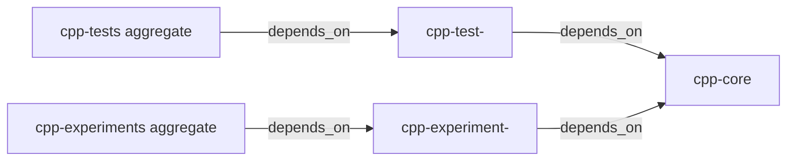

<!--
@dependency-start
contract design
responsibility Documents the target C++ project boundary, target graph, artifact paths, and parent migration map.
upstream design ../runtime/SHARED_RUNTIME_SURFACES.md shared documents ownership policy
upstream design ../runtime/runtime-profiles-and-check-matrix.md C++ profile and validation routing
upstream design ../conventions/coding-conventions-cpp.md native source and header conventions
upstream design ../conventions/coding-conventions-project.md project path and environment conventions
upstream design ../conventions/coding-conventions-testing.md CTest and test ownership conventions
upstream design ../conventions/coding-conventions-experiments.md experiment source and artifact conventions
upstream design ../conventions/REVIEW_PROCESS.md review family and evidence conventions
upstream design ../rule/README.md document placement and ownership rules
upstream design ../design/README.md design source canon and update rules
upstream design ../structure/README.md structure contract reader route
upstream design ../structure/repo-structure-contract.toml positive path and ownership contract
upstream design ../experiments/experiment-registry.md registered experiment entrypoint and result root contract
upstream design ../experiments/result-log-retention-and-visualization.md result bundle and retention contract
upstream design ../../CONTAINER_OPERATIONS.md container ownership and validation boundary
upstream design ../../agents/skills/cpp-review.md native build/header/CTest review
upstream design ../../agents/skills/refactor-loop.md behavior-preserving path and wave contract
upstream design ../../agents/skills/structure-planning.md design structure and closeout contract
upstream design ../../agents/skills/dependency-analysis.md dependency-expanded source packet contract
upstream design ../../agents/skills/experiment-lifecycle.md experiment execution lifecycle and run evidence owner
upstream design ../../agents/skills/result-artifact-writeout.md result artifact shape and destination owner
upstream design ../../agents/skills/experiment-review.md experiment source/config/evidence review
upstream design ../../agents/skills/environment-maintenance.md Docker/runtime change owner
upstream design ../../agents/workflows/experiment-workflow.md experiment preparation/run/report workflow
upstream design ../../agents/workflows/comprehensive-refactoring-workflow.md comprehensive refactor gates
upstream design ../../agents/workflows/implementation-waterfall-workflow.md design-to-implementation handoff gates
upstream design ../../agents/TASK_WORKFLOWS.md task packet and validation routing
upstream design ../../agents/canonical/CODEX_WORKFLOW.md scope, edit, validation, closeout owner
upstream design ../../agents/COMMUNICATION_PROTOCOL.md source packet and trace transport schema
@dependency-end
-->

# C++ Build Layout

この設計は、親 repository の C++ source と native test/experiment target を
`cpp/` という一つの CMake project に集約する target state を定めます。
親 repository の root は Python、文書、AgentCanon runtime、Docker の入口を
持つ language-neutral な状態に保ち、C++ の project identity は `cpp/` に移します。

## 文書の構造契約

structure_kind=refactor
audience=親 repository の C++ 実装者、build/CI 保守者、reviewer
decision_context=C++ source、tests、experiments の project 境界と移行順を確定する
first_artifact=table:target-state-path-command-owner-records
visual_plan=table:ownership、command、migration、trace を同じ識別子で照合する
document_unit=owner:AgentCanon design; reader:C++/project/container maintainers; validation:docs+dependency+profile checks; cadence:build-layout change; canonical_parent:documents/design/README.md; downstream_consumers:parent README, QUICK_START, cmake, docker, Makefile, CI
document_split_decision=keep:同じ C++ build owner、reader、validation route、更新 cadence を共有する; evidence=`structure_contract`
metric_or_delta_contract=allowed structural delta:root CMake entrypoint から cpp project への移動と target graph の導入; forbidden semantic delta:この設計 phase で runtime behavior、experiment protocol、dependency version を変更しない
ordered_structure=target state → source ownership → target graph/commands → generated paths → dependency/symlink boundaries → parent migration → forward/reverse trace → validation
invalid_interpretations=この文書は CMake/Docker implementation、Python managed experiment registry、AgentCanon skill の変更を完了扱いにしない
validation_gate=Markdown docs check、dependency-header/graph check、C++ profile review、design claim check
```text

## Related Document Closure / Design Source Packet

この設計の Related Document Closure は、dependency header の upstream とこの
文書の reader map（構造契約、target state、commands、migration、trace）から
直接関連 edge を辿って作成した (`RDC-RELATED-CLOSURE`)。`cap`、キーワード一致数、任意の
上限で候補を落としていない。直接 edge と、その edge が参照する runtime、
structure、skill、workflow、parent projection を、C++ build、CTest、native
experiment、Docker、root migration、design evidence のいずれかを所有する限り
読み、同じ owner が新しい関連 surface を増やさなくなるまで閉包した。

各行は全文の要約ではなく、`decision`（設計判断）、`target`（実装時の target または
write set）、`validation`（その判断を読み戻す検証）を記録する (`D-RELATED-DOCUMENT-CLOSURE`)。この表が
本設計の source packet であり、後段の `D-RELATED-DOCUMENT-CLOSURE`、`D-*` trace
と `P-*` migration trace の入力である。

### Canonical conventions、runtime、structure

| closure id (`RDC-ID`) | logical path + section read | edge | decision | implementation target | validation |
| --- | --- | --- | --- | --- | --- |
| `RDC-CXX` | `logical:documents/conventions/coding-conventions-cpp.md`: `1. 基本方針`, `3.5 Header-Only Rule`, `5. テスト`, `6. 再利用` | C++ layout/build source of truth → project root、header/source、reuse policy | `cpp/` を native source root とし、`cpp-core` の type selection は header-only/source/artifact contract で決める | `cpp/CMakeLists.txt`, `cpp/include/`, `cpp/src/`, `cpp-core` | C++ configure/build/install、header/install inventory、`D-TARGET-TYPE` claim check |
| `RDC-PROJECT` | `logical:documents/conventions/coding-conventions-project.md`: `2. ディレクトリの考え方`, `4. 開発環境`, `4.6 Docker 更新時の扱い`, `4.7 Legacy Forwarder Migration Rule`, `5. テストとレビュー`, `6. 実験運用`, `9. Checker Contract Surface` | project convention → parent command and legacy-path migration | parent root は language-neutral、C++ project identity と profile cache は `cpp/` が所有し、旧入口から forward せず移行する | `CMakeLists.txt` removal、`README.md`, `QUICK_START.md`, `Makefile`, `docker/`, `P-*` | root wrapper count、stale `cmake -S .` scan、docs/command checks、responsibility scope |
| `RDC-TEST-CONVENTION` | `logical:documents/conventions/coding-conventions-testing.md`: `2. 配置と分類`, `3. Unit Test Contract`, `4. 実行方法`, `5. 想定解と標準出力ログ` | test convention → individual executable/CTest ownership | test source は `cpp/tests`、各 executable は `cpp-core` を consume、CTest が execution owner、aggregate は build grouping のみ | `cpp/tests/CMakeLists.txt`, `cpp-test-<name>`, `cpp-tests`, `add_test` | configure graph target inventory、CTest list/run、individual-to-core link readback |
| `RDC-EXPERIMENT-CONVENTION` | `logical:documents/conventions/coding-conventions-experiments.md`: `2. ディレクトリ構成`, `3. 実行原則`, `3.1 設定 snapshot`, `3.2 Make target と実行入口`, `4. report と notes`, `5. branch 方針` | experiment convention → build/run/result separation | build は CMake target、run/config/result/evidence は既存 lifecycle、report、branch owner に分離する | `cpp/experiments/`, `cpp-experiment-<name>`, parent `experiments/` adapter/README | build-only no-run gate、managed run manifest、result root/evidence/retention readback |
| `RDC-REVIEW-CONVENTION` | `logical:documents/conventions/REVIEW_PROCESS.md`: `変更前に固定すること`, `Review Family の選び方`, `実行チェック`, `Review Flow`, `エビデンス保存` | review policy → design completeness and implementation handoff | design-only pass は implementation evidence と未実行 check を分離し、C++/Docker/experiment profile を changed surface で選ぶ | review packet、`D-*`/`P-*` trace、next-phase write set | C++ review、profile matrix、docs/dependency checks、未実行項目の明示 |
| `RDC-RUNTIME-SURFACES` | `logical:documents/runtime/SHARED_RUNTIME_SURFACES.md`: `Reader Map`, `Owner Classes`, `Manifest Contract`, `AgentCanon-Owned Symlink Views`, `Template-Owned Active Contracts`, `Project-Owned Durable State And Content`, `Documents Directory Ownership`, `Tests Directory Ownership`, `Editing Rule`, `Validation` | shared surface ownership → source/symlink/parent boundary | managed clone の AgentCanon source と parent の regular active contract を混同しない。`vendor/agent-canon` は clean pin/runtime projection、parent docs/CMake は parent-owned write set | clone `documents/design/cpp-build-layout.md`; parent `README.md`, `QUICK_START.md`, `docker/`, `cpp/*`; no root-view edit in this pass | `git status`/pin evidence、surface sync check when selected、positive ownership scan |
| `RDC-RUNTIME-MATRIX` | `logical:documents/runtime/runtime-profiles-and-check-matrix.md`: `Profile Classes`, `Risk Classes`, `Validation Failure Response`, `Check Matrix`, `Closeout Rule` | runtime profile → validation route | C++、Docker、Experiment、AgentCanon docs/workflow の profile を activated surface として記録し、design-only では native execution を未実行とする | validation profile section、`D-VALIDATION`, parent projection gates | docs/dependency/structure claims、C++ profile commands、Docker/experiment checks in implementation phase |
| `RDC-RULE` | `logical:documents/rule/README.md`: `読者の入口`, `所有境界` | document rule → location/language/canonical owner | design source は canonical `documents/design`、filename English、parent projection は owner surface を参照し二重 canon を作らない | this document、parent docs listed in `P-*` | docs checker、dependency header check、design index readback |
| `RDC-DESIGN` | `logical:documents/design/README.md`: `現在の正本`, `追加の module 設計を置くとき`, `更新ルール`, `正本維持ルール` | design canon → source packet placement | この build layout は design canon の一つの replaceable unit。implementation source packet は次 phase に handoff する | `documents/design/cpp-build-layout.md` in managed clone | design docs check、dependency graph/claim check |
| `RDC-STRUCTURE` | `logical:documents/structure/README.md`: `構成`; `logical:documents/structure/repo-structure-contract.toml`: `profile`, `required`, `forbidden`, `responsibility` records | structure contract → path ownership and positive readback | `cpp/CMakeLists.txt` が唯一の CMake source root、native ownership は `cpp/*`、parent root wrapper は 0 の target state | `D-PARENT-MIGRATION`, `cpp/*`, root cleanup, responsibility projection | `repo_structure_contract.py`, `responsibility_scope.py`, source-root inventory, `root_wrapper_count=0` |
| `RDC-RESPONSIBILITY` | `parent:responsibility-scope.toml`: `scope` records for root project, `cpp`, `docker`, `experiments`, `vendor/agent-canon` | parent responsibility projection → owner routing | C++ native scope moves to `cpp/*`; Docker/experiments/docs remain their owning parent scopes; AgentCanon source remains managed clone | next-phase `parent:responsibility-scope.toml` update/readback, not changed now | `responsibility_scope.py --root .`, overlap/coverage report |

### Canonical experiment、container、skill、workflow

| closure id (`RDC-ID`) | path + section read | edge | decision | implementation target | validation |
| --- | --- | --- | --- | --- | --- |
| `RDC-REGISTRY` | `logical:documents/experiments/experiment-registry.md`: `役割`, `正本ファイル`, `branch-only topics`, `validation` | registry → managed entrypoint/config/result root | native topic adapter is registered through the existing experiment registry; CMake target does not become a second registry | `experiments/registry.toml`, `experiments/<topic>/run.py`, topic README | `make experiment-check`, registry command/result-root readback |
| `RDC-RESULT-RETENTION` | `logical:documents/experiments/result-log-retention-and-visualization.md`: `Storage Classes`, `Required Bundle Shape`, `Visualization Rules`, `Retention Rules`, `Closeout Evidence` | result storage → run evidence and retention | result directory remains `experiments/<topic>/result/<variant>/<run_name>/`; native target emits domain outputs, lifecycle/save owner emits manifests/report/retention evidence | native runner arguments, result bundle, save-results publish | bundle shape, artifact/eval manifests, report/retention evidence |
| `RDC-CONTAINER` | `logical:CONTAINER_OPERATIONS.md`: `Canonical Source Contract`, `Ownership Boundary`, `Manifest Source Roles And Cardinality`, `Dockerfile Rules`, `GitHub Workflow Rules`, `Required Validation` | container source/pack → CMake smoke projection | Docker pack/check owns container build and smoke; its CMake command changes to the parent anchor without moving C++ ownership into Docker | `docker/README.md`, `docker/check_build.sh`, `docker/packs/default.toml`, CI | `docker_dependency_validator.sh`, pack print/smoke, Docker workflow checker |
| `RDC-EXPERIMENT-LIFECYCLE` | `logical:agents/skills/experiment-lifecycle.md`: `Purpose`, `Use When`, `Core References`, `Boundary`; `logical:agents/workflows/experiment-workflow.md`: `1. この文書の役割`, `2. 段階別手順` (`準備`, `静的チェック`, `実験実行`, `結果レポート`) | lifecycle skill/workflow → run protocol | build target creation and native execution are two events; lifecycle owns `run_name`, config snapshot, result root, command/environment/source evidence | `cpp-experiment-<name>` build target plus managed adapter/direct run contract | lifecycle run manifest, command/env/source snapshot, exit status; build/run separation gate |
| `RDC-RESULT-PERSISTENCE` | `logical:agents/skills/experiment-lifecycle.md`: `Canonical ownership`, `Lifecycle`; `logical:agents/skills/result-artifact-writeout.md`: `Contract`, `Reports and publication` | lifecycle/writeout owners → explicit retention/publication | C++ target never publishes directly; lifecycle owns run identity and explicit publication decisions while writeout owns concrete artifact identity/checksum/no-overwrite readback | `experiments/<topic>/result/<variant>/<run_name>/`, `publish_result_branch.py` | lifecycle terminal-status/publication evidence and artifact manifest/checksum/readback |
| `RDC-ARTIFACT-WRITEOUT` | `logical:agents/skills/result-artifact-writeout.md`: `Output Contract`, `Destination Rules`, `Required Shape`, `Closeout Tokens` | artifact writer → evidence shape | native result output is written below lifecycle-selected run directory and is not a build-tree artifact | runner result arguments and artifact manifest | result-artifact checker/manifest shape |
| `RDC-EXPERIMENT-REVIEW` | `logical:agents/skills/experiment-review.md`: `Review Checklist`, `Findings Policy` | experiment review → executable/config/result review | review checks target source, registry adapter, config, evidence, and report as one trace without changing experiment protocol in design pass | `P-EXPERIMENT-*`, native source packet | experiment review findings and managed run evidence |
| `RDC-CPP-REVIEW` | `logical:agents/skills/cpp-review.md`: `Use When`, `Required Checks`, `Core References`, `Expected Outcome`, `Mandatory Checklist` | C++ reviewer → native build/header/CTest evidence | project-native configure/build/test is implementation-phase evidence; this design phase records the route and does not claim execution | `cpp/CMakeLists.txt`, `cpp/include`, `cpp/tests`, target graph | configure/build/CTest, header/link/ownership review; `not_run` until implementation |
| `RDC-REFACTOR-LOOP` | `logical:agents/skills/refactor-loop.md`: `Reader Map`, `Required Contract`, `Canonicalization-First Refactors`, `Dependency-Guided Repair Slice Loop`, `Refactor Orchestration Plan`, `Review Emphasis` | refactor skill → path mapping and behavior-preserving waves | preserve behavior/API/protocol; materialize dependency-expanded path map before W1; W0 design is the only write wave now | `D-*`, `P-*`, W0-W4 plan | dependency review, design claim check, wave-specific profile gates |
| `RDC-STRUCTURE-SKILL` | `logical:agents/skills/structure-planning.md`: `Reader Map`, `Structure Contract`, `Default Sequence`, `Closeout Tokens` | structure skill → design document shape | table/record-first structure maps ownership, paths, transitions, and invalid interpretations; no prose-only closure claim | this document's structure contract and closure ledger | docs/structure closeout tokens |
| `RDC-DEPENDENCY-SKILL` | `logical:agents/skills/dependency-analysis.md`: `Reader Map`, `Required Commands`, `Change Impact Packet`, `Interpretation` | dependency skill → edge/claim completeness | source packet records upstream/downstream edges and separates fresh graph evidence from stale/blocked graph evidence | closure ledger, dependency headers, design claim records | strict dependency review and design claim checker |
| `RDC-TOOL-FINDINGS` | `logical:agents/skills/tool-finding-report.md`: `Finding Packet`, `Procedure`, `Refactor Integration` | checker output → durable finding/repair loop | any future failed graph/path check returns to its owning `D-*`/`P-*` edge; no design shortcut via prose | validation artifacts in next implementation run bundle | raw/structured checker finding and repair status |
| `RDC-ENVIRONMENT` | `logical:agents/skills/environment-maintenance.md`: `Required Proposal Fields`, `Operating Rules`, `Validation`, `Boundary` | Docker/runtime change → environment ownership | Docker path projection is parent environment work; C++ target implementation remains in `cpp/` | `docker/*`, `Makefile`, CI projection | Docker dependency checks |
| `RDC-COMPREHENSIVE` | `logical:agents/workflows/comprehensive-refactoring-workflow.md`: `適用条件`, `Gate A. 設計見直し`, `Gate B. OOP 的な責務境界方針`, `Gate C. 解析ツールと合格点`, `Gate D. 実装分割`, `Gate E. Review と Closeout` | comprehensive refactor → design/implementation separation | five findings remain resolved in design; implementation is split by owner waves and no parent files/skills are written now | W0-W4, parent migration write set | design gate, OOP/readability where applicable, review/closeout |
| `RDC-WATERFALL` | `logical:agents/workflows/implementation-waterfall-workflow.md`: `Active design packet`, `Cycle B`, `Gate 5. 詳細設計`, `Gate 6. 詳細設計レビュー`, `Gate 7. 文書通読レビュー`, `Gate 8. 実装`, `Gate 10. Audit And Gate Closure` | implementation waterfall → handoff order | this closure is the document-wide review/source packet before implementation; native implementation starts only after design review pass | design packet → W1-W4 packets | document read-through, implementation checkpoints, audit/closeout |
| `RDC-TASK-WORKFLOW` | `logical:agents/TASK_WORKFLOWS.md`: `Common Evidence Packet`, `Design Artifact Shape`, `Implementation Flow Graph`, `Validation` | task workflow → transport schema | `D-*`, `P-*`, source/owner records are durable handoff fields; no commit is part of this return | managed clone design artifact and next source packets | packet completeness and selected profile checks |
| `RDC-COMMUNICATION` | `logical:agents/COMMUNICATION_PROTOCOL.md`: `Context Visibility Contract`, `Structure Intake Packet`, `Active Design Packet Schema`, `Pre-Edit Repository Investigation Packet`, `Review Packet`, `Write Scope Packet` | communication protocol → trace packet shape | closure coverage, assumptions, write set, validation, and unexecuted checks are explicit in the design artifact | this section plus `D-*`/`P-*` tables | packet/schema review; no implementation claim |
| `RDC-WORKFLOW-OWNER` | `logical:agents/canonical/CODEX_WORKFLOW.md`: `Edit Execution Surface`, `Library And Reuse Sweep`, `File Dependency Manifest`, `Completion Bar`, `Validation`, `Closeout` | canonical workflow → scope/closeout | managed topic clone is the design source; parent files and AgentCanon skills remain next-phase write sets; no commit | clone status, write set, closeout records | selected docs/dependency/structure checks and no-commit status |

### Parent projection closure

| closure id (`RDC-ID`) | parent namespace path + section/read surface | edge | decision | implementation target | validation |
| --- | --- | --- | --- | --- | --- |
| `RDC-PARENT-CMAKE` | `parent:CMakeLists.txt`: dependency header and `project`/output/install/test blocks | legacy root CMake → sole native source root | remove root entrypoint after positive `cpp/CMakeLists.txt` readback; no root wrapper remains | `parent:cpp/CMakeLists.txt`, then `parent:CMakeLists.txt` removal (`P-ROOT-CMAKE-REMOVAL`) | `project-entry inventory={cpp/CMakeLists.txt}`, nested same-project manifests permitted, `root_wrapper_count=0`, configure exact anchor |
| `RDC-PARENT-CMAKE-README` | `parent:cmake/README.md`: complete CMake layout guidance; `parent:src/README.md`: complete source guidance | root helper/source README → native owner projection | point readers to `cpp/cmake`/`cpp/src` or retire only with the mapped surface; no stale root owner | `P-CMAKE-README`, `P-SRC-README` | stale-path scan, docs check, reverse `D-SOURCE-BOUNDARIES` |
| `RDC-PARENT-README` | `parent:README.md`: `テンプレート構造の例`, `Runtime Profiles`, `Bootstrap と Validation`, `よく使うコマンド` | parent entrypoint → C++ command consumer | show `cmake -S "$ROOT/cpp" -B "$ROOT/build/cpp/<profile>"` and language-neutral root ownership | `P-ROOT-README` | docs check and command readback |
| `RDC-PARENT-QUICK` | `parent:QUICK_START.md`: `よく使うコマンド`, `実験の基本`, `環境の基本`, `終了時の整理` | quick-start → build/test/run/save sequence | expose configure/build/install/CTest, separate experiment build/run, and result save owner | `P-QUICK-START` | docs/command trace; no `cmake -S .` |
| `RDC-PARENT-DOCKER` | `parent:docker/README.md`: `Primary Files`, `Runtime Pack`, `Standard Commands`, `Update Rule`; `parent:docker/check_build.sh`: pack parse/smoke command path; `parent:docker/packs/default.toml`: `[smoke].commands` | container pack → C++ smoke | container invokes parent anchor and consumes same profile output contract; Docker owns image/smoke, not native source | `P-DOCKER-README`, `P-DOCKER-CHECK`, `P-DOCKER-PACK` | Docker dependency validator, pack print/smoke, CMake/CTest smoke |
| `RDC-PARENT-MAKE` | `parent:Makefile`: `check-matrix`, `docs-check`, `experiment-check`, `docker-build-check`, help/command target blocks | make wrapper → command projection | wrappers delegate to canonical CMake/lifecycle commands and do not create a second CMake project | `P-MAKE` | make dry-run/target smoke, command inventory |
| `RDC-PARENT-SCOPE` | `parent:responsibility-scope.toml`: root/project, C++, Docker, experiments, AgentCanon `scope` records | scope registry → ownership/readback | native source owner is `cpp/*`; root docs/Docker/experiment result owners remain distinct; AgentCanon source is clone-owned | `P-RESPONSIBILITY-SCOPE` (next phase) | `responsibility_scope.py --root .`, ownership coverage/no overlap |
| `RDC-PARENT-CI` | `parent:.github/workflows/docker-build.yml`: path filters and Docker pack steps | CI projection → updated Docker smoke owner | CI keeps pack entry and inherits the updated script-owned CMake source root | `P-DOCKER-CI` | GitHub workflow checker and pack run |
| `RDC-PARENT-DOC-INDEX` | `parent:documents/README.md`: design/convention navigation if present | document index → canonical design reader | link to the AgentCanon design source without copying shared canon into parent documents | next-phase docs projection if index requires change | docs/link/dependency checks |

Closure state for this design-only pass:

```text
related_document_closure=complete_for_cpp_build_layout_edges
closure_selection=header_reader_map_and_owner_edge_closure
closure_cap=none
closure_keyword_only_selection=none
canonical_convention_coverage=read_and_mapped
canonical_runtime_coverage=read_and_mapped
canonical_structure_coverage=read_and_mapped
canonical_skill_coverage=read_and_mapped
canonical_workflow_coverage=read_and_mapped
parent_projection_coverage=read_and_mapped
fresh_graph_claims=validation_pending_until_parent_implementation
design_source_packet=RDC-* rows above
```

### Closure path-space and resolver

| namespace | path form | resolver and readback owner |
| --- | --- | --- |
| logical AgentCanon source | `logical:documents/...`, `logical:agents/...`, `logical:CONTAINER_OPERATIONS.md` | resolve relative to the managed AgentCanon source root (`$AGENT_CANON_SOURCE_ROOT`); read the canonical source clone and record its path+section identity |
| parent AgentCanon projection | `parent:vendor/agent-canon/documents/...`, `parent:vendor/agent-canon/agents/...`, `parent:vendor/agent-canon/CONTAINER_OPERATIONS.md` | resolve as `$PARENT_ROOT/vendor/agent-canon/...`; this is a parent pin/runtime readback, not the source-edit authority |
| parent-owned projection | `parent:<path>` such as `parent:README.md`, `parent:docker/README.md`, `parent:CMakeLists.txt` | resolve as `$PARENT_ROOT/<path>`; parent project ownership and next-phase write set are read back here |

The canonical closure tables use the first namespace for canonical owners; the
parent projection tables use the second or third namespace according to owner.
The dependency header keeps logical relative paths because it is parsed from the
managed AgentCanon source. Resolver/readback is deterministic:

```bash
ROOT=/workspace/project_template
AGENT_CANON_SOURCE_ROOT="$ROOT/workspace/cpp-cmake-build-layout-design-20260730/agent-canon"
PARENT_ROOT="$ROOT"
for logical_path in \
  documents/conventions/coding-conventions-cpp.md \
  documents/runtime/runtime-profiles-and-check-matrix.md \
  agents/skills/cpp-review.md; do
  test -f "$AGENT_CANON_SOURCE_ROOT/$logical_path"
  printf "logical:%s=present\n" "$logical_path"
done
for parent_path in \
  vendor/agent-canon/documents/conventions/coding-conventions-cpp.md \
  vendor/agent-canon/agents/skills/cpp-review.md \
  README.md; do
  test -f "$PARENT_ROOT/$parent_path"
  printf "parent:%s=present\n" "$parent_path"
done
```

Expected readback:

```text
logical:documents/conventions/coding-conventions-cpp.md=present
logical:documents/runtime/runtime-profiles-and-check-matrix.md=present
logical:agents/skills/cpp-review.md=present
parent:vendor/agent-canon/documents/conventions/coding-conventions-cpp.md=present
parent:vendor/agent-canon/agents/skills/cpp-review.md=present
parent:README.md=present
```

## Target state

| record | target state | owner |
| --- | --- | --- |
| `project_root` | `<parent>/cpp/` が唯一の C++ CMake project root になり、`project(<project> LANGUAGES CXX)` と共通 toolchain/compile feature を定義する | C++ build owner |
| `entrypoint` | `<parent>/cpp/CMakeLists.txt` が `cpp/src`、`cpp/include`、`cpp/tests`、`cpp/experiments` を同じ configure graph に取り込む | C++ build owner |
| `parent_root` | `<parent>/` は language-neutral な親入口として残り、C++ は `cpp` の explicit source directory を指定して起動する | parent project owner |
| `test_project` | `cpp/tests` は親 project の test subdirectory として test executable と CTest registration を提供する | C++ test owner |
| `experiment_project` | `cpp/experiments` は親 project の experiment subdirectory として native executable/benchmark target と output contract を提供する | C++ experiment owner |
| `shared_library` | production target は `cpp/include` の public header と `cpp/src` の implementation を一つの reusable target に束ね、tests/experiments はその target を link する | production owner |
| `runtime_profiles` | `dev`、`docker-smoke`、および必要な compatibility profile は同じ `cmake -S cpp -B build/cpp/<profile>` 形式で再現する | runtime/build owner |

この状態への移行により、tests と experiments は同一 configure、同一 compiler
feature、同一 include/dependency target、同一 build cache を共有します。

## Source、directory、owner

| path | responsibility | source owner | consumer |
| --- | --- | --- | --- |
| `cpp/CMakeLists.txt` | project identity、C++ standard、global options、subdirectory order、install/export policy | C++ build owner | all C++ targets |
| `cpp/src/` | production implementation、private translation unit、library source | production owner | `cpp` library target |
| `cpp/include/` | public header、include namespace、ABI/API surface | header/API owner | production、tests、experiments、install |
| `cpp/tests/` | test source、test target、CTest registration、test fixture wiring | test owner | `cpp-tests` aggregate |
| `cpp/experiments/` | native experiment/benchmark source、target-specific runner、experiment output wiring | experiment owner | `cpp-experiments` aggregate |
| `cpp/cmake/` | project-local Find/module/helper logic when the root file needs a reusable boundary | C++ build owner | `cpp/CMakeLists.txt` and subdirectories |
| `build/cpp/<profile>/` | generated configure/build tree、compile database、test discovery、native binaries | CMake generator | developer/CI |
| `.state/cpp-install/<profile>/` | generated reusable install tree for headers、libraries、executables、CMake package metadata | install step | downstream CMake consumers |
| `experiments/<topic>/result/<variant>/<run_name>/` | native experiment run outputs、lifecycle manifests、logs、summaries、plots/data produced by a target (`D-EXPERIMENT-LIFECYCLE`) | experiment-lifecycle / result-artifact-writeout direct owners | result/report tooling |

`cpp/include` と `cpp/src` は checked-in source の正本です。`build/` と
`.state/` は configure/install/run が生成する state で、source owner は持ちません。
root `experiments/` は experiment lifecycle、registry、result、report の正本として
残り、native C++ experiment の checked-in source/target は `cpp/experiments`、
run result は `experiments/<topic>/result/<variant>/<run_name>/` が所有します (`D-SOURCE-BOUNDARIES`)。

## Configure、build、install、test、experiment の関係

### Command records

The parent-root anchor is explicit in every CMake command:

```bash
ROOT=/workspace
PROFILE=<profile>
BUILD_DIR="$ROOT/build/cpp/$PROFILE"
INSTALL_PREFIX="$ROOT/.state/cpp-install/$PROFILE"
cmake -S "$ROOT/cpp" -B "$ROOT/build/cpp/<profile>" -DCMAKE_INSTALL_PREFIX="$ROOT/.state/cpp-install/<profile>"
```

| phase | command | produces/consumes | acceptance relation |
| --- | --- | --- | --- |
| configure | `cmake -S "$ROOT/cpp" -B "$ROOT/build/cpp/<profile>" -DCMAKE_INSTALL_PREFIX="$ROOT/.state/cpp-install/<profile>"` | `cpp/CMakeLists.txt` から `build/cpp/<profile>/` と同一-cache install prefix を生成する | tests/experiments を含む同一 project graph と install cache が生成される |
| build all | `cmake --build "$ROOT/build/cpp/<profile>" --parallel` | `cpp-core`、test、experiment targets を compile/link する | aggregate target graph が一回の build で再現する |
| build production | `cmake --build "$ROOT/build/cpp/<profile>" --target cpp-core` | production library/object/interface target を生成する | `cpp/include`/`cpp/src` の target が独立に検証できる |
| build tests | `cmake --build "$ROOT/build/cpp/<profile>" --target cpp-tests` | individual test executables と aggregate target を build する | test executable が `cpp-core` に link される |
| test run | `ctest --test-dir "$ROOT/build/cpp/<profile>" --output-on-failure` | CTest-registered tests を実行する (`D-TEST-GRAPH`) | individual test registrations が同一 configure cache を使用する |
| build experiments | `cmake --build "$ROOT/build/cpp/<profile>" --target cpp-experiments` | individual experiment executables と aggregate target を build する | experiment executable が `cpp-core` に link され、run は発生しない |
| install | `cmake --install "$ROOT/build/cpp/<profile>"` | 同じ configure cache の `.state/cpp-install/<profile>/` を更新する | public headers と production artifacts が install contract に従う |
| experiment run | `"$ROOT/build/cpp/<profile>/bin/cpp-experiment-<name>" --run-name "$RUN_NAME" --config "$CONFIG" --result-root "$RESULT_ROOT"` | build 済み individual executable を lifecycle-owned result root へ実行する (`D-EXPERIMENT-LIFECYCLE`) | build と run が分離され、run evidence が `result/<variant>/<run_name>/` に残る |

### Target graph



Legend: `consumer -->|depends_on| provider` means the left target consumes the
right target; aggregate arrows use the same dependency semantics and point to
their individual targets.

Visualization selection: `context_question=exact consumer/provider ownership of one C++ configure graph`; `literal_user_scope=cpp-core, individual test/experiment executables, cpp-tests, cpp-experiments`; `visualization_kind=dependency graph`; `time_axis=static relation`; `precision_need=exact branch graph`; `source_evidence=D-TARGET-TYPE,D-TEST-GRAPH,D-EXPERIMENT-GRAPH`; `owner_skill_or_tool=code-visualization`; `adapter=agent_canon.visualization.adapter.document_mermaid`; `renderer=Mermaid`; `output_path=documents/design/cpp-build-layout.md`.

### Exact CMake inventory and positive ownership gate

| inventory record | target-state definition | readback owner |
| --- | --- | --- |
| parent root project | parent root has no `CMakeLists.txt`, `project()`, or C++ wrapper definition | `D-PARENT-MIGRATION`, `P-ROOT-CMAKE-REMOVAL` |
| native project entry | `cpp/CMakeLists.txt` is the single file containing the native `project()` entry and owns `cpp/src`, `cpp/include`, `cpp/tests`, and `cpp/experiments` | `D-PROJECT-ROOT` |
| nested manifests | `cpp/tests/CMakeLists.txt` and `cpp/experiments/CMakeLists.txt` are permitted only as `add_subdirectory` manifests of the same project; they contain no `project()` and do not create a project root | `D-TEST-GRAPH`, `D-EXPERIMENT-GRAPH` |
| CMake source-root inventory | project-entry inventory is exactly `{cpp/CMakeLists.txt}`; manifest inventory may additionally contain the two nested paths when their source/manifest exists | `D-PARENT-MIGRATION` |
| native ownership inventory | every native `*.c`, `*.cc`, `*.cpp`, `*.cxx`, `*.h`, `*.hh`, `*.hpp`, `*.hxx` is under `cpp/*`; generated/vendor/workspace state is excluded from this ownership scan | `D-SOURCE-BOUNDARIES` |
| wrapper inventory | `root_wrapper_count=0`; parent commands invoke the `cpp` anchor directly or use a command wrapper that delegates to it without adding a CMake project | `D-COMMANDS`, `D-PARENT-MIGRATION` |

Deterministic target-state readback:

```bash
ROOT=/workspace/project_template
project_entry_files="$(find "$ROOT/cpp" -type f -name CMakeLists.txt -exec grep -lE "^[[:space:]]*project[[:space:]]*\(" {} + 2>/dev/null | sort)"
printf "project_entry_count=%s\n" "$(printf "%s\n" "$project_entry_files" | sed "/^$/d" | wc -l | tr -d " ")"
printf "%s\n" "$project_entry_files" | sed "/^$/d" | sed "s#^#project_entry=#"
root_cmake_files="$(find "$ROOT" -maxdepth 1 -type f -name CMakeLists.txt | sort)"
printf "root_cmake_file_count=%s\n" "$(printf "%s\n" "$root_cmake_files" | sed "/^$/d" | wc -l | tr -d " ")"
printf "root_wrapper_count=%s\n" "$(printf "%s\n" "$root_cmake_files" | sed "/^$/d" | wc -l | tr -d " ")"
nested_project_entries="$(find "$ROOT/cpp/tests" "$ROOT/cpp/experiments" -type f -name CMakeLists.txt -exec grep -lE "^[[:space:]]*project[[:space:]]*\(" {} + 2>/dev/null | sort)"
printf "nested_project_entry_count=%s\n" "$(printf "%s\n" "$nested_project_entries" | sed "/^$/d" | wc -l | tr -d " ")"
printf "%s\n" "$nested_project_entries" | sed "/^$/d" | sed "s#^#nested_project_entry=#"
printf "cmake_manifest_files:\n"
find "$ROOT/cpp" -type f -name CMakeLists.txt 2>/dev/null | sort
native_outside_cpp="$(find "$ROOT" -type f \( -name "*.c" -o -name "*.cc" -o -name "*.cpp" -o -name "*.cxx" -o -name "*.h" -o -name "*.hh" -o -name "*.hpp" -o -name "*.hxx" \) -not -path "$ROOT/cpp/*" -not -path "$ROOT/vendor/*" -not -path "$ROOT/build/*" -not -path "$ROOT/.state/*" -not -path "$ROOT/workspace/*" -not -path "$ROOT/.git/*" | sort)"
printf "native_outside_cpp_count=%s\n" "$(printf "%s\n" "$native_outside_cpp" | sed "/^$/d" | wc -l | tr -d " ")"
printf "%s\n" "$native_outside_cpp" | sed "/^$/d" | sed "s#^#native_outside_cpp=#"
```

Target-state expected output:

```text
project_entry_count=1
project_entry=/workspace/project_template/cpp/CMakeLists.txt
root_cmake_file_count=0
root_wrapper_count=0
nested_project_entry_count=0
cmake_manifest_files:
/workspace/project_template/cpp/CMakeLists.txt
native_outside_cpp_count=0
```

The two nested manifest paths appear below `cmake_manifest_files:` only when their corresponding source/manifest exists; they never change the project-entry count. A nonzero root wrapper count or any native ownership output returns to `D-PARENT-MIGRATION` before implementation continues.

The graph is materialized only when the corresponding individual source or
manifest exists. CTest registration is attached to each `cpp-test-<name>` node;
install rules consume the selected `cpp-core` artifact but are not target
providers in this target-edge view.

`cpp-core` の target type は source inventory と product contract から選びます。

| source/product condition | `cpp-core` type | generation rule |
| --- | --- | --- |
| `cpp/src/` に translation unit がなく、`cpp/include/` または downstream consumer が存在する | `INTERFACE` library | stable `cpp-core` target を生成し、public include directory と compile features を interface に載せる |
| `cpp/src/` に translation unit があり、installable/reusable library artifact が必要 | `STATIC` library | default production choice。`cpp-core` を compile/link artifact として生成し、install/export 対象にする |
| `cpp/src/` に translation unit があり、object aggregation が product contract で明示され、standalone library artifact が不要 | `OBJECT` library | `cpp-core` object target を生成し、individual test/experiment executable が `cpp-core` target interface を link する |
| `cpp/src/` に translation unit があり、shared ABI/runtime が product contract で明示される | `SHARED` library | explicit ABI decision、visibility、install/export contract と併せて `cpp-core` を生成する |
| `cpp/src/`、`cpp/include/`、`cpp/tests/`、`cpp/experiments/` の全てに C++ source/target manifest がない | `INTERFACE` `cpp-core` は project default として生成 | header-only/template の configure graph を安定させ、individual test/experiment と aggregate は生成しない |

`cpp/tests` は individual test source/manifest がある場合に configure graph に
入り (`D-TEST-GRAPH`)、各 `cpp-test-<name>` executable は
`target_link_libraries(cpp-test-<name> PRIVATE cpp-core ...)` で `cpp-core` に
接続します (`D-TEST-GRAPH`)。各 executable は
`add_test(NAME cpp-test-<name> COMMAND cpp-test-<name>)` で CTest に登録され、
その全 individual target を依存に持つ `cpp-tests` aggregate が生成されます。
test source/manifest がない場合、individual test executable と `cpp-tests`
aggregate は生成されません (`D-TEST-GRAPH`)。

`cpp/experiments` は individual native experiment source/manifest がある場合に
configure graph に入り、各 `cpp-experiment-<name>` executable は
`target_link_libraries(cpp-experiment-<name> PRIVATE cpp-core ...)` で接続されます (`D-EXPERIMENT-GRAPH`)。
その全 individual target を依存に持つ `cpp-experiments` aggregate が生成され、
`cmake --build` は executable を build するだけです。experiment source/manifest
がない場合、individual experiment executable と `cpp-experiments` aggregate は
生成されません (`D-EXPERIMENT-LIFECYCLE`)。run は次節の lifecycle command で個別に行います。

## Generated path records

| generated artifact | canonical path | path owner |
| --- | --- | --- |
| configure cache and generator files | `build/cpp/<profile>/CMakeCache.txt`, `build/cpp/<profile>/CMakeFiles/` | CMake |
| production libraries | `build/cpp/<profile>/lib/` | production targets |
| production executables | `build/cpp/<profile>/bin/` | production targets |
| test executables and CTest metadata | `build/cpp/<profile>/bin/cpp-test-<name>` and `build/cpp/<profile>/Testing/` | test targets/CTest |
| experiment executables and metadata | `build/cpp/<profile>/bin/cpp-experiment-<name>` and build metadata under `build/cpp/<profile>/` | experiment targets |
| install headers | `.state/cpp-install/<profile>/include/` | install rules |
| install libraries | `.state/cpp-install/<profile>/lib/` | install rules |
| install executables/package metadata | `.state/cpp-install/<profile>/bin/`, `.state/cpp-install/<profile>/lib/cmake/<project>/` | install/export rules |
| experiment run output | `experiments/<topic>/result/<variant>/<run_name>/` | experiment-lifecycle / result-artifact-writeout (`D-GENERATED-PATHS`) |

Profile identity is part of every generated path. A toolchain、ABI、compiler
feature、dependency version、public header、source、test、experiment target、or
container build input change starts a fresh configure/build for the affected
profile before the generated state is reused.

### Runtime/library/archive output contract

| CMake output property | canonical value from parent anchor | consumer |
| --- | --- | --- |
| `CMAKE_RUNTIME_OUTPUT_DIRECTORY` | `"$ROOT/build/cpp/<profile>/bin"` | `cpp-test-<name>`、`cpp-experiment-<name>`、production runtime targets |
| `CMAKE_LIBRARY_OUTPUT_DIRECTORY` | `"$ROOT/build/cpp/<profile>/lib"` | shared `cpp-core` and other shared libraries |
| `CMAKE_ARCHIVE_OUTPUT_DIRECTORY` | `"$ROOT/build/cpp/<profile>/lib"` | static `cpp-core` and object/archive outputs |
| `CMAKE_INSTALL_PREFIX` | `"$ROOT/.state/cpp-install/<profile>"` | same configure cache used by `cmake --install` |
| configure cache | `"$ROOT/build/cpp/<profile>/CMakeCache.txt"` | configure, build, test, install use one profile cache (`D-OUTPUT-CONTRACT`) |

The implementation sets these values from the same `ROOT`/`PROFILE` anchor used by
configure. `cmake --install "$ROOT/build/cpp/<profile>"` consumes that exact
cache; install does not create a second build tree or reconfigure a second prefix.

## Experiment build/run lifecycle

Build and run are separate lifecycle events (`D-EXPERIMENT-LIFECYCLE`). The CMake project owns compilation
and target dependency evidence; `experiment-lifecycle` owns run planning,
`run_name`, config selection, result-root selection, execution evidence, terminal state,
and explicit result-branch publication decisions; `result-artifact-writeout` owns
retention of concrete artifacts that actually exist, including path, semantic role,
checksum, no-overwrite behavior, and readback. Reader-facing report linkage is added
through `report-writing` only when requested.

| lifecycle field | canonical value/owner |
| --- | --- |
| native source | `cpp/experiments/<topic>/` |
| individual build target | `cpp-experiment-<topic>` |
| build aggregate | `cpp-experiments` |
| config source | `cpp/experiments/<topic>/config.yaml`, recorded in the lifecycle evidence as `config_source` |
| `run_name` | unique run identity selected before execution; reruns use a new name |
| result root | `$ROOT/experiments/<topic>/result` |
| result directory | `$ROOT/experiments/<topic>/result/<variant>/<run_name>/` |
| raw domain outputs | `summary.json`, `cases.jsonl`, case artifacts under the result directory |
| lifecycle evidence | `run_manifest.json`, `command.json`, `environment.json`, `source_snapshot.json`, config snapshot, logs, exit status |
| save/report evidence | `artifact_manifest.json`, `eval_manifest.json`, report path, retention plan, result branch status |

Build command:

```bash
ROOT=/workspace
PROFILE=dev
TOPIC=<topic>
BUILD_DIR="$ROOT/build/cpp/$PROFILE"
INSTALL_PREFIX="$ROOT/.state/cpp-install/$PROFILE"
cmake -S "$ROOT/cpp" -B "$BUILD_DIR" -DCMAKE_INSTALL_PREFIX="$INSTALL_PREFIX"
cmake --build "$BUILD_DIR" --target "cpp-experiment-$TOPIC" --parallel
```

Direct native run command (`D-EXPERIMENT-LIFECYCLE`; the lifecycle adapter supplies the same values when
the run uses the registered route; `D-EXPERIMENT-LIFECYCLE`):

```bash
RUN_NAME=<unique-run-name> # evidence: `D-EXPERIMENT-LIFECYCLE`
VARIANT=<variant> # evidence: `D-EXPERIMENT-LIFECYCLE`
CONFIG="$ROOT/cpp/experiments/$TOPIC/config.yaml"
RESULT_ROOT="$ROOT/experiments/$TOPIC/result/$VARIANT"
"$BUILD_DIR/bin/cpp-experiment-$TOPIC" --run-name "$RUN_NAME" --config "$CONFIG" --result-root "$RESULT_ROOT" # evidence: `D-EXPERIMENT-LIFECYCLE`
```

For a registered/formal topic, `experiments/registry.toml` and
`experiments/<topic>/run.py` are the parent lifecycle adapter write set (`P-EXPERIMENT-ADAPTER`). The
adapter invokes the built executable with `run_name`, the managed config
snapshot, and `EXPERIMENT_RUN_DIR`/result root, while the executable writes only
native domain artifacts. The canonical managed route is (`D-EXPERIMENT-LIFECYCLE`):

```bash
python3 -m tools.experiments.run_managed_experiment --topic "$TOPIC" --variant formal --use-registered-command formal # evidence: `D-EXPERIMENT-LIFECYCLE`
```

After a run, the save owner validates and retains the same result directory (`RDC-RESULT-PERSISTENCE`):

```bash
python3 -m tools.experiments.publish_result_branch \
  --variant "$VARIANT" \
  --result-dir "$ROOT/experiments/$TOPIC/result/$VARIANT/$RUN_NAME" \
  --branch "experiment-results/$TOPIC/$VARIANT"
```

The retention evidence records `experiment_topic`, `experiment_variant`, `experiment_run_name`, `D-EXPERIMENT-LIFECYCLE`,
`experiment_result_dir`, `experiment_source_commit`, dirty-source status,
formal-status, raw manifests, report path, and unique-run-name/append-only (`D-EXPERIMENT-LIFECYCLE`)
overwrite policy (`D-EXPERIMENT-LIFECYCLE`). This keeps CMake build evidence, lifecycle run evidence, and
save-result evidence separately traceable (`D-EXPERIMENT-LIFECYCLE`).

## Dependency ownership

| dependency decision | canonical owner | C++ project integration |
| --- | --- | --- |
| C++ standard、compile features、warnings、visibility、link options | `cpp/CMakeLists.txt` or `cpp/cmake/` | one imported/interface target consumed by all subdirectories |
| third-party package discovery and imported targets | C++ build owner | central `find_package`/package helper boundary; tests/experiments consume targets by name |
| checked-in third-party source or submodule identity | dependency owner / `vendor/` contract | CMake links the published target and does not duplicate source ownership |
| compiler、CMake、Ninja、system headers | parent `docker/Dockerfile` and supported host profile | configure command consumes the selected toolchain |
| Python/JAX/IREE export producer | Python/experiment owner | generated export artifact enters CMake through an explicit file/config target |
| managed Python experiment registry and run lifecycle | root `experiments/`, registry, managed runner | remains separate from `cpp/experiments`; native target writes only its declared output root |
| install prefix and downstream package discovery | C++ build/install owner | `cmake --install` publishes `cpp/include` and production artifacts |

Dependency declarations have one owner, while target consumers are local to the
project graph. A test or experiment can add a target-level link dependency, and
`cpp/CMakeLists.txt` remains the place where project-wide dependency identity is
resolved.

## Symlink and source-owner boundaries

| surface | source owner | generated/projection role | transition record |
| --- | --- | --- | --- |
| `cpp/include/`, `cpp/src/`, `cpp/tests/`, `cpp/experiments/` | derived parent project | checked-in source | create the native project tree and move each source unit to its matching owner |
| root `include/`, `src/`, `tests/cpp/` | current parent C++ surface | migration input | move source ownership into `cpp/` and update consumers in the same migration pass |
| root `cmake/` | current parent helper surface | migration input | move helpers used by the C++ project to `cpp/cmake/`; retain shared non-C++ helpers under their own owner |
| root `CMakeLists.txt` | current parent C++ entrypoint | migration input | translate project settings/targets into `cpp/CMakeLists.txt`, then leave the parent root language-neutral |
| root `experiments/` | derived project experiment system | Python managed runs/reports | keep the registry and managed runner route; native targets use `cpp/experiments/` |
| `vendor/agent-canon`, `AGENTS.md`, `.codex/config.toml`, `tools/agent-canon` | AgentCanon | source checkout plus the three active parent views | preserve AgentCanon ownership; C++ migration does not edit or replace these surfaces; parent `agents/`, `.agents/`, `.codex/`, and other runtime directories remain parent-owned |
| `build/`, `.state/` | generator/runner | generated state | create by commands, not as source inputs or source projections |

The C++ source tree is a real source boundary under `cpp/`; source files and
headers are not made canonical through symlinks to legacy root directories.
The three active AgentCanon views retain their existing symlink ownership and
remain outside the C++ project graph. Other parent runtime directories and
regular content are not AgentCanon projections.

## Parent migration map

`D-PARENT-MIGRATION` is the mandatory parent migration contract. It binds each
current parent C++/command/document surface to one target owner, one exact
downstream file or removal action, one forward design id, one reverse readback,
and one validation command. `D-PARENT-MIGRATION=pass` means that the complete
file set below has been updated, root `CMakeLists.txt` has been removed, the
root wrapper count is zero, and the positive source-root/ownership readback
passes. A partial individual-file update remains an open migration slice.

| parent current surface | target surface | implementation owner | first validation |
| --- | --- | --- | --- |
| `CMakeLists.txt` | `cpp/CMakeLists.txt` | C++ build owner | `cmake -S cpp -B build/cpp/dev` |
| `cmake/` | `cpp/cmake/` or an explicitly named non-C++ owner | C++ build owner | configure with each helper consumer |
| `include/` | `cpp/include/` | header/API owner | production compile + install tree inspection |
| `src/` | `cpp/src/` | production owner | production target build |
| `tests/cpp/` | `cpp/tests/` | test owner | `ctest --test-dir build/cpp/dev --output-on-failure` |
| native benchmark/experiment sources introduced at parent root | `cpp/experiments/` | experiment owner | `cmake --build build/cpp/dev --target cpp-experiments` |
| root `Makefile` C++ entrypoints (when added) | wrapper commands using `-S cpp` and `build/cpp/<profile>` | parent command owner | Make target dry-run/smoke |
| `QUICK_START.md` and `README.md` C++ commands | `cmake -S cpp -B build/cpp/<profile>` command records | parent docs owner | docs check + command path review |
| `cmake -S .` in `docker/check_build.sh` | `cmake -S cpp -B build/cpp/docker-smoke` | Docker/build owner | `make docker-build-check` |
| `cmake -S .` in `docker/packs/default*.toml` | `cmake -S cpp -B build/cpp/docker-smoke` | Docker pack owner | pack print/smoke validation |
| Docker C++ path descriptions | `cpp/CMakeLists.txt`, `cpp/...`, and `build/cpp/<profile>` | Docker docs owner | docs check + Docker profile check |
| `.github/workflows/docker-build.yml` | unchanged workflow entry with updated script-owned command path | GitHub/Docker owner | workflow checker + CI pack run |

The parent migration keeps Python `experiments/` and its registry/report contract
at the parent root. It introduces `cpp/experiments/` for native CMake targets and
connects native run results to `experiments/<topic>/result/<variant>/<run_name>/` (`D-PARENT-MIGRATION`), so source,
build, lifecycle, and retention remain independently owned.

### Individual downstream write set and trace

Every exact downstream file in this table is a parent namespace record, written as `parent:<path>`; AgentCanon projections use `parent:vendor/agent-canon/...`, while regular parent files use `parent:<path>`. This table is an implementation/write-set trace, not a second canonical source.

| trace id (`P-TRACE`) | exact downstream file | write set / target transition | forward design id | reverse readback |
| --- | --- | --- | --- | --- |
| `P-CXX-CONVENTIONS` | `parent:vendor/agent-canon/documents/conventions/coding-conventions-cpp.md` | replace root CMake/source paths and commands with `cpp/CMakeLists.txt`, `cpp/include`, `cpp/src`, target graph, and anchor command | `D-PROJECT-ROOT`, `D-SOURCE-OWNERS`, `D-COMMANDS` | convention text names `cmake -S "$ROOT/cpp"` and `cpp/*` ownership |
| `P-PROJECT-CONVENTIONS` | `parent:vendor/agent-canon/documents/conventions/coding-conventions-project.md` | update project-level C++ entrypoint, language-neutral parent root, profile paths, and downstream command owner | `D-PARENT-MIGRATION`, `D-GENERATED-PATHS` | project convention points to `cpp/CMakeLists.txt` and same-cache install |
| `P-CMAKE-README` | `parent:cmake/README.md` | describe the migrated helper owner or retire the C++ root README together with root CMake removal | `D-SOURCE-BOUNDARIES`, `D-PARENT-MIGRATION` | no stale root CMake canonical-entry claim |
| `P-SRC-README` | `parent:src/README.md` | move/replace source guidance with `cpp/src/` ownership and the production target trace | `D-SOURCE-OWNERS`, `D-SOURCE-BOUNDARIES` | source README maps every native source unit to `cpp/src/` |
| `P-ROOT-README` | `parent:README.md` | update tree, C++ section, profile commands, install path, and parent anchor | `D-COMMANDS`, `D-PARENT-MIGRATION` | README command uses quoted `$ROOT/cpp` and `$ROOT/build/cpp/<profile>` |
| `P-QUICK-START` | `parent:QUICK_START.md` | update quick-start C++ configure/build/install/test/experiment commands | `D-COMMANDS`, `D-EXPERIMENT-LIFECYCLE` | quick-start contains no `cmake -S .` route |
| `P-DOCKER-README` | `parent:docker/README.md` | update image/tool path, CMake source root, output contract, smoke and install commands | `D-GENERATED-PATHS`, `D-COMMANDS` | Docker README uses `-S "$ROOT/cpp"` and same cache install |
| `P-DOCKER-CHECK` | `parent:docker/check_build.sh` | update Docker smoke configure/build/test commands to the parent anchor | `D-COMMANDS`, `D-GENERATED-PATHS` | smoke script invokes `cmake -S "$ROOT/cpp"` |
| `P-DOCKER-PACK` | `parent:docker/packs/default.toml` | update default pack command records and profile build path | `D-COMMANDS` | pack command source root is `cpp` |
| `P-MAKE` | `parent:Makefile` | add/repair C++ build/test/experiment wrappers that delegate to the anchor commands | `D-COMMANDS`, `D-EXPERIMENT-LIFECYCLE` | wrapper inventory and command grep resolve to `cpp` |
| `P-DOCKER-CI` | `parent:.github/workflows/docker-build.yml` | retain workflow entry and consume the updated Docker script-owned command path | `D-COMMANDS` | CI workflow invokes the updated pack/check surface |
| `P-EXPERIMENT-REGISTRY` | `parent:experiments/registry.toml` | register native topic/adaptor, config placeholder, result root, formal command, and evidence artifacts | `D-EXPERIMENT-LIFECYCLE`, `D-EXPERIMENT-GRAPH` | registry points to the native lifecycle adapter and `result/<variant>/<run_name>` |
| `P-EXPERIMENT-ADAPTER` | `parent:experiments/<topic>/run.py` | invoke built `cpp-experiment-<topic>` with managed `run_name`, config snapshot, result root, and lifecycle evidence | `D-EXPERIMENT-LIFECYCLE`, `D-EXPERIMENT-GRAPH` | adapter command and `source_snapshot` point to the same native executable |
| `P-EXPERIMENT-README` | `parent:experiments/<topic>/README.md` | document question, config source, build command, formal run command, result schema, run_name, and report route | `D-EXPERIMENT-LIFECYCLE` | README traces every run artifact and save-results route |
| `P-RESPONSIBILITY-SCOPE` | `parent:responsibility-scope.toml` | project the native owner transition from root CMake/src/include/tests to `cpp/*`, while retaining parent Docker/docs/result and AgentCanon clone scopes | `D-SOURCE-BOUNDARIES`, `D-PARENT-MIGRATION` | `responsibility_scope.py --root .` reports `cpp/*` coverage without owner overlap |
| `P-PARENT-DOC-INDEX` | `parent:documents/README.md` when its navigation references the C++ design | point the parent reader to the canonical design source and keep shared AgentCanon policy under `parent:vendor/agent-canon` | `D-RELATED-DOCUMENT-CLOSURE` | docs/link/dependency readback has one design canon and no copied shared policy |
| `P-ROOT-CMAKE-REMOVAL` | `parent:CMakeLists.txt` | remove the parent root CMake entrypoint after `cpp/CMakeLists.txt` and all downstream projections pass | `D-PARENT-MIGRATION`, `D-SOURCE-BOUNDARIES` | `root_wrapper_count=0`; project-entry inventory contains only `cpp/CMakeLists.txt` |

The conventions, README, QUICK_START, Docker README, Docker check, pack (`D-PARENT-MIGRATION`),
Makefile, registry, adapter, and topic README are one migration write set with (`D-PARENT-MIGRATION`)
individual trace records. They are not optional follow-up prose (`D-PARENT-MIGRATION`); each is a
consumer of the target command/path contract.

### PR #468 changed-path closure and readback

The review baseline is commit `3042f159ac0333463fc7430e1cdfc617b05c81a0`; the table below closes
all 19 paths changed by that commit. Each row records an exact forward edge from a design clause to
the projection section and an exact reverse edge from that projection to its evidence/readback.

| exact changed path | forward: design clause → projection section/ref | reverse: projection section/ref → evidence/readback and design ref |
| --- | --- | --- |
| `.agents/skills/cpp-review/SKILL.md` | `D-COMMANDS`, `D-TEST-GRAPH` → `#Activation readback`, `#C++ Review` CMake command step | route path set and CMake command → `tools/bin/agent-canon docs check`, `RDC-CPP-REVIEW`, `D-VALIDATION` |
| `agents/skills/cpp-review.md` | `D-PROJECT-ROOT`, `D-TEST-GRAPH`, `D-EXPERIMENT-GRAPH`, `D-COMMANDS`, `D-EXPERIMENT-LIFECYCLE` → `#Use When`, `#Required Checks`, `#Target graph readback`, `#Docstring projection route` | `cpp_reviewer` route markers, target graph, and commands → route check, C++ profile checks, `RDC-CPP-REVIEW` |
| `agents/skills/oop-type-design.md` | `D-SOURCE-OWNERS`, `D-TEST-GRAPH`, `D-EXPERIMENT-GRAPH`, `D-RELATED-DOCUMENT-CLOSURE` → `#Static delegation and test boundary`, `#Downstream handoff and evaluation boundary` | `$cpp-review` delegation and C++ target responsibility readback → `cpp-review`, OOP/readability evidence, `D-RELATED-DOCUMENT-CLOSURE` |
| `agents/skills/refactor-loop.md` | `D-SOURCE-OWNERS`, `D-COMMANDS`, `D-PARENT-MIGRATION` → `#C++ project migration projection` | path map, consumer/provider graph, and root-anchored commands → refactor trace/readback, `D-SOURCE-BOUNDARIES`, `D-PARENT-MIGRATION` |
| `agents/workflows/comprehensive-refactoring-workflow.md` | `D-PARENT-MIGRATION`, `D-SOURCE-OWNERS`, `D-VALIDATION` → `#Gate A. 設計見直し`, `#Gate C. 解析ツールと合格点` | target responsibility map and C++ OOP scan paths → workflow gate readback, `D-RELATED-DOCUMENT-CLOSURE`, `D-VALIDATION` |
| `documents/conventions/REVIEW_PROCESS.md` | `D-VALIDATION`, `D-COMMANDS` → `#Review Family の選び方`, `#実行チェック` | C++ profile commands and `not_run` design-only rule → review evidence, `RDC-REVIEW-CONVENTION`, `RDC-GITHUB-STATIC-GATES` |
| `documents/conventions/coding-conventions-cpp.md` | `D-PROJECT-ROOT`, `D-SOURCE-OWNERS`, `D-TARGET-TYPE`, `D-COMMANDS` → `#1. 基本方針`, `#1.1 Native project boundary`, `#3.5 Header-Only Rule`, `#6 再利用` | target/owner table and same-cache commands → C++ convention readback, `RDC-CXX`, `D-TARGET-TYPE` |
| `documents/conventions/coding-conventions-experiments.md` | `D-EXPERIMENT-GRAPH`, `D-EXPERIMENT-LIFECYCLE`, `D-GENERATED-PATHS` → `#2. ディレクトリ構成`, `#3. 実行原則` | native build/run/result separation and lifecycle arguments → experiment command/result readback, `RDC-EXPERIMENT-CONVENTION` |
| `documents/conventions/coding-conventions-project.md` | `D-PARENT-MIGRATION`, `D-GENERATED-PATHS`, `D-COMMANDS` → `#2. ディレクトリの考え方`, `#4.6 Docker 更新時の扱い`, `#C++ command owner`, `#5. テストとレビュー`, `#6. 実験運用` | parent ownership, C++ commands, CTest, and managed result root → project convention readback, `RDC-PROJECT` |
| `documents/conventions/coding-conventions-testing.md` | `D-TEST-GRAPH`, `D-COMMANDS` → `#2.1 C++ test ownership` | `cpp-test-<name>`, `cpp-tests`, and CTest commands → target inventory/CTest readback, `RDC-TEST-CONVENTION` |
| `documents/conventions/object-oriented-design.md` | `D-SOURCE-OWNERS`, `D-TEST-GRAPH`, `D-EXPERIMENT-GRAPH` → `#C++ target responsibility`, `#機械評価` | provider/consumer graph and C++ OOP paths → OOP/readability evidence, `D-RELATED-DOCUMENT-CLOSURE` |
| `documents/design/cpp-build-layout.md` | `D-RELATED-DOCUMENT-CLOSURE`, `D-PARENT-MIGRATION`, `D-VALIDATION` → `#Related Document Closure / Design Source Packet`, `#PR #468 changed-path closure and readback`, `#Validation profile and implementation handoff` | closure table, claims checker, and validation profile → `RDC-GITHUB-STATIC-GATES`, `RDC-LOCAL-READBACK-GAP`, `D-RELATED-DOCUMENT-CLOSURE` |
| `documents/runtime/runtime-profiles-and-check-matrix.json` | `D-VALIDATION`, `D-COMMANDS`, `D-TEST-GRAPH`, `D-EXPERIMENT-LIFECYCLE` → JSON pointers `/profiles[6]/activates`, `/check_matrix[8]/required_check` | machine profile/check matrix → `check_runtime_profile_inventory.py`, rendered-doc check, `RDC-RUNTIME-MATRIX` |
| `documents/runtime/runtime-profiles-and-check-matrix.md` | `D-VALIDATION` → `#Profile Classes` C++ row, `#Check Matrix` C/C++ row | generated reader projection → `render_runtime_profile_inventory.py --check`, JSON mirror, `RDC-RUNTIME-MATRIX` |
| `documents/structure/repo-structure-contract.toml` | `D-PARENT-MIGRATION`, `D-SOURCE-BOUNDARIES` → `profile.id=template_or_derived_repo` `allowed_top_level`, `profile.optional[path=cpp]` | positive top-level/path ownership → `repo_structure_contract.py`, `responsibility_scope.py`, `RDC-STRUCTURE` |
| `documents/tools/README.md` | `D-SOURCE-OWNERS`, `D-VALIDATION` → `#Tool Detail Notes` C++ OOP command block | `cpp/include cpp/src cpp/tests cpp/experiments` command → tool inventory/readability evidence, `RDC-CXX`, `RDC-RUNTIME-MATRIX` |
| `documents/tools/oop/cpp/readability.md` | `D-SOURCE-OWNERS`, `D-VALIDATION` → `#実行例` | C++ OOP scan paths and build-evidence boundary → readability command/readback, `RDC-CXX`, `RDC-RUNTIME-MATRIX` |
| `tools/docs/render_runtime_profile_inventory.py` | `D-VALIDATION` → `DEPENDENCY_HEADER`, `render_validation_failure_response`, `bridge_inventory_to_markdown` | JSON-to-Markdown generator output → `render_runtime_profile_inventory.py --check`, `RDC-RUNTIME-MATRIX` |
| `tools/static_analysis/cpp/README.md` | `D-PROJECT-ROOT`, `D-SOURCE-OWNERS`, `D-TEST-GRAPH`, `D-EXPERIMENT-GRAPH`, `D-VALIDATION` → `#Default command` and native project evidence paragraph | readability plus configure/build/CTest/install/target evidence → static-analysis readback, `RDC-CXX`, `RDC-RUNTIME-MATRIX` |

The review repair adds two route-owner rows without replacing any of the 19 baseline rows:

| exact repair path | forward: design/runtime clause → route owner section/ref | reverse: route owner section/ref → evidence/readback |
| --- | --- | --- |
| `tools/agent_tools/agent_team.py` | `D-VALIDATION`, `D-PROJECT-ROOT`, runtime C++ activation set → `CPP_PATH_MARKERS`, `language_review_candidates` | `language_review_candidates(..., ("cpp/tests/...",))` returns `cpp_reviewer` → route check and `RDC-RUNTIME-MATRIX` |
| `agents/skills/catalog.yaml` | `D-VALIDATION` and public skill projection contract → `skill_families[id=cpp-review].routing.triggers` | `route.py --prompt "cpp/tests ..."` returns `cpp-review` → catalog/runtime alignment and `D-VALIDATION` |

The catalog route repair also refreshes these generated projections from the
same source snapshot. Their closure records generated headers, source counts,
coverage/graph/JSON digests, and final Mermaid readback as one evidence chain.

| exact generated path | forward: design/runtime clause → generated projection section/ref | reverse: generated projection section/ref → evidence/readback |
| --- | --- | --- |
| `documents/runtime/skill-dependency-graph.md` | `D-VALIDATION`, `D-RELATED-DOCUMENT-CLOSURE`, `SG-001..SG-003`, `SG-009..SG-011`, `SG-015` → generated `# Public Skill/Tool Invocation Graph`, `graph_digest`/`coverage_digest` header, source markers, and terminal digest lines | `tools/agent_tools/skill_dependency_map.py graph --root .` materializes the Mermaid projection; `tools/agent_tools/check_skill_tool_invocation_graph.py --root .` performs exact syntax/readback and digest equality; `tools/bin/agent-canon docs check` validates the Markdown projection |
| `documents/runtime/skill-dependency-graph.json` | `D-VALIDATION`, `D-RELATED-DOCUMENT-CLOSURE`, `SG-001..SG-008`, `SG-013..SG-015` → generated `agent_canon.skill_tool_invocation_graph.v2` envelope, source snapshot/counts, coverage digests, and `readback` envelope | `tools/agent_tools/skill_dependency_map.py graph --root .` materializes the JSON projection from the catalog/dependency source; `tools/agent_tools/check_skill_tool_invocation_graph.py --root .` validates JSON self-digest, source counts, readback counts, and byte equality |

## Positive migration sequence

| transition | input | resulting state | gate |
| --- | --- | --- | --- |
| `T0` baseline | current parent root surfaces and existing command references | path map, owner map, and current root `CMakeLists.txt` evidence are recorded | structure/dependency inventory |
| `T1` project root | C++ source units and CMake settings | `cpp/CMakeLists.txt` can configure the complete native graph | CMake configure |
| `T2` production target | `cpp/include`, `cpp/src` | reusable production target and install rules exist | build/install |
| `T3` test subproject | `cpp/tests` | CTest targets consume the production target in the same graph | ctest |
| `T4` experiment subproject | `cpp/experiments` | experiment targets consume the production target and write declared outputs | experiment target smoke |
| `T5` parent command projection | README, QUICK_START, Make, Docker, pack, CI references | every parent entry invokes `cmake -S cpp -B build/cpp/<profile>` | docs/command/workflow checks |
| `T6` root language-neutral state | migrated native sources and updated consumers | parent root no longer owns a C++ entrypoint; `cpp` is the native project boundary (`D-PARENT-MIGRATION`) | structure + profile validation |

Each transition preserves the target graph and public behavior of the native
implementation. The final validation is performed after `T6`, while intermediate
records identify the first failing owner when a transition cannot advance.

## Refactor contract

| contract record | design decision |
| --- | --- |
| `Behavior Contract` | native production behavior、public header/API semantics、CTest result semantics、experiment protocol semantics は移行前後で保持し、build entrypoint と source ownership だけを再編する |
| `Allowed Structural Delta` | root CMake/source/test surface を `cpp/` project に移し、tests/experiments を同一 graph の subdirectory/aggregate target に接続し、parent command references を quoted `-S "$ROOT/cpp"` へ更新し、native run evidence を existing lifecycle/save-results owner へ接続する |
| `Forbidden Semantic Delta` | この pass では algorithm、public API、dependency version、compiler policy、Python managed experiment lifecycle、AgentCanon runtime surface を変更しない |
| `Expected API` | `cmake -S "$ROOT/cpp" -B "$ROOT/build/cpp/<profile>" -DCMAKE_INSTALL_PREFIX="$ROOT/.state/cpp-install/<profile>"`、`cmake --build ... --target cpp-tests`、`ctest --test-dir ...`、`cmake --build ... --target cpp-experiments`、same-cache `cmake --install ...`、individual native run、save-results publish を stable command surface にする (`D-COMMANDS`) |
| `Current Responsibility Map` | root `CMakeLists.txt`/`cmake/`/`src/`/`include/`/`tests/cpp/` が C++ surface を分散所有し、parent `experiments/` は managed Python experiments を所有する |
| `Target Responsibility Map` | `cpp/CMakeLists.txt` が project graph、`cpp/src`/`cpp/include` が production/API、`cpp/tests` が CTest、`cpp/experiments` が native experiment targets、parent `experiments/` が Python managed runs を所有する |
| `Path Mapping` | `CMakeLists.txt → cpp/CMakeLists.txt`; `src → cpp/src`; `include → cpp/include`; `tests/cpp → cpp/tests`; native experiment sources → `cpp/experiments`; C++ helper `cmake → cpp/cmake` |
| `Targets To Change` | `cpp/CMakeLists.txt:project-and-subdirectory-graph`; `cpp/src/:production-source-owner`; `cpp/include/:public-header-owner`; `cpp/tests/:test-target-and-CTest-owner`; `cpp/experiments/:native-experiment-target-owner`; parent command/docs/lifecycle surfaces listed in `D-PARENT-MIGRATION` |
| `Files To Remove Or Move` | parent root C++ entrypoint and legacy native source surfaces are moved/retired only in the parent implementation phase after their target traces are materialized under `cpp/` |

### Refactor orchestration plan

| wave (`W0-design`) | replaceable unit | blocked by | allowed write set | validation |
| --- | --- | --- | --- | --- |
| `W0-design` | this design contract | none | managed clone `documents/design/cpp-build-layout.md` | docs/dependency/design checks |
| `W1-root` | `cpp/CMakeLists.txt` plus production source/header mapping | approved `W0-design` | parent `cpp/CMakeLists.txt`, `cpp/src/`, `cpp/include/`, project-local `cpp/cmake/` | configure/build/install |
| `W2-tests` | `cpp/tests` target and CTest registration | `W1-root` | parent `cpp/tests/` | CTest |
| `W2-experiments` | `cpp/experiments` target and output wiring | `W1-root` | parent `cpp/experiments/` | aggregate/individual experiment smoke |
| `W3-projection` | parent command, docs, Docker pack, and CI path projection | `W1-root`, `W2-tests`, `W2-experiments` | parent `Makefile`, `README.md`, `QUICK_START.md`, `cmake/README.md`, `docker/`, `.github/workflows/docker-build.yml` | docs, Docker, workflow checks |
| `W4-root-cleanup` | parent language-neutral root and stale path sweep | `W3-projection` | parent legacy root CMake/native paths and references | structure, dependency, C++ profile return gate |

`W2-tests` と `W2-experiments` は `W1-root` 後に write scope が分離するため
parallel candidate です。`W3-projection` は両方の target names と commands が
確定してから進め、`W4-root-cleanup` は parent command/readme/CI の reverse trace
が pass してから実行します。

## Baseline evidence and assumption ledger

| id | evidence/assumption | effect on implementation decision |
| --- | --- | --- |
| `E0` | parent checkout の現状では root `CMakeLists.txt` と root-based `cmake -S .` command references が存在する | user-requested language-neutral root は target state として扱い、`D-PARENT-MIGRATION` と `W4-root-cleanup` を必須にする |
| `E1` | parent checkout には `cpp/`、`cpp/src`、`cpp/include`、`cpp/tests`、`cpp/experiments` がまだ materialize されておらず、legacy `src`、`include`、`tests/cpp` が存在する | W1 が source mapping の root slice になり、legacy path は reverse trace の対象になる |
| `E2` | managed AgentCanon topic clone は `1261bd1554c8031cae514b2a2d543cc4221078fc` を base とする (`D-SOURCE-BOUNDARIES`) | design source と current parent pin を混同せず、親 pin/root projection をこの pass の write set から分離する |
| `A0` | production target の stable implementation name は `cpp-core`、aggregate names は `cpp-tests`、`cpp-experiments`、`cpp-experiment-<name>` とする | target graph、commands、forward/reverse trace が同じ identifier を共有する |
| `A1` | `<project>` は派生 project の CMake package/project identifier に置き換える | install package metadata は project-specific だが、source/target ownership は変わらない |
| `A2` | native experiment run が書く summary/log schema は target implementation phase で experiment owner が確定する (`D-EXPERIMENT-LIFECYCLE`) | build output path は本設計で固定し、schema detail は experiment target source packet に残す |
| `E3` | PR #468 review baseline is exact commit `3042f159ac0333463fc7430e1cdfc617b05c81a0`; GitHub workflow `AgentCanon Static Gates` run `30537452411` reports `status=completed`, `conclusion=success`, `head_sha=3042f159ac0333463fc7430e1cdfc617b05c81a0` | this is the fresh canonical static-gates evidence for the reviewed baseline; the repair head requires its own focused readback |

### Fresh canonical evidence and local readback boundary

| check record | fresh scope and result | interpretation / next owner |
| --- | --- | --- |
| `RDC-GITHUB-STATIC-GATES` | GitHub Actions URL `https://github.com/iwashita-nozomu/agent-canon/actions/runs/30537452411`; workflow `AgentCanon Static Gates`; `run_id=30537452411`; `head_sha=3042f159ac0333463fc7430e1cdfc617b05c81a0`; `status=completed`; `conclusion=success` | fresh canonical evidence is bound to the exact reviewed commit/run/head tuple; it does not claim to validate the later repair head |
| `RDC-LOCAL-READBACK-GAP` | local reviewer environment's default AgentCanon Rust invocation reported the missing `rust/agent-canon/target/debug/agent-canon` artifact, and the graph wrapper's available output was build/log text rather than canonical JSON; these are environment observations, not pass results | record this as an environment-specific readback gap; do not recover artifacts, convert non-JSON output to pass evidence, or add tests |
| `RDC-NATIVE-CMAKE-GRAPH` | parent-side `cmake -S "$ROOT/cpp" ...`、target inventory、CTest、install、native experiment run は未実行 | parent implementation phase の fresh graph/claims gate。design-only return は command/owner/validation contract のみを主張する |

## Design-to-implementation trace

### Forward trace: design record → implementation unit

| design id | implementation target trace | validation signal |
| --- | --- | --- |
| `D-PROJECT-ROOT` | `cpp/CMakeLists.txt:project-and-subdirectory-graph` | configure source directory is `cpp` |
| `D-TARGET-TYPE` | `cpp/CMakeLists.txt:cpp-core-type-selection` | source inventory/product contract selects exactly `INTERFACE`, `OBJECT`, `STATIC`, or `SHARED`; empty source state still yields only interface `cpp-core` |
| `D-SOURCE-OWNERS` | `cpp/include/`, `cpp/src/` target source/include declarations | production build and install tree |
| `D-TEST-GRAPH` | `cpp/tests/CMakeLists.txt:test-targets-and-ctest-registration` | CTest discovery and execution |
| `D-EXPERIMENT-GRAPH` | `cpp/experiments/CMakeLists.txt:experiment-targets-and-output-contract` | aggregate/individual experiment target smoke |
| `D-EXPERIMENT-LIFECYCLE` | lifecycle adapter plus native executable argument contract | build target exists without running; `run_name`, config, result root, evidence, save/publish remain existing owners |
| `D-COMMANDS` | parent Make/Docker/README command records | command path and Docker smoke |
| `D-GENERATED-PATHS` | CMake output/install properties and experiment output argument wiring | generated path inspection and same-cache install |
| `D-OUTPUT-CONTRACT` | runtime/library/archive output properties and `.state/cpp-install/<profile>` install rules | binary/lib/archive/install path readback |
| `D-DEPENDENCIES` | central package/imported-target declarations and target link interfaces | dependency graph + configure |
| `D-SOURCE-BOUNDARIES` | migration moves and root-surface cleanup | stale-path and ownership scans |
| `D-PARENT-MIGRATION` | all `P-*` rows, root cleanup, and responsibility scope projection | exact downstream file inventory, positive source-root gate, wrapper count |
| `D-RELATED-DOCUMENT-CLOSURE` | this source packet, canonical closure rows, parent projection rows, and their reverse trace | path+section coverage, `closure_cap=none`, and docs/dependency checks |

### Reverse trace: implementation unit → design record

| implementation surface | required design id | reverse question |
| --- | --- | --- |
| `cpp/CMakeLists.txt` | `D-PROJECT-ROOT`, `D-COMMANDS` | Is the native project entered by `cmake -S cpp` and do all subdirectories share one graph? |
| `cpp/CMakeLists.txt:cpp-core` | `D-TARGET-TYPE`, `D-OUTPUT-CONTRACT` | Does source/product evidence select the target type and place runtime/library/archive/install artifacts correctly? |
| `cpp/src/` / `cpp/include/` | `D-SOURCE-OWNERS`, `D-GENERATED-PATHS` | Are source/header/install ownership and generated paths explicit? |
| `cpp/tests/` | `D-TEST-GRAPH` | Does every test target consume the shared production target and register with CTest? |
| `cpp/experiments/` | `D-EXPERIMENT-GRAPH`, `D-GENERATED-PATHS` | Does each native experiment build from the project graph and write to its declared output root? |
| experiment lifecycle adapter/result bundle | `D-EXPERIMENT-LIFECYCLE` | Are build, run, save, and report events owned by the correct existing surfaces? |
| parent `Makefile`, `docker/`, `README.md`, `QUICK_START.md` | `D-COMMANDS`, `D-PARENT-MIGRATION` | Does every downstream command point to `cpp` and the profile-specific build tree? |
| parent `cmake/README.md`, `src/README.md`, `documents/README.md`, `responsibility-scope.toml` | `D-RELATED-DOCUMENT-CLOSURE`, `D-SOURCE-BOUNDARIES` | Do documentation and responsibility projections read back the same owner map without adding a second canon? |
| parent `.github/workflows/docker-build.yml` | `D-COMMANDS`, `D-PARENT-MIGRATION` | Does CI consume the updated Docker pack/check command path? |
| package/dependency declarations | `D-DEPENDENCIES` | Is each external dependency resolved by one owner and consumed through a target interface? |
| moved/retired root C++ paths | `D-SOURCE-BOUNDARIES`, `D-PARENT-MIGRATION` | Does the final tree have one source owner per native responsibility? |

An implementation change is design-complete when it has one forward record, one
reverse record, an owner, a target trace, and the validation signal named above.
Unmapped implementation surfaces return to design review before implementation
continues.

## Validation profile and implementation handoff

The design document itself uses the AgentCanon docs/dependency checks (`D-VALIDATION`). The next
implementation phase activates the C++ profile from the runtime matrix (`D-VALIDATION`) and uses
the following return gate (`D-VALIDATION`):

```text
profile=C++
ROOT=<parent-root>
configure=cmake -S "$ROOT/cpp" -B "$ROOT/build/cpp/<profile>" -DCMAKE_INSTALL_PREFIX="$ROOT/.state/cpp-install/<profile>"
build=cmake --build "$ROOT/build/cpp/<profile>" --parallel
install=cmake --install "$ROOT/build/cpp/<profile>"
test=ctest --test-dir "$ROOT/build/cpp/<profile>" --output-on-failure
experiment-build=cmake --build "$ROOT/build/cpp/<profile>" --target cpp-experiment-<name>
experiment-run="$ROOT/build/cpp/<profile>/bin/cpp-experiment-<name>" --run-name "$RUN_NAME" --config "$CONFIG" --result-root "$ROOT/experiments/<topic>/result/<variant>" # evidence: `D-EXPERIMENT-LIFECYCLE`
docs=tools/bin/agent-canon docs check <touched-design-and-parent-docs>
structure=repo_structure_contract.py + responsibility_scope.py
review=cpp-review + project/repository integration review
positive-readback=project-entry inventory exactly cpp/CMakeLists.txt; nested manifests only under cpp/tests or cpp/experiments and contain no project(); root wrapper count=0; native source ownership=cpp/*
fresh-graph=implementation-phase configure/build/CTest/target inventory; not claimed by design-only docs
fresh-claims=design claim checker plus path/command/owner readback; implementation behavior claims remain pending
```

この phase で書き込むのは managed AgentCanon topic clone 内の設計 surface
だけです。親 CMake、C++ source/header/test/experiment、Docker、skills、root
projection、submodule pin は、上の migration/trace table が示す次 phase の
write set です (`W0-design`, `D-PARENT-MIGRATION`)。

## Structure-planning closeout

```text
structure_planning=complete
structure_contract=inline:文書の構造契約; evidence=`structure_contract`
document_split_decision=keep
structure_first_artifact=target-state-path-command-owner-records
structure_visual_plan=table
structure_source_map=sections:Related Document Closure/source packet, Target state, Source/owner, Commands, Generated paths, Migration map, Positive readback, Forward/reverse trace, Validation; evidence=`structure_source_map`
structure_oop_contract=not_required:この文書は native target ownership を扱い、experiment object flow は実装 phase の source packet に委譲する
discourse_relations=not_required:表と識別子付き records が reader order と trace を直接表現する
structure_invalid_interpretations_recorded=yes
```
