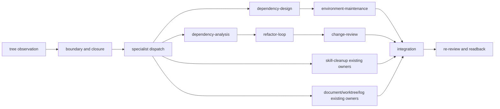

<!--
@dependency-start
contract design
responsibility Defines the shared responsibility-unit cleanup contract and its existing-owner routes.
upstream design ../rule/README.md document filename, placement, and Japanese-content rule
upstream design ../../agents/skills/structure-refactor.md structure-first repair and ownership route
upstream design ../../agents/skills/refactor-loop.md behavior-preserving refactor execution route
upstream design ../../agents/skills/agent-orchestration.md routing, dispatch, and review ownership
upstream design ../../agents/skills/task-routing.md compact skill/tool route selection
downstream implementation ../../agents/skills/responsibility-cleanup.md public responsibility cleanup route
downstream implementation ../../agents/skills/environment-cleanup.md environment cleanup route
downstream implementation ../../agents/skills/code-cleanup.md code cleanup route
downstream implementation ../../agents/skills/skill-cleanup.md skill cleanup route
downstream implementation ../../agents/skills/catalog.yaml public skill registry
downstream implementation ../../agents/skills/skill-dependencies.yaml public skill dependency DAG
downstream implementation ../../tools/agent/skills/skill_shim_materializer.py generated shim materializer
downstream implementation ../../tools/agent/skills/skill_dependency_map.py generated graph materializer
downstream implementation ../../tools/validation/semantic/skills/check_skill_tool_invocation_graph.py graph readback checker
@dependency-end
-->

# 責務単位クリーンアップ設計

## Reader Map

この文書（[documents/design/responsibility-cleanup.md](responsibility-cleanup.md)）は、repository cleanup を近接 path や analyzer の finding ではなく、意味のある
責務単位として閉じるための共通設計です（[documents/design/responsibility-cleanup.md](responsibility-cleanup.md)）。最初に境界と unit schema を読み、次に各
cleanup skill の既存 owner route（[agents/skills/responsibility-cleanup.md](../../agents/skills/responsibility-cleanup.md)）、外部 tool の証拠、validation/rollback、統合と再レビュー
の順に読みます（`agents/skills/catalog.yaml`）。公開 skill の discovery metadata と生成 shim の schema は既存の
catalog/materializer owner（`agents/skills/catalog.yaml`、`tools/agent/skills/skill_shim_materializer.py`）を参照し、この文書へ複製しません。

## Purpose and Target State

cleanup は `tree -a -J --noreport` を構造観測として取得し、source、view、generated、
project、personal の境界、依存 closure、責務単位、候補 path、実装 owner、検証、rollback（`tools/validation/semantic/responsibility/responsibility_scope.py`）、
handoff（[documents/design/responsibility-cleanup.md](responsibility-cleanup.md)）を一つの unit record にまとめます。到達状態は、各 unit が一つの replaceable
responsibility と一つの一次 owner を持ち、必要な specialist dispatch と統合後の
再レビューが readback できる状態です。

ディレクトリ名、近接性、ファイル数、既存 analyzer の finding は候補や観測値として
記録し、責務の authority は owner surface、dependency closure、公開契約、検証 route（[agents/skills/structure-refactor.md](../../agents/skills/structure-refactor.md)）、
および rollback（[agents/skills/structure-refactor.md](../../agents/skills/structure-refactor.md)）によって確定します。

## Responsibility / Owner Boundaries

| unit | route owner | operation | completion evidence ([documents/design/responsibility-cleanup.md](responsibility-cleanup.md)) |
| --- | --- | --- | --- |
| responsibility | `responsibility-cleanup` | tree 観測、境界分類、dependency closure、replaceable unit 化、specialist dispatch、統合と再レビューを束ねる | unit record と owner/review readback |
| environment | `environment-cleanup` | environment dependency/runtime capability unit を `dependency-design` で確定し、`environment-maintenance` へ渡す | design packet、maintenance handoff、environment validation |
| code | `code-cleanup` | public/module responsibility と到達性を `dependency-analysis` で閉じ、`refactor-loop`、`change-review` へ渡す | impact packet、refactor review、targeted validation |
| skill | `skill-cleanup` | canonical doc/catalog/DAG/route/tool command/generated shim/host config/graph/readback を一つの unit として既存 owner へ渡す | shim/graph generation と host config set/order input readback |
| documents/worktree/log | existing owners | `document-canon-cleanup`、`worktree-health`、`agent-log-analysis`、`runtime-log-repair`、`result-artifact-writeout` を再利用する | 既存 owner の receipt |

4 cleanup skill の選択は、explicit public skill ID、host discovery、
`agents/skills/skill-dependencies.yaml` の typed DAG で閉じます。
`agents/skills/catalog.yaml` の4 entryには `routing.triggers`、alias、prompt matcherを
持たせず、近接語やnarrowing keywordを代替authorityにしません。

`structure-refactor`（[agents/skills/structure-refactor.md](../../agents/skills/structure-refactor.md)）は構造と責任境界の修復 owner、
`refactor-loop`（[agents/skills/refactor-loop.md](../../agents/skills/refactor-loop.md)）は意味を保つ refactor の実行 owner、
`agent-orchestration` と `task-routing`（[agents/skills/task-routing.md](../../agents/skills/task-routing.md)）は dispatch/order の
routing owner です（[agents/skills/agent-orchestration.md](../../agents/skills/agent-orchestration.md)）。cleanup skill はこれらの policy を再定義せず、route と evidence を
接続します（[agents/skills/agent-orchestration.md](../../agents/skills/agent-orchestration.md)、[agents/skills/task-routing.md](../../agents/skills/task-routing.md)）。

## Responsibility-Unit Schema

各 cleanup unit は次の field をこの順で保持します。

```text
unit_id,
root,
tree_snapshot,
owner,
surface_class,
source_view_generated_personal_boundary,
evidence,
candidate_paths,
dependencies,
external_tools,
disposition,
validation,
rollback,
handoff
```

`tree_snapshot` は観測した tree artifact の identity、`surface_class` は owner が定義する
責務分類（[documents/design/responsibility-cleanup.md](responsibility-cleanup.md)）、`disposition` は candidate を採用・保留・対象外へ分類した根拠、`handoff` は
次の owner が消費する packet とします（[documents/design/responsibility-cleanup.md](responsibility-cleanup.md)）。path の候補だけで unit を分割せず、hard edge、
dependency、consumer、公開契約、lifecycle（[agents/skills/dependency-analysis.md](../../agents/skills/dependency-analysis.md)）を閉じてから責務単位を確定します。

## Duplicate Implementation Retirement

RC-09 は、既存正本との責務の重複が確認され、明示的に廃止対象となった旧実装・旧入口を
[code-cleanup](../../agents/skills/code-cleanup.md) から削除する契約です。未使用コードの
削除や全面 consumer 移行とは区別します。

まず意味、適用 domain、invariant、state、side effect、I/O、failure semantics を照合し、
残す正本が必要な責務を担うことを確認します。名前、検索件数、構文の類似だけでは重複と
判定しません。独自責務や未確認の意味が残る候補は保留し、その不足を記録します。
未使用コードは到達性と副作用から不要性を別に判断します。file 全体の削除には、その
全寄与について削除根拠が必要です。

重複が確認された廃止対象は、active caller が残っていても削除します。参照は影響情報で
あって温存理由ではなく、利用者ゼロや全 caller の移行完了を削除の前提にしません。
既に移行済みでも同じ責務確認を行い、不要な旧入口を残しません。

削除後の旧参照には、言語、build、import、dispatch の通常のエラーを伝播させます。
silent fallback、alias、互換実装、旧実装の再作成、エラーの握りつぶしで成功に見せません。
通常の削除でエラーになる場合は、エラー専用 stub も新設しません。

編集は明示された範囲内に留めます。dependency closure は影響の観測であり、残存参照の
全面移行、別 repository、別 Issue の修正を終了条件へ追加する権限ではありません。
[refactor-loop](../../agents/skills/refactor-loop.md) の挙動保存・二段階移行や
[change-review](../../agents/skills/change-review.md) の reachable-effects closure は、
この廃止契約を全 consumer の成功維持へ読み替えません。判明した参照、実際のエラー、
未確認事項、呼出側の責務は既存 Issue / PR に残します。

検証・報告では、残す正本の正しさ、旧実装・旧入口の削除、判明した残存参照の失敗を
分けます。意図した旧参照エラーを理由に削除を撤回せず、正本の回帰や無関係な失敗を
期待エラー扱いしません。未実行の検証を成功扱いせず、既存検証の結果と制限を記録します。
新 checker、互換 wrapper、台帳、全面移行 gate は追加しません。

工学的には、参照の存在は実装の独自性を示しません。正本化を全 caller の移行完了と
結合すると依存の推移閉包まで編集が拡大し、重複経路の温存を自己強化します。旧入口を
削除し通常エラーを伝えることで、誤った経路を成功に見せず、移行責務を呼出側に保ちます。

## External Tool Evidence

外部 tool または library を候補に含める場合、公式一次資料、version、scope、false positive、
license/security、install owner、rollback を `external_tools` に記録します。analyzer は
候補生成と証拠収集を担い（[agents/skills/dependency-analysis.md](../../agents/skills/dependency-analysis.md)）、削除・rename・移動の oracle は owner の契約、到達性、validation、
rollback の組み合わせです。採用しない候補も disposition と理由を残します。

## Routing Matrix



`environment-cleanup`、`code-cleanup`、`skill-cleanup` は responsibility unit の closure
を受けた後に独立して dispatch でき、衝突する source surface は依存/order evidence に
従って直列化します。統合は tree/readback を受け、各 owner の validation と rollback
identity を保った候補だけを再レビューへ進めます。

## Validation and Rollback

validation は変更面の既存 checker（`tools/agent/skills/skill_shim_materializer.py`）を使い、necessary presence、forbidden presence、
sufficient behavior を owner の契約に従って分類します（`tools/agent/skills/skill_shim_materializer.py`）。公開 skill surface では catalog、
dependency map、materialized shim、host-wiring source/input の `.codex/config.toml`、generated graph（[documents/runtime/skill-dependency-graph.md](../runtime/skill-dependency-graph.md)）、graph readback を同じ
source snapshot から検証します（[documents/runtime/skill-dependency-graph.md](../runtime/skill-dependency-graph.md)）。失敗は実装原因を分類して同じ owner route を修正し、
checker の条件を弱めずに再実行します（`tools/validation/semantic/skills/check_skill_tool_invocation_graph.py`）。
RC-09 の廃止では、正本の回帰と意図した旧参照エラーを同節の契約に従って分けます。

`tools/agent/skills/skill_shim_materializer.py` の生成 target は
`.codex/personal/skills/<skill>/SKILL.md` だけです。`.codex/config.toml` は materializer の
出力ではなく、`.codex/config.toml` の catalog skill id に対する entry set、source order、
path、enabled の readback input とします。

rollback は `rollback` field に対象 tree/commit、保持する source identity、復元する
generated projection、再検証 command を記録します（[documents/design/responsibility-cleanup.md](responsibility-cleanup.md)）。統合前に candidate の source identity
と tree を保存し、readback 前の削除や別 owner の状態変更を行わないことで復元可能性を
保ちます（[documents/design/responsibility-cleanup.md](responsibility-cleanup.md)）。

## Design-To-Implementation Trace

| clause | implementation owner | target | reverse readback |
| --- | --- | --- | --- |
| RC-01 tree observation and boundary classification | `responsibility-cleanup` / `structure-refactor` | `tree -a -J --noreport`, `tools/validation/semantic/structure/repo_structure_contract.py`, `tools/validation/semantic/responsibility/responsibility_scope.py` | tree snapshot と owner/surface classification |
| RC-02 dependency closure and unit schema | `responsibility-cleanup` / `dependency-analysis` | [documents/design/responsibility-cleanup.md](responsibility-cleanup.md) unit schema, dependency graph | unit fields、closure、handoff readback |
| RC-03 environment route | `environment-cleanup` | [agents/skills/dependency-design.md](../../agents/skills/dependency-design.md), [agents/skills/environment-maintenance.md](../../agents/skills/environment-maintenance.md) | dependency design と maintenance validation |
| RC-04 code route | `code-cleanup` | [agents/skills/dependency-analysis.md](../../agents/skills/dependency-analysis.md), [agents/skills/refactor-loop.md](../../agents/skills/refactor-loop.md), [agents/skills/change-review.md](../../agents/skills/change-review.md) | impact、refactor、review の連続 evidence |
| RC-05 skill route | `skill-cleanup` | `agents/skills/catalog.yaml`, `.codex/config.toml`, `agents/skills/skill-dependencies.yaml`, `tools/agent/skills/skill_shim_materializer.py`, `tools/agent/skills/skill_dependency_map.py` | source/catalog/DAGからshim・graphを生成し、host config set/order inputをreadback |
| RC-06 existing-owner reuse | `responsibility-cleanup` | [agents/skills/document-canon-cleanup.md](../../agents/skills/document-canon-cleanup.md), [agents/skills/worktree-health.md](../../agents/skills/worktree-health.md), [agents/skills/agent-log-analysis.md](../../agents/skills/agent-log-analysis.md), [agents/skills/runtime-log-repair.md](../../agents/skills/runtime-log-repair.md), [agents/skills/result-artifact-writeout.md](../../agents/skills/result-artifact-writeout.md) | reuse route と既存 receipt |
| RC-07 external evidence and rollback | owner-selected specialist | unit `external_tools`, `rollback`、`handoff` | primary source/version/license/security と rollback readback |
| RC-08 integration and re-review | `agent-orchestration` / `change-review` | generated projections、tree/commit readback、review packet | final owner/review/validation readback |
| RC-09 duplicate implementation retirement | `code-cleanup` / `refactor-loop` / `change-review` | [code-cleanup Route](../../agents/skills/code-cleanup.md#route), [refactor-loop Purpose](../../agents/skills/refactor-loop.md#purpose), [change-review Repeated Responsibility Review](../../agents/skills/change-review.md#repeated-responsibility-review) | 重複根拠、旧入口削除、残存参照エラー、編集範囲と正本検証の分離 |

## Evidence And Assumption Ledger

| kind | statement | evidence / owner | status |
| --- | --- | --- | --- |
| current state | public skill identity、dependency relation、runtime shim、host-wiring input、graph はそれぞれ既存の catalog/config/materializer/checker owner が持つ | `agents/skills/catalog.yaml`, `.codex/config.toml`, `agents/skills/skill-dependencies.yaml`, `tools/agent/skills/skill_shim_materializer.py`, `tools/agent/skills/skill_dependency_map.py` | checked |
| target state | 4 cleanup skill は同じ public registry、dependency DAG、host config、generated readback へ接続する | [agents/skills/README.md](../../agents/skills/README.md), [agents/canonical/skills.md](../../agents/canonical/skills.md), `.codex/config.toml` | implementation readback |
| assumption | tree は構造観測であり、責務 authority は owner/dependency/contract evidence から閉じる | `RC-01`, `RC-02`, [agents/skills/structure-refactor.md](../../agents/skills/structure-refactor.md) | explicit |
| assumption | analyzer は candidate producer であり、採用 disposition と削除 oracle は owner route が決める | `RC-02`, `RC-07`, [agents/skills/dependency-analysis.md](../../agents/skills/dependency-analysis.md) | explicit |
| limitation | 外部 tool の採用可否は一次資料、version、scope、false positive、license/security、install owner、rollback の evidence が揃うまで保留する | `RC-07` | explicit |
| contract | 重複が確認された旧実装の廃止は active caller ゼロを前提とせず、正本の正しさと残存参照の通常エラーを区別する | [RC-09](#duplicate-implementation-retirement), [code-cleanup](../../agents/skills/code-cleanup.md), [refactor-loop](../../agents/skills/refactor-loop.md), [change-review](../../agents/skills/change-review.md) | explicit |

## Clause IDs

この文書の設計 clause は `RC-01` から `RC-09` です。各 public skill は clause を参照し、
共通 policy を複製しません。
