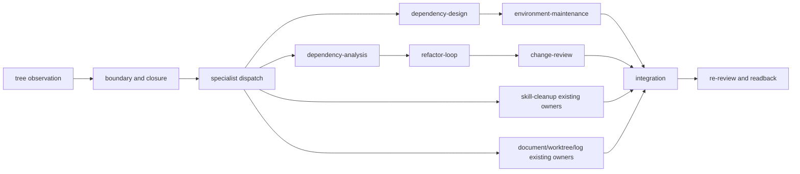

<!--
@dependency-start
contract design
responsibility Defines the shared responsibility-unit cleanup contract and its existing-owner routes.
upstream design ../rule/README.md document filename, placement, and Japanese-content rule
upstream design ../../agents/skills/structure-refactor.md structure-first repair and ownership route
upstream design ../../agents/skills/refactor-loop.md behavior-preserving refactor execution route
upstream design ../../agents/skills/agent-orchestration.md routing, dispatch, and review ownership
upstream design ../../agents/skills/task-routing.md compact skill/tool route selection
upstream design ../runtime/SHARED_RUNTIME_SURFACES.md source, view, generated, and personal boundary
downstream implementation ../../agents/skills/responsibility-cleanup.md public responsibility cleanup route
downstream implementation ../../agents/skills/environment-cleanup.md environment cleanup route
downstream implementation ../../agents/skills/code-cleanup.md code cleanup route
downstream implementation ../../agents/skills/skill-cleanup.md skill cleanup route
downstream implementation ../../agents/skills/catalog.yaml public skill registry
downstream implementation ../../agents/skills/skill-dependencies.yaml public skill dependency DAG
downstream implementation ../../tools/agent_tools/skill_shim_materializer.py generated shim materializer
downstream implementation ../../tools/agent_tools/skill_dependency_map.py generated graph materializer
downstream implementation ../../tools/agent_tools/check_skill_tool_invocation_graph.py graph readback checker
@dependency-end
-->

# 責務単位クリーンアップ設計

## Reader Map

この文書（`documents/design/responsibility-cleanup.md`）は、repository cleanup を近接 path や analyzer の finding ではなく、意味のある
責務単位として閉じるための共通設計です（`documents/design/responsibility-cleanup.md`）。最初に境界と unit schema を読み、次に各
cleanup skill の既存 owner route（`agents/skills/responsibility-cleanup.md`）、外部 tool の証拠、validation/rollback、統合と再レビュー
の順に読みます（`agents/skills/catalog.yaml`）。公開 skill の discovery metadata と生成 shim の schema は既存の
catalog/materializer owner（`agents/skills/catalog.yaml`、`tools/agent_tools/skill_shim_materializer.py`）を参照し、この文書へ複製しません。

## Purpose and Target State

cleanup は `tree -a -J --noreport` を構造観測として取得し、source、view、generated、
project、personal の境界、依存 closure、責務単位、候補 path、実装 owner、検証、rollback（`tools/agent_tools/responsibility_scope.py`）、
handoff（`documents/design/responsibility-cleanup.md`）を一つの unit record にまとめます。到達状態は、各 unit が一つの replaceable
responsibility と一つの一次 owner を持ち、必要な specialist dispatch と統合後の
再レビューが readback できる状態です。

ディレクトリ名、近接性、ファイル数、既存 analyzer の finding は候補や観測値として
記録し、責務の authority は owner surface、dependency closure、公開契約、検証 route（`agents/skills/structure-refactor.md`）、
および rollback（`agents/skills/structure-refactor.md`）によって確定します。

## Responsibility / Owner Boundaries

| unit | route owner | operation | completion evidence (`documents/design/responsibility-cleanup.md`) |
| --- | --- | --- | --- |
| responsibility | `responsibility-cleanup` | tree 観測、境界分類、dependency closure、replaceable unit 化、specialist dispatch、統合と再レビューを束ねる | unit record と owner/review readback |
| environment | `environment-cleanup` | environment dependency/runtime capability unit を `dependency-design` で確定し、`environment-maintenance` へ渡す | design packet、maintenance handoff、environment validation |
| code | `code-cleanup` | public/module responsibility と到達性を `dependency-analysis` で閉じ、`refactor-loop`、`change-review` へ渡す | impact packet、refactor review、targeted validation |
| skill | `skill-cleanup` | canonical doc/catalog/DAG/route/tool command/generated shim/host config/graph/readback を一つの unit として既存 owner へ渡す | source-to-generated readback と graph/shim checker |
| documents/worktree/log | existing owners | `document-canon-cleanup`、`worktree-health`、`agent-log-analysis`、`runtime-log-repair`、`result-artifact-writeout` を再利用する | 既存 owner の receipt |

`structure-refactor`（`agents/skills/structure-refactor.md`）は構造と責任境界の修復 owner、`refactor-loop` は意味を保つ
refactor の実行 owner、`agent-orchestration` と `task-routing` は dispatch/order の
（`agents/skills/refactor-loop.md`）
routing owner です。cleanup skill はこれらの policy を再定義せず、route と evidence を
接続します（`agents/skills/agent-orchestration.md`、`agents/skills/task-routing.md`）。

## Responsibility-Unit Schema

各 cleanup unit は次の field をこの順で保持します。

```text
unit_id,
root,
tree_snapshot,
owner,
surface_class,
source_view_generated_personal_boundary,
evidence,
candidate_paths,
dependencies,
external_tools,
disposition,
validation,
rollback,
handoff
```

`tree_snapshot` は観測した tree artifact の identity、`surface_class` は owner が定義する
責務分類（`documents/design/responsibility-cleanup.md`）、`disposition` は candidate を採用・保留・対象外へ分類した根拠、`handoff` は
次の owner が消費する packet とします（`documents/design/responsibility-cleanup.md`）。path の候補だけで unit を分割せず、hard edge、
dependency、consumer、公開契約、lifecycle（`agents/skills/dependency-analysis.md`）を閉じてから責務単位を確定します。

## External Tool Evidence

外部 tool または library を候補に含める場合、公式一次資料、version、scope、false positive、
license/security、install owner、rollback を `external_tools` に記録します。analyzer は
候補生成と証拠収集を担い（`agents/skills/dependency-analysis.md`）、削除・rename・移動の oracle は owner の契約、到達性、validation、
rollback の組み合わせです。採用しない候補も disposition と理由を残します。

## Routing Matrix



`environment-cleanup`、`code-cleanup`、`skill-cleanup` は responsibility unit の closure
を受けた後に独立して dispatch でき、衝突する source surface は依存/order evidence に
従って直列化します。統合は tree/readback を受け、各 owner の validation と rollback
identity を保った候補だけを再レビューへ進めます。

## Validation and Rollback

validation は変更面の既存 checker（`tools/agent_tools/skill_shim_materializer.py`）を使い、necessary presence、forbidden presence、
sufficient behavior を owner の契約に従って分類します（`tools/agent_tools/skill_shim_materializer.py`）。公開 skill surface では catalog、
dependency map、materialized shim、host config、generated graph（`documents/runtime/skill-dependency-graph.md`）、graph readback を同じ
source snapshot から検証します（`documents/runtime/skill-dependency-graph.md`）。失敗は実装原因を分類して同じ owner route を修正し、
checker の条件を弱めずに再実行します（`tools/agent_tools/check_skill_tool_invocation_graph.py`）。

rollback は `rollback` field に対象 tree/commit、保持する source identity、復元する
generated projection、再検証 command を記録します（`documents/design/responsibility-cleanup.md`）。統合前に candidate の source identity
と tree を保存し、readback 前の削除や別 owner の状態変更を行わないことで復元可能性を
保ちます（`documents/design/responsibility-cleanup.md`）。

## Design-To-Implementation Trace

| clause | implementation owner | target | reverse readback |
| --- | --- | --- | --- |
| RC-01 tree observation and boundary classification | `responsibility-cleanup` / `structure-refactor` | `tree -a -J --noreport`, `tools/agent_tools/repo_structure_contract.py`, `tools/agent_tools/responsibility_scope.py` | tree snapshot と owner/surface classification |
| RC-02 dependency closure and unit schema | `responsibility-cleanup` / `dependency-analysis` | `documents/design/responsibility-cleanup.md` unit schema, dependency graph | unit fields、closure、handoff readback |
| RC-03 environment route | `environment-cleanup` | `agents/skills/dependency-design.md`, `agents/skills/environment-maintenance.md` | dependency design と maintenance validation |
| RC-04 code route | `code-cleanup` | `agents/skills/dependency-analysis.md`, `agents/skills/refactor-loop.md`, `agents/skills/change-review.md` | impact、refactor、review の連続 evidence |
| RC-05 skill route | `skill-cleanup` | `agents/skills/catalog.yaml`, `agents/skills/skill-dependencies.yaml`, `tools/agent_tools/skill_shim_materializer.py`, `tools/agent_tools/skill_dependency_map.py` | source/catalog/DAGからshim・host config・graphへの readback |
| RC-06 existing-owner reuse | `responsibility-cleanup` | `agents/skills/document-canon-cleanup.md`, `agents/skills/worktree-health.md`, `agents/skills/agent-log-analysis.md`, `agents/skills/runtime-log-repair.md`, `agents/skills/result-artifact-writeout.md` | reuse route と既存 receipt |
| RC-07 external evidence and rollback | owner-selected specialist | unit `external_tools`, `rollback`、`handoff` | primary source/version/license/security と rollback readback |
| RC-08 integration and re-review | `agent-orchestration` / `change-review` | generated projections、tree/commit readback、review packet | final owner/review/validation readback |

## Evidence And Assumption Ledger

| kind | statement | evidence / owner | status |
| --- | --- | --- | --- |
| current state | public skill identity、dependency relation、runtime shim、host config、graph はそれぞれ既存の catalog/materializer/checker owner が持つ | `agents/skills/catalog.yaml`, `agents/skills/skill-dependencies.yaml`, `tools/agent_tools/skill_shim_materializer.py`, `tools/agent_tools/skill_dependency_map.py` | checked |
| target state | 4 cleanup skill は同じ public registry、dependency DAG、host config、generated readback へ接続する | `agents/skills/README.md`, `agents/canonical/skills.md`, `.codex/config.toml` | implementation readback |
| assumption | tree は構造観測であり、責務 authority は owner/dependency/contract evidence から閉じる | `RC-01`, `RC-02`, `agents/skills/structure-refactor.md` | explicit |
| assumption | analyzer は candidate producer であり、採用 disposition と削除 oracle は owner route が決める | `RC-02`, `RC-07`, `agents/skills/dependency-analysis.md` | explicit |
| limitation | 外部 tool の採用可否は一次資料、version、scope、false positive、license/security、install owner、rollback の evidence が揃うまで保留する | `RC-07` | explicit |

## Clause IDs

この文書の設計 clause は `RC-01` から `RC-08` です。各 public skill は clause を参照し、
共通 policy を複製しません。
