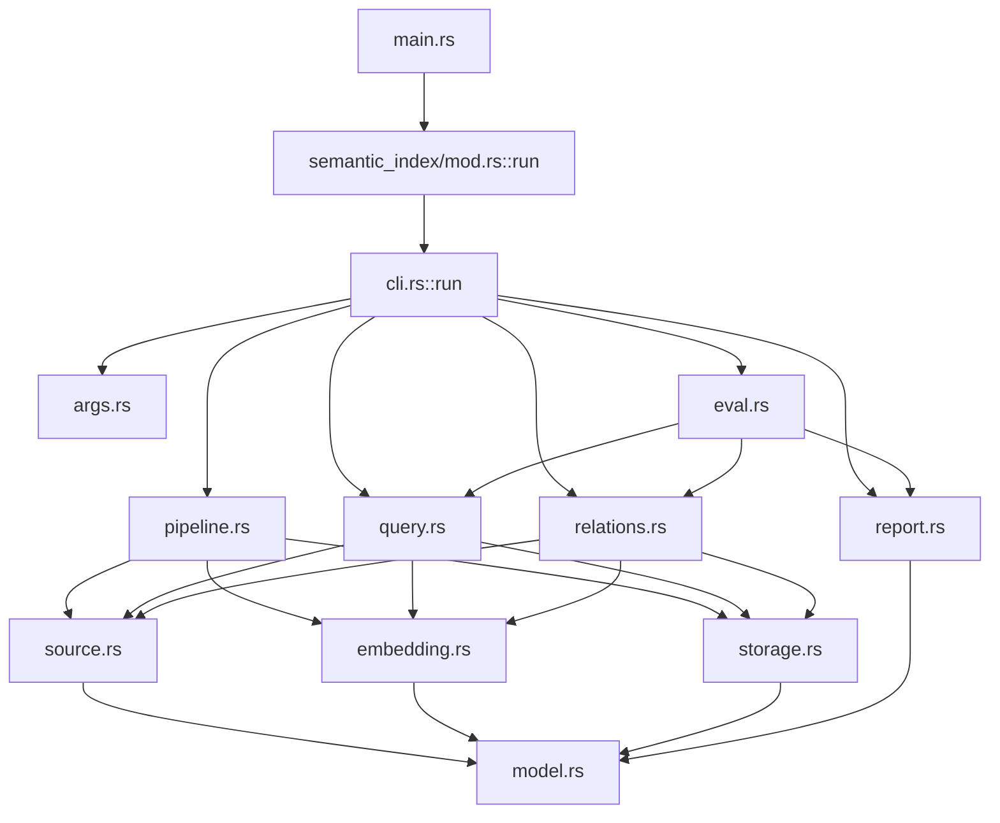

<!--
@dependency-start
contract design
responsibility Defines the approved Rust module-boundary target for the semantic-index CLI, cache, and report pipeline.
upstream design README.md design index and evidence-ledger policy
upstream design dependency-manifest-design.md dependency graph and claim-evidence contract
upstream design rust-agent-tool-migration.md Rust CLI ownership and migration order
upstream design ../tools/semantic_index.md semantic-index command and generated-cache contract
upstream implementation ../../rust/agent-canon/src/semantic_index.rs current monolithic Rust implementation and schema source
upstream implementation ../../rust/agent-canon/src/main.rs canonical Rust CLI dispatch caller
upstream implementation ../../tools/catalog.yaml command catalog and public command source
downstream implementation ../../tools/agent_tools/review_backlog_scan.sh semantic-index command runner
downstream implementation ../../tests/agent_tools/test_review_backlog_scan.py command/report behavior oracle
downstream implementation ../../tests/agent_tools/test_tool_catalog.py command catalog oracle
downstream implementation ../../tools/agent_tools/semantic_provider_html_report.py provider-report consumer
downstream implementation ../../tools/agent_tools/check_design_doc_claims.py changed design claim checker
downstream design README.md AgentCanon design reader index
@dependency-end
-->

# Semantic-index module boundary

## Reader Map

この文書は、Rust の一枚岩 `semantic_index.rs` を CLI、source、cache、embedding、
query、relations、report、eval の replaceable responsibility unit に分ける設計正本
です。最初に current tree と `main.rs` caller、次に CLI/API と schema、target DAG、
transaction/atomic publish、migration wave、test/oracle、rollback の順に読みます。
Python の AgentTeam split とは compiler、可視 API、side effect、behavior oracle が
異なるため、別文書として管理します。

最初の図は「`main.rs` の caller が `mod.rs::run` に入り、`cli.rs::run` が acyclic
owner DAG を dispatch して report を返す」関係を示します。各 command の option と JSON
field の完全な一覧は 3–5 節にあります。



## 1. 構造契約と設計の境界

| 項目 | 固定値 |
| --- | --- |
| audience | Rust CLI 実装者、cache/schema owner、CLI/report reviewer |
| decision context | `semantic_index.rs` の command、pipeline、cache、分析、出力を十一の responsibility module と `mod.rs` entrypoint に分ける |
| first artifact | 上記の Mermaid acyclic DAG |
| source-to-structure map | current source `rust/agent-canon/src/semantic_index.rs` と caller は 2–3 節、schema は 4 節、target/DAG は 5 節、検証は 8 節 |
| document unit | semantic-index の Rust module、CLI contract、SQLite/JSON schema、transaction boundary |
| document split decision | `split:agent-team-module-boundaries.md` と分離。Python runtime と Rust CLI の owner/compiler/oracle が異なる |
| invalid split boundaries | line count、token budget、chunking convenience、テスト件数、近い function |
| validation gate | fresh graph、`agent-canon docs check`、changed design claim checker、`cargo fmt`/`cargo check`/behavior oracle |

関数の行数やテストの行数は split 根拠にしません。module 間の data contract、
依存方向、side effect、schema ownership、validation route が future owner `rust/agent-canon/src/semantic_index/mod.rs` ごとに独立していることを `cca8ee28e25414efabd1fea6829fcf533f9c3336ae2ac0c35731d4b62347f2a8`
replaceable unit の根拠にします。

## 2. Evidence And Assumption Ledger

- Evidence source は `rust/agent-canon/src/semantic_index.rs`、
  `rust/agent-canon/src/main.rs`、
  `tools/catalog.yaml` です。対象は AgentCanon origin/main source snapshot
  `ebba9ea058ec61abad6cdaf96f22badf2784c8b3` です。
- Approved target-state contract は
  `cca8ee28e25414efabd1fea6829fcf533f9c3336ae2ac0c35731d4b62347f2a8`
  です。この token を持つ claim は reviewer が確定した未実装 target であり、current
  source behavior の evidence とは分類しません。
- direct caller は `rust/agent-canon/src/main.rs` の
  `mod semantic_index` と `semantic_index::run` です。command runner は
  `tools/agent_tools/review_backlog_scan.sh`、catalog consumer は
  `tools/catalog.yaml`、behavior tests は
  `tests/agent_tools/test_review_backlog_scan.py` と
  `tests/agent_tools/test_tool_catalog.py` です。
- schema evidence は `semantic_index.rs` の `init_schema`、`persist_*`、
  `*_json`、`print_*`、`write_*` declarations です。これらの current field/name は
  target でも同じ owner が canonical source とします。
- Assumptions は command name、alias、default、exit code、stdout/stderr marker、
  SQLite table/column、JSON key、cache path、atomic publish を移行中に変更しない
  ことです。embedding provider の品質や semantic ranking の改善はこの boundary
  change の意味に含めません。
- Assumption contract は `normalization` を `rust/agent-canon/src/semantic_index.rs` の CLI input と stored/report identity の
  observable shape を変えない behavior-preserving 変換として登録し、module 移動で
  algorithm または schema の意味を変更しません。
- `use super::*` は current test convenience であり、module API ではありません。
  target test は owner module の explicit `crate::semantic_index::<module>::...` import
  を使い、glob import や private field を API として固定しません。

## 3. Current tree と exact caller/public API inventory

### 3.1 対象 tree

```text
rust/agent-canon/
├── Cargo.toml
├── src/
│   ├── main.rs
│   └── semantic_index.rs
└── tests/
    └── python_algorithm_contract_cli.rs
```

`semantic_index.rs` は 7,517 行の current source で、top-level に
`SemanticCommand`、各 `*Args`、domain/result structs、`run`、parser、build/query/ は current owner `rust/agent-canon/src/semantic_index.rs` の
relation/eval、SQLite、embedding、report、utility、同一 module の tests を持ちます。
exact declaration inventory の一次 source は
`rust/agent-canon/src/semantic_index.rs` です。Rust module は
`main.rs` の `mod semantic_index` で private に束ねられ、外側から見える callable は
`pub fn run(args: &[String]) -> i32` 一つだけです。他の current type/function/const は
private であり、target でも crate 外の public API にしません。

### 3.2 direct caller と generated-output consumer

| caller/consumer | exact surface | target での扱い |
| --- | --- | --- |
| `rust/agent-canon/src/main.rs` | `mod semantic_index`; `semantic_index::run(&args[2..])`; `std::process::exit` | `main.rs` → `semantic_index/mod.rs::pub(crate) fn run` → `semantic_index/cli.rs::pub(super) fn run` の一経路にする |
| `tools/catalog.yaml` | `tools/bin/agent-canon semantic-index build --include documents --include agents`; command metadata | `cli.rs` の command/option contract と同じ source map を持つ |
| `tools/agent_tools/review_backlog_scan.sh` | `build`, `embed-provider`, `merge-candidates`, `thin-docs`, `search`, `eval-output`, `compare-providers` | shell runner は CLI process boundary のまま、Rust internals を import しない |
| `tools/agent_tools/semantic_provider_html_report.py` | `semantic_index_provider_compare` JSON を読む report consumer | `report.rs` の JSON schema を読む下流 consumer |
| `tests/agent_tools/test_review_backlog_scan.py` | sqlite/jsonl/json output path、summary marker、output Eval | command process の behavior oracle |
| `tests/agent_tools/test_tool_catalog.py` | catalog command string と build-before-report | catalog/CLI compatibility oracle |
| `tests/fixtures/semantic-index/basic` | Eval fixture の dependency header と input docs | `eval.rs` の fixture contract oracle |

Rust integration caller は現在 `main.rs` 一つです。`semantic_index.rs` 内の
`mod tests` は private implementation の current tests であり、public API caller では
ありません。target では各 owner module の `#[cfg(test)] mod tests` または明示的な
crate test module に移し、`use super::*` を削除します。

### 3.3 command/public API inventory

`cli.rs::run` が受ける subcommand と alias は次のとおりです。alias は互換性のため固定し、
新 alias は別の CLI design decision とします。

| command | alias | primary operation |
| --- | --- | --- |
| `build` | なし | source discovery、node segmentation、deterministic/provider embedding、SQLite cache build |
| `embed-provider` | なし | 既存 node への provider embedding 追加 |
| `search` | なし | query embedding と top-k search |
| `context-pack` | なし | bounded evidence cell の生成 |
| `responsibility-tree` | `directory-tree` | directory responsibility と coverage report |
| `similar` | なし | similarity pair |
| `merge-candidates` | なし | responsibility-bounded merge candidate |
| `thin-docs` | なし | thin document candidate |
| `natural-relations` | `nl-relations` | directed natural-language relation |
| `discourse-relations` | `discourse-edges` | discourse relation |
| `eval` | なし | fixture query/pair Eval |
| `compare-providers` | なし | provider pair comparison |
| `eval-output` | なし | generated JSONL artifact Eval |

help は `--help`、`-h`、`help` と command omission で選択されます。

#### option alias inventory

| canonical option | aliases/意味 | owner |
| --- | --- | --- |
| `--embedding-url` | `--embed-base-url` | `args.rs` と `embedding.rs` の provider contract |
| `--embedding-batch` | `--embed-batch-size` | `args.rs` |
| `--top-k` | `context-pack` では `--max-cells` と同義、tree では `--limit` と同義 | `args.rs` |
| `--include-vector` | `--include-vectors` | `args.rs` |
| `--check-directory-coverage` | `--check-coverage` | `args.rs` |
| `--min-similarity` | natural relations の `--min-score` | `args.rs` |
| `--cross-file-only` | natural relations の default true; `--allow-same-file` が false 切替 | `args.rs` |
| `--profile` | discourse の `--connective-profile` | `args.rs` |
| `--min-naturalness` | discourse の `--min-score` | `args.rs` |
| `--window` | discourse の `--max-window` | `args.rs` |
| `--left-embedding-url` | `--left-embed-base-url` | `args.rs` |
| `--right-embedding-url` | `--right-embed-base-url` | `args.rs` |

`--query`、`--query-file`、`--query-stdin` は search/context-pack で相互排他的な
query source です。`--query-file` は file read、`--query-stdin` は stdin read の
side effect を持ちます。

## 4. CLI defaults、exit、stdout/stderr、schema

### 4.1 default contract

`semantic_index.rs` の current constants と parser 初期値を target `args.rs` が一つの
source に集約します。

| field | default |
| --- | --- |
| provider/model | `deterministic-dense-v1` / `hash-token-char-v1` |
| dimension | `128` |
| top-k | `10` |
| min score | `0.80` |
| max file bytes | `1000000` |
| embedding batch | `16` |
| context caps | cells `12`、cell chars `900`、total chars `6000` |
| tree node kind | `document` |
| thin-doc thresholds | thin `0.50`、neighbor `0.86` |
| relation thresholds | similarity `0.72`、kind-of `0.62` |
| discourse | profile `general`、naturalness `0.40`、window `3` |
| output format | `text` |
| root/includes | root `.`、build include は空なら `.` |
| database | `AGENT_CANON_SEMANTIC_INDEX_HOME`、なければ `$HOME/.cache/agent-canon/semantic-index`（なければ temp）配下の repo-key `/index.sqlite` |
| default excludes | `.git`、`.agent-canon/log-archive`、`.agent-canon/semantic-index`、`.agent-canon/search-index`、`agents/evals/results`、`target`、`__pycache__`、`.pytest_cache`、`.ruff_cache`、`.venv`、`venv`、`reports/agents`、`reports/hooks`、`reports/.cache` |

remote embedding の max chars `3000`、discourse text chars `1600`、vector epsilon
`1.0e-6`、merge candidate floor `4`、natural feature fanout `64` も current
algorithm/input constants として移動時に保持します。値の変更は module boundary では
なく algorithm/API change です。

### 4.2 exit/stdout/stderr contract

| condition | stdout | stderr | exit |
| --- | --- | --- | --- |
| help | usage は出さない | usage text | `0` |
| build 成功 | `SEMANTIC_INDEX_BUILD=ok` と DB/files/nodes/embeddings | なし | `0` |
| embed 成功 | `SEMANTIC_INDEX_EMBED_PROVIDER=ok` と DB/nodes/embeddings | なし | `0` |
| search/context/query analysis 成功 | `text`/`json`/`jsonl` の既存 output | なし | `0` |
| responsibility tree coverage failure | report/output は通常どおり | なし | `1` |
| eval が pass でない | selected format の report/summary | なし | `1` |
| provider/output Eval が pass でない | selected format の report/summary | なし | `1` |
| runtime/domain error | なし（report file が先に成功した場合を除く） | `SEMANTIC_INDEX_<SCOPE>=fail` と `SEMANTIC_INDEX_ERROR=...` | `1` |
| parse/unknown command/unknown option | なし | `SEMANTIC_INDEX_CLI=fail`、error、usage | `2` |

`semantic_index/mod.rs::run` は `semantic_index/cli.rs::run` の integer return をそのまま
返し、`main.rs` が `std::process::exit` へ渡します。`cli.rs` は parse、dispatch、usage、
stdout/stderr、exit-status mapping を future owner `rust/agent-canon/src/semantic_index/cli.rs` が所有します `cca8ee28e25414efabd1fea6829fcf533f9c3336ae2ac0c35731d4b62347f2a8`。report file の write failure は stdout success
marker の前に error として扱います。`jsonl` は bounded summary と result object を
stdout に順に出し、long query text を echo する current behavior を保持します。

### 4.3 SQLite schema ownership

`storage.rs` が `init_schema`、`open_cache_connection`、insert/load、schema version、
transaction、temp/publish を所有します。各 table と column は次の current schema を
移動後も保ちます。

| table | columns |
| --- | --- |
| `files` | `file_id`, `path`, `content_hash`, `size_bytes`, `indexed_at` |
| `nodes` | `node_id`, `file_id`, `node_kind`, `parent_node_id`, `line_start`, `line_end`, `text_hash` |
| `embeddings` | `node_id`, `provider`, `model`, `dim`, `dtype`, `vector`、primary key は node/provider/model/dim |
| `analysis_runs` | `run_id`, `kind`, `created_at`, `params_json` |
| `similar_pairs` | `run_id`, `left_node_id`, `right_node_id`, `score`, `rank` |
| `thin_docs` | `run_id`, `node_id`, `thin_score`, `rank`, `action`, `reasons_json`, `metrics_json`, `target_node_id`, `target_score` |
| `natural_language_relations` | `run_id`, `left_node_id`, `right_node_id`, `similarity_score`, `left_is_kind_of_right_score`, `right_is_kind_of_left_score`, `relation_kind`, `rank` |
| `discourse_relations` | `run_id`, `left_node_id`, `right_node_id`, `similarity_score`, `connective_profile`, `relation_family`, `relation_schema`, `surface_phrase`, `inverse_surface_phrase`, `surface_order`, `logical_direction`, `naturalness_score`, `inverse_naturalness_score`, `direction_confidence`, `ambiguity`, `gap_flags_json`, `rank` |

`PRAGMA user_version = 1`、foreign key relation、`dtype=f32le`、provider/model/dim
identity は schema contract です。schema migration は別 wave とし、module split で
table を分割・rename・無言変換しません。

### 4.4 JSON schema ownership

`report.rs` が JSON/JSONL field、summary marker、text formatting、report write を
所有し、`eval.rs` は Eval-specific report semantics のみを所有します。主要 output
identity と result object は次のとおりです。

| output | required identity/fields |
| --- | --- |
| search | `semantic_index_search`, `query` または `query_chars`, `stale_path_count`, `results`; result は `rank`, `score`, `path`, `node_kind`, `line_start`, `line_end` |
| context-pack | `semantic_index_context_pack`, `query_chars`, `provider`, `model`, `max_cells`, `max_cell_chars`, `max_total_chars`, `cell_count`, `cells`; cell は `rank`, `score`, `path`, `node_kind`, `line_start`, `line_end`, `responsibility_bucket`, `excerpt_chars`, `excerpt` |
| responsibility-tree | `semantic_index_responsibility_tree`, root/db/provider/model/dim/node kind、directory counts、`coverage`, `directories`; coverage は status、expected/db/missing/stale directory inventories |
| pairs | `semantic_index_pairs`, `kind`, `results`; pair は rank/score/responsibility/bucket と left/right path/node/line range |
| thin docs | `semantic_index_thin_docs`, `results`; candidate は rank、thin score、action、reasons、path/node/line、best match、metrics |
| natural relations | `semantic_index_natural_relations`, thresholds、`results`; relation は rank、relation kind、scores、left/right surface/responsibility/line range |
| discourse relations | `semantic_index_discourse_relations`, profile、threshold、window、`results`; relation は connective profile、relation family/schema、surface/inverse phrase、order/direction、naturalness、ambiguity、gap flags、left/right |
| fixture eval | `semantic_index_eval`, fixture/db/build/search/similarity/must-not、case/recall/MRR/results |
| provider compare | `semantic_index_provider_compare`, db/top-k/min-score、left/right provider/model/dim/node/candidate counts、merge/search delta |
| output eval | `semantic_index_output_eval`, artifacts、findings、error count |

provider metadata は report と cache identity の両方で同じ値を使います。長い query
の全文 echo、field omission、text/json/jsonl の shape 変更、rank/score sort の変更は
この boundary change では許可しません。

## 5. Target responsibility map と acyclic DAG

| target path | owner | current function/type cluster |
| --- | --- | --- |
| `rust/agent-canon/src/semantic_index/mod.rs` | crate-facing `run` entrypoint | `pub(crate) fn run`、module declarations、`cli::run` への一段 delegation |
| `rust/agent-canon/src/semantic_index/model.rs` | cross-owner domain/result identities | 複数 capability owner が共有する `TextNode`, `IndexedNode`, `ScoredNode` 等だけ。CLI/storage/report/Eval 固有 DTO の集約先にはしない |
| `rust/agent-canon/src/semantic_index/args.rs` | parser input DTO、aliases、defaults、validation | all `*Args`、`SemanticCommand`、`ParsedArgs`、`OutputFormat`、`SimilarKind`、default/value/validation helpers。token parse と dispatch は持たない |
| `rust/agent-canon/src/semantic_index/source.rs` | file discovery/segmentation | `discover_files`, `collect_files`, `should_exclude`, `is_indexable`, `segment_text`, markdown/block segmentation、path/line metadata |
| `rust/agent-canon/src/semantic_index/storage.rs` | SQLite schema/read/write/atomic publish | `init_schema`, `open_cache_connection`, `clear_index`, insert/load、`prepare_*_db`, `finish_write_db`, DB path helpers、relation persistence |
| `rust/agent-canon/src/semantic_index/embedding.rs` | deterministic/remote embedding and vector math | `embed_text`, provider embedding, remote response parsing、token/char-gram/vector helpers、provider dimension resolution |
| `rust/agent-canon/src/semantic_index/pipeline.rs` | build orchestration | `build_index`, `embed_existing_nodes`、source→model→embedding→storage ordering |
| `rust/agent-canon/src/semantic_index/query.rs` | search/context/tree read operations | `search_index`, `context_pack`, `responsibility_tree`, tree coverage、score/load/read-side helpers |
| `rust/agent-canon/src/semantic_index/relations.rs` | pair/thin/natural/discourse analysis | `similar_pairs`, `thin_docs`, `natural_relations`, `discourse_relations`、candidate/scoring/classification/sort helpers |
| `rust/agent-canon/src/semantic_index/report.rs` | text/JSON/JSONL schema、serialization、direct file write | `print_*`, `*_json`, `write_report`, `write_pretty_report`, result sorting/serialization helpers、report parent creation/file write |
| `rust/agent-canon/src/semantic_index/eval.rs` | fixture and generated-artifact evaluation | `run_eval`, query/pair checks、`compare_providers`, `eval_output`、artifact readers/finding summaries |
| `rust/agent-canon/src/semantic_index/cli.rs` | CLI parse/dispatch/usage/output/exit mapping | `pub(super) fn run`、`parse_*_args`、command dispatch、`print_usage`、`fail`、stdout/stderr と integer exit-status mapping |

target `mod.rs` の crate-facing API は `pub(crate) fn run(args: &[String]) -> i32` だけです。
`cli::run` と sibling module 間で渡す DTO/type/function は `pub(super)` に限定します。
各 DTO は `args.rs`、`storage.rs`、`pipeline.rs`、`query.rs`、`relations.rs`、`report.rs`、
`eval.rs` の defining owner に置き、sibling が読む必要 field だけを `pub(super)`、
owner 内だけで使う field を private とします。`model.rs` は cross-owner domain identity
だけを持ち、owner-local DTO を集約しません。
`pub(crate)` field は 0 件にします。crate-facing domain type、CLI args、SQLite
connection、serde JSON object は追加しません。この確定 visibility contract は
`cca8ee28e25414efabd1fea6829fcf533f9c3336ae2ac0c35731d4b62347f2a8` に属します。

### 5.1 DAG と dependency rule

```text
mod.rs ──> cli.rs
cli.rs ──> args.rs, pipeline.rs, query.rs, relations.rs, eval.rs, report.rs
pipeline.rs ──> args.rs, source.rs, embedding.rs, storage.rs, model.rs
query.rs ──> args.rs, source.rs, embedding.rs, storage.rs, model.rs
relations.rs ──> args.rs, source.rs, embedding.rs, storage.rs, model.rs
eval.rs ──> args.rs, query.rs, relations.rs, report.rs, storage.rs, model.rs
report.rs ──> args.rs, model.rs

source.rs ──> model.rs
embedding.rs ──> model.rs
storage.rs ──> model.rs
args.rs ──> model.rs (必要な enum/format 参照だけ)
```

`storage.rs` は report/eval/query/relations を import しません。`report.rs` は
SQLite を直接更新せず、`pipeline/query/relations` の result を projection します。
`query.rs` は eval を呼ばず、`relations.rs` は query/eval を呼びません。
`eval.rs` は分析結果を読む最上位 consumer であり、report schema を再実装しません。
これで target DAG は acyclic になり、`mod.rs` は entry delegation、`cli.rs` は command
orchestration、`pipeline.rs` は build ordering を所有します。

## 6. Transaction、atomic publish、side effects

build は `pipeline.rs` の一つの orchestration として、source discovery、clear、node
insert、embedding、stats を一つの transaction boundary で実行します。`storage.rs`
は完成した write DB を target DB と別に保持し、既存実装 `rust/agent-canon/src/semantic_index.rs` の
`prepare_write_db`/`prepare_existing_write_db`、sibling publish path、`finish_write_db`
の意味を維持します。

- 新規 build は target が local temp path でない限り temp SQLite を作り、schema/rows/
  embedding が完了してから publish file を作成し、`rename` で target を置換します。
- 既存 DB に対する relation persistence は target copy を temp に作り、全 rows と
  `analysis_runs` を書き終えてから同じ atomic publish を行います。
- 途中 error は target DB を変更せず、temp/publish file を回収します。回収失敗は
  error evidence に残し、成功扱いにしません。
- local temp path の current exception（target 自体へ write）は current owner `rust/agent-canon/src/semantic_index.rs` の behavior として保持します。
  transaction/atomic publish の変更は network-backed worktree compatibility を壊す
  ため、別 design decision です。
- `report.rs` は JSON/JSONL schema、serialization、parent directory 作成、report path
  への direct file write を所有します。`storage.rs` を report write に介在させず、
  partial report または write failure を `rust/agent-canon/src/semantic_index/report.rs` の success output として宣言しません `cca8ee28e25414efabd1fea6829fcf533f9c3336ae2ac0c35731d4b62347f2a8`。
- `storage.rs` は SQLite schema、transaction、temp/copy/rename による atomic DB publish
  だけを future owner `rust/agent-canon/src/semantic_index/storage.rs` が所有し、JSON schema、serializer、report file write を持ちません `cca8ee28e25414efabd1fea6829fcf533f9c3336ae2ac0c35731d4b62347f2a8`。
- `source.rs` の filesystem read、`args.rs` の query-file/stdin read、
  `embedding.rs` の remote provider call、`storage.rs`/`report.rs` の file write は
  明示 command invocation の side effect です。module import は I/O を行いません。

## 7. Allowed / forbidden semantic delta

| 種類 | 許可する差分 | 許可しない差分 |
| --- | --- | --- |
| structure | `.rs` split、`mod.rs` → `cli.rs` delegation、sibling `pub(super)`、test module relocation | line-count split、namespace stuffing、cycle、run 以外の crate-facing item、`pub(crate)` field |
| CLI | parser function の移動、owner enum の移動 | command/alias、option alias、default、usage、exit、stdout/stderr の変更 |
| storage | schema code の移動、transaction helper の抽出 `rust/agent-canon/src/semantic_index/storage.rs` | SQLite table/column/key/version、cache path、atomic publish、partial write semantics の変更 `cca8ee28e25414efabd1fea6829fcf533f9c3336ae2ac0c35731d4b62347f2a8` |
| report | serializer の owner 移動、typed internal result | JSON/JSONL key、text format、rank/score order、query echo、marker の変更 |
| algorithm | function placement、explicit input/output type | embedding、segmentation、threshold、relation classification、Eval oracle の意味変更 |
| tests | owner module の explicit import、reachable bad input の追加 | `use super::*`、private implementation detail の固定、impossible-input test、oracle weakening |

### compiler/static trust と behavior oracle

Rust compiler、`cargo fmt --check`、`cargo check`、module visibility check は型、
borrow、`rust/agent-canon/src/semantic_index/mod.rs` の `pub(crate) fn run`、defining owner 内の sibling `pub(super)`、0 件の `pub(crate)` field、未解決 `cca8ee28e25414efabd1fea6829fcf533f9c3336ae2ac0c35731d4b62347f2a8`
import、DAG の構造を信頼できる static evidence です。
それらは CLI output、SQLite atomicity、JSON schema、remote provider error、semantic
ranking の behavior を証明しません。

behavior oracle は `tests/agent_tools/test_review_backlog_scan.py`、
`tests/agent_tools/test_tool_catalog.py`、semantic-index fixture
Eval と process-level capture です。次を直接 readback します。

- command、alias、default option、usage、stdout/stderr marker、exit status。
- SQLite の table/column、row count、provider identity、atomic publish 後の target DB。
- text/json/jsonl の keys、summary/result order、query redaction、report file。
- source boundary、embedding shape、relation classification、Eval pass/fail。
- write failure 時の target preservation と temp cleanup は `tests/agent_tools/test_review_backlog_scan.py` で確認します。

compiler pass を behavior pass の代わりにしません。behavior test は「到達可能な
bad input」「実在する filesystem/provider error」「schema mismatch」「publish failure」
を使い、型システム上到達不可能な input を作りません。

## 8. Migration waves、test movement、rollback

1. **Preflight: inventory freeze** — `semantic_index.rs` の declarations、
   `main.rs` の direct caller、catalog、shell runner、JSON/SQLite schema、test fixture、
   `use super::*` を固定し、current output snapshot を作ります。
2. **Wave 1: shared model/args/source** — `semantic_index.rs` を
   `semantic_index/mod.rs` へ移し、`model.rs` へ cross-owner domain identity だけを、
   `args.rs` と `source.rs` へ owner-local definition/test を移します。args/source DTO は
   defining owner に残し、移した definition と `use super::*` は同じ wave で `mod.rs`
   から削除します。
3. **Wave 2: storage/embedding** — schema、DB path、provider vectors、transaction/
   atomic publish の definition、owner-local DTO、tests を `storage.rs`/`embedding.rs` へ
   移し、移した definition を同じ wave で `mod.rs` から削除します。
4. **Wave 3: pipeline/query/relations** — build orchestration と pipeline-local DTO/tests は future owner `rust/agent-canon/src/semantic_index/pipeline.rs` へ移します。
   search/context/tree の read operations と query-local DTO/tests は future owner `rust/agent-canon/src/semantic_index/query.rs` へ移します。
   pair/thin/natural/discourse relation analysis と relations-local DTO/tests は future owner `rust/agent-canon/src/semantic_index/relations.rs` へ移します。
   各 owner へ移した definition は同じ wave で `mod.rs` から削除します。`query.rs` と `relations.rs` は互いの private
   implementation を import しません。
5. **Wave 4: report/eval/cli/mod** — JSON/text/JSONL schema、serializer、direct report file write、report-local DTO は future owner `rust/agent-canon/src/semantic_index/report.rs` へ移します。
   Eval semantics、fixture/artifact reader、finding summary、Eval-local DTO は future owner `rust/agent-canon/src/semantic_index/eval.rs` へ移します。
   parse、dispatch、usage、stdout/stderr、integer exit-status mapping、CLI-local DTO は future owner `rust/agent-canon/src/semantic_index/cli.rs` へ移します。各 owner へ移した definition
   は同じ wave で `mod.rs` から削除します。`mod.rs` には `pub(crate) fn run` と module
   declarations だけを残し、`main.rs` → `mod.rs::run` → `cli.rs::run` を接続します。

各 migration wave は definition move、explicit test import、old definition delete、
compiler/behavior readback を一つの commit に含めます。old/new 二重 authority、alias、
forwarder、wrapper、compatibility wiring は置きません。failure 時は wave 全体を最後の
成功 commit へ戻します。temp SQLite と publish file は rollback authority ではなく、future owner `rust/agent-canon/src/semantic_index/storage.rs` が保持する read-only failure evidence として扱います。
report artifact は rollback authority ではなく、future owner `rust/agent-canon/src/semantic_index/report.rs` が保持する read-only failure evidence として扱います。この確定順序は `cca8ee28e25414efabd1fea6829fcf533f9c3336ae2ac0c35731d4b62347f2a8`
`cca8ee28e25414efabd1fea6829fcf533f9c3336ae2ac0c35731d4b62347f2a8` に属します。

## 9. Design-To-Implementation Trace

| clause | current evidence | target mechanism | completion evidence |
| --- | --- | --- | --- |
| `RC-01` | `rust/agent-canon/src/main.rs` の `semantic_index::run` | `main.rs` → `mod.rs::pub(crate) fn run` → `cli.rs::pub(super) fn run` | `cargo check` と main caller readback |
| `RC-02` | `rust/agent-canon/src/semantic_index.rs` の `parse_args`、usage、`fail` | `cli.rs` が parse/dispatch/usage/stdout/stderr/exit mapping、`args.rs` が DTO/default/validation を所有 | command matrix の stdout/stderr/exit comparison |
| `RC-03` | `init_schema` と `clear_index` の current SQLite tables | `storage.rs` が schema/version/transaction/atomic publish を所有 | schema inventory と failure preservation |
| `RC-04` | `build_index` と `embed_existing_nodes` | `pipeline.rs` が source→embedding→storage ordering を所有 | build/embed DB readback |
| `RC-05` | `search_index`、`context_pack`、`responsibility_tree` | `query.rs` が read-side result contract を所有 | text/json/jsonl result oracle |
| `RC-06` | `similar_pairs`、`thin_docs`、`natural_relations`、`discourse_relations` | `relations.rs` が analysis domain を所有 | relation JSON/SQLite/Eval oracle |
| `RC-07` | `*_json`、`print_*`、`run_eval`、`eval_output` | `report.rs` が JSON schema/serialization/direct file write/report DTO、`eval.rs` が Eval semantics/Eval DTO を各 defining owner として所有 | report schema と fixture/output Eval |
| `RC-08` | `tools/agent_tools/review_backlog_scan.sh` と catalog | `cli.rs` が process-facing contract、`mod.rs` が crate-facing delegation を所有 | shell/catalog compatibility |
| `RC-09` | current `mod tests` の `use super::*` | owner module test の explicit imports | no glob import、reachable-input tests、compiler pass |

`RC-01`–`RC-09` はこの design pass の request clauses です。implementation commit は
各 wave で clause と current source token を再掲し、future module path を実装後の
fresh graph source identity `rust/agent-canon/src/semantic_index/mod.rs` に接続します `cca8ee28e25414efabd1fea6829fcf533f9c3336ae2ac0c35731d4b62347f2a8`。

## 10. 確定した設計判断

- runtime chain は `main.rs` → `semantic_index/mod.rs::run` →
  `semantic_index/cli.rs::run` です。`cli.rs` が parse、dispatch、usage、stdout/stderr、
  integer exit-status mapping を所有します。
- crate-facing callable は `mod.rs` の `pub(crate) fn run` だけです。sibling DTO と
  cross-module member は各 defining owner で必要なものだけ `pub(super)` にし、
  `pub(crate)` field は 0 件にします。`model.rs` は owner-local DTO の集約先にしません。
- `report.rs` は JSON/JSONL schema、serialization、direct report file write を所有します。
  `storage.rs` は SQLite schema、transaction、atomic DB publish を所有します。
- 各 migration wave は移した definition を同じ wave で旧 owner から削除し、
  compatibility wiring または二重 behavior authority を残しません。

これらは approved target-state contract
`cca8ee28e25414efabd1fea6829fcf533f9c3336ae2ac0c35731d4b62347f2a8`
の確定判断であり、DAG、owner `rust/agent-canon/src/semantic_index/cli.rs`、implementation mechanism、validation route に未解決分岐はありません `cca8ee28e25414efabd1fea6829fcf533f9c3336ae2ac0c35731d4b62347f2a8`。
