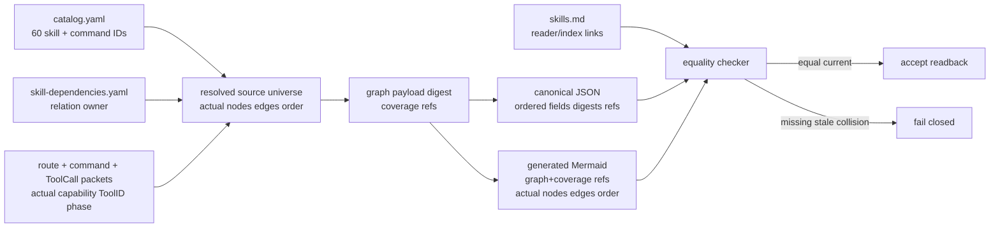

<!--
@dependency-start
contract design
responsibility Defines the canonical source universe, serialization, generated projections, and readback contract for skill/tool invocation.
upstream design ../rule/README.md document naming and Japanese-content rule
upstream design ../../agents/skills/agent-orchestration.md route and Decision Sufficiency owner
upstream design ../../agents/skills/catalog.yaml sole public skill and command identity owner
upstream design ../../agents/skills/skill-dependencies.yaml prerequisite, successor, order, and parallel relation owner
upstream design ../../agents/canonical/skills.md reader-facing catalog projection
upstream design ../../agents/internal-routines/design-implementation-correspondence.md universal design-to-implementation correspondence
downstream implementation ../../tools/agent_tools/skill_route_catalog.py catalog resolver
downstream implementation ../../tools/agent_tools/route.py capability and phase route materialization
downstream implementation ../../tools/agent_tools/skill_tool_commands.py command packet projection
downstream implementation ../../tools/agent_tools/skill_dependency_map.py dependency graph validation
downstream implementation ../../tools/agent_tools/agent_team.py typed ToolCall materialization
downstream implementation ../../tools/agent_tools/bootstrap_agent_run.py handoff and manifest transport
downstream implementation ../../tools/agent_tools/check_agent_runtime_alignment.py runtime alignment readback
downstream implementation ../../tools/agent_tools/check_convention_compliance.py canonical route convention gate
@dependency-end
-->

# Skill / Tool Invocation Graph

## Reader Map

この文書は、skill、command、capability、phase、ToolID、ToolCall、manifest、dependency/order/routing/parallel edge、JSON、Mermaid、readback を同じ source snapshot から対応付ける設計正本です。先に owner boundary と universe を読み、次に canonical serialization、invariants、checker 入出力、failure semantics を確認します。最後に current 60-skill catalog inventory と Design-To-Implementation Trace を使って実装・レビューへ渡します。個別の skill 本文は `agents/skills/*.md`、読者向け一覧は `agents/canonical/skills.md`、関係は `agents/skills/skill-dependencies.yaml`、共通対応遷移は `agents/internal-routines/design-implementation-correspondence.md` が所有します。

## Responsibility / Owner Boundaries

| 責務 | 唯一の正本 owner | projection / materializer | 境界 (`agents/skills/catalog.yaml`) |
| --- | --- | --- | --- |
| skill identity と skill-owned command identity | `agents/skills/catalog.yaml` | `skill_route_catalog.py`, `skill_tool_commands.py` | `id`、canonical doc、shim、`tool_commands`、capability metadata をここからだけ読む。別の一覧は identity owner ではない |
| prerequisite / successor / order / parallel relation | `agents/skills/skill-dependencies.yaml` | `skill_dependency_map.py`, `route.py` | 関係、順序、routing candidate をここからだけ読む。prompt や prose で再定義しない |
| reader/index link parity | `agents/canonical/skills.md` | catalog/materialized-IR checker | `catalog.yaml` の canonical-doc/shim link を読む。60-row skill/command identityを新規定義しない |
| typed capability / owner / phase route | `route.py` の typed route packet と owner surface | `route.py` | explicit typed capability と owner を解決する。prose keyword は選択器ではない |
| resolved command packet | `skill_tool_commands.py` | command packet output | catalog の command identity を実行 argv、logical locator、packet digest に解決する |
| ToolID / ToolCall / manifest | orchestration/tool packet owner | `agent_team.py`, `bootstrap_agent_run.py` | materialized records は既存 identity の ID/digest を参照し、prose から発見しない |
| visualization | `agents/skills/code-visualization.md` の projection owner | planned graph checker | source universe から実際の nodes/edges/order を生成する。手書き graph は許可しない |
| equality / stale readback | planned `check_skill_tool_invocation_graph.py` と既存 alignment/convention checkers | checker outputs | source、canonical JSON、generated Mermaid、reader projection の一致を fail-closed で判定する |
| design/implementation correspondence | `agents/internal-routines/design-implementation-correspondence.md` | handoff/review owner | clause fingerprint と forward/reverse coverage を統合する |

`catalog.yaml` の `skill_families` は現在 60 件であり、これは現在 snapshot の実測値である。schema は固定 bucket 数を持たず、将来の追加・削除は source snapshot の count を変える。`20+20+10+10` の人工的な分類や番号付けは graph universe ではない。

## Exact Data / State Model

### Source universe

schema は `agent_canon.skill_tool_invocation_graph.v2` とする。checker の入力 snapshot から、次の集合を**実際に解決された全件**として構成する。

```text
SourceUniverse {
  source_snapshot: {catalog_sha256, dependencies_sha256, reader_index_sha256,
                    route_packet_sha256, command_packet_sha256, toolcall_packet_sha256}
  identity_records: every unique IdentityRecord, stored once
  skill_refs: every catalog.skill_families entry                 # 現在60件
  command_refs: every catalog-owned tool_commands entry resolved by packet owner
  capability_refs: every typed capability returned by the selected route
  tool_refs: every resolved ToolID / ToolCall tool identity
  phase_refs: every phase returned by route and orchestration packets
  toolcall_refs: every resolved ToolCall IdentityRecord Ref
  edge_projections: every actual prerequisite, successor, order, routing,
                    owner-before-adapter, tool/phase, and parallel-independent relation
  order: explicit integer order for each ordered invocation, not edge-list position
}
```

`skill_refs` は catalog の全 `skill_families` と完全一致しなければならない。`command_refs`、`capability_refs`、`tool_refs`、`phase_refs`、`toolcall_refs` は固定件数で切らず、選択された全 command/ToolID/phase/ToolCall を解決する。`edge_projections` は `skill-dependencies.yaml` の全 relation に加え、実際の route/ToolCall/phase packet が返す typed relation を含む。full payload は `identity_records` にだけ存在し、projection/Ref list に再掲しない。未知の edge、source にない edge、未解決 command、未解決 ToolID/phase は success に数えない。

`agents/canonical/skills.md` は reader/index link parity の検査対象に限られ、60-row projection でも identity source でもない。60 skill/command rows は `agents/skills/catalog.yaml` と resolved/materialized IR から生成する。`skills.md` の canonical-doc/shim link が catalog の id と対応しない、link target が stale、または未登録 id を指す場合だけ reader-link parity failure とする。

### Canonical identity records, references, and projection envelopes

```text
IdentityRecord {id, digest, kind, canonical_payload}
Ref {id, digest}
NodeProjection {ref: Ref, kind, display_label}
PhaseProjection {ref: Ref, display_label, order}
CommandProjection {ref: Ref, display_label, order}
ToolProjection {ref: Ref, display_label}
EdgeProjection {edge_ref: Ref, source_ref: Ref, target_ref: Ref, display_label}
ManifestEnvelope {manifest_ref: Ref, source_digest, identity_refs, edge_refs, coverage_refs, counts}
CoverageEnvelope {coverage_ref: Ref, node_refs, phase_refs, command_refs, tool_refs, edge_refs, digests, counts}
ReadbackEnvelope {readback_ref: Ref, source_digest, json_digest, mermaid_digest, projection_digests, evidence_refs, counts}
CheckResult {status, failure_refs, unresolved_refs, counts}
ExecutionContext {root_abs, resolved_locators, expires_at=invocation_end}
```

`IdentityRecord` は identity store に一度だけ保存する唯一の payload-bearing record である。`canonical_payload` に skill、phase、command、capability、tool、ToolCall、edge、manifest、coverage、readback、failure の全 payload を保持し、同じ payload を別 record、projection、manifest、readbackへ複製しない。`Ref` は exact な `{id,digest}` だけを持つ。

node、phase、command、tool の projection envelope は、先頭の `Ref` と compact display fields だけを持つ。`kind`、`order`、`display_label` は表示・並び順用であり、identity、route、adapter、argument schema、argv、owner、edge relation を決定する authority ではない。edge projection は exact に `edge_ref + source_ref + target_ref + display_label` とし、full edge payload と full ToolCall payload は対応する `IdentityRecord` の `canonical_payload` にだけ存在する。projection、manifest、readback、coverage に canonical payload、argv、argument schema、attributes、failure prose、full-manifest base64、absolute path を埋め込まない。

`ManifestEnvelope`、`CoverageEnvelope`、`ReadbackEnvelope` は ordered `Ref`、digest、counts だけを保持する。status、failure reason、unresolved detail は `CheckResult` の `failure_refs`/`unresolved_refs` から参照し、envelope に payload として重複しない。durable artifact の locator は `/` 区切りの logical repository-relative locator とし、絶対 path、`..`、`.`、empty segment、NUL を拒否する。absolute runtime path は execution context でだけ解決し、終了時に破棄する。

### Lifecycle state

```text
declared -> resolved -> canonicalized -> routed -> materialized -> projected -> read_back -> accepted
declared|resolved|canonicalized|routed|materialized|projected|read_back -> stale|blocked|failed
```

`resolved` は source owner から全 identity/relations を読み終えた状態、`canonicalized` は bytes/digest が確定した状態、`routed` は typed capability owner と phase が確定した状態、`materialized` は ToolCall/manifest が Ref のみで構成された状態、`projected` は JSON と Mermaid が同じ in-memory universe から生成された状態である。実装境界は `tools/agent_tools/route.py`、`tools/agent_tools/agent_team.py`、`tools/agent_tools/bootstrap_agent_run.py` である。

### Canonical serialization and digest

次の規則を schema の一部として固定する。

- 文字列は Unicode `NFC` に正規化してから UTF-8 bytes にする。display text は case を保持し、identifier/alias は `NFKC`、`casefold`、ASCII hyphen-case validation の順に適用する。`_`、空白、類似文字の暗黙変換はしない。
- alias は catalog の明示的 alias field からのみ読んで、正規化後に `{alias, alias_of}` へ materialize する。alias は identity を作らず、prose、purpose、description、trigger keyword は alias/capability/adapter selector にならない。
- object field order は kind ごとに次で固定する。`IdentityRecord=[id,digest,kind,canonical_payload]`、`Ref=[id,digest]`、`NodeProjection=[ref,kind,display_label]`、`PhaseProjection=[ref,display_label,order]`、`CommandProjection=[ref,display_label,order]`、`ToolProjection=[ref,display_label]`、`EdgeProjection=[edge_ref,source_ref,target_ref,display_label]`、`ManifestEnvelope=[manifest_ref,source_digest,identity_refs,edge_refs,coverage_refs,counts]`、`CoverageEnvelope=[coverage_ref,node_refs,phase_refs,command_refs,tool_refs,edge_refs,digests,counts]`、`ReadbackEnvelope=[readback_ref,source_digest,json_digest,mermaid_digest,projection_digests,evidence_refs,counts]`、`CheckResult=[status,failure_refs,unresolved_refs,counts]`。payload kind 内の order は `Skill=[id,catalog_locator,canonical_doc,shim,command_ids,capability_ids,phase_ids]`、`Command=[id,skill_id,logical_argv,source_locator,execution_cwd,argv_digest]`、`Capability=[id,owner_id,type,phase_id,adapter_id]`、`Tool=[id,owner_id,argument_schema_id,logical_locator]`、`ToolCall=[id,tool_id,input_refs,output_refs,locator_refs,order]`、`Phase=[id,owner_id,order]`、`Edge=[id,kind,source_id,target_id,order,attributes]` とする。これらの payload は `IdentityRecord.canonical_payload` にだけ現れる。
- arrays は semantic order がある `order`/`logical_argv` 以外を `(kind,id,alias_of)` の順で並べる。ordered edges は `order` を持ち、入力配列の偶然の順序を意味にしない。JSON bytes は compact JSON、UTF-8、末尾改行なしとする。共通 packet の ASCII escaping/scalar rule は `agents/internal-routines/design-implementation-correspondence.md` と同じ canonical serializer を使う。
- digest は次の acyclic digest DAG で計算する。identity level の `IdentityPreimage` は `UTF8(domain) || NUL || UTF8(schema) || NUL || UTF8(id) || NUL || UTF8(kind) || NUL || canonical_payload_bytes` とし、domain は `agent-canon`、schema は `skill-tool-invocation-graph.v2`、`digest=SHA-256(IdentityPreimage)` とする。preimage は digest field を含まず、domain、schema、stable semantic `id`、`kind`、canonical payload をこの順に含み、各 field 間の separator は一つの NUL byte とする。
- 同一 `kind,id` かつ canonical preimage bytes が byte-for-byte 同じ場合だけ `duplicate_same_payload` として一件に収束する。同一 `kind,id` の preimage が一 byte でも異なれば `identity_collision`、異なる preimage が同じ digest を持てば `digest_collision`、同じ digest field が preimage と一致しなければ `digest_mismatch` とする。異なる IDで同じ identity payload を指せば `alias_or_identity_collision`、同じ normalized alias が別 target を指せば `alias_collision`、同じ edge/ToolCall IDで relation/args が違えば typed collision、projection/envelope に payload-bearing field があれば `payload_duplicate` として fail する。

### Acyclic digest DAG and artifact readback

digest dependency は `identity preimages → ordered Ref/edge envelopes → graph payload → generated JSON artifact` とする。identity digest を先に確定し、ordered `Ref`、`EdgeProjection`、node/phase/command/tool projection envelope を canonicalize して envelope digest を計算し、その digest refs と counts から graph payload digest を計算する。generated JSON artifact は graph/coverage/projection digest refs と compact projectionsを含むが、JSON artifact 自身の `json_digest` field を preimage から除外して `json_digest=SHA-256(domain/json + canonical_json_without_json_digest)` とする。

Mermaid は graph digest と coverage digest の Ref だけを artifact metadata として保持し、`json_digest`、full JSON payload、artifact digest を保持しない。Mermaid の generated node/edge labels と Ref は parser readback が再構成して projection identity digest を計算し、graph/coverage digest refs と比較する。readback は観測した JSON/Mermaid bytes digest を `ReadbackEnvelope` の digest として記録できるが、JSON artifact は Mermaid digest を入力にせず、Mermaid は JSON digest を入力にしない。従って JSON↔Mermaid に循環依存はなく、両方が同じ graph/coverage digest DAG の下流 projection となる。

## Invariants

- `SG-001` universe は現在の `catalog.yaml` の実際の 60 skill と、入力 snapshot で実際に解決された全 command/ToolID/phase を含む。固定 bucket、人工的な `20+20+10+10`、欠落を coverage とみなさない。
- `SG-002` `catalog.yaml` は skill と catalog-owned command identity の唯一の owner、`skill-dependencies.yaml` は dependency/order/routing/parallel relation の唯一の owner、`agents/canonical/skills.md` は reader/index link parity target とする。
- `SG-003` 各 payload は一つの `IdentityRecord {id,digest,kind,canonical_payload}` に一度だけ保存し、全 consumer は `Ref {id,digest}` を参照する。projection envelope は Ref + compact display fields、edge projection は edge/source/target Ref + compact label に限る。
- `SG-004` durable artifact は logical repository-relative locator のみ、absolute runtime path は execution 時だけとする。
- `SG-005` canonical serialization は field order、NFC/identifier normalization、UTF-8、domain-separated digest、array ordering を上記規則に従う。
- `SG-006` duplicate/collision/alias ambiguity は silent merge せず typed failure とする。prose keyword は reject-only guard であり adapter、capability、skill、ToolID の選択に使わない。
- `SG-007` typed capability owner と phase が確定してから adapter、ToolCall、実行を materialize する。adapter は owner の代わりに capability を発見しない。
- `SG-008` dependency、order、routing、owner-before-adapter、tool/phase、parallel edge は source owner と resolved packet の実際の集合を保持し、prompt や hand-authored Mermaid で再定義しない。
- `SG-009` source、JSON、Mermaid、skills.md reader/index links は同一 source snapshot と digest refs を持つ。skills.md は60-row projectionではなく link parity targetであり、差分は stale/reader-link failure とする。
- `SG-010` Mermaid は checker が source universe から生成した実際の全 nodes/edges/order の projection であり、compact labels、一つの complete block、full-manifest base64 の不在を満たす。
- `SG-011` checker は source↔materialized IR↔JSON↔Mermaid の identity/edge/order equality、current input digest、skills.md reader/index link parity、actual coverage を readback する。欠落・未知・重複・payload duplicate・stale は fail-closed とする。
- `SG-012` #461 で固定された log command order は immutable edge/order として `ensure → status → stage → snapshot → commit → compare/rebase → push → readback → check-clean` を保持する。外部 preflight と内部 transaction の境界を graph が混ぜない。
- `SG-013` graph、manifest、coverage、readback、design handoff は同じ snapshot の identity/digest を参照し、stale artifact の再利用・silent refresh・partial success を許さない。
- `SG-014` selected design clause fingerprint は graph snapshot に結び付き、implementation handoff の target/evidence と forward/reverse coverage を持つ。
- `SG-015` identity digest、Ref/edge envelope digest、graph payload digest、JSON artifact digest、Mermaid readback digest は acyclic dependency order を守り、JSON↔Mermaid の相互 digest 依存を持たない。

## Side Effects

source read、normalization、digest、JSON/Mermaid projection、coverage/readback は deterministic artifact side effect である。route/ToolCall の実行、absolute path resolve、runtime-log publication は execution side effect であり、durable identity payload を mutate しない。planned checker が生成する projection は source owner を変更せず、source snapshot と生成 artifact の digest/readback を記録する。関係する owner は `tools/agent_tools/skill_dependency_map.py` と `tools/agent_tools/check_agent_runtime_alignment.py` である。

## Failure Semantics and prose guard

| failure | result | readback |
| --- | --- | --- |
| catalog skill/command missing or unknown | `unresolved_source` / `failed` | catalog locator、source snapshot、欠落 ID |
| relation/ToolID/phase/edge missing, unknown, or stale | `coverage_or_relation_stale` / `failed` | source and resolved packet digests |
| same ID with different payload, alias, edge, or ToolCall collision | `identity_collision` / `failed` | all colliding IDs/digests |
| embedded payload/base64 or absolute durable locator | `payload_embedded` / `absolute_locator` / `failed` | violating artifact locator |
| adapter/capability selected before typed owner | `owner_order` / `blocked` | owner, adapter, phase edges |
| prose keyword or existing description selected a route | `keyword_only_route` / `blocked` | reject-only guard match; no adapter verdict |
| JSON/Mermaid projection identity or digest-DAG readback differ | `projection_mismatch` / `digest_dag_cycle` / `failed` | graph/coverage refs, recomputed projection identities, and artifact digests |
| source/JSON/reader-link parity digest changed | `stale_artifact` / `reader_link_parity` / `failed` | changed input digest, catalog/IR digest, and selected snapshot |
| projection/envelope contains canonical payload or full ToolCall/edge data | `payload_duplicate` / `failed` | projection Ref and offending field; canonical `IdentityRecord` locator |
| immutable #461 order changed | `command_order_drift` / `blocked` | ordered edge sequence and clause `SG-012` |

既存の prose terms（`purpose`、`description`、`triggers`、`keyword`、`related`、`adapter` を含む）は compatibility 用の reject-only guard である。guard は無効な入力を拒否するだけで、adapter/capability/ToolID/skill を選ばない。選択は `agents/skills/catalog.yaml`、`agents/skills/skill-dependencies.yaml`、`tools/agent_tools/route.py` の explicit identity と relation に限る。

## Checker Contract: Inputs / Outputs / Equality

planned checker は `tools/agent_tools/check_skill_tool_invocation_graph.py` とする。入力は `agents/skills/catalog.yaml`、`agents/skills/skill-dependencies.yaml`、`agents/canonical/skills.md`、selected route output、`skill_tool_commands.py` の全 command packet、`agent_team.py` の ToolID/ToolCall packet、phase/order/parallel materializer、selected source commit である。checker は catalog/materialized IR から60 skill/command rowsを生成し、`skills.md` は canonical-doc/shim の reader/index link parity だけに使い、同じ `SourceUniverse` から canonical JSON と Mermaid を生成する。手書き JSON/Mermaid を source として受け入れない。

出力は `agent_canon.skill_tool_invocation_check.v1` の JSON とし、field order は `schema,source_snapshot,counts,identity_digests,edge_order_digest,json_digest,mermaid_digest,reader_link_parity_digest,projection_digests,failure_refs,unresolved_refs,status`、各配列は canonical sort とする。`counts` は catalog/materialized IR の `skills=60` と `commands`、さらに resolved `capabilities/tools/toolcalls/phases/edges` の実測 count を持つ。`skills.md` の行数を skill/command count に使わない。failure detail は IdentityRecord として一度だけ保存し、output は `failure_refs` を持つ。

equality/readback は四段で行う。(1) source→materialized IR は catalog の skill/command と dependency relation、resolved packet の全 ID/edge/order と完全一致。(2) materialized IR→IdentityRecord/JSON は canonical field order/bytes/digest と一致。(3) graph/coverage digest refs から独立に generated Mermaid を parser readback し、node Ref、edge Ref/source Ref/target Ref、explicit order の projection identity digest を再計算して graph/coverage digest と完全一致させる。JSON artifact digest と Mermaid artifact/readback digest を相互入力にしない。(4) `skills.md` の link/index は catalog の canonical-doc/shim link と parity を持つが、60-row count の source ではない。入力 SHA、JSON digest、Mermaid digest、reader-link parity digest のいずれかが selected snapshot と違う、または actual nodes/edges/order が一件でも欠ける場合は `stale_artifact`/`projection_mismatch`/`reader_link_parity` として fail する。

## Current Catalog Inventory (readback evidence)

これは第二の identity source ではなく、現在 snapshot の generated readback である。`catalog.yaml` に対して 60 件であることを確認し、名称は次の実値である。順序は catalog の source order、将来変更時は checker が再生成する。

| # | catalog skill id | # | catalog skill id | # | catalog skill id |
| ---: | --- | ---: | --- | ---: | --- |
| 1 | agent-orchestration | 21 | dependency-module-change | 41 | worktree-start |
| 2 | repo-onboarding | 22 | pr-processing | 42 | worktree-health |
| 3 | task-routing | 23 | agent-update-branch | 43 | experiment-lifecycle |
| 4 | start-repository | 24 | report-writing | 44 | save-experiment-results |
| 5 | codex-task-workflow | 25 | prose-reasoning-graph | 45 | experiment-review |
| 6 | owner-bounded-routing | 26 | structure-planning | 46 | gpu-execution |
| 7 | subagent-bootstrap | 27 | code-visualization | 47 | computational-optimization |
| 8 | change-review | 28 | html-output | 48 | adaptive-improvement-loop |
| 9 | python-review | 29 | html-experiment-report | 49 | literature-survey |
| 10 | cpp-review | 30 | test-design | 50 | formal-proof-workflow |
| 11 | oop-readability-check | 31 | refactor-loop | 51 | lean-algorithm-design |
| 12 | oop-type-design | 32 | structure-refactor | 52 | algorithm-proof-exploration |
| 13 | result-artifact-writeout | 33 | user-guided-debugging | 53 | algorithm-flowchart |
| 14 | result-visualize | 34 | long-form-writing | 54 | research-workflow |
| 15 | tool-finding-report | 35 | academic-writing | 55 | comprehensive-development |
| 16 | issue-finding-report | 36 | paper-writing | 56 | dependency-design |
| 17 | agent-log-analysis | 37 | md-style-check | 57 | environment-maintenance |
| 18 | runtime-log-repair | 38 | mvp-skeleton | 58 | user-preference-sync |
| 19 | agent-eval-accumulation | 39 | document-canon-cleanup | 59 | agent-learning |
| 20 | agent-canon-update | 40 | dependency-analysis | 60 | wiki-publication |

## Complete Mermaid Projection Contract

この一つの Mermaid block は実際の invocation graph の手書き chain ではなく、全 source universe を生成して検査する契約を表す。checker は `U` から実際の skill、command、ToolID、phase、全 edge、explicit order を生成し、下図の `M` をその結果で置換する。`S1→S2` のような人工的な skill chain、固定数の tool/phase/edge、full manifest/base64 は生成してはならない。



## Design-To-Implementation Trace

| clause | current/planned implementation owner | exact file / symbol | reverse mapping rule |
| --- | --- | --- | --- |
| `SG-001..SG-003` | current catalog/dependency owners | `agents/skills/catalog.yaml`, `agents/skills/skill-dependencies.yaml`, `agents/canonical/skills.md` | skill/command identity or relation changes map to the owning source and clause; skills.md-only changes are reader-link parity evidence |
| `SG-004..SG-006` | planned serialization/checker owner | `tools/agent_tools/check_skill_tool_invocation_graph.py`, `tools/agent_tools/check_convention_compliance.py` | field order, normalization, digest, alias, duplicate, collision, or prose-guard changes require these clauses |
| `SG-007..SG-008` | current route/materializer owners | `tools/agent_tools/route.py`, `tools/agent_tools/skill_route_catalog.py`, `tools/agent_tools/skill_tool_commands.py`, `tools/agent_tools/skill_dependency_map.py` | capability/owner/adapter/phase/edge changes map to the typed route or dependency clause, never to prose |
| `SG-009..SG-011` | planned projection/readback owner | `tools/agent_tools/check_skill_tool_invocation_graph.py`; existing `check_agent_runtime_alignment.py` | any JSON/Mermaid/source/skills.md equality, stale, count, or generated-node change maps to these clauses |
| `SG-012` | current log lifecycle owner | `tools/agent_tools/runtime_log_archive_git.py`, `documents/design/runtime-log-repository-lifecycle.md` | command order or preflight/transaction boundary changes map to SG-012 and the corresponding RL clause |
| `SG-013..SG-014` | current/planned handoff and review owners | `tools/agent_tools/bootstrap_agent_run.py`, `agents/internal-routines/design-implementation-correspondence.md`, `agents/skills/change-review.md` | manifest/readback/design-fingerprint changes map to the clause before implementation |
| `SG-015` | planned digest/readback owner | `tools/agent_tools/check_skill_tool_invocation_graph.py` | digest preimage, DAG level, JSON self-digest exclusion, Mermaid ref-only metadata, or circular-readback changes map to SG-015 |

Reverse mapping rule: every changed behavior/path that adds, removes, renames, resolves, orders, routes, serializes, projects, or reads back a skill, command, ToolID, phase, or edge must cite one or more `SG-*` clauses and the source owner. A catalog/dependency/source change with no generated readback is incomplete; a generated artifact change with no source owner is invalid. Planned checker links are targets, not claims that production implementation changed in this workstream.

## Evidence And Assumption Ledger

| kind | statement | evidence / owner | status |
| --- | --- | --- | --- |
| current state | `catalog.yaml` の `skill_families` は現在 60 件で、`skill-dependencies.yaml` は同じ skill id 集合を relation owner とする | `agents/skills/catalog.yaml`, `agents/skills/skill-dependencies.yaml` | checked |
| current state | reader/index link parity target は `agents/canonical/skills.md`、60 skill/command rows と route/command/ToolCall は `agents/skills/catalog.yaml` と `tools/agent_tools/route.py`, `skill_tool_commands.py`, `agent_team.py` が materialize する | exact implementation links and catalog headers | checked |
| target state | source/JSON/Mermaid equality と generated actual nodes/edges/order は planned checker `tools/agent_tools/check_skill_tool_invocation_graph.py` が readback する | `SG-009..SG-011`, `SG-015` | planned |
| assumption | `normalization` / `正規化` は本文の canonical serialization に定義した Unicode NFC/NFKC、casefold、UTF-8 の手順を指す | `SG-005`, `SG-006` | explicit |
| scope | this workstream changes design/process contracts only; no production implementation or tests | git diff scope | explicit |

## Clause IDs

この文書の design clauses は `SG-001` から `SG-015` です。clause、current/planned owner、source locator、reverse evidence は同一変更で更新し、個別 skill にこの契約を複製しません。
