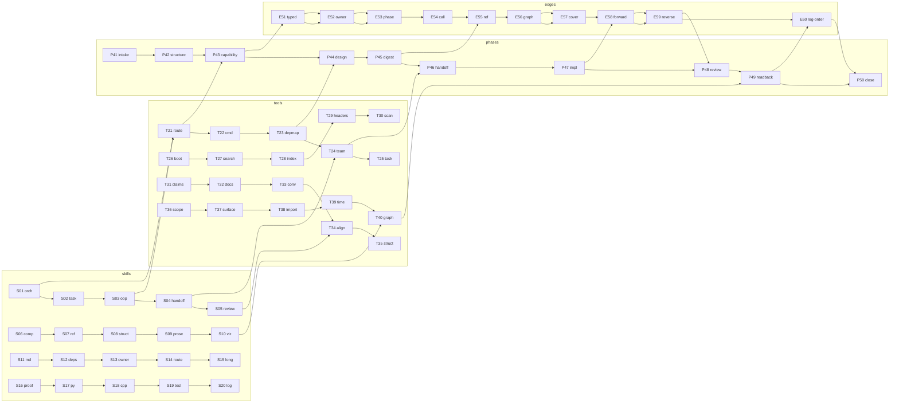

<!--
@dependency-start
contract design
responsibility Defines the canonical identity, capability, phase, edge, ToolCall, manifest, and readback graph for skill/tool invocation.
upstream design ../rule/README.md document naming and Japanese-content rule
upstream design ../../agents/skills/agent-orchestration.md route and Decision Sufficiency owner
upstream design ../../agents/skills/skill-dependencies.yaml typed prerequisite and successor graph
upstream design ../../agents/canonical/skills.md public skill registry and visibility owner
upstream design ../../agents/internal-routines/design-implementation-correspondence.md universal design-to-implementation correspondence
downstream implementation ../../tools/agent_tools/route.py capability route materialization
downstream implementation ../../tools/agent_tools/skill_tool_commands.py command packet projection
downstream implementation ../../tools/agent_tools/skill_dependency_map.py dependency graph validation
downstream implementation ../../tools/agent_tools/agent_team.py typed ToolCall materialization
downstream implementation ../../tools/agent_tools/bootstrap_agent_run.py handoff and manifest transport
downstream implementation ../../tools/agent_tools/check_agent_runtime_alignment.py runtime alignment readback
downstream implementation ../../tools/agent_tools/check_convention_compliance.py canonical route convention gate
@dependency-end
-->

# Skill / Tool Invocation Graph

## Reader Map

この文書は、skill、capability、phase、tool、ToolCall、manifest、readback を一つの typed graph として追跡する設計正本です。最初に owner boundary と identity/state model を読み、次に invariants と failure semantics を確認し、最後に 60 要素の coverage、Mermaid graph、Design-To-Implementation Trace を使って実装・レビューへ進みます。public skill の詳細説明は `agents/skills/*.md`、実行コマンドの詳細は各 tool、共通の対応遷移は `agents/internal-routines/design-implementation-correspondence.md` が所有します。

## Responsibility / Owner Boundaries

| 責務 | owner | 参照する正本 | 対応境界 (`agents/canonical/skills.md`) |
| --- | --- | --- | --- |
| public skill identity | skill registry owner | `agents/canonical/skills.md`, `agents/skills/catalog.yaml` | skill の name/capability/phase を一度だけ定義する |
| typed ordering | dependency owner | `agents/skills/skill-dependencies.yaml` | prerequisite/successor/parallel edge を定義する |
| capability admission | route owner | `tools/agent_tools/route.py` | explicit capability を owner stage に結び付ける |
| command projection | packet owner | `tools/agent_tools/skill_tool_commands.py` | logical command を execution argv へ解決する |
| ToolCall / manifest | orchestration owner | `tools/agent_tools/agent_team.py`, `bootstrap_agent_run.py` | identity ID/digest の参照を運ぶ |
| visualization | visualization owner | `agents/skills/code-visualization.md` | complete source universe を一つの graph に射影する |
| runtime readback | alignment/validation owner | `check_agent_runtime_alignment.py`, `check_convention_compliance.py` | stale/missing/mismatch を fail-closed にする |
| design/implementation correspondence | universal routine | `agents/internal-routines/design-implementation-correspondence.md` | clause fingerprint と forward/reverse coverage を統合する |

Evidence: `agents/canonical/skills.md`, `agents/skills/catalog.yaml`, `agents/skills/skill-dependencies.yaml`, `tools/agent_tools/route.py`, `tools/agent_tools/skill_tool_commands.py`。

## Exact Data / State Model

### Canonical records

Graph schema は `agent_canon.skill_tool_invocation_graph.v1` とし、identity payload は次の canonical record に一度だけ serialized されます。

```text
Identity {
  identity_id: Id
  kind: skill|capability|phase|tool|edge|locator|manifest|readback
  canonical_bytes: bytes                 # identity store only
  sha256: Sha256
  logical_locator: RepoRelativeLocator?  # durable reference only
}
Ref { identity_id: Id, sha256: Sha256 }
Skill { identity: Ref, name, capability: Ref, phase: Ref, owner: Ref }
Edge { identity: Ref, source: Ref, target: Ref, kind, order: uint }
ToolCall { identity: Ref, tool: Ref, input_refs: list<Ref>, output_refs: list<Ref>, locator_refs: list<Ref> }
Manifest { identity: Ref, graph_ref: Ref, coverage_refs: list<Ref>, tool_call_refs: list<Ref> }
Readback { identity: Ref, target_ref: Ref, observed_sha256: Sha256, status, evidence_refs: list<Ref> }
ExecutionContext { root_abs: AbsolutePath, resolved: map<Id, AbsolutePath>, expires: invocation }
```

`canonical_bytes` は identity store にだけ現れます。edge、ToolCall、manifest、readback、coverage artifact は `Ref` の ID/digest だけを持ち、full manifest の base64、payload の inline copy、absolute path を持ちません。`RepoRelativeLocator` は repository root に対する `/` 区切りの locator とし、`.`、`..`、NUL、empty segment、絶対 path を拒否します。`AbsolutePath` は execution context の volatile state であり、durable artifact には保存しません。

### Lifecycle state

```text
declared -> canonicalized -> routed -> materialized -> executed -> read_back -> accepted
declared|canonicalized|routed|materialized|executed|read_back -> stale|blocked|failed
```

`canonicalized` は identity の canonical bytes と digest が確定した状態、`routed` は typed capability owner と phase が確定した状態、`materialized` は ToolCall/manifest が Ref だけで構成された状態です。`stale` は source identity、dependency graph、skill doc、tool command、phase/edge、または readback digest が selected snapshot と一致しない状態です。

## Invariants

- `SG-001` 各 identity payload は canonical identity store に一度だけ serialize し、全 consumer は `identity_id` と `sha256` を参照する。
- `SG-002` edge、ToolCall、manifest、readback は ID/digest 参照だけを持ち、full-manifest base64 や identity payload の複製を持たない。
- `SG-003` durable artifact の locator は logical repository-relative locator だけとし、absolute runtime path は execution 時に解決する。
- `SG-004` capability は typed registry entry と owner stage により選び、skill/tool の prose keyword heuristic を route verdict に使わない。
- `SG-005` owner が capability を確定してから adapter、ToolCall、execution phase を materialize する。adapter は owner の代わりに capability を発見しない。
- `SG-006` `agents/skills/skill-dependencies.yaml` の prerequisite、successor、parallel edge は graph identity と order を持ち、prompt に再定義しない。
- `SG-007` graph、manifest、coverage、readback は同一 source snapshot と graph digest を参照する。digest 不一致は stale artifact failure とする。
- `SG-008` 60 要素 coverage（20 skill、20 tool、10 phase、10 edge）を manifest に含め、欠落、重複、未参照、stale は fail-closed にする。
- `SG-009` Mermaid は coverage の complete projection とし、compact labels と typed edge を使う。一つの graph に full manifest payload/base64 を埋め込まない。
- `SG-010` visualization は source universe 全体、ToolCall、ProjectionCoverageManifest、post-format readback、final coverage status を同じ snapshot に結び付ける。
- `SG-011` #461 で確定した runtime-log command order は immutable sequence として扱い、`ensure → status → stage/snapshot → commit → compare/rebase → push → readback → check-clean` を ToolCall/edge の order に保持する。
- `SG-012` source identity、graph identity、manifest identity、readback identity はそれぞれ一意の ID/digest を持ち、同じ意味の別 IDを作らない。
- `SG-013` stale artifact は再利用、silent refresh、keyword fallback、partial-coverage success を許さず、typed failure と evidence locator を返す。
- `SG-014` design clause fingerprint は invocation graph の selected snapshot に結び付き、implementation handoff の各 target と review evidence に対応する。

## Side Effects

canonicalization、digest 計算、graph projection、coverage readback は deterministic な artifact side effect です。実行時の path resolve、tool invocation、runtime-log publication は execution side effect であり、durable graph record の identity payload を変更しません。Mermaid の projection は graph source を mutate せず、projection artifact の readback だけを生成します。Evidence: `tools/agent_tools/skill_dependency_map.py`, `tools/agent_tools/check_agent_runtime_alignment.py`, `tools/bin/agent-canon`。

## Failure Semantics

| failure | result | 必須の readback (`tools/agent_tools/check_convention_compliance.py`) |
| --- | --- | --- |
| identity serialization が複数回発生 | `identity_duplicate` / `failed` | canonical identity store と重複 Ref の digest を提示; `tools/agent_tools/skill_dependency_map.py` |
| edge/ToolCall/manifest/readback に inline payload または base64 がある | `payload_embedded` / `failed` | violation locator を提示 |
| durable artifact に absolute locator がある | `absolute_locator` / `failed` | logical locator と resolver owner を提示 |
| typed capability owner より adapter が先に現れる | `owner_order` / `blocked` | route packet の capability/owner edge を再読 |
| keyword のみで route が決まる | `keyword_route` / `blocked` | explicit capability と registry digest を再発行 |
| 60 coverage に欠落/重複/stale | `coverage_incomplete` / `failed` | 欠落 ID、期待 snapshot、observed digest を提示 |
| Mermaid と source universe の対応が欠落 | `projection_incomplete` / `failed` | ToolCall、coverage manifest、post-format readback を提示 |
| #461 order の edge が並べ替えられた | `log_order_changed` / `blocked` | immutable command sequence と observed order を提示 |
| graph/design/readback digest が不一致 | `stale_artifact` / `failed` | current source SHA と selected SHA を比較 |

failure は fail-closed であり、古い artifact を現在値として読み替えません。修正は source owner で行い、全 dependent snapshot を再生成してから readback します。Evidence: `tools/agent_tools/check_convention_compliance.py`, `tools/agent_tools/check_design_doc_claims.py`。

## Validation / Readback

設計上の最小 validation は次です。

```bash
python3 tools/agent_tools/route.py --capability oop_type_design
python3 tools/agent_tools/skill_tool_commands.py show --skill oop-type-design --format text
python3 tools/agent_tools/skill_dependency_map.py --check
python3 tools/agent_tools/check_agent_runtime_alignment.py
python3 tools/agent_tools/check_convention_compliance.py
tools/bin/agent-canon docs check
```

planned graph materializer は `identity_store_sha256`、`graph_sha256`、`manifest_sha256`、`coverage_count=60`、`projection_sha256`、`readback_sha256`、`stale=false`、`log_order_sha256` を一つの readback に返します。current tools がまだこの集約 readback を持たない間は、既存 tool output を planned evidence として扱い、design claim を implementation fact と偽装しません。

## Clause IDs

この文書の design clauses は `SG-001` から `SG-014` です。coverage identity は `S01..S20`、`T21..T40`、`P41..P50`、`E51..E60` であり、各 ID は manifest と readback の対象です。

## 60-Skill / Tool / Phase / Edge Coverage

この表が manifest の complete universe です。`S` は skill identity、`T` は tool identity、`P` は phase identity、`E` は edge identity を表し、各行は owner と readback の一つの対象です。

| ID | 種別 | identity / owner |
| --- | --- | --- |
| `S01` | skill | `agent-orchestration` / orchestration |
| `S02` | skill | `codex-task-workflow` / task entry |
| `S03` | skill | `oop-type-design` / pre-implementation design |
| `S04` | skill | `subagent-bootstrap` / handoff |
| `S05` | skill | `change-review` / review |
| `S06` | skill | `comprehensive-development` / cross-surface integration |
| `S07` | skill | `refactor-loop` / refactor |
| `S08` | skill | `structure-planning` / structure |
| `S09` | skill | `prose-reasoning-graph` / prose graph |
| `S10` | skill | `code-visualization` / projection |
| `S11` | skill | `md-style-check` / Markdown validation |
| `S12` | skill | `dependency-analysis` / dependency scope |
| `S13` | skill | `owner-bounded-routing` / bounded owner |
| `S14` | skill | `task-routing` / route catalog |
| `S15` | skill | `long-form-writing` / prose adapter |
| `S16` | skill | `formal-proof-workflow` / proof claims |
| `S17` | skill | `python-review` / Python review |
| `S18` | skill | `cpp-review` / native review |
| `S19` | skill | `test-design` / unresolved oracle |
| `S20` | skill | `agent-log-analysis` / log analysis |
| `T21` | tool | `route.py` / capability route |
| `T22` | tool | `skill_tool_commands.py` / command packet |
| `T23` | tool | `skill_dependency_map.py` / dependency graph |
| `T24` | tool | `agent_team.py` / ToolCall materializer |
| `T25` | tool | `task_start.py` / task packet |
| `T26` | tool | `bootstrap_agent_run.py` / run bundle |
| `T27` | tool | `search.py` / bounded source packet |
| `T28` | tool | `semantic-index` / responsibility context |
| `T29` | tool | `check_dependency_headers.py` / header gate |
| `T30` | tool | `scan_dependency_headers.sh` / header scan |
| `T31` | tool | `check_design_doc_claims.py` / design claim gate |
| `T32` | tool | `agent-canon docs` / docs formatter/readback |
| `T33` | tool | `check_convention_compliance.py` / convention gate |
| `T34` | tool | `check_agent_runtime_alignment.py` / runtime alignment |
| `T35` | tool | `repo_structure_contract.py` / structure contract |
| `T36` | tool | `responsibility_scope.py` / owner scope |
| `T37` | tool | `file_surface_inventory.py` / surface inventory |
| `T38` | tool | `import_responsibility.py` / import boundary |
| `T39` | tool | `check_execution_time_aware_orchestration.py` / scheduling gate |
| `T40` | tool | planned `invocation_graph.py` / canonical graph readback |
| `P41` | phase | `intake` / request owner |
| `P42` | phase | `structure` / path responsibility |
| `P43` | phase | `capability` / typed owner |
| `P44` | phase | `design-read` / owning document |
| `P45` | phase | `fingerprint` / clause digest |
| `P46` | phase | `handoff` / implementation packet |
| `P47` | phase | `implementation` / selected owner |
| `P48` | phase | `review` / forward/reverse coverage |
| `P49` | phase | `readback` / stale detection |
| `P50` | phase | `closeout` / publication evidence |
| `E51` | edge | skill → capability / explicit typed route |
| `E52` | edge | capability → owner / owner-before-adapter |
| `E53` | edge | owner → phase / stage admission |
| `E54` | edge | phase → ToolCall / materialization |
| `E55` | edge | identity → Ref / ID/digest only |
| `E56` | edge | graph → manifest / one snapshot |
| `E57` | edge | manifest → coverage / 60 complete |
| `E58` | edge | implementation → clause / forward trace |
| `E59` | edge | changed path → clause / reverse trace |
| `E60` | edge | log command order / #461 immutable |

## Complete Mermaid Projection

この図は 60 coverage の graph connectivity と owner-before-adapter、design trace、log order を示します。図は node/edge の対応を答えますが、identity payload の bytes や full manifest を図に埋め込むこと、実行時 absolute path の値、未確認の implementation completion を主張しません。Evidence: `agents/skills/code-visualization.md`, `tools/bin/agent-canon`。



## Design-To-Implementation Trace

| clause | current/planned implementation owner | exact file / symbol | reverse mapping rule |
| --- | --- | --- | --- |
| `SG-001..SG-003` | planned graph identity owner; current path owner | planned `tools/agent_tools/invocation_graph.py`; current `tools/agent_tools/agent_canon_source_root.py`, `tools/agent_tools/skill_tool_commands.py` | any new serialized field or absolute locator must cite the clause and be rejected if not execution-only |
| `SG-004..SG-006` | current typed route/dependency owners | `tools/agent_tools/route.py`, `agents/skills/skill-dependencies.yaml`, `agents/canonical/skills.md` | any capability, phase, prerequisite, or adapter change maps to the clause authorizing owner order |
| `SG-007..SG-010` | planned graph/readback and current validation owners | planned `invocation_graph.py`; `tools/agent_tools/check_agent_runtime_alignment.py`, `tools/bin/agent-canon` | any manifest/projection/readback change must carry graph and coverage digest evidence |
| `SG-011` | current runtime-log publication owner | `tools/agent_tools/runtime_log_archive_git.py:command_sync`, `:publish_prepared_archive`, `documents/runtime/runtime-log-archive.md:Push` | any log command reorder maps to `E60` and is a design drift blocker |
| `SG-012..SG-013` | planned stale/identity validator | planned `tools/agent_tools/invocation_graph.py`; current `check_convention_compliance.py` | changed behavior/path with stale digest maps to `SG-007`/`SG-013`, never to a silent refresh |
| `SG-014` | universal correspondence routine | `agents/internal-routines/design-implementation-correspondence.md`, `agents/skills/change-review.md` | every changed implementation target has clause ID, forward evidence, and reverse clause |

Reverse mapping rules are strict: a changed `agents/skills/*.md`, registry entry, dependency edge, ToolCall field, manifest field, path resolver, visualization projection, or log publication command must map to one or more clause IDs before implementation review. A design clause with no current/planned owner is a design gap; a changed path with no clause is an implementation blocker. Planned owners are not evidence that behavior has already landed.

## Evidence And Assumption Ledger

| kind | statement | evidence / owner | status |
| --- | --- | --- | --- |
| request contract | identity payload once、logical locator、typed owner-before-adapter、60 coverage、stale failure、Mermaid、#461 order | user request; `SG-001..SG-014` | fixed |
| current state | public registry、dependency map、route、command packet、alignment checker は現行 owner surface として存在する | `agents/canonical/skills.md`, `agents/skills/skill-dependencies.yaml`, `tools/agent_tools/route.py`, `tools/agent_tools/skill_tool_commands.py` | checked |
| target state | `T40` planned graph materializer が一つの identity/manifest/readback envelope を提供する | `T40`, `SG-007..SG-010` | planned |
| assumption | current checker は 60-element aggregate readback をまだ出さない | `tools/agent_tools/check_agent_runtime_alignment.py`; validation section | explicit, recheck at implementation |
| assumption | Mermaid projection は `code-visualization` owner の complete source universe を入力する | `agents/skills/code-visualization.md` | explicit |
| assumption | #461 runtime-log order は `documents/runtime/runtime-log-archive.md` と `tools/agent_tools/runtime_log_archive_git.py` が consumer owner である | `SG-011`; runtime-log design trace | checked |

## Clause ID Maintenance

この文書の design clauses は `SG-001` から `SG-014`、coverage identity は `S01..S20`、`T21..T40`、`P41..P50`、`E51..E60` です。coverage の数を減らす、payload を inline 化する、absolute path を durable artifact に残す、typed owner を keyword に置き換える、または #461 order を並べ替える変更は、既存 clause の修正として design review を先に行います。
