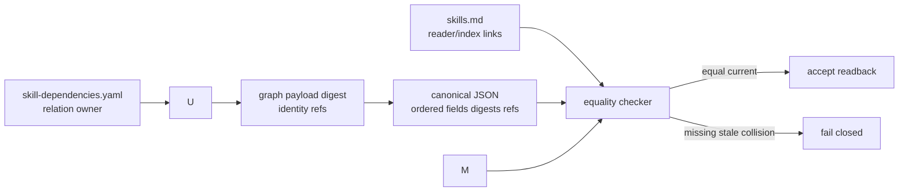

<!--
@dependency-start
contract design
responsibility Defines identity, generated projection, and readback contracts for the skill/dependency graph.
upstream design ../rule/README.md document naming and Japanese-content rule
upstream design ../../agents/skills/agent-orchestration.md route and Decision Sufficiency owner
upstream design ../../agents/skills/skill-dependencies.yaml prerequisite, successor, order, and parallel relation owner
upstream design ../../agents/canonical/skills.md reader-facing catalog projection
upstream design ../../agents/internal-routines/design-implementation-correspondence.md universal design-to-implementation correspondence
downstream implementation ../../tools/agent/skills/skill_route_catalog.py catalog resolver
downstream implementation ../../tools/agent/orchestration/route.py capability and phase route materialization
downstream implementation ../../tools/agent/skills/skill_dependency_map.py dependency graph validation
downstream implementation ../../tools/validation/semantic/runtime/check_agent_runtime_alignment.py runtime alignment readback
downstream implementation ../../tools/validation/semantic/convention/check_convention_compliance.py canonical route convention gate
@dependency-end
-->

# Skill / Dependency Graph

## Reader Map

この文書は、公開skill、capability、dependency/order/routing/parallel edge、JSON、Mermaid、およびreadbackの対応を定義します。catalogはskillとcapabilityのsource、skill-dependencies.yamlはskill関係のsourceです。個別のskill本文、読者向け一覧、共通のdesign/implementation correspondenceは各ownerが引き続き管理します。

## Responsibility / Owner Boundaries

| 責務 | source owner | projection / materializer | 境界 |
| --- | --- | --- | --- |
| skill identity / capability metadata | `agents/skills/catalog.yaml` | `skill_dependency_map.py`, `route.py` | catalog fields supply current skill and capability records |
| dependency / order / routing / parallel relation | `agents/skills/skill-dependencies.yaml` | `skill_dependency_map.py`, `route.py` | graph relations come from the declared map |
| graph identity and projections | source snapshot and `_IdentityStore` | `skill_dependency_map.py` | projections contain Ref values and display fields |
| equality / stale readback | `check_skill_tool_invocation_graph.py` | checker output | source, generated JSON, and Mermaid are compared |
| design/implementation correspondence | [agents/internal-routines/design-implementation-correspondence.md](../../agents/internal-routines/design-implementation-correspondence.md) | `design_correspondence` in the graph | clause and target paths remain traceable |

The graph materializes records from the current catalog and dependency map. Counts describe the graph produced for that snapshot; they are not a separate coverage authority.

## Data / State Model

### Source snapshot

schema は `agent_canon.skill_tool_invocation_graph.v2` とする。graph inputs are the catalog, dependency map, and reader-index links.

```text
SkillDependencyGraph {
  source_snapshot: {catalog_sha256, dependencies_sha256, reader_index_sha256, route_packet_sha256}
  skills: catalog skill identities
  capabilities: catalog capability metadata
  edges: dependency, successor, order, routing, and parallel relations
  invocation_order: derived order with explicit integer positions
}
```


[agents/canonical/skills.md](../../agents/canonical/skills.md) is a reader/index link check, not a skill identity source. Skill identities come from `agents/skills/catalog.yaml`.

### Artifact side-effect boundary

Graph construction and `check` are read-only with respect to the source
checkout.  A `graph` invocation without `--output` requires an explicit
`--runtime-root` (or `AGENT_CANON_RUNTIME_ROOT`) and writes the Markdown/JSON
projection below that external runtime root.  It never falls back to the
tracked `documents/runtime/` pair.  An explicit output must likewise be
external unless it names exactly `documents/runtime/skill-dependency-graph.md`
and its derived `.json` pair with a source-mutation capability.  That
capability has the exact `allowed_paths`, `purpose`, and `authority` fields;
the allowed paths are fixed to the two tracked graph files.  Source mutation
also requires an external runtime root and publishes a before/after evidence
record there.  The record identifies the capability, changed paths, and the
two source snapshots.  A capability cannot authorize an arbitrary source
path, and a runtime artifact is never treated as source mutation authority.

### Canonical identity records, references, and projection envelopes

```text
IdentityRecord {id, digest, kind, canonical_payload}
Ref {id, digest}
NodeProjection {ref: Ref, kind, display_label}
EdgeProjection {edge_ref: Ref, source_ref: Ref, target_ref: Ref, display_label}
ManifestEnvelope {manifest_ref: Ref, source_digest, identity_refs, edge_refs, counts}
ReadbackEnvelope {readback_ref: Ref, source_digest, json_digest, mermaid_digest, projection_digests, counts}
CheckResult {status, counts}
ExecutionContext {root_abs, resolved_locators, expires_at=invocation_end}
```

Manifest and readback records retain refs, digests, and counts. Durable locators are repository-relative; absolute runtime paths remain execution context only.

### Lifecycle state

```text
declared -> resolved -> canonicalized -> projected -> read_back -> accepted
declared|resolved|canonicalized|projected|read_back -> stale|failed
```

`resolved` is the loaded graph input, `canonicalized` fixes identities and digests, and `projected` creates the JSON/Mermaid views. The graph materializer and checker own these transitions.

### Canonical serialization and digest

次の規則を schema の一部として固定する。

- 文字列は Unicode `NFC` に正規化してから UTF-8 bytes にする。display text は case を保持し、identifier/alias は `NFKC`、`casefold`、ASCII hyphen-case validation の順に適用する。`_`、空白、類似文字の暗黙変換はしない。
- Identifier fields are normalized with NFKC and casefold; ordinary display strings use NFC. Routing remains owned by the source catalog and route implementation.
- canonical bytes は mapping の key を再帰的に sort し、object/array の全階層で同じ serializer を使う。approved identifier field の値は NFKC 後に casefold し、通常の表示文字列は NFC、UTF-8、compact JSON、末尾改行なしとする。従って mapping の挿入順と Unicode alias 表記は digest を不安定化しない。
- Arrays with semantic order retain their explicit order; other maps are canonicalized before digesting. JSON bytes use compact JSON and UTF-8 without a trailing newline.
- digest は次の acyclic digest DAG で計算する。identity level の `IdentityPreimage` は `UTF8(domain) || NUL || UTF8(schema) || NUL || UTF8(id) || NUL || UTF8(kind) || NUL || canonical_payload_bytes` とし、domain は `agent-canon`、schema は `skill-tool-invocation-graph.v2`、`digest=SHA-256(IdentityPreimage)` とする。preimage は digest field を含まず、domain、schema、stable semantic `id`、`kind`、canonical payload をこの順に含み、各 field 間の separator は一つの NUL byte とする。
- 同じ `kind,id` のcanonical preimageが異なる場合は`identity_collision`、異なるpreimageが同じdigestを持つ場合は`digest_collision`、Refまたはidentity recordのdigestが不一致なら`digest_mismatch`とする。異なるIDで同じcanonical identity payloadを持つ場合と、projectionがpayloadを重複して保持する場合もfailする。
- payload duplicate detection は `(kind,payload)` ではなく、全 kind 共通の canonical payload bytes index を使う。従って異なる kind が同じ canonical payload bytes を持つ cross-kind witness も `identity_collision`/`payload_duplicate` として fail する。

### Acyclic digest DAG and artifact readback

digest dependency は `identity preimages → ordered Ref/edge envelopes → graph payload → generated JSON artifact` とする。identity digestを確定し、projection digestとgraph digestを計算する。JSON自身の`json_digest`、`readback` envelope、Mermaid artifact digestはJSON digest preimageから除外する。

Mermaid metadataはgraph digestを保持し、JSON digestやfull JSON payloadは保持しない。readbackは生成node/edge statementsとsource metadataを現在のgraph projectionと照合する。JSON artifactはMermaid digestを入力にせず、MermaidはJSON digestを入力にしない。

## Invariants

- `SG-002` `catalog.yaml` はskill identityとcapability metadataのsource、`skill-dependencies.yaml` はdependency/order/routing/parallel relationのsource、[agents/canonical/skills.md](../../agents/canonical/skills.md) はreader/index link parity targetとする。
- `SG-003` 各 payload は一つの `IdentityRecord {id,digest,kind,canonical_payload}` に一度だけ保存し、全 consumer は `Ref {id,digest}` を参照する。projection envelope は Ref + compact display fields、edge projection は edge/source/target Ref + compact label に限る。
- `SG-004` durable artifact は logical repository-relative locator のみ、absolute runtime path は execution 時だけとする。
- `SG-005` canonical serialization は field order、NFC/identifier normalization、UTF-8、domain-separated digest、array ordering を上記規則に従う。
- `SG-006` identity collisions and digest mismatches fail instead of being silently merged.
- `SG-007` capability owner and phase metadata come from the catalog route; the graph does not select a renderer or materialize ToolCalls.
- `SG-008` dependency, order, routing, and parallel edges come from their source owner, not hand-authored Mermaid.
- `SG-009` source and generated projections share the graph identity; `skills.md` is checked for required reader links and is not a skill-count source.
- `SG-010` Mermaid node and edge statements are parsed and compared with the graph projection.
- `SG-011` the checker compares source-derived graph data with generated JSON and Mermaid and reports stale or malformed artifacts.
- `SG-012` #461 で固定された log command order は immutable edge/order として `ensure → status → stage → snapshot → commit → compare/rebase → push → readback → check-clean` を保持する。外部 preflight と内部 transaction の境界を graph が混ぜない。
- `SG-013` graph、manifest、readback、design handoff refer to the same source snapshot and graph identity.
- `SG-014` selected design clause fingerprint は graph snapshot に結び付き、implementation handoff の target/evidence と forward/reverse coverage を持つ。
- `SG-015` identity digest、Ref/edge envelope digest、graph payload digest、JSON artifact digest、Mermaid readback digest は acyclic dependency order を守り、JSON↔Mermaid の相互 digest 依存を持たない。

## Side Effects

Source reads, normalization, digesting, JSON/Mermaid projection, and readback are deterministic graph operations. Runtime artifact writes use the external artifact boundary and do not mutate source identities.

## Failure Semantics and prose guard

| failure | result | readback |
| --- | --- | --- |
| source file missing or invalid | `unresolved_source` / `failed` | source locator and error |
| relation, identity, or generated projection is stale | `stale_artifact` / `failed` | source and generated artifact digests |
| same ID has different payload or identity digest is invalid | `identity_collision` / `digest_mismatch` / `failed` | identity IDs and digests |
| embedded payload/base64 or absolute durable locator | `payload_embedded` / `absolute_locator` / `failed` | violating artifact locator |
| required reader link missing | `reader_link_parity` / `failed` | missing logical link |
| Mermaid nodes, edges, or source metadata differ from graph | `projection_mismatch` / `failed` | expected and observed readback values |
| projection contains canonical payload instead of a Ref | `payload_duplicate` / `failed` | offending projection field |

Routing selection remains owned by `agents/skills/catalog.yaml`, `agents/skills/skill-dependencies.yaml`, and `tools/agent/orchestration/route.py`; graph rendering does not choose the route.

## Checker Contract: Inputs / Outputs / Equality


checkerは`agent_canon.skill_tool_invocation_check.v1`のJSONを出力する。pass時は`skill_count`, `command_count`, `tool_count`, `edge_count`, `graph_digest`, `json_digest`, `mermaid_digest`を含む。fail時は`error`を含み、exit statusは2となる。


## Current Catalog Inventory (readback evidence)

現行の skill 集合・source order は `agents/skills/catalog.yaml`、関係は
`agents/skills/skill-dependencies.yaml` から読みます。件数と生成 projection の一致は
上記 [Checker Contract](#checker-contract-inputs--outputs--equality) の実際の出力で確認します。
この設計文書へ全件一覧の snapshot を複写せず、追加・廃止に追従する別の一覧を保守しません。
生成・readback の証拠は対象 source snapshot とともに既存 artifact owner へ保存し、
[Artifact side-effect boundary](#artifact-side-effect-boundary) の外部出力と tracked pair の境界を保持します。

## Mermaid Projection



```mermaid
flowchart LR
  D["skill-dependencies.yaml\nrelation owner"] --> U
  P["skills.md\nreader/index links"] --> K["equality checker"]
  U --> G["graph payload digest\nidentity refs"]
  G --> J["canonical JSON\nordered fields digests refs"]
  J --> K
  M --> K
  K -->|equal current| A["accept readback"]
  K -->|missing stale collision| F["fail closed"]
```

## Design-To-Implementation Trace

| clause | current/planned implementation owner | exact file / symbol | reverse mapping rule |
| --- | --- | --- | --- |
| `SG-004..SG-006` | current serialization/identity owner | `tools/agent/skills/skill_dependency_map.py:_canonical_bytes`, `_canonicalize`, `_identity_preimage`, `_IdentityStore` | field order, normalization, digest, duplicate, or collision changes require these clauses |
| `SG-009..SG-011` | current projection/readback owner | `tools/agent/skills/skill_dependency_map.py:render_graph_mermaid`, `:_parse_mermaid_syntax`, `:readback_mermaid`; `tools/validation/semantic/skills/check_skill_tool_invocation_graph.py` | any JSON/Mermaid/source/skills.md equality, stale, count, or generated-node change maps to these clauses |
| `SG-012` | current log lifecycle owner | `tools/runtime/archive/runtime_log_archive_git.py`, [documents/design/runtime-log-repository-lifecycle.md](runtime-log-repository-lifecycle.md) | command order or preflight/transaction boundary changes map to SG-012 and the corresponding RL clause |
| `SG-013..SG-014` | current handoff and review owners | `tools/agent/skills/skill_dependency_map.py:build_graph`, `tools/validation/semantic/skills/check_skill_tool_invocation_graph.py`, [agents/internal-routines/design-implementation-correspondence.md](../../agents/internal-routines/design-implementation-correspondence.md) | manifest/readback/design-fingerprint changes map to the clause before implementation |
| `SG-015` | current digest/readback owner | `tools/agent/skills/skill_dependency_map.py:_identity_preimage`, `:_json_digest_from_graph`, `:_parse_mermaid_syntax`, `:readback_mermaid`; `tools/validation/semantic/skills/check_skill_tool_invocation_graph.py` | digest preimage, DAG level, JSON self-digest/readback/Mermaid-digest exclusion, Mermaid ref-only metadata, or circular-readback changes map to SG-015 |

### Implementation record and forward/reverse mapping

この実装は AgentCanon final main `eeb451bd4b829e5417b810804a9d67dfb4ba570d` を設計入力として、設計文書の trace を変更する前の SHA-256 `a28cf776915d006aaffe868185816601c8feb11c7c4375b00b6caf18805c1506` に対応付けて記録します。生成 schema は `agent_canon.skill_tool_invocation_graph.v2` です。実装時点の design SHA-256 は generated graph の `design_correspondence.design_sha256` に保存し、DIC-001..DIC-009 のtarget pathsとclause fingerprintをこの表で追跡します。

The correspondence checker covers `DIC-001`, `DIC-002`, `DIC-003`, `DIC-004`, `DIC-005`, `DIC-006`, `DIC-007`, `DIC-008`, and `DIC-009`, plus these changed paths in both forward and reverse mappings: `agents/skills/catalog.yaml`; `documents/design/skill-tool-invocation-graph.md`; `documents/runtime/skill-dependency-graph.json`; `documents/runtime/skill-dependency-graph.md`; `tests/agent_tools/test_route.py`; `tests/agent_tools/test_skill_dependency_map.py`; `tools/validation/semantic/skills/check_skill_tool_invocation_graph.py`; `tools/agent/orchestration/capability_route.py`; `tools/agent/orchestration/route.py`; `tools/agent/skills/skill_dependency_map.py`; and `tools/agent/skills/skill_route_catalog.py`. Missing clause, DIC, or path references are reported as `design_correspondence_missing`.

| forward clause | implementation target (logical locator / symbol) | focused evidence / validation route | reverse trigger |
| --- | --- | --- | --- |
| `SG-004..SG-006` | `tools/agent/skills/skill_dependency_map.py:_IdentityStore`, `_canonical_bytes`, `_canonicalize`, `_identity_preimage` | `test_identity_payloads_are_unique_and_all_projections_are_refs`; typed collision/reference, insertion-order, and Unicode-alias tests | any payload duplication, Ref, Unicode/field-order, or digest-preimage change |
| `SG-007..SG-008` | `tools/agent/orchestration/route.py:decide_skills`; `tools/agent/orchestration/capability_route.py:decide_capabilities`; `skill_dependency_map.py:_add_edge` | capability route, phase/order relations, and dependency edge checks | any route, phase, or edge change |
| `SG-009..SG-011` | `skill_dependency_map.py:render_graph_mermaid`, `:_parse_mermaid_syntax`, `:readback_mermaid`, `check_artifacts` | actual one-block Mermaid syntax readback; JSON/Mermaid equality and stale/omission failure | any node/edge/order/readback or generated-artifact change |
| `SG-013..SG-014` | [documents/design/skill-tool-invocation-graph.md](skill-tool-invocation-graph.md) trace; `tools/validation/semantic/skills/check_skill_tool_invocation_graph.py` | `CHECK_SCHEMA=agent_canon.skill_tool_invocation_check.v1`; DIC trace and generated readback | any manifest/readback/design fingerprint or correspondence target change |
| `SG-015` | `skill_dependency_map.py:_identity_preimage`, `:_json_digest_from_graph`, `:_parse_mermaid_syntax`, `:readback_mermaid` | graph/json/Mermaid digest equality, JSON preimage excludes self/readback/Mermaid digest, no absolute locator/base64 marker | any preimage, DAG layer, self-digest, Mermaid syntax, or readback change |


## Evidence And Assumption Ledger

| kind | statement | evidence / owner | status |
| --- | --- | --- | --- |
| current state | `catalog.yaml` supplies skill identities and `skill-dependencies.yaml` supplies graph relations | `agents/skills/catalog.yaml`, `agents/skills/skill-dependencies.yaml` | checked |
| target state | source/JSON/Mermaid equality と generated actual nodes/edges/order は `tools/validation/semantic/skills/check_skill_tool_invocation_graph.py` が readback する | `SG-009..SG-011`, `SG-015` | checked |
| assumption | `normalization` / `正規化` は本文の canonical serialization に定義した Unicode NFC/NFKC、casefold、UTF-8 の手順を指す | `SG-005`, `SG-006` | explicit |

## Clause IDs

この文書の design clauses は `SG-001` から `SG-015` です。clause、current/planned owner、source locator、reverse evidence は同一変更で更新し、個別 skill にこの契約を複製しません。
