<!--
@dependency-start
contract design
responsibility Generates the human-facing public-skill dependency graph from skill dependency definitions.
upstream implementation ../../agents/skills/skill-dependencies.yaml is the dictionary source of truth for edges.
upstream implementation ../../tools/agent_tools/skill_route_catalog.py consumes resolved dependency map for routing.
downstream implementation ../../tools/agent_tools/skill_route_catalog.py loads generated routing order from the public map projection.
@dependency-end
-->
<!-- Generated from agents/skills/skill-dependencies.yaml; do not edit this graph by hand. -->
# Public Skill Dependency Graph

```mermaid
graph LR
  subgraph group_orchestration["orchestration"]
    skill_agent_orchestration["agent-orchestration"]
    skill_task_routing["task-routing"]
    skill_codex_task_workflow["codex-task-workflow"]
    skill_owner_bounded_routing["owner-bounded-routing"]
    skill_subagent_bootstrap["subagent-bootstrap"]
  end
  subgraph group_intake["intake"]
    skill_repo_onboarding["repo-onboarding"]
    skill_start_repository["start-repository"]
  end
  subgraph group_review["review"]
    skill_change_review["change-review"]
    skill_python_review["python-review"]
    skill_cpp_review["cpp-review"]
  end
  subgraph group_design["design"]
    skill_oop_readability_check["oop-readability-check"]
    skill_oop_type_design["oop-type-design"]
    skill_test_design["test-design"]
    skill_refactor_loop["refactor-loop"]
  end
  subgraph group_evidence["evidence"]
    skill_result_artifact_writeout["result-artifact-writeout"]
    skill_result_visualize["result-visualize"]
    skill_tool_finding_report["tool-finding-report"]
    skill_issue_finding_report["issue-finding-report"]
    skill_agent_log_analysis["agent-log-analysis"]
    skill_runtime_log_repair["runtime-log-repair"]
    skill_agent_eval_accumulation["agent-eval-accumulation"]
  end
  subgraph group_lifecycle["lifecycle"]
    skill_agent_canon_update["agent-canon-update"]
    skill_dependency_module_change["dependency-module-change"]
    skill_pr_processing["pr-processing"]
    skill_agent_update_branch["agent-update-branch"]
    skill_worktree_start["worktree-start"]
    skill_worktree_health["worktree-health"]
    skill_wiki_publication["wiki-publication"]
  end
  subgraph group_documents["documents"]
    skill_report_writing["report-writing"]
    skill_prose_reasoning_graph["prose-reasoning-graph"]
    skill_structure_planning["structure-planning"]
    skill_code_visualization["code-visualization"]
    skill_html_output["html-output"]
    skill_html_experiment_report["html-experiment-report"]
    skill_long_form_writing["long-form-writing"]
    skill_md_style_check["md-style-check"]
    skill_document_canon_cleanup["document-canon-cleanup"]
  end
  subgraph group_analysis["analysis"]
    skill_structure_refactor["structure-refactor"]
    skill_dependency_analysis["dependency-analysis"]
  end
  subgraph group_delivery["delivery"]
    skill_user_guided_debugging["user-guided-debugging"]
    skill_mvp_skeleton["mvp-skeleton"]
    skill_comprehensive_development["comprehensive-development"]
    skill_environment_maintenance["environment-maintenance"]
  end
  subgraph group_research["research"]
    skill_academic_writing["academic-writing"]
    skill_paper_writing["paper-writing"]
    skill_literature_survey["literature-survey"]
    skill_formal_proof_workflow["formal-proof-workflow"]
    skill_lean_algorithm_design["lean-algorithm-design"]
    skill_algorithm_proof_exploration["algorithm-proof-exploration"]
    skill_algorithm_flowchart["algorithm-flowchart"]
    skill_research_workflow["research-workflow"]
  end
  subgraph group_experiments["experiments"]
    skill_experiment_lifecycle["experiment-lifecycle"]
    skill_save_experiment_results["save-experiment-results"]
    skill_experiment_review["experiment-review"]
    skill_gpu_execution["gpu-execution"]
    skill_computational_optimization["computational-optimization"]
    skill_adaptive_improvement_loop["adaptive-improvement-loop"]
  end
  subgraph group_runtime["runtime"]
    skill_user_preference_sync["user-preference-sync"]
    skill_agent_learning["agent-learning"]
  end
  skill_agent_orchestration -->|"order/prerequisite/successor"| skill_task_routing
  skill_agent_orchestration -->|"prerequisite/successor"| skill_codex_task_workflow
  skill_agent_orchestration -->|"prerequisite/successor"| skill_owner_bounded_routing
  skill_agent_orchestration -->|"prerequisite/successor"| skill_subagent_bootstrap
  skill_agent_orchestration -->|"prerequisite/successor"| skill_dependency_analysis
  skill_task_routing -->|"prerequisite/successor"| skill_owner_bounded_routing
  skill_task_routing -->|"prerequisite/successor"| skill_structure_refactor
  skill_task_routing -->|"prerequisite/successor"| skill_dependency_analysis
  skill_codex_task_workflow -->|"prerequisite/successor"| skill_subagent_bootstrap
  skill_report_writing -->|"prerequisite/successor"| skill_result_artifact_writeout
  skill_result_artifact_writeout -->|"prerequisite/successor"| skill_save_experiment_results
  skill_prose_reasoning_graph -->|"prerequisite/successor"| skill_report_writing
  skill_structure_planning -->|"prerequisite/successor"| skill_prose_reasoning_graph
  skill_prose_reasoning_graph -->|"prerequisite/successor"| skill_long_form_writing
  skill_structure_refactor -->|"prerequisite/successor"| skill_structure_planning
  skill_dependency_analysis -->|"order/prerequisite/successor"| skill_code_visualization
  skill_structure_refactor -->|"order/prerequisite/successor"| skill_code_visualization
  skill_code_visualization -->|"order/prerequisite/successor"| skill_md_style_check
  skill_adaptive_improvement_loop -.->|"parallel-independent"| skill_experiment_lifecycle
  skill_adaptive_improvement_loop -.->|"parallel-independent"| skill_research_workflow
  skill_adaptive_improvement_loop -.->|"parallel-independent"| skill_result_artifact_writeout
  skill_agent_canon_update -.->|"parallel-independent"| skill_agent_update_branch
  skill_agent_canon_update -.->|"parallel-independent"| skill_dependency_module_change
  skill_agent_canon_update -.->|"parallel-independent"| skill_pr_processing
  skill_agent_canon_update -.->|"parallel-independent"| skill_structure_refactor
  skill_agent_eval_accumulation -.->|"parallel-independent"| skill_runtime_log_repair
  skill_agent_learning -.->|"parallel-independent"| skill_agent_log_analysis
  skill_agent_learning -.->|"parallel-independent"| skill_runtime_log_repair
  skill_agent_learning -.->|"parallel-independent"| skill_task_routing
  skill_agent_log_analysis -.->|"parallel-independent"| skill_issue_finding_report
  skill_agent_log_analysis -.->|"parallel-independent"| skill_report_writing
  skill_agent_log_analysis -.->|"parallel-independent"| skill_result_artifact_writeout
  skill_agent_log_analysis -.->|"parallel-independent"| skill_runtime_log_repair
  skill_agent_log_analysis -.->|"parallel-independent"| skill_task_routing
  skill_agent_log_analysis -.->|"parallel-independent"| skill_tool_finding_report
  skill_agent_orchestration -.->|"parallel-independent"| skill_comprehensive_development
  skill_agent_update_branch -.->|"parallel-independent"| skill_pr_processing
  skill_algorithm_flowchart -.->|"parallel-independent"| skill_code_visualization
  skill_algorithm_proof_exploration -.->|"parallel-independent"| skill_computational_optimization
  skill_algorithm_proof_exploration -.->|"parallel-independent"| skill_formal_proof_workflow
  skill_algorithm_proof_exploration -.->|"parallel-independent"| skill_test_design
  skill_change_review -.->|"parallel-independent"| skill_codex_task_workflow
  skill_change_review -.->|"parallel-independent"| skill_comprehensive_development
  skill_change_review -.->|"parallel-independent"| skill_owner_bounded_routing
  skill_change_review -.->|"parallel-independent"| skill_pr_processing
  skill_change_review -.->|"parallel-independent"| skill_refactor_loop
  skill_change_review -.->|"parallel-independent"| skill_report_writing
  skill_change_review -.->|"parallel-independent"| skill_test_design
  skill_change_review -.->|"parallel-independent"| skill_tool_finding_report
  skill_code_visualization -.->|"parallel-independent"| skill_html_output
  skill_code_visualization -.->|"parallel-independent"| skill_oop_readability_check
  skill_code_visualization -.->|"parallel-independent"| skill_prose_reasoning_graph
  skill_code_visualization -.->|"parallel-independent"| skill_structure_planning
  skill_code_visualization -.->|"parallel-independent"| skill_test_design
  skill_codex_task_workflow -.->|"parallel-independent"| skill_comprehensive_development
  skill_codex_task_workflow -.->|"parallel-independent"| skill_owner_bounded_routing
  skill_codex_task_workflow -.->|"parallel-independent"| skill_result_artifact_writeout
  skill_codex_task_workflow -.->|"parallel-independent"| skill_task_routing
  skill_comprehensive_development -.->|"parallel-independent"| skill_dependency_analysis
  skill_comprehensive_development -.->|"parallel-independent"| skill_refactor_loop
  skill_comprehensive_development -.->|"parallel-independent"| skill_structure_refactor
  skill_computational_optimization -.->|"parallel-independent"| skill_gpu_execution
  skill_computational_optimization -.->|"parallel-independent"| skill_test_design
  skill_cpp_review -.->|"parallel-independent"| skill_oop_type_design
  skill_dependency_analysis -.->|"parallel-independent"| skill_dependency_module_change
  skill_dependency_analysis -.->|"parallel-independent"| skill_refactor_loop
  skill_dependency_analysis -.->|"parallel-independent"| skill_structure_refactor
  skill_dependency_analysis -.->|"parallel-independent"| skill_tool_finding_report
  skill_dependency_module_change -.->|"parallel-independent"| skill_structure_refactor
  skill_dependency_module_change -.->|"parallel-independent"| skill_task_routing
  skill_document_canon_cleanup -.->|"parallel-independent"| skill_long_form_writing
  skill_document_canon_cleanup -.->|"parallel-independent"| skill_md_style_check
  skill_document_canon_cleanup -.->|"parallel-independent"| skill_prose_reasoning_graph
  skill_document_canon_cleanup -.->|"parallel-independent"| skill_structure_planning
  skill_document_canon_cleanup -.->|"parallel-independent"| skill_structure_refactor
  skill_environment_maintenance -.->|"parallel-independent"| skill_gpu_execution
  skill_experiment_lifecycle -.->|"parallel-independent"| skill_experiment_review
  skill_experiment_lifecycle -.->|"parallel-independent"| skill_gpu_execution
  skill_experiment_lifecycle -.->|"parallel-independent"| skill_research_workflow
  skill_experiment_lifecycle -.->|"parallel-independent"| skill_result_artifact_writeout
  skill_experiment_lifecycle -.->|"parallel-independent"| skill_result_visualize
  skill_experiment_lifecycle -.->|"parallel-independent"| skill_save_experiment_results
  skill_experiment_lifecycle -.->|"parallel-independent"| skill_structure_planning
  skill_experiment_lifecycle -.->|"parallel-independent"| skill_test_design
  skill_experiment_review -.->|"parallel-independent"| skill_result_visualize
  skill_experiment_review -.->|"parallel-independent"| skill_save_experiment_results
  skill_gpu_execution -.->|"parallel-independent"| skill_result_artifact_writeout
  skill_gpu_execution -.->|"parallel-independent"| skill_test_design
  skill_html_experiment_report -.->|"parallel-independent"| skill_result_visualize
  skill_html_output -.->|"parallel-independent"| skill_report_writing
  skill_html_output -.->|"parallel-independent"| skill_result_visualize
  skill_issue_finding_report -.->|"parallel-independent"| skill_report_writing
  skill_issue_finding_report -.->|"parallel-independent"| skill_result_artifact_writeout
  skill_issue_finding_report -.->|"parallel-independent"| skill_runtime_log_repair
  skill_issue_finding_report -.->|"parallel-independent"| skill_task_routing
  skill_literature_survey -.->|"parallel-independent"| skill_research_workflow
  skill_md_style_check -.->|"parallel-independent"| skill_owner_bounded_routing
  skill_md_style_check -.->|"parallel-independent"| skill_prose_reasoning_graph
  skill_oop_readability_check -.->|"parallel-independent"| skill_oop_type_design
  skill_oop_readability_check -.->|"parallel-independent"| skill_test_design
  skill_oop_type_design -.->|"parallel-independent"| skill_python_review
  skill_owner_bounded_routing -.->|"parallel-independent"| skill_wiki_publication
  skill_pr_processing -.->|"parallel-independent"| skill_result_artifact_writeout
  skill_refactor_loop -.->|"parallel-independent"| skill_structure_planning
  skill_refactor_loop -.->|"parallel-independent"| skill_structure_refactor
  skill_report_writing -.->|"parallel-independent"| skill_result_visualize
  skill_research_workflow -.->|"parallel-independent"| skill_result_artifact_writeout
  skill_result_artifact_writeout -.->|"parallel-independent"| skill_result_visualize
  skill_result_artifact_writeout -.->|"parallel-independent"| skill_runtime_log_repair
  skill_result_artifact_writeout -.->|"parallel-independent"| skill_subagent_bootstrap
  skill_result_artifact_writeout -.->|"parallel-independent"| skill_tool_finding_report
  skill_result_artifact_writeout -.->|"parallel-independent"| skill_wiki_publication
  skill_result_visualize -.->|"parallel-independent"| skill_structure_planning
  skill_runtime_log_repair -.->|"parallel-independent"| skill_subagent_bootstrap
  skill_runtime_log_repair -.->|"parallel-independent"| skill_task_routing
  skill_task_routing -.->|"parallel-independent"| skill_tool_finding_report
```

