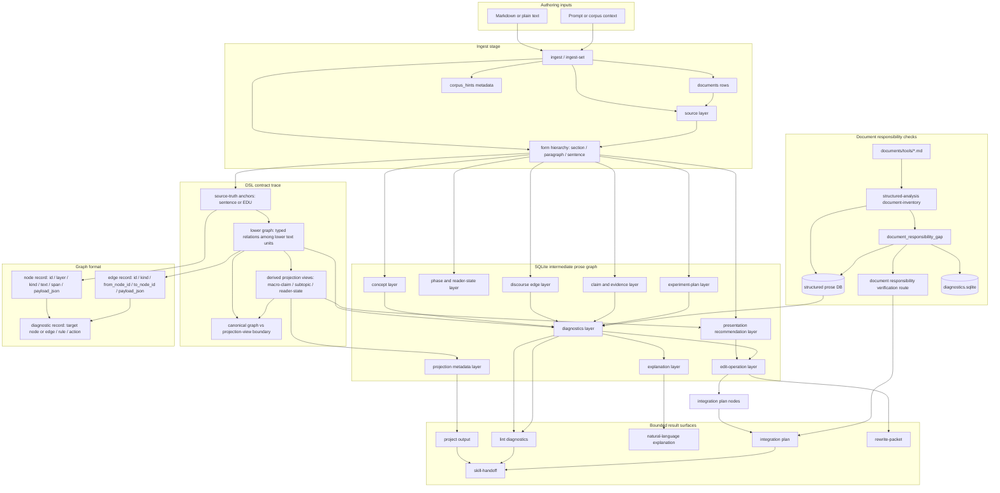

<!--
@dependency-start
responsibility Documents prose_reasoning_graph.py usage and contract.
upstream design ../prose-reasoning-graph/dsl-spec.md normative graph and DSL contract
upstream implementation ../../tools/agent_tools/prose_reasoning_graph.py builds SQLite-backed prose reasoning graphs
upstream implementation ../../rust/agent-canon/src/structured_analysis.rs checks document responsibility gaps for tool docs
upstream design ../../agents/workflows/workflow-references.md discourse, argument, and writing prior art
upstream design ../../agents/skills/prose-reasoning-graph.md prose graph skill contract
downstream implementation ../../tests/agent_tools/test_prose_reasoning_graph.py validates CLI behavior
@dependency-end
-->

# prose_reasoning_graph.py

`prose_reasoning_graph.py` turns Markdown or plain text into a temporary
SQLite-backed prose reasoning graph. The database is an intermediate analysis
artifact, not a durable source of truth. Use the exported projection,
diagnostics, explanation, and rewrite packets as evidence for writing skills,
reviewers, and LLM rewrite passes.

The durable graph/DSL contract lives in
[Prose Reasoning Graph DSL Specification](../prose-reasoning-graph/dsl-spec.md).
This tool document explains command usage and operator flow. Keep the DSL
vocabulary in the specification rather than duplicating it here.

## Source And Verification Basis

This document is an operator guide backed by three source surfaces:

- CLI behavior comes from
  [tools/agent_tools/prose_reasoning_graph.py](../../tools/agent_tools/prose_reasoning_graph.py),
  including parser options such as `ingest --prompt`, `ingest --db`,
  `rewrite-packet --op`, `skill-handoff --out`, and the verification-route
  payloads emitted in diagnostics.
- Vocabulary, graph object shape, storage boundaries, and verification-route
  semantics come from
  [documents/prose-reasoning-graph/dsl-spec.md](../prose-reasoning-graph/dsl-spec.md).
- Expected CLI behavior is checked by
  [tests/agent_tools/test_prose_reasoning_graph.py](../../tests/agent_tools/test_prose_reasoning_graph.py),
  including DB defaults, stats artifacts, projection fields, verification
  routes, and recursive verification output.

Because the parser source, DSL specification, and tests are evidence for the
command contract, this guide must track those surfaces rather than invent
standalone behavior.

When this document says "use" a command or route, that statement is an operator
instruction derived from those source surfaces. It is not a separate DSL
definition and it is not an experiment plan; terms such as `experiment` or
`baseline` refer to graph profiles and verification routes unless an active
workflow supplies an experiment source packet.

Because the DSL is source-anchored, the graph has explicit layers for source
spans, form, concepts, genre moves, discourse relations, argument claims,
evidence, experiment planning, presentation order, diagnostics, edit
operations, natural-language explanation, and projection metadata. The
canonical prose source is one text-anchored
semantic graph: sentence or EDU anchors and typed relations carry the
source-truth, while macro-claims, subtopics, and reader-state transitions are
derived projection views over the same graph. Section and paragraph nodes remain
source form containers in the current MVP. This follows the design choice from
Annotation Graphs, RST, PDTB, RST dependency views, eRST, Toulmin/AIF,
argumentative zoning, and reproducible experiment-planning literature: prose
structure is easier to inspect as a typed graph with overlays than as a single
tree or a sequential label pipeline.

Projection views may recommend a reader-facing format such as prose,
bulleted list, ordered list, table, figure, or equation. The recommendation is
advisory evidence for a rewrite or renderer: the canonical graph still owns the
source anchors and typed relations, while the presentation format says how that
subgraph may be easier to read.

For example, `ingest` accepts `--prompt` and `--prompt-file` for corpus/domain
inference. The exported projection includes `corpus_hints`, ranked from user
prompt and source-text keywords. Treat these hints as a default corpus profile
for retrieval, examples, and evaluation norms; they are not citations or proof.

Because the database is an intermediate artifact, `ingest` and `ingest-set`
create the graph DB under
`${AGENT_CANON_PROSE_GRAPH_HOME:-$HOME/.cache/agent-canon/prose-reasoning-graph}`
when `--db` is omitted. Use `--db <path>` only for workflows that intentionally
require a run-local or other explicit DB path.

## Tool Design

The tool design has four stages:

1. `ingest` records source text, source/form anchors, optional prompt context,
   and corpus hints.
1. `analyze` derives concept, phase, discourse, argument, evidence, experiment,
   presentation, edit-operation, explanation, and projection layers.
1. `lint`, `explain`, `integrate`, and `project` export bounded views over the
   same SQLite graph.
1. `rewrite-packet` and `skill-handoff` pass graph evidence to LLM rewrite
   passes and existing skills without changing source text.



Document responsibility checks are a `document-canon` graph layer produced by
Rust `agent-canon structured-analysis`. This Python parser does not create that
layer directly, but `structured-analysis build` and
`import-document-inventory` materialize document records, responsibility-gap
finding nodes, and diagnostics in the same structured graph DB. This guide cites
the DSL specification as `upstream design`, and that specification declares
coverage rules for DSL design trace and graph format trace. The checker
therefore expects the guide to cover the source-truth anchors, lower graph typed
relations, derived projection views, and graph format records shown above. It
must not warn merely because a named heading or visual block is absent; it
records missing responsibility coverage such as
`missing_responsibility_coverage=dsl_design_trace`.

The structured-analysis DB can be passed directly to `project`, `lint`,
`explain`, `integrate`, and `skill-handoff`. That DB may have document-canon
diagnostics without `edit_operations`; those commands treat operations count
`0` as valid and still render diagnostics and verification routes.
`rewrite-packet --op <operation-id>` is only valid when the current DB contains
a concrete edit operation id from a prose `analyze` pass.

When the finding kind is `document_responsibility_gap`, Rust
`structured-analysis` writes
`verification_route=document_responsibility_verification` into
`suggested_action_json`. The route expands the upstream coverage rule, maps the
missing coverage group to the downstream document span that should carry it,
and reruns `structured-analysis`. The skill loop performs that recursive
expansion; this guide only describes how the route is exposed.

The graph format is a typed property graph, materialized in SQLite for the MVP.
A node record carries `id`, `document_id`, `layer`, `kind`, `label`, `text`,
source-span offsets, confidence, and `payload_json`. An edge record carries
`id`, `layer`, `kind`, `from_node_id`, `to_node_id`, ordering metadata,
confidence, optional evidence, and `payload_json`. Diagnostic records target a
document, node record, or edge record with a rule id, message, severity, and
suggested action. This storage shape is still an intermediate artifact: the
DSL specification owns the vocabulary and validity rules, while exported
projection, diagnostics, explanation, integration, and handoff files are bounded
views over that graph format.

Because responsibility diagnostics are advisory, the source document remains the
authoring surface. The graph database and structured-analysis cache record
candidate facts, diagnostics, and handoff packets; they do not rewrite the
source file, approve the design, or replace the DSL specification.

## Command Flow

After `ingest`, read `PROSE_REASONING_GRAPH_DB` from the stats JSON field
`.fields.PROSE_REASONING_GRAPH_DB`, or from stdout when `--stats-out` is
omitted, then pass that path to the read/analyze commands:

```bash
python3 tools/agent_tools/prose_reasoning_graph.py ingest notes/draft.md --prompt-file reports/agents/<run-id>/user_request_contract.md --stats-out reports/agents/<run-id>/prose_ingest.stats.json
GRAPH_DB="<PROSE_REASONING_GRAPH_DB from stats JSON or stdout>"
python3 tools/agent_tools/prose_reasoning_graph.py analyze --db "$GRAPH_DB" --profile all --stats-out reports/agents/<run-id>/prose_analyze.stats.json
python3 tools/agent_tools/prose_reasoning_graph.py project --db "$GRAPH_DB" --profile all --out reports/agents/<run-id>/prose_projection.yaml --stats-out reports/agents/<run-id>/prose_project.stats.json
python3 tools/agent_tools/prose_reasoning_graph.py lint --db "$GRAPH_DB" --profile all --out reports/agents/<run-id>/prose_diagnostics.md --stats-out reports/agents/<run-id>/prose_lint.stats.json
python3 tools/agent_tools/prose_reasoning_graph.py explain --db "$GRAPH_DB" --profile all --out reports/agents/<run-id>/prose_explanation.md --stats-out reports/agents/<run-id>/prose_explain.stats.json
python3 tools/agent_tools/prose_reasoning_graph.py integrate --db "$GRAPH_DB" --profile all --out reports/agents/<run-id>/prose_integration.md --stats-out reports/agents/<run-id>/prose_integrate.stats.json
python3 tools/agent_tools/prose_reasoning_graph.py skill-handoff --db "$GRAPH_DB" --profile all --out reports/agents/<run-id>/prose_handoff.md --stats-out reports/agents/<run-id>/prose_handoff.stats.json
```

For a report or design packet with multiple source documents, use `ingest-set`
to keep each file as a separate `documents` row while sentence, paragraph, and
section node ids are prefixed per file:

```bash
python3 tools/agent_tools/prose_reasoning_graph.py ingest-set documents/structured-analysis \
  --prompt-file reports/agents/<run-id>/user_request_contract.md \
  --stats-out reports/agents/<run-id>/ingest_set.stats.json
GRAPH_DB="<PROSE_REASONING_GRAPH_DB from stats JSON or stdout>"
python3 tools/agent_tools/prose_reasoning_graph.py analyze --db "$GRAPH_DB" --profile report
```

Use `rewrite-packet --op <operation-id>` after `integrate` when a specific
split, merge, bridge, or reorder operation belongs in an LLM handoff.
Do not call `rewrite-packet` for a structured-analysis DB whose integration
plan reports `operations: 0`; first repair or verify the diagnostic route, then
rerun the checker.
Use `--stats-out` by default in agent workflows. This keeps stdout bounded to
the pass marker and stats path; read the JSON stats artifact before opening
larger projection, diagnostics, explanation, or handoff files.
Do not stream projection, diagnostics, explanation, integration, handoff, or
rewrite packet bodies through CLI stdout or chat. The CLI writes full structures
to files with `--out`; stdout is for compact status and artifact pointers.

## Result Surfaces

Use the smallest result surface that answers the current question:

| Surface | Command | Use |
| ------- | ------- | --- |
| DB path and counts | `--stats-out` | Find the DB, output paths, and compact status without reading full structures. |
| Diagnostics | `lint --out <file>` | See active findings, severities, targets, and verification routes. |
| Integration plan | `integrate --out <file>` | See split/merge/bridge/reorder candidates when present, plus recursive verification routes from diagnostics. |
| Skill handoff | `skill-handoff --out <file>` | Pass compact graph evidence and verification routes to receiving skills. |
| Projection | `project --out <file>` | Inspect full graph layers, source anchors, projection views, diagnostics, and edit operations. |
| Explanation | `explain --out <file>` | Read a natural-language summary of claim paths, gaps, and recommended next edits. |
| Rewrite packet | `rewrite-packet --op <id> --out <file>` | Give an LLM one bounded edit operation with preserve/do-not rules. |

The normal agent order is stats first, diagnostics second, integration or
handoff third, with full projection reserved for reviewer or implementer access
to the complete graph. This keeps large SQLite-derived structures out of model
context until they are needed.

## Profiles

- `writing`: long-form section and paragraph flow.
- `logic`: claim support, bridge, and logic-gap triage.
- `experiment`: hypothesis, metric, baseline, expected result, and report
  readiness.
- `report`: evidence traceability and reader-facing report structure.
- `academic`: notation/logic/citation-aware scholarly prose.
- `paper`: paper section contract and citation-evidence review.
- `all`: all handoffs and all graph layers.

For the `experiment` profile, a hypothesis field records the proposed empirical
statement. A metric field names the measurement. A baseline field names the
comparison target. An expected-result field records the anticipated outcome.

## Skill Handoff

The `skill-handoff` command emits explicit entries for `$long-form-writing`,
`$report-writing`, `$academic-writing`, `$paper-writing`, `$literature-survey`,
`$structure-planning`, `$formal-proof-workflow`, `logic-gap-review`,
`citation-evidence-review`, `$experiment-lifecycle`, and
`$result-artifact-writeout`. The handoff gives each receiving skill the DB path
plus commands for projection, diagnostics, natural-language explanation,
verification routing, and rewrite planning.

Each handoff entry names projection fields for the receiving skill,
including `corpus_hints`,
`projection_views[].recommended_format`, and
`projection_views[].format_reason`. This is the bridge from graph analysis to
writer-facing report or rewrite decisions.

The receiving skill remains authoritative for its own review gate. A graph
diagnostic can say a claim is unsupported or a transition is weak; it cannot
approve a paper, settle a citation, merge a PR, or change repository policy.

## Verification Routes

When diagnostics include a verification route, follow that route before
rewriting: verify inference validity, external evidence, formal proof
obligations, experiment-plan fields, or discourse connection as appropriate.
Each verification route includes recursive expansion steps. Treat those
steps as the skill-local decomposition plan: split the unresolved logic or
connection into child questions, route each child to the listed verifier, rerun
graph diagnostics after verified evidence or limitations are added, and keep
unresolved leaves out of settled prose.

For example, the current route ids are:

| Route | Trigger | Primary verifier | Recursive expansion |
| ----- | ------- | ---------------- | ------------------- |
| `claim_support_verification` | Unsupported claim or missing evidence layer. | `logic-gap-review`, `$literature-survey`, `citation-evidence-review`; `$formal-proof-workflow` when proof-like. | Decompose the claim into assumptions, warrants, and atomic support requirements; verify external support; verify formal obligations when relevant. |
| `connection_verification` | Weak paragraph bridge, missing warrant, or unclear reader-state transition. | `$structure-planning`, `logic-gap-review`; `$literature-survey` when the bridge depends on external support. | Classify the relation, verify missing premises, then verify any external bridge claim. |
| `experiment_plan_verification` | Missing hypothesis, metric, baseline, or expected result. | `$experiment-lifecycle`, `$report-writing`. | Decompose the empirical claim, verify the measurement contract, then verify that report prose stays within the result and limitations. |
| `document_responsibility_verification` | A downstream document cites an upstream design with declared coverage rules but misses one or more coverage groups. | `$prose-reasoning-graph`, `structured-analysis`, and the owning document workflow. | Expand the coverage rule, select the downstream span that must carry the missing responsibility, then rerun `structured-analysis` and keep the finding active if the rule is still uncovered. |

Recursive verification is bounded by the route's `recursive_max_depth` and
closure condition. If a leaf cannot be verified within that bound, record it as
an unresolved blocker or warning with owner, route, missing evidence, and next
verification command. Do not rewrite that leaf as if it were settled.

Because verification closure determines draft readiness, writing workflows use
this sequence:

1. Run `lint` and `integrate`.
1. Follow each verification route recursively until leaves are verified,
   limited, or explicitly unresolved.
1. Update the structure contract, source packet, graph-backed rewrite packet,
   or draft source.
1. Rerun graph diagnostics.
1. Draft reader-facing prose only after active `fix-now` graph findings for
   the selected profile are gone.
