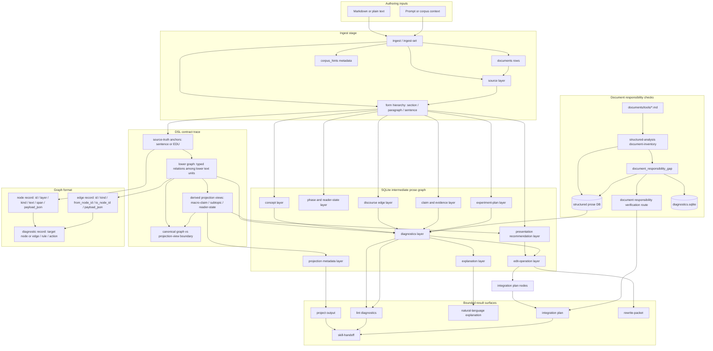

<!--
@dependency-start
responsibility Documents prose_reasoning_graph.py usage and contract.
upstream design ../prose-reasoning-graph/dsl-spec.md normative graph and DSL contract
upstream implementation ../../tools/agent_tools/prose_reasoning_graph.py builds SQLite-backed prose reasoning graphs
upstream implementation ../../rust/agent-canon/src/structured_analysis.rs checks document responsibility gaps for tool docs
upstream design ../../agents/workflows/workflow-references.md discourse, argument, and writing prior art
upstream design ../../agents/skills/prose-reasoning-graph.md prose graph skill contract
downstream implementation ../../tests/agent_tools/test_prose_reasoning_graph.py validates CLI behavior
@dependency-end
-->

# prose_reasoning_graph.py

`prose_reasoning_graph.py` は、Markdown または plain text を一時的な
SQLite-backed prose reasoning graph に変換する文章解析ツールです。
DB は中間解析 artifact であり、永続的な source of truth ではありません。
export された projection、diagnostics、explanation、integration plan、
handoff、rewrite packet を、writing skill、reviewer、LLM rewrite pass の根拠として使います。

DSL と graph contract の正本は
[Prose Reasoning Graph DSL Specification](../prose-reasoning-graph/dsl-spec.md)
です。この文書は、その DSL を重複定義せず、ツールの責務、実行境界、operator flow、
result surface を説明します。

## 読者

- maintainer / reviewer:
  tool の責務、DB schema 差、diagnostic と rewrite operation の境界を確認します。
- 設計 agent:
  DSL、skill、structured-analysis との接続を変更するときに読みます。
- 実行時 agent:
  通常はこの文書を読みません。実行時 agent は
  [prose-reasoning-graph skill](../../agents/skills/prose-reasoning-graph.md)
  の result contract に従い、tool を black box として呼びます。

## 根拠と検証基盤

この文書は、次の source surface によって裏付けられた operator guide です。

- CLI behavior は
  [tools/agent_tools/prose_reasoning_graph.py](../../tools/agent_tools/prose_reasoning_graph.py)
  が持ちます。`ingest --prompt`、`ingest --db`、`rewrite-packet --op`、
  `skill-handoff --out`、diagnostics に入る verification-route payload などが該当します。
- vocabulary、graph object shape、storage boundary、verification-route semantics は
  [documents/prose-reasoning-graph/dsl-spec.md](../prose-reasoning-graph/dsl-spec.md)
  が持ちます。
- CLI の期待挙動は
  [tests/agent_tools/test_prose_reasoning_graph.py](../../tests/agent_tools/test_prose_reasoning_graph.py)
  で検証します。DB default、stats artifact、projection field、verification route、
  recursive verification output が対象です。

この文書の command や route に関する記述は、上記 source surface から導かれる operator instruction です。
別の DSL 定義や experiment plan ではありません。`experiment`、`baseline` などの語は、
active workflow が experiment source packet を渡していない限り、graph profile または
verification route の語彙として扱います。

## 設計境界

- この tool は source text を graph DB に materialize します。
- この tool は source document を書き換えません。
- この tool は citation approval、paper acceptance、PR merge、policy change を判断しません。
- 決定論的な抽出、projection、diagnostic export、handoff packet 生成は tool の責務です。
- finding の解釈、verification route の展開、rewrite の採否は skill / reviewer / workflow の責務です。

DB 作成 command は、`--db` が省略された場合に
`${AGENT_CANON_PROSE_GRAPH_HOME:-$HOME/.cache/agent-canon/prose-reasoning-graph}`
配下へ `prose_graph.sqlite` を作ります。明示的な run-local DB が必要な workflow だけ
`--db <path>` を渡します。

## Graph 設計

この tool の graph は source-anchored です。source span、form、concept、genre move、
discourse relation、argument claim、evidence、experiment planning、presentation order、
diagnostics、edit operations、natural-language explanation、projection metadata を層として持ちます。

canonical prose source は、text-anchored semantic graph です。
sentence または EDU anchor が source-truth anchors であり、それらの間の
typed relations が lower graph を作ります。macro-claim、subtopic、reader-state transition は、
source node そのものではなく derived projection views です。current MVP では section と paragraph は
source form container と reader-order anchor であり、derived macro claim ではありません。

Projection view は reader-facing format を提案できます。候補は prose、bulleted list、
ordered list、table、figure、equation です。この提案は rewrite / renderer 向けの advisory
evidence であり、canonical graph の provenance を置き換えません。

`ingest` は `--prompt` と `--prompt-file` を受け取り、corpus / domain hint を推定できます。
projection export には `corpus_hints` が入り、user prompt と source text keyword から ranking されます。
これは retrieval、example、evaluation norm の default corpus profile であり、citation や proof ではありません。

## Tool 設計

この tool は 4 段階で動きます。

1. `ingest` / `ingest-set` が source text、source/form anchors、optional prompt context、
   `corpus_hints` を記録します。
1. `analyze` が concept、phase、discourse、argument、evidence、experiment、presentation、
   edit-operation、explanation、projection layers を派生させます。
1. `lint`、`explain`、`integrate`、`project` が同じ SQLite graph から bounded view を export します。
1. `rewrite-packet` と `skill-handoff` が source text を変更せず、graph evidence を LLM rewrite pass と
   existing skills へ渡します。



図は、source text が graph DB に入り、diagnostics / integration / handoff の bounded
surface として export される流れを示します。`document-canon` diagnostics は Python parser
ではなく Rust `structured-analysis` が materialize し、同じ diagnostics layer へ接続します。
図は DB schema の完全な定義ではありません。graph object model は DSL spec が正本です。

## Document 責務診断

Document responsibility check は、Rust `agent-canon structured-analysis` が生成する
`document-canon` graph layer です。この Python parser はその layer を直接作りません。
`structured-analysis build` または `import-document-inventory` が document record、
responsibility-gap finding node、diagnostics を同じ structured graph DB に materialize します。

この guide は DSL spec を `upstream design` として参照します。DSL spec は
`dsl_design_trace` と `graph_format_trace` の coverage rule を宣言しています。
そのため、この guide は source-truth anchors、lower graph typed relations、
derived projection views、node record、edge record、`payload_json` を説明対象に含めます。

checker は、見出しや図の有無だけでは warning を出しません。downstream document が
coverage rule を宣言した upstream design を参照している場合に、その責務 coverage を検査します。
不足は `missing_responsibility_coverage=dsl_design_trace` のような reason として記録されます。

structured-analysis DB は、`project`、`lint`、`explain`、`integrate`、`skill-handoff` に直接渡せます。
この DB は `document-canon` diagnostics を持っていても `edit_operations` を持たない場合があります。
その場合、operation count `0` は valid です。`rewrite-packet --op <operation-id>` は、prose
`analyze` pass が concrete edit operation id を出している DB でだけ使います。

finding kind が `document_responsibility_gap` の場合、Rust `structured-analysis` は
`suggested_action_json` に
`verification_route=document_responsibility_verification` を書きます。この route は upstream
coverage rule を展開し、missing coverage group を downstream document span へ対応させ、
`structured-analysis` rerun で閉じるためのものです。recursive expansion は skill loop の責務です。

## Graph 形式

MVP の graph format は SQLite に materialize された typed property graph です。

- node record:
  `id`、`document_id`、`layer`、`kind`、`label`、`text`、source-span offsets、
  confidence、`payload_json` を持ちます。
- edge record:
  `id`、`layer`、`kind`、`from_node_id`、`to_node_id`、ordering metadata、
  confidence、optional evidence、`payload_json` を持ちます。
- diagnostic record:
  document、node record、edge record のいずれかを target にし、rule id、message、
  severity、suggested action を持ちます。

この storage shape は中間 artifact です。語彙と validity rule は DSL spec が所有し、
projection、diagnostics、explanation、integration、handoff は graph format への bounded view です。
responsibility diagnostics も advisory です。source document は authoring surface のままであり、
graph DB や structured-analysis cache は source file を書き換えず、design approval もしません。

## Command の流れ

`ingest` 後は、stats JSON の `.fields.PROSE_REASONING_GRAPH_DB`、または `--stats-out`
省略時の stdout から `PROSE_REASONING_GRAPH_DB` を読み、後続 command に渡します。

```bash
python3 tools/agent_tools/prose_reasoning_graph.py ingest notes/draft.md --prompt-file reports/agents/<run-id>/user_request_contract.md --stats-out reports/agents/<run-id>/prose_ingest.stats.json
GRAPH_DB="<PROSE_REASONING_GRAPH_DB from stats JSON or stdout>"
python3 tools/agent_tools/prose_reasoning_graph.py analyze --db "$GRAPH_DB" --profile all --stats-out reports/agents/<run-id>/prose_analyze.stats.json
python3 tools/agent_tools/prose_reasoning_graph.py project --db "$GRAPH_DB" --profile all --out reports/agents/<run-id>/prose_projection.yaml --stats-out reports/agents/<run-id>/prose_project.stats.json
python3 tools/agent_tools/prose_reasoning_graph.py lint --db "$GRAPH_DB" --profile all --out reports/agents/<run-id>/prose_diagnostics.md --stats-out reports/agents/<run-id>/prose_lint.stats.json
python3 tools/agent_tools/prose_reasoning_graph.py explain --db "$GRAPH_DB" --profile all --out reports/agents/<run-id>/prose_explanation.md --stats-out reports/agents/<run-id>/prose_explain.stats.json
python3 tools/agent_tools/prose_reasoning_graph.py integrate --db "$GRAPH_DB" --profile all --out reports/agents/<run-id>/prose_integration.md --stats-out reports/agents/<run-id>/prose_integrate.stats.json
python3 tools/agent_tools/prose_reasoning_graph.py skill-handoff --db "$GRAPH_DB" --profile all --out reports/agents/<run-id>/prose_handoff.md --stats-out reports/agents/<run-id>/prose_handoff.stats.json
```

複数 source document を 1 DB に入れる report / design packet では `ingest-set` を使います。
各 file は別々の `documents` row として残り、sentence、paragraph、section node id は file ごとに prefix されます。

```bash
python3 tools/agent_tools/prose_reasoning_graph.py ingest-set documents/structured-analysis \
  --prompt-file reports/agents/<run-id>/user_request_contract.md \
  --stats-out reports/agents/<run-id>/ingest_set.stats.json
GRAPH_DB="<PROSE_REASONING_GRAPH_DB from stats JSON or stdout>"
python3 tools/agent_tools/prose_reasoning_graph.py analyze --db "$GRAPH_DB" --profile report
```

`integrate` 後、split、merge、bridge、reorder などの具体 operation を LLM handoff に渡す場合だけ
`rewrite-packet --op <operation-id>` を使います。structured-analysis DB の integration plan が
`operations: 0` を返す場合は `rewrite-packet` を呼びません。先に diagnostic route を検証または修正し、
checker を rerun します。

agent workflow では `--stats-out` を既定で使います。stdout は pass marker と stats path のための
compact status channel です。projection、diagnostics、explanation、integration、handoff、
rewrite packet の本文を CLI stdout や chat に流してはいけません。

## Result Surface

現在の問いに答える最小 surface を使います。

| Surface | Command | 用途 |
| ------- | ------- | ---- |
| DB path and counts | `--stats-out` | DB path、output path、compact status を確認する。full structure は読まない。 |
| Diagnostics | `lint --out <file>` | active finding、severity、target、verification route を見る。 |
| Integration plan | `integrate --out <file>` | operation がある場合は rewrite candidate を見る。diagnostics 由来の recursive verification route も見る。 |
| Skill handoff | `skill-handoff --out <file>` | receiving skill へ bounded graph evidence と verification route を渡す。 |
| Projection | `project --out <file>` | full graph layers、source anchors、projection views、diagnostics、edit operations を inspection する。 |
| Explanation | `explain --out <file>` | claim path、gap、recommended next edits を自然言語で読む。 |
| Rewrite packet | `rewrite-packet --op <id> --out <file>` | 1 つの bounded edit operation を preserve / do-not rule 付きで LLM に渡す。 |

通常順序は、stats、diagnostics、integration または handoff です。
full projection は reviewer または implementer が complete graph evidence を必要とする場合だけ開きます。

## Profile

- `writing`: long-form section と paragraph flow。
- `logic`: claim support、bridge、logic-gap triage。
- `experiment`: hypothesis、metric、baseline、expected result、report readiness。
- `report`: evidence traceability と reader-facing report structure。
- `academic`: notation / logic / citation を意識した scholarly prose。
- `paper`: paper section contract と citation-evidence review。
- `all`: 全 handoff と全 graph layers。

`experiment` profile では、hypothesis field が empirical statement、metric field が measurement、
baseline field が comparison target、expected-result field が anticipated outcome を記録します。

## Skill Handoff

`skill-handoff` は `$long-form-writing`、`$report-writing`、`$academic-writing`、
`$paper-writing`、`$literature-survey`、`$structure-planning`、`$formal-proof-workflow`、
`logic-gap-review`、`citation-evidence-review`、`$experiment-lifecycle`、
`$result-artifact-writeout` への entry を出します。

handoff は DB path、projection command、diagnostics command、natural-language explanation、
verification routing、rewrite planning command を receiving skill に渡します。
各 entry は `corpus_hints`、`projection_views[].recommended_format`、
`projection_views[].format_reason` などの projection fields を明示します。

receiving skill は自分の review gate に対して authority を持ちます。graph diagnostic は
unsupported claim や weak transition を示せますが、paper approval、citation settlement、
PR merge、repository policy change は判断しません。

## Verification Route

diagnostics が verification route を持つ場合、rewrite の前に route を実行します。
inference validity、external evidence、formal proof obligations、experiment-plan fields、
discourse connection を、それぞれ該当 skill / reviewer へ渡します。

route には recursive expansion steps が入ります。これは skill-local decomposition plan です。
未解決の logic や connection を child questions に分解し、listed verifier へ routing し、
verified evidence または limitation を追加した後に graph diagnostics を rerun します。
未解決 leaf を settled prose として書いてはいけません。

| Route | 発火条件 | 主 verifier | 再帰展開 |
| ----- | -------- | ------------ | -------- |
| `claim_support_verification` | Unsupported claim または missing evidence layer。 | `logic-gap-review`, `$literature-survey`, `citation-evidence-review`; proof-like claim では `$formal-proof-workflow`。 | claim を assumptions、warrants、atomic support requirements に分解し、external support と formal obligations を検証する。 |
| `connection_verification` | Weak paragraph bridge、missing warrant、unclear reader-state transition。 | `$structure-planning`, `logic-gap-review`; bridge が external support に依存する場合は `$literature-survey`。 | relation を分類し、missing premise を検証し、external bridge claim があれば検証する。 |
| `experiment_plan_verification` | Missing hypothesis、metric、baseline、expected result。 | `$experiment-lifecycle`, `$report-writing`。 | empirical claim、measurement contract、report prose と result / limitation の対応を検証する。 |
| `document_responsibility_verification` | downstream document が coverage rules 付き upstream design を参照しているが、coverage group を欠いている。 | `$prose-reasoning-graph`, `structured-analysis`, owning document workflow。 | coverage rule を展開し、missing responsibility を担う downstream span を選び、`structured-analysis` rerun で finding を閉じるか保持する。 |

recursive verification は route の `recursive_max_depth` と closure condition で bounded です。
leaf が閉じない場合は、owner、route、missing evidence、next verification command を持つ
unresolved blocker または warning として記録します。

writing workflow では、draft readiness を次の順で判断します。

1. `lint` と `integrate` を実行する。
1. 各 verification route を leaf が verified、limited、explicitly unresolved になるまで辿る。
1. structure contract、source packet、graph-backed rewrite packet、または draft source を更新する。
1. graph diagnostics を rerun する。
1. selected profile の active `fix-now` graph finding が無くなってから reader-facing prose を書く。
