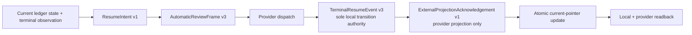

# W2 F1-F6 Repair Design v10

## Reader Map

This append-only v10 design simplifies local review authority and external
projection while adding one canonical validation-receipt contract inside the
same `completion_authority` responsibility unit:

1. `TerminalResumeEvent v3` removes every artifact-identity and receipt-byte
   field; its canonical ledger event ID and body hash are the sole local
   authority for the observed resume/replacement transition.
2. Codex and GitHub bindings become typed external projection
   acknowledgements. They map normalized provider/object/candidate/head/status
   readback to an already durable local event without asserting that provider
   response or receipt bytes equal local artifact bytes.
3. Validation pass evidence becomes an immutable
   `ValidationExecutionReceipt v1` produced from an actual repo-owned tool
   execution against the exact candidate OID. Writer prose, copied terminal
   lines, checkboxes, and hand-written pass artifacts cannot satisfy automatic
   review approval or publication.

Read in this order:

1. `Structure Contract And Source-Truth Projection` fixes the replacement
   boundary and reader interpretation.
2. `Request Clauses`, `Owner Surfaces`, and `Normative Incorporation Of v9 And
   v8` identify the exact substitutions and retained contracts.
3. `Selected Architecture` defines event v3, the external projection
   acknowledgement, validation receipts, write/readback order, and public
   failures.
4. `Implementation Source Packet`, `Design Side-Effect Map`, and
   `Dependency-Header Closure` bind the complete later implementation surface.
5. `Design-to-Implementation Trace`, `Exact Acceptance Predicates`, and
   `Public Typed Negative-Test Plan` are the independent-review oracle.

This artifact is a compact delta over v9. The implementation packet is v8 plus
v9 plus v10. When text conflicts, v10 replaces v9 only for terminal resume
event receipt identity, external binding semantics, and validation pass
authority. The approved five-stage DAG and every other v9/v8 clause remain
normative.

This artifact intentionally contains no identity for its own complete bytes,
Git blob, containing commit, tree, or byte size. Those identities are external
readback evidence.

## Structure Contract And Source-Truth Projection

```text
structure_kind=document
audience=independent detailed-design reviewer and later completion-authority implementer
decision_context=whether local review authority, provider projection, and validation pass evidence are acyclic, exact, and implementation-ready
first_artifact=mermaid five-stage local-event-to-external-projection DAG
first_artifact_question=does local authority end at the canonical ledger event while external providers only acknowledge a typed projection of it
visual_plan=mermaid DAG plus exact schema, null-rule, status-mapping, and validation-receipt tables
document_unit=owner W2 design author; reader independent reviewer/implementer; source map exact v9/v8 packets and bounded review/projection/validation owner paths; validation canonical docs formatter/check plus Git/hash readback; update cadence append-only review successor; canonical parent v9; downstream independent v10 review
document_split_decision=split:append-only v10 has a new fixed-byte review identity while retaining the same completion_authority owner
metric_or_delta_contract=zero resume-event artifact-identity fields; one local event authority tuple; one typed external projection acknowledgement union; one canonical validation receipt; zero free-text pass authority; zero v9/v8 regressions
invalid_interpretations=v10 is not source authorization, not external-provider approval authority, not provider-byte/local-byte equality, not a writer self-attestation route, not a sixth reviewer-resume stage, and not a compatibility selector
validation_gate=independent fixed-byte v10 detailed-design review
```

Static source-truth anchors and typed relations:

| Anchor | Source truth | Typed relation | v10 result |
| --- | --- | --- | --- |
| `V10-L1` | v9 event and binding carry local receipt and event artifact-identity records | `requires` one local event authority; `limits` duplicate byte identity | event v3 ID/body hash alone owns the local transition |
| `V10-X1` | v9 external binding claims receipt/local artifact equality | `requires` provider projection separation | one typed acknowledgement maps normalized provider state to the existing local event |
| `V10-V1` | writer free-text Ruff pass can contradict an independent rerun | `requires` executable candidate-bound evidence | one canonical execution receipt owns pass/fail; free text is non-authoritative |
| `PRESERVE` | approved v9/v8 packet | `constrains` all three repairs | five-stage DAG, v8 contracts, publication CAS, dirty-checkout exclusion, automatic review, five formatter statuses, and non-self-reference remain |

No dynamic prose graph was generated. The Mermaid and tables are a static
projection because the active W2 task authorizes design Markdown and canonical
docs formatting/checking only.

## Request Clauses

| Clause | Required closure |
| --- | --- |
| V10-L1 | Delete all resume-event artifact-identity and local receipt identity fields. Make canonical ledger event ID/body hash the sole local authority while preserving predecessor intent/frame references and non-self-reference. |
| V10-X1 | Replace Codex/GitHub external artifact binding with one typed projection acknowledgement that maps provider, object, candidate, head, and status readback to the local event without provider-byte/local-byte equality. Define exact mapping, null rules, serialization, readback, and public negatives. |
| V10-V1 | Define canonical validation execution receipts with exact command argv, cwd/environment profile, process result, tool version, output digest, owner evidence, and candidate OID. Free-text/self-reported pass cannot satisfy automatic review approval or publication. |
| PRESERVE | Preserve the approved five-stage DAG and every v9/v8 non-regression contract not explicitly replaced above. |
| BOUNDARY | Change only v10 design/request artifacts. Source, tests, owner docs, hooks, CI configuration, and implementation remain blocked. |

## Owner Surfaces

| Responsibility | Canonical owner | Replaceable unit | Consumers |
| --- | --- | --- | --- |
| terminal reviewer intent/frame/event schemas | `agents/COMMUNICATION_PROTOCOL.md` | future `review_dispatch.py` plus ledger writer | team routing, workflow monitor, report checks |
| reviewer lifecycle and independent assignment | `agents/canonical/CODEX_SUBAGENTS.md`, `agents/task_catalog.yaml`, `agents/agents_config.json` | `agent_team.py` and runtime adapter | parent monitor/integrator and reviewer |
| canonical local review state | `agents/canonical/CODEX_WORKFLOW.md`, ledger L | immutable event append plus current-pointer CAS | review dispatcher, task close, publication lock |
| provider projection acknowledgement | `agents/COMMUNICATION_PROTOCOL.md` | future `external_artifact_binding.py` renamed or replaced by projection owner | Codex adapter, GitHub publish, publication integrator |
| validation requirement selection | `documents/runtime/runtime-profiles-and-check-matrix.json` with Markdown reader projection | exact required-check set | validation runner, review dispatcher, closeout |
| validation command execution and receipt | future `tools/agent_tools/validation_runner.py` | one candidate-bound execution transaction | workflow monitor, reviewer, publication integrator |
| Python quality caller surface | `tools/ci/run_python_quality_checks.sh` | registered validation-route delegation | pre-review, full checks, reviewer |
| automatic review/publication consumption | future `review_dispatch.py`, future `publication_integrator.py`, `github_publish.py` | receipt-set resolver | decision binding, ref/PR CAS, report/closeout |

Durable canon never depends upstream on this run-local v10 report.

## Normative Incorporation Of v9 And v8

The exact v9 predecessor packet is:

```text
commit=f46e5214e8554dbb4d5a03e745cdf8ecf41d6f20
tree=ab308243c2d00225aa6f9141c5b68371ed322bcd
parent=0c5bfb817f1db7c0dee2026f9938ebe7139bb4eb
design_path=reports/agents/convergence-w2-gates-completion-20260716/w2_f1_f6_repair_design_v9.md
design_size_bytes=46579
design_sha256=46c85c546147d830ac31a556467d07c5676acb858a4175cb1a1284ebc0dcb793
design_git_blob=16b5670f5b99b2beba5ab112b8c0efcdba6f2e63
request_path=reports/agents/convergence-w2-gates-completion-20260716/w2_detailed_design_recheck_request_v9.md
request_size_bytes=6191
request_sha256=a7a975788c0fd9bfc085626f2ef7aef1184d7810c9f1899b01ea507b6a506085
request_git_blob=9712c428de9f0454704120f8347130f2b19cc09e
```

v10 supersedes only these v9 clauses:

1. `TerminalResumeEvent v2` prerequisite that local dispatch receipt bytes
   first receive an artifact-identity record;
2. event fields and ID-seed terms
   `local_receipt_identity_record_id` and
   `local_receipt_identity_record_body_sha256`;
3. `ExternalArtifactBindingEvent v1` event/receipt artifact-identity fields,
   receipt-byte equality, and provider-receipt byte semantics;
4. v9 write-order steps that materialize local receipt or resume-event bytes
   through generic artifact identity before stage-four binding; and
5. any review/publication surface that treats writer prose or copied validation
   output as pass evidence.

The following v9 contracts remain passed and unchanged:

- the five-stage order
  `intent -> frame -> event -> external acknowledgement -> current pointer`;
- no object ID/hash/reference depends on a future object;
- immutable intent and frame v3;
- generic artifact identity v2 allows exactly `git_commit_path` and
  `filesystem_immutable`; `external_immutable_receipt` remains forbidden;
- current-pointer CAS occurs only after stage-four readback;
- same-context reviewer lineage, assignment, compaction-safe locator, typed
  terminal blocker, and no fresh/self-review/prompt/keyword/CI bypass;
- exact provider reread before pointer/publication use; and
- all v9 crash recovery and partial-chain prohibitions, with stage four now
  interpreted as external projection acknowledgement.

The v8 packet remains normative through v9, including:

- V8-I1 corrected v6 request blob
  `6ff0191daf02f86b6642bfb2762db6ccc702fdbe`;
- V8-I2 canonical tool materialization/import/readback for local Git/file
  artifacts;
- V8-D1 root README reciprocal checker/test edges;
- V8-L1 reviewer independence and same-context terminal semantics;
- V8-P1 exact candidate-OID publication independent of dirty worktree state;
- V6-R1, V6-R2, V7-A1, publication CAS, immutable candidate and intent
  revisions, ledger sole authority, per-member correspondence, group equality,
  topology/freeze predicates, five formatter statuses, D2/D3/F1/F2, and
  non-self-reference.

No compatibility reader accepts superseded event v2 or external binding v1.

## Selected Architecture

### Approved five-stage DAG with local/external authority separation



The five durable state objects remain intent, frame, event, external
acknowledgement, and current pointer. Provider dispatch is an action between
frame and event, not a durable authority object.

Authority boundaries are exact:

| Object | May authorize | Must not authorize |
| --- | --- | --- |
| intent | immutable requested resume/replacement context | dispatch result, external state, approval |
| frame | exact reviewer route and four-field handoff | future event/ack/pointer identity |
| event v3 | local observed transition and reviewer locator | provider projection currency, review decision, publication |
| external acknowledgement | exact provider projection mapped to the event | local transition, decision, approval, receipt-byte equality |
| current pointer | selected current chain after CAS | facts not recomputed from L and provider readback |
| validation receipt | exact executed check result for one candidate | review decision, automatic approval, unrelated checks |

The arrows are the only legal identity/reference direction. No immutable object
contains an ID/hash/path for an object to its right.

### `TerminalResumeEvent v3`: sole local transition authority

Event v3 is appended after the owner dispatch call returns a normalized result.
No local dispatch receipt file, provider response file, complete event file, or
artifact-identity record is a prerequisite.

The exact schema is:

```json
{
  "schema": "agent-canon.terminal-resume-event.v3",
  "schema_version": 3,
  "resume_event_id": "<deterministic event ID>",
  "event_kind": "terminal_resume_dispatch_observed",
  "aggregate_identity": "<aggregate identity>",
  "resume_intent_id": "<intent ID>",
  "resume_intent_body_sha256": "<intent body hash>",
  "review_frame_id": "<frame ID>",
  "review_frame_body_sha256": "<frame body hash>",
  "review_lineage_id": "<review lineage ID>",
  "review_request_id": "<review request ID>",
  "review_context_id": "<review context ID>",
  "reviewer_assignment_id": "<reviewer assignment ID>",
  "reviewer_lineage_id": "<reviewer lineage ID>",
  "candidate_id": "<current candidate ID>",
  "candidate_revision": 1,
  "candidate_body_sha256": "<current candidate hash>",
  "candidate_commit": "<40 lowercase Git OID>",
  "candidate_tree": "<40 lowercase Git OID>",
  "dispatch_attempt": 1,
  "resume_mode": "provider_resume_same_runtime",
  "observed_result": {
    "runtime_action": "resumed",
    "runtime_provider": "codex",
    "provider_instance_id": "<provider installation/session namespace ID>",
    "provider_operation_id": "<opaque immutable dispatch-operation ID>",
    "provider_operation_version": "<opaque immutable operation version>",
    "provider_object_kind": "nested_agent_dispatch",
    "provider_object_id": "<provider nested-agent object ID>",
    "provider_parent_object_id": "<provider parent-agent object ID>",
    "provider_status": "running",
    "parent_runtime_agent_id": "<parent runtime ID>",
    "nested_runtime_agent_id": "<observed reviewer runtime ID>",
    "team_manifest_role_instance_ref": "team_manifest.yaml#<same reviewer row>",
    "role_id": "change_reviewer",
    "agent_type": "diff_triage_reviewer",
    "reviewer_assignment_id": "<same assignment ID>",
    "reviewer_lineage_id": "<same reviewer lineage ID>",
    "write_policy": "artifacts_only"
  },
  "same_context_fingerprint": "<intent equality hash>",
  "proposed_from_review_state": "dispatch_pending",
  "proposed_to_review_state": "dispatched",
  "event_order_index": 1,
  "observed_at_utc": "YYYY-MM-DDTHH:MM:SSZ",
  "resume_event_body_sha256": "<64 lowercase hex>"
}
```

Closed values:

- `resume_mode` is exactly `provider_resume_same_runtime` or
  `owner_selected_replacement_runtime`;
- `runtime_action` is exactly `resumed` for resume mode and `spawned` for
  replacement mode;
- `runtime_provider` is exactly `codex`;
- `provider_object_kind` is exactly `nested_agent_dispatch`;
- `provider_status` is exactly `running`, `completed`, `errored`, or
  `shutdown`;
- allowed role/agent pairs are exactly
  `change_reviewer`/`diff_triage_reviewer` and
  `final_reviewer`/`ship_reviewer`; and
- `write_policy` is exactly `artifacts_only`.

Required equality:

- event intent/frame/candidate/assignment/context fields equal their durable
  predecessor bodies;
- `provider_object_id == nested_runtime_agent_id`;
- `provider_parent_object_id == parent_runtime_agent_id`;
- resume mode uses the prior locator runtime ID;
- replacement mode uses the owner-selected different runtime ID while keeping
  review request/context/assignment/lineage and reviewer/writer/parent
  separation unchanged; and
- candidate commit/tree equal the mechanically materialized candidate object.

The following keys are forbidden at every nesting depth:

```text
local_receipt_identity_record_id
local_receipt_identity_record_body_sha256
resume_event_artifact_identity_record_id
resume_event_artifact_identity_record_body_sha256
receipt_artifact_identity_record_id
receipt_artifact_identity_record_body_sha256
dispatch_receipt_path
dispatch_receipt_sha256
dispatch_receipt_blob
provider_receipt_bytes_sha256
```

The event ID seed is exactly:

```text
agent-canon.terminal-resume-event.v3\0
aggregate-identity=<aggregate identity UTF-8>\0
resume-intent-id=<intent ID UTF-8>\0
review-frame-id=<frame ID UTF-8>\0
candidate-id=<candidate ID UTF-8>\0
candidate-body-sha256=<64 lowercase hex>\0
candidate-commit=<40 lowercase hex>\0
dispatch-attempt=<8 lowercase hex>\0
resume-mode=<legal mode UTF-8>\0
runtime-action=<resumed or spawned UTF-8>\0
provider-instance-id=<provider instance ID UTF-8>\0
provider-operation-id=<provider operation ID UTF-8>\0
provider-operation-version=<provider operation version UTF-8>\0
provider-object-id=<provider object ID UTF-8>\0
provider-parent-object-id=<provider parent object ID UTF-8>\0
provider-status=<legal status UTF-8>\0
event-order-index=<16 lowercase hex>\0
end\0
```

The hash range includes every shown NUL and no later byte.

```text
resume_event_id =
  w2-review-resume-event:<SHA256(exact seed bytes)>
```

`resume_event_body_sha256` is SHA256 over RFC 8785 canonical JSON bytes of the
complete event with only `resume_event_body_sha256` omitted. The pair
`(resume_event_id, resume_event_body_sha256)` is the sole local authority for
this transition. A complete-file SHA, Git blob, provider response hash, log
line, or artifact identity is neither required nor equivalent.

### External projection acknowledgement schema

Stage four is exactly
`agent-canon.external-projection-acknowledgement.v1`. It records a local
canonical statement that one normalized provider readback projected the
already durable local event at one observed version.

The exact fixed key set is:

```json
{
  "schema": "agent-canon.external-projection-acknowledgement.v1",
  "schema_version": 1,
  "external_projection_ack_id": "<deterministic acknowledgement ID>",
  "projection_kind": "codex_review_dispatch",
  "aggregate_identity": "<aggregate identity>",
  "local_event_schema": "agent-canon.terminal-resume-event.v3",
  "local_event_kind": "terminal_resume_dispatch_observed",
  "local_event_id": "<canonical ledger event ID>",
  "local_event_body_sha256": "<canonical ledger event body hash>",
  "local_event_order_index": 1,
  "review_lineage_id": "<review lineage ID>",
  "review_request_id": "<review request ID>",
  "review_context_id": "<review context ID>",
  "review_frame_id": "<review frame ID or null>",
  "candidate_id": "<candidate ID>",
  "candidate_revision": 1,
  "candidate_body_sha256": "<candidate body hash>",
  "candidate_commit": "<40 lowercase Git OID>",
  "candidate_tree": "<40 lowercase Git OID>",
  "provider_kind": "codex_runtime",
  "provider_instance_id": "<provider instance ID>",
  "provider_account_id": null,
  "provider_repository_id": null,
  "provider_object_kind": "nested_agent_dispatch",
  "provider_object_id": "<provider object ID>",
  "provider_object_version": "<provider readback version>",
  "provider_parent_object_id": "<provider parent object ID>",
  "provider_operation_id": "<provider operation ID or null>",
  "head_ref": null,
  "head_oid": null,
  "head_tree": null,
  "local_from_status": "dispatch_pending",
  "local_to_status": "dispatched",
  "provider_status": "running",
  "status_mapping_rule_id": "agent-canon.projection-map.codex-dispatch.v1",
  "provider_readback_sha256": "<normalized provider projection hash>",
  "readback_observed_at_utc": "YYYY-MM-DDTHH:MM:SSZ",
  "ack_order_index": 1,
  "acknowledged_at_utc": "YYYY-MM-DDTHH:MM:SSZ",
  "external_projection_ack_body_sha256": "<64 lowercase hex>"
}
```

Allowed projection/event/provider combinations are exactly:

| `projection_kind` | `local_event_schema` | `local_event_kind` | `provider_kind` | `provider_object_kind` |
| --- | --- | --- | --- | --- |
| `codex_review_dispatch` | `agent-canon.terminal-resume-event.v3` | `terminal_resume_dispatch_observed` | `codex_runtime` | `nested_agent_dispatch` |
| `github_pr_head` | `agent-canon.review-trigger-event.v1` | `pr_head_update` | `github` | `pull_request_head` |
| `github_review_decision` | `agent-canon.review-decision-binding-event.v1` | `review_decision_bound` | `github` | `review` |
| `github_ref_update` | `agent-canon.publication-ref-update-event.v1` | `publication_ref_update_observed` | `github` | `ref_update` |

The three GitHub event responsibilities already exist in v8. v10 fixes their
schema names only so a projection acknowledgement cannot accept an arbitrary
local object.

Exact null rules:

| Field group | Codex dispatch | GitHub PR head | GitHub review | GitHub ref update |
| --- | --- | --- | --- | --- |
| review lineage/request/context | non-null | non-null | non-null | non-null |
| `review_frame_id` | non-null | null | non-null | non-null |
| candidate fields | all non-null | all non-null | all non-null | all non-null |
| provider instance | non-null | non-null | non-null | non-null |
| provider account/repository | both null | both non-null | both non-null | both non-null |
| provider object/version/parent | all non-null | all non-null | all non-null | all non-null |
| provider operation ID | non-null | null | null | null |
| head ref/OID/tree | all null | all non-null | all non-null | all non-null |

Status mappings are closed:

| Projection | Local transition/status | Provider status | Mapping rule |
| --- | --- | --- | --- |
| Codex dispatch | `dispatch_pending -> dispatched` | `running`, `completed`, `errored`, or `shutdown` | `agent-canon.projection-map.codex-dispatch.v1` |
| GitHub PR head | `none -> candidate_materialized` or `approved -> candidate_materialized` | `open` | `agent-canon.projection-map.github-pr-head.v1` |
| GitHub review | `review_pending -> approved` | `approved` | `agent-canon.projection-map.github-review.v1` |
| GitHub review | `review_pending -> revise` | `changes_requested` | `agent-canon.projection-map.github-review.v1` |
| GitHub review | `review_pending -> escalated` | `commented` | `agent-canon.projection-map.github-review.v1` |
| GitHub ref update | `approved -> approved` | `oid_present` | `agent-canon.projection-map.github-ref-update.v1` |

For Codex, provider status may advance only by this exact relation:

```text
running -> running|completed|errored|shutdown
completed -> completed
errored -> errored
shutdown -> shutdown
```

The acknowledgement may observe a legal successor of the status stored in
event v3. A terminal-to-running regression is invalid.

### Exact provider readback domain

The provider adapter constructs one normalized object directly from a typed
provider API/readback:

```json
{
  "projection_kind": "<closed projection kind>",
  "provider_kind": "<provider kind>",
  "provider_instance_id": "<provider instance ID>",
  "provider_account_id": "<value or null>",
  "provider_repository_id": "<value or null>",
  "provider_object_kind": "<closed object kind>",
  "provider_object_id": "<provider object ID>",
  "provider_object_version": "<provider object version>",
  "provider_parent_object_id": "<provider parent ID>",
  "provider_operation_id": "<value or null>",
  "head_ref": "<full ref or null>",
  "head_oid": "<40 lowercase Git OID or null>",
  "head_tree": "<40 lowercase Git OID or null>",
  "provider_status": "<closed provider status>"
}
```

`provider_readback_sha256` is SHA256 over the RFC 8785 canonical JSON bytes of
exactly that object.

This digest is a local hash of normalized typed fields. It is not:

- a hash of raw HTTP, RPC, terminal, or provider receipt bytes;
- a claim that provider bytes equal event bytes;
- a local event identity;
- a review decision or approval;
- a substitute for candidate/head equality; or
- a durable provider signature.

Raw provider responses may be retained separately for diagnostics, but their
path, size, SHA, blob, and bytes are forbidden from every event/ack equality
predicate and cannot satisfy a gate.

### Exact external mapping predicates

Every consumer recomputes all predicates:

1. `local_event_id` and `local_event_body_sha256` resolve one immutable ledger
   event and exactly match its recomputed ID/hash.
2. Projection kind, local event schema/kind, provider kind, and object kind
   equal one closed table row.
3. Aggregate, review lineage/request/context/frame, candidate ID/revision/body
   hash/commit/tree equal the local event and its predecessor chain.
4. Codex provider object/parent/operation equal event v3 observed-result
   fields; status equals or legally advances from event status.
5. GitHub repository, object, parent, full head ref, head OID, and head tree
   equal provider readback and the exact current candidate.
6. GitHub review provider status maps to the already durable local decision
   event. It never creates that decision.
7. GitHub ref-update head OID/tree equal the candidate authorized by the v8
   publication authority and post-CAS readback.
8. Every null rule matches exactly.
9. The normalized provider readback hash recomputes exactly.
10. A second provider query immediately before pointer or publication CAS
    returns the same object version/readback hash.

There are no stored equality-success booleans.

### External acknowledgement ID and body hash

The acknowledgement ID seed is:

```text
agent-canon.external-projection-acknowledgement.v1\0
projection-kind=<projection kind UTF-8>\0
aggregate-identity=<aggregate identity UTF-8>\0
local-event-schema=<local event schema UTF-8>\0
local-event-kind=<local event kind UTF-8>\0
local-event-id=<local event ID UTF-8>\0
local-event-body-sha256=<64 lowercase hex>\0
candidate-id=<candidate ID UTF-8>\0
candidate-body-sha256=<64 lowercase hex>\0
candidate-commit=<40 lowercase hex>\0
candidate-tree=<40 lowercase hex>\0
provider-kind=<provider kind UTF-8>\0
provider-instance-id=<provider instance ID UTF-8>\0
provider-account-id=<value or null UTF-8>\0
provider-repository-id=<value or null UTF-8>\0
provider-object-kind=<provider object kind UTF-8>\0
provider-object-id=<provider object ID UTF-8>\0
provider-object-version=<provider object version UTF-8>\0
provider-parent-object-id=<provider parent ID UTF-8>\0
provider-operation-id=<value or null UTF-8>\0
head-ref=<value or null UTF-8>\0
head-oid=<40 lowercase hex or null UTF-8>\0
head-tree=<40 lowercase hex or null UTF-8>\0
local-from-status=<local from status UTF-8>\0
local-to-status=<local to status UTF-8>\0
provider-status=<provider status UTF-8>\0
status-mapping-rule-id=<mapping rule UTF-8>\0
provider-readback-sha256=<64 lowercase hex>\0
ack-order-index=<16 lowercase hex>\0
end\0
```

The range includes every shown NUL and no later byte.

```text
external_projection_ack_id =
  w2-external-projection-ack:<SHA256(exact seed bytes)>
```

`external_projection_ack_body_sha256` hashes RFC 8785 canonical JSON bytes with
only that field omitted. The acknowledgement contains no current-pointer
identity and no receipt/artifact-identity field.

### Provider projection resolver APIs

The future owner exposes exactly:

```python
def materialize_next_external_projection_ack(
    workspace: Path,
) -> dict[str, object] | None:
    ...

def verify_current_external_projection_ack(
    workspace: Path,
) -> dict[str, object]:
    ...
```

No public API accepts local event ID, provider/object ID, candidate, head,
status, expected success, raw response path, or receipt identity. The
materializer:

1. locks L and selects the unique pending local event;
2. rereads and verifies its ID/body hash;
3. derives projection kind, provider adapter, candidate, head expectation, and
   status mapping from owner state;
4. performs the typed provider query;
5. validates the mapping and null rules;
6. appends and reads back the acknowledgement; and
7. leaves current state unchanged until the later pointer CAS.

The verifier resolves the acknowledgement from the current/pending ledger
projection. Caller-selected stale or foreign acknowledgement IDs are invalid.

### Current pointer semantics

The retained v9 pointer schema changes field names only:

```json
{
  "current_resume_event_id": "<event v3 ID>",
  "current_resume_event_body_sha256": "<event v3 body hash>",
  "current_external_projection_ack_id": "<acknowledgement ID>",
  "current_external_projection_ack_body_sha256": "<acknowledgement body hash>",
  "current_review_state": "dispatched"
}
```

The event determines local reviewer identity and state. The acknowledgement
only proves that an exact provider projection was current at the pre-CAS
readback. If provider state later changes:

- the local event and local review state remain immutable;
- consumers recompute the acknowledgement as stale;
- no prior local state is reverted or rewritten;
- publication remains or becomes locked until a new acknowledgement is
  materialized when the owner contract requires one; and
- no provider state can create APPROVE, REVISE, or ESCALATE.

### State write, fsync, and readback order

The exact retained five-stage sequence is:

1. lock L; verify current candidate, prior locator, terminal observation,
   context, attempt, and `dispatch_pending`;
2. append/read back `TerminalResumeIntent v1`;
3. append/read back `AutomaticReviewFrame v3`;
4. dispatch through the unchanged four-field handoff;
5. normalize the owner dispatch result and append/read back
   `TerminalResumeEvent v3`;
6. select the provider adapter from event kind, query provider, normalize the
   typed readback, and append/read back
   `ExternalProjectionAcknowledgement v1`;
7. repeat provider readback and require exact current object
   version/projection hash;
8. CAS the aggregate pointers from the expected prior fingerprint to the
   complete intent/frame/event/ack chain and derive local state from event v3;
9. write/fsync/rename/fsync-directory the aggregate transaction; and
10. reread L, traverse every ID/hash, and requery provider.

No local/provider receipt file or event complete-file identity is created in
steps 5-6.

Crash recovery:

- intent only: recreate/verify deterministic frame;
- frame only: inspect owner provider dispatch state and never blindly
  redispatch;
- event only: materialize the acknowledgement from provider readback;
- acknowledgement only: retry the exact pointer CAS;
- pointer uncertainty: reread L and accept only exact chain equality;
- provider changed after acknowledgement: keep local event, classify
  acknowledgement stale, and block pointer/publication use until owner retry.

### Canonical validation execution receipt

Validation execution is a separate ledger evidence branch. It does not add a
sixth resume stage or point back from event/ack to validation.

The exact schema is:

```json
{
  "schema": "agent-canon.validation-execution-receipt.v1",
  "schema_version": 1,
  "validation_receipt_id": "<deterministic receipt ID>",
  "event_kind": "validation_execution_completed",
  "aggregate_identity": "<aggregate identity>",
  "review_lineage_id": "<review lineage ID>",
  "review_frame_id": "<current review frame ID or null>",
  "candidate_id": "<candidate ID>",
  "candidate_revision": 1,
  "candidate_body_sha256": "<candidate body hash>",
  "candidate_commit": "<40 lowercase Git OID>",
  "candidate_tree": "<40 lowercase Git OID>",
  "canonical_diff_sha256": "<canonical candidate diff hash>",
  "validation_requirement_id": "python.ruff.full",
  "validation_attempt": 1,
  "producer": {
    "owner_tool_path": "tools/agent_tools/validation_runner.py",
    "owner_tool_commit": "<40 lowercase Git OID>",
    "owner_tool_tree": "<40 lowercase Git OID>",
    "owner_tool_blob": "<40 lowercase Git blob OID>",
    "owner_role_id": "change_reviewer",
    "owner_runtime_agent_id": "<producer runtime ID>",
    "writer_runtime_agent_id": "<candidate writer runtime ID>"
  },
  "command": {
    "argv": [
      "<resolved Python executable>",
      "-m",
      "ruff",
      "check",
      "python",
      "tests",
      "--select",
      "D,E,F,I,UP",
      "--ignore",
      "E501"
    ],
    "argv_sha256": "<RFC 8785 argv-array hash>",
    "cwd_absolute": "<exact absolute execution directory>",
    "cwd_repository_id": "<canonical repository ID>",
    "cwd_repo_relative": "."
  },
  "environment_profile": {
    "profile_id": "<registered runtime/check profile ID>",
    "profile_version": 1,
    "profile_source_path": "documents/runtime/runtime-profiles-and-check-matrix.json",
    "profile_source_sha256": "<profile source bytes SHA256>",
    "runtime_kind": "host",
    "container_image_digest": null,
    "selected_environment": [
      {
        "name": "PYTHONPATH",
        "value_sha256": "<value SHA256>"
      }
    ],
    "environment_fingerprint_sha256": "<canonical profile/environment hash>"
  },
  "tool": {
    "tool_id": "ruff",
    "version_argv": [
      "<same resolved Python executable>",
      "-m",
      "ruff",
      "--version"
    ],
    "version_text": "<exact normalized one-line tool version>",
    "version_output_sha256": "<raw version stdout SHA256>",
    "executable_path": "<resolved executable absolute path>",
    "executable_identity_sha256": "<executable identity hash>"
  },
  "execution_source": {
    "route_kind": "clean_true_clone_candidate_oid",
    "head_before": "<same candidate commit>",
    "tree_before": "<same candidate tree>",
    "status_before_size_bytes": 0,
    "status_before_sha256": "e3b0c44298fc1c149afbf4c8996fb92427ae41e4649b934ca495991b7852b855",
    "head_after": "<same candidate commit>",
    "tree_after": "<same candidate tree>",
    "status_after_size_bytes": 0,
    "status_after_sha256": "e3b0c44298fc1c149afbf4c8996fb92427ae41e4649b934ca495991b7852b855"
  },
  "termination": {
    "kind": "exited",
    "exit_code": 0,
    "signal": null,
    "spawn_error": null
  },
  "output": {
    "stdout_size_bytes": 0,
    "stdout_sha256": "<64 lowercase hex>",
    "stderr_size_bytes": 0,
    "stderr_sha256": "<64 lowercase hex>",
    "combined_output_sha256": "<framed combined-output hash>",
    "complete": true
  },
  "status": "pass",
  "started_at_utc": "YYYY-MM-DDTHH:MM:SSZ",
  "finished_at_utc": "YYYY-MM-DDTHH:MM:SSZ",
  "receipt_order_index": 1,
  "validation_receipt_body_sha256": "<64 lowercase hex>"
}
```

This is the complete executed-receipt key set. A validation requirement that is
`pending`, `deferred_by_user`, or `not_applicable` continues to use the v6-v9
canonical evidence-event union and has no `ValidationExecutionReceipt`.
Executed receipt `status` is exactly `pass` or `fail`.

Closed receipt unions and null rules:

| Field | Manager precheck | Independent reviewer execution |
| --- | --- | --- |
| `review_frame_id` | null before a frame exists; otherwise exact current frame | non-null exact current frame |
| `producer.owner_role_id` | exactly `manager` | exactly `change_reviewer` or `final_reviewer` |
| approval/publication eligibility | forbidden | eligible only when every other predicate passes |

| `termination.kind` | `exit_code` | `signal` | `spawn_error` | Forced receipt status |
| --- | --- | --- | --- | --- |
| `exited` | integer from 0 through 255 | null | null | `pass` only when code is 0 and all other predicates pass; otherwise `fail` |
| `signaled` | null | positive signal integer | null | `fail` |
| `spawn_failed` | null | null | non-empty typed error code | `fail` |

Tool-version fields are a closed union:

- successful version capture requires non-empty one-line `version_text`, exact
  `version_output_sha256`, and version-command exit 0;
- failed version capture sets `version_text=null`, retains the exact captured
  version-output digest, records the version-command termination in
  `spawn_error` or the receipt failure evidence, and forces receipt `fail`;
- a missing version command, omitted version output, or caller-supplied version
  string is invalid; and
- no pass receipt may contain a null tool-version field.

For output, `complete` is boolean. `complete=false` forces `fail`; the observed
sizes and digests remain mandatory so truncation evidence is durable.

### Validation command, environment, and output identity

`command.argv` is the actual process argv after executable resolution. Every
element is a UTF-8 string without NUL. `argv_sha256` hashes the RFC 8785
canonical JSON byte array.

The runner accepts one registered `validation_requirement_id`. It derives
argv, cwd, selected environment names, environment profile, tool-version
command, and candidate from owner state. No caller may provide or override
those fields.

`selected_environment` contains exactly the route-defined names, sorted by
UTF-8 byte order. Secret values are never stored; each value is represented by
SHA256 of its exact UTF-8 bytes. The environment fingerprint hashes RFC 8785
canonical JSON bytes of:

```json
{
  "profile_id": "<profile ID>",
  "profile_version": 1,
  "profile_source_path": "<source path>",
  "profile_source_sha256": "<source SHA256>",
  "runtime_kind": "<host or container>",
  "container_image_digest": "<digest or null>",
  "selected_environment": []
}
```

For `runtime_kind=host`, `container_image_digest` is null. For
`runtime_kind=container`, it is a non-null immutable image digest.

The combined output byte stream is exactly:

```text
agent-canon.validation-output.v1\0
stdout-size=<16 lowercase hex>\0
<exact stdout bytes>
\0stderr-size=<16 lowercase hex>\0
<exact stderr bytes>
\0end\0
```

`combined_output_sha256` hashes that complete range. `complete=true` is valid
only when both pipes reached EOF and every captured byte was included. A
truncated, summarized, terminal-rendered, copied, or chat-transcribed output is
invalid.

Tool-version capture runs before the validation command in the same cwd and
environment profile. Version command failure makes the receipt `fail`.

### Validation source and owner authority

Gate-eligible execution uses exactly
`route_kind=clean_true_clone_candidate_oid`:

1. create a true independent clone at the exact candidate OID;
2. require `HEAD == candidate_commit` and
   `HEAD^{tree} == candidate_tree`;
3. require empty porcelain-v2 status before execution;
4. run tool version and validation argv without modifying the approved
   checkout;
5. require the same HEAD/tree and empty status afterward; and
6. never auto-include, revert, restore, stash, or clean unrelated state.

A dirty current checkout is never validation input. It is left unchanged while
the canonical runner uses a clean true clone.

For automatic-review input, `producer.owner_role_id` is exactly `manager`,
`change_reviewer`, or `final_reviewer`. For approval/publication eligibility it
is exactly `change_reviewer` or `final_reviewer`.

Always require:

```text
producer.owner_runtime_agent_id != producer.writer_runtime_agent_id
```

An `implementer`, `parent_direct_writer`, writer shell, PR body, log entry, or
review summary cannot create a gate-eligible receipt.

### Validation receipt ID, hash, and pass predicate

The ID seed is:

```text
agent-canon.validation-execution-receipt.v1\0
aggregate-identity=<aggregate identity UTF-8>\0
candidate-id=<candidate ID UTF-8>\0
candidate-body-sha256=<64 lowercase hex>\0
candidate-commit=<40 lowercase hex>\0
candidate-tree=<40 lowercase hex>\0
validation-requirement-id=<requirement ID UTF-8>\0
validation-attempt=<8 lowercase hex>\0
owner-tool-blob=<40 lowercase hex>\0
owner-role-id=<owner role UTF-8>\0
owner-runtime-agent-id=<owner runtime ID UTF-8>\0
argv-sha256=<64 lowercase hex>\0
cwd-absolute-sha256=<SHA256 of exact cwd UTF-8 bytes>\0
environment-fingerprint-sha256=<64 lowercase hex>\0
tool-version-output-sha256=<64 lowercase hex>\0
termination-kind=<termination kind UTF-8>\0
exit-code=<decimal value or null UTF-8>\0
signal=<decimal value or null UTF-8>\0
combined-output-sha256=<64 lowercase hex>\0
receipt-order-index=<16 lowercase hex>\0
end\0
```

```text
validation_receipt_id =
  w2-validation-receipt:<SHA256(exact seed bytes)>
```

`validation_receipt_body_sha256` hashes RFC 8785 canonical JSON bytes with only
that field omitted.

Stored `status` is projection-only. Consumers recompute `pass` if and only if:

1. schema/key/null rules are exact;
2. candidate ID/body/commit/tree/diff equal current L and Git readback;
3. owner tool path/commit/tree/blob equal the frozen owner tool;
4. producer role is eligible and differs from writer;
5. requirement is in the exact active runtime-profile required set;
6. argv/cwd/environment/tool-version identities equal the registered route;
7. clean-clone HEAD/tree/status before and after are exact;
8. `termination.kind == "exited"`;
9. `exit_code == 0`, `signal == null`, and `spawn_error == null`;
10. output is complete and every size/digest recomputes;
11. the receipt is the unique current highest monotone attempt for its logical
    key; and
12. no later fail receipt, candidate revision, profile change, or independent
    contradictory execution exists.

Any predicate failure recomputes status `fail` regardless of stored text.

### Validation receipt ordering and gate consumption

The logical key is exactly:

```text
(aggregate_identity, candidate_id, validation_requirement_id)
```

`validation_attempt` starts at 1 and increases by exactly one for every actual
execution. Receipt rows are immutable. One candidate aggregate pointer selects
the highest valid attempt for each exact required-check ID.

Selection rules:

- duplicate receipt IDs with different bytes are replay conflicts;
- duplicate active logical keys at one attempt are invalid;
- an old candidate receipt is stale immediately after candidate revision;
- a later `fail` is current and invalidates an older `pass`;
- a later `pass` requires a new actual execution and never mutates the fail;
- `pending`, `deferred_by_user`, and `not_applicable` pointers cannot satisfy a
  required executed check; and
- `--quick`, skip text, missing source roots, or omitted command execution
  cannot satisfy `python.ruff.full`.

Automatic review remains automatic for every candidate. The review frame
contains exact validation receipt refs or typed missing/fail refs; it never
contains writer-authored pass text. An independent reviewer may inspect a
failed candidate and return REVISE, but cannot bind APPROVE while a required
receipt is missing, stale, foreign, or fail.

Publication requires:

1. the exact profile-required check-ID set;
2. one current independent `pass` receipt for each required executed check;
3. every receipt candidate OID/tree equals the approved current candidate;
4. every receipt frame, when non-null, equals the current approved frame; and
5. all v8 approval/source/head/CAS predicates.

If an independent reviewer reproduces a Ruff failure after an earlier claimed
or canonical pass, the new fail receipt becomes current, any approval becomes
stale, and publication remains locked. No free-text explanation can select the
older pass.

### Validation runner APIs

The future owner exposes exactly:

```python
def execute_required_validation(
    workspace: Path,
    validation_requirement_id: str,
) -> dict[str, object]:
    ...

def verify_current_candidate_validations(
    workspace: Path,
) -> dict[str, object]:
    ...
```

`validation_requirement_id` must be a member of the current profile's exact
required set. The caller cannot supply candidate, argv, cwd, environment,
tool-version text, expected exit, expected pass, output bytes, owner role, or
receipt path.

### Stable failures and negative oracles

Local event authority failures:

- `review_resume_event:schema_mismatch`
- `review_resume_event:artifact_identity_field_forbidden`
- `review_resume_event:receipt_byte_field_forbidden`
- `review_resume_event:id_mismatch`
- `review_resume_event:body_hash_mismatch`
- `review_resume_event:predecessor_mismatch`
- `review_resume_event:candidate_oid_mismatch`
- `review_resume_event:provider_object_mismatch`
- `review_resume_event:status_invalid`
- retained v9 future-reference/write-order failures

External projection failures:

- `external_projection:schema_mismatch`
- `external_projection:projection_kind_mismatch`
- `external_projection:local_event_mismatch`
- `external_projection:local_event_hash_mismatch`
- `external_projection:receipt_byte_identity_forbidden`
- `external_projection:provider_kind_mismatch`
- `external_projection:provider_object_mismatch`
- `external_projection:provider_parent_mismatch`
- `external_projection:candidate_mismatch`
- `external_projection:head_mismatch`
- `external_projection:status_mapping_mismatch`
- `external_projection:null_rule_mismatch`
- `external_projection:provider_readback_hash_mismatch`
- `external_projection:provider_version_stale`
- `external_projection:caller_override_forbidden`
- `external_projection:authority_inversion`
- `external_projection:replay_conflict`
- `external_projection:readback_changed`

Validation receipt failures:

- `validation_receipt:schema_mismatch`
- `validation_receipt:free_text_pass_forbidden`
- `validation_receipt:hand_written_receipt_forbidden`
- `validation_receipt:writer_attestation_forbidden`
- `validation_receipt:candidate_oid_mismatch`
- `validation_receipt:candidate_tree_mismatch`
- `validation_receipt:stale_candidate`
- `validation_receipt:requirement_not_active`
- `validation_receipt:argv_mismatch`
- `validation_receipt:cwd_mismatch`
- `validation_receipt:environment_profile_mismatch`
- `validation_receipt:tool_version_missing`
- `validation_receipt:tool_version_mismatch`
- `validation_receipt:owner_tool_identity_mismatch`
- `validation_receipt:dirty_execution_source`
- `validation_receipt:termination_mismatch`
- `validation_receipt:exit_code_mismatch`
- `validation_receipt:output_incomplete`
- `validation_receipt:output_digest_mismatch`
- `validation_receipt:attempt_regression`
- `validation_receipt:duplicate_active_attempt`
- `validation_receipt:replay_conflict`
- `validation_receipt:required_check_not_executed`
- `validation_receipt:contradictory_independent_failure`
- `validation_receipt:approval_or_publication_locked`

Every failure preserves immutable history and creates no local review decision,
automatic approval, external authority, publication unlock, cleanup authority,
or pass artifact.

## Rejected Alternatives

- Keeping event receipt identity but declaring it "informational" is rejected;
  duplicate local authorities remain ambiguous.
- Hashing the complete event file or provider response is rejected; event
  ID/body hash already owns the local transition.
- Treating provider receipt bytes as equal to event bytes is rejected because
  they have different schemas, producers, and authority domains.
- Letting GitHub review state create local APPROVE is rejected; GitHub only
  projects an already durable local decision.
- Letting provider status overwrite local state is rejected; external movement
  only makes an acknowledgement stale.
- Accepting an arbitrary caller-selected event/provider/candidate/head is
  rejected; the owner resolves the unique pending event from L.
- Importing `ruff=pass`, emoji pass lines, PR checkboxes, Markdown tables,
  reviewer prose, or writer summaries is rejected.
- Recording argv without actual process execution is rejected.
- Recording exit code without exact candidate, cwd/environment, version, and
  output digest is rejected.
- Reusing a receipt from an older candidate OID or a different profile is
  rejected.
- Treating `--quick` Ruff skip as full Ruff pass is rejected.
- Allowing a writer-produced pass receipt to unlock approval/publication is
  rejected.
- Selecting an older pass after an independent fail is rejected.
- Adding validation as a sixth resume-DAG stage is rejected; validation is a
  separate evidence branch keyed to candidate.
- Compatibility selectors for event v2 or external binding v1 are rejected.

## Abstract Design Frame

The replaceable responsibility unit remains `completion_authority` with three
bounded collaborators:

1. `ReviewerResumeChain` writes intent, frame, event v3, external
   acknowledgement, and current pointer in dependency order.
2. `ExternalProjectionBinder` normalizes provider readback and maps it to one
   canonical local ledger event without importing provider bytes as local
   authority.
3. `ValidationReceiptOwner` executes registered checks against the exact
   candidate OID and appends immutable receipts consumed by independent review
   and publication.

SOLID responsibility boundaries:

- ledger writer owns local immutable history and pointers;
- provider adapters own typed provider readback only;
- projection binder owns mapping and acknowledgement serialization;
- runtime profile owner selects required validation routes;
- validation runner owns process execution and receipt serialization;
- reviewer owns APPROVE/REVISE/ESCALATE;
- publication integrator owns expected-old-OID CAS.

Required invariants:

- L remains sole local review/completion authority.
- Event v3 ID/body hash is the only local transition identity.
- External acknowledgement is projection-only and never provider-byte/local-byte
  equivalence.
- Validation pass is recomputed from a canonical execution receipt.
- Reviewer and validation producer required for publication remain distinct
  from writer.
- Current pointers and stored status fields are pure projections.
- Exact candidate/head/target identities and dirty-checkout exclusion remain.
- No object identifies a future object or its own containing file/commit/tree.
- No prompt, keyword, CI-only inference, self-review, or free-text pass bypass
  exists.

## Implementation Source Packet

### Bound predecessor and request evidence

The exact v9 packet in `Normative Incorporation Of v9 And v8` is the
predecessor. The v10 review input is:

```text
review_input_kind=explicit_user_simplification_and_observed_validation_defect
finding_count=3
finding_1=V10-L1
finding_2=V10-X1
finding_3=V10-V1
```

No separate independent review artifact was supplied. No path/hash/blob is
invented.

### Mandatory later implementation reads

1. `agents/COMMUNICATION_PROTOCOL.md`
2. `agents/canonical/CODEX_WORKFLOW.md`
3. `agents/canonical/CODEX_SUBAGENTS.md`
4. `agents/task_catalog.yaml`
5. `agents/agents_config.json`
6. `documents/runtime/runtime-profiles-and-check-matrix.json`
7. `documents/runtime/runtime-profiles-and-check-matrix.md`
8. `documents/conventions/REVIEW_PROCESS.md`
9. `.codex/agents/diff_triage_reviewer.toml`
10. `.codex/agents/ship_reviewer.toml`
11. future `tools/agent_tools/review_dispatch.py`
12. future `tools/agent_tools/external_artifact_binding.py` or exact renamed
    projection owner
13. future `tools/agent_tools/validation_runner.py`
14. `tools/agent_tools/agent_team.py`
15. `tools/agent_tools/workflow_monitor.py`
16. `tools/agent_tools/github_publish.py`
17. future `tools/agent_tools/publication_integrator.py`
18. `tools/agent_tools/report_artifact_checks.py`
19. `tools/agent_tools/task_close.py`
20. `tools/ci/run_python_quality_checks.sh`
21. `tools/ci/pre_review.sh`
22. `tools/ci/run_all_checks.sh`
23. `agents/templates/workflow_monitoring.md`
24. `agents/templates/python_review.md`
25. `agents/templates/closeout_gate.md`
26. `.github/PULL_REQUEST_TEMPLATE.md`
27. `tools/ci/PRE_REVIEW_GUIDE.md`
28. `documents/operations/FILE_CHECKLIST_OPERATIONS.md`
29. future `tests/agent_tools/test_review_dispatch.py`
30. future `tests/agent_tools/test_external_artifact_binding.py`
31. future `tests/agent_tools/test_validation_runner.py`
32. `tests/agent_tools/test_workflow_monitor.py`
33. `tests/agent_tools/test_github_publish.py`
34. future `tests/agent_tools/test_publication_integrator.py`
35. `tests/agent_tools/test_report_artifact_checks.py`
36. `tests/agent_tools/test_task_start_and_close.py`
37. `tests/tools/test_run_all_checks_script.py`

Implementation remains blocked until independent fixed-byte v10 approval.

## Design Side-Effect Map

Every row is future implementation scope only.

| Path | Exact future change | Clause | Gate |
| --- | --- | --- | --- |
| `agents/COMMUNICATION_PROTOCOL.md` | replace event v2/binding v1 with event v3, projection acknowledgement, and validation receipt schemas | all | schema-owner review |
| `agents/canonical/CODEX_WORKFLOW.md` | derive local state from event; gate pointer/publication on projection/receipts without authority inversion | all | workflow-owner review |
| `agents/canonical/CODEX_SUBAGENTS.md` | retain same reviewer lineage and terminal algebra; remove receipt-byte authority | V10-L1/X1 | lifecycle review |
| `agents/task_catalog.yaml`, `agents/agents_config.json`, reviewer TOMLs | preserve reviewer/validation owner roles and writer separation | V10-V1 | runtime alignment |
| `documents/runtime/runtime-profiles-and-check-matrix.json` | assign stable validation requirement IDs, exact route/profile source, and review/publication requirement class | V10-V1 | profile-schema tests |
| `documents/runtime/runtime-profiles-and-check-matrix.md` | project receipt-based evidence; remove free-text pass interpretation | V10-V1 | docs/profile review |
| `documents/conventions/REVIEW_PROCESS.md` | require canonical receipts and independent current-candidate rerun for approval/publication | V10-V1 | review-owner gate |
| future `review_dispatch.py` | emit event v3; resolve ack and current validation receipt set; reject pass prose | all | review dispatch tests |
| future projection owner | normalize Codex/GitHub readback and emit acknowledgement with no raw receipt equality | V10-X1 | projection tests |
| future `validation_runner.py` | execute registered route in clean clone, capture exact result, emit receipt | V10-V1 | validation runner tests |
| `workflow_monitor.py` | record event/ack/receipt IDs and hashes, never `tool_call=ruff code_checker=pass` as authority | all | monitor tests |
| `github_publish.py`, future `publication_integrator.py` | require local decision plus current projection and validation receipt set before CAS | V10-X1/V1 | publication tests |
| `report_artifact_checks.py`, `task_close.py` | recompute event/ack/receipt chains; reject free-text pass and stale candidate receipts | all | report/closeout tests |
| `run_python_quality_checks.sh` | delegate Ruff/pytest/pyright/pydocstyle routes to canonical runner; console lines are display only | V10-V1 | shell/tool tests |
| `pre_review.sh`, `run_all_checks.sh` | consume receipt IDs/status from runner and stop treating wrapper exit prose as evidence | V10-V1 | CI wrapper tests |
| workflow/review/closeout/PR templates | replace pasted pass lines and checkboxes with exact receipt refs or typed missing/fail state | V10-V1 | template/checker tests |
| `check_convention_compliance.py`, `tool_drift.py` | require receipt owner/consumer routing and forbid free-text pass gates | V10-V1 | convention/drift tests |
| selected tests | cover every schema, mapping, owner, stale-candidate, contradictory-rerun, and publication-lock negative | all | independent test review |

OOP/SOLID execution, source implementation, Python tests, CI, and dynamic graph
remain pending.

## Dependency-Header Closure

All retained v8/v9 dependency pairs remain. Future v10 implementation adds or
updates these exact reciprocal pairs:

| Owner/consumer line | Exact inverse line |
| --- | --- |
| `agents/COMMUNICATION_PROTOCOL.md`: `downstream implementation ../tools/agent_tools/external_artifact_binding.py materializes typed provider projection acknowledgements for canonical local events` | `tools/agent_tools/external_artifact_binding.py`: `upstream design ../../agents/COMMUNICATION_PROTOCOL.md owns external projection acknowledgement schemas` |
| `agents/COMMUNICATION_PROTOCOL.md`: `downstream implementation ../tools/agent_tools/validation_runner.py materializes candidate-bound validation execution receipts` | `tools/agent_tools/validation_runner.py`: `upstream design ../../agents/COMMUNICATION_PROTOCOL.md owns validation receipt schemas` |
| `documents/runtime/runtime-profiles-and-check-matrix.md`: `downstream implementation ../tools/agent_tools/validation_runner.py resolves registered validation requirement routes` | `tools/agent_tools/validation_runner.py`: `upstream design ../../documents/runtime/runtime-profiles-and-check-matrix.md owns validation route/profile selection` |
| `tools/agent_tools/review_dispatch.py`: `upstream implementation ./external_artifact_binding.py verifies external reviewer projection acknowledgements` | `tools/agent_tools/external_artifact_binding.py`: `downstream implementation ./review_dispatch.py consumes reviewer projection acknowledgements` |
| `tools/agent_tools/review_dispatch.py`: `upstream implementation ./validation_runner.py resolves current candidate validation receipts` | `tools/agent_tools/validation_runner.py`: `downstream implementation ./review_dispatch.py consumes validation receipts for automatic review decisions` |
| `tools/agent_tools/github_publish.py`: `upstream implementation ./external_artifact_binding.py verifies GitHub projection acknowledgements` | `tools/agent_tools/external_artifact_binding.py`: `downstream implementation ./github_publish.py consumes GitHub projection acknowledgements` |
| `tools/agent_tools/publication_integrator.py`: `upstream implementation ./validation_runner.py verifies current candidate validation receipts before CAS` | `tools/agent_tools/validation_runner.py`: `downstream implementation ./publication_integrator.py consumes validation receipts for publication CAS` |
| `tools/agent_tools/report_artifact_checks.py`: `upstream implementation ./validation_runner.py verifies canonical validation receipt chains` | `tools/agent_tools/validation_runner.py`: `downstream implementation ./report_artifact_checks.py consumes validation receipt chains` |
| `tools/agent_tools/task_close.py`: `upstream implementation ./validation_runner.py verifies closeout validation receipts` | `tools/agent_tools/validation_runner.py`: `downstream implementation ./task_close.py consumes validation receipts for closeout` |
| `tools/agent_tools/workflow_monitor.py`: `upstream implementation ./validation_runner.py records validation receipt identities` | `tools/agent_tools/validation_runner.py`: `downstream implementation ./workflow_monitor.py projects validation receipt identities` |
| `tools/ci/run_python_quality_checks.sh`: `upstream implementation ../agent_tools/validation_runner.py executes registered Python quality routes` | `tools/agent_tools/validation_runner.py`: `downstream implementation ../ci/run_python_quality_checks.sh exposes Python quality receipt execution` |
| `tools/ci/run_all_checks.sh`: `upstream implementation ./run_python_quality_checks.sh runs the canonical Python quality receipt route` | `tools/ci/run_python_quality_checks.sh`: `downstream implementation ./run_all_checks.sh calls this runner for Python checks` |
| `tools/agent_tools/validation_runner.py`: `downstream implementation ../../tests/agent_tools/test_validation_runner.py validates command, environment, output, owner, candidate, and receipt contracts` | `tests/agent_tools/test_validation_runner.py`: `upstream implementation ../../tools/agent_tools/validation_runner.py implements canonical validation receipts` |

If the implementation renames `external_artifact_binding.py`, every listed
owner/caller/test/header path must change atomically; no compatibility shim or
second owner remains.

No durable header points to this v10 report.

## Design-to-Implementation Trace

| Slice | Responsibility | Exact paths | Oracle |
| --- | --- | --- | --- |
| V10-S1 Event v3 | make event ID/body hash sole local transition authority | protocol, review dispatcher, ledger, monitor | forbidden receipt/artifact fields; event ID/hash/candidate/role negatives |
| V10-S2 Codex projection | map runtime object/parent/operation/status to event | projection owner, Codex adapter, review dispatcher | variant/null/status/version/readback negatives |
| V10-S3 GitHub projection | map PR/review/ref object, candidate, head, status to local event | projection owner, GitHub publish, publication integrator | repository/head/status/authority-inversion negatives |
| V10-S4 Pointer | derive local state from event and require current projection at gate | ledger, monitor, report checks, task close | early/stale/partial chain negatives |
| V10-S5 Validation execution | run registered argv in exact clean candidate clone | runtime profile, validation runner, Python quality caller | argv/cwd/env/version/exit/output/OID negatives |
| V10-S6 Receipt consumption | gate independent approval/publication on current receipt set | review dispatcher, publication integrator, GitHub publish, closeout | free-text, writer, stale, fail, contradictory rerun negatives |
| V10-S7 Templates/docs | remove copied pass-line authority | review process, templates, PR checklist, pre-review docs | convention/drift/template tests |
| V10-S8 Non-regression | preserve every v9/v8 contract | all retained owner/consumer/test paths | independent complete predecessor recheck |

## Exact Acceptance Predicates

### V10-L1 local event authority

Pass if and only if:

1. event schema is exactly `agent-canon.terminal-resume-event.v3`;
2. every v9 artifact-identity, receipt-path/hash/blob, and provider-receipt-byte
   field is absent at every depth;
3. event references only durable intent/frame/candidate predecessors;
4. event ID seed and body hash are exact and non-self-referential;
5. event candidate commit/tree equal canonical candidate readback;
6. event provider object/parent equal reviewer/parent runtime identities;
7. resume/replacement mode, role, assignment, lineage, and independence
   predicates remain exact;
8. the event ID/body-hash pair is the sole local transition authority;
9. no complete-file SHA, Git blob, receipt identity, or provider byte digest is
   required; and
10. all retained v9 write-order/future-reference/crash predicates pass.

### V10-X1 external projection acknowledgement

Pass if and only if:

1. stage four uses exactly one
   `agent-canon.external-projection-acknowledgement.v1` union;
2. every acknowledgement references one existing local ledger event ID/body
   hash and no local artifact identity;
3. the four projection/event/provider/object combinations are closed;
4. all variant null rules are exact;
5. Codex object/parent/operation/status maps to event v3 with the legal status
   progression relation;
6. GitHub repository/object/candidate/head/status maps to the matching local
   trigger/decision/publication event;
7. GitHub provider state never creates local review state or approval;
8. provider readback hash covers only the normalized typed provider object;
9. no raw response/receipt byte hash participates in equality;
10. acknowledgement ID seed/body hash are exact and contain no future pointer;
11. owner APIs accept no caller provider/candidate/head/status override;
12. provider reread occurs immediately before pointer/publication use;
13. later provider movement makes projection stale without rewriting local
    event/state; and
14. mismatch, stale version, null error, replay, readback change, or authority
    inversion fails typed.

### V10-V1 canonical validation receipts

Pass if and only if:

1. executed validation evidence uses exactly
   `agent-canon.validation-execution-receipt.v1`;
2. receipt records exact candidate ID/body/commit/tree/diff;
3. receipt records exact actual argv, cwd, registered environment profile,
   tool version, process termination, exit code/signal, complete output
   digests, owner tool identity, producer identity, and order;
4. the command executes in a clean true clone at the exact candidate OID and
   leaves HEAD/tree/status unchanged;
5. producer role is independent of writer and is reviewer/final-reviewer for
   approval/publication;
6. pass is recomputed only from exact schema, route, owner, candidate,
   termination, output, and current-attempt predicates;
7. `pending`, `deferred_by_user`, and `not_applicable` remain the retained
   canonical evidence variants and cannot impersonate pass;
8. free-text pass claims, copied output, PR checkboxes, writer summaries, and
   hand-written artifacts have zero gate authority;
9. a new candidate invalidates prior receipts;
10. a later independent fail becomes current and invalidates an older pass and
    approval;
11. automatic review receives exact receipt refs or typed missing/fail state;
12. APPROVE and publication require the exact current profile-required
    independent pass set; and
13. every mismatch has a typed public negative oracle.

### Preserved v9/v8 acceptance

Pass if and only if an independent reviewer reconfirms:

- V9-R1 with event v3/acknowledgement substitutions only;
- V9-R2 generic artifact identity v2 source-kind rules;
- V8-I1;
- V8-I2 local-byte materialization/import/readback;
- V8-D1;
- V8-L1;
- V8-P1;
- V6-R1;
- V6-R2;
- V7-A1;
- preserved v6 contracts;
- all five formatter statuses and transition honesty;
- D2/D3/F1/F2; and
- every retained public negative plan.

## Public Typed Negative-Test Plan

| Negative | Public boundary | Typed result |
| --- | --- | --- |
| event contains any local receipt/artifact identity key | event parser | `review_resume_event:artifact_identity_field_forbidden` |
| event contains provider response path/hash/blob | event parser | `review_resume_event:receipt_byte_field_forbidden` |
| event ID/body hash differs | ledger event verifier | event ID/body-hash mismatch |
| event candidate OID differs from current candidate | review dispatcher | `review_resume_event:candidate_oid_mismatch` |
| acknowledgement references foreign/missing event | projection binder | `external_projection:local_event_mismatch` |
| acknowledgement includes raw receipt identity | projection parser | `external_projection:receipt_byte_identity_forbidden` |
| Codex object/parent differs from event | projection binder | provider object/parent mismatch |
| Codex terminal status regresses to running | projection binder | `external_projection:status_mapping_mismatch` |
| GitHub repository or head differs from candidate | GitHub/publication gate | candidate/head mismatch |
| GitHub says approved without local APPROVE event | review/publication gate | `external_projection:authority_inversion` |
| provider readback hash is over raw response bytes | projection serializer | `external_projection:provider_readback_hash_mismatch` |
| caller supplies event/provider/head/status override | projection API | `external_projection:caller_override_forbidden` |
| provider version changes before CAS | pointer/publication gate | `external_projection:readback_changed` |
| writer writes `ruff=pass` in report or PR | review/closeout parser | `validation_receipt:free_text_pass_forbidden` |
| receipt is manually authored without runner transaction | receipt verifier | `validation_receipt:hand_written_receipt_forbidden` |
| producer runtime equals writer runtime | receipt verifier | `validation_receipt:writer_attestation_forbidden` |
| receipt candidate OID/tree differs | receipt resolver | candidate OID/tree mismatch |
| argv differs by one flag or path | validation runner/verifier | `validation_receipt:argv_mismatch` |
| cwd or environment profile differs | validation runner/verifier | cwd/environment mismatch |
| Ruff version missing or changed | validation verifier | tool-version failure |
| exit nonzero but stored status says pass | receipt verifier | `validation_receipt:exit_code_mismatch` |
| stdout/stderr is truncated or digest differs | receipt verifier | output incomplete/digest mismatch |
| quick-mode Ruff skip is used for full requirement | receipt resolver | `validation_receipt:required_check_not_executed` |
| old-candidate pass is attached to repaired candidate | review/publication gate | `validation_receipt:stale_candidate` |
| independent rerun fails after prior pass | receipt resolver | `validation_receipt:contradictory_independent_failure` |
| publication selects older pass after current fail | publication integrator | `validation_receipt:approval_or_publication_locked` |

No hand-written pass artifact satisfies any oracle.

## Review And Validation Contract

The independent v10 reviewer must verify:

1. exact v9 predecessor commit/tree/artifact identities;
2. exact retained five-stage DAG;
3. event v3 complete key set, forbidden receipt fields, ID seed, body hash, and
   local-authority boundary;
4. external acknowledgement complete key set, variant table, null rules,
   status mappings, ID seed, normalized readback domain, and no byte-equality
   claim;
5. exact local-state versus external-projection pointer semantics;
6. validation receipt complete key set, command/cwd/environment/version/process
   /output/candidate/owner identities, serialization, selection, and gates;
7. automatic review remains automatic and independent while APPROVE/publication
   reject missing/fail/free-text evidence;
8. a later independent fail supersedes an older pass without mutating history;
9. exact side-effect/dependency/test trace;
10. every V10-L1/V10-X1/V10-V1 public negative;
11. every retained v9/v8 acceptance predicate; and
12. exact design-only two-file commit scope.

Later source implementation validation, after independent design approval,
includes selected review-dispatch, projection, validation-runner, monitor,
GitHub, publication, report, closeout, wrapper, template, convention, and drift
tests plus OOP/SOLID evidence and independent source-freeze review.

### Validation honesty

- `structure_planning=complete`
- `structure_contract=this_artifact`
- `document_split_decision=split:append-only_v10_fixed_byte_review_identity`
- `prose_graph_projection=static_tables_and_mermaid_only`
- `oop_readability=pending`
- `solid_evidence=pending`
- `formatter=pass:tools/bin/agent-canon_docs_format`
- `selected_non_python_static=pass:tools/bin/agent-canon_docs_check`
- `targeted_tests=pending`
- `python_execution=deferred_in_design_stage`
- `ci=deferred_in_design_stage`
- `dynamic_graph=deferred_in_design_stage`
- `dependency_graph_execution=deferred_in_design_stage`
- `implementation_authorization=blocked_until_independent_v10_design_approval`

No source, Python, test, CI, dynamic-graph, OOP, SOLID, Ruff, or implementation
result is promoted to pass by this design artifact. The canonical docs
formatter/check result for these Markdown bytes is external execution evidence,
not a hand-written validation receipt for future source. No file requires its
own containing commit/tree/blob/SHA, and no hand-written artifact may satisfy a
completion gate.
