# W2 F1-F6 Repair Design v11

## Reader Map

This append-only v11 design replaces only the v10 validation-evidence branch.
It keeps the approved review/publication DAG and every other v10, v9, and v8
contract unchanged.

The v11 simplification is:

1. validation results use the existing canonical run-bundle/result-artifact
   materializer, canonical evidence event, and append/CAS/current-attempt
   transaction;
2. no `ValidationExecutionReceipt`, validation receipt ledger, receipt
   selector, or standalone `validation_runner.py` is created;
3. one immutable `RegisteredValidationRouteRecord` freezes the exact command,
   working directory, environment profile, executable bytes identity, version
   policy, candidate, and owner source before execution;
4. the existing materializer preserves raw output and a generic result
   manifest, then advances the canonical current-attempt pointer through L;
5. review and publication accept only provenance reachable from the current
   canonical materializer transaction. Free-text pass claims and hand-written
   result files have no authority.

Read in this order:

1. `Structure Contract And Source-Truth Projection` and `Request Clauses`
   bound the one validation-evidence responsibility.
2. `Owner Surfaces`, `Abstract Design Frame`, and `Selected Architecture`
   identify the replaceable unit and one-ledger authority flow.
3. `Registered Validation Route Record`, `Executable Identity`, and `Closed
   Version-Command Outcome Union` define the complete pre-execution contract.
4. `Canonical Materializer Transaction`, `Current-Attempt Selection`, and
   `Publication Consumption` define write order, CAS, readback, and pass
   recomputation.
5. `Implementation Source Packet`, `Design Side-Effect Map`,
   `Dependency-Header Closure`, and `Design-to-Implementation Trace` bind the
   later implementation surface.
6. `Exact Acceptance Predicates` and `Public Typed Negative-Test Plan` are the
   independent-review oracle.

This artifact is a compact delta over v10. When text conflicts, v11 supersedes
only v10 clause `V10-V1`, the v10 `ValidationExecutionReceipt v1` schema, its
receipt ordering/current-receipt rules, future `validation_runner.py`, and
receipt-specific dependency/test paths. v10 clauses `V10-L1` and `V10-X1`,
the approved five-stage review DAG, and all incorporated v9/v8 contracts remain
normative.

This artifact intentionally contains no identity for its own complete bytes,
Git blob, containing commit, tree, or byte size. Those identities are external
readback evidence.

## Structure Contract And Source-Truth Projection

```text
structure_kind=document
audience=independent detailed-design reviewer and later validation-evidence implementer
decision_context=whether validation evidence reuses one canonical run-result materializer and one canonical ledger without losing exact executable provenance or publication gating
first_artifact=mermaid registered-route-to-current-attempt authority flow
first_artifact_question=does every accepted validation fact come from one owner-resolved route, one materializer transaction, one current event, and no receipt side ledger
visual_plan=mermaid authority flow plus exact route, executable, version-union, transaction, and acceptance tables
document_unit=owner W2 design author; reader independent reviewer/implementer; source map exact v10 packet and bounded run-result/ledger/profile/consumer paths; validation canonical docs formatter/check plus Git/hash readback; update cadence append-only review successor; canonical parent v10; downstream independent v11 review
document_split_decision=split:append-only v11 has a new fixed-byte review identity while preserving the same completion_authority owner
metric_or_delta_contract=one registered route record; one existing result materializer; one ledger L; one current attempt per logical key; zero validation receipt ledgers; zero free-text pass authority; zero v10 non-validation regressions
invalid_interpretations=v11 is not source authorization, not a new receipt schema, not a second ledger, not a shell-text parser, not a compatibility selector, not a test-only API, not writer self-attestation, and not permission to publish from an unmaterialized result
validation_gate=independent fixed-byte v11 detailed-design review
```

Static source-truth anchors and typed relations:

| Anchor | Source truth | Typed relation | v11 result |
| --- | --- | --- | --- |
| `V11-M1` | `COMMUNICATION_PROTOCOL.md` already defines one append-only logical run ledger and forbids a second ledger | `requires` reuse; `forbids` receipt persistence | validation uses L, the canonical evidence event, and the existing materializer transaction |
| `V11-R1` | runtime profile/check inventory and canonical quality wrapper own route selection | `requires` owner resolution; `forbids` caller argv | one immutable registered route record freezes all execution inputs |
| `V11-E1` | v10 requires exact argv, cwd, environment, version, output, and candidate identity | `preserves` evidence strength; `simplifies` storage | exact executable bytes and a closed version union live in the generic result artifact |
| `V11-P1` | v10 locks publication on current independent validation evidence | `preserves` gate; `limits` evidence sources | only a current materializer transaction can satisfy review/publication |
| `PRESERVE` | approved v10/v9/v8 packet | `constrains` all changes | five-stage DAG, automatic review, publication CAS, dirty-checkout exclusion, formatter status honesty, D2/D3/F1/F2, and non-self-reference remain |

No dynamic prose graph was generated. The Mermaid and tables are a static
projection because the active W2 task authorizes design Markdown and canonical
docs formatting/checking only.

## Request Clauses

| Clause | Required closure |
| --- | --- |
| `V11-M1` | Reuse the existing canonical run-bundle/result-artifact materializer and its append/CAS/current-attempt transaction. Create no validation receipt ledger, receipt selector, or standalone validation runner. |
| `V11-R1` | Define exactly one registered validation route record with owner-derived candidate, exact argv, cwd, environment profile, route source identity, executable resolution, and executable bytes identity. |
| `V11-E1` | Define the complete executable identity union and a closed version-command policy/outcome/normalization union. Preserve exact process termination and raw-output evidence. |
| `V11-P1` | Permit automatic review approval and publication only from current materializer-produced provenance in L. Free text, copied output, manually written manifests, stale attempts, and writer-produced results cannot pass. |
| `PRESERVE` | Preserve every v10 contract outside `V10-V1`, including the five-stage local/external DAG and all incorporated v9/v8 contracts. |
| `BOUNDARY` | Change only v11 design and fixed-byte request artifacts. Source, tests, owner docs, hooks, CI, generated canon, and implementation remain blocked. |

## Owner Surfaces

| Responsibility | Canonical owner | Replaceable responsibility unit | Consumers |
| --- | --- | --- | --- |
| validation requirement and route selection | `documents/runtime-profiles-and-check-matrix.json`; Markdown is its generated reader | registered route definition plus deterministic resolver | materializer, reviewer, publication, closeout |
| result artifact shape and placement | `agents/skills/result-artifact-writeout.md`, `agents/canonical/ARTIFACT_PLACEMENT.md` | `CanonicalRunResultMaterializer` | ledger event, monitor, report checks |
| append/CAS/current-attempt state | `tools/agent_tools/work_log.py` under the approved v6/v7 transaction contract | one generic result-attempt transition in L | workflow monitor, completion projection, closeout |
| structured materializer ingress | `tools/agent_tools/workflow_monitor.py` | owner-resolved route invocation; no evidence overrides | task/team routing, reviewer |
| deterministic validation projection | `tools/agent_tools/report_artifact_checks.py` | recompute current attempt and pass/fail from L and exact bytes | task close, review, publication |
| closeout consumption | `tools/agent_tools/task_close.py` | required-route set and current materializer provenance resolver | final closeout |
| Python full-quality route source | `tools/ci/run_python_quality_checks.sh`, `tools/catalog.yaml`, `agents/skills/python-review.md` | exact `python.ruff.full` registered route | pre-review, independent reviewer |
| review/publication gate | retained future `review_dispatch.py`, retained future `publication_integrator.py`, existing `github_publish.py` | current-required-validation resolver | approval binding and CAS publication |

Durable canon never depends upstream on this run-local v11 report. The report
is review evidence for later owner-surface changes, not a runtime source.

## Normative Incorporation Of v10

The exact predecessor packet is:

```text
predecessor_commit=26b77aa9b1cebf731c603558a468245a0795e923
predecessor_tree=6f0116751a84d5d1944a2a58caebfbff75c9774d
predecessor_parent=f46e5214e8554dbb4d5a03e745cdf8ecf41d6f20
predecessor_design_path=reports/agents/convergence-w2-gates-completion-20260716/w2_f1_f6_repair_design_v10.md
predecessor_design_size_bytes=70791
predecessor_design_sha256=4ee788cce9d0b100b607e3d3f9637feae06f5ab3cd5e80dda5fe536872b23693
predecessor_design_git_blob=23a3431fcacdb34504c01c07431754d2c94df9e1
predecessor_request_path=reports/agents/convergence-w2-gates-completion-20260716/w2_detailed_design_recheck_request_v10.md
predecessor_request_size_bytes=8853
predecessor_request_sha256=8ea1424811d95d4cea4779096937520bbf76935258c6b630d7ff3530a24f6abf
predecessor_request_git_blob=862e1af6ade8c85230986fc7c1ce03b03702ebf2
```

v11 supersedes exactly:

1. schema `agent-canon.validation-execution-receipt.v1`;
2. `validation_receipt_id`, receipt-body hash, receipt path, receipt ledger,
   receipt logical key, and current-receipt pointer;
3. future `tools/agent_tools/validation_runner.py` and
   `tests/agent_tools/test_validation_runner.py`;
4. APIs `execute_required_validation` and
   `verify_current_candidate_validations` when interpreted as receipt-owner
   APIs;
5. dependency edges whose only purpose is the standalone validation runner or
   validation receipt chain; and
6. any statement that publication accepts a receipt merely because its stored
   `status` says `pass`.

v11 retains from v10:

- the exact validation requirement and candidate are owner-derived;
- exact argv, cwd, environment profile, executable/tool version, termination,
  output completeness/digests, candidate OID/tree, and clean-clone readback are
  mandatory;
- gate-eligible production is independent from the writer;
- a new candidate makes old validation evidence stale;
- a later independent failure becomes current and invalidates an older pass;
- `pending`, `deferred_by_user`, and `not_applicable` cannot impersonate pass;
- writer prose, copied output, PR checkboxes, emoji lines, tables, and
  hand-written files have zero approval/publication authority; and
- automatic review and publication require the exact active-profile route set.

v10 `V10-L1` and `V10-X1` remain byte-for-byte normative. Therefore the local
review event ID/body hash remains sole local review-transition authority, and
Codex/GitHub objects remain typed external projections rather than local
approval sources.

## Abstract Design Frame

### Replaceable responsibility unit

The replaceable unit is `CanonicalRunResultMaterializer`:

```text
input authority=current L head + current candidate + active runtime profile + registered route ID
owned decision=resolve one immutable route, execute it, preserve exact raw result bytes, append canonical evidence, and CAS the current attempt
output authority=one current canonical evidence-event pointer reachable from a read-back ledger transaction
forbidden input=caller argv, cwd, environment, executable identity, expected exit, expected status, output bytes, artifact identity, candidate OID, producer role, or publication result
forbidden output=validation receipt ledger, mutable latest file, free-text pass token, compatibility selector, implicit CI inference, or self-approval
replacement boundary=the unit may be replaced if the same route-resolution, raw-artifact, transaction, current-attempt, readback, and typed-failure contract remains
```

Its SOLID boundary is:

- route registry owns what must run;
- the materializer owns how one registered result is executed and made durable;
- L owns current state and ordering;
- report checks own deterministic verification/projection;
- review/publication consumers own policy decisions over verified projection;
- no consumer writes or repairs materializer evidence.

### Authority flow

```mermaid
flowchart LR
  L0["Canonical ledger L<br/>candidate + profile + prior attempt"] --> RR["Owner route resolver"]
  RR --> R["RegisteredValidationRouteRecord<br/>no future result reference"]
  R --> B["Existing materializer begin CAS<br/>pending event + current attempt"]
  B --> X["Exact version + validation execution<br/>clean true clone"]
  X --> A["Existing result-artifact writeout<br/>raw bytes + generic manifest"]
  A --> S["Existing materializer settle CAS<br/>terminal event + current attempt"]
  S --> Q["Deterministic readback/projection"]
  Q --> G["Independent review / publication gate"]
```



L is the sole state authority. The route record, raw artifacts, and generic
manifest are immutable evidence. Their stored status is never a success
authority. The current event selected through L is the only validation-state
input to review/publication, and every consumer recomputes it.

## Selected Architecture

### One materializer, one ledger, one current attempt

The selected design reuses:

1. the run-local destination and raw/summary/manifest output contract from
   `result-artifact-writeout`;
2. the canonical semantic kind `validation`;
3. `agent-canon.canonical-evidence-event.v1` with its five statuses;
4. `agent-canon.ledger-transaction.v1`, its lock, expected-head CAS,
   O_EXCL/temp recovery, fsync/rename/readback, immutable history, and
   replay-conflict rules from v6/v7; and
5. the deterministic `CompletionCoverage` read model.

Validation adds no persistence root. The only durable state transition is an
existing ledger transaction. The generic materializer writes one immutable
result-artifact set before the terminal transition, and the terminal event
points to that set.

The validation logical key is exactly:

```text
(run_id, aggregate_identity, candidate_id, route_id)
```

There is exactly one current attempt for that key. Attempt rows and events are
immutable; only a successor aggregate snapshot changes the selected pointer.

### Hard-constraint alternatives

| Alternative | One L | Exact raw provenance | Current attempt CAS | No receipt ledger | Decision |
| --- | --- | --- | --- | --- | --- |
| reuse canonical materializer and ledger transaction | yes | yes | yes | yes | selected |
| keep v10 standalone validation receipts | no; creates a parallel validation branch | yes | separate receipt selector | no | rejected |
| parse `RUFF=pass`, emoji, PR text, or reviewer prose | no canonical event correspondence | no | no | yes | rejected |
| rely on CI check conclusion only | external status lacks exact local route/artifact transaction | incomplete | no local current-attempt CAS | yes | rejected |
| accept an arbitrary caller-supplied artifact path | L does not own creation provenance | unverifiable | bypassable | yes | rejected |

No weighted score is used. The first alternative is the only one satisfying
all hard constraints.

## Registered Validation Route Record

### Exact schema

One execution begins from exactly one immutable object:

```json
{
  "schema": "agent-canon.registered-validation-route.v1",
  "schema_version": 1,
  "route_record_id": "<deterministic route-record ID>",
  "route_id": "python.ruff.full",
  "route_revision": 1,
  "requirement_id": "python.ruff.full",
  "aggregate_identity": "<aggregate identity>",
  "aggregate_revision": 1,
  "logical_key_sha256": "<validation logical-key SHA256>",
  "attempt_ordinal": 1,
  "current_intent_revision_id": "<current intent revision ID>",
  "current_intent_revision_sha256": "<current intent row body hash>",
  "intent_fingerprint": "<current intent fingerprint>",
  "candidate": {
    "candidate_id": "<current candidate ID>",
    "candidate_revision": 1,
    "candidate_body_sha256": "<current candidate body hash>",
    "commit": "<40 lowercase Git OID>",
    "tree": "<40 lowercase Git OID>",
    "canonical_diff_sha256": "<canonical candidate delta SHA256>"
  },
  "definition_owner": {
    "profile_id": "<active runtime profile ID>",
    "profile_version": 1,
    "profile_source_path": "documents/runtime-profiles-and-check-matrix.json",
    "profile_source_commit": "<candidate-visible owner commit>",
    "profile_source_tree": "<candidate-visible owner tree>",
    "profile_source_blob": "<40 lowercase Git blob>",
    "profile_source_sha256": "<64 lowercase SHA256>",
    "tool_catalog_path": "tools/catalog.yaml",
    "tool_catalog_blob": "<40 lowercase Git blob>",
    "quality_wrapper_path": "tools/ci/run_python_quality_checks.sh",
    "quality_wrapper_blob": "<40 lowercase Git blob>"
  },
  "command": {
    "argv": [
      "<resolved Python launcher absolute path>",
      "-m",
      "ruff",
      "check",
      "python",
      "tests",
      "--select",
      "D,E,F,I,UP",
      "--ignore",
      "E501"
    ],
    "argv_sha256": "<RFC 8785 argv-array SHA256>",
    "cwd_repository_id": "agent-canon",
    "cwd_repo_relative": ".",
    "cwd_absolute": "<clean true-clone root>",
    "cwd_absolute_sha256": "<SHA256 of exact UTF-8 cwd string>",
    "environment_profile": {},
    "executable_chain": []
  },
  "version_policy": {},
  "success_rule": {
    "termination_kind": "exited",
    "exit_code": 0,
    "signal": null,
    "spawn_error": null,
    "stdout_complete": true,
    "stderr_complete": true
  },
  "route_record_body_sha256": "<64 lowercase SHA256>"
}
```

This is the complete top-level key set. Missing or additional keys fail.

The exact `python.ruff.full` argv preserves the full non-quick Ruff command
owned by `run_python_quality_checks.sh` and `python-review.md`. The source roots
are exactly `python` then `tests`; a missing source root is an execution
failure, not a route rewrite or skip. `--quick`, omitted roots, reordered
arguments, shell interpolation, glob expansion, and wrapper pass text cannot
satisfy this route.

Every argv element is a non-empty UTF-8 string without NUL. Execution uses an
argv array directly; no shell command string exists. `argv_sha256` is SHA256
over RFC 8785 canonical JSON bytes of the array.

`aggregate_revision` is the begin transaction's target aggregate revision and
the pending event's subject aggregate revision. `logical_key_sha256` hashes the
exact logical-key tuple, and `attempt_ordinal` is the next contiguous ordinal
selected from the prior aggregate. A begin CAS conflict discards this in-memory
record and resolves a new record from the new canonical head; it never edits
the stale record.

The materializer derives every field from L, Git object readback, the active
profile, the tool catalog, and executable resolution. Its public API accepts
only a route ID that is already in the active profile's exact required set.
The caller cannot supply or override any field in the record.

### Environment profile

`command.environment_profile` is exactly:

```json
{
  "schema": "agent-canon.validation-environment-profile.v1",
  "profile_id": "host-python-quality-hermetic-v1",
  "profile_revision": 1,
  "base_environment": "empty",
  "runtime_kind": "host",
  "container_image_digest": null,
  "entries": [
    {
      "name": "LANG",
      "value_kind": "literal",
      "value": "C.UTF-8",
      "value_sha256": "<SHA256 of exact value bytes>"
    },
    {
      "name": "LC_ALL",
      "value_kind": "literal",
      "value": "C.UTF-8",
      "value_sha256": "<SHA256 of exact value bytes>"
    },
    {
      "name": "PYTHONDONTWRITEBYTECODE",
      "value_kind": "literal",
      "value": "1",
      "value_sha256": "<SHA256 of exact value bytes>"
    },
    {
      "name": "PYTHONNOUSERSITE",
      "value_kind": "literal",
      "value": "1",
      "value_sha256": "<SHA256 of exact value bytes>"
    },
    {
      "name": "PYTHONPATH",
      "value_kind": "literal",
      "value": "<cwd_absolute>/python",
      "value_sha256": "<SHA256 of exact value bytes>"
    },
    {
      "name": "RUFF_CACHE_DIR",
      "value_kind": "literal",
      "value": "<materializer-owned run-local cache directory>",
      "value_sha256": "<SHA256 of exact value bytes>"
    }
  ],
  "environment_fingerprint_sha256": "<64 lowercase SHA256>"
}
```

`entries` is ordered by UTF-8 name bytes and contains exactly those six names.
All values are literal and therefore no secret redaction/hash-only branch
exists for this route. `base_environment=empty` forbids ambient inheritance.
The resolved launcher is absolute, so `PATH` is neither inherited nor needed.
The cache directory is outside the candidate worktree and belongs to the
materializer attempt.

For `runtime_kind=host`, `container_image_digest` is null. A future container
route requires a different route revision and non-null immutable image digest;
it cannot reinterpret this record.

The environment fingerprint is SHA256 over RFC 8785 canonical JSON bytes of
the complete environment-profile object with only
`environment_fingerprint_sha256` omitted.

### Route record identity

The ID seed is:

```text
agent-canon.registered-validation-route.v1\0
aggregate-identity=<aggregate identity UTF-8>\0
aggregate-revision=<16 lowercase hex>\0
logical-key-sha256=<64 lowercase hex>\0
attempt-ordinal=<16 lowercase hex>\0
candidate-id=<candidate ID UTF-8>\0
candidate-revision=<8 lowercase hex>\0
candidate-body-sha256=<64 lowercase hex>\0
candidate-commit=<40 lowercase hex>\0
candidate-tree=<40 lowercase hex>\0
route-id=<route ID UTF-8>\0
route-revision=<8 lowercase hex>\0
profile-source-blob=<40 lowercase hex>\0
tool-catalog-blob=<40 lowercase hex>\0
quality-wrapper-blob=<40 lowercase hex>\0
argv-sha256=<64 lowercase hex>\0
cwd-absolute-sha256=<64 lowercase hex>\0
environment-fingerprint-sha256=<64 lowercase hex>\0
executable-chain-sha256=<64 lowercase hex>\0
version-policy-sha256=<64 lowercase hex>\0
end\0
```

The range includes every shown NUL and no byte after `end\0`.

```text
route_record_id =
  validation-route:<SHA256(exact seed bytes)>
```

`route_record_body_sha256` is SHA256 over RFC 8785 canonical JSON bytes of the
complete record with only that field omitted. The record contains no attempt
event ID, result artifact ID, result manifest hash, ledger transaction ID, or
current pointer. It therefore IDs no future object.

## Executable Resolution And Identity

### Closed executable-chain union

`command.executable_chain` is a non-empty ordered array. Every entry has:

```json
{
  "ordinal": 1,
  "role": "argv0_launcher",
  "resolution": {}
}
```

Allowed roles are exactly:

- `argv0_launcher`;
- `python_module_origin`; and
- `shebang_interpreter`.

The first role is always `argv0_launcher`. `python -m <module>` requires an
immediately following `python_module_origin` entry for that exact module.
A repository script with a shebang requires an immediately following
`shebang_interpreter` entry. Direct native binaries have one entry.

`resolution` is exactly one of these two variants.

#### `repo_path_blob`

```json
{
  "kind": "repo_path_blob",
  "requested_token": "<registered repo-relative path>",
  "execution_path_absolute": "<clean-clone absolute path>",
  "repo_relative_path": "<normalized POSIX path>",
  "candidate_commit": "<same candidate commit>",
  "candidate_tree": "<same candidate tree>",
  "tree_mode": "100755",
  "tree_blob": "<40 lowercase Git blob>",
  "byte_size": 1,
  "sha256": "<64 lowercase SHA256>",
  "external_realpath": null,
  "device": null,
  "inode": null,
  "filesystem_mode": null,
  "mtime_ns": null
}
```

`tree_mode` is exactly `100644` or `100755`; an argv0 executable requires
`100755`. Bytes are read from the candidate tree entry, Git blob and SHA256 are
recomputed, and the clean-clone file must have identical bytes and executable
mode immediately before every invocation and after the validation command.

#### `external_resolved_file_bytes`

```json
{
  "kind": "external_resolved_file_bytes",
  "requested_token": "<owner-declared launcher or module token>",
  "execution_path_absolute": "<resolved invocation path>",
  "repo_relative_path": null,
  "candidate_commit": null,
  "candidate_tree": null,
  "tree_mode": null,
  "tree_blob": null,
  "byte_size": 1,
  "sha256": "<64 lowercase SHA256>",
  "external_realpath": "<absolute normalized final regular-file path>",
  "device": 1,
  "inode": 1,
  "filesystem_mode": "100755",
  "mtime_ns": 1
}
```

Resolution follows the owner-declared launcher/module mechanism, resolves
symlinks to one final regular file, opens the final path without following a
new symlink, and records `fstat` before and after a complete byte read.
Device, inode, mode, size, and nanosecond mtime must remain equal. The same
identity is reread immediately before the version command, immediately before
the validation command, and after the validation command.

The `python.ruff.full` record has exactly two chain entries:

1. `argv0_launcher` for the resolved Python executable, using
   `external_resolved_file_bytes`; and
2. `python_module_origin` for the imported `ruff.__main__` origin file, also
   using `external_resolved_file_bytes`.

The version and validation commands must resolve the same launcher and module
origin identities. A namespace package, built-in module, zip import, missing
origin, different origin, changed bytes, or caller-supplied path fails closed.

`executable-chain-sha256` in the route ID seed is SHA256 over RFC 8785
canonical JSON bytes of the complete ordered chain.

Stable executable failures:

- `validation_route:executable_chain_missing`
- `validation_route:executable_chain_order_mismatch`
- `validation_route:executable_role_invalid`
- `validation_route:resolution_kind_invalid`
- `validation_route:repo_path_invalid`
- `validation_route:repo_mode_mismatch`
- `validation_route:repo_blob_mismatch`
- `validation_route:repo_bytes_mismatch`
- `validation_route:external_path_invalid`
- `validation_route:external_file_not_regular`
- `validation_route:external_file_changed`
- `validation_route:external_bytes_mismatch`
- `validation_route:module_origin_missing`
- `validation_route:module_origin_mismatch`
- `validation_route:executable_identity_changed`

## Closed Version-Command Outcome And Normalization Union

### Route policy

`version_policy` is exactly one of:

```json
{
  "kind": "required_command",
  "argv": [
    "<same resolved Python launcher>",
    "-m",
    "ruff",
    "--version"
  ],
  "argv_sha256": "<RFC 8785 argv-array SHA256>",
  "selected_stream": "stdout",
  "other_stream_must_be_empty": true,
  "normalization": "utf8_single_line_terminal_lf_v1"
}
```

or:

```json
{
  "kind": "unsupported_executable_identity_only",
  "argv": null,
  "argv_sha256": null,
  "selected_stream": null,
  "other_stream_must_be_empty": null,
  "normalization": "not_applicable",
  "authority_ref": {
    "path": "<registered route owner path>",
    "sha256": "<owner bytes SHA256>",
    "blob": "<owner Git blob>"
  },
  "reason_code": "owner_declares_no_version_command"
}
```

The exact `python.ruff.full` record uses `required_command`. The unsupported
variant exists only for a future owner-registered route revision whose owner
source explicitly says no version command exists. A caller, tool failure, or
missing package cannot choose it.

`version-policy-sha256` is SHA256 over RFC 8785 canonical JSON bytes of the
complete policy.

### Materialized outcome

The generic result manifest contains one `version_outcome` with this exact key
set for every variant:

```json
{
  "kind": "captured",
  "policy_kind": "required_command",
  "argv": ["<exact registered version argv>"],
  "argv_sha256": "<same registered hash>",
  "termination": {
    "kind": "exited",
    "exit_code": 0,
    "signal": null,
    "spawn_error": null
  },
  "stdout_artifact": {
    "path": "<materializer raw path>",
    "size_bytes": 1,
    "sha256": "<64 lowercase SHA256>",
    "blob": "<40 lowercase Git blob>"
  },
  "stderr_artifact": {
    "path": "<materializer raw path>",
    "size_bytes": 0,
    "sha256": "e3b0c44298fc1c149afbf4c8996fb92427ae41e4649b934ca495991b7852b855",
    "blob": "e69de29bb2d1d6434b8b29ae775ad8c2e48c5391"
  },
  "failure_class": null,
  "normalization": {
    "kind": "utf8_single_line_terminal_lf_v1",
    "source_stream": "stdout",
    "normalized_text": "<one exact version line without LF>",
    "normalized_text_sha256": "<SHA256 of exact normalized UTF-8 bytes>",
    "authority_ref": null,
    "reason_code": null
  }
}
```

No variant may omit a key or add a key. The closed combinations are:

| `kind` | Required route policy | Command evidence | Normalization evidence | Attempt effect |
| --- | --- | --- | --- | --- |
| `captured` | `required_command` | exact version argv; exited 0; complete stdout/stderr raw artifacts | exact selected stream normalized by `utf8_single_line_terminal_lf_v1` | may pass if every other predicate passes |
| `unsupported` | `unsupported_executable_identity_only` | `argv`, `argv_sha256`, `termination`, and both artifact refs are null; `failure_class` is null | `kind=not_applicable`; source/text/hash are null; exact owner `authority_ref` and reason | may pass only because executable bytes are the registered sole identity |
| `failed` | `required_command` | exact attempted argv, closed termination, and complete available raw artifacts | `kind=failed`; normalized text/hash and authority are null; exact failure reason | forces validation fail |

`utf8_single_line_terminal_lf_v1` accepts only:

1. strict UTF-8 with no BOM, NUL, or carriage return;
2. one non-empty line followed by exactly one terminal LF;
3. no embedded LF;
4. no leading or trailing ASCII space or tab in the line; and
5. an empty non-selected stream when the route policy requires it.

Normalization removes only the one required terminal LF. It does not trim,
case-fold, tokenize, parse a semantic version, or discard tool-name text.

For `unsupported`, `policy_kind` is
`unsupported_executable_identity_only`; `normalization.authority_ref` and
`normalization.reason_code` exactly equal the registered policy. Every other
field named as null in the table is present and null.

The exact `failed` object has `failure_class` equal to one of:

- `spawn_failed`;
- `signaled`;
- `nonzero_exit`;
- `output_incomplete`; or
- `normalization_rejected`.

Its termination follows the retained v10 closed union. Raw stdout/stderr
artifacts remain mandatory after process creation, including zero-byte files.
For `spawn_failed`, both raw artifacts are zero bytes and `spawn_error` is one
typed non-empty code. `normalized_text` and its hash are null for every failed
variant. `normalization.kind` is `failed`,
`normalization.source_stream` is the route-selected stream after process
creation and null for `spawn_failed`, `normalization.authority_ref` is null,
and `normalization.reason_code` exactly equals `failure_class`.

Stable version failures:

- `validation_version:policy_mismatch`
- `validation_version:caller_unsupported_forbidden`
- `validation_version:argv_mismatch`
- `validation_version:termination_mismatch`
- `validation_version:selected_stream_mismatch`
- `validation_version:other_stream_not_empty`
- `validation_version:utf8_invalid`
- `validation_version:line_count_mismatch`
- `validation_version:terminal_lf_mismatch`
- `validation_version:normalization_mismatch`
- `validation_version:output_incomplete`
- `validation_version:outcome_union_mismatch`

## Canonical Result-Artifact Materialization

### Existing output contract

The materializer uses the existing result-artifact output contract:

| Existing field | v11 binding |
| --- | --- |
| `source_result` | exact registered route record ID/body hash plus actual process observation |
| `artifact_id` | owner-generated unique run-local attempt identity |
| `raw_artifact` | complete version stdout/stderr and validation stdout/stderr bytes |
| `summary_artifact` | optional human projection; never gate authority |
| `manifest` | generic result manifest with the exact validation payload below |
| `destination_class` | `run-local` |
| `overwrite_policy` | `append-only` and `unique-file` |

The materializer chooses the run-local artifact path under the active report
directory according to `ARTIFACT_PLACEMENT.md`. No caller path is accepted.
Repeated attempts never overwrite an earlier artifact set.

The generic manifest's validation payload is exactly:

```json
{
  "result_kind": "registered_validation",
  "route_record_ref": {
    "route_record_id": "<route record ID>",
    "route_record_body_sha256": "<route record body hash>"
  },
  "attempt": {
    "logical_key_sha256": "<logical-key SHA256>",
    "attempt_ordinal": 1,
    "pending_event_id": "<canonical pending event ID>",
    "pending_event_sha256": "<canonical pending event hash>"
  },
  "candidate": {
    "candidate_id": "<same candidate ID>",
    "candidate_revision": 1,
    "candidate_body_sha256": "<same candidate hash>",
    "commit": "<same candidate commit>",
    "tree": "<same candidate tree>",
    "canonical_diff_sha256": "<same candidate delta hash>"
  },
  "producer": {
    "owner_unit": "CanonicalRunResultMaterializer",
    "owner_tool_path": "tools/agent_tools/work_log.py",
    "owner_tool_commit": "<frozen owner-tool commit>",
    "owner_tool_tree": "<frozen owner-tool tree>",
    "owner_tool_blob": "<frozen owner-tool blob>",
    "producer_role_id": "<manager|change_reviewer|final_reviewer>",
    "producer_runtime_agent_id": "<runtime agent ID>",
    "writer_runtime_agent_id": "<candidate writer runtime ID>"
  },
  "version_outcome": {},
  "command_outcome": {
    "argv_sha256": "<same route argv hash>",
    "termination": {
      "kind": "exited",
      "exit_code": 0,
      "signal": null,
      "spawn_error": null
    },
    "stdout_artifact": {
      "path": "<materializer raw path>",
      "size_bytes": 0,
      "sha256": "<64 lowercase SHA256>",
      "blob": "<40 lowercase Git blob>"
    },
    "stderr_artifact": {
      "path": "<materializer raw path>",
      "size_bytes": 0,
      "sha256": "<64 lowercase SHA256>",
      "blob": "<40 lowercase Git blob>"
    },
    "combined_output_sha256": "<retained v10 framed-output SHA256>",
    "complete": true
  },
  "execution_readback": {
    "head_before": "<candidate commit>",
    "tree_before": "<candidate tree>",
    "status_before_size_bytes": 0,
    "status_before_sha256": "e3b0c44298fc1c149afbf4c8996fb92427ae41e4649b934ca495991b7852b855",
    "head_after": "<candidate commit>",
    "tree_after": "<candidate tree>",
    "status_after_size_bytes": 0,
    "status_after_sha256": "e3b0c44298fc1c149afbf4c8996fb92427ae41e4649b934ca495991b7852b855",
    "route_record_body_sha256": "<same route hash>",
    "executable_chain_sha256_before": "<route executable-chain hash>",
    "executable_chain_sha256_after": "<same hash>",
    "environment_fingerprint_sha256": "<same route environment hash>"
  },
  "started_at_utc": "YYYY-MM-DDTHH:MM:SSZ",
  "finished_at_utc": "YYYY-MM-DDTHH:MM:SSZ",
  "stored_status": "pass"
}
```

`stored_status` is exactly `pass` or `fail` and is projection-only. Consumers
recompute it. The manifest is not a receipt and is not a ledger row. It
contains no ledger settlement transaction ID/hash, terminal event ID/hash,
current pointer, approval, publication authority, or future object identity.

The combined validation output hash retains the v10 framing:

```text
agent-canon.validation-output.v1\0
stdout-size=<16 lowercase hex>\0
<exact stdout bytes>
\0stderr-size=<16 lowercase hex>\0
<exact stderr bytes>
\0end\0
```

The generic materializer creates external artifact identities for the complete
raw files and manifest only after their bytes are stable. The terminal event
then points to the manifest by exact path/SHA256/Git blob. The manifest never
hashes its own complete file.

### Candidate and checkout rules

Gate-eligible execution retains
`route_kind=clean_true_clone_candidate_oid`:

1. create or select a clean true clone at the exact current candidate commit;
2. require HEAD and tree equal the candidate tuple;
3. require empty porcelain-v2 status before execution;
4. use the route's materializer-owned cache outside the candidate worktree;
5. execute exact version and validation argv;
6. require unchanged HEAD/tree and empty status after execution; and
7. never include, revert, restore, stash, clean, or rewrite unrelated checkout
   changes.

An approved candidate in a dirty checkout is still identified by its exact Git
OID. The dirty checkout is left untouched and is never validation input.

## Canonical Materializer Transaction

### Existing transaction protocol

Validation uses `agent-canon.ledger-transaction.v1` and the complete v6/v7
physical protocol:

- one canonical `work_log.md`;
- one `.completion_authority.ledger.lock`;
- expected-head and base-ledger-digest CAS;
- immutable member bodies;
- one RFC 8785 transaction line;
- O_EXCL same-directory temp identity;
- complete-byte fsync;
- atomic rename;
- report-directory fsync;
- post-rename transaction/member/pointer/digest readback;
- exact idempotent replay;
- typed conflict without history rewrite; and
- deterministic crash recovery that never deletes a live or non-matching temp.

No second ledger, SQLite store, validation receipt file, mutable latest
symlink, sidecar current pointer, or external CI database becomes local
authority.

The generic transaction kind is:

```text
transaction_kind=result_artifact_attempt_transition
```

It is owned by the existing result materializer and is not validation-specific.
Its legal member orders are:

| Phase | Ordered members |
| --- | --- |
| `begin` | registered route record; canonical pending evidence event; successor completion-authority aggregate |
| `settle` | canonical terminal evidence event; successor completion-authority aggregate |

The phase is derived from member kinds and event transition; no loose
free-text phase field is trusted.

### Current-attempt pointer

The aggregate stores an ordered `current_validation_attempts` array. Each
record has exactly:

```json
{
  "route_id": "python.ruff.full",
  "candidate_id": "<candidate ID>",
  "candidate_revision": 1,
  "route_record_id": "<route record ID>",
  "route_record_body_sha256": "<route record body hash>",
  "attempt_ordinal": 1,
  "current_event_ref": "<canonical event ID>",
  "current_event_sha256": "<canonical event SHA256>"
}
```

The array is sorted by route ID UTF-8 bytes and has one record per active route.
It stores no status, pass boolean, output digest, result path, receipt ID, or
publication fact. Every consumer dereferences the event and recomputes.

The attempt ordinal starts at 1 and increments by exactly one for a new actual
execution under the same logical key. It never resets while candidate ID and
route ID remain equal. A new candidate creates a new logical key and starts at
1; all old pointers become stale history.

### Canonical validation event

The retained canonical evidence-event schema is used with:

```text
event_kind=validation
subject_id=<route_id>
semantic_kind=validation
```

The validation tagged payload contains exactly:

```json
{
  "logical_key_sha256": "<validation logical-key SHA256>",
  "attempt_ordinal": 1,
  "route_record_id": "<route record ID>",
  "route_record_body_sha256": "<route record body hash>"
}
```

For `pending`, the event has the retained empty evidence tuple and no artifact.
For terminal `pass` or `fail`, the event adds the retained exact artifact
object pointing to the generic result manifest and non-empty ordered evidence
refs for every raw artifact identity. It also adds `completed_at_utc`.

The terminal event has the same event key, subject aggregate revision, route
record, logical key, and attempt ordinal as pending; its order index is pending
plus one and it supersedes the pending event. The settle transaction's
successor aggregate advances the pointer to the terminal event.

`deferred_by_user` and `not_applicable` retain the complete v6 five-status
union. They are direct terminal events under a newly selected aggregate
revision, use exact authority/evidence refs, create no result artifact, and
cannot satisfy a required executed route. There is no non-empty-text fallback.

### Exact write and readback order

The materializer performs:

1. read L and derive the current candidate, current intent, active profile, and
   exact required route set;
2. resolve the route definition, clean clone, environment, executable chain,
   and version policy without caller overrides;
3. build the route record, next attempt ordinal, pending event, and successor
   aggregate in memory;
4. commit and read back one `begin` transaction by expected-head CAS;
5. release the ledger lock; create the owner-selected unique result-artifact
   directory and cache with O_EXCL semantics;
6. reread candidate HEAD/tree/status, route bytes, executable identities, and
   environment fingerprint;
7. run the version command and validation command, preserving complete raw
   bytes and termination;
8. fsync each raw artifact, materialize the generic manifest, fsync it, and
   fsync the result directory;
9. reacquire the ledger lock and reread L;
10. require the same candidate, route record, current attempt ordinal, and
    pending event; unrelated ledger advancement may be rebased only by building
    a new expected-head transaction from the reread head;
11. build the terminal event from materializer readback, never from caller
    status text;
12. commit and read back one `settle` transaction by expected-head CAS;
13. reread L, the current-attempt pointer, route record, terminal event,
    manifest, every raw artifact, candidate Git tuple, executable identities,
    and clean-clone status; and
14. only then expose a verified projection to review/publication consumers.

If step 10 sees a changed candidate, route, attempt pointer, intent, or profile,
the raw result remains append-only non-authoritative evidence and settlement
fails. It is never attached to a newer candidate or attempt.

### Crash and retry semantics

- crash before begin CAS: no current attempt exists;
- crash after begin CAS but before raw artifacts: current attempt remains
  pending and blocks approval/publication;
- crash during raw write: the materializer applies the retained v7 O_EXCL temp
  identity, live/stale/corrupt/conflicting classification, safe-unlink
  authority, fsync cleanup, and byte-equality reuse rules;
- crash after raw/manifest fsync but before settle: retry discovers the exact
  pending attempt and exact artifact bytes, reuses them by byte equality, and
  retries settlement;
- crash during settle: ledger retry returns exact `already_committed` only
  after transaction/member/current-pointer equality;
- same artifact ID with different bytes is a replay conflict;
- a different current attempt is never deleted, replaced, or silently
  superseded;
- an unrelated new ledger head may be reread and used as the next CAS base only
  when candidate, route, attempt, pending event, and current intent are exact;
  otherwise settlement is stale and blocked; and
- no crash path creates pass without terminal event, current pointer, complete
  artifacts, and post-transaction readback.

## Pass Recalculation And Publication Consumption

### Exact pass predicate

A current attempt recomputes `pass` if and only if:

1. the active profile requires the route ID;
2. exactly one current-attempt pointer exists for the current candidate and
   route;
3. attempt ordinal is positive, contiguous, and the highest committed ordinal
   for the logical key;
4. pointer event ID/hash resolves the unique unsuperseded terminal event;
5. the event is a member of a read-back
   `result_artifact_attempt_transition` settlement transaction;
6. its pending predecessor, route record, logical key, attempt ordinal,
   aggregate revision, intent, candidate, owner, and source snapshot all match;
7. the route record schema, ID, body hash, definition-owner blobs, exact argv,
   cwd, environment profile, executable chain, and version policy recompute;
8. the event artifact points to one generic materializer manifest whose exact
   bytes and external identity read back;
9. manifest candidate, route, attempt, pending event, producer, version
   outcome, command outcome, execution readback, and raw artifacts match;
10. version outcome is `captured`, or is `unsupported` only under the exact
    owner-registered unsupported policy;
11. validation termination is `exited`, exit code is 0, signal and spawn error
    are null, both streams are complete, and all output hashes recompute;
12. candidate HEAD/tree/status and executable identities are equal before and
    after execution;
13. producer role is `change_reviewer` or `final_reviewer`;
14. producer runtime agent ID differs from candidate writer runtime agent ID;
15. stored manifest status and event status both equal the recomputed result;
16. no later current attempt, candidate revision, profile revision, route
    revision, contradictory independent fail, or stale external projection
    exists; and
17. all retained v10 approval, publication authority, target, dirty-checkout,
    and expected-old-OID CAS predicates pass.

Failure of any predicate recomputes non-pass regardless of stored text.

### Review and publication APIs

The existing owner unit exposes these public boundaries:

```python
def materialize_registered_result_attempt(
    workspace: Path,
    report_dir: Path,
    route_id: str,
) -> dict[str, object]:
    ...

def read_current_result_attempt(
    workspace: Path,
    report_dir: Path,
    route_id: str,
) -> dict[str, object]:
    ...

def verify_required_validation_provenance(
    workspace: Path,
    report_dir: Path,
) -> dict[str, object]:
    ...
```

The first function rejects a route ID outside the current profile's exact
required set and accepts no other evidence field. The second derives candidate,
logical key, and pointer from L. The third derives the complete required route
set from the active profile and accepts no route list, result path, expected
pass, candidate, producer, or receipt argument.

Automatic review frames import only the structured verifier projection and its
current event refs. Publication and PR helpers invoke
`verify_required_validation_provenance` immediately before approval binding,
before any network mutation, and immediately before publication CAS.

Only explicit independent APPROVE plus a complete current pass projection
unlocks publication. Materializer pass never creates review approval.

### Materializer-produced provenance

Publication accepts an attempt only when all of these hold:

- the route record and event are ledger members under the canonical
  materializer transaction kind;
- the transaction writer/source binding equals the frozen
  `work_log.py` owner path/blob and approved source tuple;
- the event artifact was derived by the materializer from its owner-selected
  result path and exact bytes;
- the current pointer selects that event after CAS/readback; and
- the deterministic report checker reproduces the same projection.

A JSON or Markdown file that merely copies the schema, hashes, tool version,
exit code, or `stored_status=pass` is ignored unless it is reachable through
that chain. The public API never accepts a manifest path or artifact identity,
so a caller cannot promote a hand-written artifact.

## Stable Failures

Route and owner failures:

- `validation_route:missing`
- `validation_route:multiple`
- `validation_route:schema_mismatch`
- `validation_route:inactive_requirement`
- `validation_route:owner_source_mismatch`
- `validation_route:profile_mismatch`
- `validation_route:tool_catalog_mismatch`
- `validation_route:quality_wrapper_mismatch`
- `validation_route:candidate_mismatch`
- `validation_route:intent_mismatch`
- `validation_route:argv_mismatch`
- `validation_route:cwd_mismatch`
- `validation_route:environment_mismatch`
- `validation_route:caller_override_forbidden`
- `validation_route:id_mismatch`
- `validation_route:body_hash_mismatch`

Materializer and attempt failures:

- `result_materializer:foreign_owner`
- `result_materializer:hand_written_artifact_forbidden`
- `result_materializer:artifact_path_override_forbidden`
- `result_materializer:artifact_identity_mismatch`
- `result_materializer:output_incomplete`
- `result_materializer:manifest_mismatch`
- `result_materializer:transaction_kind_mismatch`
- `result_materializer:transaction_member_mismatch`
- `result_materializer:begin_cas_conflict`
- `result_materializer:settle_cas_conflict`
- `result_materializer:attempt_missing`
- `result_materializer:attempt_regression`
- `result_materializer:attempt_gap`
- `result_materializer:duplicate_active_attempt`
- `result_materializer:current_pointer_missing`
- `result_materializer:current_pointer_mismatch`
- `result_materializer:pending_predecessor_mismatch`
- `result_materializer:stale_candidate`
- `result_materializer:stale_profile`
- `result_materializer:stale_route`
- `result_materializer:replay_conflict`
- retained `ledger_transaction:*` and v7 temp-recovery failures

Gate failures:

- `validation_gate:required_route_set_mismatch`
- `validation_gate:current_attempt_missing`
- `validation_gate:current_attempt_pending`
- `validation_gate:current_attempt_failed`
- `validation_gate:current_attempt_stale`
- `validation_gate:producer_not_independent`
- `validation_gate:writer_attestation_forbidden`
- `validation_gate:free_text_pass_forbidden`
- `validation_gate:materializer_provenance_missing`
- `validation_gate:materializer_provenance_mismatch`
- `validation_gate:contradictory_independent_failure`
- `validation_gate:approval_or_publication_locked`

Every failure preserves immutable history and creates no approval, publication
authority, cleanup authority, older-candidate selection, or compatibility
fallback.

## Implementation Source Packet

### Fixed predecessor

```text
repository=/mnt/l/workspace/agent-canon-convergence-w2-final-writer-owned
branch=codex/convergence-w2-final-gates-completion
source_commit=26b77aa9b1cebf731c603558a468245a0795e923
source_tree=6f0116751a84d5d1944a2a58caebfbff75c9774d
source_parent=f46e5214e8554dbb4d5a03e745cdf8ecf41d6f20
review_input_kind=explicit_user_simplification_and_observed_validation-evidence defect
durable_review_decision_artifact=not_supplied
implementation_authorization=blocked
```

### Exact owner evidence at the predecessor

| Path | Role | Git blob at v10 |
| --- | --- | --- |
| `agents/COMMUNICATION_PROTOCOL.md` | one-ledger completion and validation evidence schema owner | `74b04f3cd6ca274eb2ef36f558a2b33859613379` |
| `agents/canonical/ARTIFACT_PLACEMENT.md` | run-local artifact placement owner | `5a51fba8b84604a27fc22e650c2fa1059b110a7b` |
| `agents/skills/result-artifact-writeout.md` | raw/summary/manifest materialization contract | `ffc7e73552653e71d793933582145805898083e8` |
| `documents/runtime-profiles-and-check-matrix.json` | canonical active-profile and validation-route owner | `c0d8c64b8df5d58ab7ac1c3adca2dfa3de42ec98` |
| `documents/runtime-profiles-and-check-matrix.md` | generated profile reader | `5a3f0d4b98a8ad656b6b76c726a81cf539eb8536` |
| `tools/catalog.yaml` | canonical quality wrapper registration | `f1976aefa171c1aed3f0578ab35cd5f234a98520` |
| `tools/ci/run_python_quality_checks.sh` | exact full Ruff argv source | `be0715a0a771b0571f394f1756df55593c8a5f78` |
| `agents/skills/python-review.md` | independent Python review command reader | `2bd38730a86c9ce50e87fd07c611fe3cba701299` |
| `tools/agent_tools/work_log.py` | canonical ledger and materializer transaction owner | `16324873f42c409b4181f2e5897e8d423133cb1d` |
| `tools/agent_tools/workflow_monitor.py` | structured semantic-event ingress | `da00ebc90f89839f7c1a11f4fb734175c63cfbfb` |
| `tools/agent_tools/report_artifact_checks.py` | deterministic completion/readback projection | `4fd4802ab7d4b1698b9ed7bcaf5f9b5dcb92e6e9` |
| `tools/agent_tools/task_close.py` | closeout gate consumer | `53b5d0cabdc1623516ad95d719210f34ce37d7b9` |
| `tools/agent_tools/github_publish.py` | existing GitHub publication helper consumer | `28238720838e645cadf342612cf81f6810426634` |

Relevant exact complete-file SHA256 readbacks at v10:

| Path | SHA256 |
| --- | --- |
| `agents/COMMUNICATION_PROTOCOL.md` | `00c3eaa15e81fd19b6a9496c59586aa5d0f5503d3fa9519ee95e17329db3090b` |
| `agents/canonical/ARTIFACT_PLACEMENT.md` | `dcc99521b1010c7c74a6d60ffbabee456855e2d9da77ffdfad523851cdc82e1a` |
| `agents/skills/result-artifact-writeout.md` | `c867507594ce2f0ac765a18bda03336d286231e0afe8bd513bfbf9639b487a16` |
| `documents/runtime-profiles-and-check-matrix.json` | `bd4f020ca1d3bf6e27228a242e0c53651dcdc5e840f26e67ec7c9b2b6c2a45c2` |
| `tools/agent_tools/work_log.py` | `74d94a23d7b0f8fa94d347757718f2441d5ee610edb6c9f16395659786974244` |
| `tools/agent_tools/workflow_monitor.py` | `3d1175f487989d21474aaead65e0a21a978280ec0450b78731e333a1c057b60f` |
| `tools/agent_tools/report_artifact_checks.py` | `c77859a97282829d5fbfa4ac3801e884c1f15cde59b5a57c45525b9fcc0ac471` |
| `tools/ci/run_python_quality_checks.sh` | `2b7ba6fd872cb4d9e31444798949b5f640cb66a2b7131a847e65efd9c1fc7d3d` |

The current source implementation still has a simple event append rather than
the full approved v6/v7 transaction. Therefore OOP/SOLID, formatter/static,
test, and source execution evidence for the future implementation remains
typed pending until consolidated validation. This v11 design creates no
hand-written pass artifact.

## Design Side-Effect Map

The following are later implementation surfaces, not edits authorized by this
design commit.

| Surface | Required later change | Clause | Validation owner |
| --- | --- | --- | --- |
| `agents/COMMUNICATION_PROTOCOL.md` | replace standalone validation receipt language with registered-route plus materializer event/current-attempt contract | V11-M1, V11-R1 | schema-owner review |
| `agents/canonical/ARTIFACT_PLACEMENT.md` | state that validation raw/manifest files use existing run-local unique result placement | V11-M1 | placement checker |
| `agents/skills/result-artifact-writeout.md` and runtime skill mirror | add registered-validation payload and current-attempt provenance without a new ledger | V11-M1, V11-P1 | skill mirror/runtime alignment |
| `documents/runtime-profiles-and-check-matrix.json` and generated Markdown | register exact route ID/revision, argv template, environment, executable selector, version policy, and required-set semantics | V11-R1, V11-E1 | profile inventory/checker |
| `tools/catalog.yaml`, `tools/README.md`, `documents/tools/README.md` | bind canonical Python quality wrapper and result materializer owner | V11-R1 | tool drift/convention checks |
| `tools/agent_tools/work_log.py` | implement generic begin/settle materializer transaction, current-attempt pointer, route/event validation, and v7 atomic recovery | V11-M1 | existing work-log tests |
| `tools/agent_tools/workflow_monitor.py` | expose owner-derived materializer ingress and reject evidence overrides | V11-M1, V11-P1 | existing monitor tests |
| `tools/agent_tools/report_artifact_checks.py` | recompute route, executable/version/output, event, transaction, current attempt, and pass projection | V11-E1, V11-P1 | completion projection tests |
| `tools/agent_tools/task_close.py` | require exact active-profile current materializer provenance | V11-P1 | task close tests |
| retained future `review_dispatch.py` | import verifier projection, never receipt/free-text pass | V11-P1 | automatic-review tests |
| retained future `publication_integrator.py` | reread required provenance immediately before CAS | V11-P1 | publication CAS tests |
| `tools/agent_tools/github_publish.py` | block PR/publication network mutation on missing/stale provenance | V11-P1 | GitHub helper tests |
| `tools/ci/run_python_quality_checks.sh` | delegate the full Ruff subroute to the generic materializer or fail typed; retain no pass-text authority | V11-R1 | shell caller tests |
| `tools/ci/run_all_checks.sh`, `tools/ci/pre_review.sh` | consume the canonical route result rather than infer pass from wrapper output | V11-P1 | existing caller tests |
| `tests/agent_tools/test_work_log.py` | begin/settle CAS, attempt ordering, recovery, current pointer, replay negatives | V11-M1 | test owner |
| `tests/agent_tools/test_workflow_monitor.py` | route-only API and caller-override negatives | V11-R1 | test owner |
| `tests/agent_tools/test_task_start_and_close.py` | closeout required-route/current-attempt failures | V11-P1 | test owner |
| `tests/tools/test_run_all_checks_script.py` | wrapper delegation and no pass-token inference | V11-R1, V11-P1 | test owner |
| report/checker tests selected by existing owners | manifest, executable, version-union, output, producer, stale-attempt, and publication negatives | V11-E1, V11-P1 | checker owner |
| dependency headers and docs/templates | remove `validation_runner.py` and receipt-ledger edges; add reciprocal existing-materializer edges | all | convention consistency |

No compatibility reader retains `ValidationExecutionReceipt v1`, and no
test-only API injects pass evidence.

## Dependency-Header Closure

Every later dependency pair is reciprocal:

| Forward owner edge | Reciprocal consumer edge |
| --- | --- |
| `agents/COMMUNICATION_PROTOCOL.md`: downstream implementation `../tools/agent_tools/work_log.py` owns canonical registered-result event/attempt transactions | `work_log.py`: upstream design `../../agents/COMMUNICATION_PROTOCOL.md` owns canonical validation event/current-attempt semantics |
| `ARTIFACT_PLACEMENT.md`: downstream implementation `../../tools/agent_tools/work_log.py` places run-local materializer artifacts | `work_log.py`: upstream design `../../agents/canonical/ARTIFACT_PLACEMENT.md` owns result placement |
| `result-artifact-writeout.md`: downstream implementation `../../tools/agent_tools/work_log.py` materializes raw/manifest validation results | `work_log.py`: upstream design `../../agents/skills/result-artifact-writeout.md` owns result output shape |
| runtime profile JSON/reader: downstream implementation `../tools/agent_tools/workflow_monitor.py` resolves registered validation routes | `workflow_monitor.py`: upstream design `../../documents/runtime-profiles-and-check-matrix.json` owns route/profile selection |
| `work_log.py`: downstream implementation `./workflow_monitor.py` invokes generic materializer transitions | `workflow_monitor.py`: upstream implementation `./work_log.py` owns transaction append/CAS/current attempt |
| `work_log.py`: downstream implementation `./report_artifact_checks.py` verifies result-attempt transactions | `report_artifact_checks.py`: upstream implementation `./work_log.py` owns canonical transaction/history |
| `report_artifact_checks.py`: downstream implementation `./task_close.py` consumes required-validation projection | `task_close.py`: upstream implementation `./report_artifact_checks.py` verifies current materializer provenance |
| `work_log.py`: downstream implementation `../ci/run_python_quality_checks.sh` materializes registered Python quality results | `run_python_quality_checks.sh`: upstream implementation `../agent_tools/work_log.py` owns canonical result attempt evidence |
| `run_python_quality_checks.sh`: downstream implementation `./run_all_checks.sh` calls the canonical Python quality route | `run_all_checks.sh`: upstream implementation `./run_python_quality_checks.sh` owns Python quality execution |
| `run_python_quality_checks.sh`: downstream implementation `./pre_review.sh` calls the canonical Python quality route | `pre_review.sh`: upstream implementation `./run_python_quality_checks.sh` owns Python quality execution |
| retained future `review_dispatch.py`: upstream implementation `./report_artifact_checks.py` verifies current validation provenance | `report_artifact_checks.py`: downstream implementation `./review_dispatch.py` consumes validation projection |
| retained future `publication_integrator.py`: upstream implementation `./report_artifact_checks.py` verifies current validation provenance before CAS | `report_artifact_checks.py`: downstream implementation `./publication_integrator.py` consumes validation projection |
| `github_publish.py`: upstream implementation `./report_artifact_checks.py` verifies current validation provenance before network mutation | `report_artifact_checks.py`: downstream implementation `./github_publish.py` consumes validation projection |
| `work_log.py`: downstream implementation `../../tests/agent_tools/test_work_log.py` verifies materializer transactions | `test_work_log.py`: upstream implementation `../../tools/agent_tools/work_log.py` owns transaction behavior |
| `workflow_monitor.py`: downstream implementation `../../tests/agent_tools/test_workflow_monitor.py` verifies route-only ingress | `test_workflow_monitor.py`: upstream implementation `../../tools/agent_tools/workflow_monitor.py` owns monitor ingress |
| `run_python_quality_checks.sh`: downstream implementation `../../tests/tools/test_run_all_checks_script.py` verifies wrapper delegation | `test_run_all_checks_script.py`: upstream implementation `../../tools/ci/run_python_quality_checks.sh` owns Python quality wrapper |

All v10 reciprocal edges unrelated to standalone validation receipts remain.
Edges to future `validation_runner.py` and
`test_validation_runner.py` are deleted rather than redirected through a shim.
No durable header names this run-local v11 report.

## Design-to-Implementation Trace

| Slice | Responsibility | Exact later paths | Oracle |
| --- | --- | --- | --- |
| `V11-S1` | register one owner-derived route | runtime profile JSON/reader, tool catalog, Python review docs | exact route ID/revision/argv/cwd/env/source-owner negatives |
| `V11-S2` | freeze executable bytes identity | work log materializer, route resolver, report checks | repo blob/mode and external file/module-origin readback negatives |
| `V11-S3` | close version policy/outcome/normalization | work log materializer, result manifest, report checks | captured/unsupported/failed union and newline/UTF-8 negatives |
| `V11-S4` | reuse generic result artifact writeout | result-artifact skill/placement, work log, monitor | owner path, unique artifact, complete raw bytes, no caller path |
| `V11-S5` | append/CAS current attempt | work log transaction and aggregate pointer | begin/settle member order, CAS, attempt gap/duplicate/recovery negatives |
| `V11-S6` | recompute pass from current provenance | report checks, task close | manifest/event/transaction/candidate/producer/output equality |
| `V11-S7` | gate automatic review/publication | review dispatcher, publication integrator, GitHub helper | missing/stale/fail/writer/free-text/contradictory rerun negatives |
| `V11-S8` | remove receipt side path | protocol, source headers, docs, tests | no receipt schema/ledger/runner/selector/compatibility API |
| `V11-S9` | preserve predecessor | all retained v10/v9/v8 paths | independent complete non-regression review |

Implementation order is:

1. owner schema/profile/route records;
2. generic materializer and ledger transaction;
3. deterministic checker/projection;
4. wrapper and workflow ingress;
5. review/publication/closeout consumers;
6. reciprocal headers/docs;
7. public negative tests and consolidated validation.

No consumer may be enabled before its owner and checker.

## Exact Acceptance Predicates

### V11-M1 canonical materializer reuse

Pass if and only if:

1. validation state is stored only in canonical ledger L;
2. executed results use the existing result-artifact output contract and
   `agent-canon.canonical-evidence-event.v1`;
3. begin and settle use `agent-canon.ledger-transaction.v1`, expected-head CAS,
   v7 atomic recovery, immutable history, and post-transaction readback;
4. one current-attempt pointer exists per logical key and contains no stored
   success value;
5. no validation receipt schema, ledger, selector, mutable latest file,
   standalone `validation_runner.py`, compatibility reader, or test-only
   evidence injection exists;
6. pending, terminal, deferral, and not-applicable status semantics remain the
   retained exact five-status union; and
7. every materializer/current-attempt failure is typed and fail-closed.

### V11-R1 registered route

Pass if and only if:

1. exactly one `RegisteredValidationRouteRecord v1` is selected for one
   attempt;
2. record key set, route ID/revision, current intent, candidate tuple, owner
   paths/blobs, exact argv, cwd, environment, executable chain, version policy,
   success rule, ID seed, and body hash are exact;
3. all fields are derived from L, Git, active profile, tool catalog, wrapper,
   and executable readback;
4. the public API accepts no evidence override;
5. `python.ruff.full` uses the exact non-quick argv and exact two source roots;
6. absent/reordered roots, quick mode, shell text, and copied wrapper output
   cannot satisfy the route; and
7. the record contains no future result/event/transaction/pointer identity.

### V11-E1 executable and version evidence

Pass if and only if:

1. executable chain is ordered, non-empty, and uses only
   `repo_path_blob` or `external_resolved_file_bytes`;
2. Git mode/blob/bytes or external realpath/fstat/bytes readback is exact;
3. `python -m ruff` binds both launcher and `ruff.__main__` origin bytes;
4. executable identities are equal before version, before validation, and
   after validation;
5. environment profile uses the exact closed six-entry empty-base record;
6. version policy is exactly required-command or owner-declared unsupported;
7. version outcome is exactly captured, unsupported, or failed with all null
   and transition rules;
8. captured normalization applies only the exact UTF-8 one-line terminal-LF
   algorithm;
9. failed or malformed version evidence forces validation fail;
10. validation termination/output framing/completeness and clean-clone
    readback retain v10 strength; and
11. every executable/version/output mismatch has a typed public negative.

### V11-P1 review and publication provenance

Pass if and only if:

1. the current active-profile route set is derived, not caller-supplied;
2. each required route resolves one unique current terminal attempt for the
   current candidate;
3. each event is reachable from the canonical materializer settlement
   transaction and exact current pointer;
4. exact route, result manifest, raw artifacts, candidate, producer,
   executable, version, termination, output, and readback facts recompute;
5. eligible producer is an independent change or final reviewer;
6. a later independent fail or new candidate/profile/route revision
   invalidates earlier pass evidence;
7. free text, hand-written artifacts, writer results, PR checkboxes, CI-only
   conclusions, and stale attempts have zero gate authority;
8. only explicit APPROVE plus complete current materializer provenance unlocks
   publication;
9. publication rereads provenance immediately before network mutation and CAS;
   and
10. all retained v10 approval, projection, candidate, target, and publication
    predicates remain exact.

### Preserved v10/v9/v8 acceptance

Pass requires explicit non-regression for:

- `V10-L1` local event authority;
- `V10-X1` external projection acknowledgement;
- the five-stage DAG
  `intent -> frame -> event -> external acknowledgement -> current pointer`;
- v9 one-way identity/write order and generic artifact identity;
- v8 corrected source packet, artifact materialization/import, reviewer
  lineage, same-context resume/replacement, and candidate-OID publication;
- v6 R1/R2, v7 A1, publication CAS, dirty-checkout exclusion, and route
  inventory;
- immutable aggregate intent revisions and one current intent pointer;
- canonical ledger sole authority and pure projections;
- per-member canonical source-event correspondence and exact group equality;
- D2 branch-reason convergence;
- D3 member owner/state/API/dependency/responsibility/outcome/evidence equality;
- exact freeze/topology predicates;
- five formatter statuses and pending/deferred honesty;
- automatic review, no self-review, no fresh-reviewer bypass, and durable
  reviewer lineage;
- no self-referential artifact; and
- no compatibility selector or test-only API.

## Public Typed Negative-Test Plan

The later implementation exposes these production-interface negatives. Tests
invoke only production APIs and public CLI/workflow entrypoints.

| Mutation | Expected typed result |
| --- | --- |
| caller supplies argv, cwd, environment, candidate, status, output, or artifact path | `validation_route:caller_override_forbidden` |
| route missing, duplicated, inactive, or owner source moved | matching `validation_route:*` failure |
| argv reordered, quick mode added, or source root omitted | `validation_route:argv_mismatch` |
| cwd is not the clean candidate clone root | `validation_route:cwd_mismatch` |
| ambient environment inherited or one of six entries differs | `validation_route:environment_mismatch` |
| repo executable mode/blob/bytes differs | matching repo executable failure |
| external launcher or module origin changes between reads | `validation_route:executable_identity_changed` |
| unsupported version selected by caller | `validation_version:caller_unsupported_forbidden` |
| version exits nonzero, writes multiple lines, omits LF, uses CR, or writes the wrong stream | matching `validation_version:*` failure and terminal validation fail |
| raw output truncated or combined hash changed | `result_materializer:output_incomplete` or artifact mismatch |
| hand-written manifest copies a pass result | `result_materializer:hand_written_artifact_forbidden` |
| result artifact exists without begin/settle transaction membership | `validation_gate:materializer_provenance_missing` |
| begin or settle expected head moves | matching materializer CAS conflict |
| attempt ordinal duplicates, regresses, or skips | matching attempt failure |
| pointer selects pending, stale, old pass, or foreign event | matching current-attempt/gate failure |
| later independent fail exists after pass | `validation_gate:contradictory_independent_failure` |
| candidate, profile, or route revision changes | matching stale failure |
| producer equals writer or has manager role at publication | `validation_gate:producer_not_independent` |
| report table, PR checkbox, emoji, terminal line, or CI conclusion says pass | `validation_gate:free_text_pass_forbidden` |
| publication caller supplies a receipt or manifest path | `result_materializer:artifact_path_override_forbidden` |
| publication skips final provenance reread | `validation_gate:materializer_provenance_mismatch` |

The test plan includes at least one public negative for each closed union row,
each null rule, both executable identity variants, begin and settle CAS, v7
temp recovery, current-attempt ordering, independent producer equality, and
publication lock.

## Validation Honesty And Design Gate

This v11 commit is design-only. It does not run Python, Ruff, tests, CI, a
dynamic graph, source implementation, or publication. The canonical Markdown
formatter/check is the only requested execution for these two artifacts.

Until implementation exists and consolidated validation runs:

```text
oop_solid_validation=pending
registered_route_execution=pending
materializer_transaction_execution=pending
public_negative_tests=pending
python_quality_validation=pending
publication_integration_validation=pending
independent_v11_design_review=pending
source_implementation_authorization=blocked
```

No hand-written pass artifact is created. An independent fixed-byte v11 review
must return explicit APPROVE before source implementation begins.
