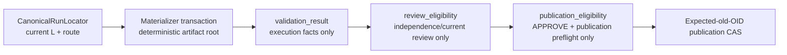

# W2 F1-F6 Repair Design v12

## Reader Map

This append-only v12 design closes the remaining boundaries inside the existing
materializer-backed validation route. It supersedes only the v11 clauses named
below and preserves all other approved v11, v10, v9, and v8 contracts.

The v12 closure is:

1. validation, review, and publication use one strict predicate chain:
   `validation_result -> review_eligibility -> publication_eligibility`;
2. validation result proves only materialized execution facts, review
   eligibility proves only independent-review suitability, and publication
   eligibility proves only current explicit approval plus publication
   preconditions;
3. public materializer/resolver APIs accept no `report_dir`, `report_root`,
   `run_id`, manifest path, artifact path, or receipt path. The active bundle is
   derived only through the canonical run locator;
4. validation artifact ID and root path are deterministic from logical key,
   attempt ordinal, and the exact pending event, so a crash retry re-enters the
   same byte location;
5. executable and module-origin evidence is represented by exactly three
   identity observations around version and validation execution;
6. version and validation stream records close EOF, completeness, and
   not-created/capture-failure states; and
7. Python module origin is an exact repo-versus-external tagged union rather
   than an untyped executable-chain entry.

Read in this order:

1. `Structure Contract And Source-Truth Projection`, `Request Clauses`, and
   `Normative Incorporation Of v11` define the exact delta.
2. `Abstract Design Frame` and `Linear Eligibility Architecture` separate the
   three pure predicates.
3. `Canonical Run Locator` and `Public API Closure` remove caller-selected
   bundle and artifact paths.
4. `Deterministic Artifact Identity And Replay` defines the unique artifact
   seed, path, leaf set, and retry behavior.
5. `Three Executable Identity Observations`, `Module-Origin Union`, and
   `Stream EOF And Completeness Union` define the complete execution evidence.
6. `Implementation Source Packet`, `Design Side-Effect Map`,
   `Dependency-Header Closure`, and `Design-to-Implementation Trace` bind later
   implementation.
7. `Exact Acceptance Predicates` and `Public Typed Negative-Test Plan` are the
   independent-review oracle.

This artifact contains no identity for its own complete bytes, Git blob,
containing commit, tree, or size. Those identities are external readback
evidence.

## Structure Contract And Source-Truth Projection

```text
structure_kind=document
audience=independent detailed-design reviewer and later validation/review/publication implementers
decision_context=whether the existing materializer-backed validation route has one canonical run locator, deterministic replay identity, exact three-observation execution evidence, and non-overlapping eligibility predicates
first_artifact=mermaid linear validation-to-publication predicate chain
first_artifact_question=does each downstream eligibility predicate consume the prior pure projection without importing caller paths or re-owning upstream execution facts
visual_plan=mermaid linear predicate flow plus exact locator, artifact seed, identity observation, stream union, and acceptance tables
source_to_structure_map=v11 design/request -> normative predecessor; task_authority/agent_team/bootstrap/task_start -> canonical run locator; work_log/workflow_monitor -> materializer transaction; result-artifact-writeout/ARTIFACT_PLACEMENT -> deterministic run-local bytes; report_artifact_checks/task_close/review/publication helpers -> eligibility projections
document_unit=owner W2 design author; reader independent reviewer/implementer; source map exact v11 packet and bounded run-locator/materializer/consumer paths; validation canonical docs formatter/check plus Git/hash readback; update cadence append-only review successor; canonical parent v11; downstream independent v12 review
document_split_decision=split:append-only v12 has an independent fixed-byte review identity while retaining the same validation-evidence responsibility owner
metric_or_delta_contract=three ordered predicates; zero public run/path overrides; one deterministic artifact root per logical key/attempt/pending event; exactly three identity observations; two module-origin variants; three stream states; zero new ledgers; zero predecessor regressions
ordered_structure=reader map; request/owner/predecessor; ADF; linear predicates; locator; API; artifact replay; three observations; streams/version; transaction/readback; failures; source packet; side effects; trace; acceptance; negatives; honesty
invalid_interpretations=v12 is not source authorization, not a receipt ledger, not a mutable latest artifact, not permission for publication to bypass review eligibility, not a path injection API, not a fourth executable observation, not a free-text EOF claim, and not a compatibility selector
validation_gate=independent fixed-byte v12 detailed-design review
```

Static source-truth anchors:

| Anchor | v11 source truth | Required relation | v12 closure |
| --- | --- | --- | --- |
| `V12-L1` | v11 pass predicate combines execution, reviewer, approval, and publication facts | `separates` non-overlapping responsibility | three linear pure predicates |
| `V12-C1` | v11 public APIs accept `report_dir` and current source exposes run/path overrides | `removes` caller route authority | fixed canonical run locator from `.active_run` and baseline |
| `V12-A1` | v11 artifact ID is owner-generated and path is owner-selected | `requires` deterministic crash replay | exact seed and fixed run-relative root |
| `V12-X1` | v11 stores one expected executable chain and two loose before/after hashes | `requires` exact temporal evidence | three full identity observations plus stream terminal-state contracts |
| `PRESERVE` | approved v11/v10/v9/v8 packet | `constrains` every repair | one materializer/L, automatic review, publication CAS, lineage, topology, formatter statuses, D2/D3/F1/F2, and non-self-reference remain |

No dynamic prose graph was generated. The Mermaid and tables are the static
structure projection selected for this design-only task.

## Request Clauses

| Clause | Required closure |
| --- | --- |
| `V12-L1` | Define exact linear predicates `validation_result -> review_eligibility -> publication_eligibility`. Remove reviewer/publication conditions from validation result and forbid downstream bypass. |
| `V12-C1` | Remove all public report/run/artifact path overrides. Derive the active report bundle and canonical files from one fixed run locator with pointer/baseline/authority/readback checks. |
| `V12-A1` | Derive artifact ID and root path deterministically from logical key, attempt ordinal, pending event ID, and pending event hash. Define exact replay, partial, live, stale, and conflicting behavior. |
| `V12-X1` | Replace loose executable before/after fields with exactly three complete identity observations. Define launcher identity, repo/external module origin, stream EOF/completeness, version linkage, and public negatives. |
| `PRESERVE` | Preserve v11 materializer reuse, route/environment/command strength, current-attempt CAS, and every approved predecessor contract not explicitly replaced. |
| `BOUNDARY` | Change only v12 design and fixed-byte request artifacts. No source, tests, owner docs, hooks, Python, CI, dynamic graph, or publication execution is authorized. |

## Owner Surfaces

| Responsibility | Canonical owner | Replaceable unit | Consumers |
| --- | --- | --- | --- |
| active run pointer and authority | `tools/agent_tools/task_authority.py` | `CanonicalRunLocator` | materializer, monitor, report checks, closeout |
| report-root/bootstrap pointer writing | `tools/agent_tools/agent_team.py`, `bootstrap_agent_run.py`, `task_start.py` | fixed pointer/baseline producer | canonical run locator |
| materializer transaction and current attempt | `tools/agent_tools/work_log.py` under v6/v7/v11 | `CanonicalRunResultMaterializer` | validation result projection |
| structured execution ingress | `tools/agent_tools/workflow_monitor.py` | current required-route invocation | materializer |
| result placement and shape | `ARTIFACT_PLACEMENT.md`, `result-artifact-writeout.md` | deterministic validation artifact root | canonical event and verifier |
| validation result projection | `tools/agent_tools/report_artifact_checks.py` | exact current execution projection | review eligibility |
| review eligibility | retained future `review_dispatch.py` with canonical reviewer ledger state | independent-review predicate | review decision binding |
| publication eligibility | retained future `publication_integrator.py`, `github_publish.py` | explicit approval/publication preflight predicate | publication CAS |
| closeout | `tools/agent_tools/task_close.py` | recomputed chain consumer | final closeout |

Durable owner documents and tools never depend upstream on this run-local v12
report.

## Normative Incorporation Of v11

The exact predecessor packet is:

```text
predecessor_commit=5a842b7f55da8237d81fa5a96c13f7f278245d1d
predecessor_tree=8f09dac76098bb4f1ed7e1f3b4c150fa3490635e
predecessor_parent=26b77aa9b1cebf731c603558a468245a0795e923
predecessor_design_path=reports/agents/convergence-w2-gates-completion-20260716/w2_f1_f6_repair_design_v11.md
predecessor_design_size_bytes=72413
predecessor_design_sha256=fa98c755382ad5e401db6a878907cf04f086fdd9c719e264429d5a4db06fd406
predecessor_design_git_blob=6823aae2f1a4d3f19da150b4e39ed86d0ef48938
predecessor_request_path=reports/agents/convergence-w2-gates-completion-20260716/w2_detailed_design_recheck_request_v11.md
predecessor_request_size_bytes=11247
predecessor_request_sha256=71e9088d2544b5a75e72aa9ebc929fdee596bd47c1eea02b9bc6651920af43fa
predecessor_request_git_blob=2d77c2a10ff58913f3a6edaf7e268b2e87fff91c
```

v12 supersedes exactly:

1. the v11 17-item combined pass predicate;
2. public API parameters `report_dir` and `route_id`, and every public
   `report_root`, `run_id`, result path, manifest path, or artifact path
   equivalent;
3. owner-generated/non-deterministic `artifact_id` and owner-selected artifact
   root wording;
4. `command.executable_chain` as the materialized observation schema;
5. `execution_readback.executable_chain_sha256_before` and
   `execution_readback.executable_chain_sha256_after`;
6. any version/command stream shape where `complete=true` can exist without
   recorded EOF;
7. `python_module_origin` represented only by the generic executable
   resolution union; and
8. any review/publication consumer that reads raw result paths directly or
   recomputes a later predicate while bypassing the preceding projection.

v12 retains:

- `CanonicalRunResultMaterializer`, one L, one current attempt, begin/settle
  expected-head CAS, v7 O_EXCL/temp recovery, and immutable history;
- exact `python.ruff.full` argv, candidate, clean true clone, six-entry empty
  environment, output framing, version normalization, and route-owner sources;
- `pending`, `pass`, `fail`, `deferred_by_user`, and `not_applicable`;
- result manifest status as projection-only;
- independent reviewer requirement before approval/publication;
- current-profile route selection and stale-candidate/profile/route invalidation;
- no `ValidationExecutionReceipt`, receipt ledger, standalone
  `validation_runner.py`, compatibility reader, or test-only API;
- the v10 local review event and external projection authority split;
- automatic review, same-context reviewer lineage, candidate-OID publication,
  expected-old-OID CAS, dirty-checkout preservation, and all incorporated
  v9/v8 contracts.

`RegisteredValidationRouteRecord v2` replaces v11 v1. No compatibility selector
accepts both.

## Abstract Design Frame

### Replaceable responsibility unit

```text
unit=MaterializerBackedValidationRoute
input authority=canonical run locator + current L head + current candidate + active profile
owned transition=resolve route; begin current attempt; derive deterministic artifact root; observe identity three times; preserve exact streams; settle current attempt
first projection=validation_result
second projection=review_eligibility consuming validation_result only
third projection=publication_eligibility consuming review_eligibility only
forbidden inputs=report_dir, report_root, run_id, route_id, artifact ID/path, manifest path, receipt path, argv, cwd, environment, expected status, output bytes, candidate, reviewer, approval, or target supplied by caller
forbidden authority=stored booleans, free-text pass, CI-only conclusion, hand-written manifest, mutable latest path, direct publication read of raw result artifacts
replacement boundary=one implementation may replace the unit only if locator, deterministic replay, three observations, stream terminal states, linear predicates, typed failures, and readback remain exact
```

Responsibility direction is:

- run locator owns where current run state is;
- materializer owns execution evidence and current attempt;
- validation projection owns execution validity only;
- review projection owns independent-review eligibility only;
- publication projection owns explicit-approval/publication readiness only;
- CAS publisher owns mutation only after publication eligibility readback.

No owner decides both an upstream result and a downstream eligibility fact.

## Linear Eligibility Architecture



The arrows are the only legal dependency direction.

### Common projection rules

All three are pure generated projections:

1. they are materialized from current canonical inputs and never appended as a
   second state ledger;
2. stored `outcome` is projection-only and must equal recomputation;
3. each projection references only already materialized predecessors;
4. each projection ID is deterministic and each body hash is RFC 8785/SHA256
   with only the body-hash field omitted;
5. a downstream resolver first regenerates and verifies the immediate
   predecessor, then evaluates only its own additional clauses;
6. no resolver accepts a predecessor object, path, outcome, or hash from a
   caller;
7. failure codes are unique, sorted by UTF-8 bytes, and closed by projection
   type; and
8. no projection contains an actual publication result or an identity for a
   future object.

### `ValidationResultProjection v1`

Exact schema:

```json
{
  "schema": "agent-canon.validation-result-projection.v1",
  "schema_version": 1,
  "validation_result_id": "<deterministic projection ID>",
  "run_locator_ref": {
    "run_locator_id": "<locator ID>",
    "run_locator_body_sha256": "<locator hash>"
  },
  "aggregate_identity": "<aggregate identity>",
  "candidate": {
    "candidate_id": "<candidate ID>",
    "candidate_revision": 1,
    "candidate_body_sha256": "<candidate body hash>",
    "commit": "<candidate commit>",
    "tree": "<candidate tree>"
  },
  "route_record_ref": {
    "route_record_id": "<route v2 ID>",
    "route_record_body_sha256": "<route v2 hash>"
  },
  "attempt": {
    "logical_key_sha256": "<logical-key SHA256>",
    "attempt_ordinal": 1,
    "pending_event_id": "<pending event ID>",
    "pending_event_sha256": "<pending event hash>",
    "current_event_id": "<current event ID>",
    "current_event_sha256": "<current event hash>"
  },
  "artifact": {
    "artifact_id": "<deterministic artifact ID or null>",
    "root_repo_relative": "<deterministic root or null>",
    "manifest_path": "<deterministic manifest path or null>",
    "manifest_sha256": "<manifest SHA256 or null>",
    "manifest_blob": "<manifest Git blob or null>"
  },
  "producer_evidence": {
    "producer_role_id": "<producer role or null>",
    "producer_runtime_agent_id": "<producer runtime ID or null>",
    "writer_runtime_agent_id": "<candidate writer runtime ID>"
  },
  "outcome": "pass",
  "failure_codes": [],
  "validation_result_body_sha256": "<64 lowercase SHA256>"
}
```

Allowed outcomes are exactly:

- `pending`;
- `pass`;
- `fail`;
- `deferred_by_user`; and
- `not_applicable`.

This predicate evaluates only:

- canonical locator, L, route, current attempt, pending/terminal transition,
  deterministic artifact identity/path, generic manifest, candidate,
  executable/module observations, version/command streams, process
  termination, output hashes, environment, and clean-clone readback.

It records producer evidence but does not evaluate reviewer role, reviewer
independence, review frame, review decision, external acknowledgement,
publication authority, target identity, or CAS readiness.

`artifact` fields are all non-null only for current terminal `pass` or `fail`.
They are all null for the other three outcomes.

The ID seed is:

```text
agent-canon.validation-result-projection.v1\0
run-locator-id=<locator ID UTF-8>\0
run-locator-body-sha256=<64 lowercase hex>\0
logical-key-sha256=<64 lowercase hex>\0
attempt-ordinal=<16 lowercase hex>\0
current-event-id=<event ID UTF-8>\0
current-event-sha256=<64 lowercase hex>\0
manifest-sha256=<64 lowercase hex or null UTF-8>\0
outcome=<outcome UTF-8>\0
failure-codes-sha256=<RFC 8785 array SHA256>\0
end\0
```

### `ReviewEligibilityProjection v1`

Exact schema:

```json
{
  "schema": "agent-canon.review-eligibility-projection.v1",
  "schema_version": 1,
  "review_eligibility_id": "<deterministic projection ID>",
  "validation_result_ref": {
    "validation_result_id": "<current validation result ID>",
    "validation_result_body_sha256": "<current validation result hash>"
  },
  "candidate_id": "<same candidate ID>",
  "candidate_revision": 1,
  "review_lineage_id": "<current review lineage ID>",
  "review_frame_ref": {
    "review_frame_id": "<current frame ID>",
    "review_frame_body_sha256": "<current frame hash>"
  },
  "reviewer": {
    "required_role_id": "<change_reviewer|final_reviewer>",
    "assigned_runtime_agent_id": "<current assigned reviewer runtime ID>",
    "validation_producer_runtime_agent_id": "<producer from validation result>",
    "writer_runtime_agent_id": "<writer from validation result>"
  },
  "outcome": "eligible",
  "failure_codes": [],
  "review_eligibility_body_sha256": "<64 lowercase SHA256>"
}
```

`outcome` is exactly `eligible` or `ineligible`.

Review eligibility is `eligible` if and only if:

1. the regenerated validation result is current and `pass`;
2. candidate and revision equal current L and current review frame;
3. review lineage/frame/assignment are current and structurally complete;
4. required role is exactly `change_reviewer` or `final_reviewer`;
5. validation producer runtime ID equals the assigned reviewer runtime ID;
6. assigned reviewer runtime ID differs from writer runtime ID;
7. reviewer context is the retained same-context lineage, not a fresh or
   self-review bypass;
8. no newer candidate, attempt, route/profile revision, failed dispatch, or
   contradictory current validation result exists; and
9. all retained automatic-review structure predicates pass.

It does not require or inspect APPROVE/REVISE/ESCALATE, external provider state,
publication authority, target ref, target OID, or CAS support.

Its ID seed includes validation-result ID/hash, candidate/revision, lineage ID,
frame ID/hash, assigned reviewer ID, required role, outcome, and failure-code
array hash in this exact serialization:

```text
agent-canon.review-eligibility-projection.v1\0
validation-result-id=<validation result ID UTF-8>\0
validation-result-body-sha256=<64 lowercase hex>\0
candidate-id=<candidate ID UTF-8>\0
candidate-revision=<16 lowercase hex>\0
review-lineage-id=<lineage ID UTF-8>\0
review-frame-id=<frame ID UTF-8>\0
review-frame-body-sha256=<64 lowercase hex>\0
required-role-id=<role ID UTF-8>\0
assigned-reviewer-runtime-agent-id=<runtime ID UTF-8>\0
outcome=<eligible or ineligible UTF-8>\0
failure-codes-sha256=<RFC 8785 array SHA256>\0
end\0
```

`review_eligibility_id =
review-eligibility:<SHA256(exact seed bytes)>`.

### `PublicationEligibilityProjection v1`

Exact schema:

```json
{
  "schema": "agent-canon.publication-eligibility-projection.v1",
  "schema_version": 1,
  "publication_eligibility_id": "<deterministic projection ID>",
  "review_eligibility_ref": {
    "review_eligibility_id": "<current review eligibility ID>",
    "review_eligibility_body_sha256": "<current review eligibility hash>"
  },
  "approval": {
    "decision_event_id": "<current local APPROVE event ID>",
    "decision_event_body_sha256": "<current APPROVE event hash>",
    "external_projection_ack_id": "<current acknowledgement ID>",
    "external_projection_ack_body_sha256": "<current acknowledgement hash>",
    "reviewer_runtime_agent_id": "<same assigned reviewer ID>"
  },
  "publication_authority_ref": {
    "publication_id": "<current publication authority ID>",
    "publication_body_sha256": "<current authority body hash>"
  },
  "source": {
    "commit": "<approved source S>",
    "tree": "<approved source tree>"
  },
  "candidate": {
    "candidate_id": "<same candidate ID>",
    "commit": "<immutable candidate B>",
    "tree": "<candidate tree>"
  },
  "target": {
    "repository_id": "<frozen target repository>",
    "route": "<local_ref|remote_ref|github_pr>",
    "target_ref": "<full frozen ref>",
    "expected_target_oid": "<G_expected>",
    "expected_target_tree": "<expected target tree>"
  },
  "outcome": "eligible",
  "failure_codes": [],
  "publication_eligibility_body_sha256": "<64 lowercase SHA256>"
}
```

`outcome` is exactly `eligible` or `ineligible`.

Publication eligibility is `eligible` if and only if:

1. regenerated review eligibility is current and `eligible`;
2. current local review decision is explicit `APPROVE`;
3. decision event candidate, lineage, frame, reviewer, and validation-result
   ancestry equal the review-eligibility chain;
4. external projection acknowledgement is current and maps only to that local
   decision event under v10;
5. publication authority selects the same source, immutable candidate, and
   frozen target tuple;
6. current locator, candidate, route/profile, validation result, review frame,
   reviewer assignment, approval, and external acknowledgement have not moved;
7. expected-old-OID/local/remote/PR CAS support and dirty-checkout protections
   pass the retained publication preflight;
8. no publication mutation has yet occurred for this eligibility object; and
9. every retained v8-v11 publication predicate passes.

It does not execute CAS and contains no result commit, post-CAS ref, publication
receipt, or success claim. The publisher regenerates this projection
immediately before mutation, then performs the retained expected-old-OID CAS.

Its ID seed is:

```text
agent-canon.publication-eligibility-projection.v1\0
review-eligibility-id=<review eligibility ID UTF-8>\0
review-eligibility-body-sha256=<64 lowercase hex>\0
decision-event-id=<decision event ID UTF-8>\0
decision-event-body-sha256=<64 lowercase hex>\0
external-ack-id=<acknowledgement ID UTF-8>\0
external-ack-body-sha256=<64 lowercase hex>\0
publication-authority-id=<publication authority ID UTF-8>\0
publication-authority-body-sha256=<64 lowercase hex>\0
source-candidate-target-tuple-sha256=<RFC 8785 tuple SHA256>\0
outcome=<eligible or ineligible UTF-8>\0
failure-codes-sha256=<RFC 8785 array SHA256>\0
end\0
```

`publication_eligibility_id =
publication-eligibility:<SHA256(exact seed bytes)>`.

## Canonical Run Locator

### Fixed source and no override

`CanonicalRunLocator` is a pure owner-derived snapshot. It is not a new ledger
or mutable locator file.

The only pointer source is:

```text
<canonical repository root>/reports/agents/.active_run
```

The only pointer baseline is:

```text
<canonical repository root>/reports/agents/.active_run.sha256
```

No environment variable, `--report-dir`, `--report-root`, `--run-id`, current
working subdirectory, submodule-local pointer, manifest path, or caller path
may replace either path for validation/review/publication.

### Exact locator schema

```json
{
  "schema": "agent-canon.canonical-run-locator.v1",
  "schema_version": 1,
  "run_locator_id": "<deterministic locator ID>",
  "repository_id": "agent-canon",
  "repository_root": "<absolute normalized canonical repository root>",
  "pointer": {
    "path_repo_relative": "reports/agents/.active_run",
    "path_absolute": "<repository_root>/reports/agents/.active_run",
    "byte_size": 1,
    "sha256": "<pointer bytes SHA256>",
    "device": 1,
    "inode": 1,
    "mode": "100644",
    "mtime_ns": 1,
    "value_absolute": "<absolute normalized report directory>"
  },
  "baseline": {
    "path_repo_relative": "reports/agents/.active_run.sha256",
    "path_absolute": "<repository_root>/reports/agents/.active_run.sha256",
    "byte_size": 65,
    "sha256": "<baseline file bytes SHA256>",
    "expected_pointer_sha256": "<same pointer SHA256>"
  },
  "report": {
    "root_repo_relative": "reports/agents",
    "run_id": "<single path-segment run ID>",
    "dir_repo_relative": "reports/agents/<run-id>",
    "dir_absolute": "<same pointer value>",
    "task_authority_path": "reports/agents/<run-id>/task_authority.yaml",
    "task_authority_sha256": "<authority bytes SHA256>",
    "task_authority_blob": "<Git blob over exact authority bytes>",
    "work_log_path": "reports/agents/<run-id>/work_log.md"
  },
  "run_locator_body_sha256": "<64 lowercase SHA256>"
}
```

Exact locator predicates:

1. canonical repository root is resolved by the repo owner, not supplied as a
   report-path override;
2. pointer and baseline are no-follow regular files with stable `fstat` before
   and after complete reads;
3. pointer bytes are strict UTF-8, no BOM/NUL/CR, exactly one absolute path
   followed by one LF, and no other byte;
4. pointer value is lexically normalized, contains no `..`, resolves without a
   symlink change, and is exactly one direct child of
   `<repository_root>/reports/agents`;
5. `run_id` is that child basename and one non-empty path segment;
6. baseline bytes are exactly 64 lowercase hex characters plus LF and the hex
   equals SHA256 of the complete pointer bytes;
7. report directory is a no-symlink directory at the same absolute path;
8. task authority and work log paths are derived leaves, never caller inputs;
9. task authority is a stable regular file whose role/write/run authority
   corresponds to the active run;
10. L's `run_id` equals locator `run_id`;
11. every operation rereads pointer, baseline, task authority, and resolved
    report directory before begin CAS, before settle CAS, before review
    eligibility, and before publication eligibility; and
12. all rereads must produce the same locator ID/body hash for one attempt
    chain.

The locator ID seed is:

```text
agent-canon.canonical-run-locator.v1\0
repository-id=<repository ID UTF-8>\0
pointer-sha256=<64 lowercase hex>\0
baseline-sha256=<64 lowercase hex>\0
run-id=<run ID UTF-8>\0
report-dir-repo-relative=<normalized path UTF-8>\0
task-authority-sha256=<64 lowercase hex>\0
task-authority-blob=<40 lowercase hex>\0
end\0
```

`run_locator_id = canonical-run:<SHA256(exact seed bytes)>`.

`run_locator_body_sha256` is RFC 8785/SHA256 over the complete record with only
that field omitted.

Stable locator failures:

- `canonical_run_locator:repository_root_invalid`
- `canonical_run_locator:pointer_missing`
- `canonical_run_locator:pointer_not_regular`
- `canonical_run_locator:pointer_unstable`
- `canonical_run_locator:pointer_encoding_invalid`
- `canonical_run_locator:pointer_value_invalid`
- `canonical_run_locator:pointer_outside_report_root`
- `canonical_run_locator:pointer_symlink_forbidden`
- `canonical_run_locator:baseline_missing`
- `canonical_run_locator:baseline_mismatch`
- `canonical_run_locator:run_id_invalid`
- `canonical_run_locator:report_dir_invalid`
- `canonical_run_locator:task_authority_missing`
- `canonical_run_locator:task_authority_mismatch`
- `canonical_run_locator:work_log_missing`
- `canonical_run_locator:ledger_run_id_mismatch`
- `canonical_run_locator:moved_during_operation`
- `canonical_run_locator:id_mismatch`
- `canonical_run_locator:body_hash_mismatch`
- `canonical_run_locator:caller_override_forbidden`

## Public API Closure

The public production boundaries are exactly:

```python
def materialize_required_validation(
    workspace: Path,
) -> dict[str, object]:
    ...

def resolve_validation_result(
    workspace: Path,
) -> dict[str, object]:
    ...

def resolve_review_eligibility(
    workspace: Path,
) -> dict[str, object]:
    ...

def resolve_publication_eligibility(
    workspace: Path,
) -> dict[str, object]:
    ...
```

`workspace` identifies the repository execution context; it is not a report
path. Each function internally constructs `CanonicalRunLocator` from the fixed
pointer and derives the exact W2 required route set from the active profile.

For this owner unit the required route set is exactly
`{"python.ruff.full"}`. A different, empty, or multiple set fails
`validation_route:required_route_set_mismatch`; the caller cannot select a
member.

No public CLI or function accepts:

- `report_dir`;
- `report_root`;
- `run_id`;
- route ID/list;
- artifact ID/root/path;
- route-record path;
- result-manifest path;
- raw stdout/stderr path;
- review/projection path;
- receipt path;
- expected outcome; or
- any identity/hash for those objects.

Tests use a real temporary repository with the canonical fixed
`reports/agents/.active_run` layout. No test-only path or evidence injection API
is created.

## `RegisteredValidationRouteRecord v2`

v2 retains all v11 candidate, command argv, cwd, six-entry environment,
definition-owner, success-rule, route-ID, and body-hash requirements, with
these exact replacements:

```json
{
  "schema": "agent-canon.registered-validation-route.v2",
  "schema_version": 2,
  "run_locator_ref": {
    "run_locator_id": "<current locator ID>",
    "run_locator_body_sha256": "<current locator hash>"
  },
  "artifact_derivation": {
    "schema": "agent-canon.validation-artifact-derivation.v1",
    "root_parent_run_relative": "results/validation",
    "artifact_id_prefix": "validation-result:",
    "attempt_encoding": "16-lowercase-hex",
    "pending_event_binding": "id-and-canonical-sha256",
    "leaf_set": [
      "result_manifest.json",
      "validation.stderr",
      "validation.stdout",
      "version.stderr",
      "version.stdout"
    ]
  },
  "command": {
    "argv": ["<retained exact v11 argv>"],
    "argv_sha256": "<retained exact hash>",
    "cwd_repository_id": "agent-canon",
    "cwd_repo_relative": ".",
    "cwd_absolute": "<clean true-clone root>",
    "cwd_absolute_sha256": "<retained exact hash>",
    "environment_profile": {},
    "execution_identity_contract": {}
  },
  "version_policy": {},
  "route_record_body_sha256": "<64 lowercase SHA256>"
}
```

The shown replacement fields are part of the complete v2 object; all unchanged
v11 top-level fields remain required exactly once. `command.executable_chain`
is absent. `artifact_derivation` contains no actual artifact ID, pending event,
or result path and therefore references no future object.

The v2 route ID seed replaces v11
`executable-chain-sha256` with:

```text
run-locator-id=<locator ID UTF-8>\0
run-locator-body-sha256=<64 lowercase hex>\0
execution-identity-contract-sha256=<64 lowercase hex>\0
artifact-derivation-sha256=<64 lowercase hex>\0
```

All retained seed terms remain in their v11 order. A route v1 record is:

`validation_route:compatibility_schema_forbidden`.

## Deterministic Artifact Identity And Replay

### Exact artifact seed

After the begin transaction commits and the pending event is read back, the
materializer derives:

```text
agent-canon.validation-result-artifact.v1\0
logical-key-sha256=<64 lowercase hex>\0
attempt-ordinal=<16 lowercase hex>\0
pending-event-id-size=<16 lowercase hex>\0
pending-event-id=<exact UTF-8 bytes without NUL>\0
pending-event-sha256=<64 lowercase hex>\0
end\0
```

The range includes every shown NUL and no byte after `end\0`.

```text
artifact_digest = SHA256(exact seed bytes)
artifact_id = validation-result:<artifact_digest>
artifact_root_run_relative = results/validation/<artifact_digest>
artifact_root_repo_relative =
  reports/agents/<run-id>/results/validation/<artifact_digest>
```

The absolute root is derived by joining the canonical locator report directory
with `artifact_root_run_relative`. No caller or manifest contributes a path.

The authoritative leaf set is exactly, in UTF-8 byte order:

1. `result_manifest.json`;
2. `validation.stderr`;
3. `validation.stdout`;
4. `version.stderr`; and
5. `version.stdout`.

No extra leaf, nested directory, symlink, mutable `latest`, summary file, or
receipt file exists in the authoritative root. A human summary, when requested,
is a separate non-authoritative materializer projection and is not accepted by
any predicate.

The generic manifest records `artifact_id`, run-relative root, repo-relative
root, the exact five leaves, locator ID/hash, logical key, attempt, and pending
event ID/hash. It does not contain its own complete-file SHA/blob, terminal
event, settle transaction, current pointer, review eligibility, or publication
eligibility.

### Replay and crash behavior

The existing v7 lock/temp/fsync rules apply with the deterministic digest:

1. attempt lock path is
   `<report_dir>/.validation-result.<artifact_digest>.lock`;
2. every temp filename is
   `.<leaf>.<artifact_digest>.tmp`;
3. root creation, leaf creation, and temp creation are O_EXCL;
4. a live lock owned by the same or another process is never deleted;
5. retry inspects locator, L, pending event, lock, root, and leaves in that
   order;
6. a complete root with exact leaf set and byte-equal manifest/raw identities
   is reused and settlement is retried without command re-execution;
7. an empty owner-matching root before process spawn may resume the same
   attempt;
8. a partial stream capture cannot resume at an arbitrary byte offset; it is
   retained as failed evidence and a new attempt is required;
9. owner-matching stale temp files may be unlinked only under the retained v7
   stale/unowned-process proof, followed by directory fsync;
10. a non-matching, corrupt, extra-leaf, symlink, foreign-owner, or live root is
    never deleted or overwritten;
11. exact transaction replay returns `already_committed` only after artifact,
    event, pointer, and transaction readback equality; and
12. no retry allocates a second artifact ID/path for the same logical
    key/attempt/pending event.

Stable artifact failures:

- `validation_artifact:seed_mismatch`
- `validation_artifact:id_mismatch`
- `validation_artifact:root_mismatch`
- `validation_artifact:leaf_set_mismatch`
- `validation_artifact:extra_leaf`
- `validation_artifact:symlink_forbidden`
- `validation_artifact:live_lock`
- `validation_artifact:foreign_owner`
- `validation_artifact:partial_capture`
- `validation_artifact:temp_conflict`
- `validation_artifact:byte_mismatch`
- `validation_artifact:manifest_mismatch`
- `validation_artifact:replay_conflict`
- `validation_artifact:caller_path_forbidden`

## Three Executable Identity Observations

### Execution identity contract

`command.execution_identity_contract` is exactly:

```json
{
  "schema": "agent-canon.validation-execution-identity-contract.v1",
  "launcher_expected": {},
  "module_origin_expected": {},
  "identity_pair_sha256": "<64 lowercase SHA256>",
  "observation_phases": [
    "before_version_spawn",
    "after_version_capture_before_validation_spawn",
    "after_validation_capture"
  ]
}
```

The array has exactly those three values and order. The expected launcher and
module origin are resolved before begin CAS but are not counted as materialized
observations. `identity_pair_sha256` hashes RFC 8785 canonical JSON bytes of:

```json
{
  "launcher": {},
  "module_origin": {}
}
```

### Observation schema

The generic manifest contains `identity_observations`, an array of exactly
three records:

```json
{
  "schema": "agent-canon.validation-identity-observation.v1",
  "schema_version": 1,
  "observation_id": "<deterministic observation ID>",
  "artifact_id": "<current deterministic artifact ID>",
  "ordinal": 1,
  "phase": "before_version_spawn",
  "launcher": {},
  "module_origin": {},
  "identity_pair_sha256": "<same expected pair hash>",
  "observed_at_utc": "YYYY-MM-DDTHH:MM:SSZ",
  "observation_body_sha256": "<64 lowercase SHA256>"
}
```

Exact phases and temporal boundaries:

| Ordinal | Phase | Earliest legal point | Latest legal point |
| --- | --- | --- | --- |
| 1 | `before_version_spawn` | after deterministic artifact root/route readback | immediately before version process spawn |
| 2 | `after_version_capture_before_validation_spawn` | after both version streams reach a terminal stream state and version termination is recorded | immediately before validation process spawn or before recording validation as not run |
| 3 | `after_validation_capture` | after both validation streams reach a terminal stream state and validation termination/not-run state is recorded | before manifest serialization |

Exactly three observations exist even when version spawn fails or validation is
not run. In that case observations 2 and 3 still reread filesystem/Git identity
without claiming command execution.

The observation ID seed is:

```text
agent-canon.validation-identity-observation.v1\0
artifact-id=<artifact ID UTF-8>\0
ordinal=<2 lowercase hex>\0
phase=<phase UTF-8>\0
identity-pair-sha256=<64 lowercase hex>\0
end\0
```

Every observation must:

1. have the exact ordinal/phase pair;
2. recompute launcher and module-origin identity from current bytes;
3. have pair hash equal the route contract;
4. have launcher and module-origin objects byte-equal across all three
   observations after removing observation metadata;
5. retain stable complete-read/fstat evidence inside each identity object; and
6. occur in timestamp order 1 less than or equal to 2 less than or equal to 3.

No fourth semantic identity observation, loose `before`/`after` hash, or
unbound executable version string participates in pass.

## Launcher And Module-Origin Identity

### Launcher union

`launcher` uses the retained v11 exact identity variants:

- `repo_path_blob`; or
- `external_resolved_file_bytes`.

The complete v11 path/mode/blob/size/SHA and
realpath/device/inode/mode/mtime/null rules remain. Every observation contains
the full launcher object, not only its hash.

For `python.ruff.full`, launcher kind is the owner-resolved Python launcher
kind frozen in route v2. A kind change between observations fails.

### Exact module-origin union

`module_origin` is exactly one of these complete key-compatible variants.

#### `repo_module_origin`

```json
{
  "kind": "repo_module_origin",
  "module_name": "ruff.__main__",
  "import_spec_origin": "<clean-clone absolute module path>",
  "repo_relative_path": "<normalized POSIX module path>",
  "candidate_commit": "<candidate commit>",
  "candidate_tree": "<candidate tree>",
  "tree_mode": "100644",
  "tree_blob": "<40 lowercase Git blob>",
  "external_realpath": null,
  "device": null,
  "inode": null,
  "filesystem_mode": null,
  "mtime_ns": null,
  "byte_size": 1,
  "sha256": "<64 lowercase SHA256>"
}
```

The candidate tree entry and clean-clone file must have equal mode/blob/bytes.
`tree_mode` is exactly `100644` or `100755`.

#### `external_module_origin`

```json
{
  "kind": "external_module_origin",
  "module_name": "ruff.__main__",
  "import_spec_origin": "<absolute external module origin>",
  "repo_relative_path": null,
  "candidate_commit": null,
  "candidate_tree": null,
  "tree_mode": null,
  "tree_blob": null,
  "external_realpath": "<same normalized final regular-file path>",
  "device": 1,
  "inode": 1,
  "filesystem_mode": 33188,
  "mtime_ns": 1,
  "byte_size": 1,
  "sha256": "<64 lowercase SHA256>"
}
```

External origin is resolved through the exact route environment, then opened
as one final no-follow regular file with stable `fstat` around a complete read.
`filesystem_mode` is the exact non-negative `st_mode` integer read from
`fstat`; it must encode a regular file, contain no setuid/setgid/sticky bits,
and remain equal in all three observations. The shown `33188` is decimal
`0100644`; another ordinary permission mode is valid only when the route
record and all observations carry that exact integer.

Common module-origin predicates:

1. module name is exactly `ruff.__main__`;
2. origin is a real source/extension file, not null, `built-in`, `frozen`,
   namespace-only, zip member, loader-only pseudo-path, or caller string;
3. repo origin must be under the clean candidate clone and equal a candidate
   tree entry;
4. external origin must be outside the candidate tree authority and bind exact
   resolved-file bytes;
5. one observation cannot use repo origin while another uses external origin;
6. origin path, kind, mode, byte size, SHA, and blob or fstat identity are equal
   across all three observations; and
7. version and validation use the same resolved module origin.

Stable identity failures:

- `validation_identity:observation_count_mismatch`
- `validation_identity:observation_order_mismatch`
- `validation_identity:observation_phase_mismatch`
- `validation_identity:observation_id_mismatch`
- `validation_identity:observation_hash_mismatch`
- `validation_identity:pair_hash_mismatch`
- `validation_identity:launcher_changed`
- `validation_identity:module_origin_kind_invalid`
- `validation_identity:module_origin_changed`
- `validation_identity:repo_origin_blob_mismatch`
- `validation_identity:repo_origin_bytes_mismatch`
- `validation_identity:external_origin_unstable`
- `validation_identity:external_origin_bytes_mismatch`
- `validation_identity:origin_not_file`
- `validation_identity:extra_observation_forbidden`

## Stream EOF And Completeness Union

### Exact stream record

Every version and validation stdout/stderr stream uses:

```json
{
  "stream": "stdout",
  "state": "eof_complete",
  "pipe_created": true,
  "eof_observed": true,
  "complete": true,
  "capture_error": null,
  "artifact": {
    "path": "<deterministically derived leaf path>",
    "size_bytes": 0,
    "sha256": "<64 lowercase SHA256>",
    "blob": "<40 lowercase Git blob>"
  }
}
```

The closed state table is:

| `state` | `pipe_created` | `eof_observed` | `complete` | `capture_error` | Artifact |
| --- | --- | --- | --- | --- | --- |
| `eof_complete` | true | true | true | null | exact complete bytes |
| `capture_failed` | true | false | false | `read_error`, `reader_cancelled`, or `capture_limit_exceeded` | exact preserved partial bytes |
| `not_created` | false | false | false | `process_not_spawned` | exact zero-byte deterministic leaf |

No other combination exists. In particular:

- `complete=true` requires `eof_observed=true`;
- EOF without complete is invalid;
- a byte or line limit forces `capture_failed`;
- terminal rendering, truncation, summary text, or copied output is not a
  stream record; and
- both stdout and stderr records are always present.

### Version outcome linkage

The v11 closed captured/unsupported/failed union remains, with these exact
replacements:

```json
{
  "identity_observation_before_ref": {
    "observation_id": "<ordinal 1 ID>",
    "observation_body_sha256": "<ordinal 1 hash>"
  },
  "identity_observation_after_ref": {
    "observation_id": "<ordinal 2 ID>",
    "observation_body_sha256": "<ordinal 2 hash>"
  },
  "streams": [
    "<stdout stream record>",
    "<stderr stream record>"
  ]
}
```

The `streams` array order is exactly stdout then stderr. Legacy
`stdout_artifact` and `stderr_artifact` sibling fields are absent.

`captured` requires both streams `eof_complete`, exact selected stream,
required empty other stream, exit 0, and retained
`utf8_single_line_terminal_lf_v1` normalization.

`failed` may have `eof_complete`, `capture_failed`, or `not_created` according
to termination, but always forces validation result fail unless the policy is
the retained owner-declared unsupported variant.

`unsupported` runs no version command, uses two `not_created` stream records,
and remains legal only under the exact owner policy. Observations 1 and 2 still
must match.

### Validation command outcome linkage

`command_outcome` is exactly one of:

- `executed`; or
- `not_run_due_to_version_failure`.

Both variants contain:

```json
{
  "identity_observation_before_ref": {
    "observation_id": "<ordinal 2 ID>",
    "observation_body_sha256": "<ordinal 2 hash>"
  },
  "identity_observation_after_ref": {
    "observation_id": "<ordinal 3 ID>",
    "observation_body_sha256": "<ordinal 3 hash>"
  },
  "streams": [
    "<validation stdout stream record>",
    "<validation stderr stream record>"
  ]
}
```

For `executed`, termination uses the retained exited/signaled/spawn-failed
union. Pass requires exited 0 and both streams `eof_complete`.

For `not_run_due_to_version_failure`, termination is null, both streams are
`not_created`, and the exact version failure ref is non-null. It always forces
validation result fail.

The retained combined-output framing hashes the exact stream artifact bytes
regardless of success. `complete=true` at command-outcome level is derived only
when both stream states are `eof_complete`; it is not independently writable.

Stable stream failures:

- `validation_stream:schema_mismatch`
- `validation_stream:order_mismatch`
- `validation_stream:state_combination_invalid`
- `validation_stream:eof_missing`
- `validation_stream:complete_without_eof`
- `validation_stream:artifact_path_mismatch`
- `validation_stream:artifact_identity_mismatch`
- `validation_stream:partial_capture`
- `validation_stream:unexpected_not_created`
- `validation_stream:version_observation_link_mismatch`
- `validation_stream:command_observation_link_mismatch`
- `validation_stream:command_not_run_reason_mismatch`

## Materializer Transaction And Readback

The v11 begin/settle transaction remains one existing
`result_artifact_attempt_transition`.

The exact v12 order is:

1. derive canonical run locator and current L;
2. derive active profile and exact single required route;
3. construct route v2 with locator and expected launcher/module identity;
4. begin CAS with route v2, pending event, and successor current-attempt
   pointer;
5. read back pending event;
6. derive deterministic artifact ID/root/leaf paths;
7. acquire deterministic attempt lock and inspect replay state;
8. create/read observation 1;
9. run or classify version command and drive both version streams to a terminal
   stream state;
10. create/read observation 2;
11. run validation command or record exact not-run state and drive both
    validation streams to a terminal stream state;
12. create/read observation 3;
13. serialize/fsync raw leaves and manifest, then directory fsync;
14. reread locator, L, candidate, route, artifact root, all leaves, all three
    observations, stream states, and clean-clone state;
15. settle CAS with terminal event and successor current-attempt pointer;
16. regenerate `validation_result`;
17. when requested, regenerate `review_eligibility` from that result;
18. when requested, regenerate `publication_eligibility` from that review
    projection; and
19. publisher repeats locator and full projection-chain readback immediately
    before expected-old-OID CAS.

No review or publication condition participates in steps 1-16. No raw
validation artifact is read directly by steps 17-19 except through
regeneration of the immediate predecessor projection.

## Stable Projection Failures

Validation result:

- `validation_result:schema_mismatch`
- `validation_result:locator_mismatch`
- `validation_result:route_mismatch`
- `validation_result:attempt_mismatch`
- `validation_result:artifact_mismatch`
- `validation_result:identity_observation_mismatch`
- `validation_result:stream_mismatch`
- `validation_result:termination_mismatch`
- `validation_result:output_hash_mismatch`
- `validation_result:clean_clone_mismatch`
- `validation_result:stored_outcome_mismatch`
- `validation_result:id_mismatch`
- `validation_result:body_hash_mismatch`

Review eligibility:

- `review_eligibility:schema_mismatch`
- `review_eligibility:validation_result_not_pass`
- `review_eligibility:validation_result_stale`
- `review_eligibility:candidate_mismatch`
- `review_eligibility:lineage_mismatch`
- `review_eligibility:frame_mismatch`
- `review_eligibility:role_invalid`
- `review_eligibility:producer_not_assigned_reviewer`
- `review_eligibility:self_review_forbidden`
- `review_eligibility:fresh_reviewer_bypass`
- `review_eligibility:dispatch_blocked`
- `review_eligibility:stored_outcome_mismatch`
- `review_eligibility:id_mismatch`
- `review_eligibility:body_hash_mismatch`

Publication eligibility:

- `publication_eligibility:schema_mismatch`
- `publication_eligibility:review_not_eligible`
- `publication_eligibility:review_stale`
- `publication_eligibility:approve_missing`
- `publication_eligibility:decision_mismatch`
- `publication_eligibility:external_projection_mismatch`
- `publication_eligibility:authority_mismatch`
- `publication_eligibility:source_mismatch`
- `publication_eligibility:candidate_mismatch`
- `publication_eligibility:target_mismatch`
- `publication_eligibility:cas_unsupported`
- `publication_eligibility:target_moved`
- `publication_eligibility:stored_outcome_mismatch`
- `publication_eligibility:id_mismatch`
- `publication_eligibility:body_hash_mismatch`

Every failure leaves immutable evidence intact and creates no downstream
eligibility, decision, approval, publication authority, or mutation.

## Implementation Source Packet

### Fixed predecessor

```text
repository=/mnt/l/workspace/agent-canon-convergence-w2-final-writer-owned
branch=codex/convergence-w2-final-gates-completion
source_commit=5a842b7f55da8237d81fa5a96c13f7f278245d1d
source_tree=8f09dac76098bb4f1ed7e1f3b4c150fa3490635e
source_parent=26b77aa9b1cebf731c603558a468245a0795e923
review_input_kind=explicit user v12 closure request
durable_review_decision_artifact=not_supplied
implementation_authorization=blocked
```

### Exact owner evidence at v11

| Path | Responsibility | Git blob |
| --- | --- | --- |
| `tools/agent_tools/task_authority.py` | active pointer/baseline/task authority owner | `294a5074e572f460a22e3ac726b4f17db25d1982` |
| `tools/agent_tools/agent_team.py` | report-root owner | `e914f8433a7dc31df008194929f742f5e4e9139d` |
| `tools/agent_tools/bootstrap_agent_run.py` | active pointer producer | `212bc8b99fa8dc68ff623fb53a29580b7a4bb1d2` |
| `tools/agent_tools/task_start.py` | active pointer producer | `d40e4266203f2c71b687953dd3acc1fff9837b84` |
| `tools/agent_tools/work_log.py` | canonical ledger/materializer transaction | `16324873f42c409b4181f2e5897e8d423133cb1d` |
| `tools/agent_tools/workflow_monitor.py` | structured ingress | `da00ebc90f89839f7c1a11f4fb734175c63cfbfb` |
| `tools/agent_tools/report_artifact_checks.py` | deterministic projection/checker | `4fd4802ab7d4b1698b9ed7bcaf5f9b5dcb92e6e9` |
| `tools/agent_tools/task_close.py` | closeout consumer | `53b5d0cabdc1623516ad95d719210f34ce37d7b9` |
| `agents/COMMUNICATION_PROTOCOL.md` | one-ledger/context schema owner | `74b04f3cd6ca274eb2ef36f558a2b33859613379` |
| `agents/canonical/ARTIFACT_PLACEMENT.md` | run-local placement owner | `5a51fba8b84604a27fc22e650c2fa1059b110a7b` |
| `agents/skills/result-artifact-writeout.md` | raw/manifest output contract | `ffc7e73552653e71d793933582145805898083e8` |
| `documents/runtime/runtime-profiles-and-check-matrix.json` | active validation route owner | `c0d8c64b8df5d58ab7ac1c3adca2dfa3de42ec98` |
| `tools/ci/run_python_quality_checks.sh` | exact Ruff command source | `be0715a0a771b0571f394f1756df55593c8a5f78` |
| `tools/agent_tools/github_publish.py` | GitHub publication consumer | `28238720838e645cadf342612cf81f6810426634` |

Selected complete-file SHA256 evidence:

| Path | SHA256 |
| --- | --- |
| `task_authority.py` | `6716179cd1858457a982e38bb6ffa4063122f73f5c2054089a266cd942dcdb4b` |
| `agent_team.py` | `b3027e088901c13c15792fbd51539c81ab593e43a1725c01825e747b04605c09` |
| `bootstrap_agent_run.py` | `164084a8ce684205b477cf685aaee32a83aee78f2fdfe5692bd4857637f387c7` |
| `task_start.py` | `b34655458969c643513f66a09547800bf45135f7e2d527e14a509f19badb1a0a` |
| `work_log.py` | `74d94a23d7b0f8fa94d347757718f2441d5ee610edb6c9f16395659786974244` |
| `workflow_monitor.py` | `3d1175f487989d21474aaead65e0a21a978280ec0450b78731e333a1c057b60f` |
| `report_artifact_checks.py` | `c77859a97282829d5fbfa4ac3801e884c1f15cde59b5a57c45525b9fcc0ac471` |
| `task_close.py` | `0bc6a2188b4ebeb9f0b6239389e2e11c496cda6f6547ace49ace8ee6b695687e` |

Current source still permits run/path overrides and lacks the approved
materializer transaction. Source/OOP/test/publication execution evidence is
therefore pending until later implementation and consolidated validation.

## Design Side-Effect Map

The following are later implementation surfaces only.

| Surface | Required later change | Clause | Oracle |
| --- | --- | --- | --- |
| `COMMUNICATION_PROTOCOL.md` | define three projection schemas, linear dependency, locator/observation/stream records | V12-L1, V12-C1, V12-X1 | schema review |
| `ARTIFACT_PLACEMENT.md`, result-artifact skill/mirror | define deterministic validation root/leaf set and replay placement | V12-A1 | placement/mirror checks |
| runtime profile JSON/reader | register route v2 identity/stream contract | V12-X1 | profile inventory |
| `task_authority.py` | own canonical locator snapshot and forbid validation path overrides | V12-C1 | task authority tests |
| `agent_team.py`, bootstrap/task start | normalize pointer/baseline production to locator contract | V12-C1 | bootstrap/task-start tests |
| `work_log.py` | route v2, deterministic artifact derivation, three observations, stream records, begin/settle integration | V12-A1, V12-X1 | work-log/materializer tests |
| `workflow_monitor.py` | expose no-path required-route materialization | V12-C1 | monitor tests |
| `report_artifact_checks.py` | generate validation result and verify locator/artifact/observation/streams | V12-L1, V12-X1 | checker tests |
| retained future `review_dispatch.py` | generate review eligibility from validation result only | V12-L1 | review-lineage tests |
| retained future `publication_integrator.py` | generate publication eligibility from review eligibility only | V12-L1 | publication tests |
| `github_publish.py` | consume publication eligibility only; no raw validation path | V12-L1, V12-C1 | GitHub helper tests |
| `task_close.py` | regenerate full linear chain from canonical locator | V12-L1, V12-C1 | closeout tests |
| Python quality wrapper/callers | invoke no-path canonical materializer route and stop parsing pass text | V12-C1 | shell caller tests |
| existing owner-selected tests | public no-override, deterministic replay, three observations, module union, stream EOF, linear bypass negatives | all | public oracle plan |
| dependency headers/docs/templates | add reciprocal locator/projection edges and remove path/combined-predicate wording | all | convention consistency |

No new receipt, ledger, compatibility shim, or test-only helper path is added.

## Dependency-Header Closure

Later implementation must include these reciprocal pairs:

| Forward owner edge | Reciprocal consumer edge |
| --- | --- |
| `task_authority.py`: downstream implementation `./work_log.py` resolves the canonical active run | `work_log.py`: upstream implementation `./task_authority.py` owns canonical run location |
| `task_authority.py`: downstream implementation `./workflow_monitor.py` resolves the canonical active run | `workflow_monitor.py`: upstream implementation `./task_authority.py` owns canonical run location |
| `task_authority.py`: downstream implementation `./report_artifact_checks.py` verifies locator equality | `report_artifact_checks.py`: upstream implementation `./task_authority.py` owns locator snapshots |
| `agent_team.py`: downstream implementation `./bootstrap_agent_run.py` writes canonical report roots | `bootstrap_agent_run.py`: upstream implementation `./agent_team.py` owns report-root resolution |
| `agent_team.py`: downstream implementation `./task_start.py` writes canonical report roots | `task_start.py`: upstream implementation `./agent_team.py` owns report-root resolution |
| `task_authority.py`: upstream implementation `./bootstrap_agent_run.py` materializes pointer/baseline | `bootstrap_agent_run.py`: downstream implementation `./task_authority.py` validates pointer/baseline |
| `task_authority.py`: upstream implementation `./task_start.py` materializes pointer/baseline | `task_start.py`: downstream implementation `./task_authority.py` validates pointer/baseline |
| `work_log.py`: downstream implementation `./report_artifact_checks.py` verifies materializer/current-attempt state | `report_artifact_checks.py`: upstream implementation `./work_log.py` owns canonical validation state |
| `report_artifact_checks.py`: downstream implementation retained future `./review_dispatch.py` consumes validation result | future `review_dispatch.py`: upstream implementation `./report_artifact_checks.py` owns validation result |
| future `review_dispatch.py`: downstream implementation retained future `./publication_integrator.py` consumes review eligibility | future `publication_integrator.py`: upstream implementation `./review_dispatch.py` owns review eligibility |
| future `publication_integrator.py`: downstream implementation `./github_publish.py` exposes publication eligibility | `github_publish.py`: upstream implementation `./publication_integrator.py` owns publication eligibility |
| `report_artifact_checks.py`: downstream implementation `./task_close.py` regenerates validation result | `task_close.py`: upstream implementation `./report_artifact_checks.py` owns result projection |
| future `review_dispatch.py`: downstream implementation `./task_close.py` regenerates review eligibility | `task_close.py`: upstream implementation `./review_dispatch.py` owns review eligibility |
| future `publication_integrator.py`: downstream implementation `./task_close.py` regenerates publication eligibility | `task_close.py`: upstream implementation `./publication_integrator.py` owns publication eligibility |

All retained v11 reciprocal materializer/profile/wrapper/test edges remain.
No durable header points to this v12 report.

## Design-to-Implementation Trace

| Slice | Responsibility | Later paths | Public oracle |
| --- | --- | --- | --- |
| `V12-S1` | canonical run locator | task authority, agent team, bootstrap/task start | missing/moved/baseline/outside-root/override negatives |
| `V12-S2` | no-path public API | work log, monitor, report checks, closeout | rejected report/run/route/artifact path arguments |
| `V12-S3` | deterministic artifact replay | work log, placement/result docs | seed/path/leaf/live/partial/replay negatives |
| `V12-S4` | route v2 identity contract | profile, work log, checker | v1 rejection and contract hash negatives |
| `V12-S5` | exactly three observations | work log, manifest, checker | count/order/phase/link/equality negatives |
| `V12-S6` | repo/external module origin | resolver, manifest, checker | kind/null/blob/fstat/origin-change negatives |
| `V12-S7` | stream EOF/completeness | materializer, manifest, checker | complete-without-EOF/not-created/partial/path negatives |
| `V12-S8` | validation result | report checker | execution-only predicate and stored-outcome negatives |
| `V12-S9` | review eligibility | review dispatcher | independence/frame/lineage/no-decision-bypass negatives |
| `V12-S10` | publication eligibility | publication integrator/GitHub helper | explicit APPROVE/authority/target/CAS preflight negatives |
| `V12-S11` | non-regression | all retained predecessor surfaces | independent complete predecessor recheck |

Implementation order is owner locator, route/materializer, validation projection,
review projection, publication projection, consumers, reciprocal docs/headers,
then tests and consolidated validation. No downstream consumer is enabled
before its immediate predecessor owner.

## Exact Acceptance Predicates

### V12-L1 linear predicates

Pass if and only if:

1. exactly three projection schemas exist in the order validation result,
   review eligibility, publication eligibility;
2. validation result evaluates only execution/materializer facts;
3. review eligibility regenerates validation result and adds only current
   reviewer/frame/lineage/independence facts;
4. publication eligibility regenerates review eligibility and adds only
   explicit APPROVE, external acknowledgement, publication authority,
   source/candidate/target, and CAS-preflight facts;
5. no downstream predicate accepts a caller-supplied predecessor/path/outcome;
6. no predicate contains a future result or executes publication mutation;
7. stored outcomes are projection-only;
8. publisher consumes only current publication eligibility and repeats
   readback before CAS; and
9. every bypass or stale predecessor fails typed.

### V12-C1 canonical locator and API

Pass if and only if:

1. fixed `.active_run` and `.active_run.sha256` are the only run locator
   sources;
2. pointer/baseline bytes, no-follow stable read, absolute normalized direct
   child, run ID, task authority, work log, and ledger run equality are exact;
3. locator ID/body hash and reread points are exact;
4. public APIs have the four exact signatures and retain only `workspace`;
5. route set is derived and exactly `python.ruff.full`;
6. no public report root/dir, run ID, route, artifact, manifest, raw stream,
   projection, or receipt path override exists;
7. tests use canonical temporary repository layout without a test-only API;
   and
8. missing/moved/foreign/mismatched locator evidence fails before artifact
   creation, review, or publication.

### V12-A1 deterministic artifact replay

Pass if and only if:

1. artifact seed includes exactly logical key hash, attempt ordinal, pending
   event ID length/bytes, and pending event hash;
2. artifact ID/root paths and five-leaf set derive exactly from the seed and
   locator;
3. no caller/path/manifest chooses or changes them;
4. manifest contains predecessor identity but no self/future identity;
5. lock/temp names are deterministic;
6. exact complete bytes are reused after crash without rerunning;
7. partial capture is retained and requires a new attempt;
8. live, foreign, corrupt, extra, or mismatched roots are never deleted or
   overwritten;
9. settlement replay is accepted only after event/pointer/transaction equality;
   and
10. no duplicate root is created for one logical key/attempt/pending event.

### V12-X1 identity, module origin, streams, and version

Pass if and only if:

1. route v2 replaces executable chain with one execution-identity contract;
2. manifest contains exactly three observations with exact ordinal/phase;
3. every observation has full launcher and module-origin identities;
4. expected pair and all three observed pairs are equal;
5. module origin is exactly repo or external with complete null/blob/fstat
   rules;
6. namespace/builtin/frozen/zip/pseudo/caller origins fail;
7. version links observations 1 and 2; validation links observations 2 and 3;
8. version and validation each contain stdout then stderr stream records;
9. stream state is exactly EOF-complete, capture-failed, or not-created with
   the exact boolean/error combination;
10. complete implies EOF and pass requires all executed streams EOF-complete;
11. validation-not-run after version failure is explicit and linked;
12. output/normalization/termination/clean-clone strength remains at least v11;
    and
13. every extra/missing/order/kind/EOF/path/hash/readback mismatch fails typed.

### Preserved v11/v10/v9/v8 acceptance

Pass also requires:

- v11 one materializer, one ledger, registered route, environment, current
  attempt, raw result writeout, no receipt ledger, and pending/deferred honesty;
- v10 local event sole authority and external projection acknowledgement;
- v9 one-way immutable review DAG;
- v8 artifact identity/import, reviewer lineage, candidate-OID publication,
  dirty-checkout preservation, corrected source packet, and automatic review;
- v6/v7 atomic transaction, deterministic temp recovery, publication route
  inventory, topology/freeze predicates, formatter statuses, and non-reference
  rules;
- immutable intent list and one current pointer;
- per-member canonical correspondence and exact group equality;
- D2/D3/F1/F2;
- no self-review, fresh-reviewer bypass, keyword/prompt side route,
  compatibility selector, or test-only API; and
- no self-referential artifact.

## Public Typed Negative-Test Plan

| Mutation | Expected result |
| --- | --- |
| pass `report_dir`, `run_id`, route ID, manifest path, or artifact path | `canonical_run_locator:caller_override_forbidden` |
| pointer missing, non-regular, malformed, outside report root, or symlinked | matching locator failure |
| baseline missing or pointer hash differs | `canonical_run_locator:baseline_mismatch` |
| active pointer moves between begin/settle/eligibility reads | `canonical_run_locator:moved_during_operation` |
| artifact seed changes one logical-key/attempt/pending term | `validation_artifact:seed_mismatch` |
| retry chooses another path for same attempt | `validation_artifact:root_mismatch` |
| root has extra leaf, symlink, live lock, partial capture, or different bytes | matching artifact failure |
| route v1 supplied | `validation_route:compatibility_schema_forbidden` |
| observation count is 2 or 4 | `validation_identity:observation_count_mismatch` |
| phases reordered or observation links cross | matching observation/stream link failure |
| launcher or module bytes change only at observation 2 or 3 | matching identity-change failure |
| repo module origin has external fields or external origin has Git fields | `validation_identity:module_origin_kind_invalid` |
| module origin is namespace, built-in, frozen, zip, or caller text | `validation_identity:origin_not_file` |
| stream says complete without EOF | `validation_stream:complete_without_eof` |
| stream EOF absent, truncated, wrong leaf path, or raw hash changed | matching stream failure |
| version fails but validation is represented as executed pass | `validation_stream:command_not_run_reason_mismatch` |
| validation result checks reviewer or publication target | `validation_result:schema_mismatch` |
| review eligibility accepts manager/writer/foreign reviewer | matching review eligibility failure |
| review eligibility inspects or requires APPROVE | `review_eligibility:schema_mismatch` |
| publication eligibility bypasses review eligibility or uses stale one | matching publication eligibility failure |
| explicit APPROVE or external acknowledgement is missing | matching publication eligibility failure |
| publication consumer reads raw manifest path directly | `publication_eligibility:review_not_eligible` plus caller-path failure |
| stored projection outcome differs from recomputation | matching stored-outcome failure |

Tests invoke production APIs only and include at least one negative for every
locator predicate, artifact replay class, observation phase, module-origin
variant/null rule, stream state, linear dependency edge, and publication
bypass.

## Validation Honesty And Design Gate

This v12 commit is design-only. It runs no source implementation, Python,
tests, CI, dynamic graph, validation command, review dispatch, or publication.
Only the canonical Markdown formatter/check and static Git/hash readback are
authorized.

```text
structure_planning=complete
document_split_decision=split:append-only v12 fixed-byte successor
result_writeout=complete
result_overwrite_policy=append-only
canonical_run_locator_execution=pending
deterministic_artifact_replay_execution=pending
three_identity_observation_execution=pending
stream_eof_execution=pending
linear_projection_execution=pending
oop_solid_validation=pending
public_negative_tests=pending
independent_v12_design_review=pending
source_implementation_authorization=blocked
```

No hand-written pass artifact is created. Source implementation remains blocked
until an independent reviewer APPROVEs the exact v12 bytes.
