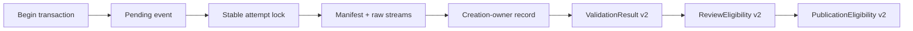

# W2 F1-F6 Repair Design v13

## Reader Map

This append-only v13 design closes three remaining schema and ownership gaps in
the existing materializer-backed validation/review/publication contract:

1. all three projections receive closed outcome/null schemas, exact resolver
   behavior for returned projection versus typed no-projection, canonical null
   serialization in every projection ID seed, and a complete
   `validation_result_id` formula;
2. every validation artifact root receives one exact creation-owner record
   linking the begin transaction, pending event, stable attempt lock, and
   manifest. A complete root is reusable only after that entire owner chain
   compares equal; and
3. version and command outcomes become key-compatible closed unions. An exact
   transition table permits only `captured -> executed`,
   `unsupported -> executed`, and
   `failed -> not_run_due_to_version_failure`.

Read in this order:

1. `Structure Contract And Source-Truth Projection`, `Request Clauses`, and
   `Normative Incorporation Of v12` define the exact replacement boundary.
2. `Projection Resolution Envelope` separates returned projections,
   no-projection, and malformed-evidence failures.
3. `Canonical Nullable Seed Encoding` and the three projection sections define
   complete outcome/null matrices and IDs.
4. `Artifact Creation-Owner Chain` and `Complete-Root Replay` define the
   materializer ownership proof.
5. `VersionOutcome v2`, `CommandOutcome v2`, and `Legal Transition Table`
   close the version-to-command state machine.
6. `Implementation Source Packet`, `Design Side-Effect Map`,
   `Dependency-Header Closure`, and `Design-to-Implementation Trace` bind later
   implementation.
7. `Exact Acceptance Predicates` and `Public Typed Negative-Test Plan` are the
   independent-review oracle.

v13 supersedes only the v12 clauses explicitly identified below. Canonical run
locator C1, deterministic artifact derivation, exactly three executable/module
observations, stream EOF/completeness, the linear responsibility direction,
and all retained v11-v8 contracts remain normative.

This artifact contains no identity for its own complete bytes, Git blob,
containing commit, tree, or size. Those identities are external readback
evidence.

## Structure Contract And Source-Truth Projection

```text
structure_kind=document
audience=independent detailed-design reviewer and later materializer/projection implementers
decision_context=whether all projection absence/null states, artifact creation ownership, and version-to-command transitions are closed and replay-safe
first_artifact=mermaid resolver-and-owner-chain state flow
first_artifact_question=can a consumer distinguish absent projection from a negative projection, and can a retry prove one artifact root belongs to the exact begin/pending/lock/manifest chain
visual_plan=mermaid flow plus outcome/null, no-projection, owner-record, and transition tables
source_to_structure_map=v12 projection schemas -> closed v13 variants and ID seeds; v12 deterministic artifact root -> creation-owner chain; v12 version/command linkage -> key-compatible v2 unions; v12 C1/source packet -> retained implementation owner paths
document_unit=owner W2 design author; reader independent reviewer/implementer; source map exact v12 packet and bounded projection/materializer/consumer paths; validation canonical docs formatter/check plus Git/hash readback; update cadence append-only review successor; canonical parent v12; downstream independent v13 review
document_split_decision=split:append-only v13 has an independent fixed-byte review identity while preserving the same contract owner
metric_or_delta_contract=three closed projection outcome algebras; one resolution envelope; one canonical nullable seed encoding; one exact validation-result formula; one creation-owner record per artifact root; one owner-chain equality gate; three legal version-command transitions; zero new ledgers; zero v12 C1 regressions
ordered_structure=reader map; clauses/owners/predecessor; ADF; resolution envelope; nullable encoding; three projections; creation owner; replay; version/command unions; transaction; failures; source packet; side effects; trace; acceptance; negatives; honesty
invalid_interpretations=v13 is not source authorization, not a null-as-empty-string convention, not a projection with every field null, not permission to reuse a byte-equal foreign root, not a mutable lock owner, not a fourth command transition, not a receipt ledger, and not a compatibility selector
validation_gate=independent fixed-byte v13 detailed-design review
```

Static source-truth anchors:

| Anchor | v12 source truth | Required relation | v13 closure |
| --- | --- | --- | --- |
| `V13-P1` | projections show representative outcomes but do not close every null combination or no-projection behavior | `requires` exhaustive algebra | v2 projections plus one resolution envelope and canonical nullable seeds |
| `V13-O1` | deterministic roots can be byte-equal without one exact creation-owner object | `requires` provenance equality | stable owner chain and `creation_owner.json` |
| `V13-C1` | command outcome variants lack one complete key set and exact version-failure reference | `requires` state-machine closure | VersionOutcome v2 and CommandOutcome v2 with three legal transitions |
| `PRESERVE` | v12 C1 and approved predecessor packet | `constrains` all repairs | locator, materializer, observations, streams, review/publication flow, CAS, lineage, D2/D3/F1/F2, and non-self-reference remain |

No dynamic prose graph was generated. The Mermaid and tables are the static
structure selected for this design-only task.

## Request Clauses

| Clause | Required closure |
| --- | --- |
| `V13-P1` | Define closed outcome/null schemas for validation result, review eligibility, and publication eligibility. Define typed no-projection versus returned-projection behavior, canonical null serialization in every ID seed, and the exact `validation_result_id` formula. |
| `V13-O1` | Define one exact creation-owner record linking begin transaction, pending event, stable attempt lock, artifact identity/root, owner tool, and manifest. Require complete owner-chain equality before any complete-root reuse. |
| `V13-C1` | Define key-compatible VersionOutcome v2 and CommandOutcome v2 schemas, exact termination and `version_failure_ref` null rules, and the only legal transitions from version outcome to command outcome. |
| `PRESERVE` | Preserve v12 C1, deterministic path seed, three observations, module-origin and stream unions, linear ownership, materializer reuse, and all retained contracts. |
| `BOUNDARY` | Change only v13 design and fixed-byte request artifacts. Source, tests, owner docs, hooks, Python, CI, dynamic graph, validation execution, and publication remain blocked. |

## Owner Surfaces

| Responsibility | Canonical owner | Replaceable unit | Consumer |
| --- | --- | --- | --- |
| projection schemas and resolver envelope | `agents/COMMUNICATION_PROTOCOL.md` | generated projection contract | checker, review, publication, closeout |
| validation result and no-projection resolver | `tools/agent_tools/report_artifact_checks.py` | validation projection resolver | review eligibility |
| review eligibility | retained future `review_dispatch.py` | review projection resolver | publication eligibility |
| publication eligibility | retained future `publication_integrator.py` | publication projection resolver | GitHub/local/remote CAS |
| begin/settle transaction and pending event | `tools/agent_tools/work_log.py` | canonical result-attempt transaction | creation-owner chain |
| stable attempt lock and artifact bytes | `work_log.py`, `ARTIFACT_PLACEMENT.md`, `result-artifact-writeout.md` | materializer artifact owner | creation record and terminal event |
| version/command execution evidence | `work_log.py` plus active route v2 | key-compatible outcome writer | validation result |
| canonical run locator | `task_authority.py` and v12 C1 consumers | retained locator | every v13 resolver |
| closeout | `task_close.py` | full chain regeneration | final closeout |

Durable owner surfaces never depend upstream on this run-local v13 report.

## Normative Incorporation Of v12

The exact predecessor packet is:

```text
predecessor_commit=47a4bb0516d7d320511c4671970a8b23cef0211f
predecessor_tree=5cd321deea02bf7c87140db71b4315d8c565678a
predecessor_parent=5a842b7f55da8237d81fa5a96c13f7f278245d1d
predecessor_design_path=reports/agents/convergence-w2-gates-completion-20260716/w2_f1_f6_repair_design_v12.md
predecessor_design_size_bytes=68762
predecessor_design_sha256=900214147d7a1216729237296487fba1ad376d24894047cda71b6887aef1daab
predecessor_design_git_blob=0b228053db2dc071781a459d94fb799fb79ef664
predecessor_request_path=reports/agents/convergence-w2-gates-completion-20260716/w2_detailed_design_recheck_request_v12.md
predecessor_request_size_bytes=12490
predecessor_request_sha256=8e0d3e7832e6d594df20aaf745b37df90c1dfb1831921bbd04b6eefeb78ef248
predecessor_request_git_blob=1999526ad310832d7fef735f1eaf13eec635067e
```

v13 supersedes exactly:

1. projection schema versions v1 and their representative-only null examples;
2. v12 review outcome `eligible|ineligible`;
3. v12 publication outcome `eligible|ineligible`;
4. any resolver behavior that represents absence as a projection containing
   null subject fields;
5. every projection ID seed that writes ambiguous text such as
   `<value or null UTF-8>` without a typed nullable encoding;
6. the incomplete v12 validation-result seed;
7. v12 authoritative artifact leaf set of five files;
8. any complete-root replay based only on leaf bytes/manifest identity;
9. v12 version outcome without a deterministic local outcome identity;
10. v12 `command_outcome` variants that do not share one key set;
11. an unspecified `version_failure_ref`; and
12. any version-to-command transition outside the exact v13 table.

v13 retains:

- v12 `CanonicalRunLocator v1`, fixed `.active_run` and baseline, no public
  report/run/artifact path override, and four public workspace-only APIs;
- v12 deterministic artifact seed, digest, root, and attempt lock path;
- v12 route v2, exact Ruff argv/environment/candidate/owner source;
- exactly three launcher/module-origin observations;
- repo/external module origin union;
- stream EOF-complete/capture-failed/not-created union;
- one materializer, one L, one current attempt, begin/settle CAS, v7 crash
  recovery, immutable history, and projection-only stored outcomes;
- validation-result to review-eligibility to publication-eligibility
  responsibility direction;
- no validation receipt ledger, standalone validation runner, compatibility
  reader, or test-only API;
- automatic review, same-context lineage, explicit APPROVE, publication
  authority, expected-old-OID CAS, dirty-checkout preservation, and all
  incorporated v11-v8 contracts.

Projection v1 objects are rejected:

- `validation_result:compatibility_schema_forbidden`;
- `review_eligibility:compatibility_schema_forbidden`; and
- `publication_eligibility:compatibility_schema_forbidden`.

## Abstract Design Frame

```text
unit=MaterializerBackedValidationReviewPublicationContract
state authority=canonical run locator + L + immutable artifact bytes
projection authority=pure regenerated v2 projections only
absence authority=typed no_projection envelope only
artifact owner authority=creation-owner chain from begin transaction through manifest
command authority=VersionOutcome v2 followed by exactly one legal CommandOutcome v2
forbidden ambiguity=null as empty/missing/string token; absent projection as negative projection; byte-equal root without owner equality; command execution after failed version; not-run after captured/unsupported version
replacement boundary=all schema key sets, null matrices, seed encodings, owner links, transition table, readback, and typed failures remain
```

The responsibility flow is:



The creation-owner arrows and projection arrows are one-way. The manifest does
not reference the later creation-owner record, terminal event, settlement
transaction, or projections.

## Projection Resolution Envelope

### Exact return union

Each `resolve_*` API returns exactly:

```json
{
  "schema": "agent-canon.projection-resolution.v1",
  "schema_version": 1,
  "projection_kind": "validation_result",
  "result_kind": "projection",
  "projection": {},
  "no_projection": null
}
```

Allowed `projection_kind` values are exactly:

- `validation_result`;
- `review_eligibility`; and
- `publication_eligibility`.

Allowed `result_kind` values and null rules:

| `result_kind` | `projection` | `no_projection` |
| --- | --- | --- |
| `projection` | non-null exact matching v2 projection object | null |
| `no_projection` | null | non-null exact `NoProjection v1` object |

No key may be omitted or added. The envelope is an ephemeral API result and has
no ID/body hash or gate authority independent of its projection.

### Exact `NoProjection v1`

```json
{
  "schema": "agent-canon.no-projection.v1",
  "projection_kind": "validation_result",
  "reason_code": "current_attempt_absent",
  "upstream_projection_kind": null,
  "upstream_reason_code": null,
  "canonical_subject_ref": "<current aggregate event ID>",
  "evidence_refs": ["<canonical aggregate/L evidence ref>"],
  "retryable": true
}
```

Closed reason/null table:

| Projection | `reason_code` | Upstream kind | Upstream reason | Meaning |
| --- | --- | --- | --- | --- |
| validation result | `current_attempt_absent` | null | null | canonical aggregate exists, but no current validation attempt is selected |
| review eligibility | `validation_result_absent` | `validation_result` | `current_attempt_absent` | immediate predecessor resolver returned no-projection |
| publication eligibility | `review_eligibility_absent` | `review_eligibility` | `validation_result_absent` | immediate predecessor resolver returned no-projection |

`canonical_subject_ref` and `evidence_refs` are non-empty for all rows.
`retryable` is exactly true.

No-projection behavior:

1. it is returned only when the immediate canonical subject does not exist;
2. it has no projection ID, body hash, outcome, failure-code set, pass,
   eligibility, approval, or publication authority;
3. downstream resolver propagates the exact immediate absence row and does not
   invent a nullable projection;
4. a pending/deferred/not-applicable/failed validation attempt is an existing
   subject and therefore returns a validation projection, not no-projection;
5. an existing validation projection with absent review frame returns a
   negative review projection, not no-projection;
6. an existing review projection with absent approval or publication authority
   returns a negative publication projection, not no-projection; and
7. no-projection can never satisfy a downstream gate.

Malformed, contradictory, foreign, stale-pointer, schema, hash, or owner
evidence is not absence. The resolver raises/returns its existing typed error
and does not convert it to no-projection.

Stable envelope failures:

- `projection_resolution:schema_mismatch`
- `projection_resolution:kind_mismatch`
- `projection_resolution:null_rule_mismatch`
- `projection_resolution:no_projection_reason_invalid`
- `projection_resolution:malformed_evidence_not_absence`
- `projection_resolution:upstream_absence_mismatch`

## Canonical Nullable Seed Encoding

Every v13 projection and outcome ID seed uses this encoding for each nullable
field. Literal ASCII `null`, empty string, omitted field, zero hash, and JSON
text interpolation are forbidden substitutes.

For a nullable UTF-8 string:

```text
when null:
<field-name>-kind=null\0

when non-null:
<field-name>-kind=utf8\0
<field-name>-size=<16 lowercase hex byte length>\0
<field-name>=<exact UTF-8 bytes without NUL>\0
```

For a nullable unsigned integer:

```text
when null:
<field-name>-kind=null\0

when non-null:
<field-name>-kind=u64\0
<field-name>=<16 lowercase hex>\0
```

For a nullable object:

```text
when null:
<field-name>-kind=null\0

when non-null:
<field-name>-kind=rfc8785-sha256\0
<field-name>-sha256=<SHA256 of RFC 8785 canonical object bytes>\0
```

For a nullable canonical JSON value that may be an object or array, use the
same bytes with `kind=rfc8785-sha256`; the hash input is the exact RFC 8785
value bytes. The design names this operation `encode_nullable_json`. A scalar
string or integer must use its typed string/integer encoding instead.

For nullable fixed hash/OID values, the nullable UTF-8 encoding is used and
the non-null value must also pass its fixed-length lowercase-hex validator.

Every non-null ordinary string in an ID seed uses the same `kind=utf8`,
`size`, and value framing. Every non-null integer uses `kind=u64`. This removes
delimiter ambiguity and makes null serialization identical across all seeds.
When a non-null object/array hash contains nullable members, its closed schema
requires every key and RFC 8785 serializes each null member as the exact four
ASCII bytes `null`; omitted keys and empty-string substitution are invalid.

The seed range always starts with the schema tag plus NUL and ends with
`end\0`; no byte follows it.

## `ValidationResultProjection v2`

### Exact schema

```json
{
  "schema": "agent-canon.validation-result-projection.v2",
  "schema_version": 2,
  "validation_result_id": "<deterministic ID>",
  "run_locator_ref": {
    "run_locator_id": "<locator ID>",
    "run_locator_body_sha256": "<locator hash>"
  },
  "aggregate_identity": "<aggregate identity>",
  "candidate": {
    "candidate_id": "<candidate ID>",
    "candidate_revision": 1,
    "candidate_body_sha256": "<candidate body hash>",
    "commit": "<candidate commit>",
    "tree": "<candidate tree>"
  },
  "route_record_ref": {
    "route_record_id": "<route v2 ID>",
    "route_record_body_sha256": "<route v2 hash>"
  },
  "attempt": {
    "logical_key_sha256": "<logical-key SHA256>",
    "attempt_ordinal": 1,
    "pending_event_id": "<pending event ID>",
    "pending_event_sha256": "<pending event hash>",
    "current_event_id": "<current event ID>",
    "current_event_sha256": "<current event hash>"
  },
  "artifact": null,
  "producer_evidence": {
    "producer_role_id": null,
    "producer_runtime_agent_id": null,
    "writer_runtime_agent_id": "<candidate writer runtime ID>"
  },
  "outcome": "pending",
  "failure_codes": [],
  "validation_result_body_sha256": "<64 lowercase SHA256>"
}
```

`artifact`, when non-null, is exactly:

```json
{
  "artifact_id": "<deterministic artifact ID>",
  "root_repo_relative": "<deterministic root>",
  "manifest_path": "<deterministic manifest path>",
  "manifest_sha256": "<manifest SHA256>",
  "manifest_blob": "<manifest Git blob>",
  "creation_owner_path": "<deterministic creation-owner path>",
  "creation_owner_id": "<creation-owner ID>",
  "creation_owner_body_sha256": "<creation-owner body hash>",
  "creation_owner_sha256": "<creation-owner complete-file SHA256>",
  "creation_owner_blob": "<creation-owner Git blob>"
}
```

### Closed outcome/null matrix

| Outcome | `artifact` | Producer role/runtime | Writer runtime | Failure codes |
| --- | --- | --- | --- | --- |
| `pending` | null | both null | non-null | empty |
| `pass` | non-null exact object | both non-null | non-null | empty |
| `fail` | non-null exact object | both non-null | non-null | non-empty |
| `deferred_by_user` | null | both null | non-null | empty |
| `not_applicable` | null | both null | non-null | empty |

No other combination is valid. All common locator/candidate/route/attempt
objects remain non-null for every returned projection.

The projection exists only when the current attempt pointer exists. Pending,
deferred, and not-applicable are returned projections because they are real
current events.

### Exact validation-result ID formula

Define these non-null RFC 8785 hashes:

```text
locator-ref-sha256 = SHA256(canonical run_locator_ref object)
candidate-sha256 = SHA256(canonical candidate object)
route-ref-sha256 = SHA256(canonical route_record_ref object)
attempt-sha256 = SHA256(canonical attempt object)
producer-evidence-sha256 = SHA256(canonical producer_evidence object, including JSON nulls)
failure-codes-sha256 = SHA256(canonical failure_codes array)
```

The exact seed field order is:

```text
agent-canon.validation-result-projection.v2\0
encode_utf8("run-locator-ref-sha256", <64 lowercase hex>)
encode_utf8("aggregate-identity", <aggregate identity>)
encode_utf8("candidate-sha256", <64 lowercase hex>)
encode_utf8("route-record-ref-sha256", <64 lowercase hex>)
encode_utf8("attempt-sha256", <64 lowercase hex>)
encode_nullable_object("artifact", <artifact object or null>)
encode_utf8("producer-evidence-sha256", <64 lowercase hex>)
encode_utf8("outcome", <closed outcome>)
encode_utf8("failure-codes-sha256", <64 lowercase hex>)
end\0
```

Here `encode_utf8` is the non-null UTF-8 form from `Canonical Nullable Seed
Encoding`; `encode_nullable_object` is its nullable-object form. The displayed
function calls expand to the exact bytes defined there and contribute no
parentheses, commas, or source-code text.

The exact formula is:

```text
validation_result_id =
  validation-result:<lowercase-hex SHA256(exact expanded seed bytes)>
```

`validation_result_body_sha256` is SHA256 over RFC 8785 canonical JSON bytes of
the complete projection with only that field omitted. The ID seed does not
include `validation_result_id` or the body hash.

Stable validation-result failures:

- retained v12 `validation_result:*` failures;
- `validation_result:outcome_invalid`;
- `validation_result:null_rule_mismatch`;
- `validation_result:no_projection_confused_with_pending`;
- `validation_result:creation_owner_missing`;
- `validation_result:creation_owner_mismatch`;
- `validation_result:id_seed_mismatch`.

## `ReviewEligibilityProjection v2`

### Exact schema

```json
{
  "schema": "agent-canon.review-eligibility-projection.v2",
  "schema_version": 2,
  "review_eligibility_id": "<deterministic ID>",
  "validation_result_ref": {
    "validation_result_id": "<current validation-result ID>",
    "validation_result_body_sha256": "<current validation-result hash>"
  },
  "candidate_id": "<same candidate ID>",
  "candidate_revision": 1,
  "review_lineage_id": null,
  "review_frame_ref": null,
  "reviewer": null,
  "outcome": "validation_not_pass",
  "failure_codes": ["review_eligibility:validation_result_not_pass"],
  "review_eligibility_body_sha256": "<64 lowercase SHA256>"
}
```

Non-null objects are exactly the retained v12 shapes:

- `review_frame_ref` has frame ID and body hash;
- `reviewer` has required role ID, assigned runtime agent ID, validation
  producer runtime agent ID, and writer runtime agent ID.

### Closed outcome/null matrix

| Outcome | Validation result | Lineage | Frame | Reviewer | Failure codes |
| --- | --- | --- | --- | --- | --- |
| `eligible` | current pass | non-null | non-null | non-null | empty |
| `validation_not_pass` | current non-pass projection | null | null | null | non-empty |
| `review_context_missing` | current pass | null | null | null | non-empty |
| `reviewer_not_independent` | current pass | non-null | non-null | non-null | non-empty |
| `dispatch_blocked` | current pass | non-null | non-null | non-null | non-empty |
| `stale` | current pass at selected chain but newer canonical evidence exists | non-null | non-null | non-null | non-empty |

Resolution order fixes the null shape:

1. regenerate validation result;
2. if non-pass, stop and return `validation_not_pass` with all review-context
   fields null;
3. if no complete current lineage/frame/assignment exists, return
   `review_context_missing` with all three review-context fields null;
4. otherwise all three are non-null and the outcome is one of the remaining
   four rows.

No generic `ineligible` outcome remains.

### Review-eligibility ID seed

The exact seed order is:

```text
agent-canon.review-eligibility-projection.v2\0
encode_utf8("validation-result-ref-sha256", SHA256(canonical validation_result_ref object))
encode_utf8("candidate-id", <candidate ID>)
encode_u64("candidate-revision", <revision>)
encode_nullable_utf8("review-lineage-id", <lineage ID or null>)
encode_nullable_object("review-frame-ref", <frame ref or null>)
encode_nullable_object("reviewer", <reviewer object or null>)
encode_utf8("outcome", <closed outcome>)
encode_utf8("failure-codes-sha256", SHA256(canonical failure_codes array))
end\0
```

`review_eligibility_id =
review-eligibility:<SHA256(exact expanded seed bytes)>`.

Body hashing follows the v13 common rule.

Stable review failures add:

- `review_eligibility:outcome_invalid`;
- `review_eligibility:null_rule_mismatch`;
- `review_eligibility:no_projection_confused_with_context_missing`;
- `review_eligibility:id_seed_mismatch`.

## `PublicationEligibilityProjection v2`

### Exact schema

```json
{
  "schema": "agent-canon.publication-eligibility-projection.v2",
  "schema_version": 2,
  "publication_eligibility_id": "<deterministic ID>",
  "review_eligibility_ref": {
    "review_eligibility_id": "<current review-eligibility ID>",
    "review_eligibility_body_sha256": "<current review-eligibility hash>"
  },
  "approval": null,
  "publication_authority_ref": null,
  "source": null,
  "candidate": null,
  "target": null,
  "outcome": "review_not_eligible",
  "failure_codes": ["publication_eligibility:review_not_eligible"],
  "publication_eligibility_body_sha256": "<64 lowercase SHA256>"
}
```

When non-null, `approval`, publication authority, source, candidate, and target
use the exact retained v12 objects.

### Closed outcome/null matrix

| Outcome | Review eligibility | Approval | Authority | Source/candidate/target | Failure codes |
| --- | --- | --- | --- | --- | --- |
| `eligible` | current eligible | non-null | non-null | all non-null | empty |
| `review_not_eligible` | current negative projection | null | null | all null | non-empty |
| `approval_missing` | current eligible | null | null | all null | non-empty |
| `authority_missing` | current eligible | non-null | null | all null | non-empty |
| `target_not_ready` | current eligible | non-null | non-null | all non-null | non-empty |
| `stale` | selected complete chain has newer canonical evidence | non-null | non-null | all non-null | non-empty |

Resolution order fixes the null shape:

1. regenerate review eligibility;
2. if not eligible, stop at `review_not_eligible`;
3. if local APPROVE plus external acknowledgement is incomplete, stop at
   `approval_missing`;
4. if publication authority is absent, stop at `authority_missing`;
5. once authority exists, source/candidate/target objects are all non-null and
   the remaining outcomes are target-not-ready, stale, or eligible.

No generic `ineligible` outcome remains.

### Publication-eligibility ID seed

```text
agent-canon.publication-eligibility-projection.v2\0
encode_utf8("review-eligibility-ref-sha256", SHA256(canonical review_eligibility_ref object))
encode_nullable_object("approval", <approval object or null>)
encode_nullable_object("publication-authority-ref", <authority ref or null>)
encode_nullable_object("source", <source object or null>)
encode_nullable_object("candidate", <candidate object or null>)
encode_nullable_object("target", <target object or null>)
encode_utf8("outcome", <closed outcome>)
encode_utf8("failure-codes-sha256", SHA256(canonical failure_codes array))
end\0
```

`publication_eligibility_id =
publication-eligibility:<SHA256(exact expanded seed bytes)>`.

Body hashing follows the v13 common rule.

Stable publication failures add:

- `publication_eligibility:outcome_invalid`;
- `publication_eligibility:null_rule_mismatch`;
- `publication_eligibility:no_projection_confused_with_review_not_eligible`;
- `publication_eligibility:id_seed_mismatch`.

## Artifact Creation-Owner Chain

### Stable owner-chain identity

After begin CAS and pending-event readback, the materializer derives the v12
artifact ID/root and this owner chain:

```text
agent-canon.validation-artifact-owner-chain.v1\0
encode_utf8("run-locator-id", <locator ID>)
encode_utf8("run-locator-body-sha256", <locator hash>)
encode_utf8("logical-key-sha256", <logical-key hash>)
encode_u64("attempt-ordinal", <attempt>)
encode_utf8("begin-transaction-id", <begin transaction ID>)
encode_utf8("begin-transaction-body-sha256", <begin transaction hash>)
encode_utf8("pending-event-id", <pending event ID>)
encode_utf8("pending-event-sha256", <pending event hash>)
encode_utf8("artifact-id", <artifact ID>)
encode_utf8("artifact-root-repo-relative", <artifact root>)
encode_utf8("owner-tool-path", "tools/agent_tools/work_log.py")
encode_utf8("owner-tool-blob", <frozen owner-tool blob>)
end\0
```

`owner_chain_id =
validation-artifact-owner:<SHA256(exact expanded seed bytes)>`.

Every term is non-null. The chain is stable across retries for the same
attempt.

### Stable attempt-lock file

The deterministic v12 lock path remains:

```text
reports/agents/<run-id>/.validation-result.<artifact-digest>.lock
```

Its complete file body is canonical JSON:

```json
{
  "schema": "agent-canon.validation-attempt-lock.v1",
  "schema_version": 1,
  "lock_id": "validation-attempt-lock:<owner-chain-sha256>",
  "owner_chain_id": "<owner-chain ID>",
  "run_locator_ref": {
    "run_locator_id": "<locator ID>",
    "run_locator_body_sha256": "<locator hash>"
  },
  "logical_key_sha256": "<logical-key hash>",
  "attempt_ordinal": 1,
  "begin_transaction_ref": {
    "transaction_id": "<begin transaction ID>",
    "transaction_body_sha256": "<begin transaction hash>"
  },
  "pending_event_ref": {
    "event_id": "<pending event ID>",
    "canonical_sha256": "<pending event hash>"
  },
  "artifact_id": "<artifact ID>",
  "artifact_root_repo_relative": "<artifact root>",
  "owner_tool": {
    "path": "tools/agent_tools/work_log.py",
    "commit": "<owner-tool commit>",
    "tree": "<owner-tool tree>",
    "blob": "<owner-tool blob>"
  },
  "lock_body_sha256": "<64 lowercase SHA256>"
}
```

The file bytes and body are stable; live ownership is the retained exclusive OS
lock on its file descriptor, not a mutable PID/timestamp/nonce field. The file
may persist after lock release. `lock_body_sha256` omits only itself. External
SHA256/Git blob cover the complete lock file bytes.

### Manifest owner fields

The generic result manifest adds:

```json
{
  "owner_chain_id": "<owner-chain ID>",
  "begin_transaction_ref": {
    "transaction_id": "<begin transaction ID>",
    "transaction_body_sha256": "<begin transaction hash>"
  },
  "pending_event_ref": {
    "event_id": "<pending event ID>",
    "canonical_sha256": "<pending event hash>"
  },
  "attempt_lock_ref": {
    "lock_id": "<lock ID>",
    "path": "<deterministic lock path>",
    "lock_body_sha256": "<lock body hash>",
    "sha256": "<complete lock-file SHA256>",
    "blob": "<complete lock-file Git blob>"
  }
}
```

The manifest does not reference the later creation-owner record or its own
complete-file identity.

### Exact `ValidationArtifactCreationOwner v1`

v13 adds the authoritative leaf:

```text
creation_owner.json
```

The complete record is:

```json
{
  "schema": "agent-canon.validation-artifact-creation-owner.v1",
  "schema_version": 1,
  "creation_owner_id": "<deterministic record ID>",
  "owner_chain_id": "<owner-chain ID>",
  "run_locator_ref": {
    "run_locator_id": "<locator ID>",
    "run_locator_body_sha256": "<locator hash>"
  },
  "logical_key_sha256": "<logical-key hash>",
  "attempt_ordinal": 1,
  "begin_transaction_ref": {
    "transaction_id": "<begin transaction ID>",
    "transaction_body_sha256": "<begin transaction hash>"
  },
  "pending_event_ref": {
    "event_id": "<pending event ID>",
    "canonical_sha256": "<pending event hash>"
  },
  "attempt_lock_ref": {
    "lock_id": "<lock ID>",
    "path": "<deterministic lock path>",
    "lock_body_sha256": "<lock body hash>",
    "sha256": "<complete lock-file SHA256>",
    "blob": "<complete lock-file Git blob>"
  },
  "artifact": {
    "artifact_id": "<artifact ID>",
    "root_repo_relative": "<artifact root>"
  },
  "manifest_ref": {
    "path": "<deterministic result_manifest.json path>",
    "size_bytes": 1,
    "sha256": "<manifest complete-file SHA256>",
    "blob": "<manifest Git blob>"
  },
  "owner_tool": {
    "path": "tools/agent_tools/work_log.py",
    "commit": "<owner-tool commit>",
    "tree": "<owner-tool tree>",
    "blob": "<owner-tool blob>"
  },
  "created_at_utc": "YYYY-MM-DDTHH:MM:SSZ",
  "creation_owner_body_sha256": "<64 lowercase SHA256>"
}
```

Its ID seed is:

```text
agent-canon.validation-artifact-creation-owner.v1\0
encode_utf8("owner-chain-id", <owner-chain ID>)
encode_utf8("attempt-lock-body-sha256", <lock body hash>)
encode_utf8("attempt-lock-file-sha256", <lock complete-file SHA256>)
encode_utf8("attempt-lock-file-blob", <lock blob>)
encode_utf8("manifest-path", <deterministic manifest path>)
encode_u64("manifest-size-bytes", <size>)
encode_utf8("manifest-sha256", <manifest SHA256>)
encode_utf8("manifest-blob", <manifest blob>)
end\0
```

`creation_owner_id =
validation-artifact-creation-owner:<SHA256(exact expanded seed bytes)>`.

The body hash is RFC 8785/SHA256 with only
`creation_owner_body_sha256` omitted. The record does not contain its own
complete-file SHA/blob, terminal event, settle transaction, current pointer,
or projection.

The settle transaction and terminal event externally bind:

- creation-owner path;
- creation-owner ID/body hash;
- creation-owner complete-file SHA256/blob; and
- manifest path/SHA/blob.

### Authoritative leaf set

The v13 root has exactly six UTF-8-sorted leaves:

1. `creation_owner.json`;
2. `result_manifest.json`;
3. `validation.stderr`;
4. `validation.stdout`;
5. `version.stderr`; and
6. `version.stdout`.

The deterministic artifact ID/root from v12 does not change.

## Complete-Root Replay

A root is `complete` only when all six leaves exist and every owner-chain
predicate below passes.

Before any complete-root reuse, the retry:

1. regenerates canonical run locator;
2. rereads the current begin transaction and requires exact ID/body hash;
3. rereads the selected pending event and requires exact ID/hash and attempt;
4. recomputes artifact ID/root and owner-chain ID;
5. acquires the stable attempt lock and verifies lock ID/body/file SHA/blob;
6. verifies manifest owner fields equal locator/begin/pending/lock/artifact
   identities;
7. verifies creation-owner fields equal the same chain;
8. verifies creation-owner manifest ref equals current manifest bytes;
9. verifies owner tool path/commit/tree/blob equality across lock, manifest,
   creation owner, route record, and frozen source;
10. verifies exact six-leaf set and raw/manifest/creation-owner identities;
11. verifies any existing terminal event or settle transaction references the
    same creation-owner and manifest identities; and
12. only then returns byte-equal reuse without command re-execution.

If manifest/raw files exist but `creation_owner.json` does not, the root is
`owner_binding_incomplete`, not complete. While holding the exact stable lock,
the materializer may create the missing owner record without rerunning commands
only if steps 1-6 and all raw/manifest identities pass. It then fsyncs the
record and directory before reevaluating completeness.

Any mismatch is retained and fail-closed. No mismatched complete root is
deleted, repaired in place, adopted, or rebound to another begin transaction,
pending event, lock, manifest, owner tool, candidate, or attempt.

Stable creation-owner failures:

- `validation_creation_owner:missing`
- `validation_creation_owner:schema_mismatch`
- `validation_creation_owner:owner_chain_mismatch`
- `validation_creation_owner:begin_transaction_mismatch`
- `validation_creation_owner:pending_event_mismatch`
- `validation_creation_owner:attempt_lock_mismatch`
- `validation_creation_owner:artifact_mismatch`
- `validation_creation_owner:manifest_mismatch`
- `validation_creation_owner:owner_tool_mismatch`
- `validation_creation_owner:id_mismatch`
- `validation_creation_owner:body_hash_mismatch`
- `validation_creation_owner:file_identity_mismatch`
- `validation_creation_owner:owner_binding_incomplete`
- `validation_creation_owner:complete_root_reuse_forbidden`

## `VersionOutcome v2`

### Exact key-compatible schema

Every version outcome has this exact key set:

```json
{
  "schema": "agent-canon.validation-version-outcome.v2",
  "schema_version": 2,
  "version_outcome_id": "<deterministic outcome ID>",
  "artifact_id": "<current deterministic artifact ID>",
  "kind": "captured",
  "policy_kind": "required_command",
  "argv": ["<exact registered version argv>"],
  "argv_sha256": "<registered argv hash>",
  "identity_observation_before_ref": {
    "observation_id": "<observation 1 ID>",
    "observation_body_sha256": "<observation 1 hash>"
  },
  "identity_observation_after_ref": {
    "observation_id": "<observation 2 ID>",
    "observation_body_sha256": "<observation 2 hash>"
  },
  "termination": {
    "kind": "exited",
    "exit_code": 0,
    "signal": null,
    "spawn_error": null
  },
  "streams": [
    "<version stdout stream>",
    "<version stderr stream>"
  ],
  "normalization": {},
  "failure_class": null,
  "version_outcome_body_sha256": "<64 lowercase SHA256>"
}
```

Closed null matrix:

| Kind | Policy | argv/hash | Termination | Streams | Normalization | Failure class |
| --- | --- | --- | --- | --- | --- | --- |
| `captured` | `required_command` | non-null | exited 0 | both EOF-complete | retained successful normalization object | null |
| `unsupported` | `unsupported_executable_identity_only` | both null | null | both not-created | retained owner-authority not-applicable object | null |
| `failed` | `required_command` | non-null | exact exited/signaled/spawn-failed object | exact terminal stream states | retained failed normalization object | non-null closed failure class |

Observation refs and streams are non-null for all variants. No key is omitted.

Version-outcome ID seed:

```text
agent-canon.validation-version-outcome.v2\0
encode_utf8("artifact-id", <artifact ID>)
encode_utf8("kind", <captured|unsupported|failed>)
encode_utf8("policy-kind", <policy kind>)
encode_nullable_json("argv", <argv array or null>)
encode_nullable_utf8("argv-sha256", <hash or null>)
encode_utf8("observation-before-ref-sha256", SHA256(canonical before ref))
encode_utf8("observation-after-ref-sha256", SHA256(canonical after ref))
encode_nullable_object("termination", <termination or null>)
encode_utf8("streams-sha256", SHA256(canonical streams array))
encode_utf8("normalization-sha256", SHA256(canonical normalization object))
encode_nullable_utf8("failure-class", <failure class or null>)
end\0
```

`version_outcome_id =
validation-version-outcome:<SHA256(exact expanded seed bytes)>`.

Body hash follows the v13 common rule.

### Exact termination union

When non-null, termination is exactly:

| Kind | Exit code | Signal | Spawn error |
| --- | --- | --- | --- |
| `exited` | integer 0 through 255 | null | null |
| `signaled` | null | positive integer | null |
| `spawn_failed` | null | null | non-empty typed code |

No other null combination exists.

## `CommandOutcome v2`

### Exact key-compatible schema

Every command outcome has:

```json
{
  "schema": "agent-canon.validation-command-outcome.v2",
  "schema_version": 2,
  "kind": "executed",
  "version_outcome_ref": {
    "version_outcome_id": "<version outcome ID>",
    "version_outcome_body_sha256": "<version outcome hash>",
    "kind": "captured"
  },
  "identity_observation_before_ref": {
    "observation_id": "<observation 2 ID>",
    "observation_body_sha256": "<observation 2 hash>"
  },
  "identity_observation_after_ref": {
    "observation_id": "<observation 3 ID>",
    "observation_body_sha256": "<observation 3 hash>"
  },
  "termination": {
    "kind": "exited",
    "exit_code": 0,
    "signal": null,
    "spawn_error": null
  },
  "version_failure_ref": null,
  "streams": [
    "<validation stdout stream>",
    "<validation stderr stream>"
  ],
  "combined_output_sha256": "<retained framed-output hash>",
  "complete": true,
  "command_outcome_body_sha256": "<64 lowercase SHA256>"
}
```

The same keys are present for
`not_run_due_to_version_failure`.

### Exact `version_failure_ref`

When non-null:

```json
{
  "version_outcome_id": "<same failed version outcome ID>",
  "version_outcome_body_sha256": "<same failed outcome hash>",
  "failure_class": "<same non-null failure class>",
  "failure_evidence_sha256": "<64 lowercase SHA256>"
}
```

`failure_evidence_sha256` is SHA256 over RFC 8785 canonical JSON bytes of:

```json
{
  "termination": {},
  "streams": [],
  "normalization": {},
  "failure_class": "<same failure class>"
}
```

using exact values from the failed version outcome.

### Closed command null matrix

| Command kind | Version ref kind | Termination | Version failure ref | Streams | Complete |
| --- | --- | --- | --- | --- | --- |
| `executed` | captured or unsupported | non-null exact termination | null | exact validation stream records | true only when both EOF-complete; otherwise false |
| `not_run_due_to_version_failure` | failed | null | non-null exact failure ref | both not-created | false |

For `executed`, spawn failure is represented by non-null
`termination.kind=spawn_failed`; it is not the not-run variant.

For not-run, combined output hash is the retained framed hash over two exact
zero-byte stream leaves. Observation refs 2 and 3 remain non-null and exact.

No key may be missing, extra, or variant-shaped.

## Legal Version-To-Command Transition Table

| Version outcome | Command outcome | Legal |
| --- | --- | --- |
| `captured` | `executed` | yes |
| `unsupported` | `executed` | yes |
| `failed` | `not_run_due_to_version_failure` | yes |
| `captured` | `not_run_due_to_version_failure` | no |
| `unsupported` | `not_run_due_to_version_failure` | no |
| `failed` | `executed` | no |

The resolver validates:

1. command `version_outcome_ref` equals the exact embedded version outcome;
2. `version_failure_ref` is null for the first two legal rows;
3. it is non-null and equal for the failed row;
4. command termination and stream null/state matrix equals the selected row;
5. observations link version 1-to-2 and command 2-to-3;
6. command kind is derived from version kind and not caller-written; and
7. any illegal row forces validation result `fail`.

Stable command failures:

- `validation_command:schema_mismatch`
- `validation_command:kind_invalid`
- `validation_command:version_outcome_ref_mismatch`
- `validation_command:termination_null_rule_mismatch`
- `validation_command:version_failure_ref_missing`
- `validation_command:version_failure_ref_forbidden`
- `validation_command:version_failure_ref_mismatch`
- `validation_command:stream_state_mismatch`
- `validation_command:complete_mismatch`
- `validation_command:transition_invalid`
- `validation_command:body_hash_mismatch`

## Materializer Transaction And Publication Readback

The v12 order remains, with these exact additions:

1. begin transaction and pending event establish owner-chain predecessors;
2. stable lock file is validated/created while acquiring its exclusive lock;
3. manifest writes the owner-chain and lock refs;
4. after raw streams and manifest fsync, materializer creates and fsyncs
   `creation_owner.json`;
5. settlement transaction member order is creation-owner binding, terminal
   validation event, successor aggregate;
6. terminal event references both creation-owner and manifest identities;
7. validation result v2 requires creation-owner equality;
8. review/publication resolvers consume v2 resolution envelopes;
9. complete-root replay requires owner-chain equality before returning reuse;
   and
10. publisher regenerates publication eligibility v2 immediately before CAS.

No manifest or creation-owner record references a later terminal event,
settlement transaction, projection, or containing commit/tree.

## Implementation Source Packet

### Fixed predecessor

```text
repository=/mnt/l/workspace/agent-canon-convergence-w2-final-writer-owned
branch=codex/convergence-w2-final-gates-completion
source_commit=47a4bb0516d7d320511c4671970a8b23cef0211f
source_tree=5cd321deea02bf7c87140db71b4315d8c565678a
source_parent=5a842b7f55da8237d81fa5a96c13f7f278245d1d
review_input_kind=explicit user v13 design closure
durable_review_decision_artifact=not_supplied
implementation_authorization=blocked
```

Exact v12 artifact identities are the predecessor packet above.

Selected owner evidence remains:

| Path | Responsibility | Git blob |
| --- | --- | --- |
| `agents/COMMUNICATION_PROTOCOL.md` | projection/outcome/context schema owner | `74b04f3cd6ca274eb2ef36f558a2b33859613379` |
| `agents/canonical/ARTIFACT_PLACEMENT.md` | run-local artifact placement | `5a51fba8b84604a27fc22e650c2fa1059b110a7b` |
| `agents/skills/result-artifact-writeout.md` | raw/manifest artifact contract | `ffc7e73552653e71d793933582145805898083e8` |
| `tools/agent_tools/task_authority.py` | retained canonical run locator | `294a5074e572f460a22e3ac726b4f17db25d1982` |
| `tools/agent_tools/work_log.py` | begin/settle/lock/artifact owner | `16324873f42c409b4181f2e5897e8d423133cb1d` |
| `tools/agent_tools/workflow_monitor.py` | no-path materializer ingress | `da00ebc90f89839f7c1a11f4fb734175c63cfbfb` |
| `tools/agent_tools/report_artifact_checks.py` | validation result resolver | `4fd4802ab7d4b1698b9ed7bcaf5f9b5dcb92e6e9` |
| `tools/agent_tools/task_close.py` | full projection-chain closeout | `53b5d0cabdc1623516ad95d719210f34ce37d7b9` |
| `tools/agent_tools/github_publish.py` | publication consumer | `28238720838e645cadf342612cf81f6810426634` |

Source implementation remains pending and unauthorized.

## Design Side-Effect Map

| Later surface | Required change | Clause | Oracle |
| --- | --- | --- | --- |
| `COMMUNICATION_PROTOCOL.md` | add resolution envelope, nullable seed encoding, projection v2 schemas, creation-owner and outcome v2 records | V13-P1/O1/C1 | schema review |
| `ARTIFACT_PLACEMENT.md`, result-artifact skill/mirror | add creation-owner leaf and stable lock/owner chain | V13-O1 | placement/mirror checks |
| `work_log.py` | write lock body, manifest owner fields, creation owner, version/command v2, settlement binding | V13-O1/C1 | materializer tests |
| `workflow_monitor.py` | return/forward projection-resolution envelope without path/outcome overrides | V13-P1 | monitor tests |
| `report_artifact_checks.py` | generate validation result v2 or exact no-projection; verify owner and command chains | all | checker tests |
| future `review_dispatch.py` | generate review eligibility v2/no-projection and enforce null matrix | V13-P1 | review tests |
| future `publication_integrator.py` | generate publication eligibility v2/no-projection and enforce null matrix | V13-P1 | publication tests |
| `github_publish.py` | consume returned publication projection only; reject no-projection | V13-P1 | helper tests |
| `task_close.py` | regenerate envelopes and all v2 objects | V13-P1 | closeout tests |
| existing owner-selected tests | no-projection, every outcome/null row, every nullable seed, owner-chain reuse, all transition rows | all | public negative plan |
| docs/headers/templates | replace v1/five-leaf/loose-command wording and add reciprocal edges | all | convention consistency |

No new ledger, receipt, compatibility shim, or test-only API is introduced.

## Dependency-Header Closure

Retain every v12 reciprocal pair and add:

| Forward owner edge | Reciprocal consumer edge |
| --- | --- |
| `COMMUNICATION_PROTOCOL.md`: downstream implementation `../tools/agent_tools/report_artifact_checks.py` materializes projection-resolution and validation v2 | `report_artifact_checks.py`: upstream design `../../agents/COMMUNICATION_PROTOCOL.md` owns v2 projection schemas |
| `work_log.py`: downstream implementation `./report_artifact_checks.py` verifies creation-owner and outcome v2 | `report_artifact_checks.py`: upstream implementation `./work_log.py` owns artifact/outcome bytes |
| `report_artifact_checks.py`: downstream implementation future `./review_dispatch.py` consumes validation resolution envelope | future `review_dispatch.py`: upstream implementation `./report_artifact_checks.py` owns validation resolution |
| future `review_dispatch.py`: downstream implementation future `./publication_integrator.py` consumes review resolution envelope | future `publication_integrator.py`: upstream implementation `./review_dispatch.py` owns review resolution |
| future `publication_integrator.py`: downstream implementation `./github_publish.py` exposes publication resolution envelope | `github_publish.py`: upstream implementation `./publication_integrator.py` owns publication resolution |
| `work_log.py`: downstream implementation owner-selected tests verify owner lock/record and command transitions | selected tests: upstream implementation `work_log.py` owns materializer behavior |

No durable header names this v13 report.

## Design-to-Implementation Trace

| Slice | Responsibility | Later paths | Oracle |
| --- | --- | --- | --- |
| `V13-S1` | common resolution envelope | protocol, three resolvers | projection/no-projection/null/error negatives |
| `V13-S2` | validation v2 outcomes and ID | checker | five outcome rows, artifact/producer nulls, exact formula |
| `V13-S3` | review v2 outcomes and ID | review dispatcher | six rows, resolution precedence, nullable seed |
| `V13-S4` | publication v2 outcomes and ID | publication integrator | six rows, staged nulls, nullable seed |
| `V13-S5` | owner-chain and stable lock | work log/materializer | begin/pending/lock/artifact/tool equality |
| `V13-S6` | creation-owner record | materializer, terminal event, checker | file/body/manifest/owner equality |
| `V13-S7` | complete-root reuse | materializer | missing/incomplete/live/foreign/mismatch/reuse negatives |
| `V13-S8` | version outcome v2 | materializer/checker | 3 variant null matrix and ID |
| `V13-S9` | command outcome v2 | materializer/checker | key set, termination/failure-ref null matrix |
| `V13-S10` | transition table | materializer/checker | three legal and three forbidden rows |
| `V13-S11` | non-regression | all retained v12-v8 surfaces | independent complete predecessor recheck |

Implementation order is schemas, materializer owner chain/outcomes, validation
resolver, review resolver, publication resolver, consumers, reciprocal
docs/headers, tests, and consolidated validation.

## Exact Acceptance Predicates

### V13-P1 projection closure

Pass if and only if:

1. all public projection resolvers return the exact common envelope;
2. returned projection and no-projection null rules are exhaustive;
3. no-projection reason propagation has exactly the three rows;
4. malformed evidence is never classified as absence;
5. projection v2 key sets and closed outcome/null matrices are exact;
6. validation has five outcomes, review six, and publication six;
7. resolution precedence deterministically fixes each null shape;
8. no generic review/publication `ineligible` remains;
9. all nullable seed fields use the canonical typed encoding;
10. every projection ID seed has exact order and field framing;
11. `validation_result_id` equals the exact v13 formula;
12. all body hashes omit only themselves;
13. no-projection has no ID/outcome/gate authority; and
14. every null/outcome/no-projection/ID mismatch fails typed.

### V13-O1 creation-owner closure

Pass if and only if:

1. one owner-chain ID binds locator, logical key, attempt, begin transaction,
   pending event, artifact, and owner tool;
2. stable lock body/path/file identity binds that same chain;
3. manifest contains exact owner-chain/begin/pending/lock refs but no future
   record;
4. one creation-owner record binds lock and manifest identities;
5. creation-owner ID/body hash and non-self-reference are exact;
6. artifact root has exactly six leaves;
7. terminal event/settlement externally bind creation owner and manifest;
8. complete-root reuse checks every chain equality before reuse;
9. missing creation owner is incomplete, not reusable complete evidence;
10. exact missing-owner recovery occurs only under the same valid lock/chain;
11. live/foreign/mismatched roots are never deleted/adopted/rebound; and
12. every owner-chain mismatch fails typed.

### V13-C1 command transition closure

Pass if and only if:

1. VersionOutcome v2 has one key set and three exact null rows;
2. version outcome ID and body hash are exact;
3. termination union has exact null rules;
4. CommandOutcome v2 has one key set for both kinds;
5. command `version_outcome_ref` always equals the embedded version outcome;
6. executed has non-null termination and null version-failure ref;
7. not-run has null termination and non-null exact failure ref;
8. version-failure evidence hash recomputes from failed version fields;
9. command streams, complete, and observation refs match the variant;
10. the only legal transitions are captured-to-executed,
    unsupported-to-executed, and failed-to-not-run;
11. command kind is derived rather than caller-written; and
12. every illegal transition/null/ref/hash mismatch forces validation fail.

### Preserved v12 C1 and retained contracts

Pass also requires:

- exact canonical run locator, fixed pointer/baseline, workspace-only APIs, and
  zero public report/run/route/artifact path override;
- deterministic artifact seed/root/lock path from v12;
- exactly three executable/module observations;
- repo/external module origin and stream EOF/completeness unions;
- one materializer, one L, one current attempt, begin/settle CAS, v7 recovery;
- linear validation/review/publication responsibility direction;
- automatic review, same-context lineage, explicit APPROVE, external
  projection, publication authority, candidate/target/CAS predicates;
- dirty-checkout and exact-candidate publication protections;
- immutable intent/current pointer, per-member correspondence, group equality,
  topology/freeze, formatter statuses, D2/D3/F1/F2;
- no receipt ledger, standalone validation runner, compatibility/test-only API,
  self/fresh review bypass, keyword/prompt side path, or self-reference; and
- every retained predecessor negative oracle.

## Public Typed Negative-Test Plan

| Mutation | Expected typed result |
| --- | --- |
| resolver returns both projection and no-projection | `projection_resolution:null_rule_mismatch` |
| resolver returns neither | same null-rule failure |
| absent attempt represented as pending projection | `validation_result:no_projection_confused_with_pending` |
| malformed current pointer represented as no-projection | `projection_resolution:malformed_evidence_not_absence` |
| pending/pass/fail/deferred/not-applicable violates artifact/producer null row | `validation_result:null_rule_mismatch` |
| review outcome uses wrong lineage/frame/reviewer null shape | `review_eligibility:null_rule_mismatch` |
| publication outcome uses approval/authority/target too early or omits them late | `publication_eligibility:null_rule_mismatch` |
| nullable seed uses empty string, bare `null`, zero hash, or omitted term | matching `id_seed_mismatch` |
| one validation-result seed term changes | `validation_result:id_seed_mismatch` |
| complete root lacks creation owner | `validation_creation_owner:owner_binding_incomplete` |
| creation owner links foreign begin transaction or pending event | matching creation-owner failure |
| lock body/path/file identity differs | `validation_creation_owner:attempt_lock_mismatch` |
| manifest owner refs differ from creation owner | `validation_creation_owner:manifest_mismatch` |
| byte-equal root has different owner tool or owner-chain ID | `validation_creation_owner:complete_root_reuse_forbidden` |
| creation owner includes its own complete-file hash/blob | `validation_creation_owner:schema_mismatch` |
| VersionOutcome variant violates one null row | `validation_version:outcome_union_mismatch` |
| executed command has non-null version-failure ref | `validation_command:version_failure_ref_forbidden` |
| not-run command has termination or null failure ref | matching command null/ref failure |
| version failure ref ID/hash/class/evidence differs | `validation_command:version_failure_ref_mismatch` |
| captured or unsupported maps to not-run | `validation_command:transition_invalid` |
| failed maps to executed | `validation_command:transition_invalid` |
| command kind is caller-overridden | `validation_command:kind_invalid` |
| publisher accepts no-projection or negative projection | retained publication eligibility failure |

Tests use production APIs only and cover every projection outcome row,
no-projection row, nullable encoding branch, creation-owner equality, Version
Outcome row, Command Outcome row, and legal/illegal transition.

## Validation Honesty And Design Gate

This v13 commit is design-only. It runs no source implementation, Python,
tests, CI, dynamic graph, validation command, review dispatch, or publication.
Only canonical Markdown formatting/checking and static Git/hash readback are
authorized.

```text
structure_planning=complete
document_split_decision=split:append-only v13 fixed-byte successor
result_writeout=complete
result_overwrite_policy=append-only
projection_resolution_execution=pending
nullable_seed_execution=pending
creation_owner_execution=pending
complete_root_replay_execution=pending
version_command_transition_execution=pending
public_negative_tests=pending
independent_v13_design_review=pending
source_implementation_authorization=blocked
```

No hand-written pass artifact is created. Source implementation remains blocked
until an independent reviewer APPROVEs the exact v13 bytes.
