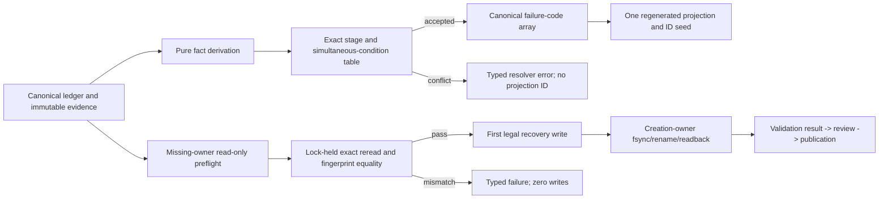

# W2 F1-F6 Repair Design v14

## Reader Map

This append-only v14 design closes three deterministic gaps in the existing
materializer-backed validation, review, and publication contract:

1. review and publication resolvers receive exact staged predicates,
   simultaneous-condition tables, conflict behavior, and canonical
   failure-code derivation so every accepted semantic state produces one
   deterministic projection seed;
2. missing-creation-owner recovery becomes a two-phase operation. Every
   owner-independent structural, pre-owner leaf-set, route, owner-tool, and
   frozen-source predicate passes twice before the first durable write; any
   mismatch produces zero writes; and
3. validation `CommandOutcome` restores the canonical route reference, exact
   argv array, and `argv_sha256` in both executed and not-run variants, while
   continuing to use the existing materializer, route record, ledger, and
   transaction.

Read in this order:

1. `Structure Contract`, `Request Clauses`, `Owner Surfaces`, and
   `Normative Incorporation Of v13` fix the replacement boundary.
2. `Abstract Design Frame` shows the one-way resolver and materializer flow.
3. `Common Resolver Determinism Contract`, `Review Resolver`, and
   `Publication Resolver` define exhaustive staged decisions.
4. `Missing-Owner Recovery Zero-Write Preflight` defines the pure inspection
   phase and the only legal transition to mutation.
5. `CommandOutcome v3` restores route/argv equality without another runner or
   ledger.
6. `Implementation Source Packet`, `Design Side-Effect Map`,
   `Dependency-Header Closure`, and `Design-to-Implementation Trace` bind the
   later implementation surface.
7. `Exact Acceptance Predicates` and `Public Typed Negative-Test Plan` are the
   fixed review oracle.

v14 supersedes only the v13 clauses explicitly identified below. v12 C1,
materializer ownership, deterministic artifact identity, creation-owner chain,
the three executable/module observations, stream unions, automatic review,
publication CAS, and every retained v13-v8 contract remain normative.

This artifact contains no identity for its own complete bytes, Git blob,
containing commit, tree, or size. Those identities are external readback
evidence.

## Structure Contract

```text
structure_kind=document
audience=independent detailed-design reviewer and later projection/materializer implementers
decision_context=whether simultaneous resolver facts, missing-owner recovery, and command route/argv evidence are deterministic and closed
first_artifact=mermaid staged-resolver-and-recovery flow
first_artifact_question=does every canonical input state select one projection or one typed conflict, and can missing-owner recovery reach its first write only after a complete read-only proof
visual_plan=mermaid flow plus exhaustive presence, simultaneous-condition, transition, and negative-oracle tables
source_to_structure_map=v13 review/publication precedence -> staged predicate and conflict tables; v13 missing-owner recovery -> zero-write double-read preflight; v11/v12 registered route argv plus v13 CommandOutcome v2 -> CommandOutcome v3
document_unit=owner W2 design author; reader independent reviewer/implementer; source map exact v13 packet plus retained route/materializer owner paths; validation canonical docs formatter/check and Git/hash readback; update cadence append-only review successor; canonical parent v13; downstream independent v14 review
document_split_decision=split:append-only v14 has an independent fixed-byte review identity while preserving the same owner unit
metric_or_delta_contract=two closed resolver state machines; one exact failure-code derivation per accepted state; one zero-write recovery preflight; one command outcome route/argv binding; zero new runners; zero new ledgers; zero v12 C1 regressions
ordered_structure=reader map; clauses/owners/predecessor; ADF; common resolver contract; review resolver; publication resolver; zero-write owner recovery; command outcome v3; source packet; side effects; dependency closure; trace; acceptance; negatives; validation honesty
invalid_interpretations=v14 is not source authorization, not permission to choose a resolver outcome by caller order, not a free-form failure list, not permission to repair a malformed root, not a new validation runner, not a new receipt ledger, not a compatibility selector, and not a hand-written pass artifact
validation_gate=independent fixed-byte v14 detailed-design review
```

Static source-truth anchors:

| Anchor | v13 source truth | Required relation | v14 closure |
| --- | --- | --- | --- |
| `V14-R1` | review/publication precedence names outcomes but does not map every simultaneous condition or exact failure array | `requires` deterministic resolver closure | staged predicates, exhaustive tables, conflict rows, and exact code filters |
| `V14-O1` | missing owner may be written after an incomplete subset of owner-independent checks | `requires` zero-write preflight | exact five-leaf pre-owner root, route/tool/source proof, double read, then mutation |
| `V14-C1` | CommandOutcome v2 omits the registered validation route and argv identity | `requires` execution-evidence closure | CommandOutcome v3 with route ref, argv, argv hash, equality, readback, and body hash |
| `PRESERVE` | v12 C1 and all retained v13 contracts | `constrains` all repairs | locator, materializer, artifact owner, observations, streams, review/publication, CAS, lineage, D2/D3/F1/F2, and non-self-reference remain |

No dynamic prose graph is generated. The Mermaid and exact tables are the
static structure selected for this design-only task.

## Request Clauses

| Clause | Required closure |
| --- | --- |
| `V14-R1` | Define mutually exclusive staged resolver predicates or exact precedence/conflict tables for every simultaneous review and publication condition. Derive failure codes in exact order and add public simultaneous-condition negatives so one accepted state has one projection seed. |
| `V14-O1` | Before any missing-owner recovery write, require every owner-independent structural, exact pre-owner leaf-set, route, owner-tool, and frozen-source predicate to pass. Every mismatch returns typed failure with zero durable writes. |
| `V14-C1` | Restore route/argv binding, including `argv_sha256`, for both command outcome variants. Define executed/not-run semantics, equality, readback, body hashing, and typed mismatch negatives without another runner or ledger. |
| `PRESERVE` | Preserve v12 C1, v13 projection/null schemas, materializer ownership, deterministic artifact path, creation-owner chain, VersionOutcome v2, the legal version-to-command transition table, and all retained contracts. |
| `BOUNDARY` | Change only v14 design and fixed-byte request artifacts. Source, tests, owner documents, hooks, Python, CI, dynamic graph, validation execution, review dispatch, and publication remain blocked. |

## Owner Surfaces

| Responsibility | Canonical owner | Replaceable unit | Consumer |
| --- | --- | --- | --- |
| projection schema and resolver rules | `agents/COMMUNICATION_PROTOCOL.md` | generated resolver contract | validation/review/publication consumers |
| validation result and artifact checks | `tools/agent_tools/report_artifact_checks.py` | validation projection resolver | review resolver |
| review eligibility and dispatch state | retained future `tools/agent_tools/review_dispatch.py` | review projection resolver | publication resolver |
| publication eligibility and CAS ingress | retained future `tools/agent_tools/publication_integrator.py` | publication projection resolver | local/remote publication authority |
| registered validation route | `documents/runtime-profiles-and-check-matrix.json` and retained generated reader | route record v2 | materializer |
| result attempt, stable lock, artifact bytes, and command outcomes | `tools/agent_tools/work_log.py` | canonical result materializer | artifact checker |
| canonical run locator | `tools/agent_tools/task_authority.py` | workspace-only locator | every materializer/resolver |
| monitor and closeout ingress | `workflow_monitor.py`, `task_close.py` | no-path public consumers | regenerated projections |
| publication consumer | `github_publish.py` | publication-authority consumer | Git ref CAS |

Durable owner surfaces never depend upstream on this run-local v14 report.

## Normative Incorporation Of v13

The exact predecessor packet is:

```text
predecessor_commit=15fbe1c6084c7f837ba87ff410ade5b8834c76be
predecessor_tree=2d324f2cfebc7983df0c8bbf07ca44594eb383a0
predecessor_parent=47a4bb0516d7d320511c4671970a8b23cef0211f
predecessor_design_path=reports/agents/convergence-w2-gates-completion-20260716/w2_f1_f6_repair_design_v13.md
predecessor_design_size_bytes=58192
predecessor_design_sha256=3ddb21cff86dc947bebedf8e5b35bd9f799ebd6fa4d100e0637a3299fc2cb9b8
predecessor_design_git_blob=ab14becc1d546f661d8c1b4f2e95ac9aef493f39
predecessor_request_path=reports/agents/convergence-w2-gates-completion-20260716/w2_detailed_design_recheck_request_v13.md
predecessor_request_size_bytes=11897
predecessor_request_sha256=e6d637271e2dfeef60e793b0b4ce8a300de85c5e538aed6566f578f1f5ad0439
predecessor_request_git_blob=8b4350038f02f2d2f8a6e2f980455659eba77816
```

v14 supersedes exactly:

1. v13 review resolution order after the validation-result step;
2. v13 publication resolution order after the review-eligibility step;
3. any review/publication failure-code array that is non-exhaustive,
   free-form, caller-ordered, or ambiguous under simultaneous facts;
4. any accepted resolver state not covered by the v14 tables;
5. v13 missing-owner recovery permission based on steps 1-6 alone;
6. any missing-owner recovery path that creates, truncates, unlinks, renames,
   fsyncs, appends, settles, or updates a pointer before the v14 pure preflight
   passes twice;
7. `agent-canon.validation-command-outcome.v2`; and
8. any command outcome that omits or disagrees with the registered route
   reference, exact argv, or `argv_sha256`.

v14 retains:

- the v13 `ProjectionResolution v1`, `NoProjection v1`, and all three
  projection v2 key/null schemas and ID seed framing;
- v13 canonical nullable encoding and exact `validation_result_id`;
- v13 creation-owner chain, stable lock body, six-leaf complete root, terminal
  external binding, and non-self-reference;
- v13 `VersionOutcome v2`, termination union, `version_failure_ref`, and the
  three legal version-to-command rows;
- v12 `CanonicalRunLocator v1`, fixed `.active_run` and baseline, no public
  path/route/artifact overrides, and workspace-only APIs;
- v12 deterministic artifact ID/root/attempt-lock derivation;
- v11/v12 registered route v2, exact RFC 8785 argv-array hash, cwd,
  environment, candidate, executable identity, and owner source;
- exactly three executable/module-origin observations and all stream
  EOF/completeness states;
- one materializer, one canonical ledger L, one current attempt,
  begin/settle CAS, retained O_EXCL crash recovery, and immutable history;
- automatic independent review, same-context lineage, explicit APPROVE,
  publication authority, expected-old-OID CAS, dirty-checkout preservation,
  and exact-candidate publication; and
- all D2/D3/F1/F2, per-member correspondence, group equality, topology/freeze,
  five formatter states, dependency closure, and public negative oracles not
  replaced here.

## Abstract Design Frame

```text
unit=DeterministicProjectionResolverAndMaterializerArtifactContract
state authority=canonical run locator + L + immutable artifact bytes + registered route v2
projection authority=pure regenerated v2 projection selected by exact staged predicates
failure authority=closed canonical failure-code derivation, never caller order or free text
recovery authority=existing materializer under stable existing attempt lock after a double-read zero-write preflight
command authority=VersionOutcome v2 followed by CommandOutcome v3 bound to the same registered route and argv
forbidden ambiguity=multiple outcomes for one predicate vector; discarded simultaneous failures; writes before recovery proof; foreign route/argv; omitted argv in not-run; new runner or ledger
replacement boundary=resolver predicate definitions, conflict/precedence tables, failure arrays, missing-owner write permit, CommandOutcome schema/readback/body hash, typed failures, and public oracles
```

The first diagram answers where deterministic selection and the first legal
recovery write occur:



Every arrow is one-way. No projection, preflight observation, or
CommandOutcome hashes a future object.

## Common Resolver Determinism Contract

### Resolver input authority

Each resolver accepts only the workspace root through the retained public API.
It derives the canonical run locator, current aggregate/revision/intent,
candidate, and immediate upstream projection from L and immutable artifacts.
The caller cannot supply:

- an outcome;
- a failure code;
- a predicate boolean;
- a review frame, approval, authority, source, candidate, or target;
- a route ID, report path, artifact path, or projection path; or
- precedence order.

The resolver first validates schema, object identity, owner chain, canonical
selection, and body hashes. Malformed, contradictory, foreign, duplicate, or
unreadable evidence returns a typed resolver error and no projection ID. It is
never classified as no-projection or as a negative projection.

### Staged predicate algebra

An internal predicate is exactly one of:

```text
true
false
not_evaluated
```

`not_evaluated` is assigned only by the stage tables below. It is not accepted
from a caller or stored as authority. A later-stage fact cannot alter the
outcome or failure list of an earlier stopping stage.

Every accepted stage produces:

1. one exact outcome;
2. the exact v13 null shape for that outcome;
3. one ordered `failure_codes` array derived by the table;
4. one v13 projection ID seed containing the SHA256 of that exact array; and
5. one body hash that omits only its body-hash field.

Conflict rows produce one typed error, no projection object, no projection ID,
and no stored success/failure view.

### Failure-code construction

Failure codes are an ordered array, not a set:

```text
derive_failure_codes(order, predicates) =
  every code in order whose associated predicate is true,
  preserving order, without duplicates
```

No additional code, message, reason text, or caller-provided ordering is
permitted. An eligible projection has the exact empty array.

For every accepted state, resolver readback regenerates predicates, outcome,
null shape, failure array, projection ID, and body hash from canonical
evidence. Any difference is:

- `projection_resolution:predicate_readback_mismatch`;
- `projection_resolution:failure_code_derivation_mismatch`; or
- the projection-specific `id_seed_mismatch`/`body_hash_mismatch`.

The same accepted canonical state regenerates the same seed. Every distinct
accepted simultaneous-condition row below changes at least one non-null
identity or one ordered failure code before hashing. Conflict rows have no ID.

## Review Resolver

### Immediate-subject stage

The immediate subject is the current `ValidationResultProjection v2`.

| Validation-result state | Review behavior |
| --- | --- |
| subject absent under the exact v13 no-projection rule | return review `NoProjection v1` |
| malformed, foreign, duplicate, stale-selected, or hash-invalid subject | typed resolver error; no projection |
| current outcome is not `pass` | return `validation_not_pass`; all review-context fields null; later review predicates `not_evaluated` |
| current outcome is `pass` | continue to review-context presence |

For `validation_not_pass`, `failure_codes` is exactly:

```json
["review_eligibility:validation_result_not_pass"]
```

### Review-context presence and conflicts

Presence bits are:

- `L`: one current valid review-lineage identity exists;
- `F`: one current valid frame bound to that lineage/candidate/revision exists;
- `R`: one current valid reviewer assignment bound to that frame exists.

`present` means schema, unique selection, identity, owner, body hash, candidate,
revision, and intent equality all pass. A present-but-invalid object is
malformed evidence, not an absent bit.

| L | F | R | Resolution |
| --- | --- | --- | --- |
| 0 | 0 | 0 | `review_context_missing` |
| 0 | 0 | 1 | conflict `review_eligibility:context_dependency_conflict` |
| 0 | 1 | 0 | conflict `review_eligibility:context_dependency_conflict` |
| 0 | 1 | 1 | conflict `review_eligibility:context_dependency_conflict` |
| 1 | 0 | 0 | `review_context_missing` |
| 1 | 0 | 1 | conflict `review_eligibility:context_dependency_conflict` |
| 1 | 1 | 0 | `review_context_missing` |
| 1 | 1 | 1 | continue to complete-context simultaneous conditions |

For a legal missing-context row, the emitted lineage, frame, and reviewer
fields are all null exactly as v13 requires. Failure codes are the following
fixed-order filter:

- `review_eligibility:review_context_missing` is always first.
- `review_eligibility:review_lineage_missing` follows when `L` is zero.
- `review_eligibility:review_frame_missing` follows when `F` is zero.
- `review_eligibility:reviewer_assignment_missing` follows when `R` is zero.

Therefore the three legal arrays are exactly:

| L/F/R | Failure codes |
| --- | --- |
| `0/0/0` | context-missing, lineage-missing, frame-missing, reviewer-assignment-missing |
| `1/0/0` | context-missing, frame-missing, reviewer-assignment-missing |
| `1/1/0` | context-missing, reviewer-assignment-missing |

Each table cell abbreviates the full `review_eligibility:` prefix shown above.

### Complete-context facts

For `L/F/R = 1/1/1`, the resolver derives:

- `NI`: reviewer independence fails. This is true if the assigned reviewer
  runtime identity equals the writer, equals the validation producer, or the
  assigned role is not the retained independent-review role;
- `DB`: the current canonical dispatch state is one of the retained closed
  blocked, failed, or stalled terminal states; and
- `ST`: the selected lineage/frame/assignment is well formed but a newer
  canonical aggregate revision, intent revision, candidate revision, or
  current-lineage pointer exists.

The exact review outcome precedence is:

```text
stale > reviewer_not_independent > dispatch_blocked > eligible
```

Precedence chooses the outcome only. It does not discard simultaneous failure
facts.

### Complete-context simultaneous-condition table

| NI | DB | ST | Outcome | Ordered failure codes |
| --- | --- | --- | --- | --- |
| 0 | 0 | 0 | `eligible` | empty |
| 0 | 0 | 1 | `stale` | stale |
| 0 | 1 | 0 | `dispatch_blocked` | dispatch-blocked |
| 0 | 1 | 1 | `stale` | dispatch-blocked, stale |
| 1 | 0 | 0 | `reviewer_not_independent` | reviewer-not-independent |
| 1 | 0 | 1 | `stale` | reviewer-not-independent, stale |
| 1 | 1 | 0 | `reviewer_not_independent` | reviewer-not-independent, dispatch-blocked |
| 1 | 1 | 1 | `stale` | reviewer-not-independent, dispatch-blocked, stale |

The full fixed-order filter is:

- `review_eligibility:reviewer_not_independent` when `NI` is one.
- `review_eligibility:dispatch_blocked` when `DB` is one.
- `review_eligibility:stale` when `ST` is one.

The reviewer object and frame/lineage refs remain non-null for all eight rows.
The v13 review ID formula remains unchanged and hashes this exact
`failure_codes` array. An unmapped vector is:

`review_eligibility:simultaneous_state_unmapped`.

## Publication Resolver

### Immediate-subject stage

The immediate subject is the current `ReviewEligibilityProjection v2`.

| Review state | Publication behavior |
| --- | --- |
| subject absent under the exact v13 no-projection rule | return publication `NoProjection v1` |
| malformed, foreign, duplicate, stale-selected, or hash-invalid subject | typed resolver error; no projection |
| current outcome is not `eligible`, and no current-bound downstream evidence exists | return `review_not_eligible`; all publication fields null |
| current outcome is not `eligible`, but current-bound approval/authority/target evidence exists | conflict `publication_eligibility:downstream_evidence_without_eligible_review` |
| current outcome is `eligible` | continue to publication-evidence presence |

For `review_not_eligible`, `failure_codes` is exactly:

```json
["publication_eligibility:review_not_eligible"]
```

Evidence bound to an older or foreign review ref is not a normal current-bound
presence bit. If canonical selection attempts to select it, the resolver
returns `publication_eligibility:foreign_downstream_binding`.

### Publication-evidence presence and conflicts

Presence bits are:

- `A`: one exact current APPROVE plus required external projection
  acknowledgement exists;
- `U`: one exact post-APPROVE publication authority bound to `A` exists; and
- `T`: source, candidate, and intended target are all present, individually
  valid, and mutually equal to `U`.

Partial source/candidate/target presence is always:

`publication_eligibility:partial_publication_tuple`.

For complete tuple presence, the exact table is:

| A | U | T | Resolution |
| --- | --- | --- | --- |
| 0 | 0 | 0 | `approval_missing` |
| 0 | 0 | 1 | conflict `publication_eligibility:tuple_without_authority` |
| 0 | 1 | 0 | conflict `publication_eligibility:authority_without_approval` |
| 0 | 1 | 1 | conflict `publication_eligibility:authority_without_approval` |
| 1 | 0 | 0 | `authority_missing` |
| 1 | 0 | 1 | conflict `publication_eligibility:tuple_without_authority` |
| 1 | 1 | 0 | conflict `publication_eligibility:tuple_missing_after_authority` |
| 1 | 1 | 1 | continue to target/staleness simultaneous conditions |

Normal stopping-stage failure arrays are exact:

```text
approval_missing  -> ["publication_eligibility:approval_missing"]
authority_missing -> ["publication_eligibility:authority_missing"]
```

The `A/U/T` presence bits are all observed so dependency conflicts cannot be
hidden by precedence. At `approval_missing` and `authority_missing`, only
target readiness and staleness are `not_evaluated`.

### Complete publication-chain facts

For `A/U/T = 1/1/1`, derive:

- `NR`: target is not ready under the retained branch/main/PR target,
  expected-old-OID, ancestry, checked-out-target, and route-closure
  predicates; and
- `ST`: approval, authority, source, candidate, or target is well formed but
  superseded by newer canonical evidence or a moved frozen target identity.

The exact publication outcome precedence is:

```text
stale > target_not_ready > eligible
```

### Complete-chain simultaneous-condition table

| NR | ST | Outcome | Ordered failure codes |
| --- | --- | --- | --- |
| 0 | 0 | `eligible` | empty |
| 0 | 1 | `stale` | stale |
| 1 | 0 | `target_not_ready` | target-not-ready |
| 1 | 1 | `stale` | target-not-ready, stale |

The full fixed-order filter is:

- `publication_eligibility:target_not_ready` when `NR` is one.
- `publication_eligibility:stale` when `ST` is one.

Approval, authority, source, candidate, and target remain non-null for all four
rows. The v13 publication ID formula remains unchanged and hashes this exact
array. An unmapped vector is:

`publication_eligibility:simultaneous_state_unmapped`.

### Resolver uniqueness and readback

Review and publication projection publication is legal only after:

1. regenerating the immediate upstream projection;
2. deriving every stage bit from canonical evidence;
3. selecting one table row;
4. deriving the exact failure array by the fixed filter;
5. constructing the exact v13 null shape;
6. computing the v13 ID seed and body hash;
7. rereading canonical pointers and immutable refs; and
8. recomputing steps 1-6 byte-for-byte.

If the reread changes stage, bits, row, failure order, IDs, or body, the
resolver returns its typed readback failure and emits no projection.

Public resolver tests cover:

- every legal context-presence row;
- every context dependency conflict;
- all eight complete review-condition rows;
- review-noneligible with and without forbidden downstream evidence;
- all eight publication presence rows;
- partial source/candidate/target presence;
- all four complete publication-condition rows; and
- failure-array deletion, insertion, duplication, and reordering.

## Missing-Owner Recovery Zero-Write Preflight

### Scope and first-write boundary

This section applies only when:

- the deterministic artifact root exists;
- `creation_owner.json` is absent;
- no terminal validation event or settlement has completed the attempt; and
- recovery is requested through the existing `work_log.py` materializer.

The recovery operation has exactly two phases:

```text
phase 1 = inspect_only
phase 2 = mutation_permitted
```

Before `mutation_permitted`, the process may open evidence read-only, open the
existing stable lock without `O_CREAT` or truncation, `lstat`, read, hash,
enumerate, acquire that lock, and compute in-memory values. Opening the lock
does not authorize a byte or namespace write. It must not:

- create or truncate a file;
- write a byte or change a mode/owner/timestamp intentionally;
- create, delete, unlink, rename, or quarantine a temp;
- fsync a newly written file or directory;
- append a ledger event or transaction;
- settle an attempt;
- update a current pointer; or
- emit a hand-written recovery/pass artifact.

Every preflight mismatch returns typed failure before phase 2. The materializer
root, stable lock bytes, temp namespace, L, aggregate, pending event, and
current pointers remain byte-for-byte unchanged.

### Exact pre-owner canonical leaf set

The authoritative canonical leaf-name set before owner creation is exactly the
UTF-8 byte-sorted tuple:

```text
result_manifest.json
validation.stderr
validation.stdout
version.stderr
version.stdout
```

Required structural predicates are:

1. the artifact root is the deterministic directory derived from the current
   locator, logical key, attempt, and pending event;
2. all five names exist exactly once as regular files;
3. `creation_owner.json` is absent;
4. no symlink, hardlink with link count other than one, nested directory,
   device, socket, FIFO, alternate spelling, Unicode-normalized alias, or
   additional authoritative leaf exists;
5. each file resides on the expected artifact-root filesystem and is owned by
   the retained materializer owner identity;
6. complete reads return exact sizes, complete-file SHA256 values, Git blob
   identities, and stream EOF/completeness states recorded by the manifest;
7. the manifest's leaf list is exactly this tuple in this order; and
8. no summary, receipt, `latest`, compatibility leaf, or caller-selected path
   is accepted.

The retained deterministic O_EXCL transaction temp namespace is classified
separately from the canonical leaf set. It contains either no candidate or one
safe exact candidate for this owner-record transaction. Multiple names,
unexpected basename, live writer, symlink/nonregular/hardlinked node,
incomplete bytes, corrupt bytes, foreign transaction, or stale base is a typed
preflight failure. A non-matching or live temp is preserved and never deleted.

### Owner-independent canonical predicates

All of the following pass before any recovery write:

| Group | Exact predicates |
| --- | --- |
| locator and attempt | canonical run locator ID/hash; logical-key hash; contiguous attempt ordinal; current aggregate/revision/intent; begin transaction ID/hash; pending event ID/hash; pending status; current-attempt pointer |
| artifact derivation | v12 artifact seed bytes, digest, artifact ID, run-relative root, repo-relative root, and stable attempt-lock path recompute exactly |
| existing stable lock | lock file already exists; open uses no create/truncate; exclusive lock is acquired; lock ID/body hash/file SHA/blob/path equal locator/begin/pending/artifact/tool identities |
| root structure | exact five canonical leaves and separately valid zero-or-one retained temp classification |
| manifest and raw bytes | manifest schema/body hash/file identity; five leaf names/order; every size/SHA/blob; stream order/state/EOF; version and command object syntax; no creation-owner/future reference |
| registered route | route v2 is uniquely selected from the active profile; route ID/body hash, candidate, logical key, attempt, pending ref, cwd, environment, version policy, command argv, and argv hash equal manifest/current attempt |
| owner tool | owner path is exactly `tools/agent_tools/work_log.py`; owner commit/tree/blob equal lock, manifest, route definition owner, and frozen implementation source |
| frozen source | candidate/source commit and tree, owner-tool blob, profile/catalog/wrapper blobs, and route source tuple equal the immutable source-freeze packet |
| completion absence | no current terminal validation event, settlement transaction, successor aggregate, or current pointer claims completion; any older evidence is not selected as current |
| non-self-reference | no manifest, lock, route, or temp body requires the future creation-owner complete-file identity, terminal event, settlement, projection, or containing commit/tree |

`missing` means absent at the canonical path. A present but malformed object
fails its group; it is not treated as missing and is not repaired.

### In-memory preflight fingerprint

The materializer computes, but does not persist, this fingerprint:

```text
agent-canon.missing-owner-recovery-preflight.v1\0
encode_utf8("run-locator-ref-sha256", SHA256(canonical locator ref))
encode_utf8("logical-key-sha256", <logical-key hash>)
encode_u64("attempt-ordinal", <attempt>)
encode_utf8("begin-transaction-ref-sha256", SHA256(canonical begin ref))
encode_utf8("pending-event-ref-sha256", SHA256(canonical pending ref))
encode_utf8("artifact-id", <artifact ID>)
encode_utf8("artifact-root", <repo-relative root>)
encode_utf8("attempt-lock-ref-sha256", SHA256(canonical lock ref))
encode_utf8("directory-entry-vector-sha256", SHA256(canonical lstat entry vector))
encode_utf8("five-leaf-identity-vector-sha256", SHA256(canonical ordered leaf identities))
encode_utf8("manifest-ref-sha256", SHA256(canonical manifest ref))
encode_utf8("route-ref-sha256", SHA256(canonical route ref))
encode_utf8("route-argv-sha256", <registered command argv hash>)
encode_utf8("owner-tool-ref-sha256", SHA256(canonical owner-tool ref))
encode_utf8("frozen-source-ref-sha256", SHA256(canonical frozen-source ref))
encode_utf8("completion-absence-sha256", SHA256(canonical absence observation))
encode_utf8("temp-classification-sha256", SHA256(canonical retained temp classification))
end\0
```

The lstat entry vector contains, in UTF-8 byte order, each canonical name,
node kind, device, inode, link count, UID, size, and filesystem mode. The leaf
identity vector contains path, size, SHA256, Git blob, and stream state where
applicable. Canonical refs use RFC 8785 JSON before SHA256.

This fingerprint is an ephemeral comparison value, not a ledger, receipt,
artifact leaf, projection field, or publication authority.

### Double-read and transition to mutation

While holding the same stable exclusive lock:

1. run the full inspect-only preflight and compute fingerprint `Q1`;
2. do not write;
3. immediately rerun every predicate and compute `Q2`;
4. require `Q2 == Q1` and exact equality of every decoded predicate;
5. only then enter `mutation_permitted`;
6. construct the deterministic creation-owner bytes from the proven chain,
   using the pending event's canonical `timestamp_utc` as
   `created_at_utc` rather than retry wall-clock time;
7. use the retained safe O_EXCL temp classification/create-or-reuse protocol;
8. fsync and reread the exact temp;
9. immediately reread the pre-owner base and require the same fingerprint
   components except the permitted exact temp state;
10. atomically rename the exact temp to `creation_owner.json`;
11. fsync the artifact directory;
12. reread the six-leaf root, creation owner, manifest, lock, route, tool,
    frozen source, and owner-chain equality; and
13. only then continue to terminal event and settlement.

If `Q1 != Q2`, or the pre-rename reread differs, return
`validation_creation_owner_recovery:preflight_changed`. No owner file, ledger
event, settlement, or pointer write occurs. An already existing exact temp is
preserved when a mismatch blocks rename.

### Stable zero-write preflight failures

- `validation_creation_owner_recovery:locator_mismatch`
- `validation_creation_owner_recovery:attempt_mismatch`
- `validation_creation_owner_recovery:begin_transaction_mismatch`
- `validation_creation_owner_recovery:pending_event_mismatch`
- `validation_creation_owner_recovery:artifact_derivation_mismatch`
- `validation_creation_owner_recovery:attempt_lock_missing`
- `validation_creation_owner_recovery:attempt_lock_live`
- `validation_creation_owner_recovery:attempt_lock_mismatch`
- `validation_creation_owner_recovery:pre_owner_leaf_set_mismatch`
- `validation_creation_owner_recovery:unsafe_leaf`
- `validation_creation_owner_recovery:leaf_identity_mismatch`
- `validation_creation_owner_recovery:manifest_mismatch`
- `validation_creation_owner_recovery:route_missing`
- `validation_creation_owner_recovery:route_mismatch`
- `validation_creation_owner_recovery:route_argv_mismatch`
- `validation_creation_owner_recovery:owner_tool_mismatch`
- `validation_creation_owner_recovery:frozen_source_mismatch`
- `validation_creation_owner_recovery:completion_evidence_conflict`
- `validation_creation_owner_recovery:temp_namespace_conflict`
- `validation_creation_owner_recovery:temp_candidate_mismatch`
- `validation_creation_owner_recovery:non_self_reference_violation`
- `validation_creation_owner_recovery:preflight_changed`
- `validation_creation_owner_recovery:write_before_preflight_forbidden`

Every public negative snapshots the root, lock, temp namespace, L, aggregate,
pending event, and current pointers before invocation and proves identical
post-failure bytes and identities.

## `CommandOutcome v3`

### Exact key-compatible schema

`agent-canon.validation-command-outcome.v3` replaces v2. Both variants have
exactly this key set:

```json
{
  "schema": "agent-canon.validation-command-outcome.v3",
  "schema_version": 3,
  "kind": "executed",
  "route_record_ref": {
    "route_record_id": "<current registered route v2 ID>",
    "route_record_body_sha256": "<current route v2 body hash>"
  },
  "argv": [
    "<exact route command argv element>"
  ],
  "argv_sha256": "<SHA256 of RFC 8785 canonical argv array>",
  "version_outcome_ref": {
    "version_outcome_id": "<version outcome ID>",
    "version_outcome_body_sha256": "<version outcome hash>",
    "kind": "captured"
  },
  "identity_observation_before_ref": {
    "observation_id": "<observation 2 ID>",
    "observation_body_sha256": "<observation 2 hash>"
  },
  "identity_observation_after_ref": {
    "observation_id": "<observation 3 ID>",
    "observation_body_sha256": "<observation 3 hash>"
  },
  "termination": {
    "kind": "exited",
    "exit_code": 0,
    "signal": null,
    "spawn_error": null
  },
  "version_failure_ref": null,
  "streams": [
    "<validation stdout stream>",
    "<validation stderr stream>"
  ],
  "combined_output_sha256": "<retained framed-output hash>",
  "complete": true,
  "command_outcome_body_sha256": "<64 lowercase SHA256>"
}
```

No key is omitted or added for
`not_run_due_to_version_failure`.

### Exact route and argv binding

The route is derived from the canonical current attempt and active profile. A
caller cannot select it.

Required equality is:

```text
command_outcome.route_record_ref
  == manifest.route_record_ref
  == pending/current-attempt selected route ref
  == canonical RegisteredValidationRouteRecord v2 ID/body hash

command_outcome.argv
  == canonical route.command.argv
  element-for-element, count-for-count, and UTF-8-byte-for-byte

command_outcome.argv_sha256
  == canonical route.command.argv_sha256
  == SHA256(RFC 8785 canonical JSON bytes of command_outcome.argv)
```

Every argv element is a non-empty UTF-8 string without NUL. No shell command
string, token re-splitting, environment interpolation, glob expansion,
argument reordering, omitted root, quick-mode substitution, or caller-provided
argv is legal.

### Variant semantics

| Command kind | Version kind | Route/argv/hash | Spawn semantics | Termination | Version failure ref | Streams | Complete |
| --- | --- | --- | --- | --- | --- | --- | --- |
| `executed` | captured or unsupported | all non-null and exactly route-equal | existing materializer invokes the exact argv array once | non-null exited/signaled/spawn-failed | null | exact validation stdout then stderr records | true only when both EOF-complete |
| `not_run_due_to_version_failure` | failed | all non-null and exactly route-equal as intended command identity | validation command is not spawned | null | non-null exact v13 failure ref | both not-created | false |

The not-run route/argv fields do not claim execution. They identify the exact
registered validation command whose launch was prevented by the failed version
outcome. Omitting them, replacing them with null, or substituting version argv
is forbidden.

For executed, the existing materializer compares the argv array passed to its
existing process-launch boundary with the route array before launch and
records the same `argv_sha256` after launch return. A spawn failure remains
`kind=executed` with `termination.kind=spawn_failed`.

For not-run, the materializer records no process launch and no termination.
Any launch observation, process ID, created validation stream, non-null
termination, or execution-success claim is:

`validation_command:not_run_spawn_claim_forbidden`.

### Readback and body hashing

Before validation-result projection, the checker:

1. rereads the canonical route v2;
2. verifies route ID/body hash, candidate, logical key, attempt, pending ref,
   cwd, environment, owner source, and frozen source;
3. verifies manifest and command outcome route refs equal that route;
4. recomputes argv byte equality and RFC 8785 `argv_sha256`;
5. validates the exact executed/not-run row;
6. verifies observations 2-to-3, streams, combined output, completeness,
   termination, and version-failure ref;
7. recomputes `command_outcome_body_sha256`; and
8. rereads the route/current attempt immediately before accepting the result.

`command_outcome_body_sha256` is SHA256 over RFC 8785 canonical JSON bytes of
the complete v3 object with only `command_outcome_body_sha256` omitted. It
therefore covers `route_record_ref`, `argv`, `argv_sha256`, and every retained
v13 command field.

The terminal validation event and result manifest reference the command
outcome body hash already produced by the existing materializer transaction.
No new command-outcome ledger, runner, receipt, compatibility reader, or
test-only API is introduced.

### Legal version-to-command transitions

The v13 table remains exact:

| Version outcome | Command outcome | Legal |
| --- | --- | --- |
| `captured` | `executed` | yes |
| `unsupported` | `executed` | yes |
| `failed` | `not_run_due_to_version_failure` | yes |
| `captured` | `not_run_due_to_version_failure` | no |
| `unsupported` | `not_run_due_to_version_failure` | no |
| `failed` | `executed` | no |

### Stable command-binding failures

- `validation_command:compatibility_schema_forbidden`
- `validation_command:route_record_ref_missing`
- `validation_command:route_record_ref_mismatch`
- `validation_command:route_record_body_hash_mismatch`
- `validation_command:argv_missing`
- `validation_command:argv_mismatch`
- `validation_command:argv_sha256_mismatch`
- `validation_command:executed_spawn_argv_mismatch`
- `validation_command:not_run_spawn_claim_forbidden`
- `validation_command:route_readback_mismatch`
- `validation_command:body_hash_mismatch`

All retained v13 command null/ref/stream/transition failures remain.

## Materializer Transaction And Projection Readback

The retained transaction order changes only at these points:

1. route v2 and exact command argv/hash are selected before begin CAS and bound
   to the pending attempt;
2. VersionOutcome v2 is written through the existing materializer;
3. CommandOutcome v3 always writes route ref, argv, and argv hash;
4. missing-owner recovery cannot write until the v14 double-read preflight
   passes;
5. creation-owner, terminal event, settlement, and successor aggregate retain
   the v13 one-way order;
6. validation result rejects CommandOutcome v2 and regenerates from v3;
7. review/publication resolvers use the v14 staged tables and exact failure
   arrays; and
8. publisher regenerates publication eligibility and rereads target authority
   immediately before retained expected-old-OID CAS.

Stored outcomes remain projection-only. No stored success value, failure list,
or caller-selected outcome becomes authority.

## Implementation Source Packet

### Fixed predecessor

```text
repository=/mnt/l/workspace/agent-canon-convergence-w2-final-writer-owned
branch=codex/convergence-w2-final-gates-completion
design_predecessor_commit=15fbe1c6084c7f837ba87ff410ade5b8834c76be
design_predecessor_tree=2d324f2cfebc7983df0c8bbf07ca44594eb383a0
design_predecessor_parent=47a4bb0516d7d320511c4671970a8b23cef0211f
review_input_kind=explicit user v14 deterministic closure
durable_review_decision_artifact=not_supplied
implementation_authorization=blocked
```

The exact v13 artifact identities are the predecessor packet above. v13
normatively retains the v12 C1/source packet and implementation base ancestry.

Selected unchanged owner evidence:

| Path | Responsibility | Git blob at predecessor |
| --- | --- | --- |
| `agents/COMMUNICATION_PROTOCOL.md` | projection/outcome/context schema owner | `74b04f3cd6ca274eb2ef36f558a2b33859613379` |
| `agents/canonical/ARTIFACT_PLACEMENT.md` | run-local artifact placement | `5a51fba8b84604a27fc22e650c2fa1059b110a7b` |
| `agents/skills/result-artifact-writeout.md` | raw/manifest artifact contract | `ffc7e73552653e71d793933582145805898083e8` |
| `documents/runtime-profiles-and-check-matrix.json` | registered route/profile authority | retained predecessor object |
| `tools/agent_tools/task_authority.py` | canonical run locator | `294a5074e572f460a22e3ac726b4f17db25d1982` |
| `tools/agent_tools/work_log.py` | begin/settle/lock/artifact/command owner | `16324873f42c409b4181f2e5897e8d423133cb1d` |
| `tools/agent_tools/workflow_monitor.py` | no-path materializer ingress | `da00ebc90f89839f7c1a11f4fb734175c63cfbfb` |
| `tools/agent_tools/report_artifact_checks.py` | validation and artifact resolver | `4fd4802ab7d4b1698b9ed7bcaf5f9b5dcb92e6e9` |
| `tools/agent_tools/task_close.py` | full projection-chain closeout | `53b5d0cabdc1623516ad95d719210f34ce37d7b9` |
| `tools/agent_tools/github_publish.py` | publication consumer | `28238720838e645cadf342612cf81f6810426634` |

The runtime-profile JSON blob is materialized mechanically during later source
freeze; this design does not hand-transcribe an unknown object identity.
Source implementation remains pending and unauthorized.

## Design Side-Effect Map

| Later surface | Required change | Clause | Oracle |
| --- | --- | --- | --- |
| `COMMUNICATION_PROTOCOL.md` | replace loose resolver order with staged predicates, exact conflict tables, and failure-code filters; register CommandOutcome v3 | V14-R1/C1 | schema review |
| runtime profile JSON and generated reader | retain one route v2 and expose exact command argv/hash authority | V14-C1 | profile consistency |
| `work_log.py` | enforce zero-write owner preflight; write CommandOutcome v3 through existing transaction | V14-O1/C1 | materializer public tests |
| `workflow_monitor.py` | forward regenerated resolver result without outcome/failure/path override | V14-R1 | monitor tests |
| `report_artifact_checks.py` | regenerate tables, failure arrays, owner preflight proof, route/argv/body equality | all | checker public tests |
| future `review_dispatch.py` | implement exact review stage/context/simultaneous tables | V14-R1 | review resolver tests |
| future `publication_integrator.py` | implement exact downstream-presence and target/stale tables | V14-R1 | publication resolver tests |
| `github_publish.py` | accept only reread eligible publication projection; no direct condition selection | V14-R1 | publish helper tests |
| `task_close.py` | require v14 resolver readback, six-leaf owner equality, and CommandOutcome v3 | all | closeout tests |
| `tests/agent_tools/test_work_log.py` | zero-write snapshots and command route/argv variants | V14-O1/C1 | public negative rows |
| `tests/agent_tools/test_workflow_monitor.py` | no caller predicate/outcome/failure override | V14-R1 | monitor public API |
| `tests/agent_tools/test_task_start_and_close.py` | resolver conflict/readback and closeout rejection | all | closeout negatives |
| `tests/agent_tools/test_github_publish.py` | simultaneous publication states and stale/target precedence | V14-R1 | publication negatives |
| docs/templates/headers | replace v13 loose precedence/CommandOutcome v2 wording and retain reciprocal edges | all | convention consistency |

No source path is edited in this design commit.

## Dependency-Header Closure

Retain every reciprocal v13/v12 pair. Later implementation updates the
existing pairs rather than adding a second owner:

| Forward owner edge | Reciprocal consumer edge |
| --- | --- |
| runtime profile JSON: downstream implementation `../tools/agent_tools/work_log.py` owns route v2 command selection | `work_log.py`: upstream design `../../documents/runtime-profiles-and-check-matrix.json` owns registered route/argv |
| `COMMUNICATION_PROTOCOL.md`: downstream implementation `../tools/agent_tools/report_artifact_checks.py` owns projection schemas/tables | `report_artifact_checks.py`: upstream design `../../agents/COMMUNICATION_PROTOCOL.md` owns resolver contract |
| `work_log.py`: downstream implementation `./report_artifact_checks.py` verifies materializer root and CommandOutcome v3 | `report_artifact_checks.py`: upstream implementation `./work_log.py` owns artifact/outcome bytes |
| `report_artifact_checks.py`: downstream implementation future `./review_dispatch.py` supplies validation projection | future `review_dispatch.py`: upstream implementation `./report_artifact_checks.py` owns validation resolution |
| future `review_dispatch.py`: downstream implementation future `./publication_integrator.py` supplies review projection | future `publication_integrator.py`: upstream implementation `./review_dispatch.py` owns review resolution |
| future `publication_integrator.py`: downstream implementation `./github_publish.py` supplies publication projection | `github_publish.py`: upstream implementation `./publication_integrator.py` owns publication resolution |
| owner implementations: downstream implementation selected tests verify v14 tables/preflight/route binding | selected tests: upstream implementation exact owner path owns behavior |

No durable dependency header names this v14 report.

## Design-to-Implementation Trace

| Slice | Responsibility | Later paths | Oracle |
| --- | --- | --- | --- |
| `V14-S1` | common staged predicate and error boundary | protocol, three resolvers | no caller predicates; malformed evidence no projection |
| `V14-S2` | review immediate/context stages | review dispatcher | validation stop; eight presence rows |
| `V14-S3` | review simultaneous conditions | review dispatcher, checker | all eight NI/DB/ST rows and exact failure arrays |
| `V14-S4` | publication immediate/presence stages | publication integrator | noneligible downstream conflict and eight A/U/T rows |
| `V14-S5` | publication target/stale conditions | publication integrator, publisher | four NR/ST rows and exact failure arrays |
| `V14-S6` | resolver ID/readback uniqueness | checker, closeout | row/failure/null/ID/body double regeneration |
| `V14-S7` | owner-independent preflight | work log, checker | locator/attempt/lock/root/manifest/route/tool/source predicates |
| `V14-S8` | zero-write and TOCTOU boundary | work log | Q1/Q2 equality; no write before pass; pre-rename reread |
| `V14-S9` | CommandOutcome v3 schema | protocol, work log | exact common key set and v2 rejection |
| `V14-S10` | route/argv equality and semantics | work log, checker | executed/not-run route/argv/hash/readback/body negatives |
| `V14-S11` | retained contract recheck | all retained v13-v8 paths | v12 C1 and predecessor negative oracles |

Implementation order is protocol/profile schema, materializer preflight and
CommandOutcome v3, validation checker, review resolver, publication resolver,
consumers, reciprocal docs/headers, selected public tests, and consolidated
validation.

## Exact Acceptance Predicates

### V14-R1 resolver determinism

Pass if and only if:

1. every resolver derives predicates from canonical evidence and accepts no
   caller predicate, outcome, failure code, precedence, or path;
2. malformed/foreign/duplicate/hash-invalid evidence returns typed error and
   no projection ID;
3. later-stage predicates are exactly `not_evaluated` after an earlier stop;
4. review immediate-subject behavior has the exact four rows;
5. review context presence has all eight rows and four exact conflict rows;
6. legal missing-context arrays follow the exact fixed order;
7. all eight NI/DB/ST rows map to the exact outcome and complete failure array;
8. publication immediate-subject behavior distinguishes noneligible without
   downstream evidence from forbidden current-bound downstream evidence;
9. publication A/U/T presence has all eight rows and exact conflict behavior;
10. all four NR/ST rows map to the exact outcome and complete failure array;
11. eligible rows use the exact empty array;
12. no failure code is omitted, duplicated, inserted, reordered, or free-form;
13. v13 null shapes and ID seed framing remain exact;
14. every accepted simultaneous row changes an identity or ordered failure
    array before hashing;
15. conflict rows create no projection object or ID;
16. resolver readback regenerates stage, row, outcome, nulls, failure array,
    ID, and body byte-for-byte; and
17. every simultaneous-condition, conflict, failure-array, ID, and readback
    mutation has a typed public negative.

### V14-O1 zero-write missing-owner recovery

Pass if and only if:

1. recovery is owned only by the existing materializer under the existing
   stable attempt lock;
2. lock acquisition uses the existing file and never creates/truncates it;
3. pre-owner canonical leaf set is exactly the five named regular files;
4. temp state is classified separately and is zero or one exact safe
   transaction candidate;
5. locator, logical key, attempt, aggregate, begin, pending, pointer, artifact,
   lock, root, manifest, raw bytes, route, owner tool, frozen source,
   completion absence, and non-self-reference all pass;
6. every leaf and manifest identity recomputes exactly;
7. registered route/argv and owner-tool/source tuples equal every retained
   reference;
8. Q1 and Q2 use the exact in-memory seed and compare equal while the same lock
   is held;
9. no durable write, temp mutation, ledger append, settlement, or pointer
   change occurs before Q1/Q2 equality;
10. pre-rename reread still matches the proven base;
11. successful owner creation follows retained O_EXCL/fsync/rename/directory-
    fsync/readback rules;
12. live, foreign, malformed, extra, partial, stale, or conflicting state is
    preserved;
13. every mismatch returns the exact typed failure and produces zero writes;
    and
14. public negatives compare complete before/after root, lock, temp, ledger,
    aggregate, pending, and pointer identities.

### V14-C1 command route/argv binding

Pass if and only if:

1. CommandOutcome v3 replaces v2 without a compatibility selector;
2. both variants contain one exact common key set;
3. route ref, argv, and argv hash are non-null in both variants;
4. route ref equals manifest, pending/current-attempt selection, and canonical
   route v2 ID/body hash;
5. argv equals route command argv element/count/UTF-8 byte-for-byte;
6. `argv_sha256` equals both route hash and SHA256 of RFC 8785 argv bytes;
7. executed means the existing materializer attempted exactly that argv once
   and has non-null termination;
8. executed spawn failure remains executed;
9. not-run means no validation process was spawned, termination is null,
   streams are not-created, complete is false, and exact version-failure ref
   is non-null;
10. not-run still binds the intended registered route/argv/hash;
11. body hashing covers route ref, argv, argv hash, and all retained fields,
    omitting only the body-hash field;
12. checker rereads route/current attempt and recomputes all equality, variant,
    stream, transition, and body predicates;
13. no new runner, ledger, receipt, compatibility reader, or test-only API
    exists; and
14. every missing/foreign/reordered/substituted/hash/readback/body mismatch has
    a typed public negative.

### Preserved v12 C1 and retained contracts

Pass also requires:

- exact canonical run locator, fixed pointer/baseline, workspace-only APIs, and
  zero public report/run/route/artifact path override;
- deterministic artifact seed/root/lock path and materializer ownership;
- exactly three executable/module observations;
- repo/external module origin and stream EOF/completeness unions;
- one L, one current attempt, begin/settle CAS, retained crash recovery, and
  immutable history;
- v13 projection/no-projection/null schemas, nullable seeds, validation result
  formula, creation-owner chain, and six-leaf complete-root equality;
- VersionOutcome v2 and exactly three legal version-to-command transitions;
- linear validation-result to review-eligibility to publication-eligibility
  responsibility direction;
- automatic review, same-context lineage, explicit APPROVE, external
  projection, publication authority, candidate/target/CAS predicates;
- dirty-checkout and exact-candidate publication protections;
- immutable intent/current pointer, per-member correspondence, group equality,
  topology/freeze, formatter statuses, D2/D3/F1/F2;
- reciprocal durable dependency-header closure, including retained convention
  consumers; and
- no receipt ledger, standalone validation runner, compatibility/test-only API,
  self/fresh review bypass, prompt/keyword side path, durable dependency to a
  run-local report, or self-reference.

## Public Typed Negative-Test Plan

### Simultaneous resolver conditions

| Mutation | Expected typed result |
| --- | --- |
| review context has reviewer without frame | `review_eligibility:context_dependency_conflict` |
| review context has frame without lineage | same conflict |
| review NI/DB/ST vector is not represented by the exact table | `review_eligibility:simultaneous_state_unmapped` |
| NI and DB are true but failure array omits DB | `projection_resolution:failure_code_derivation_mismatch` |
| ST and DB are true but outcome is dispatch-blocked | `projection_resolution:predicate_readback_mismatch` |
| same review row reorders failure codes | failure-code derivation mismatch |
| noneligible review has current-bound approval | `publication_eligibility:downstream_evidence_without_eligible_review` |
| authority exists without approval | `publication_eligibility:authority_without_approval` |
| tuple exists without authority | `publication_eligibility:tuple_without_authority` |
| authority exists but source/candidate/target tuple is absent | `publication_eligibility:tuple_missing_after_authority` |
| source/candidate/target is partial | `publication_eligibility:partial_publication_tuple` |
| NR and ST are true but failure array omits NR | `projection_resolution:failure_code_derivation_mismatch` |
| NR and ST are true but outcome is target-not-ready | `projection_resolution:predicate_readback_mismatch` |
| failure array adds free-form text or duplicate code | failure-code derivation mismatch |
| accepted row ID/body does not recompute | matching ID/body failure |

Every legal review and publication simultaneous row has a public positive
oracle, and every conflict row has a public negative oracle.

### Zero-write missing-owner recovery

| Mutation | Expected typed result and side effect |
| --- | --- |
| stable lock missing | `validation_creation_owner_recovery:attempt_lock_missing`; zero writes |
| extra canonical leaf or missing one of five | `...:pre_owner_leaf_set_mismatch`; zero writes |
| symlink/hardlink/nonregular leaf | `...:unsafe_leaf`; zero writes |
| one leaf size/SHA/blob/EOF differs | `...:leaf_identity_mismatch`; zero writes |
| manifest leaf order or identity differs | `...:manifest_mismatch`; zero writes |
| route ID/body/candidate/attempt differs | `...:route_mismatch`; zero writes |
| route argv/hash differs from manifest/current attempt | `...:route_argv_mismatch`; zero writes |
| owner-tool path/blob differs | `...:owner_tool_mismatch`; zero writes |
| frozen source commit/tree/blob differs | `...:frozen_source_mismatch`; zero writes |
| terminal/settlement/current pointer already claims completion | `...:completion_evidence_conflict`; zero writes |
| temp namespace has foreign/live/conflicting candidate | matching temp failure; zero writes and no unlink |
| Q2 differs from Q1 | `...:preflight_changed`; zero writes |
| code attempts O_EXCL/write/unlink before pass | `...:write_before_preflight_forbidden` |

The zero-write oracle hashes and compares every scoped durable object before
and after the failed call.

### Command route/argv binding

| Mutation | Expected typed result |
| --- | --- |
| CommandOutcome v2 is supplied | `validation_command:compatibility_schema_forbidden` |
| either v3 variant omits route ref | `validation_command:route_record_ref_missing` |
| route ID/body hash differs | matching route-ref/body failure |
| either variant omits argv or argv hash | `validation_command:argv_missing` |
| one argv element changes, reorders, splits, or disappears | `validation_command:argv_mismatch` |
| argv bytes are right but hash is wrong | `validation_command:argv_sha256_mismatch` |
| executed launch boundary receives different argv | `validation_command:executed_spawn_argv_mismatch` |
| not-run records a launch/termination/created stream | `validation_command:not_run_spawn_claim_forbidden` |
| not-run substitutes version argv | `validation_command:argv_mismatch` |
| route moves between first read and acceptance | `validation_command:route_readback_mismatch` |
| body hash excludes route/argv fields or does not recompute | `validation_command:body_hash_mismatch` |

Tests use production APIs only. No test-only selector, injected outcome,
injected path, injected route, or alternate runner is permitted.

## Validation Honesty And Design Gate

This v14 commit is design-only. It runs no source implementation, Python,
tests, CI, dynamic graph, resolver execution, recovery execution, validation
command, review dispatch, or publication. Only canonical Markdown
formatting/checking and static Git/hash readback are authorized.

```text
structure_planning=complete
structure_contract=this artifact
document_split_decision=split:append-only v14 fixed-byte successor
structure_first_artifact=staged resolver and recovery Mermaid
structure_visual_plan=mermaid and exhaustive tables
structure_source_map=v13 fixed packet plus retained route/materializer owners
structure_oop_contract=not_required
discourse_relations=not_required:dynamic graph prohibited by active task boundary
structure_invalid_interpretations_recorded=yes
result_writeout=complete
result_source=explicit user v14 deterministic closure plus v13 fixed predecessor
result_raw_artifact=not_applicable:design-only source packet
result_summary_artifact=this artifact
result_manifest=inline fixed predecessor and validation boundary
result_overwrite_policy=append-only
resolver_determinism_execution=pending
missing_owner_recovery_execution=pending
command_outcome_v3_execution=pending
public_negative_tests=pending
independent_v14_design_review=pending
source_implementation_authorization=blocked
```

No hand-written pass artifact is created. Source implementation remains blocked
until an independent reviewer APPROVEs the exact v14 bytes.
