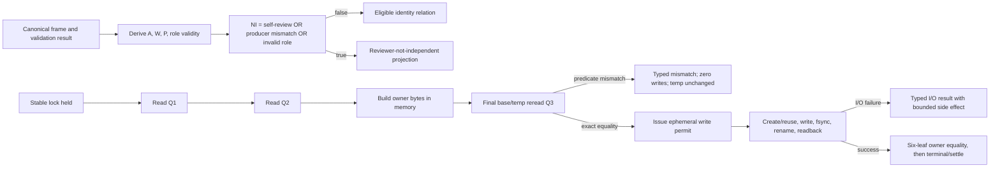

# W2 F1-F6 Repair Design v15

## Reader Map

This append-only v15 design closes two fixed-byte gaps in the retained review
identity and missing-owner recovery contracts:

1. `NI` is defined with the correct polarity. Reviewer independence fails
   exactly when the assigned reviewer equals the writer, differs from the
   validation producer, or has an invalid reviewer role. The retained
   producer-assigned-reviewer equality remains mandatory; and
2. the final recovery base reread occurs before any new temp creation, temp
   write, or temp fsync. Predicate mismatches remain zero-write failures with
   unchanged temp identity, while failures after an in-memory write permit use
   a separate closed I/O failure algebra with exact side effects.

Read in this order:

1. `Structure Contract`, `Request Clauses`, `Owner Surfaces`, and
   `Normative Incorporation Of v14` fix the replacement boundary.
2. `Abstract Design Frame` shows the identity and recovery responsibility
   flow.
3. `Exact Reviewer Identity Predicate` defines the retained identities,
   `NI`, its exact inverse, and polarity oracles.
4. `Missing-Owner Recovery Ordering` defines `Q1`, `Q2`, final `Q3`, the
   ephemeral permit, and all pre-permit/post-permit outcomes.
5. `Implementation Source Packet`, `Design Side-Effect Map`, and
   `Design-to-Implementation Trace` bind later source work.
6. `Exact Acceptance Predicates` and `Public Typed Negative-Test Plan` are the
   independent-review oracle.

v15 supersedes only the v14 clauses explicitly named below. v14
`CommandOutcome v3`, v12 C1, materializer ownership, resolver tables,
publication contracts, creation-owner schema, automatic review lineage,
publication CAS, and every other retained v14-v8 contract remain normative.

This artifact contains no identity for its own complete bytes, Git blob,
containing commit, tree, or size. Those identities are external readback
evidence.

## Structure Contract

```text
structure_kind=document
audience=independent detailed-design reviewer and later review-resolver/materializer implementers
decision_context=whether reviewer/producer polarity and missing-owner recovery side effects are exact
first_artifact=mermaid reviewer-identity and recovery-permit flow
first_artifact_question=does the valid reviewer equal the validation producer while differing from the writer, and can any predicate mismatch occur only before the first temp I/O
visual_plan=mermaid flow plus exact identity truth table, recovery order, and side-effect tables
source_to_structure_map=v12 review eligibility identity -> corrected v15 NI; v14 Q1/Q2 and post-fsync base reread -> Q1/Q2/Q3 pre-I/O permit; v14 post-permit operations -> closed I/O failure algebra
document_unit=owner W2 design author; reader independent reviewer/implementer; source map exact v14 packet and retained review/materializer owner paths; validation canonical docs formatter/check plus Git/hash readback; update cadence append-only review successor; canonical parent v14; downstream independent v15 review
document_split_decision=split:append-only v15 has an independent fixed-byte review identity while preserving the same owner unit
metric_or_delta_contract=one exact three-term NI predicate; one exact eligible inverse; eight polarity rows; three read-only recovery snapshots; one ephemeral permit; zero predicate-mismatch writes; closed post-permit I/O side effects; zero CommandOutcome v3 regressions
ordered_structure=reader map; clauses/owners/predecessor; ADF; exact NI; recovery ordering; source packet; side effects; trace; acceptance; negatives; validation honesty
invalid_interpretations=v15 is not source authorization, not permission to separate reviewer from validation producer, not permission for writer self-review, not a fourth NI term, not permission to write a temp before final base reread, not a claim that all post-permit failures are zero-side-effect, and not a new runner or ledger
validation_gate=independent fixed-byte v15 detailed-design review
```

No dynamic prose graph is generated. The Mermaid and exact tables are the
static structure selected for this design-only task.

## Request Clauses

| Clause | Required closure |
| --- | --- |
| `V15-R1` | Define `NI` exactly as assigned reviewer equals writer, assigned reviewer differs from validation producer, or reviewer role is invalid. Preserve producer-assigned-reviewer equality and add both positive and inverse-polarity public oracles. |
| `V15-O1` | Move the final base reread before any new temp create/write/fsync. Every predicate mismatch must produce zero writes and unchanged temp identity. Post-permit I/O failures must have a separate closed type and exact side-effect semantics. |
| `PRESERVE` | Preserve v14 CommandOutcome v3, v12 C1, all v14 resolver/publication/owner schemas, materializer ownership, and every other retained contract. |
| `BOUNDARY` | Change only v15 design and fixed-byte request artifacts. Source, tests, owner documents, hooks, Python, CI, dynamic graph, recovery execution, review dispatch, and publication remain blocked. |

## Owner Surfaces

| Responsibility | Canonical owner | Replaceable unit | Consumer |
| --- | --- | --- | --- |
| reviewer identity fields and projection predicate | `agents/COMMUNICATION_PROTOCOL.md` | review eligibility resolver contract | review dispatcher/checker |
| review assignment and same-context lineage | retained future `tools/agent_tools/review_dispatch.py` plus task/team owner surfaces | canonical assigned reviewer | review eligibility |
| validation producer/writer identity | materializer-backed validation result | immutable producer object | review eligibility |
| result attempt, stable lock, temp transaction, and owner recovery | `tools/agent_tools/work_log.py` | canonical result materializer | artifact checker |
| recovery verification | `tools/agent_tools/report_artifact_checks.py` | owner-chain/recovery checker | closeout |
| canonical run and current attempt | `task_authority.py`, L, and retained current pointer | workspace-only locator/state | review and recovery |
| closeout | `task_close.py` | regenerated full chain | final gate |

Durable owner surfaces never depend upstream on this run-local v15 report.

## Normative Incorporation Of v14

The exact predecessor packet is:

```text
predecessor_commit=d82efcf6872cbda9d61f73f702c4057555aa8c77
predecessor_tree=2f3bb76f953612a8ba30927d5336693c7b3a041e
predecessor_parent=15fbe1c6084c7f837ba87ff410ade5b8834c76be
predecessor_design_path=reports/agents/convergence-w2-gates-completion-20260716/w2_f1_f6_repair_design_v14.md
predecessor_design_size_bytes=61013
predecessor_design_sha256=6ba4c6506f1cc2d99fed6bc4b9b69b93b7a602d544fab03e14d63b3c5737c9e2
predecessor_design_git_blob=e71dd1783a34f7c57166350aadbf3ec98aea40e1
predecessor_request_path=reports/agents/convergence-w2-gates-completion-20260716/w2_detailed_design_recheck_request_v14.md
predecessor_request_size_bytes=16518
predecessor_request_sha256=8aa2f49dc0683ee86253c86eb017d694e8e01ebf0bbc51a0233b2d6a29bf7536
predecessor_request_git_blob=f92b2292121dda58f78e6c7b224d8af2f2709c90
```

v15 supersedes exactly:

1. the v14 statement that reviewer equality with the validation producer makes
   `NI` true;
2. any reviewer-independence implementation that does not preserve assigned
   reviewer equality with validation producer;
3. any `NI` implementation with a fourth term or with reversed writer,
   producer, or role polarity;
4. v14 recovery order that enters `mutation_permitted` before the final base
   reread;
5. v14 step that rereads the pre-owner base only after temp fsync;
6. any predicate mismatch classification after a new temp has been created,
   written, or fsynced;
7. any predicate-mismatch path that changes temp identity or another scoped
   durable object; and
8. any post-permit I/O failure reported as a zero-write predicate mismatch.

v15 retains without change:

- v14 common resolver algebra, review context presence table, `DB`, `ST`,
  review outcome precedence, simultaneous-condition rows, failure-code order,
  projection ID/body readback, and all publication resolver tables;
- v14 exact five-leaf pre-owner set, owner-independent predicate groups,
  fingerprint fields, stable lock, deterministic creation-owner timestamp,
  six-leaf successful readback, and no future/self reference;
- v14 `CommandOutcome v3` schema, route/argv/`argv_sha256` binding, variant
  semantics, body hashing, and typed negatives;
- v13 projection/no-projection/null schemas, nullable seed encoding, exact
  validation-result formula, creation-owner chain, and VersionOutcome v2;
- v12 canonical run locator, deterministic artifact identity/path, exactly
  three observations, stream states, one materializer, one L, current attempt,
  and begin/settle CAS;
- v12 review identity fields and requirements that validation producer equals
  assigned reviewer and assigned reviewer differs from writer;
- retained reviewer/parent separation, instance-key separation, read-only role
  config, same-context lineage, no fresh/self-review bypass, and automatic
  re-review;
- publication authority, candidate/target identity, dirty-checkout
  preservation, expected-old-OID CAS, and route closure; and
- D2/D3/F1/F2, per-member equality, topology/freeze, five formatter states,
  dependency closure, validation honesty, and every unaffected public oracle.

## Abstract Design Frame

```text
unit=ReviewIdentityAndMissingOwnerRecoveryOrderingContract
identity authority=canonical review frame + assigned reviewer + validation-result producer/writer
NI authority=exact three-term predicate only
valid reviewer relation=assigned reviewer equals validation producer, differs from writer, and has a valid canonical review role
recovery predicate authority=Q1/Q2/final-Q3 canonical readback under one stable lock
write authority=ephemeral permit issued only after Q1=Q2=Q3 and exact temp identity equality
predicate mismatch semantics=zero writes and unchanged temp identity
post-permit failure semantics=closed I/O result with explicitly bounded durable side effects
forbidden ambiguity=producer equality treated as failure; producer difference treated as pass; parent/fresh-review checks folded into NI; final base reread after temp I/O; I/O failure relabeled as predicate mismatch
replacement boundary=NI fields/polarity/oracles and recovery read/permit/I-O ordering/types only
```

The first diagram answers both replacement questions:



No write permit, projection, or owner record hashes a future object.

## Exact Reviewer Identity Predicate

### Canonical identity fields

For complete current review context, define:

```text
A = reviewer.assigned_runtime_agent_id
W = reviewer.writer_runtime_agent_id
P = reviewer.validation_producer_runtime_agent_id
RR = reviewer.required_role_id
AR = canonical assignment role_id for A
```

All five values are non-null, canonical, uniquely selected, and bound to the
same candidate, candidate revision, aggregate revision, intent revision,
review lineage, and review frame. Missing evidence follows the retained review
context-missing table. Malformed, duplicate, foreign, or cross-candidate
evidence is a typed structural error before `NI` evaluation.

The role is valid if and only if all are true:

1. `RR` is exactly `change_reviewer` or `final_reviewer`;
2. `AR` equals `RR`;
3. the canonical task/team assignment selects `A` for that exact role/frame;
4. the selected role config is the retained read-only independent-review
   config; and
5. the role/instance/agent-type tuple equals the canonical assignment and
   same-context lineage.

`ROLE_INVALID` is the exact negation of those five conjuncts.

Reviewer equality with parent, reviewer/writer instance-key collision, missing
resume lineage, or fresh-review substitution remains a retained automatic
review structural failure before `NI`. None is a fourth `NI` term.

### Exact three-term definition

Define:

```text
SELF = true exactly when A equals W
PRODUCER_MISMATCH = true exactly when A differs from P
ROLE_INVALID = true exactly when the role-valid conjunction is false
NI = SELF OR PRODUCER_MISMATCH OR ROLE_INVALID
```

No other term is permitted.

The exact eligible identity relation is the logical negation:

```text
NI is false
if and only if
A differs from W
AND A equals P
AND ROLE_INVALID is false
```

Therefore producer-assigned-reviewer equality is mandatory. The validation
producer is the assigned reviewer that produced the accepted validation
evidence. A different reviewer cannot inherit that evidence merely because it
is another independent role instance.

### Exact polarity truth table

Bits are:

- `S`: `A` equals `W`;
- `M`: `A` differs from `P`; and
- `R`: `ROLE_INVALID`.

| S | M | R | NI | Identity result |
| --- | --- | --- | --- | --- |
| 0 | 0 | 0 | 0 | valid: reviewer differs from writer, equals producer, valid role |
| 0 | 0 | 1 | 1 | invalid role |
| 0 | 1 | 0 | 1 | producer is not the assigned reviewer |
| 0 | 1 | 1 | 1 | producer mismatch and invalid role |
| 1 | 0 | 0 | 1 | self-review, even though reviewer equals producer |
| 1 | 0 | 1 | 1 | self-review and invalid role |
| 1 | 1 | 0 | 1 | self-review and producer mismatch |
| 1 | 1 | 1 | 1 | all three failures |

This truth table feeds the retained v14 `NI/DB/ST` table. `NI=1` contributes
the existing ordered failure code
`review_eligibility:reviewer_not_independent`; `NI=0` contributes no NI code.
No v14 `DB`, `ST`, precedence, null, ID seed, or body-hash rule changes.

### Retained typed cause evidence

The resolver/checker preserves these canonical cause findings:

- `review_eligibility:self_review_forbidden` when `SELF` is true;
- `review_eligibility:producer_not_assigned_reviewer` when
  `PRODUCER_MISMATCH` is true; and
- `review_eligibility:role_invalid` when `ROLE_INVALID` is true.

Cause findings are derived, not caller-supplied. They do not replace or reorder
the v14 projection `failure_codes` array.

### Identity readback

Before accepting review eligibility, the resolver rereads the validation
result, frame, assignment, lineage, role config, and current pointers, then
recomputes `A`, `W`, `P`, `RR`, `AR`, all role-valid conjuncts, `SELF`,
`PRODUCER_MISMATCH`, `ROLE_INVALID`, and `NI`.

Any polarity or equality difference is:

- `review_eligibility:identity_predicate_readback_mismatch`;
- `review_eligibility:producer_assignment_equality_mismatch`; or
- the retained projection ID/body readback failure.

## Missing-Owner Recovery Ordering

### Scoped durable state and temp identity

The retained v14 owner-independent predicates and exact five-leaf pre-owner
root remain unchanged.

For this contract, temp identity is the exact canonical object:

```json
{
  "state": "absent",
  "classification": "no_candidate",
  "basename": null,
  "node_kind": null,
  "device": null,
  "inode": null,
  "link_count": null,
  "uid": null,
  "mode": null,
  "size_bytes": null,
  "sha256": null,
  "blob": null
}
```

For a present exact candidate, every nullable field above is non-null and
contains the retained safe-node/readback value. `state` is `present` and
`classification` is `exact_complete_reusable`. No other classification can
reach the write-permit path.

`temp_identity_sha256` is SHA256 over RFC 8785 canonical JSON bytes of this
object. This object and hash are in-memory observations only, not a ledger,
receipt, artifact leaf, projection, or authority outside the current locked
operation.

Scoped durable state for zero-write comparison is:

- artifact-root directory entries and all canonical leaf bytes/identities;
- stable lock file bytes/identity;
- retained temp namespace and exact temp identity;
- L, begin transaction, pending event, current aggregate/attempt/intent
  pointers;
- route/profile/tool/frozen-source bytes and identities; and
- terminal/settlement absence observations.

Read-atime is not state authority. Zero-write means no content, namespace,
mode, owner, explicit timestamp, ledger, transaction, or pointer mutation by
the recovery operation.

### Three read-only snapshots

While holding the same existing stable exclusive lock:

1. execute the full retained v14 owner-independent preflight and compute `Q1`;
2. record exact temp identity `T1`;
3. perform no write or fsync;
4. rerun the full preflight and compute `Q2`;
5. record exact temp identity `T2`;
6. require decoded predicate equality, `Q2` equals `Q1`, and `T2` equals `T1`;
7. construct complete deterministic creation-owner bytes entirely in memory,
   using the pending event's canonical timestamp;
8. compute replacement size, SHA256, Git blob, deterministic temp basename,
   expected temp content identity, and retained safe-node policy in memory;
9. perform the final complete base and temp reread and compute `Q3` and `T3`;
10. require decoded predicate equality, `Q3` equals `Q2`, and `T3` equals
    `T2`; and
11. only then issue the ephemeral write permit.

The expected content identity contains basename, size, SHA256, Git blob, and
required file-mode/owner policy. It does not predict the device or inode of a
not-yet-created node; those safe-node values are observed after `O_EXCL`.

No new temp is created, opened for write, written, or fsynced before step 11.
No existing exact temp is fsynced before step 11. The final base reread is
therefore always before the first temp I/O.

### Ephemeral write permit

The permit digest is:

```text
agent-canon.missing-owner-recovery-write-permit.v1\0
encode_utf8("stable-lock-id", <lock ID>)
encode_utf8("q3-sha256", <Q3>)
encode_utf8("temp-identity-sha256", <T3 hash>)
encode_utf8("replacement-size", <16 lowercase hex>)
encode_utf8("replacement-sha256", <creation-owner bytes SHA256>)
encode_utf8("replacement-blob", <creation-owner bytes Git blob>)
encode_utf8("temp-basename", <deterministic basename>)
end\0
```

The permit:

- exists only in process memory;
- is valid only while the same lock descriptor remains held;
- authorizes exactly one create-or-reuse branch for the observed `T3`;
- cannot be serialized, resumed, delegated, or accepted by another process;
- is consumed by the first temp create or existing-temp fsync attempt; and
- expires before any retry.

Permit derivation writes nothing.

### Predicate-mismatch semantics

A predicate mismatch is any failure before permit issuance involving:

- a retained owner-independent predicate;
- `Q1`, `Q2`, or `Q3` inequality;
- decoded predicate inequality;
- `T1`, `T2`, or `T3` inequality;
- replacement identity derivation;
- deterministic temp basename derivation; or
- lock identity/ownership.

Every predicate mismatch has all exact side effects:

```text
permit_issued=false
new_temp_created=false
temp_opened_for_write=false
temp_bytes_written=0
temp_fsync_attempted=false
temp_unlinked=false
temp_renamed=false
artifact_directory_fsync_attempted=false
creation_owner_created=false
ledger_appended=false
settlement_written=false
pointer_updated=false
recovery_operation_temp_mutation=false
temp_identity_at_return=temp_identity_at_mismatch_detection
recovery_operation_scoped_durable_mutation=false
scoped_durable_state_at_return=scoped_durable_state_at_mismatch_detection
```

An existing exact temp is not fsynced, rewritten, renamed, or deleted on a
predicate mismatch. A foreign/live/incomplete/corrupt/conflicting temp remains
the retained typed preflight failure and is likewise unchanged.

If a noncompliant external actor changes the temp between `T1`, `T2`, and
`T3`, that external transition is the mismatch evidence. The recovery
operation preserves the exact identity observed when it detects the mismatch
and performs no further temp transition. With no external actor, entry,
detection, and return temp identities are identical.

Stable predicate-mismatch failures retain v14 codes and add:

- `validation_creation_owner_recovery:temp_identity_changed`
- `validation_creation_owner_recovery:final_base_reread_mismatch`
- `validation_creation_owner_recovery:replacement_identity_mismatch`
- `validation_creation_owner_recovery:write_permit_derivation_mismatch`

`validation_creation_owner_recovery:preflight_changed` remains the generic
Q1/Q2/Q3 mismatch result. None of these codes is used after permit issuance.

### Post-permit I/O operation order

After permit issuance, the existing materializer executes exactly one branch.

For `T3.state=absent`:

1. create the deterministic temp with retained safe
   `O_CREAT|O_EXCL|O_NOFOLLOW` flags;
2. write the exact replacement bytes;
3. fsync the temp;
4. reread and require exact expected temp identity.

For `T3.state=present`:

1. require the observed candidate was already
   `exact_complete_reusable`;
2. do not create or rewrite it;
3. fsync the existing exact temp;
4. reread and require the same exact bytes and safe-node identity.

After either successful branch:

1. atomically rename the exact temp to `creation_owner.json`;
2. fsync the artifact directory;
3. reread the exact six-leaf root and owner/manifest/lock/route/tool/source
   chain; and
4. only after successful owner readback continue to the retained terminal event
   and settlement.

There is no post-temp predicate reread. The stable lock protects the compliant
base after `Q3`. A failure observed after permit issuance is an I/O or
post-permit concurrency failure, never a predicate mismatch.

### Closed post-permit I/O failure algebra

Post-permit failures use the
`validation_creation_owner_recovery_io:` namespace.

| Failure | Exact observation | Temp after failure | Owner after failure | Ledger/settlement/pointer |
| --- | --- | --- | --- | --- |
| `temp_create_failed` | create fails without creating the node | absent as `T3` | absent | unchanged |
| `temp_create_conflict` | `O_EXCL` observes a new namespace entry after absent `T3` | externally created entry preserved, not adopted or deleted | absent | unchanged |
| `temp_write_failed` | new temp was created but complete write failed | partial/unknown new temp preserved | absent | unchanged |
| `temp_fsync_failed` | new complete temp write occurred but fsync failed | new temp preserved; durability unknown | absent | unchanged |
| `temp_reuse_fsync_failed` | existing exact temp fsync failed | exact `T3` bytes/name preserved | absent | unchanged |
| `temp_readback_failed` | temp fsync completed but exact identity cannot be proven | temp preserved without rename | absent | unchanged |
| `temp_identity_mismatch` | post-fsync temp readback differs from expected replacement/safe node | mismatching temp preserved without rename | absent | unchanged |
| `rename_failed` | atomic rename returned failure | exact temp preserved | absent | unchanged |
| `directory_fsync_failed` | rename succeeded but directory fsync failed | absent | exact owner path may exist; durability unknown | unchanged |
| `owner_readback_failed` | rename and directory fsync completed but six-leaf/owner readback failed | absent | owner path exists but is not accepted as complete | unchanged |

Exact typed codes are:

- `validation_creation_owner_recovery_io:temp_create_failed`
- `validation_creation_owner_recovery_io:temp_create_conflict`
- `validation_creation_owner_recovery_io:temp_write_failed`
- `validation_creation_owner_recovery_io:temp_fsync_failed`
- `validation_creation_owner_recovery_io:temp_reuse_fsync_failed`
- `validation_creation_owner_recovery_io:temp_readback_failed`
- `validation_creation_owner_recovery_io:temp_identity_mismatch`
- `validation_creation_owner_recovery_io:rename_failed`
- `validation_creation_owner_recovery_io:directory_fsync_failed`
- `validation_creation_owner_recovery_io:owner_readback_failed`

On every post-permit failure:

- no temp or owner path is unlinked, overwritten, quarantined, or adopted;
- no terminal event, settlement transaction, successor aggregate, or pointer
  is written;
- observed side effects are recorded in the returned typed result;
- the next retry starts from retained lock-first classification and issues a
  new permit only after fresh `Q1/Q2/Q3`; and
- no I/O failure is rewritten as `preflight_changed` or another predicate
  mismatch.

### Successful recovery

Recovery succeeds only when:

1. the permit was issued from exact `Q1=Q2=Q3` and `T1=T2=T3`;
2. the temp branch completed with exact replacement identity;
3. rename and directory fsync completed;
4. six-leaf root and complete creation-owner chain reread pass; and
5. the retained terminal/settle/current-pointer transaction then succeeds.

Success returns no lingering temp. A hand-written success or cleanup artifact
is forbidden.

## Implementation Source Packet

### Fixed predecessor

```text
repository=/mnt/l/workspace/agent-canon-convergence-w2-final-writer-owned
branch=codex/convergence-w2-final-gates-completion
design_predecessor_commit=d82efcf6872cbda9d61f73f702c4057555aa8c77
design_predecessor_tree=2f3bb76f953612a8ba30927d5336693c7b3a041e
design_predecessor_parent=15fbe1c6084c7f837ba87ff410ade5b8834c76be
review_input_kind=explicit user v15 fixed-byte closure
durable_review_decision_artifact=not_supplied
implementation_authorization=blocked
```

The exact v14 artifact identities are the predecessor packet above. v14
normatively incorporates v12 C1 and the retained implementation-source
ancestry.

Selected unchanged owner evidence remains the exact v14 packet:

- `agents/COMMUNICATION_PROTOCOL.md` for review identity/projection schema;
- task catalog, team manifest, agent config, and reviewer role config for
  canonical assignment/role validity;
- materializer-backed validation result for producer/writer identities;
- `tools/agent_tools/work_log.py` for recovery lock/temp/I/O;
- `tools/agent_tools/report_artifact_checks.py` for deterministic readback;
- `tools/agent_tools/task_authority.py` for canonical run locator; and
- `tools/agent_tools/task_close.py` for full closeout.

Source implementation remains pending and unauthorized.

## Design Side-Effect Map

| Later surface | Required change | Clause | Oracle |
| --- | --- | --- | --- |
| `COMMUNICATION_PROTOCOL.md` | replace NI producer polarity; define exact valid role/assigned producer relation; define Q1/Q2/Q3 permit and I/O result union | V15-R1/O1 | schema review |
| task catalog/team manifest/agent config/reviewer role config | preserve assigned reviewer/role/frame equality and read-only independent roles | V15-R1 | routing consistency |
| `work_log.py` | move final base/temp read before first temp I/O; issue ephemeral permit; return closed post-permit I/O results | V15-O1 | materializer tests |
| `workflow_monitor.py` | preserve reviewer/producer/writer polarity and typed recovery class without override | both | monitor tests |
| `report_artifact_checks.py` | recompute NI polarity, Q1/Q2/Q3, temp identity, permit, and I/O side-effect class | both | checker tests |
| future `review_dispatch.py` | bind validation producer as assigned reviewer and reject self/role mismatch | V15-R1 | review tests |
| `task_close.py` | reject polarity mismatch, pre-permit writes, unresolved I/O side effects, or incomplete owner readback | both | closeout tests |
| `tests/agent_tools/test_workflow_monitor.py` | NI polarity and producer-assignment positive/inverse cases | V15-R1 | public polarity oracle |
| `tests/agent_tools/test_work_log.py` | Q3-before-I/O ordering and every post-permit failure row | V15-O1 | side-effect snapshots |
| `tests/agent_tools/test_task_start_and_close.py` | unresolved recovery I/O states and polarity mismatch block closeout | both | closeout negatives |
| docs/templates/headers | replace v14 NI wording and recovery ordering while retaining reciprocal edges | both | convention consistency |

No source path is edited in this design commit.

## Dependency-Header Closure

v15 adds no owner or consumer. Every v14/v12 reciprocal pair remains, with
changed wording only inside the existing review-resolver and
materializer/checker/test edges. No durable dependency header names this v15
report.

## Design-to-Implementation Trace

| Slice | Responsibility | Later paths | Oracle |
| --- | --- | --- | --- |
| `V15-S1` | canonical review identity fields and role-valid conjunction | protocol, routing owners, review dispatcher | missing/malformed/role config checks |
| `V15-S2` | exact NI and eligible inverse | review dispatcher, checker | eight S/M/R rows |
| `V15-S3` | polarity readback and retained cause findings | checker, monitor | equality/difference inversion negatives |
| `V15-S4` | canonical temp identity and scoped durable state | work log, checker | absent/exact candidate identity |
| `V15-S5` | Q1/Q2/final-Q3 ordering | work log | no temp create/write/fsync before Q3 |
| `V15-S6` | ephemeral permit | work log, checker | digest, lock lifetime, one branch, retry expiry |
| `V15-S7` | predicate mismatch zero-write semantics | work log, tests | full before/after identity equality |
| `V15-S8` | post-permit I/O failure union | work log, checker, closeout | all ten rows and exact side effects |
| `V15-S9` | retained contract recheck | all retained v14-v8 paths | CommandOutcome v3, v12 C1, predecessor oracles |

Later implementation order is review identity schema/routing equality, review
resolver, recovery ordering/permit/I/O union, checker/monitor/closeout
consumers, reciprocal docs/headers, selected public tests, and consolidated
validation.

## Exact Acceptance Predicates

### V15-R1 reviewer identity polarity

Pass if and only if:

1. complete review context derives exact non-null `A`, `W`, `P`, `RR`, and
   `AR` from one canonical candidate/frame/lineage;
2. role valid is exactly the five-conjunct contract;
3. `SELF` is true exactly when `A` equals `W`;
4. `PRODUCER_MISMATCH` is true exactly when `A` differs from `P`;
5. `ROLE_INVALID` is the exact negation of role valid;
6. `NI` equals only the OR of those three terms;
7. eligible identity is exactly `A` differs from `W`, `A` equals `P`, and
   role valid;
8. reviewer/parent, instance-key, resume-lineage, and fresh-review failures
   remain earlier structural predicates and are not added to `NI`;
9. all eight S/M/R rows have the exact NI result;
10. NI feeds the retained v14 NI/DB/ST outcome/failure table without changing
    DB, ST, precedence, nulls, or ID framing;
11. retained self-review, producer-not-assigned, and role-invalid cause
    findings use the correct polarity;
12. readback recomputes every identity, role conjunct, term, and NI; and
13. public oracles prove both sides of every equality/difference polarity.

### V15-O1 recovery ordering and side effects

Pass if and only if:

1. v14 owner-independent predicates and five-leaf pre-owner root remain exact;
2. temp identity has the exact absent/present schema and hash;
3. Q1/T1, Q2/T2, and final Q3/T3 are read under one stable lock;
4. no new temp create/open-for-write/write/fsync and no existing-temp fsync
   occurs before Q3/T3 equality;
5. creation-owner bytes and expected temp identity are computed in memory
   before Q3 without writing;
6. permit is issued only after decoded equality, Q1=Q2=Q3, and T1=T2=T3;
7. permit digest fields/order, lock lifetime, one-branch scope, consumption,
   and retry expiry are exact;
8. every predicate mismatch occurs before permit and has the exact zero-write
   state vector;
9. every predicate mismatch preserves exact temp identity and all scoped
   durable state;
10. existing foreign/live/incomplete/corrupt/conflicting temp is never
    fsynced, changed, renamed, or deleted by a mismatch path;
11. after permit, only the exact absent-create or exact-present-reuse branch
    executes;
12. no post-temp predicate reread can create a predicate mismatch after side
    effects;
13. all ten post-permit I/O failures have the exact code and side-effect row;
14. post-permit failures never append terminal/settle/pointer state and never
    delete or adopt temp/owner state;
15. no post-permit I/O failure is labeled as a predicate mismatch;
16. each retry starts with fresh lock-first Q1/Q2/Q3 and a new permit; and
17. success requires exact temp identity, rename, directory fsync, six-leaf
    owner readback, then retained terminal/settle success.

### Preserved contracts

Pass also requires:

- v14 `CommandOutcome v3` route/argv/hash semantics and all typed negatives;
- v14 review/publication resolver tables, failure arrays, projection IDs,
  body hashes, no-projection behavior, and simultaneous-condition closure;
- v14 owner-independent predicates and successful creation-owner readback;
- v13 projection schemas, creation-owner chain, six-leaf complete root,
  VersionOutcome v2, and transition table;
- v12 C1 locator, deterministic artifact derivation, three observations,
  streams, one materializer/L/current attempt, and begin/settle CAS;
- retained automatic review lineage, explicit APPROVE, publication authority,
  exact candidate/target, dirty-checkout protection, and CAS;
- D2/D3/F1/F2, member/group equality, topology/freeze, formatter statuses,
  dependency closure, and validation honesty; and
- no compatibility/test-only API, new runner/ledger, self/fresh review bypass,
  caller path/outcome override, durable dependency to a run-local report, or
  self-reference.

## Public Typed Negative-Test Plan

### Reviewer identity polarity

| Mutation | Expected result |
| --- | --- |
| `A` differs from `W`, equals `P`, role valid | `NI=0`; no reviewer-not-independent code |
| `A` equals `W`, equals `P`, role valid | `NI=1`; self-review cause |
| `A` differs from `W` and differs from `P`, role valid | `NI=1`; producer-not-assigned cause |
| `A` differs from `W`, equals `P`, role invalid | `NI=1`; role-invalid cause |
| implementation treats `A=P` as failure | `review_eligibility:producer_assignment_equality_mismatch` |
| implementation treats `A!=P` as pass | same polarity mismatch |
| implementation treats `A!=W` as self-review | `review_eligibility:identity_predicate_readback_mismatch` |
| implementation treats `A=W` as independent | retained self-review failure |
| NI includes parent equality or fresh-lineage term | exact-NI contract failure |
| one role-valid conjunct is ignored | `review_eligibility:role_invalid` |
| any S/M/R row returns wrong NI | `review_eligibility:identity_predicate_readback_mismatch` |

### Predicate mismatches before permit

| Mutation | Expected result and side effect |
| --- | --- |
| Q2 differs from Q1 | `validation_creation_owner_recovery:preflight_changed`; zero-write vector; temp unchanged |
| T2 differs from T1 | `...:temp_identity_changed`; zero-write vector; detection-time temp identity preserved by operation |
| final Q3 differs from Q2 | `...:final_base_reread_mismatch`; zero-write vector; temp unchanged |
| final T3 differs from T2 | `...:temp_identity_changed`; zero-write vector; detection-time identity preserved |
| replacement size/hash/blob/basename changes | matching replacement/permit mismatch; zero-write vector |
| code creates or opens temp for write before Q3 equality | `...:write_before_preflight_forbidden` |
| code fsyncs existing temp before Q3 equality | same forbidden-write result |
| predicate mismatch path renames/unlinks/fsyncs temp | zero-write side-effect contract failure |

Every row compares the complete scoped durable state and exact temp identity
before and after.

### Post-permit I/O failures

| Injected failure | Expected typed result | Required retained state |
| --- | --- | --- |
| create syscall fails without node | `validation_creation_owner_recovery_io:temp_create_failed` | temp absent, owner absent |
| O_EXCL observes raced entry | `...:temp_create_conflict` | raced entry preserved, not adopted |
| write fails after create | `...:temp_write_failed` | partial/unknown temp preserved |
| new temp fsync fails | `...:temp_fsync_failed` | new temp preserved, durability unknown |
| exact existing temp fsync fails | `...:temp_reuse_fsync_failed` | exact existing temp preserved |
| temp readback cannot complete | `...:temp_readback_failed` | temp preserved, no rename |
| temp bytes/safe node differ after fsync | `...:temp_identity_mismatch` | mismatching temp preserved |
| rename fails | `...:rename_failed` | exact temp preserved, owner absent |
| directory fsync fails after rename | `...:directory_fsync_failed` | owner may exist, temp absent, durability unknown |
| owner/six-leaf readback fails | `...:owner_readback_failed` | owner exists but no terminal/settle/pointer |

For every row, no cleanup, terminal event, settlement, successor aggregate, or
pointer update occurs. A later retry reclassifies the retained state from the
beginning.

## Validation Honesty And Design Gate

This v15 commit is design-only. It runs no source implementation, Python,
tests, CI, dynamic graph, review resolver, recovery operation, validation
command, review dispatch, or publication. Only canonical Markdown
formatting/checking and static Git/hash readback are authorized.

```text
structure_planning=complete
structure_contract=this artifact
document_split_decision=split:append-only v15 fixed-byte successor
structure_first_artifact=review identity and recovery permit Mermaid
structure_visual_plan=mermaid and exact truth/side-effect tables
structure_source_map=v14 fixed packet plus retained v12 review identity
structure_oop_contract=not_required
discourse_relations=not_required:dynamic graph prohibited by active task boundary
structure_invalid_interpretations_recorded=yes
result_writeout=complete
result_source=explicit user v15 fixed-byte closure plus v14 fixed predecessor
result_raw_artifact=not_applicable:design-only source packet
result_summary_artifact=this artifact
result_manifest=inline fixed predecessor and validation boundary
result_overwrite_policy=append-only
review_identity_polarity_execution=pending
recovery_ordering_execution=pending
post_permit_io_execution=pending
public_negative_tests=pending
independent_v15_design_review=pending
source_implementation_authorization=blocked
```

No hand-written pass artifact is created. Source implementation remains blocked
until an independent reviewer APPROVEs the exact v15 bytes.
