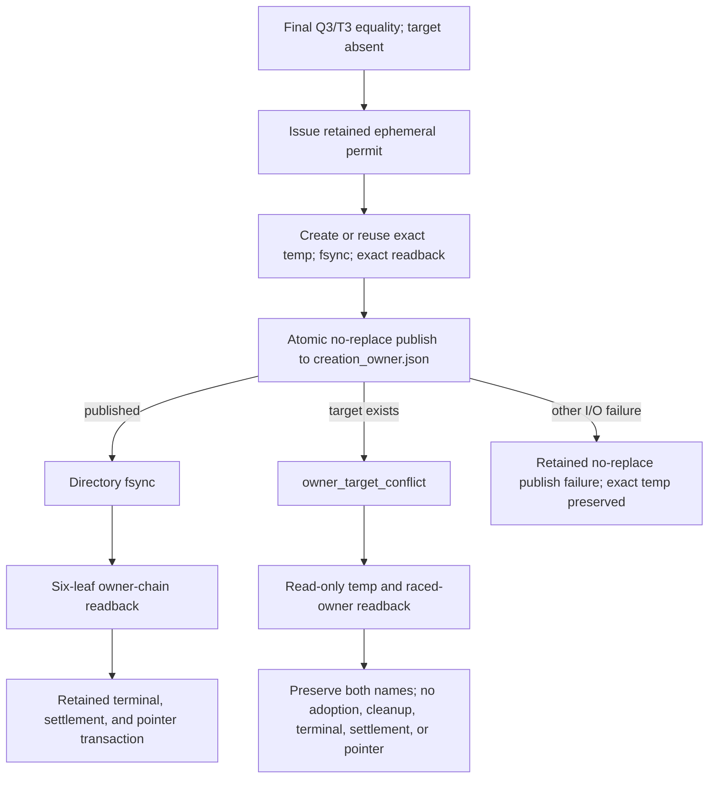

# W2 F1-F6 Repair Design v16

## Reader Map

This append-only v16 design closes the final missing-owner publication race.
The retained v15 transaction already performs all owner-independent checks and
the final `Q3` read before issuing a write permit. v16 changes only the
linearization operation that publishes the exact temporary file as
`creation_owner.json`:

1. publication is one atomic no-replace operation;
2. a target created after `Q3` produces the exact typed result
   `validation_creation_owner_recovery_io:owner_target_conflict`;
3. that result preserves both the exact temporary file and the raced owner
   entry without adoption, deletion, replacement, or cleanup;
4. the conflict path writes no terminal event, settlement, successor
   aggregate, or current pointer; and
5. a public concurrency oracle proves the race and its complete readback and
   side-effect row.

Read in this order:

1. `Structure Contract`, `Request Clauses`, `Owner Surfaces`, and
   `Normative Incorporation Of v15` fix the append-only replacement boundary.
2. `Abstract Design Frame` shows the one legal publication linearization.
3. `Canonical No-Replace Publication` defines the primitive, exact operation
   order, result union, conflict readback, and retry boundary.
4. `Implementation Source Packet`, `Design Side-Effect Map`, and
   `Design-to-Implementation Trace` bind later source work.
5. `Exact Acceptance Predicates` and `Public Concurrency Negative` are the
   independent fixed-byte review oracle.

v16 supersedes only v15's ordinary rename publication wording and the claim
that every rename failure leaves the owner target absent. v15 R1, all
pre-permit zero-write semantics, `CommandOutcome v3`, v12 C1, the retained
materializer, review, publication, topology, dependency, and validation
contracts remain normative.

This artifact contains no identity for its own complete bytes, Git blob,
containing commit, tree, or size. Those identities are external readback
evidence.

## Structure Contract

```text
structure_kind=document
audience=independent detailed-design reviewer and later materializer/checker implementers
decision_context=whether creation_owner publication has one race-safe linearization and one closed conflict result
first_artifact=mermaid no-replace publication flow
first_artifact_question=can a target created after Q3 replace, absorb, or destroy the exact temp, or permit terminal state
visual_plan=mermaid flow plus exact result, readback, side-effect, trace, and acceptance tables
source_to_structure_map=v15 final Q3/permit/temp contract -> v16 no-replace linearization -> owner_target_conflict readback -> retained retry and closeout
document_unit=owner W2 design author; reader independent reviewer/implementer; source map exact v15 packet and retained materializer owner paths; validation canonical docs formatter/check plus Git/hash readback; update cadence append-only review successor; canonical parent v15; downstream independent v16 review
document_split_decision=split:append-only v16 has an independent fixed-byte review identity while preserving the same owner unit
metric_or_delta_contract=one atomic no-replace publication; one target-exists result; two preserved namespace entries; zero terminal/settlement/pointer writes; one public concurrency negative; zero retained-contract regressions
ordered_structure=reader map; clauses/owners/predecessor; ADF; publication algebra; source packet; side effects; trace; acceptance; concurrency negative; validation honesty
invalid_interpretations=v16 is not source authorization, not ordinary rename with a prior exists check, not unlink-then-rename, not overwrite, not target adoption when bytes happen to match, not cleanup authority, not permission to relabel post-permit conflict as a preflight mismatch, and not a new runner or ledger
validation_gate=independent fixed-byte v16 detailed-design review
```

No dynamic prose graph is generated. The Mermaid flow and exact tables are the
static structure selected for this design-only task.

## Request Clauses

| Clause | Required closure |
| --- | --- |
| `V16-R1` | Publish the exact temp as `creation_owner.json` only through an atomic no-replace primitive. No ordinary rename, overwrite, unlink-first, copy, or check-then-rename fallback exists. |
| `V16-R2` | If a target is created after final `Q3`, return exact `owner_target_conflict`, preserve the exact temp and raced owner, perform no adoption/deletion, and write no terminal/settlement/successor/pointer state. |
| `V16-R3` | Add a closed conflict readback/result schema, exact side-effect row, and public concurrency negative that proves both entries and all forbidden writes. |
| `PRESERVE` | Preserve v15 R1, final-Q3 pre-permit ordering, every pre-permit zero-write predicate, v14 `CommandOutcome v3`, v12 C1, and every other retained v15-v8 contract. |
| `BOUNDARY` | Change only v16 design and fixed-byte request artifacts. Source, tests, owner documents, hooks, Python, CI, dynamic graph, recovery execution, review dispatch, and publication remain blocked. |

## Owner Surfaces

| Responsibility | Canonical owner | Replaceable unit | Consumer |
| --- | --- | --- | --- |
| result attempt, stable lock, temp transaction, and owner publication | `tools/agent_tools/work_log.py` | canonical result materializer | artifact checker |
| creation-owner recovery schema and returned result union | `agents/COMMUNICATION_PROTOCOL.md` | materializer/recovery protocol | work log and checker |
| no-replace route/tool capability | registered materializer route and frozen tool identity retained by v12-v15 | canonical validation route | Q1/Q2/Q3 verifier |
| recovery and readback verification | `tools/agent_tools/report_artifact_checks.py` | owner-chain/recovery checker | closeout |
| canonical run and current attempt | `task_authority.py`, canonical ledger L, and retained current pointer | workspace-only locator/state | materializer and checker |
| unresolved conflict closeout | `tools/agent_tools/task_close.py` | regenerated full chain | final gate |
| concurrency and side-effect oracle | `tests/agent_tools/test_work_log.py` and closeout tests | production API race fixture | implementation review |

The no-replace primitive is an implementation detail of the existing
materializer owner. v16 creates no alternate publisher, compatibility path,
test-only selector, receipt ledger, or durable upstream dependency on this
run-local report.

## Normative Incorporation Of v15

The exact predecessor packet is:

```text
predecessor_commit=b24a2b9b7956b5eaf5b16144577870670dd4eec0
predecessor_tree=eaf91660889ce3f06e10a8786ddc8ab965349905
predecessor_parent=d82efcf6872cbda9d61f73f702c4057555aa8c77
predecessor_design_path=reports/agents/convergence-w2-gates-completion-20260716/w2_f1_f6_repair_design_v15.md
predecessor_design_size_bytes=38823
predecessor_design_sha256=f80fc43e22584ebce29c2614e524708c82ef667d5b1fcfb613d756a9b93c2af4
predecessor_design_git_blob=7d655afb274a76373f7e479f1660dab40794ac6d
predecessor_request_path=reports/agents/convergence-w2-gates-completion-20260716/w2_detailed_design_recheck_request_v15.md
predecessor_request_size_bytes=12681
predecessor_request_sha256=c3526634ce1d7b09b2765c08892d8b2586b968f43e132d55119b8efbfec271df
predecessor_request_git_blob=8f98577bc8b5a70ba65c2210b5a6f97df809882a
```

v16 supersedes exactly:

1. v15's post-temp step “atomically rename the exact temp to
   `creation_owner.json`” when that wording permits replacement;
2. any use of ordinary rename, a separate existence check followed by rename,
   unlink-then-rename, copy, overwrite, or another non-atomic approximation;
3. v15's `rename_failed` row only to the extent it assumes the owner path is
   absent for a target-exists race; and
4. any retry behavior that adopts, deletes, or overwrites either raced entry
   inside the failed transaction.

v16 retains without change:

- v15's exact reviewer-independence predicate and all polarity rows;
- v15's scoped durable state, temp identity, Q1/T1, Q2/T2, final Q3/T3,
  in-memory replacement construction, permit digest, and permit lifetime;
- every pre-permit predicate mismatch and its exact zero-write state vector;
- the absent-temp O_EXCL branch and exact-reusable-temp branch through
  post-fsync temp readback;
- all non-publication post-permit I/O failures and their preservation rules;
- v14 `CommandOutcome v3`, route/argv/`argv_sha256`, body hash, readback, and
  negatives;
- v14 resolver precedence/conflict tables, owner-independent structural
  predicates, creation-owner chain, and no-write recovery ordering;
- v12 C1 canonical run locator, deterministic artifact identity, three
  observations, stream completeness, and one materializer/L/current-attempt
  transaction;
- immutable intent/review lineage, explicit APPROVE, publication authority,
  exact candidate/target CAS, and dirty-checkout protection;
- D2/D3/F1/F2, aggregate completion authority, per-member/group equality,
  topology/freeze predicates, five formatter statuses, and dependency closure;
  and
- non-self-reference, pending/deferred validation honesty, and the prohibition
  on compatibility or test-only APIs.

## Abstract Design Frame

```text
replaceable responsibility unit=missing-owner final publication concurrency algebra
canonical state authority=canonical ledger L and retained materializer attempt
pre-permit authority=v15 Q1/Q2/final-Q3 equality under one stable lock
publication source=one exact complete temp proved after permit
publication target=the same artifact-directory entry creation_owner.json
linearization authority=one same-directory atomic no-replace rename
conflict condition=Q3 observed target absent and no-replace reports target-exists
conflict result=validation_creation_owner_recovery_io:owner_target_conflict
conflict preservation=exact temp remains; raced owner remains; neither is adopted, deleted, replaced, or cleaned
terminal authority=unavailable on conflict; enabled only after successful no-replace, directory fsync, and six-leaf readback
retry authority=fresh lock-first classification; failed transaction grants no cleanup or adoption authority
```



The no-replace syscall is the only linearization point. A pre-syscall
existence check is evidence only and never publication authority.

## Canonical No-Replace Publication

### Frozen publication names and capability

The publication operation uses the already-open retained artifact-directory
file descriptor. Both names are relative to that descriptor:

```text
source_basename=<retained deterministic temp basename>
target_basename=creation_owner.json
source_and_target_directory=retained artifact directory
cross_filesystem=false
follow_symlinks=false
replace_existing=false
```

The registered materializer route and frozen executable identity must expose
one exact no-replace operation with Linux
`renameat2(source_dirfd, source_basename, target_dirfd,
target_basename, RENAME_NOREPLACE)` semantics:

1. if the target is absent at the operation's linearization point, the exact
   source entry becomes the target atomically and the source name disappears;
2. if any target entry exists at that point, the operation returns the closed
   `target_exists` outcome and leaves both namespace entries unchanged; and
3. any other failure leaves the source entry unchanged and does not create,
   replace, unlink, or modify the target through this operation.

An owner-owned wrapper may normalize platform error details, but it must
provide exactly those semantics. Ordinary `rename`, target precheck followed
by rename, unlink-first rename, copy, hard-link/delete composition, overwrite,
shell `mv`, Git movement, and compatibility fallback are forbidden.

No-replace capability and the exact owner-tool identity are owner-independent
route predicates included in each retained `Q1`, `Q2`, and `Q3` snapshot.
Unsupported or changed capability fails before permit with the retained
zero-write semantics. An unexpected post-permit primitive failure uses
`validation_creation_owner_recovery_io:rename_failed`; the implementation may
not fall back to a replacing operation.

### Exact post-temp operation order

After the retained absent-create or exact-present-reuse branch has produced
one exact fsynced temp and a successful post-fsync temp readback:

1. retain that readback as `temp_before_publish`;
2. invoke the no-replace operation exactly once with the frozen directory
   descriptor and basenames;
3. branch only on `published`, `target_exists`, or `io_failed`;
4. on `published`, fsync the artifact directory, perform retained six-leaf
   owner-chain readback, and only then enter the retained
   terminal/settlement/current-pointer transaction;
5. on `target_exists`, perform only the read-only conflict readback below and
   return `owner_target_conflict`; and
6. on `io_failed`, preserve the exact temp, perform no fallback, and return the
   retained `rename_failed` variant with the normalized I/O detail.

The operation is never retried under the same permit. The permit is consumed
by this first publication attempt and expires on every outcome.

### Exact conflict condition

`owner_target_conflict` is selected if and only if all of these facts hold:

1. the retained final `Q3` snapshot proved `creation_owner.json` absent;
2. the permit was valid and the exact fsynced temp passed post-fsync readback;
3. the no-replace operation was invoked exactly once;
4. the operation returned its canonical `target_exists` outcome; and
5. no replacing or cleanup operation was invoked.

Because `Q3` observed absence and no-replace observed an existing target at
its linearization point, the conflicting namespace entry was created after
`Q3`. Matching bytes, matching owner identity, or a plausible owner chain do
not change the result and do not authorize adoption.

The exact public code is:

```text
validation_creation_owner_recovery_io:owner_target_conflict
```

It is a returned variant of the existing materializer recovery result union,
not a new durable ledger, receipt, terminal event, settlement, or pointer.

### `OwnerTargetConflictResult v1`

The returned object contains exactly these top-level fields in canonical field
name order before RFC 8785 serialization:

| Field | Exact type and value |
| --- | --- |
| `schema` | literal `agent-canon.validation-creation-owner-recovery-io-result.v1` |
| `kind` | literal `owner_target_conflict` |
| `code` | literal `validation_creation_owner_recovery_io:owner_target_conflict` |
| `run_id` | retained canonical non-empty run ID |
| `logical_key` | retained canonical validation logical key |
| `attempt` | retained positive integer attempt |
| `aggregate_id` | retained immutable aggregate ID |
| `aggregate_revision` | retained positive integer revision |
| `current_intent_revision_id` | retained immutable current intent revision ID |
| `pending_event_id` | retained canonical pending event ID |
| `lock_id` | retained stable lock ID held through readback |
| `permit_sha256` | 64 lowercase hex SHA256 of the retained ephemeral permit bytes |
| `q3_sha256` | 64 lowercase hex SHA256 of canonical final-Q3 bytes |
| `source_basename` | retained deterministic temp basename |
| `target_basename` | literal `creation_owner.json` |
| `publication_primitive` | literal `renameat2_RENAME_NOREPLACE` |
| `publication_outcome` | literal `target_exists` |
| `temp_before_publish` | complete retained `TempIdentity`, state `exact_complete_reusable` |
| `temp_after_conflict` | complete retained `TempIdentity`, state `exact_complete_reusable` |
| `raced_owner_readback` | one exact `RacedOwnerReadback v1` union member |
| `side_effects` | exact `OwnerTargetConflictSideEffects v1` object |
| `body_sha256` | 64 lowercase hex SHA256 defined below |

Every identity field must equal the same retained run, logical key, attempt,
aggregate revision, current intent, pending event, lock, permit, and Q3 used by
the materializer. No field is caller supplied. No field is nullable.

`body_sha256` is:

```text
SHA256(UTF8(RFC8785(result object with body_sha256 omitted)))
```

Readback recomputes the body hash and every owner-chain equality. The result
does not hash, identify, or require a future terminal, settlement, pointer, or
review object.

### `RacedOwnerReadback v1`

The readback is a closed union selected after the no-replace
`target_exists` outcome. Common fields are:

| Field | Type |
| --- | --- |
| `schema` | literal `agent-canon.raced-owner-readback.v1` |
| `state` | one of `complete_regular`, `complete_non_regular`, `unstable_or_unreadable` |
| `path_basename` | literal `creation_owner.json` |
| `node_kind` | one of `regular`, `directory`, `symlink`, `fifo`, `socket`, `block_device`, `character_device`, `unknown`, or null under the rules below |
| `device` | non-negative integer or null |
| `inode` | positive integer or null |
| `mode` | non-negative integer or null |
| `size_bytes` | non-negative integer or null |
| `content_sha256` | 64 lowercase hex or null |
| `content_git_blob` | 40 lowercase hex or null |
| `readback_failure` | null or one of `vanished`, `lstat_failed`, `open_failed`, `fstat_changed`, `read_failed`, `short_read` |

The union rules are exhaustive:

| `state` | Required fields | Forbidden/null fields |
| --- | --- | --- |
| `complete_regular` | `node_kind=regular`; device, inode, mode, size, content SHA256, and Git blob are non-null; no-follow open/fstat identity equals lstat before and after the complete read | `readback_failure=null` |
| `complete_non_regular` | node kind is a non-regular allowed value; device, inode, mode, and size are non-null | both content hashes are null; `readback_failure=null` |
| `unstable_or_unreadable` | `readback_failure` is one exact allowed value; every successfully observed node field is retained | content hashes are null; unobserved node fields are null |

The `target_exists` operation outcome is the authoritative evidence that a
target existed at linearization. The subsequent union records only the
read-only state observed while the same lock remains held. A raced actor's
later mutation cannot authorize this recovery operation to mutate either
entry.

### `OwnerTargetConflictSideEffects v1`

The `side_effects` object has exactly these Boolean fields and values:

```text
no_replace_attempted=true
no_replace_succeeded=false
temp_unlinked=false
temp_replaced=false
temp_rewritten_after_readback=false
owner_unlinked=false
owner_overwritten=false
owner_adopted=false
cleanup_attempted=false
artifact_directory_fsync_attempted=false
terminal_event_written=false
settlement_written=false
successor_aggregate_written=false
current_pointer_updated=false
```

`temp_after_conflict` must serialize byte-for-byte identically to
`temp_before_publish`. For a complete regular raced-owner readback, a second
read-only verification immediately before return must reproduce the same node
and content identity. The recovery operation performs no write while obtaining
either readback.

If an external actor changes an entry during readback, the union records
`unstable_or_unreadable`; the operation still performs no cleanup, adoption,
or state write. The exact public concurrency negative uses stable
`complete_regular` readback and therefore proves both identities unchanged.

### Closed post-permit publication rows

All retained v15 temp-create/write/fsync/readback rows remain exact. The final
publication rows are:

| Failure or result | Exact observation | Temp after result | Owner after result | Directory fsync by this transaction | Terminal/settlement/successor/pointer |
| --- | --- | --- | --- | --- | --- |
| `rename_failed` | no-replace returned `io_failed`, not `target_exists` | exact temp preserved | no owner adopted or overwritten | not attempted | unchanged |
| `owner_target_conflict` | Q3 target absent; no-replace returned `target_exists` | exact temp preserved at the deterministic name | raced owner preserved at `creation_owner.json`, never adopted | not attempted | unchanged |
| `directory_fsync_failed` | no-replace returned `published`; source name is gone; directory fsync failed | absent | exact owner may exist; durability unknown | attempted and failed | unchanged |
| `owner_readback_failed` | no-replace and directory fsync succeeded; six-leaf readback failed | absent | owner exists but is not accepted as complete | completed | unchanged |
| success | no-replace, directory fsync, and six-leaf readback all pass | absent | exact canonical owner accepted | completed | retained transaction may begin |

The conflict row is terminal for that materializer call. It does not fall
through to `rename_failed`, owner readback success, terminal event creation, or
settlement.

### Retry and adoption boundary

After `owner_target_conflict`:

1. the current call returns while preserving both entries;
2. it does not unlink the deterministic temp, even if the raced owner bytes
   equal the expected replacement;
3. it does not adopt the raced owner, even if its fields appear canonical;
4. it writes no durable conflict receipt or success marker;
5. a retry acquires the canonical lock anew and starts from the retained
   lock-first classification; and
6. because the target now exists, the next call must enter the retained
   existing-owner verification route or return its typed owner conflict. It
   cannot resume the consumed permit or the missing-owner publication branch.

Any future cleanup of the retained temp requires separate canonical cleanup
authority already owned by the repository. This failed transaction grants no
such authority.

## Implementation Source Packet

### Fixed predecessor

```text
repository=/mnt/l/workspace/agent-canon-convergence-w2-final-writer-owned
branch=codex/convergence-w2-final-gates-completion
design_predecessor_commit=b24a2b9b7956b5eaf5b16144577870670dd4eec0
design_predecessor_tree=eaf91660889ce3f06e10a8786ddc8ab965349905
design_predecessor_parent=d82efcf6872cbda9d61f73f702c4057555aa8c77
design_predecessor_artifact_sha256=f80fc43e22584ebce29c2614e524708c82ef667d5b1fcfb613d756a9b93c2af4
design_predecessor_artifact_git_blob=7d655afb274a76373f7e479f1660dab40794ac6d
review_input_kind=explicit user v16 final race closure
durable_review_decision_artifact=not_supplied
implementation_authorization=blocked
```

Selected unchanged owner evidence remains the exact v15 packet:

- `agents/COMMUNICATION_PROTOCOL.md` for the recovery result schema;
- `tools/agent_tools/work_log.py` for lock/temp/publication operations;
- retained registered route/tool identity for no-replace capability;
- `tools/agent_tools/report_artifact_checks.py` for exact readback;
- `tools/agent_tools/task_authority.py` for canonical run location;
- `tools/agent_tools/task_close.py` for unresolved-conflict closeout; and
- selected work-log and closeout tests for public race/side-effect oracles.

Source implementation remains pending and unauthorized.

## Design Side-Effect Map

| Later surface | Required change | Clause | Oracle |
| --- | --- | --- | --- |
| `agents/COMMUNICATION_PROTOCOL.md` | replace ordinary final rename with exact no-replace result union and conflict schema | V16-R1/R2 | schema review |
| registered materializer route/tool identity | require exact no-replace capability in retained owner-independent Q snapshots | V16-R1 | route/tool identity negatives |
| `tools/agent_tools/work_log.py` | invoke no-replace once; branch on published/target-exists/I/O; preserve both entries on conflict | V16-R1/R2 | production API concurrency test |
| `tools/agent_tools/report_artifact_checks.py` | recompute conflict body hash, identity chain, readback union, and all side-effect values | V16-R2/R3 | checker mutation tests |
| `tools/agent_tools/workflow_monitor.py` | project unresolved owner-target conflict without changing outcome or permitting closeout | V16-R2 | monitor state test |
| `tools/agent_tools/task_close.py` | block terminal completion while conflict result is unresolved | V16-R2 | closeout negative |
| `tests/agent_tools/test_work_log.py` | race target creation after Q3 and before no-replace; assert exact dual preservation and zero terminal writes | V16-R3 | public concurrency negative |
| `tests/agent_tools/test_task_start_and_close.py` | reject conflict as success or recoverable hand-written pass | V16-R2/R3 | closeout negative |
| docs/templates/dependency headers | replace publication wording while preserving all reciprocal v15 owner/consumer edges | all | convention consistency |

No source path is edited in this design commit.

## Dependency-Header Closure

v16 adds no new owner or consumer surface. Every later caller-to-owner edge
listed above already exists in the retained v15/v14 dependency packet. Later
implementation changes wording and behavior inside those reciprocal pairs:

| Caller or consumer upstream edge | Owner downstream edge |
| --- | --- |
| `work_log.py` upstream protocol/recovery schema | `COMMUNICATION_PROTOCOL.md` downstream materializer |
| `report_artifact_checks.py` upstream materializer and protocol | protocol/work-log downstream checker |
| `workflow_monitor.py` upstream recovery result | protocol/work-log downstream monitor |
| `task_close.py` upstream checker and recovery result | checker/protocol downstream closeout |
| work-log tests upstream materializer | work-log downstream selected tests |
| closeout tests upstream closeout | task-close downstream selected tests |

No durable dependency header may name this v16 report or its fixed-byte review
request.

## Design-to-Implementation Trace

| Slice | Responsibility | Later paths | Oracle |
| --- | --- | --- | --- |
| `V16-S1` | frozen no-replace capability and exact same-directory names | route/tool owner, work log, checker | unsupported/changed tool has pre-permit zero writes |
| `V16-S2` | one no-replace linearization and forbidden fallback list | work log | target-absent success and target-present preservation |
| `V16-S3` | exact conflict selection and returned code | work log, protocol, checker | Q3 absent plus target-exists only |
| `V16-S4` | conflict result identity/body hash | protocol, work log, checker | field/null/hash mutation negatives |
| `V16-S5` | raced-owner closed readback union | work log, checker | regular/non-regular/unstable exhaustive rows |
| `V16-S6` | exact side-effect object and closed publication rows | work log, monitor, closeout | dual-entry snapshots and forbidden-write assertions |
| `V16-S7` | retry/adoption boundary | work log, closeout | consumed permit; next call reclassifies owner-present state |
| `V16-S8` | retained contract recheck | all retained v15-v8 paths | v15 R1, pre-permit zero writes, CommandOutcome v3, v12 C1 |

Later implementation order is protocol/result schema, frozen route/tool
capability, materializer no-replace operation, checker/monitor/closeout
consumers, reciprocal docs/headers, selected public tests, and consolidated
validation.

## Exact Acceptance Predicates

### V16 final publication concurrency algebra

Pass if and only if:

1. v15's final Q3/T3 occurs before every temp create/write/fsync and remains
   the last owner-independent predicate snapshot;
2. no-replace capability and exact tool identity are included in Q1/Q2/Q3;
3. every predicate mismatch remains pre-permit, zero-write, and preserves the
   exact temp identity observed at mismatch detection;
4. after permit, publication is attempted only after exact temp fsync and
   readback;
5. source and target are relative to the same retained artifact-directory
   descriptor and the target is exactly `creation_owner.json`;
6. the publication primitive has exact atomic no-replace semantics;
7. no ordinary rename, overwrite, unlink-first, copy, precheck-then-rename,
   shell, Git, hard-link/delete, or compatibility fallback exists;
8. the no-replace call occurs exactly once under the permit;
9. `published`, `target_exists`, and `io_failed` are the only operation
   outcomes;
10. `target_exists` after Q3 absence selects exactly
    `validation_creation_owner_recovery_io:owner_target_conflict`;
11. matching raced-owner bytes never change the conflict classification;
12. the conflict result contains every exact field, retained identity
    equality, closed readback member, side-effect value, and body hash;
13. `temp_after_conflict` equals `temp_before_publish` byte-for-byte;
14. the failed transaction does not unlink, replace, rewrite, adopt, clean, or
    quarantine either namespace entry;
15. the failed transaction does not fsync the artifact directory;
16. the failed transaction writes no terminal event, settlement, successor
    aggregate, current pointer, durable conflict receipt, or pass artifact;
17. no conflict is relabeled as `rename_failed`, preflight change, predicate
    mismatch, owner success, or publication success;
18. the conflict call returns without retrying the consumed permit;
19. a later retry begins lock-first and classifies the now-existing owner
    through the retained existing-owner route;
20. successful publication requires no-replace success, directory fsync,
    six-leaf owner-chain readback, then the retained terminal transaction; and
21. every closed publication row has the exact readback and side effects.

### Preserved contracts

Pass also requires:

- v15 R1 reviewer identity polarity, producer-assigned-reviewer equality, and
  all public polarity negatives;
- v15 Q1/Q2/Q3 permit ordering and complete pre-permit zero-write vector;
- all retained non-publication post-permit I/O rows;
- v14 `CommandOutcome v3` route/argv/`argv_sha256`, variant semantics, body
  hashing, equality/readback, and typed mismatch negative;
- v14 review/publication resolver precedence, simultaneous-condition failure
  derivation, projections, and public negatives;
- v12 C1 canonical locator, deterministic artifact path/ID, three executable
  identity observations, stream EOF/completeness, repo/external module origin,
  and one materializer/L/current-attempt begin/settle CAS;
- retained immutable intent DAG, automatic same-context independent review,
  explicit APPROVE, candidate/target publication CAS, external projection,
  validation provenance, and dirty-checkout isolation;
- D2/D3/F1/F2, member/group equality, topology/freeze, formatter union,
  durable dependency closure, and pending/deferred validation honesty; and
- no compatibility/test-only API, new runner/ledger, caller override,
  self/fresh-review bypass, durable dependency to a run-local report, or
  self-reference.

## Public Concurrency Negative

The public test uses the production materializer API and a concurrency barrier,
not a test-only production selector:

1. begin from the retained exact five-leaf pre-owner root with no
   `creation_owner.json` and no temp;
2. acquire the canonical materializer lock and complete Q1/T1, Q2/T2, and
   final Q3/T3, proving the owner target absent;
3. issue the retained permit, create the deterministic temp through O_EXCL,
   write exact creation-owner bytes, fsync it, and capture exact
   `temp_before_publish`;
4. pause only the test's external actor barrier immediately before the
   production no-replace call;
5. the external actor creates a distinct regular `creation_owner.json` after
   Q3, writes and fsyncs distinct bytes, fsyncs the directory, and records its
   node/content identity;
6. release the materializer to invoke the production no-replace primitive;
7. require its canonical outcome to be `target_exists`;
8. require the returned code and kind to be exact
   `owner_target_conflict`;
9. require `temp_after_conflict` to equal `temp_before_publish` exactly;
10. require `raced_owner_readback.state=complete_regular` and its node/content
    identity to equal the external actor's recorded identity;
11. require both names and both byte sequences to remain present and
    unchanged after return;
12. require every conflict side-effect Boolean to have its specified value;
13. require no ordinary rename, unlink, overwrite, copy, cleanup, directory
    fsync by the failed materializer call, terminal event, settlement,
    successor aggregate, or current-pointer write;
14. mutate the raced owner to have bytes equal to the expected owner in a
    second case and require the same conflict result without adoption; and
15. start a fresh retry and require owner-present reclassification, not permit
    reuse, temp deletion, owner adoption, or missing-owner publication.

Additional public mutations are:

| Mutation | Expected result |
| --- | --- |
| replace-capable rename is invoked | `validation_creation_owner_recovery:no_replace_required`; test fails before publication acceptance |
| target precheck plus ordinary rename | same no-replace contract failure |
| target appears after Q3 and is overwritten | dual-preservation side-effect failure |
| target appears after Q3 and temp is deleted | dual-preservation side-effect failure |
| equal raced-owner bytes are adopted | `validation_creation_owner_recovery_io:owner_target_conflict` contract failure |
| conflict path writes terminal/settlement/successor/pointer | forbidden side-effect failure |
| conflict is mapped to `rename_failed` or preflight mismatch | exact result-discriminant failure |
| temp readback differs but result claims exact preservation | result readback/body-hash mismatch |
| raced-owner readback omits a union field or violates null rules | readback schema mismatch |
| no-replace capability changes between Q2 and Q3 | retained pre-permit predicate mismatch; zero writes |
| implementation retries no-replace under the consumed permit | permit-lifetime failure |

All production behavior is exercised through the canonical owner API. The
barrier controls only test-process scheduling.

## Validation Honesty And Design Gate

This commit is design-only. Expected design-author evidence is limited to:

```text
tools/bin/agent-canon docs format <exact v16 design and request paths>
tools/bin/agent-canon docs check <exact v16 design and request paths>
git diff --check -- <exact v16 design and request paths>
Git size/SHA256/blob/tree/commit readback
```

No Python, source test, CI, dynamic graph, recovery execution, publication,
review dispatch, or implementation formatter is authorized. The public race,
OOP/SOLID, `CommandOutcome`, materializer, checker, monitor, closeout, and
integration validations remain typed pending until approved source
implementation and consolidated validation. No hand-written pass artifact may
satisfy them.

```text
design_status=ready_for_independent_fixed_byte_review
implementation_authorization=blocked
source_changes=none
test_execution=pending
public_concurrency_negative=pending
oop_solid_validation=pending
command_outcome_v3_execution=pending
v12_c1_execution=pending
publication_execution=pending
```
