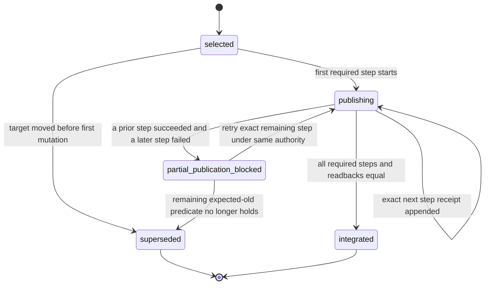
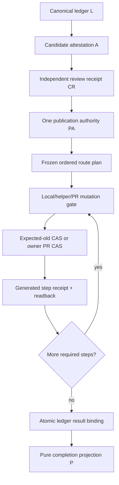
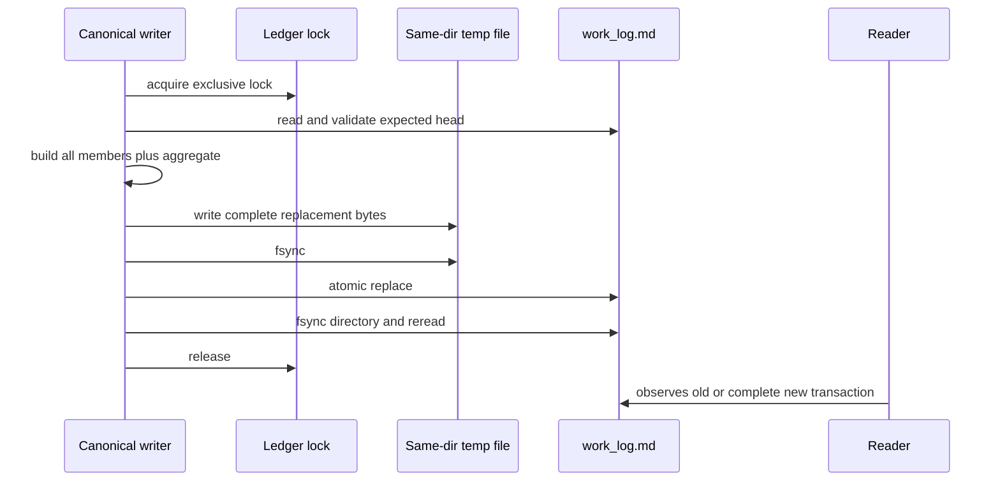

# W2 F1-F6 Repair Design v6

## Reader Map

This artifact is the append-only v6 design revision for the W2 completion
authority responsibility unit. It repairs exactly the three findings in the
independent v5 recheck. It does not authorize source, test, owner-document,
hook, formatter implementation, CI, or dynamic-graph changes.

Read in this order:

1. `Structure Contract And Static Source-Truth Graph` fixes the document unit,
   source anchors, and reader order.
2. `Request Clauses` and `Owner Surfaces` fix the requested boundary.
3. `Normative Incorporation Of v5` identifies retained and replaced contracts.
4. `Selected Architecture` defines publication-route closure, the atomic
   ledger transaction, and the exhaustive formatter record union.
5. `Abstract Design Frame` states the replaceable responsibility unit.
6. `Implementation Source Packet` binds predecessor and review evidence and
   fixes the total static publication-route inventory.
7. `Design Side-Effect Map`, `Exact Dependency-Header Closure`, and
   `Design-to-Implementation Trace` define the future implementation packet.
8. `Exact Acceptance Predicates` is the independent-review oracle.

The implementation packet is the union of v3, v4, v5, and this v6 artifact.
When text conflicts, v6 replaces v5, v5 replaces v4, and v4 replaces v3. All
non-conflicting clauses remain normative.

This artifact intentionally contains no identity for its own containing commit,
tree, Git blob, or complete-file SHA256. Those values are external readback
evidence only.

## Structure Contract And Static Source-Truth Graph

```text
structure_kind=document
audience=independent detailed-design reviewer and later implementation owner
decision_context=whether W2 F1-F6 is implementation-ready after v5 REVISE
first_artifact=table R1-R3 source-to-closure map
first_artifact_question=does every review finding have one exact owner, mechanism, public oracle, and non-regression boundary
visual_plan=mermaid for publication routing and atomic ledger visibility
document_unit=owner W2 design author; reader independent reviewer/implementer; source map v5 plus v5 recheck plus canonical owner paths; validation static Markdown/Git/hash; update cadence append-only review successor; canonical parent v5; downstream independent v6 review
document_split_decision=split:append-only v6 has a new independent review identity and the fixed-byte review request has a separate downstream reviewer-input responsibility
metric_or_delta_contract=three findings closed; zero source authorization; zero weakening of retained v5 passes
invalid_interpretations=v6 is not implementation approval, not a compatibility route, not a direct merge/push exception, and not a hand-written pass artifact
validation_gate=independent detailed-design recheck over fixed design bytes
```

Static source-truth anchors and typed relations:

| Anchor | Source truth | Typed relation | v6 conclusion |
| --- | --- | --- | --- |
| `R1` | v5 recheck V5-R1 and total static merge/push/PR inventory | `requires` publication owner closure; `limits` ordinary mutation | one authority and one CAS mutation unit cover every active W2 target route |
| `R2` | v5 recheck V5-R2 and current one-event `work_log.py` append | `requires` atomic visibility; `contrasts` sequential append | one rename-linearized ledger transaction publishes members and aggregate together |
| `R3` | v5 recheck V5-R3 and retained v3 formatter schema | `requires` exhaustive tagged union; `supports` validation honesty | all five record variants have one exact key set and status-specific equality |
| `PRESERVE` | v5 pass findings | `constrains` R1-R3 repair | candidate/review/publication, immutable B/intent, CAS, D2/D3/F1/F2 remain unchanged |

No dynamic graph was generated. This table is the static DSL projection used
because Python and dynamic-graph execution are explicitly out of scope.

## Request Clauses

| Clause | Required closure |
| --- | --- |
| V6-R1 | Make expected-old-OID publication the exclusive active-W2 path across branch, main, remote, PR, automation, helper, shim, hook, caller, header, test, and documentation surfaces. |
| V6-R2 | Remove pending-event/aggregate creation-order circularity with one exact atomic durable transaction and recovery contract. |
| V6-R3 | Define an exhaustive five-member formatter record union, including exact deferral and profile-exclusion evidence. |
| PRESERVE | Preserve every v5 pass and all non-conflicting v3/v4/v5 contracts. |

## Owner Surfaces

| Surface | Exact ownership |
| --- | --- |
| `agents/COMMUNICATION_PROTOCOL.md` | Ledger transaction, canonical event, formatter record, and artifact evidence schemas. |
| `agents/canonical/CODEX_WORKFLOW.md` | Active-W2 detection, publication owner, route state, mutation prohibition, and typed recovery. |
| `documents/BRANCH_SCOPE.md` | Durable branch, push, merge, main-integration, and scope-split contract. |
| `documents/REVIEW_PROCESS.md` | Independent candidate review and publication-result review policy. |
| `agents/workflows/main-integration-workflow.md` | Main-target route and structural integration sequence. |
| `agents/workflows/agent-canon-pr-workflow.md` | AgentCanon branch publication, PR creation, automation, and merge route. |
| `agents/workflows/pr-queue-cleanup-workflow.md` | Ordered PR merge and dependent pin queue route. |
| `agents/skills/pr-processing.md` | Human-facing PR mutation sequence and authority. |
| `.agents/skills/pr-processing/SKILL.md` | Runtime PR-processing shim. |
| `agents/skills/catalog.yaml` | Public PR-processing skill registry and routing. |
| `tools/agent_tools/publication_integrator.py` | Single future active-W2 mutation unit for local refs, remotes, and PR owner APIs. |
| `tools/agent_tools/github_publish.py` | Verified-remote branch/PR entrypoint; delegates active W2 and cannot mutate it directly. |
| `tools/agent_tools/work_log.py` | Atomic canonical ledger transaction writer and reader. |
| `tools/agent_tools/workflow_monitor.py` | Structured transaction/member ingress without independent append authority. |
| `tools/agent_tools/report_artifact_checks.py` | Read-only public recomputation of publication, transaction, formatter, and completion facts. |
| `.codex/hooks/branch_worktree_guard.py` and `.codex/hooks/hook_dispatcher.py` | Interactive direct-command fail-closed guard; never publication authority. |

Run-local artifacts remain evidence. No run-local report becomes an upstream
dependency of durable canon.

## Normative Incorporation Of v5

Retained unchanged:

- pre-review owner-attested `InterfaceCandidateAttestation`;
- immutable candidate B and immutable candidate ref;
- independent `InterfaceCandidateReviewReceipt` bound to attestation hash and
  B;
- post-APPROVE publication authority derived from attestation, approving
  receipt, and target tuple;
- exact canonical Git tree-delta serialization and byte range;
- `parent(B) == S`, interface-only changed path, modes/blobs, and outside-tree
  equality;
- immutable `IntentRevisionRecord` list and one current pointer;
- one run/context/logical aggregate key;
- pending-to-pass/fail as new immutable canonical events;
- exact expected-old-OID CAS, generated receipt, and post-update readback;
- convention-consistency closure;
- D2 canonical branch reason;
- D3 per-member source resolution and exact cross-member equality;
- F1 ledger sole authority and pure projection;
- F2 per-member owner/responsibility/outcome/evidence correspondence;
- exact freeze/topology/repair/escalation predicates;
- non-self-reference;
- no compatibility selector or test-only production API;
- pending/deferred validation honesty.

Replaced:

1. v5 route-specific publication object is replaced by one authority containing
   an ordered local/remote/PR route plan and exclusive mutation gate.
2. v5 local checked-out-target allowance is deleted. An active W2 local target
   ref must be absent from every checked-out worktree.
3. v5 sequential canonical event/aggregate append assumptions are replaced by
   one atomic `ledger-transaction.v1` record.
4. v5 formatter examples are replaced by the exhaustive fixed-key union below.

## Selected Architecture

### One canonical publication authority

There is one authority schema for local target refs, remote refs, and GitHub PR
merges:

```json
{
  "schema": "agent-canon.publication-authority.v3",
  "schema_version": 3,
  "publication_id": "w2-publication:<aggregate-sha256>:1",
  "state": "selected",
  "selection_version": 1,
  "selection_owner": "<completion_authority.source_binding.parent>",
  "candidate_authority": {
    "attestation_id": "<current attestation ID>",
    "attestation_body_sha256": "<attestation body SHA256>",
    "candidate_ref": "<immutable candidate ref>",
    "candidate_commit": "<B>",
    "candidate_tree": "<B tree>"
  },
  "approving_review": {
    "receipt_id": "<approving receipt ID>",
    "receipt_body_sha256": "<receipt body SHA256>",
    "path": "<review receipt path>",
    "sha256": "<review file SHA256>",
    "blob": "<review Git blob>",
    "owner": "ship_reviewer",
    "decision": "APPROVE"
  },
  "source": {
    "commit": "<S>",
    "tree": "<S tree>"
  },
  "route_plan": {
    "schema": "agent-canon.publication-route-plan.v1",
    "route_kind": "local_ref",
    "repository_id": "agent-canon",
    "transaction_id": "publication-route:<first-16-selection-seed>:1",
    "steps": [
      {
        "ordinal": 1,
        "step_id": "publication-step:<transaction-id>:1",
        "step_kind": "local_target_cas",
        "target_repository_id": "agent-canon",
        "target_remote": null,
        "target_ref": "refs/heads/<exact target>",
        "expected_old_oid": "<G_expected>",
        "expected_old_tree": "<G_expected tree>",
        "result_constraint": {
          "kind": "prebuilt_commit",
          "commit": "<I>",
          "tree": "<I tree>",
          "ordered_parents": ["<ordered parent OIDs>"],
          "delta_sha256": "<canonical target-to-I delta>"
        },
        "pr_binding": null,
        "required": true
      }
    ]
  },
  "selection_sha256": "<64 lowercase SHA256>",
  "owner_attestation": {
    "scheme": "agent-canon-ledger-publication-authority-v3",
    "owner": "<selection owner>",
    "authority_event_id": "<containing aggregate event ID>",
    "authority_revision": 1,
    "candidate_attestation_sha256": "<same candidate hash>",
    "approving_receipt_body_sha256": "<same receipt hash>",
    "route_plan_sha256": "<route plan hash>",
    "selection_sha256": "<same selection hash>",
    "status": "frozen"
  },
  "completed_steps": [],
  "result": null
}
```

`route_plan_sha256` is RFC-8785/SHA256 over the complete `route_plan`.
`selection_sha256` is RFC-8785/SHA256 over `candidate_authority`,
`approving_review`, `source`, and `route_plan`. Neither hash includes itself.

Allowed route plans are closed:

| `route_kind` | Exact ordered step kinds |
| --- | --- |
| `local_ref` | `local_target_cas` |
| `remote_ref` | `remote_target_lease` |
| `local_then_remote` | `local_target_cas`, `remote_target_lease` |
| `github_pr` | `remote_candidate_lease`, `github_pr_bind`, `github_pr_merge_cas` |

No omitted, repeated, reordered, optional, or unknown step is allowed.
`required` is exactly `true` for every step.

Step result constraints:

- `local_target_cas` and `remote_target_lease` use
  `kind=prebuilt_commit`; I is constructed and verified before mutation.
- `remote_candidate_lease` uses `kind=immutable_candidate`; result commit/tree
  are exactly B/B-tree.
- `github_pr_bind` uses `kind=pr_identity`; it binds one repository, PR number
  or create-if-absent token, base ref/OID, head ref/OID B, and publication
  selection hash.
- `github_pr_merge_cas` uses `kind=server_result_constraint`; commit is unknown
  before the owner API call, but expected base OID, expected reviewed head B,
  mode, exact result tree/delta predicates, and ordered-parent predicates are
  frozen. The returned I must satisfy them.

Every later aggregate revision repeats the selected candidate, review, source,
route plan, hashes, and owner attestation byte-for-byte.

### Active-W2 target resolver and exclusive mutation gate

The canonical mutation resolver is:

```python
def resolve_active_publication_authority(
    workspace: Path,
) -> dict[str, object] | None:
    ...

def integrate_selected_publication(
    workspace: Path,
) -> dict[str, object]:
    ...
```

The mutating API accepts no report directory, B, source, target, ref, mode,
selection hash, expected OID, PR number, result, or receipt override.

Resolution order:

1. Resolve the canonical active run pointer owned by the workflow.
2. Read the selected ledger head L.
3. Select exactly one active `completion_authority` with
   `publication_authority.state` in `selected`, `publishing`, or
   `partial_publication_blocked`.
4. Validate aggregate identity, current intent, candidate attestation,
   independent APPROVE receipt, route plan, owner attestation, and hashes.
5. Return `None` only when no active W2 publication exists.
6. Missing/malformed active-run projection, more than one matching authority,
   stale route state, or a projection/ledger mismatch fails closed.

All ordinary mutation owners call this resolver before constructing a merge,
moving a local ref, pushing a remote ref, creating/updating an active W2 PR, or
invoking merge automation.

For an active W2 authority:

- the caller delegates to `integrate_selected_publication`; or
- it returns `integration_ordinary_update_forbidden` before mutation.

No `--allow-main`, force flag, user-task text, branch name, current HEAD, PR
context, hook skip, maintainer mode, compatibility wrapper, or direct shell
command disables this rule.

For no active W2 authority, existing non-W2 behavior remains owned by its
current workflow. v6 does not convert unrelated repository publication into W2.

Stable resolver failures:

- `publication_route:active_run_pointer_missing`
- `publication_route:active_run_pointer_mismatch`
- `publication_route:authority_missing`
- `publication_route:authority_multiple`
- `publication_route:authority_stale`
- `publication_route:route_plan_hash_mismatch`
- `publication_route:selection_hash_mismatch`
- `publication_route:operation_not_in_plan`
- `publication_route:step_order_mismatch`
- `publication_route:step_already_completed_mismatch`
- `integration_ordinary_update_forbidden`

### Publication route state machine



Rules:

1. Step receipts append in route-plan ordinal order.
2. A step starts only when every earlier required step has an exact success
   receipt and readback.
3. Failure before any mutation leaves state `selected` or moves it to
   `superseded`.
4. Failure after one required external mutation is
   `partial_publication_blocked`; no success projection is allowed.
5. A partial transaction retries only the exact first incomplete step with the
   same authority and expected-old identity.
6. If that expected-old identity changed, a new candidate/review/publication
   transaction is required as defined by v5.
7. No rollback push, force reset, ordinary merge, or hand-written completion is
   synthesized.

### Local target CAS and checked-out-target behavior

An active W2 local target ref must not be checked out in any worktree.

The integrator enumerates Git worktrees from the repository's Git common
directory and compares every exact `branch refs/heads/...` record with the
target ref.

Pass if and only if:

- no worktree record names the target ref;
- the current checkout remains on a source or integration branch different
  from the target;
- every worktree index/worktree is unchanged by the transaction;
- the target ref final readback equals `G_expected`;
- I is constructed in the object database;
- `git update-ref <target_ref> <I> <G_expected>` succeeds; and
- post-CAS target ref/tree readback equals I/I-tree.

If any worktree has the target checked out, the integrator stops before object
construction with:

`integration_target_checked_out:<worktree-path>`.

The design deliberately chooses refusal rather than index/worktree
synchronization. Therefore the CAS cannot leave a checked-out worktree's HEAD,
index, or files detached from its branch ref.

After a successful transaction, a later explicit checkout of the target is a
normal materialization action outside the publication linearization. It cannot
change or repair publication evidence.

### Remote branch and main publication

A remote ref step uses:

```text
git push --force-with-lease=<target-ref>:<expected-old-oid> \
  <verified-remote> <result-oid>:<target-ref>
```

Exact predicates:

1. Remote repository identity is verified by the canonical GitHub/remote owner.
2. The full target ref, expected old OID, result OID, route-plan step, and
   selection hash come only from the authority.
3. `expected-old-oid` equals the final pre-push remote readback.
4. A lease failure is `integration_target_moved`.
5. Post-push `ls-remote` or owner API readback equals the exact result OID.
6. Ordinary `git push`, implicit lease, branch-name-only push, `--force`,
   `--force-with-lease` without exact OID, literal URL push, or `--allow-main`
   bypass is forbidden.

`github_publish.py push` and the push phase of `publish-pr` delegate active W2
steps to the integrator. Their summary contains the selection hash, route
transaction ID, step ID, expected old OID, result OID, receipt path/hash/blob,
and post-push readback. They do not execute their current ordinary push command
for an active W2 target.

### GitHub PR publication and merge

The `github_pr` route is exact:

1. `remote_candidate_lease` publishes immutable B to the frozen head ref with
   an exact expected-old lease.
2. `github_pr_bind` creates or updates one PR only after rereading:
   - repository identity;
   - base full ref and expected base OID `G_expected`;
   - head full ref and exact B OID;
   - selection hash;
   - PR number or exact create-if-absent state.
3. The PR body/run evidence records the selection hash, candidate attestation
   hash, review receipt hash, expected base/head OIDs, route transaction ID,
   and blocked/ready state.
4. `github_pr_merge_cas` calls only an owner API that atomically enforces:
   - exact repository;
   - exact PR identity;
   - exact base ref and `G_expected`;
   - exact reviewed head ref and B;
   - exact merge mode; and
   - current required-check/review authority.
5. If the owner API cannot enforce both expected base and expected head, the
   route returns `integration_pr_cas_unsupported` without merge.
6. The returned I is read back from the base ref and verified against the
   frozen parent/tree/delta constraints.
7. The generated CAS receipt and later result binding use that actual I.

`github_pr_automation_when_green` is not an alternate authority. It is usable
only when the visible automation request and result expose:

- `PUBLICATION_SELECTION_SHA256`;
- `PUBLICATION_ROUTE_TRANSACTION_ID`;
- `PUBLICATION_EXPECTED_BASE_OID`;
- `PUBLICATION_EXPECTED_HEAD_OID`;
- `PUBLICATION_RESULT_OID`;
- `PUBLICATION_RECEIPT_PATH`;
- `PUBLICATION_RECEIPT_SHA256`;
- `PUBLICATION_RECEIPT_BLOB`; and
- `PUBLICATION_POST_MERGE_BASE_OID`.

Missing fields or mismatched OIDs leave the PR typed blocked.

Conflict repair by `git merge origin/<base>` is forbidden when the PR head is
attested immutable B or when the head ref is an active route-plan endpoint.
Repair requires a new source freeze, candidate, attestation, review, and
publication authority.

Stable PR failures:

- `publication_pr:binding_missing`
- `publication_pr:binding_mismatch`
- `publication_pr:base_oid_mismatch`
- `publication_pr:head_oid_mismatch`
- `publication_pr:selection_hash_mismatch`
- `publication_pr:candidate_immutable`
- `publication_pr:automation_fields_missing`
- `publication_pr:automation_receipt_mismatch`
- `integration_pr_cas_unsupported`
- `integration_pr_expected_base_mismatch`
- `integration_pr_expected_head_mismatch`
- `integration_post_cas_ref_mismatch`

### Complete ordinary publication-route closure

Every production route discovered by total static enumeration is classified
below.

| Route surface | Existing mutation | Active W2 v6 contract |
| --- | --- | --- |
| `documents/BRANCH_SCOPE.md` | ordinary branch push, merge, fast-forward | owner text delegates active W2 to the integrator and forbids direct commands |
| `agents/workflows/main-integration-workflow.md` | `git merge --no-ff`, later main fast-forward | active W2 constructs I directly and CAS-updates an un-checked-out target; ordinary commands are non-W2 only |
| `agents/workflows/agent-canon-pr-workflow.md` | branch push, PR automation merge, current-checkout merge | active W2 uses route-plan steps and exact automation fields |
| `agents/workflows/pr-queue-cleanup-workflow.md` | source/dependent PR merge | active W2 merge delegates to PR CAS or remains blocked |
| `agents/skills/pr-processing.md` | conflict merge and PR merge | immutable B cannot be conflict-merged; merge gate requires publication tuple |
| `.agents/skills/pr-processing/SKILL.md` | runtime PR mutation guidance | same canonical route; no direct GitHub merge |
| `agents/skills/catalog.yaml`, `agents/skills/README.md`, `.codex/config.toml` | skill discovery/routing | route and shim remain one owner; no alternate skill entry |
| `tools/agent_tools/github_publish.py` | ordinary `git push`; PR create/update | delegates active W2 remote/PR steps before mutation |
| `tools/push_origin.sh` | retired shell entry | remains fail-only and points to canonical tool; never delegates to raw push |
| `tools/update_agent_canon.sh` | current-branch ordinary merge and internal pushes | before an active W2 endpoint mutation, delegate or fail; immutable B cannot be merged |
| `tools/sync_agent_canon.sh push` | direct branch/main remote push | active W2 endpoint delegates or fails before push |
| `tools/agent_tools/agent_update_branch.sh` | direct update-branch push | active W2 endpoint delegates or fails |
| `tools/agent_tools/persist_agent_memory.py` | caller-selected branch push | active W2 endpoint delegates or fails; memory persistence cannot publish W2 |
| `tools/experiments/publish_result_branch.py` | local `update-ref` and optional push | `experiment-results/*` remains a separate owner; any collision with an active W2 endpoint fails before update |
| `.codex/hooks/branch_worktree_guard.py` | interactive Git mutation classification | blocks raw active-W2 merge/push/update and allows only the integrator entrypoint |
| `.codex/hooks/hook_dispatcher.py` | currently skips simple push/publish tools | active W2 push is no longer an unconditional skip; it routes through the critical guard |
| `agents/workflows/codex-goals-workflow.md`, `tools/agent_tools/goal_loop.py` | GitHub automation authority | automation carries exact publication fields or remains blocked |
| `.github/PULL_REQUEST_TEMPLATE.md`, `.github/PULL_REQUEST_TEMPLATE/agent_canon.md` | PR mutation/automation evidence | add exact publication tuple and receipt fields |

Explicitly disjoint routes:

| Surface | Exclusion proof |
| --- | --- |
| `tools/agent_tools/runtime_log_archive_git.py` | operates a separate archive repository identity and only `logs/<repo-key>` refs; it cannot equal the W2 repository/target tuple |
| `tools/ci/check_fresh_clone.sh` | pushes only fixture remotes created by the test; it is not a production publication owner |
| runtime log, eval, and hook archive sync | separate repository/namespace and never a W2 target |

An exclusion is validated by exact repository identity and full ref namespace,
not by filename or prose intent. A mismatch fails closed if the route attempts
to address an active W2 endpoint.

### Atomic canonical ledger transaction

Sequential append is replaced by one logical and physical transaction record.
The record is stored as one line:

```text
- ledger_transaction=<RFC-8785 canonical JSON bytes>\n
```

The exact transaction object is:

```json
{
  "schema": "agent-canon.ledger-transaction.v1",
  "schema_version": 1,
  "transaction_id": "ledger-transaction:<aggregate-sha256>:1",
  "transaction_ordinal": 1,
  "transaction_kind": "aggregate_bootstrap",
  "run_id": "<run_id>",
  "context_id": "<context_id>",
  "aggregate_identity": "<aggregate identity>",
  "expected_head": {
    "previous_transaction_id": null,
    "previous_aggregate_event_id": null,
    "previous_aggregate_revision": 0,
    "base_ledger_digest": "<64 lowercase SHA256>"
  },
  "target_head": {
    "aggregate_event_id": "completion-authority:<aggregate-sha256>:1",
    "aggregate_revision": 1,
    "current_intent_revision_id": "<intent revision ID>"
  },
  "members": [
    {
      "ordinal": 1,
      "member_kind": "intent_revision",
      "member_id": "<intent revision ID>",
      "member_sha256": "<member body SHA256>",
      "body": {}
    },
    {
      "ordinal": 2,
      "member_kind": "canonical_evidence_event",
      "member_id": "<canonical formatter pending event ID>",
      "member_sha256": "<member body SHA256>",
      "body": {}
    },
    {
      "ordinal": 3,
      "member_kind": "canonical_evidence_event",
      "member_id": "<selected static pending event ID>",
      "member_sha256": "<member body SHA256>",
      "body": {}
    },
    {
      "ordinal": 4,
      "member_kind": "completion_authority",
      "member_id": "completion-authority:<aggregate-sha256>:1",
      "member_sha256": "<member body SHA256>",
      "body": {}
    }
  ],
  "member_count": 4,
  "result_ledger_digest": "<64 lowercase SHA256>",
  "transaction_body_sha256": "<64 lowercase SHA256>"
}
```

No member body contains `transaction_body_sha256` or the containing file
SHA/blob/commit/tree.

Identifiers and hashes:

1. `transaction_id` is deterministic from aggregate SHA256 and positive
   `transaction_ordinal`.
2. The first transaction ordinal is 1; each later transaction increments by
   exactly one.
3. Each `member_sha256` is RFC-8785/SHA256 over the complete member `body`.
4. Member IDs are deterministic without the transaction hash.
5. `members` is an ordered array with contiguous positive ordinals.
6. `member_count` exactly equals its length.
7. `base_ledger_digest` is the prior committed logical-ledger digest. For the
   first transaction it is the digest of the same stream below with
   `record-count=0000000000000000` and no `record=` rows.
8. `result_ledger_digest` is SHA256 over this exact byte stream:

```text
agent-canon.logical-ledger-digest.v1\0
record-count=<16 lowercase ASCII hex>\0
for every prior committed logical-record digest in canonical order:
record=<64 lowercase ASCII hex>\0
for every new member_sha256 in member ordinal order:
record=<64 lowercase ASCII hex>\0
end\0
```

Prior canonical order is transaction ordinal, then member ordinal. The hash
range includes the NUL in `end\0` and has no trailing byte.

9. `transaction_body_sha256` is RFC-8785/SHA256 over the complete transaction
   object without `transaction_body_sha256`.
10. The aggregate member may contain deterministic
    `creation_transaction_id=transaction_id`; this is non-circular because the
    transaction ID is not derived from the transaction body hash.

### Legal within-transaction reference order

The transaction validator resolves references against:

`prior committed objects ∪ all members in the candidate transaction`.

Visibility remains all-or-nothing. Member ordinal is validation order, not
partial publication.

Exact member orders:

| Transaction kind | Ordered members |
| --- | --- |
| `aggregate_bootstrap` | new intent row; canonical formatter pending; selected non-Python static pending; aggregate full snapshot |
| `aggregate_revision_with_pending` | optional new intent row; two pending events in formatter ordinal order; aggregate full snapshot |
| `aggregate_revision_with_terminal_decision` | deferral/not-applicable authority artifacts already exist; terminal events in formatter ordinal order; aggregate full snapshot |
| `formatter_terminal_settlement` | pass/fail events in formatter ordinal order; successor aggregate full snapshot |
| `publication_state_transition` | publication/receipt event members in route-step order; successor aggregate full snapshot |

For `formatter_terminal_settlement`, a terminal event retains the pending
event's `subject_aggregate_revision=n`. The successor aggregate snapshot is
revision `n+1` and advances the current formatter record pointer to that event.
Thus pending and terminal events retain one event key/revision while the
immutable aggregate history advances legally.

The `aggregate_revision_ahead` rule has one exact exception: an event may bind
the transaction's `target_head.aggregate_revision` when the same transaction
contains the exact aggregate member and validates all reciprocal references.
Any reference to a later revision outside the same transaction still fails.

### Atomic file protocol

The storage path remains `<report_dir>/work_log.md`. All writers of that file,
including ordinary work-log entries, use the same lock.

Exact protocol:

1. Open `<report_dir>/.completion_authority.ledger.lock` with
   `O_CREAT|O_RDWR`, mode `0600`.
2. Acquire the lock with non-blocking exclusive semantics
   (`LOCK_EX|LOCK_NB`). If another compliant writer holds it, fail
   `ledger_transaction:lock_busy`. Hold it until post-rename readback and
   directory fsync finish.
3. Read the complete current `work_log.md` bytes once under lock. Record inode,
   size, complete-file SHA256, last transaction ID, aggregate revision, and
   logical-ledger digest.
4. Validate `expected_head` against that read.
5. Build and fully validate every member, all within-transaction references,
   member hashes, result digest, and transaction hash in memory.
6. Construct the exact replacement bytes as:
   - existing bytes unchanged;
   - if `work_log.md` is absent, the exact UTF-8/LF bootstrap bytes
     `# Work Log\n\n- Run ID: <run-id>\n- Task:\n- Owner:\n\n## Purpose\n\n- Chronological run-local work log.\n\n## Entries\n\n## Ledger Events\n`;
   - one newline only if existing bytes do not end in LF;
   - the exact transaction line; and
   - one terminal LF.
7. Create a same-directory temporary file named
   `.work_log.md.<transaction-id-sha256>.tmp` with `O_CREAT|O_EXCL`.
8. Write all replacement bytes, preserve the existing file mode or use `0644`
   for first creation, flush, and `fsync` the temporary file descriptor.
9. Re-stat and re-hash the current `work_log.md` under lock. If it differs from
   step 3, delete the temporary file and fail.
10. Atomically replace `work_log.md` with the temporary file on the same
    filesystem.
11. `fsync` the report-directory file descriptor to make the rename durable.
12. Reopen `work_log.md`; verify complete bytes, exactly one transaction ID,
    transaction body hash, member hashes/order, reciprocal references, target
    aggregate/current-intent pointers, and result-ledger digest.
13. Release the lock.

Readers ignore temporary files and read only `work_log.md`. Therefore they see
either the complete old file or the complete new file.

Unsupported advisory locking, same-filesystem atomic replace, file fsync, or
directory fsync is:

`ledger_transaction:atomicity_unsupported`.

### Rollback, crash, and retry semantics

- Failure before atomic replace deletes the temporary file and fsyncs the
  report directory. If deletion or directory fsync fails, return
  `ledger_transaction:rollback_durability_unknown`; the original
  `work_log.md` remains the only readable authority and no success is reported.
- A crash before replace exposes only the old file.
- A crash during replace exposes old or new complete bytes, never a valid
  partial transaction.
- After replace, no semantic rollback rewrites history. Recovery rereads.
- If the exact transaction ID and body hash are present, retry returns
  `already_committed` after full equality/readback.
- If the transaction ID exists with different bytes, fail
  `ledger_transaction:replay_conflict`.
- If the target aggregate revision is already owned by another transaction,
  fail `ledger_transaction:revision_conflict`.
- If directory fsync or post-readback is uncertain, report
  `ledger_transaction:durability_unknown`; no pass projection is produced.
- A physical duplicate transaction line is malformed ledger evidence even when
  the JSON bytes match.

Stable transaction failures:

- `ledger_transaction:lock_busy`
- `ledger_transaction:atomicity_unsupported`
- `ledger_transaction:head_conflict`
- `ledger_transaction:base_file_changed`
- `ledger_transaction:transaction_id_mismatch`
- `ledger_transaction:ordinal_regression`
- `ledger_transaction:ordinal_gap`
- `ledger_transaction:member_order_mismatch`
- `ledger_transaction:member_count_mismatch`
- `ledger_transaction:member_missing:<member_id>`
- `ledger_transaction:member_hash_mismatch:<member_id>`
- `ledger_transaction:reference_unresolved:<member_id>:<ref>`
- `ledger_transaction:aggregate_pointer_missing_event:<event_id>`
- `ledger_transaction:aggregate_pointer_hash_mismatch:<event_id>`
- `ledger_transaction:result_digest_mismatch`
- `ledger_transaction:transaction_hash_mismatch`
- `ledger_transaction:prepare_failed`
- `ledger_transaction:rename_failed`
- `ledger_transaction:rollback_durability_unknown`
- `ledger_transaction:durability_unknown`
- `ledger_transaction:post_readback_mismatch`
- `ledger_transaction:replay_conflict`
- `ledger_transaction:duplicate_physical_record`
- `ledger_transaction:revision_conflict`

### Exhaustive formatter record union

`formatter_static_events` remains an ordered array of exactly two records:

| Ordinal | `record_id` | `check_kind` |
| --- | --- | --- |
| 1 | `formatter-static:canonical_formatter` | `canonical_formatter` |
| 2 | `formatter-static:selected_non_python_static` | `selected_non_python_static` |

Every record has exactly this key set; missing or extra keys are invalid:

```json
{
  "schema": "agent-canon.formatter-static-event.v1",
  "record_id": "formatter-static:canonical_formatter",
  "ordinal": 1,
  "check_kind": "canonical_formatter",
  "status": "pending",
  "owner": "<source_binding.component_manager>",
  "subject_aggregate_revision": 1,
  "recorded_at_aggregate_revision": 1,
  "current_intent_revision_id": "<intent revision ID>",
  "current_intent_revision_sha256": "<intent row canonical SHA256>",
  "intent_fingerprint": "<current intent fingerprint>",
  "current_event_ref": "<canonical event ID>",
  "current_event_sha256": "<canonical event SHA256>",
  "actor": "<exact actor identity>",
  "authority": "completion_authority",
  "reason_code": "awaiting_execution",
  "reason_evidence_refs": [],
  "artifact_path": null,
  "artifact_sha256": null,
  "artifact_blob": null,
  "authority_artifact_path": null,
  "authority_artifact_body_sha256": null,
  "authority_artifact_sha256": null,
  "authority_artifact_blob": null,
  "completed_at_utc": null
}
```

The second record changes only the three literal identity fields and the
current event/evidence values. All keys remain present.

Common predicates:

1. Schema, record ID, ordinal, check kind, order, uniqueness, and owner retain
   the v3 literals.
2. `subject_aggregate_revision` equals the referenced event's aggregate
   revision.
3. `recorded_at_aggregate_revision` equals the aggregate snapshot containing
   the record and is not less than the subject revision.
4. Current intent ID/hash/fingerprint exactly equal the row selected by the
   containing aggregate.
5. Current event ID/hash exactly equal the selected unsuperseded event head.
6. Actor, authority, reason code, evidence refs, artifacts, and completion time
   exactly equal the status-specific event fields.
7. The object has no additional keys and no omitted nullable key.

The exact variants are:

#### `pending`

```json
{
  "status": "pending",
  "actor": "<source_binding.component_manager>",
  "authority": "completion_authority",
  "reason_code": "awaiting_execution",
  "reason_evidence_refs": [],
  "artifact_path": null,
  "artifact_sha256": null,
  "artifact_blob": null,
  "authority_artifact_path": null,
  "authority_artifact_body_sha256": null,
  "authority_artifact_sha256": null,
  "authority_artifact_blob": null,
  "completed_at_utc": null
}
```

The referenced event is canonical `pending`, has empty ordered evidence refs,
and omits event artifact/completion fields as defined by v5.

#### `pass`

```json
{
  "status": "pass",
  "actor": "<canonical event source_tool_id>",
  "authority": "validation_tool",
  "reason_code": "validation_pass",
  "reason_evidence_refs": ["<ordered non-empty event evidence refs>"],
  "artifact_path": "<event artifact path>",
  "artifact_sha256": "<event artifact SHA256>",
  "artifact_blob": "<event artifact blob>",
  "authority_artifact_path": null,
  "authority_artifact_body_sha256": null,
  "authority_artifact_sha256": null,
  "authority_artifact_blob": null,
  "completed_at_utc": "<event completion UTC>"
}
```

#### `fail`

```json
{
  "status": "fail",
  "actor": "<canonical event source_tool_id>",
  "authority": "validation_tool",
  "reason_code": "validation_fail",
  "reason_evidence_refs": ["<ordered non-empty event evidence refs>"],
  "artifact_path": "<event artifact path>",
  "artifact_sha256": "<event artifact SHA256>",
  "artifact_blob": "<event artifact blob>",
  "authority_artifact_path": null,
  "authority_artifact_body_sha256": null,
  "authority_artifact_sha256": null,
  "authority_artifact_blob": null,
  "completed_at_utc": "<event completion UTC>"
}
```

Deferral and profile-exclusion authority artifacts use this exact body:

```json
{
  "schema": "agent-canon.formatter-authority-evidence.v1",
  "schema_version": 1,
  "evidence_id": "formatter-authority:<event-id-sha256>",
  "evidence_kind": "user_deferral",
  "event_id": "<deterministic canonical event ID>",
  "aggregate_identity": "<aggregate identity>",
  "subject_aggregate_revision": 1,
  "recorded_at_aggregate_revision": 1,
  "current_intent_revision_id": "<intent revision ID>",
  "current_intent_revision_sha256": "<intent row canonical SHA256>",
  "intent_fingerprint": "<current intent fingerprint>",
  "check_kind": "canonical_formatter",
  "actor": "<exact authority actor>",
  "authority": "user_request",
  "reason_code": "explicit_user_deferral",
  "reason_evidence_refs": ["<ordered non-empty refs>"],
  "issued_at_utc": "2026-07-16T00:00:00Z",
  "canonical_sha256": "<64 lowercase SHA256>"
}
```

For profile exclusion, only these fields change:

- `evidence_kind=profile_exclusion`;
- actor equals the runtime-profile selection owner;
- `authority=runtime_profile`; and
- `reason_code=profile_exclusion`.

The body has no other keys. `canonical_sha256` is RFC-8785/SHA256 over the
complete object without `canonical_sha256`. The generated file contains this
object as canonical JSON plus one LF.

The corresponding canonical deferral/decision event has one exact
`authority_evidence` object:

```json
{
  "path": "<authority artifact path>",
  "body_sha256": "<authority artifact canonical SHA256>",
  "file_sha256": "<complete-file SHA256>",
  "blob": "<Git blob>",
  "actor": "<same actor>",
  "authority": "<same authority>",
  "reason_code": "<same reason code>",
  "reason_evidence_refs": ["<same ordered refs>"]
}
```

The formatter record copies these fields exactly. The authority artifact is
created and externally read back before the event/member transaction; it does
not point to an existing event object, only to the deterministic event ID.

#### `deferred_by_user`

```json
{
  "status": "deferred_by_user",
  "actor": "<exact actor from the canonical user request-clause event>",
  "authority": "user_request",
  "reason_code": "explicit_user_deferral",
  "reason_evidence_refs": [
    "<user request-clause event ID>",
    "<ordered additional deferral evidence refs>"
  ],
  "artifact_path": null,
  "artifact_sha256": null,
  "artifact_blob": null,
  "authority_artifact_path": "reports/agents/<run-id>/authority/formatter_static/<check-kind>/deferral_<event-id-sha256>.json",
  "authority_artifact_body_sha256": "<canonical authority body SHA256>",
  "authority_artifact_sha256": "<complete-file SHA256>",
  "authority_artifact_blob": "<Git blob>",
  "completed_at_utc": "<deferral event completion UTC>"
}
```

The authority artifact is generated from the canonical user request event. It
contains the event/intent/source/actor/authority/reason/evidence body and a
canonical body hash excluding that hash. It contains no complete-file SHA/blob
or containing Git identity. The record and event bind its external
path/body-hash/file-SHA/blob readback.

#### `not_applicable`

```json
{
  "status": "not_applicable",
  "actor": "<exact runtime-profile selection owner>",
  "authority": "runtime_profile",
  "reason_code": "profile_exclusion",
  "reason_evidence_refs": [
    "<runtime-profile selection event ID>",
    "<ordered profile evidence refs>"
  ],
  "artifact_path": null,
  "artifact_sha256": null,
  "artifact_blob": null,
  "authority_artifact_path": "reports/agents/<run-id>/authority/formatter_static/<check-kind>/profile_exclusion_<event-id-sha256>.json",
  "authority_artifact_body_sha256": "<canonical authority body SHA256>",
  "authority_artifact_sha256": "<complete-file SHA256>",
  "authority_artifact_blob": "<Git blob>",
  "completed_at_utc": "<decision event completion UTC>"
}
```

The authority artifact is generated by the canonical runtime-profile owner and
binds the exact selected profile, excluded check kind, aggregate/current intent,
actor, reason code, and evidence refs.

No reason text fallback exists. Allowed `authority` and `reason_code` pairs are
exactly:

| Status | `authority` | `reason_code` |
| --- | --- | --- |
| `pending` | `completion_authority` | `awaiting_execution` |
| `pass` | `validation_tool` | `validation_pass` |
| `fail` | `validation_tool` | `validation_fail` |
| `deferred_by_user` | `user_request` | `explicit_user_deferral` |
| `not_applicable` | `runtime_profile` | `profile_exclusion` |

Transition rules:

- pending may transition only to pass or fail for the same event key.
- pass/fail are new immutable events and cannot return to pending.
- deferred and not-applicable are direct terminal events under a newly selected
  aggregate revision; they do not supersede a pending event.
- any later execution after deferral/exclusion starts a new aggregate revision
  and a new pending event key.
- all record pointer changes are published with their aggregate snapshot in one
  atomic ledger transaction.

`formatter_and_static_checks_pass` is true if and only if both exact ordered
records are valid and both statuses are `pass`.

Stable union failures:

- `formatter_static:key_set_mismatch:<check_kind>`
- `formatter_static:record_count`
- `formatter_static:record_order:<ordinal>`
- `formatter_static:record_identity_mismatch:<check_kind>`
- `formatter_static:status_invalid:<check_kind>:<status>`
- `formatter_static:owner_mismatch:<check_kind>`
- `formatter_static:subject_revision_mismatch:<check_kind>`
- `formatter_static:recorded_revision_mismatch:<check_kind>`
- `formatter_static:intent_pointer_mismatch:<check_kind>`
- `formatter_static:event_pointer_mismatch:<check_kind>`
- `formatter_static:event_hash_mismatch:<check_kind>`
- `formatter_static:actor_mismatch:<check_kind>`
- `formatter_static:authority_mismatch:<check_kind>`
- `formatter_static:reason_code_mismatch:<check_kind>`
- `formatter_static:reason_evidence_mismatch:<check_kind>`
- `formatter_static:artifact_required:<check_kind>`
- `formatter_static:artifact_forbidden:<check_kind>`
- `formatter_static:authority_artifact_required:<check_kind>`
- `formatter_static:authority_artifact_forbidden:<check_kind>`
- `formatter_static:authority_body_hash_mismatch:<check_kind>`
- `formatter_static:authority_file_hash_mismatch:<check_kind>`
- `formatter_static:authority_blob_mismatch:<check_kind>`
- `formatter_static:completed_at_required:<check_kind>`
- `formatter_static:completed_at_forbidden:<check_kind>`
- `formatter_static:schedule_equivalence_mismatch`

### Fixed-byte independent review request

After this design has passed the permitted formatter, its complete bytes are
frozen before the review request is authored.

The required request path is:

`reports/agents/convergence-w2-gates-completion-20260716/w2_detailed_design_recheck_request_v6.md`.

It contains:

- schema `agent-canon.fixed-byte-design-review-request.v1`;
- exact v6 design path;
- exact design byte size;
- exact design SHA256;
- exact design Git blob computed from those bytes;
- v5 predecessor commit/tree/path/SHA/blob/size;
- v5 recheck path/SHA/blob/size;
- exact three review findings and preserve list;
- exact changed path set expected for the design commit;
- required reviewer identity separation;
- decision enum `APPROVE|REVISE`;
- mismatch failure `review_target_identity_mismatch`; and
- an explicit statement that the request omits its own SHA/blob/containing
  commit/tree.

The request is formatted only after the design identities are frozen. A final
readback verifies the design identities did not change. The containing
commit/tree and review-request SHA/blob/size are external return values.

## Rejected Alternatives

- Updating a checked-out target ref and repairing its index/worktree afterward
  is rejected.
- Leaving raw merge/push documentation in place and relying on closeout failure
  is rejected.
- Treating `github_publish.py`, `--allow-main`, GitHub automation, PR skill,
  AgentCanon update wrappers, or direct shell as parallel publication owners is
  rejected.
- A hook-only prohibition is rejected because hooks are not durable authority.
- A sequential pending-event then aggregate append is rejected.
- An aggregate-first pointer to missing events is rejected.
- A temporary provisional event visible to ordinary readers is rejected.
- Rewriting or deleting a partially visible ledger append is rejected.
- A formatter union with omitted keys, free-form reasons, prose-only deferral,
  or null/missing event pointers is rejected.
- A hand-written deferral/pass artifact is rejected.
- A compatibility selector, caller-supplied B/target/selection, or test-only API
  is rejected.

## Abstract Design Frame

### Replaceable responsibility unit

D1-D5 and F1-F6 remain one replaceable `completion_authority` unit:

1. maintain one canonical ledger L, one aggregate key, immutable intent rows,
   and one current intent pointer;
2. publish canonical event/member sets and their aggregate snapshot through one
   atomic transaction;
3. derive every projection from L plus canonical Git/artifact readback;
4. attest immutable B before independent review;
5. derive one post-APPROVE publication authority;
6. route every active W2 local, remote, main, branch, PR, automation, helper,
   and interactive mutation through one ordered CAS plan;
7. refuse checked-out local targets;
8. bind each completed step to expected-old/result/post-readback identities;
9. model all formatter states with one exhaustive fixed-key record union;
10. preserve per-member source correspondence, exact group equality, topology,
    freeze, and durable dependency closure.

Replacing an implementation slice is valid only when every schema, hash range,
write order, route step, public signature, typed failure, dependency edge, and
negative oracle remains unchanged.

### Authority flow



No branch, main, remote, PR, automation, helper, hook, or skill owns an
alternate active-W2 mutation path.

### Ledger visibility flow



### Invariants

- L is sole authority.
- No active-W2 target mutation bypasses the publication integrator.
- One authority covers local refs, remotes, and PR route steps.
- Local target refs are never CAS-updated while checked out.
- A reader never observes a pending pointer without its event.
- An event never references a missing future aggregate.
- Every formatter record has exactly one allowed key set and event pointer.
- No node hashes its own complete bytes or containing Git identity.

### Non-goals

- No implementation or validation execution beyond permitted static/formatter
  checks in v6.
- No second ledger, new persistence service, cryptographic key service,
  worktree creation, compatibility path, or test-only selector.
- No semantic change to unrelated log/archive/result publication whose exact
  repository/ref identity is disjoint.

## Implementation Source Packet

### Bound predecessor and review identities

- Source predecessor commit:
  `80e63c4134058204e243c6140522d9e3671f9de6`
- Source predecessor tree:
  `5174b0dc1426e6afe8db78ba5f43a2320e79feef`
- v5 design commit:
  `1320951a179fbc63b7811535bb4c72813f31dedd`
- v5 design tree:
  `6c2eeaaf2c64cfdae34b5dadf7f7af9ebe60e299`
- v5 direct parent:
  `9825c7a67fc736c2ac40ef3e8ab0585e36bcf3cd`
- v5 design path:
  `reports/agents/convergence-w2-gates-completion-20260716/w2_f1_f6_repair_design_v5.md`
- v5 design byte size:
  `68970`
- v5 design SHA256:
  `a618735a229261fce21f9d790a933c357626e73cc82b55d4541687c0de2a0561`
- v5 design blob:
  `a5e70b6f1bc4d6cc51b9479079c2f6842d483af4`
- v5 independent REVISE path:
  `/mnt/l/workspace/agent-canon-convergence-w2-final-writer-owned/reports/agents/convergence-w2-gates-completion-20260716/w2_detailed_design_recheck_decision_1320951a.md`
- v5 recheck byte size:
  `12546`
- v5 recheck SHA256:
  `7f1110a9e0f273d3cdc36cb70f7462e6ec12192e2c48d6de7d1ff83a4d287e9d`
- v5 recheck blob:
  `3908c5f3972096e05502cd74a88f0dfd8f8f323a`

The decision is `REVISE` with exactly V5-R1, V5-R2, and V5-R3. It confirms v5
candidate authority, immutable intent, convention closure, D2/D3/F1/F2,
self-reference, immutable B, compatibility, and test-only API checks pass.

### Static publication-route inventory

Mandatory primary owner/implementation reads:

1. `agents/canonical/CODEX_WORKFLOW.md`
2. `documents/BRANCH_SCOPE.md`
3. `agents/workflows/main-integration-workflow.md`
4. `agents/workflows/agent-canon-pr-workflow.md`
5. `agents/workflows/pr-queue-cleanup-workflow.md`
6. `agents/skills/pr-processing.md`
7. `.agents/skills/pr-processing/SKILL.md`
8. `agents/skills/catalog.yaml`
9. `tools/agent_tools/github_publish.py`
10. `tools/update_agent_canon.sh`
11. `tools/sync_agent_canon.sh`
12. `tools/agent_tools/agent_update_branch.sh`
13. `tools/agent_tools/persist_agent_memory.py`
14. `tools/experiments/publish_result_branch.py`
15. `.codex/hooks/branch_worktree_guard.py`
16. `.codex/hooks/hook_dispatcher.py`
17. `tools/agent_tools/work_log.py`
18. `tools/agent_tools/report_artifact_checks.py`

Mandatory callers/docs/tests are all rows in the Side-Effect Map. No
implementation owner may shrink the packet to only the first direct push hit.

### Implementation boundary

Implementation remains blocked until an independent reviewer verifies the exact
v6 bytes from the fixed-byte review request and returns `APPROVE`.

No source begins from this design commit merely because it exists.

## Design Side-Effect Map

### Canonical schema and workflow owners

| Path | Exact future change | Finding | Gate |
| --- | --- | --- | --- |
| `agents/COMMUNICATION_PROTOCOL.md` | Add ledger transaction, fixed formatter union, authority-artifact, and within-transaction reference schemas. | R2/R3 | Schema-owner review |
| `agents/canonical/CODEX_WORKFLOW.md` | Add one authority/resolver, route plans, active-W2 mutation prohibition, checked-out refusal, partial route state, and recovery. | R1/R2 | Workflow-owner review |
| `documents/BRANCH_SCOPE.md` | Replace active-W2 ordinary push/merge/ff with mandatory integrator delegation and typed refusal. | R1 | Git owner review |
| `documents/REVIEW_PROCESS.md` | Review publication route plan, PR tuple, atomic transaction evidence, and complete formatter variants. | all | Review-owner review |
| `documents/dependency-manifest-design.md` | Apply existing exact bidirectional closure rules; no new semantics. | all | Dependency review |
| `agents/workflows/main-integration-workflow.md` | Use un-checked-out target CAS for active W2; retain ordinary workflow only for non-W2. | R1 | Main integration review |
| `agents/workflows/agent-canon-pr-workflow.md` | Bind push/PR/automation to selection hash, expected OIDs, receipt, and readback. | R1 | PR workflow review |
| `agents/workflows/pr-queue-cleanup-workflow.md` | Delegate active-W2 PR merges; preserve queue order and authority. | R1 | Queue workflow review |
| `agents/workflows/derived-agent-canon-diff-workflow.md` | Replace active-W2 direct merge/push examples with delegate-or-fail rule. | R1 | Workflow review |
| `agents/workflows/codex-goals-workflow.md` | Extend automation authority with exact publication tuple/result fields. | R1 | Goal workflow review |

### Skills, shims, catalogs, and templates

| Path | Exact future change | Finding | Gate |
| --- | --- | --- | --- |
| `agents/skills/pr-processing.md` | Prohibit immutable-B conflict merge and direct active-W2 merge; require publication CAS tuple. | R1 | Skill-owner review |
| `.agents/skills/pr-processing/SKILL.md` | Mirror canonical route; no direct GitHub merge command. | R1 | Runtime-skill review |
| `agents/skills/catalog.yaml` | Preserve one canonical doc/shim and route reason mentioning publication CAS for active W2. | R1 | Catalog review |
| `agents/skills/README.md` | Reader route points PR merge to canonical publication owner. | R1 | Docs review |
| `.codex/config.toml` | Registry path remains unchanged; verify no second PR-processing shim. | R1 | Runtime alignment |
| `agents/skills/agent-canon-update.md` | AgentCanon merge/push helpers delegate or fail on active W2 endpoints. | R1 | Skill review |
| `.agents/skills/agent-canon-update/SKILL.md` | Runtime commands carry the same active-W2 boundary. | R1 | Runtime-skill review |
| `.github/PULL_REQUEST_TEMPLATE.md` | Add publication selection/base/head/result/receipt fields when W2 applies. | R1 | Template review |
| `.github/PULL_REQUEST_TEMPLATE/agent_canon.md` | Add identical AgentCanon PR publication fields. | R1 | Template review |
| `agents/templates/change_review.md` | Review route-plan and transaction evidence. | all | Template review |
| `agents/templates/final_review.md` | Recompute every required step, transaction, formatter variant, and result. | all | Final-review gate |
| `agents/templates/closeout_gate.md` | Record derived receipts/readbacks only; no direct mutation identity input. | all | Closeout review |

### Production tools and guards

| Path | Exact future change | Finding | Gate |
| --- | --- | --- | --- |
| `tools/agent_tools/publication_integrator.py` | Single route resolver/mutator; local checked-out refusal; local/remote/PR step receipts. | R1 | Publication owner review |
| `tools/agent_tools/github_publish.py` | Resolve active authority before push/PR; delegate exact steps and emit tuple evidence. | R1 | Public tool tests |
| `tools/push_origin.sh` | Retain fail-only retired behavior and canonical pointer. | R1 | Shell review |
| `tools/update_agent_canon.sh` | Guard current-branch merge and push sites; immutable B fails; active endpoint delegates. | R1 | Shell/tool review |
| `tools/sync_agent_canon.sh` | Guard `push` action and direct-main exception before mutation. | R1 | Shell/tool review |
| `tools/agent_tools/agent_update_branch.sh` | Guard direct update-branch push. | R1 | Shell/tool review |
| `tools/agent_tools/persist_agent_memory.py` | Guard caller-selected branch push against active W2 endpoint. | R1 | Tool review |
| `tools/experiments/publish_result_branch.py` | Preserve result owner; reject any active-W2 endpoint collision before local ref update. | R1 | Tool review |
| `tools/agent_tools/goal_loop.py` | Carry exact GitHub automation publication fields and blocked state. | R1 | Goal tests |
| `.codex/hooks/branch_worktree_guard.py` | Detect active W2 and block raw merge/push/update-ref/PR merge. | R1 | Hook tests |
| `.codex/hooks/hook_dispatcher.py` | Remove unconditional active-W2 publish skip; invoke critical guard. | R1 | Hook tests |
| `tools/agent_tools/work_log.py` | Implement same-lock atomic transaction, member expansion, recovery, and idempotency. | R2/R3 | Ledger tests |
| `tools/agent_tools/workflow_monitor.py` | Pass one transaction/member packet; never append reciprocal records separately. | R2/R3 | Monitor tests |
| `tools/agent_tools/report_artifact_checks.py` | Recompute route closure, transaction integrity, and all formatter variants. | all | Public verifier tests |
| `tools/agent_tools/waterfall_gate_check.py` | Enforce active route/checkout/transaction preconditions. | all | Public gate tests |
| `tools/agent_tools/task_close.py` | Require complete route receipts, transaction readback, and exhaustive formatter projection. | all | Closeout tests |
| `tools/agent_tools/check_convention_compliance.py` | Check exact owner/shim/catalog/header/template/route markers. | R1 | Convention tests |
| `tools/agent_tools/tool_drift.py` | Select every direct mutation owner and publication dependency. | R1 | Drift tests |
| `tools/ci/check_github_workflows.py` | Validate automation expected-base/head/receipt fields. | R1 | Workflow tests |

### Documentation and tool catalogs

| Path | Exact future change | Finding | Gate |
| --- | --- | --- | --- |
| `documents/tools/github_publish.md` | Document delegate-or-fail behavior and summary fields. | R1 | Docs check |
| `documents/tools/README.md` | Route GitHub, AgentCanon update, sync, and retired shim through one authority. | R1 | Docs check |
| `tools/README.md` | Document publication integrator and guarded helpers. | R1 | Docs check |
| `tools/catalog.yaml` | Register publication integrator and link github-publish docs/tests/dependency. | R1 | Catalog check |
| `documents/FILE_CHECKLIST_OPERATIONS.md` | Replace active-W2 direct push closeout example with canonical route. | R1 | Docs review |
| `documents/agent-canon-github-remote.md` | Require exact lease/PR tuple for active W2. | R1 | Docs review |
| `documents/agent-canon-subtree-migration.md` | Bound merge/push wrappers by active W2 gate. | R1 | Docs review |
| `documents/agent-canon-parent-repo-latest-checklist.md` | Record delegate-or-fail requirement. | R1 | Docs review |
| `documents/agent-canon-update-route.md` | Add publication authority dependency for merge/push actions. | R1 | Docs review |
| `documents/server-host-contract.md` | Canonical GitHub publish statement gains active-W2 CAS boundary. | R1 | Docs review |
| `documents/worktree-lifecycle.md` | Main return route states target must not be checked out for W2 CAS. | R1 | Docs review |
| `.codex/README.md` | Hook boundary no longer says every simple push skips the critical active-W2 guard. | R1 | Docs/hook review |
| `agents/workflows/README.md` | Main/PR/update route index points to publication authority. | R1 | Workflow docs review |

### Tests

| Path | Exact future oracle | Finding |
| --- | --- | --- |
| `tests/agent_tools/test_publication_integrator.py` | route plans, checked-out refusal, local CAS, remote lease, PR API, partial state, receipts | R1 |
| `tests/agent_tools/test_github_publish.py` | active W2 delegation, no ordinary push, summary tuple, non-W2 preservation | R1 |
| `tests/agent_tools/test_work_log.py` | atomic bootstrap/retry/settlement, crash boundaries, replay, transaction/member/hash/pointer failures | R2/R3 |
| `tests/agent_tools/test_workflow_monitor.py` | transaction packet round trip and no split append | R2/R3 |
| `tests/agent_tools/test_report_artifact_checks.py` | route/transaction/formatter public recomputation | all |
| `tests/agent_tools/test_task_start_and_close.py` | final typed route/transaction/union failures | all |
| `tests/agent_tools/test_waterfall_gate_check.py` | checked-out target, ordinary route, pending transaction negatives | R1/R2 |
| `tests/agent_tools/test_check_convention_compliance.py` | exact owner/shim/catalog/header/doc/template closure | R1 |
| `tests/agent_tools/test_codex_hooks.py` | raw active-W2 push/merge blocked; integrator allowed | R1 |
| `tests/agent_tools/test_goal_loop.py` | automation tuple required and mismatch blocked | R1 |
| `tests/tools/test_check_github_workflows.py` | PR template/automation publication fields | R1 |
| `tests/tools/test_update_agent_canon.py` | active-W2 merge helper refusal/delegation | R1 |
| `tests/tools/test_publish_result_branch.py` | active-W2 endpoint collision fails before update | R1 |

No test is changed in v6. This table is future scope only.

## Exact Dependency-Header Closure

Core owner/implementation pairs:

| Forward owner line | Reverse consumer line |
| --- | --- |
| `documents/BRANCH_SCOPE.md`: `downstream implementation ../tools/agent_tools/publication_integrator.py enforces active-W2 local, remote, and PR publication CAS` | `publication_integrator.py`: `upstream design ../../documents/BRANCH_SCOPE.md owns branch, push, merge, and main publication policy` |
| `agents/canonical/CODEX_WORKFLOW.md`: `downstream implementation ../../tools/agent_tools/publication_integrator.py executes canonical completion-authority publication` | `publication_integrator.py`: `upstream design ../../agents/canonical/CODEX_WORKFLOW.md owns active-W2 publication authority and route state` |
| `agents/COMMUNICATION_PROTOCOL.md`: `downstream implementation ../tools/agent_tools/work_log.py stores atomic ledger transactions and formatter records` | `work_log.py`: `upstream design ../../agents/COMMUNICATION_PROTOCOL.md owns ledger transaction and formatter schemas` |
| `agents/workflows/agent-canon-pr-workflow.md`: retained github-publish upstream plus new publication-integrator upstream | `publication_integrator.py`: downstream caller/review edge to AgentCanon PR workflow |

Direct caller/reverse pairs:

- `github_publish.py` adds
  `upstream implementation ./publication_integrator.py delegates active-W2 branch and PR publication`.
- `publication_integrator.py` adds
  `downstream implementation ./github_publish.py exposes verified remote and PR publication`.
- `tools/update_agent_canon.sh` adds
  `upstream implementation agent_tools/publication_integrator.py guards active-W2 merge and publication`.
- `tools/sync_agent_canon.sh` adds the same relative upstream implementation
  edge for its push action.
- `tools/agent_tools/agent_update_branch.sh` adds
  `upstream implementation publication_integrator.py guards active-W2 branch publication`.
- `tools/agent_tools/persist_agent_memory.py` adds
  `upstream implementation ./publication_integrator.py guards active-W2 target collisions`.
- `tools/experiments/publish_result_branch.py` adds
  `upstream implementation ../agent_tools/publication_integrator.py guards active-W2 target collisions`.
- Each implementation path adds its exact downstream test edge; each test adds
  the matching relative upstream implementation edge.

Skill closure:

- `documents/BRANCH_SCOPE.md` retains and strengthens downstream edges to
  `agents/skills/pr-processing.md` and
  `.agents/skills/pr-processing/SKILL.md`.
- `agents/skills/pr-processing.md` retains canonical registry upstream and adds
  the publication owner/workflow upstream.
- `.agents/skills/pr-processing/SKILL.md` retains the canonical skill upstream
  and adds no second owner.
- `agents/skills/catalog.yaml` continues to map exactly one canonical doc and
  one shim.
- `.codex/config.toml` continues to register exactly that shim.

Hook closure:

- `.codex/hooks/hook_dispatcher.py` and
  `.codex/hooks/branch_worktree_guard.py` gain reciprocal implementation
  dependency lines for active-W2 direct-command classification.
- both retain downstream
  `tests/agent_tools/test_codex_hooks.py`; the test gains both reverse edges.
- `.codex/README.md` documents the same boundary and is not authority.

No dependency header points to this run-local v6 report or its review request.

## Design-to-Implementation Trace

| Slice | Responsibility derivation | Paths | Clause | Gate |
| --- | --- | --- | --- | --- |
| S1 Authority resolver | one active W2 authority, no identity override | workflow owner, integrator, report checks | R1 | owner/public tests |
| S2 Local target | refuse checked-out target; exact update-ref CAS | main workflow, integrator, hook | R1 | checked-out/CAS negatives |
| S3 Remote target | exact expected-old lease/readback | github publish, sync/update/branch helpers | R1 | remote race tests |
| S4 PR target | expected base/head owner API and visible receipt | PR workflows/skill/shim/goal/templates | R1 | PR public negatives |
| S5 Route closure | every ordinary caller delegates or fails | all R1 map rows | R1 | static total enumeration |
| S6 Atomic transaction | lock, members, fsync, replace, readback | protocol, work log, monitor | R2 | crash/replay tests |
| S7 Pending bootstrap | intent/events/aggregate visible together | work log, report checks | R2 | first/retry tests |
| S8 Formatter union | all five fixed-key records and authority artifacts | protocol, work log, report checks | R3 | exhaustive union tests |
| S9 Projection/closeout | pure recomputation; no stored success trust | report checks, task close, waterfall | all | public closeout tests |
| S10 Durable closure | exact headers/docs/catalogs/tests | checker/drift/docs paths | R1 | convention/dependency review |
| S11 Source freeze | freeze S1-S10 before candidate B | approved source commit/tree | all | external readback |

## Exact Acceptance Predicates

### V5-R1 publication/CAS route closure

Pass if and only if:

1. one `publication-authority.v3` object owns one closed ordered route plan;
2. local, remote, main, branch, and PR routes use that same authority;
3. every production mutation owner in the static inventory delegates active W2
   or fails before mutation;
4. no ordinary direct merge/push/ff/PR merge/automation path remains;
5. a local target is absent from every checked-out worktree;
6. local update uses exact expected-old `update-ref`;
7. remote update uses exact expected-old lease;
8. PR merge owner API enforces expected base and reviewed head or remains
   blocked;
9. every required step has exact receipt and post-update readback;
10. partial external publication cannot project success;
11. immutable B cannot be conflict-merged; and
12. callers, headers, tests, docs, skills, shims, catalogs, hooks, and templates
    match the Side-Effect Map.

### V5-R2 non-circular pending/aggregate creation

Pass if and only if:

1. first intent row, both pending events, and aggregate snapshot are members of
   one transaction;
2. within-transaction references resolve against the complete candidate member
   set;
3. no member is visible before atomic replace;
4. lock, expected head, same-directory temp, fsync, replace, directory fsync,
   and post-readback follow the exact protocol;
5. readers see old or complete new bytes;
6. retry is idempotent only for exact transaction identity/body;
7. conflict, interruption, malformed replay, pointer mismatch, and uncertain
   durability remain typed non-success;
8. new-revision pending retry uses the same mechanism; and
9. no event references an absent future aggregate.

### V5-R3 complete formatter record union

Pass if and only if:

1. the ordered array contains exactly two retained records;
2. every record has the exact fixed key set;
3. all five statuses are exhaustively dispatched;
4. event ID/hash, subject/recorded revision, current intent, owner, actor,
   authority, reason, evidence, artifacts, and completion time validate;
5. deferral binds generated user-authority evidence by body/file hashes and
   actor;
6. profile exclusion binds generated profile-authority evidence by body/file
   hashes and owner;
7. no free-form reason or omitted-field fallback exists;
8. transitions match the closed state rules; and
9. pass equivalence is true only for two exact pass records.

### Preserved contracts

- Candidate attestation precedes review.
- Review is independent and bound to immutable B.
- Publication authority exists only after APPROVE.
- Intent rows remain immutable with one pointer and one logical key.
- D2 branch reason remains
  `convergence_w2_gate_completion_authority`.
- D3 member correspondence/equality remains exact.
- F1/F2, freeze/topology, canonical tree delta, convention closure, and
  non-self-reference remain unchanged.
- No compatibility selector or test-only production API exists.

### Public typed negative-test plan

| Negative | Public boundary | Typed result |
| --- | --- | --- |
| Main workflow runs ordinary merge for active W2 | workflow/integrator gate | `integration_ordinary_update_forbidden` |
| `github_publish.py` executes ordinary push for active W2 | public tool | `integration_ordinary_update_forbidden` |
| `--allow-main` attempts bypass | public tool | `integration_ordinary_update_forbidden` |
| Raw `git push`/`git merge` under active W2 | critical hook | active-W2 mutation blocked |
| sync/update/agent-update/memory/result helper targets W2 ref | helper gate | delegate or typed forbidden/collision |
| Local target checked out in current or another worktree | integrator | `integration_target_checked_out:<path>` |
| Remote lease lacks exact old OID | integrator | `integration_ordinary_update_forbidden` |
| Remote moves after read | integrator | `integration_target_moved` |
| PR owner API lacks expected base/head | PR integrator | `integration_pr_cas_unsupported` |
| PR base or head changes | PR integrator | exact expected-OID failure |
| Automation omits selection/receipt fields | PR workflow | `automation_fields_missing` |
| Partial route later step fails | closeout | `partial_publication_blocked` |
| Sequential event append attempted | work-log public writer | transaction-required failure |
| Aggregate pointer references absent pending event | transaction validator | `aggregate_pointer_missing_event` |
| Pending event references future aggregate outside transaction | event validator | retained `aggregate_revision_ahead` |
| Interrupted before rename | transaction writer | old complete file remains |
| Interrupted after rename | recovery reader | old/new exact readback, never partial |
| Same transaction ID with changed bytes | transaction writer | `replay_conflict` |
| Duplicate physical transaction line | reader | `duplicate_physical_record` |
| Member missing/reordered/hash changed | transaction reader | exact member error |
| Deferred record omits authority artifact field | formatter consumer | `key_set_mismatch` or `authority_artifact_required` |
| Deferred actor/request evidence differs | formatter consumer | actor/reason-evidence mismatch |
| N/A profile owner/evidence differs | formatter consumer | authority/reason-evidence mismatch |
| Deferred/N/A supplies tool result artifact | formatter consumer | `artifact_forbidden` |
| Pending omits event pointer | formatter consumer | `event_pointer_mismatch` |
| Unknown/free-form status or reason | formatter consumer | status/reason-code mismatch |
| Hand-written pass/deferral evidence | closeout | non-canonical evidence failure |

### Validation honesty

- `oop_readability=pending`
- `solid_evidence=pending`
- `formatter=allowed_for_v6_markdown_only`
- `selected_non_python_static=pending`
- `targeted_tests=pending`
- `python_execution=deferred_by_user`
- `ci=deferred_by_user`
- `dynamic_graph=deferred_by_user`
- `dependency_graph_execution=deferred_by_user`
- `implementation_authorization=blocked_until_independent_v6_design_approval`

No source, Python, test, CI, or dynamic command is promoted to pass by this
design. No hand-written pass artifact may satisfy a gate.
