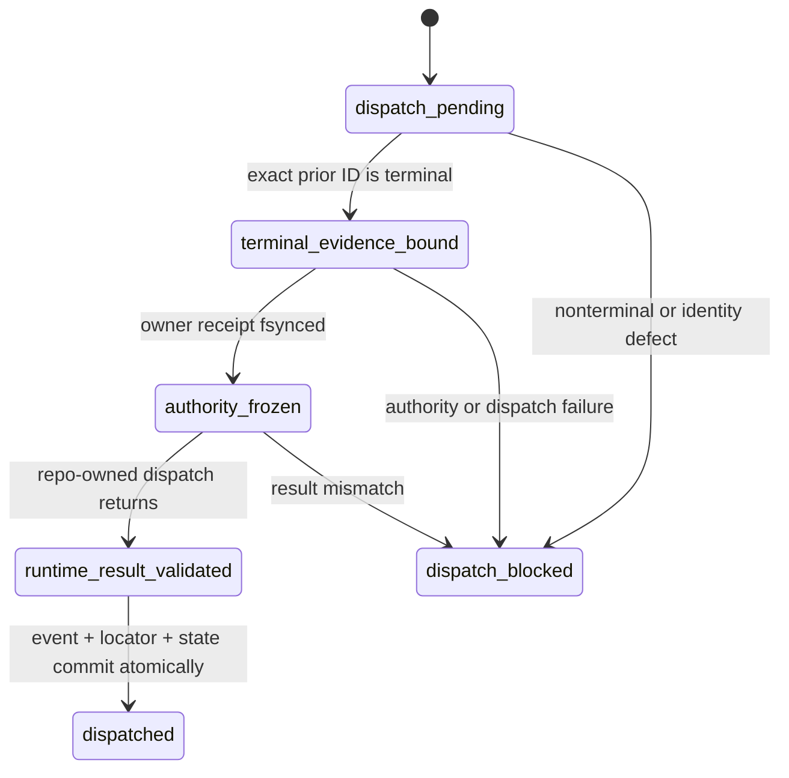
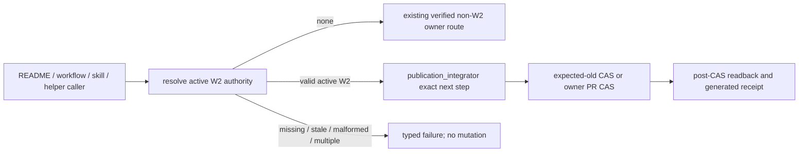
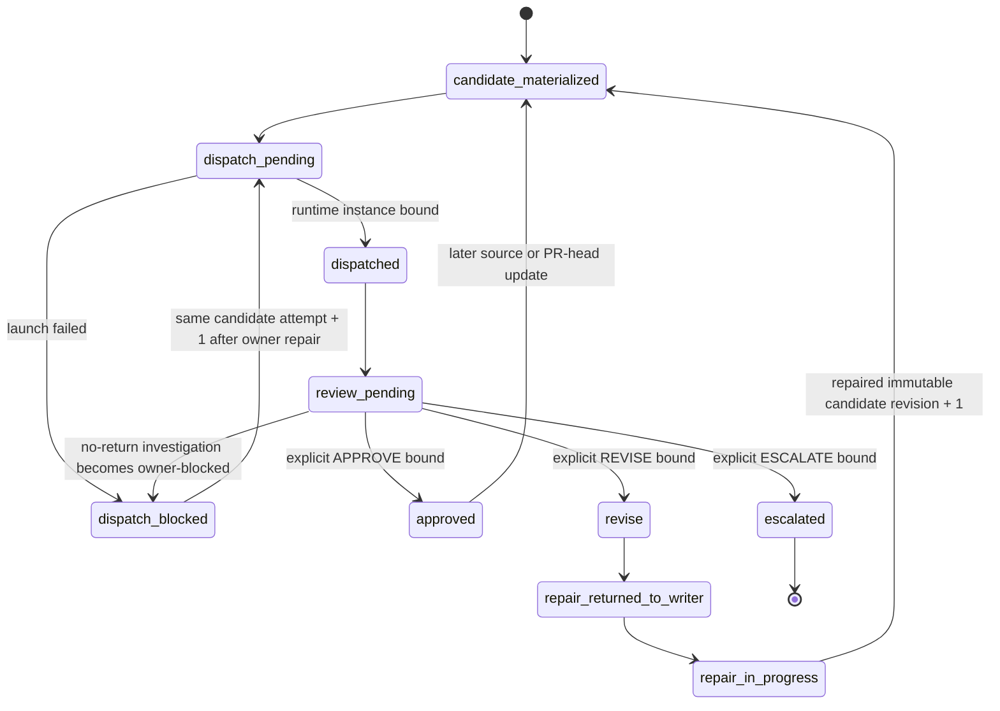
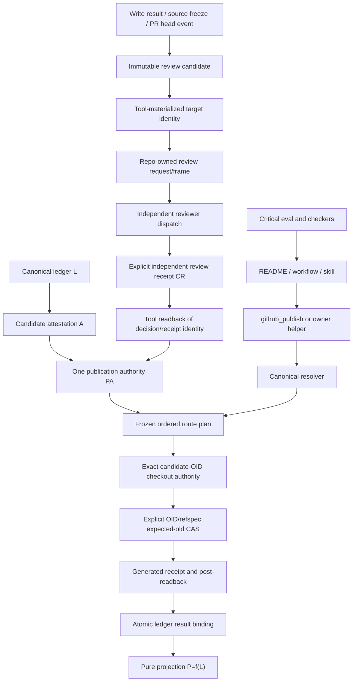
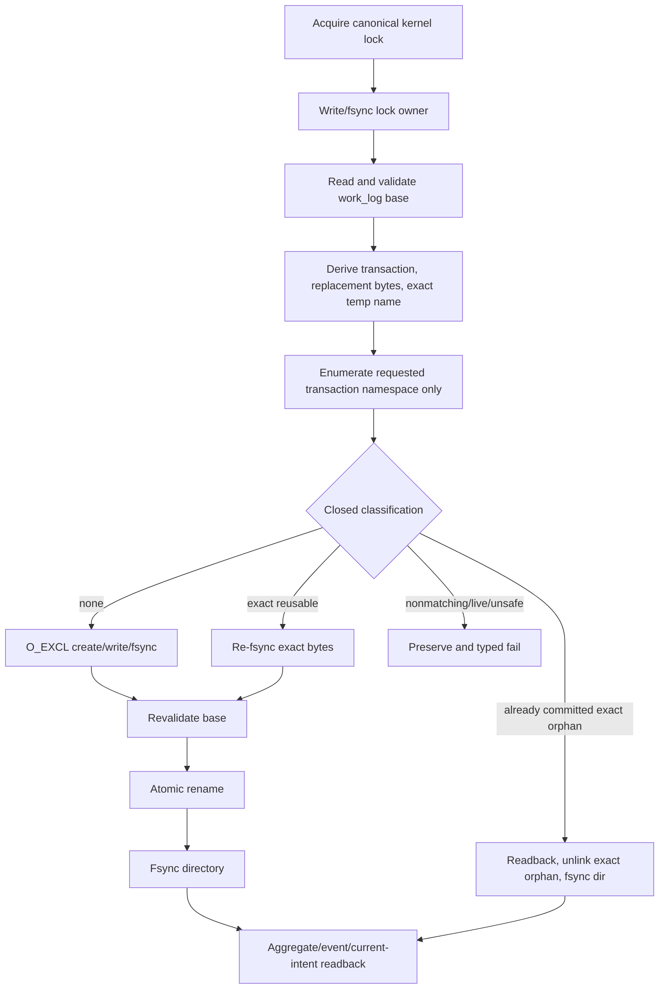

# W2 F1-F6 Repair Design v8

## Reader Map

This artifact is the append-only v8 design revision for the W2
`completion_authority` responsibility unit. It preserves the complete v7
behavior and repairs the three v7 REVISE findings plus two observed
identity/publication defects:

1. correct the v6 fixed-byte request Git blob identity to
   `6ff0191daf02f86b6642bfb2762db6ccc702fdbe` everywhere in the v8 packet;
2. materialize artifact identities canonically and import them into review and
   publication packets without parent/free-text hash transcription;
3. close the exact reciprocal root `README.md` dependency edges for
   `check_convention_compliance.py`, `tool_drift.py`, and their affected tests;
4. replace the incomplete terminal-reviewer prose with one complete,
   canonically serialized same-context resume/replacement event contract that
   binds owner evidence, frame fields, runtime result, transition, and public
   negative oracles;
5. bind publication to the exact approved candidate OID independently of dirty
   or unrelated checkout state, using only an explicit OID refspec or a clean
   standalone true clone.

It does not authorize source, test, owner-document, hook, formatter, CI, or
dynamic-graph changes.

Read in this order:

1. `Structure Contract And Static Source-Truth Graph` fixes the document unit
   and the five v8 review deltas.
2. `Request Clauses`, `Owner Surfaces`, and `Normative Incorporation Of v7`
   fix the requested boundary and retained contracts.
3. `v8 Repair Overlay` defines the corrected source identity, exact root
   reverse edges, and terminal same-context event.
4. `Selected Architecture` retains the mechanically closed publication
   inventory, automatic review lineage, and exact temporary-file recovery.
5. `Abstract Design Frame` states the replaceable responsibility unit and its
   authority flows.
6. `Implementation Source Packet` binds the source/review bytes and the static
   evidence set.
7. `Design Side-Effect Map`, `Exact Dependency-Header Closure`, and
   `Design-to-Implementation Trace` define the later source packet.
8. `Exact Acceptance Predicates`, `Public Typed Negative-Test Plan`, and
   `Review And Validation Contract` are the independent-review oracle.

The implementation packet is the union of v3, v4, v5, v6, v7, and this v8
artifact. When text conflicts, v8 replaces v7, v7 replaces v6, v6 replaces v5,
v5 replaces v4, and v4 replaces v3. Every non-conflicting prior clause remains
normative.

This artifact intentionally contains no identity for its own containing commit,
tree, Git blob, complete-file SHA256, or byte size. Those values are external
readback evidence only.

## Structure Contract And Static Source-Truth Graph

```text
structure_kind=document
audience=independent detailed-design reviewer and later implementation owner
decision_context=whether W2 F1-F6 is implementation-ready after the v7 REVISE findings
first_artifact=table V8-I1/V8-I2/V8-D1/V8-L1/V8-P1 source-to-owner-to-mechanism-to-public-oracle map
first_artifact_question=are source/artifact identities, root reverse-edge closure, terminal reviewer lineage, and candidate-OID checkout authority exact and non-bypassable
visual_plan=mermaid for the terminal same-context resume/replacement transition; retained v7 publication and recovery diagrams remain normative
document_unit=owner W2 design author; reader independent reviewer/implementer; source map exact v7 commit and artifacts plus bounded README/checker/test and reviewer-lineage owner paths; validation static Markdown/Git/hash; update cadence append-only review successor; canonical parent v7; downstream independent v8 review
document_split_decision=split:append-only v8 has a new independent review identity and its fixed-byte review request has a separate reviewer-input responsibility
metric_or_delta_contract=one corrected blob identity; one canonical artifact-identity materializer/readback; four new root README reciprocal pairs including two direct tests; one closed terminal event schema; one exact candidate-OID checkout authority; zero source authorization; zero automatic approval; zero weakening of v7 passes
invalid_interpretations=v8 is not implementation approval, not permission to rewrite v7 history, not a fresh-reviewer selector, not a self-review exception, not authority to include/revert unrelated checkout changes, and not a hand-written validation artifact
validation_gate=independent detailed-design recheck over fixed v8 bytes
```

Static source-truth anchors and typed relations:

| Anchor | Source truth | Typed relation | v7 conclusion |
| --- | --- | --- | --- |
| `V8-I1` | committed v6 request object readback | `corrects` stale v7 prose identity; `limits` historical mutation | v8 uses blob `6ff0191daf02f86b6642bfb2762db6ccc702fdbe`; v7 remains immutable history |
| `V8-I2` | artifact bytes plus canonical Git/filesystem readback | `requires` tool materialization/import; `limits` free-text identity | review/publish packets consume one structured identity record and reject manual/mismatched SHA/blob before PR dispatch |
| `V8-D1` | root README and convention/drift checker/test headers | `requires` same-kind reciprocal closure | root README has exact downstream implementation edges to both tools and both direct tests; every target has the exact inverse |
| `V8-L1` | v7 frame/locator prose plus canonical subagent owner paths | `requires` one terminal resume/replacement event; `limits` fresh reviewer creation | only owner-evidenced terminal state may produce a same-context event bound to the current frame and dispatch result |
| `V8-P1` | approved candidate identity, checkout status readback, and canonical publication route | `requires` exact OID source authority; `limits` worktree mutation | dirty checkout bytes are never publication input; only explicit OID refspec or clean standalone clone may carry the approved OID |
| `PRESERVE` | all v7 acceptance predicates | `constrains` all three repairs | publication, recovery, automatic review, immutable state, formatter union, D2/D3/F1/F2, and non-self-reference remain unchanged |

No dynamic graph was generated. The tables in this artifact are the static
source-truth projection because Python and dynamic-graph execution are
explicitly prohibited for this revision.

## Request Clauses

| Clause | Required closure |
| --- | --- |
| V8-I1 | Correct the v6 fixed-byte request blob to `6ff0191daf02f86b6642bfb2762db6ccc702fdbe` in every v8 source packet, review clause, trace, and acceptance reference; do not mutate v7. |
| V8-I2 | Define one canonical artifact-identity materialization/readback record and owner tool; review/publish packets import structured identity records, never parent/free-text SHA/blob fields; mismatch blocks before PR dispatch. |
| V8-D1 | Add exact reciprocal root `README.md` dependency-header pairs for `check_convention_compliance.py`, `tool_drift.py`, `test_check_convention_compliance.py`, and `test_tool_drift.py`; retain the prompt-eval test closure. |
| V8-L1 | Define one exhaustive terminal same-context reviewer resume/replacement event with exact fields, owner evidence, hash/serialization, frame equality, transition, and public negatives; missing/foreign/fresh/self-review paths remain blocked. |
| V8-P1 | Publish the exact approved candidate OID independently of checkout dirtiness; never auto-include, clean, reset, restore, stash, revert, or commit unrelated changes; require an explicit OID refspec or clean standalone true-clone route with typed checkout-authority evidence. |
| PRESERVE | Preserve all v7 behavior, including V6-R1, V6-R2, V7-A1, one publication authority, expected-old CAS, non-circular aggregate transaction, exhaustive formatter union, and no compatibility/test-only route. |
| BOUNDARY | Write only v8 design/review-request artifacts now; implementation remains blocked pending independent fixed-byte approval. |

## Owner Surfaces

| Responsibility | Canonical owner | Replaceable implementation unit | Public consumers |
| --- | --- | --- | --- |
| active-W2 publication policy and selected authority | `agents/canonical/CODEX_WORKFLOW.md`, `documents/operations/BRANCH_SCOPE.md` | future `tools/agent_tools/publication_integrator.py` | branch/main/PR workflows, publish/update/sync helpers, hook, closeout |
| canonical artifact identity and packet import | `agents/COMMUNICATION_PROTOCOL.md` | future `tools/agent_tools/artifact_identity.py` | review dispatcher, publication integrator, GitHub publish, report checks, closeout |
| automatic review state and candidate/receipt schema | `agents/canonical/CODEX_WORKFLOW.md`, `agents/COMMUNICATION_PROTOCOL.md` | future `tools/agent_tools/review_dispatch.py` plus canonical ledger writer | publication integrator, workflow monitor, GitHub projection, closeout |
| terminal reviewer same-context resume/replacement | `agents/COMMUNICATION_PROTOCOL.md`, `agents/canonical/CODEX_SUBAGENTS.md`, `agents/task_catalog.yaml`, `agents/agents_config.json` | future `review_dispatch.py` owner-authority receipt plus one immutable terminal event | current review frame, team manifest, workflow monitor, publication lock |
| task/team review routing and instance separation | `agents/task_catalog.yaml`, `agents/agents_config.json`, `agents/canonical/CODEX_SUBAGENTS.md`, `.codex/config.toml`, `.codex/agents/*.toml` | `tools/agent_tools/agent_team.py`, `task_start.py`, `bootstrap_agent_run.py`, `workflow_monitor.py` | parent orchestrator, writer, independent reviewer |
| AgentCanon source publication entrypoint | `agents/workflows/agent-canon-pr-workflow.md`, `documents/tools/github_publish.md` | `tools/agent_tools/github_publish.py` delegating active W2 | root `README.md`, workflow index, derived workflow, update skill/shim |
| runtime update prompt contract | `agents/skills/agent-canon-update.md`, `.agents/skills/agent-canon-update/SKILL.md` | existing update/sync helpers plus canonical publish entrypoint | `AGENT-CANON-UPDATE-SHIM-2`, prompt evaluator, convention/drift checks |
| bidirectional dependency semantics | `documents/design/dependency-manifest-design.md` | dependency header checker/review route | every newly touched caller, owner, document, eval, checker, and test |
| root publication dependency closure | root `README.md` dependency manifest | convention checker, drift checker, and their direct tests | strict bidirectional graph and publication closeout |
| ledger transaction and recovery schema | `agents/COMMUNICATION_PROTOCOL.md` | `tools/agent_tools/work_log.py` | workflow monitor, report checks, waterfall gate, task close |
| completion projection | canonical ledger L | pure projection P = f(L plus canonical Git/artifact readback) | topology, gate, formatter, publication, and closeout consumers |
| independent design approval | `documents/conventions/REVIEW_PROCESS.md` and review templates | external reviewer over fixed bytes | implementation source-freeze gate |

No run-local design or review report becomes an upstream dependency of durable
canon.

## Normative Incorporation Of v7

All v7 clauses remain byte-semantic requirements except the five explicit v8
corrections. In particular, the following v6/v7 contracts are not reopened:

- one `agent-canon.publication-authority.v3` is derived only from the immutable
  candidate attestation, independent approving review receipt, source tuple,
  and frozen target tuple;
- no caller supplies B, S, target identity, expected OID, route step, result, or
  receipt;
- local refs use expected-old `git update-ref`, remotes use an exact
  expected-old lease, and PR merge uses an owner API enforcing exact base/head
  OIDs or remains typed blocked;
- a checked-out local target is refused; no transaction leaves an index or
  worktree detached from its ref;
- immutable B cannot be conflict-merged;
- first intent row, canonical pending events, and aggregate snapshot are one
  atomic ledger transaction with legal within-transaction references;
- immutable `intent_revisions` retains one logical aggregate key and exactly one
  `current_intent_revision_id` pointer;
- formatter records remain exactly two ordered records and the status algebra
  remains exactly `pending`, `pass`, `fail`, `deferred_by_user`, and
  `not_applicable`;
- all five formatter variants retain the v6 fixed key set, status-specific
  required/forbidden fields, canonical event equality, authority artifact
  equality, and closed transitions;
- canonical ledger L remains the sole authority and stored views remain
  fingerprint-bound projection-only data;
- per-member source-event correspondence and exact cross-member equality remain
  mandatory;
- D2 branch reason remains exactly
  `convergence_w2_gate_completion_authority`;
- D3, F1, F2, exact freeze/topology predicates, canonical tree-delta
  serialization, convention closure, and publication non-self-reference remain
  unchanged;
- there is no compatibility selector, direct-shell bypass, test-only
  production API, or hand-written pass/deferral evidence.
- parent remains the monitor/integrator; write-capable and review roles remain
  separate instances and review roles remain artifact-only/read-only.

v7 replaced only:

1. v6 `Complete ordinary publication-route closure`, static inventory,
   Side-Effect Map, dependency-header closure, trace, and R1 acceptance text
   where they omitted the root README, critical eval, or exact reverse edges;
2. v6 atomic file-protocol steps 3 and 7-13 plus its rollback/crash/retry text,
   where deterministic orphan-temporary recovery was incomplete.

v7 additionally extended the same `completion_authority` unit with automatic
review. This extension does not replace the v5/v6 pre-review attestation or
publication authority. It supplies the canonical candidate/review state that
those publication predicates consume.

v8 replaces only:

1. the stale v7 prose value for the v6 request Git blob;
2. the v7 dependency closure where root `README.md` had publication edges but
   lacked direct reciprocal checker/test edges; and
3. the v7 terminal-reviewer sentence-level rule where no complete immutable
   event schema, canonical hash, atomic transition, or exhaustive public oracle
   existed.

Every other v7 section remains normative. A later implementer must read v8
first and use v7 only for retained details not replaced here.

## v8 Repair Overlay

### Finding-to-contract map

| Finding | Canonical source truth | Selected repair | Public oracle |
| --- | --- | --- | --- |
| V8-I1 | Git object readback for the committed v6 fixed-byte request | replace the stale v7 prose blob only in this v8 successor | every v8 occurrence is exactly `6ff0191daf02f86b6642bfb2762db6ccc702fdbe`; any other value fails |
| V8-I2 | exact target bytes, repository identity, Git object calculation, and immutable identity record | canonical materializer plus structured packet import/readback | manually supplied or mismatched size/SHA/blob/path/source tuple blocks before review or PR dispatch |
| V8-D1 | root `README.md`, both checker manifests, dependency bidirectionality, and direct test manifests | four exact README-centered same-kind reciprocal pairs plus retained tool/test pairs | missing edge, wrong direction, wrong kind, wrong relative path, duplicate conflicting edge, or omitted test fails typed |
| V8-L1 | current review frame, reviewer locator, team manifest, terminal runtime observation, owner surfaces, and dispatch receipt | one immutable terminal same-context resume/replacement event emitted by the canonical owner transaction | fresh, foreign, reassigned, stale, self-review, unbound, or nonterminal dispatch cannot advance `dispatch_pending` |
| V8-P1 | current approved candidate commit/tree plus checkout/ref/remote readback | candidate OID is the only source; dirty checkout is excluded by route construction | only explicit OID refspec or clean standalone clone may publish; implicit worktree source or cleanup mutation fails typed |

No weighted scoring is used. Each repair is forced by a hard identity,
dependency, or authority constraint.

### V8-I1 exact v6 request identity correction

The committed v6 request object is:

```text
path=reports/agents/convergence-w2-gates-completion-20260716/w2_detailed_design_recheck_request_v6.md
size_bytes=5662
sha256=f7ac2ca13caaea2c9668d9ad62ea3903a336dbf3b9fddf77308b47602060ca55
git_blob=6ff0191daf02f86b6642bfb2762db6ccc702fdbe
encoding=UTF-8
bom=absent
line_endings=LF
```

The stale v7 blob value is a prose transcription defect and is not the Git
object for these bytes. v8 does not rewrite v7 history. It supersedes that
value in every current source packet, trace, review instruction, and acceptance
predicate. A consumer that reads the stale value after v8 is available fails:

`implementation_source_packet:v6_request_blob_stale`.

The verifier recomputes the blob with Git object hashing over the committed v6
bytes; it never trusts either prose value as success authority.

### V8-I2 canonical artifact-identity materialization and import

#### Owner and public boundary

`agents/COMMUNICATION_PROTOCOL.md` owns the identity-record schema.
Future `tools/agent_tools/artifact_identity.py` is the single replaceable byte
materializer/readback tool. `review_dispatch.py`, `github_publish.py`,
`publication_integrator.py`, `report_artifact_checks.py`, and `task_close.py`
consume its structured records.

The low-level public signatures are:

```python
def materialize_artifact_identity(
    workspace: Path,
    artifact_path: Path,
) -> dict[str, object]:
    ...

def verify_artifact_identity(
    workspace: Path,
    identity_record_path: Path,
) -> dict[str, object]:
    ...
```

Neither API accepts claimed size, SHA256, Git blob, commit, tree, mode, or
success. Higher-level review/publication resolvers derive `artifact_path` and
any committed source tuple from L and the frozen source packet; their public
APIs expose no path or identity override.

#### Exact identity record schema

```json
{
  "schema": "agent-canon.artifact-identity.v1",
  "schema_version": 1,
  "identity_record_id": "<deterministic record ID>",
  "artifact_role": "review_target",
  "repository_id": "<canonical repository ID>",
  "repository_root": "<absolute normalized repository root>",
  "artifact_path": "<normalized repo-relative or run-relative path>",
  "source_binding": {
    "kind": "git_commit_path",
    "commit": "<40 lowercase Git OID or null>",
    "tree": "<40 lowercase Git OID or null>",
    "path_mode": "100644",
    "tree_blob": "<40 lowercase Git OID or null>"
  },
  "byte_size": 1,
  "sha256": "<64 lowercase hex>",
  "git_blob": "<40 lowercase Git blob OID>",
  "encoding": "UTF-8",
  "bom": "absent",
  "line_endings": "LF",
  "filesystem_readback": {
    "nofollow": true,
    "regular_file": true,
    "device": 1,
    "inode": 1,
    "mode": "100644",
    "size_before": 1,
    "size_after": 1,
    "mtime_ns_before": 1,
    "mtime_ns_after": 1
  },
  "materializer": {
    "owner_tool": "tools/agent_tools/artifact_identity.py",
    "tool_source_commit": "<40 lowercase Git OID>",
    "tool_source_tree": "<40 lowercase Git OID>",
    "tool_source_blob": "<40 lowercase Git OID>"
  },
  "materialized_at_utc": "YYYY-MM-DDTHH:MM:SSZ",
  "materialization_order_index": 1,
  "identity_record_body_sha256": "<64 lowercase hex>"
}
```

Allowed `artifact_role` values are exactly:

- `review_target`
- `review_decision`
- `review_receipt`
- `source_packet_artifact`
- `publication_authority`
- `publication_receipt`

Allowed `source_binding.kind` values are exactly:

- `git_commit_path`: bytes come from the exact committed tree entry;
- `filesystem_immutable`: bytes come from one stable no-follow regular-file
  read before later external Git binding; and
- `external_immutable_receipt`: bytes come from an owner API receipt with
  canonical repository/external object identity.

For `git_commit_path`, all commit/tree/mode/tree-blob fields are non-null and
the materializer reads the tree entry bytes rather than the worktree. For the
other two kinds, those four fields are `null` until an external binding event;
the record still computes `git_blob` from the exact bytes.

`encoding`, `bom`, and `line_endings` are exact for text artifacts. Binary
artifacts use `encoding="binary"`, `bom="not_applicable"`, and
`line_endings="not_applicable"`. No non-empty-text fallback exists.

For a filesystem read, the tool opens with no symlink following, requires one
regular file, records `fstat` before and after the complete read, and requires
device, inode, mode, size, and nanosecond mtime equality. For committed bytes,
`filesystem_readback` records the committed tree mode and uses
`device=inode=mtime_ns_before=mtime_ns_after=0`; `nofollow` and
`regular_file` remain true.

The Git blob OID is computed over exactly:

```text
"blob " + ASCII(decimal byte_size) + NUL + artifact_bytes
```

using the repository's 40-hex Git object algorithm. SHA256 covers only
`artifact_bytes`.

The record ID seed is:

```text
agent-canon.artifact-identity.v1\0
repository-id=<repository_id UTF-8>\0
artifact-role=<artifact_role UTF-8>\0
artifact-path=<artifact_path UTF-8>\0
source-binding-kind=<kind UTF-8>\0
source-commit=<40 lowercase hex or null UTF-8>\0
source-tree=<40 lowercase hex or null UTF-8>\0
byte-size=<unsigned decimal>\0
sha256=<64 lowercase hex>\0
git-blob=<40 lowercase hex>\0
materialization-order-index=<16 lowercase hex>\0
end\0
```

The range includes every shown NUL and no byte after `end\0`.

```text
identity_record_id =
  agent-canon-artifact-identity:<SHA256(exact seed bytes)>
```

`identity_record_body_sha256` is SHA256 over RFC 8785 canonical JSON bytes of
the complete record with only that field omitted. The identity record never
contains its own complete-file SHA, Git blob, or containing commit/tree.

#### Structured packet import

Review and publication packets do not expose writable fields such as
`target_sha256=<parent text>` or `approval_sha256=<parent text>`. They contain
an imported identity object:

```json
{
  "identity_record_ref": {
    "path": "<immutable identity record path>",
    "record_id": "<identity record ID>",
    "record_body_sha256": "<record body hash>"
  },
  "materialized_identity": {
    "artifact_role": "<record role>",
    "artifact_path": "<record path>",
    "source_binding": {},
    "byte_size": 1,
    "sha256": "<record SHA256>",
    "git_blob": "<record Git blob>",
    "encoding": "UTF-8",
    "bom": "absent",
    "line_endings": "LF"
  },
  "identity_import_sha256": "<64 lowercase hex>"
}
```

The packet generator parses the canonical record and serializes this object
structurally. `materialized_identity` must equal the selected fields in the
record by type and bytes; it is never assembled through string interpolation,
chat text, Markdown copying, environment variables, or CLI SHA arguments.
`identity_import_sha256` hashes RFC 8785 bytes of the complete import object
with only that field omitted.

The reviewer handoff references `identity_record_ref`; the four-field handoff
remains unchanged. The publication authority and PR packet import the same
record or a later independently verified record for the same artifact bytes.

#### Mandatory readback before review and PR dispatch

Before reviewer dispatch, `review_dispatch.py`:

1. derives target paths from L/frozen source packet;
2. invokes the materializer;
3. imports each record structurally;
4. invokes `verify_artifact_identity` immediately before dispatch; and
5. requires record, import, and current bytes/source tuple equality.

Before any network call, ref update, PR creation/update, or PR merge dispatch,
`github_publish.py` and `publication_integrator.py` repeat verification for:

- current approving decision artifact;
- external approval-binding receipt;
- publication authority;
- current candidate/source packet artifacts; and
- any fixed review target carried into the PR packet.

The PR body is a projection of verified structured values. It is not an
identity input. A mismatch returns before invoking `git push`, `gh`, or any PR
owner API.

#### Artifact-identity public negatives

| Negative | Typed result |
| --- | --- |
| parent/handoff supplies SHA, blob, size, or success text | `artifact_identity:manual_identity_field_forbidden` |
| record path or target path is missing/foreign/non-normalized | `artifact_identity:path_invalid` |
| schema, role, source-binding enum, or key set differs | `artifact_identity:schema_mismatch` |
| no-follow/regular-file or stable fstat check fails | `artifact_identity:unstable_file_read` |
| committed tree path/mode/blob differs | `artifact_identity:committed_source_mismatch` |
| size, SHA256, or Git blob recomputation differs | `artifact_identity:content_mismatch` |
| record ID or body hash differs | `artifact_identity:record_hash_mismatch` |
| packet import differs from record fields | `artifact_identity:packet_import_mismatch` |
| duplicate record ID has different bytes | `artifact_identity:record_replay_conflict` |
| bytes change after materialization and before dispatch | `artifact_identity:readback_changed` |
| approval record targets another candidate/frame | `artifact_identity:approval_binding_mismatch` |
| any required identity verification fails before PR work | `artifact_identity:pr_dispatch_blocked` |

Future public tests intentionally transpose one hex digit in an APPROVE SHA,
inject a free-text hash, mutate bytes after materialization, swap path/blob,
alter mode/source commit, and reuse a record for a foreign candidate. Every
case fails before reviewer or PR dispatch and produces no publication side
effect.

### V8-D1 exact root README reciprocal dependency closure

The future durable dependency header must add these four direct pairs exactly.
All directions, kinds, relative paths, and reason text are normative bytes.

| Root `README.md` line | Exact inverse line |
| --- | --- |
| `downstream implementation tools/agent_tools/check_convention_compliance.py validates root publication and reciprocal dependency closure` | `tools/agent_tools/check_convention_compliance.py`: `upstream implementation ../../README.md defines root publication and reciprocal dependency closure` |
| `downstream implementation tools/agent_tools/tool_drift.py validates root publication dependency drift` | `tools/agent_tools/tool_drift.py`: `upstream implementation ../../README.md defines root publication dependency contract` |
| `downstream implementation tests/agent_tools/test_check_convention_compliance.py verifies root publication convention closure` | `tests/agent_tools/test_check_convention_compliance.py`: `upstream implementation ../../README.md defines root publication convention fixtures` |
| `downstream implementation tests/agent_tools/test_tool_drift.py verifies root publication dependency closure` | `tests/agent_tools/test_tool_drift.py`: `upstream implementation ../../README.md defines root publication dependency fixtures` |

The existing direct production/test pairs remain and are not replaced:

| Tool line | Existing exact test inverse |
| --- | --- |
| `tools/agent_tools/check_convention_compliance.py`: `downstream implementation ../../tests/agent_tools/test_check_convention_compliance.py tests verifier` | `tests/agent_tools/test_check_convention_compliance.py`: `upstream implementation ../../tools/agent_tools/check_convention_compliance.py verifier` |
| `tools/agent_tools/tool_drift.py`: `downstream implementation ../../tests/agent_tools/test_tool_drift.py tests checker` | `tests/agent_tools/test_tool_drift.py`: `upstream implementation ../../tools/agent_tools/tool_drift.py checker` |

The prompt-eval path remains an affected behavioral consumer through the v7
critical-eval pairs:

- `tests/agent_tools/test_evaluate_skill_workflow_prompts.py` continues to
  validate the exact required/forbidden publication markers;
- its dependency remains the critical eval TOML, not a synthetic direct edge
  to root README;
- no duplicate root ownership or second publication authority is introduced.

Future checker behavior is exact:

1. `check_convention_compliance.py` verifies the four root lines and the four
   inverse lines as one marker contract;
2. `tool_drift.py` registers root `README.md` with
   `reverse_required=True` for both checker tools and validates the two direct
   README/test pairs;
3. `test_check_convention_compliance.py` deletes or mutates each root/tool/test
   line separately and expects the exact path-specific failure;
4. `test_tool_drift.py` covers missing direct edge, missing inverse, kind
   mismatch, relative-path mismatch, and conflicting duplicate edge;
5. `test_evaluate_skill_workflow_prompts.py` retains the raw-push forbidden
   oracle; and
6. the strict dependency graph independently checks same-kind inverse
   equality.

Stable failures are:

- `publication_dependency:readme_convention_checker_edge_missing`
- `publication_dependency:convention_checker_readme_inverse_missing`
- `publication_dependency:readme_drift_checker_edge_missing`
- `publication_dependency:drift_checker_readme_inverse_missing`
- `publication_dependency:readme_convention_test_edge_missing`
- `publication_dependency:convention_test_readme_inverse_missing`
- `publication_dependency:readme_drift_test_edge_missing`
- `publication_dependency:drift_test_readme_inverse_missing`
- `publication_dependency:readme_edge_kind_mismatch`
- `publication_dependency:readme_edge_relative_path_mismatch`
- `publication_dependency:readme_edge_conflicting_duplicate`

No durable dependency points to this run-local v8 report.

### V8-P1 exact candidate-OID checkout authority

The canonical current approved candidate commit OID is publication source
authority. `HEAD`, index contents, worktree bytes, staged bytes, untracked
files, branch names, merge state, and writer summaries are observations only.
No publication step may derive bytes by committing, staging, copying, merging,
or otherwise materializing the current checkout.

There are exactly two legal source routes:

1. `explicit_candidate_oid_refspec`: use the exact approved candidate OID as
   the local CAS result or remote refspec source. Local ref mutation is
   `git update-ref <target-ref> <candidate-oid> <expected-old-oid>`. Remote
   mutation uses an owner-generated command equivalent to
   `git push --force-with-lease=<target-ref>:<expected-old-oid> <remote>
   <candidate-oid>:<target-ref>`. A PR owner API receives the same exact
   candidate/head OID and expected base/head tuple. No command uses `HEAD`,
   the current branch, index, pathspec, or worktree content as source.
2. `clean_true_clone`: use a separate, standalone clone whose `.git` is a real
   directory, whose common Git directory is that same `.git`, whose alternates
   set is empty, whose `HEAD` equals the approved candidate OID, whose index
   tree equals the approved candidate tree, and whose porcelain-v2 status
   including untracked files is empty. Publication still names the candidate
   OID explicitly; clone cleanliness is isolation evidence, not source
   authority.

A dirty checkout is allowed only for
`explicit_candidate_oid_refspec`, because that route cannot observe worktree
bytes as publication input. If the owner cannot prove that route, it returns a
typed blocker and requires a clean true clone. It never cleans the dirty
checkout.

#### Exact checkout-authority evidence

Before each publication CAS, the integrator materializes:

```json
{
  "schema": "agent-canon.publication-checkout-authority.v1",
  "schema_version": 1,
  "checkout_authority_id": "<deterministic ID>",
  "aggregate_identity": "<aggregate identity>",
  "publication_authority_id": "<current publication authority ID>",
  "publication_authority_body_sha256": "<current authority hash>",
  "review_candidate_id": "<current approved candidate ID>",
  "review_candidate_body_sha256": "<candidate body hash>",
  "candidate_commit": "<40 lowercase Git OID>",
  "candidate_tree": "<40 lowercase Git OID>",
  "approval_binding_event_id": "<current APPROVE binding event ID>",
  "approval_binding_event_sha256": "<binding event hash>",
  "route_step_id": "<frozen publication route step ID>",
  "route_kind": "explicit_candidate_oid_refspec",
  "repository_id": "<canonical repository ID>",
  "checkout_root": "<absolute normalized checkout path>",
  "git_dir": "<absolute normalized Git directory>",
  "git_common_dir": "<absolute normalized common Git directory>",
  "standalone_git_dir": false,
  "alternates_present": false,
  "observed_head_oid": "<40 lowercase Git OID or null>",
  "observed_index_tree": "<40 lowercase Git OID or null>",
  "porcelain_v2_sha256": "<SHA256 of exact status bytes>",
  "dirty_entry_count": 0,
  "ordered_dirty_paths_sha256": "<SHA256 of canonical ordered path array>",
  "worktree_policy": "ignored_no_mutation",
  "candidate_object_type": "commit",
  "candidate_object_tree": "<same candidate tree>",
  "candidate_source_spec": "<same candidate commit OID>",
  "target_ref": "refs/heads/<target>",
  "expected_old_oid": "<40 lowercase Git OID>",
  "remote_name": "<configured remote name or null for local CAS>",
  "remote_repository_id": "<frozen remote identity or null for local CAS>",
  "command_template_id": "agent-canon.explicit-candidate-oid-cas.v1",
  "forbidden_checkout_mutations": [
    "add",
    "checkout",
    "clean",
    "commit",
    "merge",
    "reset",
    "restore",
    "revert",
    "stash"
  ],
  "observed_at_utc": "YYYY-MM-DDTHH:MM:SSZ",
  "observation_order_index": 1,
  "checkout_authority_body_sha256": "<64 lowercase hex>"
}
```

For `clean_true_clone` the same key set is used with exact values:

- `route_kind="clean_true_clone"`;
- `standalone_git_dir=true`;
- `git_dir == git_common_dir == <checkout_root>/.git`;
- `alternates_present=false`;
- `observed_head_oid == candidate_commit`;
- `observed_index_tree == candidate_tree`;
- `dirty_entry_count=0`;
- `ordered_dirty_paths_sha256` hashes the empty JSON array;
- `worktree_policy="required_clean"`; and
- `command_template_id="agent-canon.clean-true-clone-candidate-oid-cas.v1"`.

For `explicit_candidate_oid_refspec`, `dirty_entry_count` may be any
non-negative integer and the observed head/index may differ from the candidate.
The exact porcelain-v2 bytes and ordered dirty paths are evidence that those
changes existed and were intentionally excluded. `alternates_present=false`
is still required so the candidate object remains available from the
authorized repository object store without an unbound external object source.

`porcelain_v2_sha256` hashes the exact bytes from:

```text
git status --porcelain=v2 -z --untracked-files=all
```

`ordered_dirty_paths_sha256` hashes RFC 8785 canonical JSON bytes of the path
byte strings extracted from that NUL-delimited output, sorted by raw UTF-8
bytes. The raw status artifact is retained by path/SHA in the publication
receipt. No non-empty-text fallback is allowed.

`checkout_authority_id` uses:

```text
agent-canon.publication-checkout-authority.v1\0
publication-authority-id=<publication_authority_id UTF-8>\0
route-step-id=<route_step_id UTF-8>\0
candidate-commit=<40 lowercase hex>\0
target-ref=<full target ref UTF-8>\0
expected-old-oid=<40 lowercase hex>\0
route-kind=<legal route kind UTF-8>\0
observation-order-index=<16 lowercase hex>\0
end\0
```

The hash range includes every shown NUL and no later byte.
`checkout_authority_body_sha256` is SHA256 over RFC 8785 canonical JSON bytes
with only that field omitted.

#### Checkout-independent publication algorithm

The publication integrator:

1. rereads L and resolves the single current approved candidate and frozen
   route step;
2. verifies the candidate commit object and tree directly from Git objects;
3. records exact checkout/index/worktree status without mutating it;
4. selects `explicit_candidate_oid_refspec` when the operation can name the
   candidate OID directly, otherwise requires `clean_true_clone`;
5. refuses any command plan containing `HEAD`, a branch shorthand, a pathspec,
   a worktree copy, an implicit merge result, or a prohibited checkout
   mutation as source;
6. performs the retained expected-old local/remote/PR CAS with the exact
   candidate OID;
7. rereads the target ref/remote/PR head and requires result OID equality;
8. rereads the original checkout status and requires byte equality with the
   pre-CAS status for `explicit_candidate_oid_refspec`; and
9. binds checkout authority, command/refspec, CAS result, target readback, and
   unchanged-dirty-checkout evidence into the generated publication receipt.

Step 8 proves that publication neither included nor reverted unrelated
changes. A legitimate external actor changing the checkout concurrently causes
a typed non-success; the integrator does not attempt repair.

#### Checkout-authority public negatives

| Negative | Typed result |
| --- | --- |
| candidate source is `HEAD`, current branch, index, or worktree path | `publication_checkout:implicit_source_forbidden` |
| dirty checkout is staged or committed automatically | `publication_checkout:auto_include_forbidden` |
| dirty checkout is reset, restored, cleaned, stashed, reverted, checked out, or merged | `publication_checkout:auto_revert_forbidden` |
| command/refspec source OID differs from approved candidate | `publication_checkout:candidate_oid_mismatch` |
| explicit remote refspec omits the candidate OID | `publication_checkout:explicit_refspec_required` |
| candidate object or tree cannot be read from authorized object store | `publication_checkout:candidate_object_unavailable` |
| dirty checkout uses any route other than explicit candidate OID | `publication_checkout:dirty_checkout_route_forbidden` |
| clean-clone route uses a linked worktree, gitfile, shared common dir, or alternates | `publication_checkout:true_clone_required` |
| clean clone HEAD/index/tree/status differs | `publication_checkout:clean_clone_identity_mismatch` |
| checkout authority receipt is missing, stale, noncanonical, or hash-mismatched | `publication_checkout:authority_evidence_mismatch` |
| pre/post dirty status bytes differ | `publication_checkout:checkout_changed_during_publication` |
| expected-old target moved | retained `integration_target_moved` |
| post-CAS target OID differs from candidate | `publication_checkout:target_readback_mismatch` |

Future public tests create tracked, staged, unstaged, and untracked unrelated
changes and prove that the published target tree is exactly the approved
candidate tree while the original checkout bytes/status remain unchanged.

### V8-L1 terminal same-context resume/replacement authority

#### Closed selection rule

The current reviewer locator in canonical ledger L remains selection authority.
Runtime inventory is observation evidence only. A terminal same-context action
is legal if and only if all of these predicates hold:

1. the current review state is exactly `dispatch_pending`;
2. the current candidate and frame equal the aggregate pointers;
3. the prior reviewer locator is unique and byte-valid;
4. the exact prior nested runtime ID is observed with canonical terminal status
   `completed`, `errored`, or `shutdown`;
5. timeout, empty wait, absent response, missing ID, ambiguous ID, and stale
   inventory are not terminal evidence;
6. request, context, lineage, assignment, role, agent type, review focus,
   ordered request clauses, and owner unit are unchanged;
7. the current frame's source packet and acceptance identity match the current
   candidate;
8. the parent is the recorded monitor/integrator and the writer identity is
   mechanically bound;
9. the owner tool derives the action from L, catalog, team config, manifest,
   role TOML, and runtime observation; callers cannot nominate a reviewer; and
10. the replacement result cannot equal the writer or parent identity.

There are exactly two legal modes:

- `provider_resume_same_runtime`: the provider durably resumes the exact prior
  `nested_runtime_agent_id`; and
- `owner_selected_replacement_runtime`: the repo-owned team route creates a new
  runtime ID for the same reviewer assignment, lineage, context, role, agent
  type, and review focus.

A missing or unobservable prior runtime is not replacement authority. A
reviewer reassignment is a separate owner decision and cannot use this event.

#### Canonical evidence reference

Every artifact reference in the event has exactly:

```json
{
  "path": "<repo-relative or run-relative UTF-8 path>",
  "sha256": "<64 lowercase hex>",
  "git_blob": "<40 lowercase Git OID or null>",
  "git_commit": "<40 lowercase Git OID or null>",
  "git_tree": "<40 lowercase Git OID or null>"
}
```

Durable source refs require all three Git fields. Run-local immutable receipts
require all three Git fields to be `null`; a later external binding may record
their Git identity without changing the referenced bytes. Paths are normalized
UTF-8 with `/`, contain no `.` or `..` segment, and are ordered by raw UTF-8
bytes when stored in an array.

The ordered owner evidence set is exactly:

1. `agents/COMMUNICATION_PROTOCOL.md`;
2. `agents/canonical/CODEX_WORKFLOW.md`;
3. `agents/canonical/CODEX_SUBAGENTS.md`;
4. `agents/task_catalog.yaml`;
5. `agents/agents_config.json`;
6. the selected `.codex/agents/<reviewer-agent-type>.toml`;
7. `team_manifest.yaml`;
8. the immutable terminal runtime observation receipt; and
9. the immutable replacement-authority receipt.

`owner_surface_refs_sha256` is SHA256 over RFC 8785 canonical JSON bytes of
that exact nine-element array.

#### Stable same-context fingerprint

The stable context fingerprint excludes candidate-specific bytes and uses this
exact byte stream:

```text
agent-canon.same-review-context.v1\0
review-lineage-id=<review_lineage_id UTF-8>\0
review-request-id=<review_request_id UTF-8>\0
review-context-id=<review_context_id UTF-8>\0
reviewer-assignment-id=<reviewer_assignment_id UTF-8>\0
reviewer-lineage-id=<reviewer_lineage_id UTF-8>\0
role-id=<role_id UTF-8>\0
agent-type=<agent_type UTF-8>\0
review-focus=<review_focus UTF-8>\0
owner-unit=<owner_unit UTF-8>\0
request-clause-ids-sha256=<64 lowercase hex>\0
end\0
```

The hash range includes every shown NUL, including the final `end\0`, and no
byte after it:

```text
same_context_fingerprint = SHA256(exact byte stream)
```

`request_clause_ids_sha256` is SHA256 over RFC 8785 canonical JSON bytes of
the ordered string array. Candidate-specific
`fixed_source_packet_sha256` and `acceptance_identity_sha256` are computed
separately over the current frame objects and must change when the reviewed
candidate changes.

#### Immutable replacement-authority receipt

Before runtime dispatch, future `review_dispatch.py` writes one immutable
owner receipt derived without caller identity overrides:

```json
{
  "schema": "agent-canon.terminal-review-replacement-authority.v1",
  "schema_version": 1,
  "authority_id": "<deterministic authority ID>",
  "aggregate_identity": "<aggregate identity>",
  "review_lineage_id": "<review lineage ID>",
  "review_request_id": "<review request ID>",
  "review_context_id": "<review context ID>",
  "reviewer_assignment_id": "<reviewer assignment ID>",
  "reviewer_lineage_id": "<reviewer lineage ID>",
  "candidate_id": "<current candidate ID>",
  "candidate_revision": 1,
  "candidate_body_sha256": "<current candidate body hash>",
  "replacement_frame_id": "<current frame ID>",
  "replacement_frame_body_sha256": "<current frame body hash>",
  "dispatch_attempt": 1,
  "resume_mode": "provider_resume_same_runtime",
  "resume_of_frame_id": "<prior frame ID>",
  "resume_of_runtime_agent_id": "<prior reviewer runtime ID>",
  "prior_locator_body_sha256": "<prior locator hash>",
  "terminal_observation_ref": {
    "path": "<immutable observation receipt>",
    "sha256": "<receipt SHA256>",
    "git_blob": null,
    "git_commit": null,
    "git_tree": null
  },
  "terminal_observation_body_sha256": "<canonical observation body hash>",
  "same_context_fingerprint": "<64 lowercase hex>",
  "request_clause_ids_sha256": "<64 lowercase hex>",
  "fixed_source_packet_sha256": "<64 lowercase hex>",
  "acceptance_identity_sha256": "<64 lowercase hex>",
  "writer_identity_sha256": "<64 lowercase hex>",
  "owner_role_id": "manager",
  "owner_runtime_agent_id": "<parent runtime ID>",
  "owner_surface_refs": [],
  "owner_surface_refs_sha256": "<64 lowercase hex>",
  "created_at_utc": "YYYY-MM-DDTHH:MM:SSZ",
  "authority_body_sha256": "<64 lowercase hex>"
}
```

`resume_mode` is exactly one of the two legal values above. The displayed
`provider_resume_same_runtime` value is illustrative; the key set is identical
for replacement mode. `owner_surface_refs` contains the exact nine refs.
`authority_body_sha256` is SHA256 over RFC 8785 canonical JSON bytes of the
complete object with only `authority_body_sha256` omitted. The receipt contains
no result runtime ID and therefore is non-circular.

#### Frame v2 alignment

v8 replaces the lone v7 root `resume_of_frame_id` field with exactly one
`resume_transition` field in
`agent-canon.automatic-review-frame.v2`.

For first dispatch or a live exact-instance handoff,
`resume_transition` is exactly `null`. For terminal same-context dispatch it is:

```json
{
  "resume_mode": "provider_resume_same_runtime",
  "expected_event_id": "<deterministic event ID>",
  "resume_of_frame_id": "<prior frame ID>",
  "resume_of_runtime_agent_id": "<prior reviewer runtime ID>",
  "prior_locator_body_sha256": "<prior locator hash>",
  "terminal_observation_body_sha256": "<terminal observation hash>",
  "replacement_authority_path": "<immutable owner receipt path>",
  "replacement_authority_sha256": "<complete receipt SHA256>",
  "replacement_authority_body_sha256": "<canonical receipt body hash>",
  "same_context_fingerprint": "<stable context fingerprint>",
  "request_clause_ids_sha256": "<ordered clause-array hash>",
  "fixed_source_packet_sha256": "<current frame packet hash>",
  "acceptance_identity_sha256": "<current acceptance hash>",
  "writer_identity_sha256": "<current writer identity hash>"
}
```

The frame retains the v7 four-field `handoff` object unchanged. No resume
instruction, reviewer selector, or replacement prompt is added to that handoff.
The frame body hash covers `resume_transition`. There is no v1/v2 compatibility
selector: later implementation writes and accepts v2 only.

#### Deterministic terminal event ID

The event ID is derived before dispatch from:

```text
agent-canon.terminal-same-context-resume-replacement.v1\0
aggregate-identity=<aggregate_identity UTF-8>\0
review-lineage-id=<review_lineage_id UTF-8>\0
reviewer-assignment-id=<reviewer_assignment_id UTF-8>\0
resume-mode=<legal mode UTF-8>\0
resume-of-frame-id=<prior frame ID UTF-8>\0
replacement-frame-id=<current frame ID UTF-8>\0
resume-of-runtime-agent-id=<prior runtime ID UTF-8>\0
dispatch-attempt=<8 lowercase hex>\0
replacement-authority-sha256=<64 lowercase hex>\0
end\0
```

The range includes every shown NUL and no later byte:

```text
terminal_event_seed_sha256 = SHA256(exact byte stream)
event_id =
  w2-review-terminal-resume-replacement:<terminal_event_seed_sha256>
```

The frame's `expected_event_id` must equal this value. The new runtime result is
not an event-ID input, so dispatch can legally consume the frame without
self-reference.

#### Complete immutable terminal event schema

Exactly one event schema owns both legal modes:

```json
{
  "schema": "agent-canon.terminal-same-context-resume-replacement-event.v1",
  "schema_version": 1,
  "event_id": "<deterministic event ID>",
  "event_kind": "terminal_same_context_resume_replacement_bound",
  "aggregate_identity": "<aggregate identity>",
  "event_order_index": 1,
  "review_lineage_id": "<review lineage ID>",
  "review_request_id": "<review request ID>",
  "review_context_id": "<review context ID>",
  "reviewer_assignment_id": "<reviewer assignment ID>",
  "reviewer_lineage_id": "<reviewer lineage ID>",
  "candidate_id": "<current candidate ID>",
  "candidate_revision": 1,
  "candidate_body_sha256": "<current candidate body hash>",
  "replacement_frame_id": "<current frame ID>",
  "replacement_frame_body_sha256": "<current frame body hash>",
  "dispatch_attempt": 1,
  "resume_transition": {},
  "prior_locator": {
    "runtime_provider": "codex",
    "parent_runtime_agent_id": "<parent runtime ID>",
    "nested_runtime_agent_id": "<prior reviewer runtime ID>",
    "team_manifest_role_instance_ref": "team_manifest.yaml#<exact reviewer row>",
    "dispatch_receipt_path": "<prior dispatch receipt path>",
    "dispatch_receipt_sha256": "<prior dispatch receipt SHA256>",
    "last_review_frame_id": "<prior frame ID>",
    "last_observed_status": "completed",
    "last_observed_at_utc": "YYYY-MM-DDTHH:MM:SSZ",
    "locator_body_sha256": "<64 lowercase hex>"
  },
  "terminal_evidence": {
    "terminal_status": "completed",
    "terminal_observation_ref": {},
    "terminal_observation_body_sha256": "<64 lowercase hex>",
    "runtime_inventory_order_index": 1,
    "observed_at_utc": "YYYY-MM-DDTHH:MM:SSZ"
  },
  "owner_authority": {
    "owner_unit": "completion_authority",
    "owner_role_id": "manager",
    "owner_runtime_agent_id": "<parent runtime ID>",
    "owner_tool": "tools/agent_tools/review_dispatch.py",
    "authority_receipt_ref": {},
    "authority_receipt_body_sha256": "<64 lowercase hex>",
    "owner_surface_refs": [],
    "owner_surface_refs_sha256": "<64 lowercase hex>"
  },
  "replacement_result": {
    "runtime_action": "resumed",
    "runtime_provider": "codex",
    "parent_runtime_agent_id": "<same parent runtime ID>",
    "nested_runtime_agent_id": "<result reviewer runtime ID>",
    "team_manifest_role_instance_ref": "team_manifest.yaml#<same reviewer row>",
    "role_id": "change_reviewer",
    "agent_type": "diff_triage_reviewer",
    "reviewer_assignment_id": "<same assignment ID>",
    "reviewer_lineage_id": "<same reviewer lineage ID>",
    "write_policy": "artifacts_only",
    "dispatch_receipt_ref": {},
    "dispatch_receipt_body_sha256": "<64 lowercase hex>",
    "last_review_frame_id": "<current frame ID>",
    "last_observed_status": "dispatched",
    "last_observed_at_utc": "YYYY-MM-DDTHH:MM:SSZ"
  },
  "equality_proofs": {
    "same_context_fingerprint": "<64 lowercase hex>",
    "request_clause_ids_sha256": "<64 lowercase hex>",
    "fixed_source_packet_sha256": "<64 lowercase hex>",
    "acceptance_identity_sha256": "<64 lowercase hex>",
    "writer_identity_sha256": "<64 lowercase hex>",
    "frame_resume_transition_sha256": "<64 lowercase hex>"
  },
  "from_review_state": "dispatch_pending",
  "to_review_state": "dispatched",
  "transition_owner": "completion_authority",
  "created_at_utc": "YYYY-MM-DDTHH:MM:SSZ",
  "event_body_sha256": "<64 lowercase hex>"
}
```

The `{}` placeholders above mean the exact previously defined object schemas:

- `resume_transition` is byte-equal to the frame object;
- both evidence refs use the five-key canonical evidence reference;
- `owner_surface_refs` is the exact ordered nine-element array; and
- `authority_receipt_ref` points to the immutable authority receipt.

Allowed enum values are closed:

- `terminal_status` and prior `last_observed_status`:
  `completed`, `errored`, or `shutdown`;
- `runtime_action`: `resumed` for
  `provider_resume_same_runtime`, `spawned` for
  `owner_selected_replacement_runtime`;
- result `last_observed_status`: exactly `dispatched`;
- `from_review_state`: exactly `dispatch_pending`; and
- `to_review_state`: exactly `dispatched`.

Mode predicates are exact:

- resume mode requires result runtime ID equals prior runtime ID;
- replacement mode requires result runtime ID differs from prior runtime ID;
- both modes require parent ID, team row, role, agent type, assignment, lineage,
  context fingerprint, current frame, current candidate, source packet,
  acceptance identity, and writer identity equality; and
- both modes require result runtime ID differs from writer and parent.

`locator_body_sha256` is SHA256 over RFC 8785 canonical JSON bytes of the prior
locator without that hash field. `frame_resume_transition_sha256` is SHA256
over RFC 8785 bytes of the exact frame `resume_transition` object.
`event_body_sha256` is SHA256 over RFC 8785 canonical JSON bytes of the complete
event with only `event_body_sha256` omitted. Complete-file SHA256, Git blob,
and containing commit/tree are external binding evidence and never appear as
self-identity fields.

#### Atomic transition and readback

The owner algorithm is:

1. lock the completion ledger and reread the current aggregate;
2. require current `dispatch_pending`, candidate, frame, attempt, and prior
   locator equality;
3. read the exact team row, role TOML, prior dispatch receipt, and terminal
   runtime observation;
4. reject every nonterminal, missing, ambiguous, foreign, or stale result;
5. materialize and fsync the immutable replacement-authority receipt;
6. derive the frame v2 `resume_transition` and deterministic event ID;
7. invoke the repo-owned task/team dispatch route with the unchanged four-field
   handoff; no caller-supplied reviewer ID is accepted;
8. validate the immutable dispatch result against mode, independence, same
   context, frame, candidate, and owner authority;
9. in one ledger transaction, append the terminal event, advance the current
   reviewer locator pointer to its `replacement_result`, and transition
   `dispatch_pending -> dispatched`;
10. fsync/rename through the retained v7 ledger protocol; and
11. reread L and require event hash, current locator, current frame, current
    candidate, reviewer identity, and `dispatched` state equality.

If dispatch fails, step 9 does not occur. The authority receipt remains durable
failure evidence, the candidate remains current, publication remains locked,
and retry requires a new dispatch attempt/frame/authority receipt/event ID.



The intermediate labels are transaction-local algorithm states, not additional
public review-state enum values.

#### Terminal event public negative oracles

| Negative | Typed result |
| --- | --- |
| timeout, empty wait, or absent response treated as terminal | `automatic_review:terminal_status_not_authoritative` |
| terminal observation missing, stale, ambiguous, or foreign | `automatic_review:terminal_observation_invalid` |
| prior locator missing or hash mismatch | `automatic_review:terminal_prior_locator_mismatch` |
| authority receipt missing or body/file hash mismatch | `automatic_review:terminal_replacement_authority_mismatch` |
| owner role/tool/surface evidence differs | `automatic_review:terminal_replacement_owner_evidence_mismatch` |
| expected event ID or seed serialization differs | `automatic_review:terminal_replacement_event_id_mismatch` |
| frame omits or mutates `resume_transition` | `automatic_review:terminal_replacement_frame_mismatch` |
| request/context/lineage/assignment/focus/clause/owner unit changes | `automatic_review:terminal_replacement_same_context_mismatch` |
| current candidate/frame/attempt advanced | `automatic_review:terminal_replacement_stale` |
| source packet or acceptance identity differs | `automatic_review:terminal_replacement_acceptance_mismatch` |
| caller supplies a fresh reviewer ID | `automatic_review:fresh_reviewer_bypass_forbidden` |
| replacement role or agent type differs without reassignment event | `automatic_review:reviewer_reassignment_required` |
| reviewer result equals writer or parent | `automatic_review:self_review_forbidden` |
| resume mode returns a different ID | `automatic_review:terminal_resume_runtime_mismatch` |
| replacement mode reuses the old ID | `automatic_review:terminal_replacement_runtime_mismatch` |
| dispatch receipt missing, foreign, or hash-mismatched | `automatic_review:terminal_replacement_dispatch_receipt_mismatch` |
| event body is noncanonical or hash differs | `automatic_review:terminal_replacement_event_hash_mismatch` |
| duplicate event ID has different bytes | `automatic_review:terminal_replacement_replay_conflict` |
| state transition is not `dispatch_pending -> dispatched` | `automatic_review:terminal_replacement_transition_mismatch` |
| post-readback locator/event/frame/candidate differs | `automatic_review:terminal_replacement_readback_mismatch` |

Every failure records durable evidence, leaves publication locked, and cannot
be repaired by a longer prompt, keyword, CI status, manual reviewer choice, or
parent-authored decision.

## Selected Architecture

### Mechanical raw-publication inventory

The exact predecessor command is:

```text
git -C vendor/agent-canon push origin HEAD
```

At v6 commit `772883acd2dbc6d0eab70fb789d0a73a4ed5a8b9`, total
`git grep -F` enumeration over tracked non-report source surfaces returns
exactly five hits:

| Ordinal | Path and line | Surface role | v7 future disposition |
| --- | --- | --- | --- |
| 1 | `.agents/skills/agent-canon-update/SKILL.md:80` | executable runtime skill guidance | replace with canonical verified publish command; active W2 delegates or fails typed |
| 2 | `README.md:352` | root AgentCanon source reference entrypoint | replace with canonical verified publish command and explicit active-W2 delegate-or-fail text |
| 3 | `agents/workflows/README.md:174` | workflow-index maintenance route | replace raw command and point to the canonical PR workflow/publication owner |
| 4 | `agents/workflows/derived-agent-canon-diff-workflow.md:93` | derived AgentCanon publication workflow | replace raw command; immutable candidate and active endpoint use the canonical integrator |
| 5 | `evidence/agent-evals/skill_workflow_prompt_eval.toml:2224` | critical runtime-skill eval | remove stale raw-push regex and require canonical route plus typed-failure markers |

No filename-nearby inference is permitted. Future implementation must rerun the
same tracked-source literal enumeration and require:

```text
raw_push_literal_hit_count=0
```

for those production/document/eval surfaces. Fixture-only negative strings may
exist only inside explicitly named tests that assert rejection and must not be
accepted by a route marker.

### Exact README, workflow, and skill replacement

The root `README.md`, `.agents/skills/agent-canon-update/SKILL.md`,
`agents/workflows/README.md`, and
`agents/workflows/derived-agent-canon-diff-workflow.md` use this exact
replacement command:

```bash
python3 tools/agent_tools/github_publish.py \
  --root vendor/agent-canon \
  push \
  --user-task "<current user task>" \
  --repo iwashita-nozomu/agent-canon
```

The four surfaces also state all of the following:

1. The command is the only user-facing AgentCanon source branch publication
   entrypoint.
2. `github_publish.py` resolves the active W2 authority before constructing a
   push.
3. If no active W2 authority exists, the existing verified-remote non-W2 route
   remains available.
4. If a valid active W2 authority exists, `github_publish.py` delegates the
   exact next frozen step to
   `integrate_selected_publication(workspace)` and does not run its ordinary
   `git push`.
5. If an active run pointer exists but authority selection is missing,
   malformed, stale, multiple, or mismatched, the resolver returns the matching
   `publication_route:*` failure and never falls back to the non-W2 route.
6. If the requested operation is absent from the frozen route plan, return
   `publication_route:operation_not_in_plan`.
7. Any direct/raw push attempt against an active W2 endpoint returns
   `integration_ordinary_update_forbidden` before mutation.
8. A caller cannot convert an active-W2 refusal into non-W2 behavior by
   `--allow-main`, `--branch`, user-task text, current HEAD, a literal URL,
   maintainer mode, hook skipping, or a helper wrapper.

The root README's two-command sequence remains ordered:

1. the approved update/merge helper prepares the already-current source branch;
2. the canonical GitHub publication entrypoint publishes it.

Neither step authorizes branch/worktree creation or conflict mutation of
immutable B.

### Exact critical eval replacement

The critical eval remains:

```text
eval_id=agent-canon-update-routing
target=.agents/skills/agent-canon-update/SKILL.md
checklist_id=AGENT-CANON-UPDATE-SHIM-2
critical=true
```

Its `required_regex` becomes exactly:

```toml
required_regex = [
  "merge-main-into-current-preserve-dirty",
  "github_publish\\.py\\s+--root\\s+vendor/agent-canon\\s+push",
  "--user-task",
  "--repo\\s+iwashita-nozomu/agent-canon",
  "publication_integrator",
  "integration_ordinary_update_forbidden",
  "AgentCanon branch/PR",
  "\\$agent-update-branch",
]
```

The checklist additionally gains:

```toml
forbidden_regex = ["git -C vendor/agent-canon push origin HEAD"]
```

`tools/agent_tools/evaluate_skill_workflow_prompts.py` is the exact runtime
consumer of this checklist. It must report the checklist ID and target path on
missing required or present forbidden markers.

The public failure algebra is:

- `prompt_eval:AGENT-CANON-UPDATE-SHIM-2:required_regex_missing`
- `prompt_eval:AGENT-CANON-UPDATE-SHIM-2:forbidden_regex_present`
- `prompt_eval:AGENT-CANON-UPDATE-SHIM-2:target_mismatch`
- `prompt_eval:AGENT-CANON-UPDATE-SHIM-2:critical_check_missing`

`check_convention_compliance.py` and `tool_drift.py` independently require:

- the root README canonical command markers;
- all four route-document canonical command/delegation markers;
- the exact critical eval target, ID, required regex set, and forbidden raw
  literal;
- the seven direct caller/integrator reciprocal pairs below.

Missing route, eval, or reverse-edge coverage is typed:

- `publication_route_inventory:required_surface_missing:<path>`
- `publication_route_inventory:raw_push_literal_present:<path>`
- `publication_dependency:missing_reverse:<source>:<target>:implementation`
- `publication_dependency:kind_mismatch:<source>:<target>`

### Single publication authority and route dispatch

The v6 authority resolver and mutator signatures remain exact:

```python
def resolve_active_publication_authority(
    workspace: Path,
) -> dict[str, object] | None:
    ...

def integrate_selected_publication(
    workspace: Path,
) -> dict[str, object]:
    ...
```

The caller cannot supply B, S, target, ref, expected OID, result, selection
hash, review receipt, or route-step identity.



No README, eval, skill, workflow, helper, hook, or GitHub automation surface is
a second publication authority.

### Complete direct caller-to-integrator set

The future direct runtime caller set is closed at exactly seven paths:

1. `tools/agent_tools/github_publish.py`
2. `tools/update_agent_canon.sh`
3. `tools/sync_agent_canon.sh`
4. `tools/agent_tools/agent_update_branch.sh`
5. `tools/agent_tools/memory_record.py`
6. `tools/experiments/publish_result_branch.py`
7. `.codex/hooks/branch_worktree_guard.py`

Callers 1-6 resolve and either delegate or fail before mutation. Caller 7 is a
read-only critical guard consumer: it resolves enough canonical route identity
to reject raw active-W2 commands and allows only the integrator-owned entrypoint.

No future direct caller may be added unless the same source change adds:

1. the caller's exact relative `upstream implementation` edge;
2. the integrator's exact inverse `downstream implementation` edge;
3. the caller's delegate-or-fail public negative;
4. a checker fixture proving deletion of either edge fails; and
5. owner review of the expanded direct-caller set.

The exact lines are specified in `Exact Dependency-Header Closure`; prose such
as "same relative edge" is not sufficient.

### Automatic review cross-owner boundary

Automatic review remains inside the `completion_authority` responsibility unit,
but it crosses two existing durable owners:

1. completion/publication state is owned by
   `agents/canonical/CODEX_WORKFLOW.md` and event/capsule schemas by
   `agents/COMMUNICATION_PROTOCOL.md`;
2. role selection, instance identity, launch lifecycle, and review separation
   are owned by `agents/task_catalog.yaml`, `agents/agents_config.json`,
   `agents/canonical/CODEX_SUBAGENTS.md`, `.codex/config.toml`, and
   `.codex/agents/*.toml`.

The replaceable adapter is future
`tools/agent_tools/review_dispatch.py`. It owns no second policy. It reads the
canonical ledger state, asks the task/team owner to materialize the exact route,
emits one structural runtime tool-call frame, and records the returned runtime
identity or typed blocker.

Mandatory future integration order is:

1. add candidate, request, frame, decision-body, receipt-binding, and state
   schemas to `agents/COMMUNICATION_PROTOCOL.md`;
2. add the automatic-review state machine and publication predicates to
   `agents/canonical/CODEX_WORKFLOW.md`;
3. add event-driven T12 activation and stage mapping to
   `agents/task_catalog.yaml`;
4. add candidate-review ownership/output/write policy to
   `agents/agents_config.json`;
5. add structural review-frame and same-task resume contracts to
   `agents/canonical/CODEX_SUBAGENTS.md`;
6. align `.codex/config.toml` and the selected writer/reviewer role TOMLs;
7. materialize the new generated `team_manifest.yaml` fields in
   `tools/agent_tools/agent_team.py`, `task_start.py`, and
   `bootstrap_agent_run.py`;
8. implement ledger transition and dispatch reconciliation in
   `work_log.py`, `workflow_monitor.py`, and `review_dispatch.py`;
9. integrate write-result, source-commit, and PR-head trigger producers;
10. gate every publication CAS in `publication_integrator.py`;
11. add local/PR projections, hook reconciliation, checkers, tests, docs, and
    reciprocal headers; and
12. run independent source review before integration.

Reordering these stages is invalid if a consumer would need to invent a field,
role, state, or fallback.

### Automatic review trigger events

Automatic review is activated only by canonical state/tool events, never text
keywords, prompt scanning, branch-name heuristics, CI-only inference, or a
reviewer's self-declaration.

The closed trigger set is:

| `trigger_kind` | Canonical producer | Exact trigger predicate |
| --- | --- | --- |
| `write_result_commit` | `workflow_monitor.py` after a write-capable handoff result is integrated | one completed `implementer` or recorded parent-direct write result has an immutable task-owned source commit/tree and result artifact binding |
| `source_freeze_commit` | canonical source-freeze owner through `work_log.py` | a new source freeze commit/tree is bound to the current aggregate and differs from the current review candidate |
| `pr_head_update` | `github_publish.py` after remote/PR readback | verified repository, PR identity, head full ref, head OID/tree, base full ref/OID, and publish receipt are complete and differ from the current PR-head candidate |

A write-capable handoff result without an immutable commit/tree cannot be
reviewed. It transitions to
`automatic_review:candidate_source_commit_missing`; the parent integrator must
freeze the result as a task-owned source commit or record a source-freeze
blocker. Uncommitted worktree bytes, a writer summary, CI result, or a mutable
branch name is never a candidate identity.

If one source-freeze event is also the integrated result of one write-capable
handoff, the canonical event has
`trigger_kinds=["write_result_commit","source_freeze_commit"]` in that exact
order and creates one candidate/review dispatch, not duplicate reviewers. A PR
head update is a distinct external-state candidate and always creates its own
review frame even when its OID equals the previously approved local source
commit.

### Review lineage, request, context, candidate, and frame IDs

All identifiers are lowercase ASCII and are derived without containing-file or
containing-commit self-reference.

For a local write/source lineage, define this exact seed stream:

```text
agent-canon.review-lineage.v1\0
aggregate-identity=<aggregate identity UTF-8>\0
source-unit-kind=local-write-unit\0
source-unit-id=<canonical handoff-result ID or source-freeze unit ID>\0
writer-context-id=<writer context ID>\0
write-scope-sha256=<64 lowercase hex>\0
end\0
```

For a PR lineage:

```text
agent-canon.review-lineage.v1\0
aggregate-identity=<aggregate identity UTF-8>\0
source-unit-kind=github-pr-head\0
repository-id=<canonical repository ID>\0
pr-number=<positive decimal>\0
head-ref=<full refs/heads/... UTF-8>\0
end\0
```

The hash range includes every shown NUL and has no trailing byte.

```text
review_lineage_sha256 = SHA256(seed stream)
review_lineage_id = w2-review-lineage:<review_lineage_sha256>
review_request_id = w2-review-request:<review_lineage_sha256>
review_context_id = w2-review-context:<review_lineage_sha256>
candidate_id =
  w2-review-candidate:<review_lineage_sha256>:<candidate_revision as 16 lowercase hex>
review_frame_id =
  w2-review-frame:<review_lineage_sha256>:<candidate_revision as 16 lowercase hex>:<dispatch_attempt as 8 lowercase hex>
```

`candidate_revision` starts at 1 and increases by exactly one for every new
immutable candidate in the lineage. `dispatch_attempt` starts at 1 for each
candidate and increases by exactly one only after a typed failed/stalled
dispatch retry. A repair commit is a new candidate revision and resets
`dispatch_attempt` to 1.

`review_request_id` and `review_context_id` remain unchanged across REVISE,
repair, new candidate, and re-review. `review_frame_id` is immutable and unique
to one candidate/attempt.

### Immutable `ReviewCandidateIdentity`

The canonical candidate body has exactly these keys:

```json
{
  "schema": "agent-canon.review-candidate.v1",
  "schema_version": 1,
  "review_lineage_id": "<lineage ID>",
  "review_request_id": "<stable request ID>",
  "review_context_id": "<stable context ID>",
  "candidate_id": "<candidate ID>",
  "candidate_revision": 1,
  "trigger_kinds": ["write_result_commit"],
  "trigger_event_refs": [
    {
      "event_id": "<canonical source event ID>",
      "event_sha256": "<canonical source event body SHA256>"
    }
  ],
  "repository_id": "<canonical repository ID>",
  "repository_root": "<canonical repo-relative identity>",
  "commit": "<40 lowercase Git OID>",
  "tree": "<40 lowercase Git OID>",
  "ordered_parents": ["<40 lowercase Git OID>"],
  "base_commit": "<40 lowercase Git OID>",
  "base_tree": "<40 lowercase Git OID>",
  "canonical_diff_sha256": "<v3 canonical Git tree-delta SHA256>",
  "changed_paths": ["<canonical mechanically observed path>"],
  "writer_identity": {
    "role_id": "implementer",
    "instance_id": "<team-manifest instance ID>",
    "agent_type": "worker",
    "runtime_agent_id": "<runtime agent ID>",
    "writer_lineage_id": "<stable writer lineage ID>",
    "writer_context_id": "<stable writer context ID>",
    "writer_resume_locator": {
      "runtime_provider": "codex",
      "parent_runtime_agent_id": "<parent runtime ID>",
      "nested_runtime_agent_id": "<writer runtime agent ID>",
      "team_manifest_role_instance_ref": "team_manifest.yaml#<exact writer role-instance row>",
      "dispatch_receipt_path": "<writer dispatch receipt path>",
      "dispatch_receipt_sha256": "<writer dispatch receipt SHA256>",
      "last_handoff_frame_id": "<writer handoff frame ID>",
      "last_observed_status": "completed",
      "last_observed_at_utc": "YYYY-MM-DDTHH:MM:SSZ"
    },
    "wave_id": "<writer wave ID>",
    "handoff_result_id": "<canonical handoff result ID>",
    "handoff_result_path": "<run-local path>",
    "handoff_result_sha256": "<file SHA256>",
    "handoff_result_blob": "<Git blob or null before source artifact commit>"
  },
  "pr_head_binding": null,
  "candidate_created_at_utc": "YYYY-MM-DDTHH:MM:SSZ",
  "candidate_order_index": 1,
  "candidate_body_sha256": "<64 lowercase hex>"
}
```

For `pr_head_update`, `pr_head_binding` is non-null with exactly:

```json
{
  "repository_id": "<same repository ID>",
  "pr_number": 123,
  "base_ref": "refs/heads/<base>",
  "base_oid": "<40 lowercase Git OID>",
  "head_ref": "refs/heads/<head>",
  "head_oid": "<same candidate commit>",
  "head_tree": "<same candidate tree>",
  "publish_receipt_path": "<generated github publish receipt path>",
  "publish_receipt_sha256": "<file SHA256>",
  "publish_receipt_blob": "<Git blob or external receipt binding>",
  "post_push_readback_oid": "<same head OID>"
}
```

For local candidates, `pr_head_binding` is exactly `null`. Parent-direct writes
use `role_id=parent_direct_writer`,
`instance_id=<parent runtime instance ID>`, and the recorded
`PARENT_DIRECT_WRITE_EXCEPTION`; they still require a separate reviewer.

`candidate_body_sha256` is RFC-8785/SHA256 over the complete candidate object
without `candidate_body_sha256`. Candidate commit/tree/diff/path values are
mechanical Git readback; no writer or caller supplies them as trusted success
fields.

### Immutable `AutomaticReviewRequest` and `AutomaticReviewFrame`

The request is created once per lineage:

```json
{
  "schema": "agent-canon.automatic-review-request.v1",
  "schema_version": 1,
  "review_request_id": "<stable request ID>",
  "review_context_id": "<stable context ID>",
  "review_lineage_id": "<lineage ID>",
  "aggregate_identity": "<aggregate identity>",
  "task_id": "T12",
  "workflow_family": "comprehensive_development",
  "request_clause_ids": ["<ordered active clause IDs>"],
  "owner_unit": "completion_authority",
  "review_policy": "independent_explicit_decision",
  "created_from_event_id": "<first trigger event ID>",
  "request_body_sha256": "<64 lowercase hex>"
}
```

The frame is created for one candidate/dispatch attempt:

```json
{
  "schema": "agent-canon.automatic-review-frame.v2",
  "schema_version": 2,
  "review_frame_id": "<frame ID>",
  "review_request_id": "<stable request ID>",
  "review_context_id": "<stable context ID>",
  "review_lineage_id": "<lineage ID>",
  "candidate_id": "<current candidate ID>",
  "candidate_revision": 1,
  "candidate_body_sha256": "<candidate body hash>",
  "dispatch_attempt": 1,
  "route": {
    "task_id": "T12",
    "workflow_family": "comprehensive_development",
    "stage_id": "implementation_review",
    "role_id": "change_reviewer",
    "agent_type": "diff_triage_reviewer",
    "startup_route": "agents/internal-routines/subagent-startup.md",
    "skill_call_sequence": [
      "agent-orchestration",
      "subagent-bootstrap",
      "change-review"
    ]
  },
  "writer_identity": {},
  "reviewer_assignment": {
    "role_id": "change_reviewer",
    "agent_type": "diff_triage_reviewer",
    "reviewer_assignment_id": "<stable assignment ID>",
    "reviewer_lineage_id": "<stable reviewer lineage ID>",
    "review_focus": "current_candidate_diff_and_contract",
    "write_policy": "artifacts_only",
    "reviewer_resume_locator": {
      "runtime_provider": "codex",
      "parent_runtime_agent_id": "<parent runtime ID>",
      "nested_runtime_agent_id": "<reviewer runtime agent ID or null before dispatch>",
      "team_manifest_role_instance_ref": "team_manifest.yaml#<exact reviewer role-instance row>",
      "dispatch_receipt_path": "<review dispatch receipt path or null>",
      "dispatch_receipt_sha256": "<review dispatch receipt SHA256 or null>",
      "last_review_frame_id": "<current/prior frame ID>",
      "last_observed_status": "not_dispatched",
      "last_observed_at_utc": "YYYY-MM-DDTHH:MM:SSZ"
    }
  },
  "parent_identity": {
    "role_id": "manager",
    "runtime_agent_id": "<parent runtime ID>",
    "responsibility": "monitor_and_integrator"
  },
  "handoff": {
    "objective": "review the exact current immutable candidate and return APPROVE, REVISE, or ESCALATE",
    "owner_unit": "completion_authority",
    "fixed_source_packet": ["<ordered artifact/path/hash references>"],
    "acceptance_identity": {
      "candidate_id": "<same candidate ID>",
      "candidate_body_sha256": "<same candidate hash>",
      "commit": "<same commit>",
      "tree": "<same tree>",
      "canonical_diff_sha256": "<same diff hash>"
    }
  },
  "expected_output": {
    "artifact_kind": "automatic_review_decision",
    "artifact_path": "<deterministic run-local decision path>",
    "decision_algebra": ["APPROVE", "REVISE", "ESCALATE"]
  },
  "resume_transition": null,
  "frame_created_at_utc": "YYYY-MM-DDTHH:MM:SSZ",
  "frame_body_sha256": "<64 lowercase hex>"
}
```

For a source-freeze or PR-head publication gate, route is exactly:

```json
{
  "stage_id": "final_review",
  "role_id": "final_reviewer",
  "agent_type": "ship_reviewer",
  "skill_call_sequence": [
    "agent-orchestration",
    "subagent-bootstrap",
    "pr-processing",
    "change-review"
  ]
}
```

The PR-processing skill is included only for a PR-head frame. A local
source-freeze final frame uses
`["agent-orchestration","subagent-bootstrap","change-review"]`.

`request_body_sha256` and `frame_body_sha256` exclude their own fields. The
frame contains no free-form full subagent prompt. The handoff is exactly the
four structural fields `objective`, `owner_unit`, `fixed_source_packet`, and
`acceptance_identity`. Role behavior remains in repo-owned role TOML, skills,
workflow, and schemas.

### Repo-owned dispatch, not prompt-owned behavior

Future `review_dispatch.py` exposes:

```python
def materialize_next_review_candidate(
    workspace: Path,
) -> dict[str, object] | None:
    ...

def resolve_next_review_frame(
    workspace: Path,
) -> dict[str, object] | None:
    ...

def bind_review_dispatch_result(
    workspace: Path,
    dispatch_receipt_path: Path,
) -> dict[str, object]:
    ...

def bind_review_decision(
    workspace: Path,
    decision_artifact_path: Path,
) -> dict[str, object]:
    ...
```

The first two APIs accept no candidate, writer, reviewer, task, role, agent
type, commit, tree, PR, or decision override. They derive the next state from L,
Git readback, task catalog, team config, and current run artifacts.

The binding APIs accept only generated artifact paths. They reject any body
whose request/frame/candidate/reviewer identity does not equal the single
pending ledger state.

Dispatch sequence:

1. `workflow_monitor.py` or `github_publish.py` records the canonical trigger.
2. `review_dispatch.py` materializes candidate, request if absent, and frame in
   one ledger transaction.
3. `agent_team.py` resolves the exact T12 stage/role/agent type from catalog,
   config, and evidence.
4. The parent orchestration loop invokes the repo-selected
   `$subagent-bootstrap` route and runtime agent tool using the immutable frame.
5. Runtime returns an exact reviewer runtime instance ID or a typed failure.
6. `review_dispatch.py` binds that result; `workflow_monitor.py` records the
   actual review wave in `schedule.md` and `workflow_monitoring.md`.
7. The reviewer reads only the four-field structural handoff and repo-owned
   referenced packets, then returns a generated decision artifact.
8. The parent binds the decision through `review_dispatch.py`.

No text keyword can activate, select, approve, revise, resume, or bypass this
sequence. CI may verify the state but cannot create candidate, frame, reviewer
identity, decision, approval, or publication authority.

Unexpected behavior is classified as a repository defect, not repaired by
adding prompt prose:

- `automatic_review:structure_owner_missing:<path>`
- `automatic_review:owner_contract_misplaced:<path>`
- `automatic_review:routing_packet_missing:<field>`
- `automatic_review:tool_route_missing:<tool>`
- `automatic_review:checker_coverage_missing:<path>`
- `automatic_review:role_config_mismatch:<role_id>:<agent_type>`
- `automatic_review:dependency_reverse_missing:<source>:<target>`

These failures return to the owning durable path in the Source Packet and block
publication.

### Writer, reviewer, and parent identity predicates

The writer identity comes only from the canonical write-result/source event and
`team_manifest.yaml` role instance:

```text
writer_instance_key = role_id + ":" + instance_id + ":" + agent_type
```

The reviewer identity comes only from task/team route materialization and
runtime dispatch receipt:

```text
reviewer_instance_key = role_id + ":" + instance_id + ":" + agent_type
```

Durable lineage IDs are:

```text
writer_lineage_seed =
  "agent-canon.writer-lineage.v1\0"
  + "aggregate-identity=<aggregate identity>\0"
  + "writer-context-id=<writer context ID>\0"
  + "role-id=<writer role ID>\0"
  + "initial-instance-id=<initial writer instance ID>\0"
  + "end\0"
writer_lineage_id = w2-writer-lineage:<SHA256(writer_lineage_seed)>

reviewer_lineage_seed =
  "agent-canon.reviewer-lineage.v1\0"
  + "review-request-id=<review request ID>\0"
  + "review-context-id=<review context ID>\0"
  + "reviewer-assignment-id=<reviewer assignment ID>\0"
  + "role-id=<reviewer role ID>\0"
  + "agent-type=<reviewer agent type>\0"
  + "end\0"
reviewer_lineage_id = w2-reviewer-lineage:<SHA256(reviewer_lineage_seed)>
```

Each shown NUL is in range and there is no trailing byte. Lineage IDs remain
stable when a terminal runtime instance is replaced under an owner-approved
resume; runtime instance IDs remain immutable observations.

Exact independence predicates:

1. `reviewer_instance_key != writer_instance_key`;
2. reviewer `runtime_agent_id != writer.runtime_agent_id`;
3. reviewer `role_id` is `change_reviewer` or `final_reviewer`, never
   `implementer` or `parent_direct_writer`;
4. reviewer selected TOML has `sandbox_mode=read-only` and artifact-only team
   write policy;
5. writer selected TOML is write-capable or the parent-direct exception is
   recorded;
6. parent `runtime_agent_id` differs from reviewer runtime ID; it also differs
   from writer runtime ID unless the exact source event carries a valid
   `PARENT_DIRECT_WRITE_EXCEPTION`;
7. parent writes no review decision and remains
   `responsibility=monitor_and_integrator`; and
8. a reviewer cannot approve a candidate whose writer identity is missing,
   foreign, group-inferred, or equal.

Failure is `automatic_review:self_review_forbidden` or the more specific
identity/config failure. There is no parent self-review exception.

### Durable writer/reviewer resume locator

Compaction, parent restart, or context loss never relies on remembering a child
agent ID from chat. The canonical ledger and generated `team_manifest.yaml`
store one `writer_resume_locator` and one `reviewer_resume_locator` per active
lineage.

Each locator has exactly:

- `runtime_provider`;
- `parent_runtime_agent_id`;
- `nested_runtime_agent_id`;
- exact `team_manifest_role_instance_ref`;
- dispatch receipt path and SHA256;
- last handoff/review frame ID;
- last observed runtime status; and
- last observed UTC time.

The ledger transition that binds a runtime dispatch result updates the locator
by appending a new immutable locator event and advancing the aggregate pointer.
It never mutates the prior locator event.

After compaction, before sending findings or a repaired frame, the parent:

1. reads the current aggregate and exact lineage locator;
2. reads the referenced team-manifest role-instance row and dispatch receipt;
3. invokes the runtime's non-interrupting nested-agent inventory operation;
4. selects only the exact `nested_runtime_agent_id`;
5. verifies runtime role/agent type, parent ID, status, request/context/frame
   identity, and dispatch receipt equality;
6. if the instance is live and scope is unchanged, resumes that exact instance;
7. if it is terminal, applies the v8 terminal same-context
   resume/replacement authority, frame v2 `resume_transition`, and immutable
   event transaction; no fresh runtime exists outside that route;
8. if it is absent, ambiguous, foreign, or nonterminal with mismatched scope,
   records a typed blocker and does not dispatch another reviewer or writer.

The runtime inventory result is observation evidence; the ledger locator is
selection authority. The parent must not pick "the likely reviewer" from names,
recent chat, role order, or prompt text.

Stable structure failures:

- `automatic_review:writer_lineage_missing`
- `automatic_review:reviewer_lineage_missing`
- `automatic_review:writer_resume_locator_missing`
- `automatic_review:reviewer_resume_locator_missing`
- `automatic_review:resume_locator_manifest_mismatch`
- `automatic_review:resume_locator_dispatch_receipt_mismatch`
- `automatic_review:nested_runtime_agent_missing`
- `automatic_review:nested_runtime_agent_ambiguous`
- `automatic_review:nested_runtime_agent_foreign`
- `automatic_review:nested_runtime_agent_scope_mismatch`

Each transitions to `dispatch_blocked` or `repair_returned_to_writer` blocked,
preserves the current candidate, and keeps publication locked. Adding a longer
handoff prompt is forbidden as a repair.

### Automatic review state machine

The aggregate stores one current pointer per review lineage. Immutable events
carry every transition:



Exact states are:

- `candidate_materialized`
- `dispatch_pending`
- `dispatched`
- `review_pending`
- `dispatch_blocked`
- `revise`
- `repair_returned_to_writer`
- `repair_in_progress`
- `approved`
- `escalated`

No generic `pending`, free-form text, CI state, or GitHub review label substitutes
for them.

Every transition records:

- lineage/request/context/frame/candidate IDs and body hashes;
- candidate/dispatch revisions;
- writer, reviewer assignment/runtime, and parent identities;
- source event and artifact refs;
- from/to state;
- transition owner;
- timestamp and order index; and
- transition body hash.

The aggregate's `current_candidate_id`, `current_frame_id`,
`current_review_state`, and `current_receipt_ref` are projection pointers to
those immutable events. Consumers recompute them from L.

### REVISE repair and same-context re-review

An explicit REVISE decision has ordered findings. Every finding contains:

- `finding_id`
- `severity`
- `request_clause_ids`
- `evidence`
- `required_action`
- `failing_contract`
- `observation_level`
- `cause_classification`
- `intent_preservation`
- `issue_route`
- `rerun_review_required=true`

The parent records `repair_returned_to_writer` and sends the finding packet to
the same `writer_context_id` as a `same_active_task_delta`. The writer's
allowed paths, owner unit, request clauses, and review gate remain those of the
lineage. If any of those changes, the canonical owner emits a revised writer
packet but preserves the same writer context and review lineage; it does not
silently select a different writer.

The repaired commit/tree creates `candidate_revision=n+1`. The old candidate
remains immutable history with decision `REVISE`; it is never restored as
current merely because it was previously reviewed or because the repair was
rejected.

Re-review uses the same `review_request_id`, `review_context_id`,
`reviewer_assignment_id`, `reviewer_lineage_id`, request clauses, and review
focus. It creates a new frame for the new candidate. The parent resolves the
exact reviewer through `reviewer_resume_locator`. If the assigned reviewer
runtime instance is still live and the role scope is unchanged, the parent
sends the new structural frame to that exact nested runtime ID. If it is
terminal, the task/team owner uses the v8
`TerminalSameContextResumeReplacementEvent` contract. The new frame carries
the exact non-null `resume_transition`; the event then binds either a provider
resume of the same runtime ID or an owner-selected replacement runtime under
the same reviewer lineage, assignment, and durable context.

A reviewer reassignment requires a separate owner-approved
`reviewer_reassignment` event and cannot be inferred from timeout or
convenience. Until then, unavailability is
`automatic_review:assigned_reviewer_unavailable`.

### Decision body, external receipt binding, and explicit approval

The reviewer writes an immutable decision body with:

```json
{
  "schema": "agent-canon.automatic-review-decision.v1",
  "review_request_id": "<request ID>",
  "review_context_id": "<context ID>",
  "review_frame_id": "<frame ID>",
  "candidate_id": "<candidate ID>",
  "candidate_body_sha256": "<candidate hash>",
  "reviewed_commit": "<candidate commit>",
  "reviewed_tree": "<candidate tree>",
  "reviewed_diff_sha256": "<candidate diff hash>",
  "writer_instance_key": "<writer key>",
  "reviewer_assignment_id": "<assignment ID>",
  "reviewer_instance_key": "<reviewer key>",
  "reviewer_runtime_agent_id": "<reviewer runtime ID>",
  "decision": "APPROVE",
  "findings": [],
  "residual_risks": [],
  "decision_at_utc": "YYYY-MM-DDTHH:MM:SSZ",
  "decision_body_sha256": "<64 lowercase hex>"
}
```

`decision` is exactly `APPROVE`, `REVISE`, or `ESCALATE`. APPROVE requires
`findings=[]`; REVISE requires at least one ordered finding; ESCALATE requires a
typed owner/authority blocker.

The decision file does not contain its own file SHA, Git blob, or containing
commit/tree. A later ledger event owned by the parent binds:

- decision body SHA256;
- decision artifact path;
- complete-file SHA256;
- Git blob or external immutable receipt identity;
- reviewer runtime dispatch receipt; and
- current candidate/frame equality.

The pair `(decision body, external binding event)` is the explicit review
receipt. No automatic approval exists.

### Publication CAS review predicates

Every publication route step adds:

```json
{
  "required_review": {
    "review_request_id": "<current request ID>",
    "review_frame_id": "<current frame ID>",
    "candidate_id": "<current candidate ID>",
    "candidate_body_sha256": "<current candidate hash>",
    "decision": "APPROVE",
    "decision_body_sha256": "<approved decision body hash>",
    "receipt_binding_event_id": "<binding event ID>",
    "receipt_binding_event_sha256": "<binding event hash>"
  }
}
```

The publication integrator recomputes:

1. receipt decision is explicit `APPROVE`;
2. reviewer and writer identities satisfy independence;
3. receipt candidate equals the lineage's current candidate;
4. current local commit/tree or remote PR head equals the reviewed candidate;
5. current route step source/head identity equals that candidate;
6. no later source commit, write result, PR-head update, REVISE, ESCALATE, or
   dispatch blocker exists;
7. decision artifact/body/binding hashes and paths match; and
8. route expected-old predicates remain valid.

For local/main/remote publication, the current approved source candidate
unlocks that exact CAS. For a GitHub PR route:

1. approved local source candidate may unlock the exact
   `remote_candidate_lease`;
2. the resulting PR-head update immediately creates a distinct PR-head
   candidate and locks later PR steps;
3. explicit APPROVE of the current PR-head candidate unlocks
   `github_pr_merge_cas`.

Thus no review/push circularity exists, and every CAS is preceded by an explicit
approval of the exact state it consumes.

Any new commit or PR-head OID immediately makes the prior receipt stale:

`automatic_review:approval_stale_for_current_candidate`.

### Local and GitHub review-state equivalence

Canonical ledger L is the only review-state authority.

Local projections in `team_manifest.yaml`, `schedule.md`,
`workflow_monitoring.md`, `work_log.md`, `change_review.md`, and
`final_review.md` contain:

- review lineage/request/context/frame/candidate IDs;
- writer/reviewer/parent identities;
- current state and candidate revision;
- dispatch attempt/runtime result;
- decision and receipt binding refs; and
- publication lock/unlock result.

The PR projection in `github_publish.json` and the PR body section
`Automatic Review State` contains exactly:

```text
AUTOMATIC_REVIEW_LINEAGE_ID=<id>
AUTOMATIC_REVIEW_REQUEST_ID=<id>
AUTOMATIC_REVIEW_CONTEXT_ID=<id>
AUTOMATIC_REVIEW_FRAME_ID=<id>
AUTOMATIC_REVIEW_CANDIDATE_ID=<id>
AUTOMATIC_REVIEW_CANDIDATE_REVISION=<positive integer>
AUTOMATIC_REVIEW_CANDIDATE_COMMIT=<oid>
AUTOMATIC_REVIEW_CANDIDATE_TREE=<oid>
AUTOMATIC_REVIEW_STATE=<exact state>
AUTOMATIC_REVIEW_REVIEWER_ASSIGNMENT_ID=<id>
AUTOMATIC_REVIEW_DECISION=<APPROVE|REVISE|ESCALATE|none>
AUTOMATIC_REVIEW_RECEIPT_BODY_SHA256=<hash-or-none>
AUTOMATIC_REVIEW_RECEIPT_BINDING_EVENT_ID=<id-or-none>
AUTOMATIC_REVIEW_PUBLICATION_UNLOCKED=<yes|no>
```

GitHub text, labels, checks, and reviewDecision are projection-only. Consumers
compare them to L and exact GitHub head/base readback. A mismatch is
`automatic_review:local_github_projection_mismatch`; GitHub state never
overrides L.

### Dispatch failure, stall, and durable blocked evidence

Dispatch failure is a runtime/tool error before a reviewer runtime instance is
bound. Dispatch stall is not a single wait timeout. It exists only after the
canonical `subagent_no_return_investigation` records:

- agent and wave IDs;
- bounded wait command/timeout;
- last runtime state;
- last workflow-monitor event;
- runtime/tool error;
- evidence paths;
- cause hypothesis; and
- `termination_action=preserve_running_instance`.

Both transition to `dispatch_blocked`, retain the current candidate, and keep
publication locked.

Durable evidence is the canonical transition event plus matching
`team_manifest.yaml`, `schedule.md`, and `workflow_monitoring.md` rows. PR flows
also project the blocker in `github_publish.json` and the PR body.

Stable failures:

- `automatic_review:candidate_source_commit_missing`
- `automatic_review:candidate_duplicate_active`
- `automatic_review:candidate_revision_regression`
- `automatic_review:candidate_source_mismatch`
- `automatic_review:task_route_missing`
- `automatic_review:review_stage_missing`
- `automatic_review:reviewer_assignment_missing`
- `automatic_review:self_review_forbidden`
- `automatic_review:reviewer_not_read_only`
- `automatic_review:dispatch_failed`
- `automatic_review:dispatch_stalled`
- `automatic_review:assigned_reviewer_unavailable`
- `automatic_review:frame_stale`
- `automatic_review:decision_missing`
- `automatic_review:decision_foreign`
- `automatic_review:decision_candidate_mismatch`
- `automatic_review:receipt_binding_mismatch`
- `automatic_review:approval_stale_for_current_candidate`
- `automatic_review:local_github_projection_mismatch`
- `automatic_review:publication_locked`

No failure enables manual review bypass, CI-only approval, parent self-review,
older-candidate rollback, ordinary publication, or a longer ad hoc prompt.

### Ledger transaction physical-base identity

The logical v6 transaction remains one RFC-8785 JSON record, but v7 makes these
fields mandatory in `expected_head`:

```json
{
  "physical_base": {
    "relative_path": "work_log.md",
    "state": "present",
    "size_bytes": 123,
    "sha256": "<64 lowercase hex>",
    "mode_octal": "0644",
    "last_transaction_id": "<exact prior transaction ID>",
    "last_transaction_body_sha256": "<64 lowercase hex>"
  }
}
```

The fixed-key union is:

| `state` | `size_bytes` | `sha256` | `mode_octal` | last transaction fields |
| --- | --- | --- | --- | --- |
| `absent` | exactly `0` | exactly `null` | exactly `null` | both exactly `null` |
| `present` | non-negative integer equal to complete file bytes | 64 lowercase hex over complete bytes | four lowercase octal digits | exact parsed final transaction ID/hash, or both `null` only for a legacy bootstrap file with no transaction |

For `present`, the recorded mode is the permission bits selected for the
replacement; file type bits are excluded. Symlinks and non-regular files are
never valid physical bases.

`target_head` additionally contains:

```json
{
  "aggregate_event_id": "<target aggregate member ID>",
  "aggregate_event_sha256": "<target aggregate member body SHA256>",
  "aggregate_revision": 1,
  "current_intent_revision_id": "<intent member ID>",
  "current_intent_revision_sha256": "<intent member body SHA256>",
  "current_formatter_event_refs": [
    {
      "record_id": "formatter-static:canonical_formatter",
      "event_id": "<canonical formatter event ID>",
      "event_sha256": "<event member body SHA256>"
    },
    {
      "record_id": "formatter-static:selected_non_python_static",
      "event_id": "<selected static event ID>",
      "event_sha256": "<event member body SHA256>"
    }
  ]
}
```

The formatter refs are ordered exactly by formatter record ordinal. Transaction
and member hash ranges remain those defined by v6. The added physical-base and
target-head fields are included in `transaction_body_sha256`; that hash still
excludes only its own field. No field hashes the containing file, temp filename,
Git blob, commit, or tree.

### Deterministic temporary name

After constructing and validating the complete replacement bytes in memory,
derive:

```text
transaction_id_sha256 = SHA256(UTF-8(transaction_id))
base_token =
  "absent" when expected_head.physical_base.state == "absent"
  expected_head.physical_base.sha256 otherwise
replacement_sha256 = SHA256(complete replacement bytes)
temp_basename =
  ".work_log.md.t-" + transaction_id_sha256
  + ".b-" + base_token
  + ".r-" + replacement_sha256
  + ".tmp"
```

The grammar is exactly:

```text
\.work_log\.md\.t-[0-9a-f]{64}\.b-(absent|[0-9a-f]{64})\.r-[0-9a-f]{64}\.tmp
```

The name is ASCII, contains no slash, is relative to the already-open report
directory, and is at most 220 bytes. The complete temp body is exactly the
complete replacement bytes that would become `work_log.md`.

Together, body and name bind:

- run, context, aggregate, transaction ID and ordinal;
- physical base state, bytes, mode, prior transaction ID/hash, and ledger
  digest;
- target aggregate, current intent, and formatter event IDs/hashes;
- ordered members and member hashes;
- transaction body hash, result ledger digest, and complete replacement hash.

No timestamp, PID, lock nonce, random suffix, tool output, or prose is part of
the deterministic temp identity.

### Canonical lock ownership

Open `<report_dir>/.completion_authority.ledger.lock` through the already-open
report-directory file descriptor with:

```text
O_CREAT | O_RDWR | O_CLOEXEC | O_NOFOLLOW
mode=0600
```

Require a regular file, link count 1, expected effective UID, and the same
device as the report directory. Acquire non-blocking `LOCK_EX`.

The lock's authority is the live kernel lock on that exact file descriptor. The
lock file body is a durable diagnostic owner record, not a substitute for
kernel liveness:

```json
{
  "schema": "agent-canon.ledger-lock-owner.v1",
  "run_id": "<run ID>",
  "context_id": "<context ID>",
  "aggregate_identity": "<aggregate identity>",
  "transaction_id": "<transaction ID>",
  "transaction_id_sha256": "<64 lowercase hex>",
  "host_boot_id": "<lowercase UUID from /proc/sys/kernel/random/boot_id>",
  "pid": 123,
  "process_start_ticks": 456,
  "lock_epoch_nonce": "<32 lowercase hex>",
  "acquired_at_utc": "YYYY-MM-DDTHH:MM:SSZ"
}
```

Rules:

1. `process_start_ticks` is decimal Linux `/proc/<pid>/stat` field 22 read by
   the owner process.
2. `lock_epoch_nonce` is 128 random bits generated after acquiring the kernel
   lock.
3. Write RFC-8785 JSON plus one LF, truncate any prior body, and `fsync` the
   lock descriptor.
4. If the lock file was created in this call, `fsync` the report directory
   before inspecting a temp.
5. Hold the same lock descriptor through temp classification, optional cleanup
   or rename, directory fsync, and post-recovery readback.
6. A failed lock acquisition is
   `ledger_temp_recovery:live_transaction`. The caller may read the fsynced lock
   owner bytes as diagnostic evidence but must not inspect, replace, or unlink
   any temp.
7. A stale owner body never proves liveness after the kernel lock is acquired;
   the new owner replaces it before recovery.
8. If Linux process-start or boot identity, `O_NOFOLLOW`, regular-file checks,
   file fsync, directory fsync, or same-filesystem rename is unavailable, fail
   `ledger_transaction:atomicity_unsupported`.

### Startup and retry inspection order

The writer executes this exact order for first attempt and every retry:

1. Open and validate the report-directory descriptor.
2. Open, validate, and acquire the canonical lock.
3. Write and fsync the current lock-owner record.
4. Read complete `work_log.md` bytes through `openat(..., O_NOFOLLOW)`, or
   observe exact absence.
5. Parse and validate the committed ledger, including duplicate physical
   records, transaction/member hashes, aggregate/current-intent pointers, and
   logical-ledger digest.
6. Build the requested transaction from canonical caller inputs without
   changing the committed file.
7. Build the complete replacement bytes and deterministic temp basename.
8. Compare the current committed file with
   `expected_head.physical_base`.
9. Enumerate directory entries only in the requested transaction namespace:
   `.work_log.md.t-<transaction_id_sha256>.`. Sort matching ASCII basenames by
   raw byte order.
10. Require either no matching entry or exactly the one expected
    `temp_basename`. Any additional same-transaction entry is a conflict; no
    general `.tmp` sweep is permitted.
11. If the expected temp exists, inspect it with `lstat` and
    `openat(..., O_RDONLY|O_CLOEXEC|O_NOFOLLOW)`. Require regular file, same
    device, link count 1, expected UID, and expected mode.
12. Read complete temp bytes once, record size/SHA256, compare them
    byte-for-byte with the in-memory replacement bytes, and parse the final
    transaction record independently.
13. Classify the state using the closed table below.
14. Execute only the action permitted by that classification.
15. Immediately before rename, re-read and re-hash `work_log.md` and require
    exact physical-base equality.
16. After rename or exact orphan cleanup, `fsync` the report directory.
17. Reopen and fully validate `work_log.md` using the post-recovery readback
    contract.
18. Release the lock only after the returned status and readback object are
    complete.

No retry starts with `O_EXCL`. Classification always precedes creation.

### Closed temporary-state classification

| Classification | Exact predicates | Permitted action |
| --- | --- | --- |
| `live_transaction` | canonical kernel lock cannot be acquired | preserve lock/temp state; return typed failure |
| `no_candidate` | lock held; committed file equals physical base; no requested-namespace entry exists | create exact temp with `O_CREAT|O_EXCL`; write/fsync/verify; rename |
| `exact_complete_reusable` | only expected basename exists; safe node; complete bytes equal replacement bytes; all transaction/member/base/target hashes equal; committed file still equals physical base | `fsync` candidate again, revalidate base, rename, directory fsync, readback |
| `already_committed_no_temp` | committed file contains exactly one requested transaction with exact bytes/hashes/readback; no requested-namespace entry | return `already_committed` after full readback |
| `already_committed_exact_orphan` | committed file contains exact requested transaction; only expected basename exists; temp bytes exactly equal the expected replacement and node is safe | validate readback, unlink exact orphan, directory fsync, revalidate readback, return `already_committed` |
| `stale_exact_candidate` | expected temp bytes are exact, but committed file is neither the expected physical base nor the exact committed target | preserve temp and ledger; return typed stale-base failure |
| `incomplete_candidate` | expected basename exists but size is shorter/longer than expected, terminal LF is absent, or a complete read cannot be obtained | preserve temp and ledger; return typed incomplete failure |
| `corrupt_candidate` | expected basename exists and is readable, but replacement SHA, transaction JSON, transaction/member hashes, physical-base fields, target fields, or canonical serialization differ | preserve temp and ledger; return typed corrupt failure |
| `conflicting_candidate_set` | more than one requested-namespace basename exists, or the sole basename is not the deterministic expected basename | preserve every entry and ledger; return typed conflict |
| `unsafe_candidate_node` | candidate is symlink, non-regular, cross-device, hard-linked, wrong UID, or wrong mode | preserve node and ledger; return typed unsafe-node failure |
| `replay_conflict` | committed ledger has requested transaction ID with different transaction bytes/body hash | preserve all state; return retained replay conflict |

Hash equality never substitutes for byte equality. A reusable candidate must
pass both complete-byte equality and every parsed semantic equality.

### Creation, fsync, rename, and cleanup order

For `no_candidate`:

1. `openat` the exact basename with
   `O_WRONLY|O_CREAT|O_EXCL|O_CLOEXEC|O_NOFOLLOW`.
2. Record the current lock epoch, file descriptor, device, inode, UID, mode,
   and link count in process memory.
3. Write all replacement bytes with short-write handling.
4. Flush language buffers, call file `fsync`, and verify descriptor size.
5. Reopen read-only through the directory descriptor and require complete-byte
   equality and parsed transaction equality.
6. Call `fsync` on the verified candidate again.
7. Re-read and verify the physical base.
8. Atomically rename the exact temp basename to `work_log.md` in the same
   directory.
9. `fsync` the report directory.
10. Perform post-recovery readback.

For `exact_complete_reusable`, begin at step 5; the retry never trusts that a
pre-crash `fsync` completed merely because the bytes are readable. Successful
recovery `fsync` is the durability boundary before rename.

For `already_committed_exact_orphan`:

1. validate the committed target and all post-recovery pointers;
2. validate the orphan temp byte-for-byte and by safe-node identity;
3. `unlinkat` only that exact basename;
4. `fsync` the report directory;
5. reopen `work_log.md` and repeat full post-recovery readback.

A synchronous pre-rename failure in the current process may unlink its own
newly created incomplete candidate only when all of these are true:

- the same lock epoch is still held;
- the process still owns the original creation file descriptor;
- device/inode/UID/link-count equal the creation observation;
- no rename occurred;
- the transaction has been marked aborted in process memory; and
- the basename equals the deterministic expected basename.

After unlink, `fsync` the report directory and verify the physical base remains
unchanged. If any predicate or fsync fails, preserve the temp and return
`ledger_transaction:rollback_durability_unknown`.

A restarted process has no current-epoch deletion authority. It may unlink only
an `already_committed_exact_orphan`. It never deletes an incomplete, corrupt,
stale, conflicting, unsafe, non-matching, or live transaction temp.

### Crash and idempotent-resume matrix

| Crash boundary | Observable retry state | Exact retry result |
| --- | --- | --- |
| before `O_EXCL` | old base, no candidate | create normally |
| after `O_EXCL`, before complete write | old base plus incomplete candidate | preserve; `ledger_temp_recovery:incomplete_candidate` |
| after complete write, before first fsync | old base plus either exact readable candidate or incomplete/corrupt bytes | exact bytes are re-fsynced and reused; otherwise preserve and fail typed |
| after temp fsync, before base reread | old base plus exact candidate | re-fsync, revalidate base, rename |
| after base reread, before rename | old base plus exact candidate | re-fsync, revalidate base again, rename |
| after rename, before directory fsync | filesystem exposes old+candidate, exact new without candidate, or exact new plus exact orphan | respectively reuse; return already committed; or clean exact orphan |
| after directory fsync, before readback | exact new ledger, normally no candidate | full readback then `already_committed` |
| after readback, before lock release | exact new ledger | full readback then `already_committed` |
| concurrent compliant writer | lock busy | no temp inspection/deletion; live-transaction failure |
| same transaction ID with changed intent/body | conflicting name/body or committed replay mismatch | preserve; conflict/replay failure |

The required review case is therefore exact: a crash between temp fsync and
rename leaves the old authoritative `work_log.md` and the deterministic exact
candidate. Retry acquires the lock, reconstructs the same bytes/name, proves
byte and semantic equality, fsyncs the candidate again, proves the base is
unchanged, renames, fsyncs the directory, and performs normal readback.

### Durable failure evidence

No failure path fabricates a pass artifact.

- For `live_transaction`, the fsynced lock-owner record is durable evidence and
  the current owner retains any candidate.
- For incomplete, corrupt, stale, conflicting, or unsafe candidates, the
  preserved candidate path plus committed `work_log.md` are durable evidence.
- The typed return object contains the failure code, expected basename,
  expected replacement SHA256/size, observed matching basenames in byte order,
  safe-node stat fields when readable, observed size/SHA256, physical-base
  identity, lock-owner body SHA256, and `preservation_action="preserved"`.
- The return object does not itself authorize deletion or completion.
- `report_artifact_checks.py` and `task_close.py` may bind these existing paths
  and hashes into generated failure/closeout evidence, but cannot convert them
  to success.
- For exact committed-orphan cleanup, the committed transaction and
  post-cleanup ledger readback are the durable authority.

### Post-recovery aggregate/event/current-intent readback

Every successful new commit, reusable-candidate completion, exact-orphan
cleanup, or `already_committed` retry returns only after verifying:

1. complete `work_log.md` bytes and SHA256;
2. exactly one physical occurrence of the requested transaction ID;
3. exact transaction canonical bytes and `transaction_body_sha256`;
4. exact transaction ordinal, kind, physical-base identity, member count,
   ordered member IDs/kinds/hashes, and `result_ledger_digest`;
5. the target aggregate member ID/hash/revision;
6. the target current-intent revision ID/hash and exact pointer equality from
   aggregate to immutable intent member;
7. both ordered formatter current-event IDs/hashes and exact pointer equality
   from aggregate formatter records to canonical event members;
8. every event's run, aggregate identity, subject/recorded revision, intent
   fingerprint, source commit/tree, owner, status, evidence refs, and canonical
   hash;
9. no missing, duplicate, stale, reordered, foreign, or extra member;
10. no requested-transaction temp remains after successful rename or exact
    committed-orphan cleanup.

The result object includes `status=committed|already_committed`,
`recovery_classification`, transaction ID/hash, aggregate ID/hash/revision,
current intent ID/hash, ordered formatter event IDs/hashes, result ledger
digest, final file SHA256/size, and `temp_present=false`.

Stored success flags are not trusted. Every consumer recomputes this readback
from canonical ledger bytes.

### Stable temporary-recovery failures

- `ledger_temp_recovery:live_transaction`
- `ledger_temp_recovery:namespace_conflict`
- `ledger_temp_recovery:unexpected_basename`
- `ledger_temp_recovery:unsafe_node`
- `ledger_temp_recovery:incomplete_candidate`
- `ledger_temp_recovery:corrupt_candidate`
- `ledger_temp_recovery:stale_base`
- `ledger_temp_recovery:base_identity_mismatch`
- `ledger_temp_recovery:replacement_byte_mismatch`
- `ledger_temp_recovery:transaction_hash_mismatch`
- `ledger_temp_recovery:member_hash_mismatch:<member_id>`
- `ledger_temp_recovery:target_head_mismatch`
- `ledger_temp_recovery:current_intent_mismatch`
- `ledger_temp_recovery:event_pointer_mismatch:<record_id>`
- `ledger_temp_recovery:orphan_cleanup_not_authorized`
- `ledger_temp_recovery:orphan_cleanup_durability_unknown`
- retained `ledger_transaction:replay_conflict`
- retained `ledger_transaction:rollback_durability_unknown`
- retained `ledger_transaction:durability_unknown`
- retained `ledger_transaction:post_readback_mismatch`

None is a completion state.

### Exhaustive formatter union remains closed

v7 does not alter the v6 formatter schema. Review and implementation must still
dispatch exactly:

| Status | Canonical meaning |
| --- | --- |
| `pending` | generated canonical event awaiting execution; terminal fields absent/null as v6 requires |
| `pass` | new immutable terminal event with exact generated result artifact |
| `fail` | new immutable terminal event with exact generated failure artifact |
| `deferred_by_user` | exact user-authority artifact, actor, reason, evidence, hashes, and pointer equality |
| `not_applicable` | exact runtime-profile authority artifact, owner, reason, evidence, hashes, and pointer equality |

No omitted-field, empty-text, free-form reason, compatibility, or hand-written
evidence fallback exists. Pass equivalence remains true only when both ordered
records point to exact canonical `pass` events.

## Rejected Alternatives

- Keeping the root README raw command while changing only the skill is rejected:
  the root reference path would remain a bypass.
- Removing the raw command from the skill without changing
  `AGENT-CANON-UPDATE-SHIM-2` is rejected: the registered critical eval would
  either fail or continue to require the bypass.
- A weighted or nearby-file route inventory is rejected: total exact literal
  enumeration and owner/caller closure are required.
- A one-way caller header is rejected even when prose names the reverse owner.
- Generic "same relative edge" wording is rejected; every exact relative path
  is enumerated below.
- Ordinary `git push`, implicit force-with-lease, normal merge after reread,
  `--allow-main`, literal URL, PR automation without expected OIDs, or a second
  helper remains rejected.
- Retrying `O_EXCL` before inspecting the deterministic namespace is rejected.
- Blind unlink, age-based cleanup, PID-only cleanup, hostname-only cleanup,
  wildcard temp sweeps, quarantine-by-rename, or overwrite-in-place is
  rejected.
- Hash-only candidate reuse is rejected; complete-byte and semantic equality
  are both required.
- Trusting a pre-crash fsync claim is rejected; recovery fsyncs an exact
  candidate again.
- Deleting a non-matching, unsafe, stale, conflicting, incomplete, corrupt, or
  live transaction temp is rejected.
- A long generated reviewer prompt that embeds dispatch/revision/re-review
  behavior is rejected; those responsibilities belong to repo state/tools.
- Keyword matching, CI-only review inference, automatic approval, parent
  self-review, or a mutable branch name as review identity is rejected.
- Remembering a reviewer ID in chat or reconstructing "the likely reviewer"
  after compaction is rejected; durable lineage and resume locators are
  mandatory.
- Reverting to an older candidate because the current repair received REVISE is
  rejected; only monotone candidate revision and explicit supersession apply.
- A second ledger, mutable history row, provisional reader-visible object,
  compatibility selector, or test-only production API remains rejected.

## Abstract Design Frame

### Replaceable responsibility unit

D1-D5 and F1-F6 remain one replaceable `completion_authority` unit:

1. maintain one canonical ledger L, immutable intent rows, one logical
   aggregate key, and one current intent pointer;
2. publish canonical events and aggregate snapshots through one atomic
   transaction;
3. recover the transaction through one lock-owned deterministic temp protocol;
4. derive every projection from L plus canonical Git/artifact readback;
5. materialize every artifact identity through one canonical byte-readback tool
   and import structured records into review/publication packets;
6. materialize every immutable write/source/PR-head candidate and dispatch its
   independent review through repo-owned task/team state;
7. preserve durable writer/reviewer lineage and nested-agent resume locators
   across compaction, with one exact terminal same-context event for legal
   resume or replacement;
8. attest immutable B before independent review and derive one post-APPROVE
   publication authority;
9. route every branch, main, remote, PR, automation, helper, hook, root README,
   workflow document, runtime skill, and critical eval through that one
   publication owner;
10. require exact reciprocal dependency edges for every direct
   caller/integrator and route-document/tool relation, including root README to
   both publication checkers and their direct tests;
11. bind publication source to the exact approved candidate OID independently
    of checkout state; dirty checkout bytes are excluded and preserved;
12. bind every mutation step to current explicit APPROVE plus
    expected-old/result/post-readback identities;
13. model all formatter states with the retained exhaustive five-member union;
14. preserve per-member correspondence, group equality, topology, freeze, and
    durable dependency closure.

Replacing an implementation slice is valid only if every schema, byte range,
write order, temp classification, route step, public signature, typed failure,
dependency edge, and negative oracle remains unchanged.

### Publication authority flow



### Ledger recovery flow



### Invariants

- L is the sole completion authority.
- There is exactly one active-W2 publication authority.
- Artifact size/SHA/blob/path/source identities are tool-materialized and
  read back; parent/free-text transcription has no authority.
- Review and PR dispatch fail before side effects when imported identity bytes
  differ from the canonical record or current artifact.
- Every current write/source/PR-head candidate has exactly one current
  automatic-review state.
- Reviewer identity is distinct from writer and parent; writer/parent identity
  is also distinct unless a recorded parent-direct write exception owns the
  source commit.
- Compaction recovery uses ledger-owned resume locators, never prompt memory.
- A terminal reviewer resumes or is replaced only through the v8 immutable
  same-context event; missing/nonterminal identity remains blocked.
- Only an explicit current-candidate APPROVE receipt unlocks a publication CAS.
- The approved candidate commit/tree, not HEAD/index/worktree, is publication
  source authority.
- Dirty checkout changes are observed and preserved; they are never staged,
  committed, reverted, cleaned, stashed, merged, copied, or auto-included.
- Publication from a dirty checkout uses only an exact candidate-OID
  operation/refspec; otherwise a separate clean standalone true clone is
  required.
- Every raw-push guidance surface delegates through the canonical verified
  entrypoint or fails typed.
- Every direct caller/integrator header edge has one same-kind exact reverse.
- The critical eval rejects the old raw-push literal.
- Readers observe old or complete-new ledger bytes only.
- Recovery classifies before `O_EXCL`.
- Only an exact committed orphan or the same live lock epoch's own aborted inode
  may be unlinked.
- Every other candidate is preserved as durable failure evidence.
- Successful recovery proves aggregate, canonical events, and current-intent
  equality from the committed ledger.
- No node hashes its own complete bytes or containing Git identity.

### Non-goals

- No source/test/owner-document/hook change or validation execution is
  authorized by v8.
- No long generated subagent prompt, keyword matcher, CI-only reviewer
  inference, auto-approval, self-review, or remembered child-agent ID.
- No repo-wide route redesign beyond the mechanically observed publication
  surfaces and v6 caller set.
- No new persistence service, worktree, compatibility path, test-only
  selector, or hand-written evidence.
- No authorization to repair, clean, revert, include, or discard unrelated
  checkout changes.
- No semantic change to repository/ref namespaces proven disjoint from active
  W2 by exact repository identity and full ref.

## Implementation Source Packet

### Bound source and predecessor identities

- v7 design commit:
  `3fab576c1bf1a4621ae69778859b441fbaf7bda9`
- v7 design tree:
  `78e8c5840660d80e748106f7e9e2966fc59b4d1f`
- v7 direct parent:
  `772883acd2dbc6d0eab70fb789d0a73a4ed5a8b9`
- v7 design path:
  `reports/agents/convergence-w2-gates-completion-20260716/w2_f1_f6_repair_design_v7.md`
- v7 design byte size:
  `134458`
- v7 design SHA256:
  `2a0df1aec3f2fbe8ec2d717ddf1ee8d8c29beadc27855f9631d34acc6b17d270`
- v7 design blob:
  `76f04266d33bdb613a7606d5a731c9ad917f61a3`
- v7 fixed-byte request path:
  `reports/agents/convergence-w2-gates-completion-20260716/w2_detailed_design_recheck_request_v7.md`
- v7 request byte size:
  `11576`
- v7 request SHA256:
  `f174257b3bf40c0b46784d2dce981b87b85d3eeccf14be845232ffc76816f93d`
- v7 request blob:
  `ed55a91ebbb912b6860209829aad1d2c7b8e0bdd`
- v7 REVISE input kind:
  `explicit_user_revise_packet`
- v7 REVISE and observed follow-up finding IDs:
  exactly `V8-I1`, `V8-I2`, `V8-D1`, `V8-L1`, and `V8-P1`

No separate v7 decision artifact was supplied or is present in the bound report
directory. v8 therefore binds the five explicit user finding clauses without
inventing a decision path, SHA256, or blob. This does not weaken the fixed-byte
v8 review request produced after this design is formatted.

- Original implementation source predecessor commit:
  `80e63c4134058204e243c6140522d9e3671f9de6`
- Original implementation source predecessor tree:
  `5174b0dc1426e6afe8db78ba5f43a2320e79feef`
- v6 design commit:
  `772883acd2dbc6d0eab70fb789d0a73a4ed5a8b9`
- v6 design tree:
  `d6c413419782807fdd84e78692809627ed13f38a`
- v6 direct parent:
  `1320951a179fbc63b7811535bb4c72813f31dedd`
- v6 design path:
  `reports/agents/convergence-w2-gates-completion-20260716/w2_f1_f6_repair_design_v6.md`
- v6 design byte size:
  `73249`
- v6 design SHA256:
  `943a1f7f871ba839f29bfb547a237c3326a997d33e2c23fc1c4e45981d8675a5`
- v6 design blob:
  `2b1ed1ba4b3eb27d079fc2c36863157f22ad170f`
- v6 fixed-byte request path:
  `reports/agents/convergence-w2-gates-completion-20260716/w2_detailed_design_recheck_request_v6.md`
- v6 request byte size:
  `5662`
- v6 request SHA256:
  `f7ac2ca13caaea2c9668d9ad62ea3903a336dbf3b9fddf77308b47602060ca55`
- v6 request blob:
  `6ff0191daf02f86b6642bfb2762db6ccc702fdbe`

### Bound independent REVISE decision

- Review path:
  `/mnt/l/workspace/agent-canon-convergence-w2-final-writer-owned/reports/agents/convergence-w2-gates-completion-20260716/w2_detailed_design_recheck_decision_772883ac.md`
- Review byte size:
  `11435`
- Review SHA256:
  `6130e6f467f9fa5dc59f252ca56b996916be64fbfbacac66236aadf6112fece0`
- Review blob:
  `71fbd97756ffca6a4a9cdc28538b6433d11683e1`
- Decision:
  `REVISE`
- Open findings:
  exactly `V6-R1` and `V6-R2`

The review explicitly passes the v6 authority/CAS mechanism, checked-out-target
behavior, non-circular transaction membership, exhaustive formatter union,
candidate/review/publication sequence, immutable B/intent, convention closure,
D2/D3/F1/F2, topology/freeze, non-self-reference, and no-compatibility/test-only
API constraints.

### Mechanically bound raw-route evidence

The five tracked predecessor source identities are:

| Path | Size | SHA256 | Git blob | Exact hit |
| --- | ---: | --- | --- | --- |
| `README.md` | 21867 | `95357032599398e7bc1ca911a30d6d1c9fed9dc8374a98c707a68dd311d222f7` | `3d6a7d9ed368a5e12886733b238f5faef32006de` | line 352 raw push |
| `.agents/skills/agent-canon-update/SKILL.md` | 5958 | `e5bae224af79110377d991fb40a4182d674ffa39c6d2a6890fb11c2959ad062b` | `f0bfb9bf659d0b36bf6426be932030d6724b7b1f` | line 80 raw push |
| `agents/workflows/README.md` | 9862 | `c35d4c383e2dfc968fb1366d57b6a7dfe9d37736a37b16627a1d6b42152edc7e` | `663bd1b2632ef7d9e893295c0bcfb8ca25d05339` | line 174 raw push |
| `agents/workflows/derived-agent-canon-diff-workflow.md` | 12242 | `38f289224ac7913b7d504c8d2bc9b85de87f492464c76124a9b808e3fb233f3e` | `ff9c5751373f5d6b8646bac8d61fb6b58ff109f0` | line 93 raw push |
| `evidence/agent-evals/skill_workflow_prompt_eval.toml` | 100527 | `ebf774f280cbe74ba0955701379990c0871def2eb2f164c54a7475e2af4cf188` | `a13e77b7fa4d620e4aa7a96cb7775881ff61718e` | line 2224 stale critical regex |

This five-row set, not a nearby-file subset, is the publication text/eval
source packet.

### Static automatic-review owner evidence

The automatic-review design is bound to these v6-tree owner facts:

| Path | Static owner evidence used by v7 |
| --- | --- |
| `agents/task_catalog.yaml` | `stage_waves` owns `implementation_review` with `change_reviewer` and `final_review` with `final_reviewer`; T12 is `comprehensive_development`. |
| `agents/agents_config.json` | `implementer` maps to `worker,spark_worker`; `change_reviewer` is artifacts-only and maps first to `diff_triage_reviewer`; `final_reviewer` is artifacts-only and maps first to `ship_reviewer`. |
| `agents/canonical/CODEX_SUBAGENTS.md` | parent is orchestrator/integrator; runtime identity is `role_id+instance_id+agent_type`; review roles are read-only; same-task deltas may reuse an updated packet; no-return preserves the running instance. |
| `agents/internal-routines/subagent-startup.md` | startup route is the structural path `agents/internal-routines/subagent-startup.md`; it is not a public keyword/alias. |
| `agents/skills/subagent-bootstrap.md` | launch mechanics, fresh context, reviewer/implementer separation, same-task packet updates, and durable wave evidence belong to the repo route. |
| `agents/skills/change-review.md` | reviewer returns explicit approve/revise/escalate, preserves intent on rejection, and reruns review on the latest repaired diff. |
| `documents/conventions/REVIEW_PROCESS.md` | final acceptance uses an independent read-only reviewer; any fix requires latest-diff rerun; prior approval cannot be reused. |
| `.codex/agents/worker.toml`, `.codex/agents/spark_worker.toml` | writer roles are workspace-write and must repair until review approves. |
| `.codex/agents/diff_triage_reviewer.toml`, `.codex/agents/reviewer.toml`, `.codex/agents/ship_reviewer.toml` | review roles are read-only, return explicit decisions, and do not implement or self-approve. |
| `.codex/config.toml` | runtime registers the exact writer/reviewer agent types and owns `max_threads=24`, `max_depth=2`. |
| `tools/agent_tools/agent_team.py` | generated manifests already own deferred review roles, standard `plan,review,edit`, role instances, lifecycle policy, packet refs, and review gates. |
| `tools/agent_tools/workflow_monitor.py` | actual waves already carry role instances, review gate, artifacts, status, and same-task lifecycle evidence. |
| `agents/skills/pr-processing.md`, `.agents/skills/pr-processing/SKILL.md` | requested-change review is a repair signal, not rollback authority; PR head SHA and blockers belong in run/PR evidence. |
| `agents/workflows/agent-canon-pr-workflow.md` | `github_publish.py` owns verified branch/PR publication and records head SHA; merge/reviewer mutation remains authority-gated. |

These are cross-owner source facts, not a long reviewer prompt. If later
implementation cannot satisfy the design through these owner paths, it returns
the exact `automatic_review:structure_*`, owner-contract, tool-route, checker,
or routing-packet defect instead of adding prompt text.

### v8 bounded correction evidence

These HEAD objects are the complete additional static source packet used for
V8-D1. They are read-only evidence; no path is changed in this design commit.

| Path | Size | SHA256 | Git blob | v8 use |
| --- | ---: | --- | --- | --- |
| `README.md` | 21867 | `95357032599398e7bc1ca911a30d6d1c9fed9dc8374a98c707a68dd311d222f7` | `3d6a7d9ed368a5e12886733b238f5faef32006de` | confirms the root manifest lacks the four v8 downstream edges |
| `tools/agent_tools/check_convention_compliance.py` | 71641 | `cfd4ebc200723f917421ea93f9da2a337ffc3a36f9560e22febf692b41b678c9` | `169f2450e6a02e619b6ccd1bde7e7f97fcdaf597` | confirms checker ownership and existing test edge |
| `tools/agent_tools/tool_drift.py` | 31760 | `2814582223ddafe39ac9fd49db0f4ced433a0f924a4f17a829d39a8de0b859be` | `d92460e0f77109733d5a2fa0066d30e68276a5d3` | confirms drift contracts and reverse-required mechanism |
| `tests/agent_tools/test_check_convention_compliance.py` | 96907 | `7ca59058e2a2f588cecefd5fbeff0cebf9a25b6d16307f2828eadce86983a52c` | `dcf855c8da32931899fe62b65802adc78d884872` | direct root convention fixture owner |
| `tests/agent_tools/test_tool_drift.py` | 27899 | `c1f948cae33f81c26278dda15c02abfaa56f2b8ccca73b959493c5e4a010530d` | `3a44bd1ec5c4076c849ec27969927abcac9bb059` | direct missing-reverse/kind/path fixture owner |
| `tests/agent_tools/test_evaluate_skill_workflow_prompts.py` | 28714 | `eddf7b42f954954c95dc8b0214b6f47e25b62b2125e48aaa12a7ac412a4217f8` | `a3e55f49ed41eb9bc3927e5d4ea6f8b7046db77c` | retained critical raw-push behavior consumer |

V8-L1 additionally binds the exact canonical owner paths already listed in the
v7 automatic-review packet. Targeted static reading proves the current canon
defines role-instance identity and treats only `completed`, `errored`, and
`shutdown` as terminal close authority, but contains no terminal same-context
replacement event schema. That absence is the design defect closed here.

V8-P1 is bound to the explicit observed defect:

```text
observation=an approved candidate checkout became dirty with unrelated changes
required_intent=publish the exact approved candidate OID without including or reverting checkout changes
selected_owner=completion_authority publication resolver and integrator
```

No checkout bytes, path list, or unstated cleanup permission is inferred from
that observation. Later implementation must generate typed checkout-authority
evidence at the actual publication attempt.

### Mandatory later implementation reads

Publication owner and callers:

1. `README.md`
2. `agents/canonical/CODEX_WORKFLOW.md`
3. `documents/operations/BRANCH_SCOPE.md`
4. `agents/workflows/main-integration-workflow.md`
5. `agents/workflows/agent-canon-pr-workflow.md`
6. `agents/workflows/README.md`
7. `agents/workflows/derived-agent-canon-diff-workflow.md`
8. `agents/skills/agent-canon-update.md`
9. `.agents/skills/agent-canon-update/SKILL.md`
10. `evidence/agent-evals/skill_workflow_prompt_eval.toml`
11. `tools/agent_tools/evaluate_skill_workflow_prompts.py`
12. `tools/agent_tools/github_publish.py`
13. future `tools/agent_tools/publication_integrator.py`
14. `tools/update_agent_canon.sh`
15. `tools/sync_agent_canon.sh`
16. `tools/agent_tools/agent_update_branch.sh`
17. `tools/agent_tools/memory_record.py`
18. `tools/experiments/publish_result_branch.py`
19. `.codex/hooks/branch_worktree_guard.py`
20. `tools/agent_tools/check_convention_compliance.py`
21. `tools/agent_tools/tool_drift.py`
22. future `tools/agent_tools/artifact_identity.py`
23. `tools/agent_tools/report_artifact_checks.py`
24. `tools/agent_tools/task_close.py`
25. `tests/agent_tools/test_check_convention_compliance.py`
26. `tests/agent_tools/test_tool_drift.py`
27. `tests/agent_tools/test_evaluate_skill_workflow_prompts.py`
28. future `tests/agent_tools/test_artifact_identity.py`
29. future `tests/agent_tools/test_publication_integrator.py`
30. `tests/agent_tools/test_github_publish.py`
31. `tests/agent_tools/test_codex_hooks.py`

Automatic review owner and routing packet:

1. `agents/COMMUNICATION_PROTOCOL.md`
2. `agents/canonical/CODEX_WORKFLOW.md`
3. `agents/canonical/CODEX_SUBAGENTS.md`
4. `agents/internal-routines/subagent-startup.md`
5. `agents/task_catalog.yaml`
6. `agents/agents_config.json`
7. `agents/skills/agent-orchestration.md`
8. `.agents/skills/agent-orchestration/SKILL.md`
9. `agents/skills/subagent-bootstrap.md`
10. `.agents/skills/subagent-bootstrap/SKILL.md`
11. `agents/skills/change-review.md`
12. `.agents/skills/change-review/SKILL.md`
13. `agents/skills/pr-processing.md`
14. `.agents/skills/pr-processing/SKILL.md`
15. `documents/conventions/REVIEW_PROCESS.md`
16. `.codex/config.toml`
17. `.codex/agents/worker.toml`
18. `.codex/agents/spark_worker.toml`
19. `.codex/agents/diff_triage_reviewer.toml`
20. `.codex/agents/reviewer.toml`
21. `.codex/agents/ship_reviewer.toml`
22. `tools/agent_tools/agent_team.py`
23. `tools/agent_tools/task_start.py`
24. `tools/agent_tools/bootstrap_agent_run.py`
25. `tools/agent_tools/workflow_monitor.py`
26. future `tools/agent_tools/review_dispatch.py`
27. future `tools/agent_tools/artifact_identity.py`
28. `tools/agent_tools/work_log.py`
29. `tools/agent_tools/github_publish.py`
30. future `tools/agent_tools/publication_integrator.py`
31. `.codex/hooks.json`
32. `.codex/hooks/hook_dispatcher.py`
33. future `.codex/hooks/completion_review_guard.py`
34. the exact checkers/tests in the Side-Effect Map

Ledger owner and consumers:

1. `agents/COMMUNICATION_PROTOCOL.md`
2. `tools/agent_tools/work_log.py`
3. `tools/agent_tools/workflow_monitor.py`
4. `tools/agent_tools/report_artifact_checks.py`
5. `tools/agent_tools/waterfall_gate_check.py`
6. `tools/agent_tools/task_close.py`
7. the exact tests in the Side-Effect Map

No implementation owner may shrink this packet to only the first raw-push hit
or only `work_log.py`.

### Implementation boundary

Implementation remains blocked until an independent reviewer:

1. recomputes the exact v8 bytes from the fixed-byte request;
2. returns `APPROVE` for V8-I1, V8-I2, V8-D1, V8-L1, V8-P1, V6-R1,
   V6-R2, V7-A1, and every retained contract;
3. confirms this design-only successor changed no source/test/owner surface; and
4. confirms artifact identities are tool-materialized/imported, automatic
   review is state/tool owned, terminal replacement is event-bound, and dirty
   checkout bytes cannot enter or be reverted by publication; and
5. confirms the four-field structural handoff and durable resume locators; and
6. authorizes a later source-freeze implementation stage through the canonical
   non-self-referential publication DAG.

## Design Side-Effect Map

Every row below is future implementation scope only. No row is edited in v8.

### v8 correction surfaces

| Path | Exact future change | Finding | Gate |
| --- | --- | --- | --- |
| `README.md` | add the four exact downstream implementation lines to both checkers and both direct tests | V8-D1 | strict bidirectional graph and fixture deletion negatives |
| `agents/COMMUNICATION_PROTOCOL.md` | own canonical artifact identity record/import schema in addition to frame and event schemas | V8-I2/V8-L1 | schema-owner review |
| future `tools/agent_tools/artifact_identity.py` | materialize exact bytes, SHA256, Git blob, source tuple, stable readback, and structured import | V8-I2 | future artifact-identity tests |
| `tools/agent_tools/review_dispatch.py` | import and reread target/decision identity records; reject manual identity fields before dispatch | V8-I2/V8-L1 | review-dispatch tests |
| `tools/agent_tools/github_publish.py`, `tools/agent_tools/publication_integrator.py` | reread all approval/source/publication identities before any network/ref/PR side effect | V8-I2/V8-P1 | publication tests |
| `tools/agent_tools/report_artifact_checks.py`, `tools/agent_tools/task_close.py` | recompute identity-record/import equality; never trust packet success fields | V8-I2 | report/closeout tests |
| future `tests/agent_tools/test_artifact_identity.py` | transposed SHA, manual field, byte race, source tuple/mode/blob/path swap, and replay negatives | V8-I2 | public identity oracle |
| `tools/agent_tools/check_convention_compliance.py` | add exact README inverse; enforce all four root/inverse markers | V8-D1 | `test_check_convention_compliance.py` |
| `tools/agent_tools/tool_drift.py` | add exact README inverse; register README reverse-required contracts and direct test pairs | V8-D1 | `test_tool_drift.py` |
| `tests/agent_tools/test_check_convention_compliance.py` | add README inverse and path-specific missing/mutated edge fixtures | V8-D1 | public typed convention failures |
| `tests/agent_tools/test_tool_drift.py` | add README inverse and missing direct/inverse, kind, path, duplicate fixtures | V8-D1 | public typed drift failures |
| `agents/canonical/CODEX_SUBAGENTS.md` | retain terminal statuses `completed|errored|shutdown`; require event route for same-context terminal action | V8-L1 | subagent lifecycle review |
| `agents/canonical/CODEX_WORKFLOW.md` | own exact `dispatch_pending -> dispatched` terminal event transaction and publication lock | V8-L1 | workflow-owner review |
| `agents/task_catalog.yaml`, `agents/agents_config.json`, `.codex/agents/*.toml` | preserve reviewer assignment/role/agent type and read-only policy across legal resume/replacement | V8-L1 | runtime alignment |
| `tools/agent_tools/review_dispatch.py` | derive owner receipt/frame/event; reject caller reviewer overrides; atomically bind event/locator/state | V8-L1 | future review-dispatch tests |
| `tools/agent_tools/agent_team.py` | select replacement only from unchanged canonical assignment and team route | V8-L1 | team-generation tests |
| `tools/agent_tools/workflow_monitor.py` | persist terminal observation, authority, dispatch result, event, and typed blocker evidence | V8-L1 | monitor tests |
| `tools/agent_tools/publication_integrator.py` | materialize checkout authority, use exact candidate OID, preserve dirty checkout, verify true clone, and bind pre/post status | V8-P1 | publication-integrator tests |
| `tools/agent_tools/github_publish.py` | construct only exact candidate-OID remote refspec/PR tuple; never use HEAD/worktree as source | V8-P1 | GitHub publish tests |
| `documents/operations/BRANCH_SCOPE.md`, `agents/workflows/main-integration-workflow.md`, `agents/workflows/agent-canon-pr-workflow.md` | document explicit OID/refspec or clean true-clone route and no cleanup authority | V8-P1 | branch/main/PR owner review |
| `.codex/hooks/branch_worktree_guard.py` | reject implicit HEAD/worktree publication and prohibited checkout cleanup commands | V8-P1 | hook tests |
| future `tests/agent_tools/test_publication_integrator.py` | dirty tracked/staged/unstaged/untracked exclusion, clean-clone identity, explicit refspec, pre/post status, and target readback negatives | V8-P1 | public checkout-authority oracle |
| `tests/agent_tools/test_github_publish.py`, `tests/agent_tools/test_codex_hooks.py` | exact candidate refspec and no auto-include/revert behavior | V8-P1 | publication/hook regression |
| `documents/conventions/REVIEW_PROCESS.md`, `agents/templates/change_review.md`, `agents/templates/final_review.md`, `agents/templates/closeout_gate.md` | review all five v8 findings and reject missing artifact/readback/checkout/terminal/dependency/source-identity evidence | all v8 | independent review and closeout |

### Publication owners, documents, skills, and evals

| Path | Exact future change | Finding | Gate |
| --- | --- | --- | --- |
| `README.md` | replace line 352 raw push with exact verified publish command; add active-W2 delegate-or-fail text and reciprocal tool/workflow headers | V6-R1 | root-reference review plus raw-literal checker |
| `agents/canonical/CODEX_WORKFLOW.md` | retain one authority/resolver and add exact reciprocal integrator edge | V6-R1 | workflow-owner review |
| `documents/operations/BRANCH_SCOPE.md` | retain active-W2 direct-mutation prohibition and add exact reciprocal integrator edge | V6-R1 | Git-owner review |
| `agents/workflows/main-integration-workflow.md` | retain checked-out refusal/CAS and add exact reciprocal integrator edge | V6-R1 | main-integration review |
| `agents/workflows/agent-canon-pr-workflow.md` | own verified publication route, exact PR CAS tuple, README/workflow reverse edges, and integrator reverse edge | V6-R1 | PR workflow review |
| `agents/workflows/README.md` | replace raw push with exact verified command and canonical PR-workflow route | V6-R1 | workflow-index review |
| `agents/workflows/derived-agent-canon-diff-workflow.md` | replace raw push; delegate active W2/immutable B and add github-publish edge | V6-R1 | derived workflow review |
| `agents/skills/agent-canon-update.md` | keep canonical owner wording and active-W2 delegate-or-fail rule | V6-R1 | skill-owner review |
| `.agents/skills/agent-canon-update/SKILL.md` | replace raw command; name integrator and typed refusal; add eval and github-publish reciprocal edges | V6-R1 | runtime-skill review |
| `evidence/agent-evals/skill_workflow_prompt_eval.toml` | replace `AGENT-CANON-UPDATE-SHIM-2` required regex, add forbidden regex, and complete evaluator/checker/test reverse edges | V6-R1 | critical eval |
| `documents/tools/github_publish.md` | document exact active-W2 delegation and no ordinary push fallback | V6-R1 | docs review |
| `documents/design/dependency-manifest-design.md` | no semantic change; apply existing same-kind inverse rule | V6-R1 | strict dependency review |
| `documents/conventions/REVIEW_PROCESS.md` | review five-hit route closure, seven direct pairs, temp recovery, and retained contracts | both | review-owner gate |
| `agents/templates/change_review.md` | require route/eval/header and temp-classification evidence | both | change-review gate |
| `agents/templates/final_review.md` | independently recompute route literal count, reverse pairs, crash matrix, and readback | both | final-review gate |
| `agents/templates/closeout_gate.md` | reject raw route, one-way edge, unresolved temp, or non-canonical success evidence | both | closeout review |

### Publication production callers and checkers

| Path | Exact future change | Finding | Gate |
| --- | --- | --- | --- |
| `tools/agent_tools/publication_integrator.py` | remain the sole active-W2 mutator; add exact downstream edge for every direct caller and exact upstream owner/workflow edges | V6-R1 | publication-owner review |
| `tools/agent_tools/github_publish.py` | resolve before ordinary push/PR construction; delegate exact active-W2 step; add root/workflow/skill reverse edges | V6-R1 | public tool tests |
| `tools/update_agent_canon.sh` | active endpoint delegates or fails before merge/push; exact reciprocal integrator edge | V6-R1 | shell/tool tests |
| `tools/sync_agent_canon.sh` | active endpoint delegates or fails before push; exact reciprocal integrator edge | V6-R1 | shell/tool tests |
| `tools/agent_tools/agent_update_branch.sh` | active endpoint delegates or fails before push; exact reciprocal integrator edge | V6-R1 | shell/tool tests |
| `tools/agent_tools/memory_record.py` | active endpoint collision delegates only if operation is in route, otherwise fails; exact reciprocal edge | V6-R1 | tool tests |
| `tools/experiments/publish_result_branch.py` | disjoint namespace retained; active endpoint collision fails before ref update; exact reciprocal edge | V6-R1 | tool tests |
| `.codex/hooks/branch_worktree_guard.py` | read canonical active route and block raw active-W2 mutation; exact reciprocal edge | V6-R1 | hook tests |
| `.codex/hooks/hook_dispatcher.py` | invoke the critical guard for active-W2 raw/publish paths; no unconditional skip | V6-R1 | hook tests |
| `tools/agent_tools/evaluate_skill_workflow_prompts.py` | consume required/forbidden critical regex and report exact checklist ID/path | V6-R1 | prompt-eval tests |
| `tools/agent_tools/check_convention_compliance.py` | check root/doc/skill/eval route markers and all exact reciprocal pairs | V6-R1 | convention tests |
| `tools/agent_tools/tool_drift.py` | statically require five-route scope and reciprocal header closure | V6-R1 | drift tests |

### Automatic review owners, routing, tools, and projections

| Path | Exact future change | Clause | Gate |
| --- | --- | --- | --- |
| `agents/COMMUNICATION_PROTOCOL.md` | own candidate/request/frame/decision/binding/lineage/resume-locator schemas and four-field structural handoff | V7-A1 | schema-owner review |
| `agents/canonical/CODEX_WORKFLOW.md` | own trigger/state/REVISE/re-review/APPROVE-only publication predicates | V7-A1 | workflow-owner review |
| `agents/canonical/CODEX_SUBAGENTS.md` | own independent instance selection, same-task resume, compaction locator readback, and prompt-minimal boundary | V7-A1 | subagent-owner review |
| `agents/internal-routines/subagent-startup.md` | carry structural startup route and resume locator without public keyword aliases | V7-A1 | startup-route review |
| `agents/task_catalog.yaml` | add event-driven `completion_authority_auto_review` activation for T12 using existing `implementation_review` and `final_review` stages | V7-A1 | catalog/runtime alignment |
| `agents/agents_config.json` | extend `change_reviewer`/`final_reviewer` ownership and artifact policy for automatic candidate decisions; keep reviewer artifacts-only | V7-A1 | team-config review |
| `agents/skills/agent-orchestration.md`, `.agents/skills/agent-orchestration/SKILL.md` | route canonical event state to task/team owner; no keyword or prompt-owned behavior | V7-A1 | orchestration skill review |
| `agents/skills/subagent-bootstrap.md`, `.agents/skills/subagent-bootstrap/SKILL.md` | launch/resume exact role instance from frame and resume locator; no duplicated capsule schema | V7-A1 | launch skill review |
| `agents/skills/change-review.md`, `.agents/skills/change-review/SKILL.md` | require explicit decision body bound to current candidate and preserve REVISE intent | V7-A1 | review skill gate |
| `agents/skills/pr-processing.md`, `.agents/skills/pr-processing/SKILL.md` | project canonical PR-head review state and block merge on stale/non-APPROVE receipt | V7-A1 | PR skill review |
| `documents/conventions/REVIEW_PROCESS.md` | require automatic review on every candidate/head, same-context rerun, no old-candidate rollback, and latest-diff approval | V7-A1 | review-owner gate |
| `agents/workflows/agent-canon-pr-workflow.md` | create PR-head trigger after readback and project exact review IDs/state/receipt | V7-A1 | PR workflow review |
| `agents/workflows/pr-queue-cleanup-workflow.md` | treat REVISE/dispatch blocker as head-repair state; no merge/bypass | V7-A1 | queue review |
| `.codex/config.toml` | retain registered worker/reviewer types and runtime limits; no second auto-review agent alias | V7-A1 | runtime alignment |
| `.codex/agents/worker.toml`, `.codex/agents/spark_worker.toml` | emit exact write-result/source identity and accept repo-owned REVISE packet; no review authority | V7-A1 | role review |
| `.codex/agents/diff_triage_reviewer.toml`, `.codex/agents/reviewer.toml`, `.codex/agents/ship_reviewer.toml` | consume exact frame, remain read-only, return explicit decision body, never self-approve | V7-A1 | role review |
| `tools/agent_tools/agent_team.py` | generate automatic-review policy, role instance, lineage, and resume-locator manifest fields | V7-A1 | team generation tests |
| `tools/agent_tools/task_start.py`, `tools/agent_tools/bootstrap_agent_run.py` | expose event-driven auto-review route and structural frame refs, not long prompts | V7-A1 | bootstrap tests |
| `tools/agent_tools/workflow_monitor.py` | produce write-result trigger, record dispatch/review/repair waves, and persist locator/readback transitions | V7-A1 | monitor tests |
| future `tools/agent_tools/review_dispatch.py` | sole candidate/frame resolver and decision/dispatch binder; no caller identity overrides | V7-A1 | public dispatcher tests |
| `tools/agent_tools/work_log.py` | atomically store review lineage/candidate/frame/decision/binding/locator events | V7-A1 | ledger tests |
| `tools/agent_tools/github_publish.py` | create PR-head event after exact remote readback and project canonical state | V7-A1 | GitHub helper tests |
| future `tools/agent_tools/publication_integrator.py` | require current explicit APPROVE receipt for each CAS step | V7-A1 | publication tests |
| `.codex/hooks.json`, `.codex/hooks/hook_dispatcher.py` | register structural PostToolUse/Stop reconciliation; no keyword classification | V7-A1 | hook wiring tests |
| future `.codex/hooks/completion_review_guard.py` | reconcile unmaterialized Git/source state through dispatcher and block unresolved review | V7-A1 | hook tests |
| `tools/agent_tools/check_agent_runtime_alignment.py` | verify catalog/config/TOML/manifest auto-review role and locator consistency | V7-A1 | alignment tests |
| `tools/agent_tools/check_convention_compliance.py`, `tools/agent_tools/tool_drift.py` | verify owner placement, minimal handoff, source paths, headers, and no keyword/CI-only path | V7-A1 | convention/drift tests |
| `tools/ci/check_github_workflows.py` | require PR projection fields while treating them as non-authoritative | V7-A1 | workflow tests |
| `tools/agent_tools/report_artifact_checks.py`, `tools/agent_tools/waterfall_gate_check.py`, `tools/agent_tools/task_close.py` | recompute current review state, independence, locator, latest candidate, and publication lock | V7-A1 | public closeout tests |

### Ledger owner and consumers

| Path | Exact future change | Finding | Gate |
| --- | --- | --- | --- |
| `agents/COMMUNICATION_PROTOCOL.md` | add physical-base fields, deterministic name, lock owner, classification, safe unlink, fsync, and readback schemas | V6-R2 | schema-owner review |
| `tools/agent_tools/work_log.py` | implement exact lock-first classifier, `O_EXCL` creation, byte-equality reuse, preservation, cleanup, rename, and readback | V6-R2 | work-log public tests |
| `tools/agent_tools/workflow_monitor.py` | pass canonical transaction inputs only; preserve typed recovery failures | V6-R2 | monitor tests |
| `tools/agent_tools/report_artifact_checks.py` | recompute temp namespace/name/body/base/target/readback and reject unresolved candidates | V6-R2 | public verifier tests |
| `tools/agent_tools/waterfall_gate_check.py` | block source/publication completion on any unresolved recovery failure | V6-R2 | gate tests |
| `tools/agent_tools/task_close.py` | require temp absent plus exact aggregate/event/current-intent readback for success | V6-R2 | closeout tests |

### Exact future tests

| Path | Required public oracle |
| --- | --- |
| `tests/agent_tools/test_publication_integrator.py` | seven-caller set, exact owner/caller reverse edges, route dispatch, no identity override |
| `tests/agent_tools/test_github_publish.py` | README command route, active-W2 delegation, malformed authority no fallback, ordinary non-W2 preservation |
| `tests/tools/test_update_agent_canon.py` | update and sync helper delegate/refusal plus reciprocal header fixtures |
| future `tests/agent_tools/test_agent_update_branch.py` or owner-selected existing shell test | agent-update direct caller delegation and reverse edge |
| `tests/agent_tools/test_memory_record.py` | active endpoint delegate-or-fail and reverse edge |
| `tests/tools/test_publish_result_branch.py` | active endpoint collision and reverse edge |
| `tests/agent_tools/test_codex_hooks.py` | raw README/skill command bypass blocked, integrator allowed, hook reverse edge |
| `tests/agent_tools/test_evaluate_skill_workflow_prompts.py` | exact critical required/forbidden regex, target, ID, and deletion negatives |
| `tests/agent_tools/test_check_convention_compliance.py` | root README, all five route hits, eval markers, each missing/kind-mismatched reverse edge |
| `tests/agent_tools/test_tool_drift.py` | total five-surface route inventory and no one-way caller edge |
| future `tests/agent_tools/test_review_dispatch.py` | trigger coalescing, ID derivation, immutable frames, route selection, minimal handoff, explicit decisions, resume locators, and typed blockers |
| `tests/agent_tools/test_task_start_and_close.py` | generated auto-review policy/role/locator fields, T12 stage routing, closeout publication lock |
| `tests/agent_tools/test_workflow_monitor.py` | write-result trigger, dispatch/repair wave, same writer/reviewer context, compaction resume locator |
| `tests/agent_tools/test_check_agent_runtime_alignment.py` | catalog/config/TOML/role and no-alias consistency |
| `tests/tools/test_check_github_workflows.py` | PR automatic-review projection fields and stale-approval negatives |
| `tests/agent_tools/test_work_log.py` | every crash boundary/classification, safe unlink authority, exact reuse, post-recovery pointer readback |
| `tests/agent_tools/test_workflow_monitor.py` | recovery failure propagation and no success projection |
| `tests/agent_tools/test_report_artifact_checks.py` | malformed name/body/base/member/current-intent/event/readback negatives |
| `tests/agent_tools/test_waterfall_gate_check.py` | unresolved/live/nonmatching temp blocks |
| `tests/agent_tools/test_task_start_and_close.py` | temp-present or incomplete readback typed closeout failure |

No test is changed in v7. OOP/SOLID/formatter/test execution evidence remains
pending until the later consolidated validation stage.

## Exact Dependency-Header Closure

All lines below are normative future header bytes except the explanatory reason
text after the path, which is already included in each literal line. Direction,
kind, and relative path must match exactly.

### Publication owner and workflow pairs

| Surface line | Exact inverse line |
| --- | --- |
| `documents/operations/BRANCH_SCOPE.md`: `downstream implementation ../tools/agent_tools/publication_integrator.py enforces active-W2 local, remote, and PR publication CAS` | `tools/agent_tools/publication_integrator.py`: `upstream implementation ../../documents/operations/BRANCH_SCOPE.md owns active-W2 branch, push, merge, and main publication policy` |
| `agents/canonical/CODEX_WORKFLOW.md`: `downstream implementation ../../tools/agent_tools/publication_integrator.py executes canonical completion-authority publication` | `tools/agent_tools/publication_integrator.py`: `upstream implementation ../../agents/canonical/CODEX_WORKFLOW.md owns active-W2 publication authority and route state` |
| `agents/workflows/main-integration-workflow.md`: `downstream implementation ../../tools/agent_tools/publication_integrator.py executes active-W2 un-checked-out target CAS` | `tools/agent_tools/publication_integrator.py`: `upstream implementation ../../agents/workflows/main-integration-workflow.md defines active-W2 main integration order` |
| `agents/workflows/agent-canon-pr-workflow.md`: `upstream implementation ../../tools/agent_tools/publication_integrator.py executes active-W2 remote and PR CAS` | `tools/agent_tools/publication_integrator.py`: `downstream implementation ../../agents/workflows/agent-canon-pr-workflow.md documents and reviews active-W2 remote and PR CAS` |

These pairs intentionally use matching `implementation` kind on both
directions, as required by the canonical graph checker.

### Seven direct caller/integrator pairs

| Direct caller line | Exact integrator reverse line |
| --- | --- |
| `tools/agent_tools/github_publish.py`: `upstream implementation ./publication_integrator.py delegates active-W2 branch and PR publication` | `tools/agent_tools/publication_integrator.py`: `downstream implementation ./github_publish.py exposes verified active-W2 remote and PR publication` |
| `tools/update_agent_canon.sh`: `upstream implementation ./agent_tools/publication_integrator.py guards active-W2 AgentCanon merge and publication` | `tools/agent_tools/publication_integrator.py`: `downstream implementation ../update_agent_canon.sh delegates active-W2 AgentCanon merge and publication` |
| `tools/sync_agent_canon.sh`: `upstream implementation ./agent_tools/publication_integrator.py guards active-W2 sync publication` | `tools/agent_tools/publication_integrator.py`: `downstream implementation ../sync_agent_canon.sh delegates active-W2 sync publication` |
| `tools/agent_tools/agent_update_branch.sh`: `upstream implementation ./publication_integrator.py guards active-W2 update-branch publication` | `tools/agent_tools/publication_integrator.py`: `downstream implementation ./agent_update_branch.sh delegates active-W2 update-branch publication` |
| `tools/agent_tools/memory_record.py`: `upstream implementation ./publication_integrator.py guards active-W2 memory target collisions` | `tools/agent_tools/publication_integrator.py`: `downstream implementation ./memory_record.py delegates or rejects active-W2 memory target publication` |
| `tools/experiments/publish_result_branch.py`: `upstream implementation ../agent_tools/publication_integrator.py guards active-W2 experiment-result target collisions` | `tools/agent_tools/publication_integrator.py`: `downstream implementation ../experiments/publish_result_branch.py rejects active-W2 experiment-result target collisions` |
| `.codex/hooks/branch_worktree_guard.py`: `upstream implementation ../../tools/agent_tools/publication_integrator.py resolves active-W2 publication targets for raw Git mutation guard` | `tools/agent_tools/publication_integrator.py`: `downstream implementation ../../.codex/hooks/branch_worktree_guard.py blocks raw active-W2 mutation before shell execution` |

There is no eighth direct caller. `hook_dispatcher.py` calls the guard, not the
integrator. Goal/PR automation consumes the frozen publication tuple through
its owner API, not a local direct-call shortcut.

### Raw-route document/tool pairs

| Consumer line | Exact owner/tool reverse line |
| --- | --- |
| `README.md`: `upstream implementation tools/agent_tools/github_publish.py supplies verified AgentCanon source publication` | `tools/agent_tools/github_publish.py`: `downstream implementation ../../README.md exposes verified AgentCanon source publication` |
| `README.md`: `upstream design agents/workflows/agent-canon-pr-workflow.md owns AgentCanon source branch and PR publication` | `agents/workflows/agent-canon-pr-workflow.md`: `downstream design ../../README.md exposes the AgentCanon source publication entrypoint` |
| `agents/workflows/README.md`: `upstream implementation ../../tools/agent_tools/github_publish.py supplies verified AgentCanon workflow publication` | `tools/agent_tools/github_publish.py`: `downstream implementation ../../agents/workflows/README.md documents verified AgentCanon workflow publication` |
| `agents/workflows/README.md`: `upstream design ./agent-canon-pr-workflow.md owns canonical AgentCanon publication workflow` | `agents/workflows/agent-canon-pr-workflow.md`: `downstream design ./README.md indexes the canonical AgentCanon publication workflow` |
| `agents/workflows/derived-agent-canon-diff-workflow.md`: `upstream implementation ../../tools/agent_tools/github_publish.py publishes verified derived AgentCanon source branches` | `tools/agent_tools/github_publish.py`: `downstream implementation ../../agents/workflows/derived-agent-canon-diff-workflow.md documents verified derived AgentCanon publication` |
| `.agents/skills/agent-canon-update/SKILL.md`: `upstream implementation ../../../tools/agent_tools/github_publish.py publishes verified AgentCanon source branches` | `tools/agent_tools/github_publish.py`: `downstream implementation ../../.agents/skills/agent-canon-update/SKILL.md exposes verified AgentCanon update publication` |

The existing design pair between
`agents/workflows/derived-agent-canon-diff-workflow.md` and
`agents/workflows/agent-canon-pr-workflow.md` remains unchanged.

### v8 root checker/test pairs

| Root line | Exact inverse line |
| --- | --- |
| `README.md`: `downstream implementation tools/agent_tools/check_convention_compliance.py validates root publication and reciprocal dependency closure` | `tools/agent_tools/check_convention_compliance.py`: `upstream implementation ../../README.md defines root publication and reciprocal dependency closure` |
| `README.md`: `downstream implementation tools/agent_tools/tool_drift.py validates root publication dependency drift` | `tools/agent_tools/tool_drift.py`: `upstream implementation ../../README.md defines root publication dependency contract` |
| `README.md`: `downstream implementation tests/agent_tools/test_check_convention_compliance.py verifies root publication convention closure` | `tests/agent_tools/test_check_convention_compliance.py`: `upstream implementation ../../README.md defines root publication convention fixtures` |
| `README.md`: `downstream implementation tests/agent_tools/test_tool_drift.py verifies root publication dependency closure` | `tests/agent_tools/test_tool_drift.py`: `upstream implementation ../../README.md defines root publication dependency fixtures` |

The existing tool/test pairs listed in the v8 overlay remain exact. These four
pairs are additive and create no replacement owner.

### v8 checkout-authority test pair

| Production line | Exact test inverse |
| --- | --- |
| `tools/agent_tools/publication_integrator.py`: `downstream implementation ../../tests/agent_tools/test_publication_integrator.py validates exact candidate-OID publication and checkout isolation` | `tests/agent_tools/test_publication_integrator.py`: `upstream implementation ../../tools/agent_tools/publication_integrator.py implements exact candidate-OID publication and checkout isolation` |

The existing `github_publish.py`/`test_github_publish.py` and
`branch_worktree_guard.py`/`test_codex_hooks.py` pairs retain their current
exact relative paths and gain only the v8 behavior fixtures.

### Critical eval/checker/test pairs

| Consumer/owner line | Exact inverse line |
| --- | --- |
| `.agents/skills/agent-canon-update/SKILL.md`: `downstream design ../../../evidence/agent-evals/skill_workflow_prompt_eval.toml validates AgentCanon update publication routing` | `evidence/agent-evals/skill_workflow_prompt_eval.toml`: `upstream design ../../.agents/skills/agent-canon-update/SKILL.md defines AgentCanon update publication routing` |
| `evidence/agent-evals/skill_workflow_prompt_eval.toml`: `downstream implementation ../../tools/agent_tools/evaluate_skill_workflow_prompts.py evaluates critical publication routing` | `tools/agent_tools/evaluate_skill_workflow_prompts.py`: `upstream implementation ../../evidence/agent-evals/skill_workflow_prompt_eval.toml defines critical publication routing evals` |
| `evidence/agent-evals/skill_workflow_prompt_eval.toml`: `downstream design ../../tools/agent_tools/check_convention_compliance.py verifies publication routing eval wiring` | `tools/agent_tools/check_convention_compliance.py`: `upstream design ../../evidence/agent-evals/skill_workflow_prompt_eval.toml defines publication routing eval wiring` |
| `evidence/agent-evals/skill_workflow_prompt_eval.toml`: `downstream design ../../tools/agent_tools/tool_drift.py verifies publication route and eval drift` | `tools/agent_tools/tool_drift.py`: `upstream design ../../evidence/agent-evals/skill_workflow_prompt_eval.toml defines publication route eval contract` |
| `evidence/agent-evals/skill_workflow_prompt_eval.toml`: `downstream design ../../tests/agent_tools/test_evaluate_skill_workflow_prompts.py validates critical publication eval behavior` | `tests/agent_tools/test_evaluate_skill_workflow_prompts.py`: `upstream design ../../evidence/agent-evals/skill_workflow_prompt_eval.toml defines critical publication eval fixtures` |
| `evidence/agent-evals/skill_workflow_prompt_eval.toml`: `downstream design ../../tests/agent_tools/test_check_convention_compliance.py validates publication eval convention closure` | `tests/agent_tools/test_check_convention_compliance.py`: `upstream design ../../evidence/agent-evals/skill_workflow_prompt_eval.toml defines publication eval convention fixtures` |
| `evidence/agent-evals/skill_workflow_prompt_eval.toml`: `downstream design ../../tests/agent_tools/test_tool_drift.py validates publication eval drift closure` | `tests/agent_tools/test_tool_drift.py`: `upstream design ../../evidence/agent-evals/skill_workflow_prompt_eval.toml defines publication eval drift fixtures` |

### v8 artifact-identity owner/consumer pairs

| Owner/consumer line | Exact inverse line |
| --- | --- |
| `agents/COMMUNICATION_PROTOCOL.md`: `downstream implementation ../tools/agent_tools/artifact_identity.py materializes canonical artifact identity records` | `tools/agent_tools/artifact_identity.py`: `upstream implementation ../../agents/COMMUNICATION_PROTOCOL.md owns artifact identity and packet import schemas` |
| `tools/agent_tools/review_dispatch.py`: `upstream implementation ./artifact_identity.py materializes and verifies review artifact identities` | `tools/agent_tools/artifact_identity.py`: `downstream implementation ./review_dispatch.py imports canonical identities into review packets` |
| `tools/agent_tools/github_publish.py`: `upstream implementation ./artifact_identity.py verifies review and publication identities before PR dispatch` | `tools/agent_tools/artifact_identity.py`: `downstream implementation ./github_publish.py consumes canonical identities before GitHub side effects` |
| `tools/agent_tools/publication_integrator.py`: `upstream implementation ./artifact_identity.py verifies source, approval, and receipt identities before CAS` | `tools/agent_tools/artifact_identity.py`: `downstream implementation ./publication_integrator.py consumes canonical identities before publication CAS` |
| `tools/agent_tools/report_artifact_checks.py`: `upstream implementation ./artifact_identity.py verifies imported artifact identities` | `tools/agent_tools/artifact_identity.py`: `downstream implementation ./report_artifact_checks.py validates report identity imports` |
| `tools/agent_tools/task_close.py`: `upstream implementation ./artifact_identity.py verifies closeout artifact identities` | `tools/agent_tools/artifact_identity.py`: `downstream implementation ./task_close.py validates closeout identity readback` |
| `tools/agent_tools/artifact_identity.py`: `downstream implementation ../../tests/agent_tools/test_artifact_identity.py validates canonical identity materialization and readback` | `tests/agent_tools/test_artifact_identity.py`: `upstream implementation ../../tools/agent_tools/artifact_identity.py implements canonical artifact identity materialization` |

### Automatic review cross-owner pairs

| Owner/consumer line | Exact inverse line |
| --- | --- |
| `agents/COMMUNICATION_PROTOCOL.md`: `downstream implementation ../tools/agent_tools/review_dispatch.py materializes canonical automatic-review packets and bindings` | `tools/agent_tools/review_dispatch.py`: `upstream implementation ../../agents/COMMUNICATION_PROTOCOL.md owns automatic-review packet and binding schemas` |
| `agents/canonical/CODEX_WORKFLOW.md`: `downstream implementation ../../tools/agent_tools/review_dispatch.py advances canonical completion review state` | `tools/agent_tools/review_dispatch.py`: `upstream implementation ../../agents/canonical/CODEX_WORKFLOW.md owns automatic-review and publication-unlock state` |
| `agents/canonical/CODEX_SUBAGENTS.md`: `downstream implementation ../../tools/agent_tools/review_dispatch.py resolves independent reviewer instances and resume locators` | `tools/agent_tools/review_dispatch.py`: `upstream implementation ../../agents/canonical/CODEX_SUBAGENTS.md owns reviewer separation and resume routing` |
| `agents/internal-routines/subagent-startup.md`: `downstream implementation ../../tools/agent_tools/review_dispatch.py carries the private structural startup route` | `tools/agent_tools/review_dispatch.py`: `upstream implementation ../../agents/internal-routines/subagent-startup.md owns the private structural startup route` |
| `documents/conventions/REVIEW_PROCESS.md`: `downstream implementation ../tools/agent_tools/review_dispatch.py enforces latest-candidate independent review and rerun` | `tools/agent_tools/review_dispatch.py`: `upstream implementation ../../documents/conventions/REVIEW_PROCESS.md owns independent review and rerun policy` |
| `agents/workflows/agent-canon-pr-workflow.md`: `downstream implementation ../../tools/agent_tools/review_dispatch.py dispatches review for verified PR-head updates` | `tools/agent_tools/review_dispatch.py`: `upstream implementation ../../agents/workflows/agent-canon-pr-workflow.md owns AgentCanon PR-head review projection` |
| `agents/skills/agent-orchestration.md`: `downstream implementation ../../tools/agent_tools/review_dispatch.py routes canonical review state through task and team owners` | `tools/agent_tools/review_dispatch.py`: `upstream implementation ../../agents/skills/agent-orchestration.md owns automatic review workflow routing` |
| `agents/skills/subagent-bootstrap.md`: `downstream implementation ../../tools/agent_tools/review_dispatch.py launches or resumes the exact review frame` | `tools/agent_tools/review_dispatch.py`: `upstream implementation ../../agents/skills/subagent-bootstrap.md owns review launch and resume mechanics` |
| `agents/skills/change-review.md`: `downstream implementation ../../tools/agent_tools/review_dispatch.py binds explicit candidate review decisions` | `tools/agent_tools/review_dispatch.py`: `upstream implementation ../../agents/skills/change-review.md owns findings-first candidate review decisions` |
| `agents/skills/pr-processing.md`: `downstream implementation ../../tools/agent_tools/review_dispatch.py projects and gates PR-head automatic review` | `tools/agent_tools/review_dispatch.py`: `upstream implementation ../../agents/skills/pr-processing.md owns PR-head review handling` |

### Automatic review runtime/tool pairs

| Caller/owner line | Exact inverse line |
| --- | --- |
| `agents/task_catalog.yaml`: `downstream implementation ../tools/agent_tools/agent_team.py materializes event-driven automatic-review stages` | `tools/agent_tools/agent_team.py`: `upstream implementation ../../agents/task_catalog.yaml owns automatic-review task stage routing` |
| `agents/agents_config.json`: `downstream implementation ../tools/agent_tools/agent_team.py materializes automatic-review role ownership and artifacts` | `tools/agent_tools/agent_team.py`: `upstream implementation ../../agents/agents_config.json owns automatic-review role and artifact policy` |
| `tools/agent_tools/review_dispatch.py`: `upstream implementation ./agent_team.py resolves task, role, agent type, and resume routing` | `tools/agent_tools/agent_team.py`: `downstream implementation ./review_dispatch.py consumes generated automatic-review routing` |
| `tools/agent_tools/workflow_monitor.py`: `upstream implementation ./review_dispatch.py materializes and binds automatic-review transitions` | `tools/agent_tools/review_dispatch.py`: `downstream implementation ./workflow_monitor.py produces write-result triggers and records review waves` |
| `tools/agent_tools/github_publish.py`: `upstream implementation ./review_dispatch.py materializes verified PR-head review candidates` | `tools/agent_tools/review_dispatch.py`: `downstream implementation ./github_publish.py produces verified PR-head update triggers` |
| `tools/agent_tools/publication_integrator.py`: `upstream implementation ./review_dispatch.py resolves current explicit APPROVE receipt` | `tools/agent_tools/review_dispatch.py`: `downstream implementation ./publication_integrator.py gates publication CAS on current review state` |
| `.codex/hooks/completion_review_guard.py`: `upstream implementation ../../tools/agent_tools/review_dispatch.py reconciles canonical source and review state` | `tools/agent_tools/review_dispatch.py`: `downstream implementation ../../.codex/hooks/completion_review_guard.py blocks unresolved automatic review at PostToolUse and Stop` |
| `tools/agent_tools/review_dispatch.py`: `downstream implementation ../../tests/agent_tools/test_review_dispatch.py validates automatic-review state and routing` | `tests/agent_tools/test_review_dispatch.py`: `upstream implementation ../../tools/agent_tools/review_dispatch.py implements automatic-review state and routing` |

The runtime skill shims retain exact reciprocal design edges to their canonical
skill documents. They do not point directly to a run-local frame and do not
duplicate dispatch state.

### Test reverse-edge rule

Every production path touched by the later implementation retains or adds an
exact `downstream implementation` edge to its selected test, and that test has
the exact inverse `upstream implementation` edge. In particular,
`tests/tools/test_update_agent_canon.py` must gain separate reverse edges to
both `tools/update_agent_canon.sh` and `tools/sync_agent_canon.sh`; a shared
prose edge to `tools/README.md` is insufficient.

No dependency header points to this run-local v7 design or its review request.

## Design-to-Implementation Trace

| Slice | Responsibility derivation | Exact paths | Finding | Gate |
| --- | --- | --- | --- | --- |
| V8-S1 Source identity | implementation packet must bind the actual committed v6 request object | v8 design/request plus committed v6 request readback | V8-I1 | exact blob equality and stale-value negative |
| V8-S2 Artifact identity | review/publish identities come from exact bytes and tool readback, not transcription | protocol owner, artifact identity tool, review dispatcher, publication/GitHub consumers, report/closeout, identity tests | V8-I2 | manual hash, transpose, race, source tuple, import, and pre-PR blockers |
| V8-S3 Root reverse closure | root publication guidance is directly checked by convention/drift tools and fixtures | `README.md`, both checker tools, both direct tests, retained prompt-eval test | V8-D1 | four exact pairs plus missing/kind/path/duplicate negatives |
| V8-S4 Terminal lineage | terminal reviewer action is a canonical same-context state transition, not a prompt or fresh selection | communication/workflow/subagent owners, task/team config, review dispatcher, monitor, review tests | V8-L1 | authority/frame/event/hash/state/readback negatives |
| V8-S5 Checkout authority | approved candidate OID is publication source independently of checkout bytes | publication integrator, GitHub publish, branch/main/PR owners, guard, publication/hook tests | V8-P1 | dirty exclusion, explicit OID/refspec, clean true-clone, unchanged-status, target readback |
| S1 Root route | root source reference must not advertise raw push | `README.md`, PR workflow, github publish, convention/drift checkers | V6-R1 | raw literal zero plus delegate/refusal tests |
| S2 Critical eval | runtime shim change and registered critical consumer must agree | update shim, eval TOML, evaluator, convention/drift checkers, three tests | V6-R1 | required/forbidden regex public negatives |
| S3 Direct caller closure | one integrator with seven exact callers and same-kind reverse edges | integrator plus seven caller paths | V6-R1 | strict pair deletion/kind mismatch tests |
| S4 Route docs | every observed raw command becomes canonical verified publication | root README, workflow README, derived workflow, update shim | V6-R1 | five-hit static enumeration |
| S5 Publication behavior | active W2 delegates exact step or fails; non-W2 verified path retained | authority owners, integrator, github/update/sync/helper/hook paths | V6-R1 | owner/public mutation tests |
| AR1 Candidate source | every integrated write/source/PR-head change becomes one immutable candidate | work log, workflow monitor, GitHub publish, review dispatcher | V7-A1 | source/trigger/coalescing tests |
| AR2 Structural IDs | stable request/context/lineage IDs and immutable candidate/frame IDs | protocol, workflow owner, review dispatcher | V7-A1 | byte-range and revision tests |
| AR3 Team routing | event-driven T12 stage selects independent artifact-only reviewer | task catalog, agents config, CODEX_SUBAGENTS, config/TOMLs, agent team | V7-A1 | runtime alignment and no-self-review tests |
| AR4 Minimal handoff | only objective/owner unit/fixed source packet/acceptance identity cross the runtime boundary | protocol, agent team, review dispatcher, skills | V7-A1 | extra/missing handoff key negatives |
| AR5 Repair/resume | REVISE returns to same writer context; repaired candidate resumes same reviewer context/lineage | workflow monitor, ledger, review dispatcher, team manifest | V7-A1 | revision, no-rollback, compaction-locator tests |
| AR6 Publication lock | current explicit APPROVE and exact source/head equality unlock each CAS | review dispatcher, publication integrator, github publish, report checks | V7-A1 | stale/foreign/missing approval tests |
| AR7 Projection/defect | local and PR projections equal L; owner/path/tool/checker defect blocks | PR workflows/skill, hooks, checkers, closeout | V7-A1 | projection and structure-defect tests |
| S6 Physical base | temp body binds exact prior file and target pointers | communication protocol, work log, report checks | V6-R2 | base/target mismatch tests |
| S7 Lock identity | live kernel lock plus fsynced diagnostic owner | communication protocol, work log | V6-R2 | lock/live/unsafe-node tests |
| S8 Recovery classifier | classify before O_EXCL; exact byte reuse or preserve typed | work log, monitor, report checks | V6-R2 | complete classification table tests |
| S9 Rename/cleanup | exact fsync/rename/readback and narrow unlink authority | work log, report checks, task close | V6-R2 | every crash-boundary test |
| S10 Projection | aggregate/event/current-intent recomputed after recovery | work log, report checks, waterfall, task close | V6-R2 | pointer/readback negatives |
| S11 Formatter preservation | all five statuses and pending honesty unchanged | v6 formatter owners/consumers/tests | PRESERVE | exhaustive union regression |
| S12 Source freeze | freeze all retained and v8 slices only after independent v8 approval | approved later source commit/tree | all | external readback and independent implementation review |

## Exact Acceptance Predicates

### V8-I1 corrected v6 request identity

Pass if and only if:

1. Git readback of the committed v6 request yields size `5662`, SHA256
   `f7ac2ca13caaea2c9668d9ad62ea3903a336dbf3b9fddf77308b47602060ca55`,
   and blob `6ff0191daf02f86b6642bfb2762db6ccc702fdbe`;
2. every v8 source-packet, trace, request, and acceptance occurrence uses that
   exact blob;
3. no v8 consumer uses the stale v7 transcription;
4. v7 remains unchanged as append-only history; and
5. the verifier recomputes the identity from bytes rather than trusting prose.

### V8-I2 canonical artifact identity

Pass if and only if:

1. one canonical materializer owns size, SHA256, Git blob, encoding, BOM, line
   endings, path, mode, source tuple, and stable readback;
2. materializer APIs accept no claimed identity or success values;
3. identity records use the exact closed schema, source-binding union, ID seed,
   RFC 8785 body hash, and non-self-referential boundary;
4. review and publication packets import the record structurally and contain no
   parent/free-text identity authority;
5. packet import equals the record by typed value and canonical bytes;
6. review dispatch rereads target identities immediately before dispatch;
7. GitHub/publication routes reread decision, receipt, authority, source, and
   packet identities before any network/ref/PR side effect;
8. transposed/manual/stale/foreign/path/mode/source/blob/import/race mismatch
   fails typed;
9. every pre-PR identity failure produces zero push, `gh`, PR API, merge, or ref
   mutation; and
10. the record never contains its own complete-file or containing Git identity.

### V8-D1 root checker/test reciprocal closure

Pass if and only if:

1. root `README.md` contains the four exact downstream implementation lines;
2. each checker and direct test contains its exact same-kind inverse relative
   path and reason;
3. existing checker/test pairs remain exact;
4. the prompt-eval test remains connected through the critical eval owner
   rather than a synthetic root edge;
5. convention and drift tools enforce all four pairs;
6. direct-edge deletion, inverse deletion, kind mutation, relative-path
   mutation, and conflicting duplicate each fail with a stable typed result;
7. strict bidirectional dependency validation agrees with the selected
   checkers; and
8. no durable header points to a run-local W2 report.

### V8-L1 terminal same-context resume/replacement

Pass if and only if:

1. current L locator remains reviewer selection authority and runtime inventory
   remains observation only;
2. only `completed`, `errored`, or `shutdown` authorizes terminal action;
3. timeout, empty wait, absent response, missing ID, ambiguity, foreign ID, or
   stale observation remains blocked;
4. exactly one owner receipt, frame v2 `resume_transition`, deterministic event
   ID, and immutable terminal event schema are used;
5. stable context fingerprint and candidate-specific packet/acceptance hashes
   follow their exact byte contracts;
6. request, context, lineage, assignment, role, agent type, focus, ordered
   clauses, owner unit, candidate, frame, source packet, acceptance identity,
   and writer identity all equal;
7. provider-resume mode reuses the exact runtime ID and replacement mode uses a
   different owner-selected runtime ID under the same assignment;
8. both modes keep reviewer distinct from writer and parent;
9. the event, new locator pointer, and
   `dispatch_pending -> dispatched` state transition commit atomically;
10. failed dispatch emits no terminal event/current locator advance;
11. post-readback proves exact event/frame/candidate/locator/state equality; and
12. no fresh reviewer, reassignment, self-review, prompt, keyword, CI, or parent
    decision bypass exists.

### V8-P1 exact candidate-OID checkout authority

Pass if and only if:

1. current approved candidate commit/tree is the sole publication source;
2. HEAD, branch, index, worktree, staged, untracked, merge, and summary state
   has no source authority;
3. dirty checkouts use only an exact candidate-OID local operation/remote
   refspec/owner PR tuple;
4. any route that cannot prove explicit OID source requires a separate clean
   standalone true clone;
5. a true clone has a real standalone `.git`, identical common dir, no
   alternates, exact HEAD/index candidate identity, and empty porcelain-v2
   status;
6. the exact checkout-authority schema, status/path hashes, ID seed, route enum,
   forbidden mutation set, and body hash are enforced;
7. no add/commit/reset/restore/clean/stash/revert/checkout/merge/copy operation
   includes or discards unrelated changes;
8. expected-old CAS and post-target readback equal the candidate OID;
9. dirty checkout status bytes are unchanged across explicit-OID publication;
10. every implicit-source, cleanup, clone-identity, object, refspec, authority,
    concurrency, or readback mismatch fails typed; and
11. future tests prove the target tree equals the approved candidate while all
    unrelated checkout bytes remain unchanged.

### V6-R1 publication-route and dependency closure

Pass if and only if:

1. tracked-source enumeration at the bound predecessor finds exactly the five
   rows in this artifact;
2. later implementation leaves zero production/document/eval occurrences of
   the raw literal;
3. root `README.md` uses the exact verified publication command and explicitly
   states active-W2 delegate-or-fail behavior;
4. the other three command surfaces use the same canonical route;
5. `AGENT-CANON-UPDATE-SHIM-2` retains the exact target/critical identity,
   requires the exact canonical markers, and forbids the raw literal;
6. `evaluate_skill_workflow_prompts.py` is the exact eval consumer and emits
   typed checklist/path failures;
7. one publication authority remains the sole active-W2 mutation authority;
8. the direct caller set is exactly seven paths;
9. every one of the seven caller edges has the exact same-kind reverse line in
   `publication_integrator.py`;
10. every newly introduced root/workflow/skill/eval/checker/test edge in this
    artifact has its exact same-kind inverse;
11. strict checkers fail a missing reverse, kind mismatch, omitted root/eval
    surface, or retained raw literal;
12. active W2 delegates the exact frozen operation or fails before mutation;
13. malformed/missing/stale/multiple authority never falls back to non-W2;
14. local/remote/PR expected-old CAS, checked-out refusal, immutable B,
    generated receipts, and post-readback remain exact; and
15. no README, eval, skill, workflow, helper, hook, automation, compatibility,
    or test-only route becomes a second authority.

### V6-R2 deterministic `O_EXCL` recovery

Pass if and only if:

1. transaction body binds the exact physical base and target aggregate,
   current-intent, and formatter event IDs/hashes;
2. temp basename follows the exact transaction/base/replacement grammar;
3. lock authority is the live kernel lock and its exact owner record is fsynced;
4. startup always classifies before `O_EXCL`;
5. enumeration is limited to the requested transaction namespace and is
   byte-order stable;
6. reuse requires safe-node checks, complete-byte equality, canonical parse,
   transaction/member/base/target equality, and a successful recovery fsync;
7. an exact candidate over an unchanged base resumes rename idempotently;
8. an exact already-committed orphan is cleaned only after full target readback,
   then directory fsync and repeated readback;
9. every incomplete, corrupt, stale, conflicting, unsafe, non-matching, or live
   temp is preserved and returns a typed non-success;
10. only the same held lock epoch's own aborted inode or an exact committed
    orphan has unlink authority;
11. rename and cleanup use the exact file/directory fsync ordering;
12. every crash boundary in the matrix has one deterministic retry result;
13. a crash between temp fsync and rename resumes through re-fsync, base
    reread, rename, directory fsync, and normal readback;
14. successful recovery proves exact aggregate, canonical event, and current
    intent equality;
15. readers observe old or complete new ledger bytes only;
16. duplicate/replay/base/member/pointer/durability uncertainty remains typed
    non-success; and
17. no stored success value or hand-written artifact satisfies recovery.

### V7-A1 automatic independent review

Pass if and only if:

1. activation comes only from canonical `write_result_commit`,
   `source_freeze_commit`, or `pr_head_update` events;
2. a coalesced write-result/source-freeze event creates one candidate and a
   PR-head event creates a distinct external-state candidate;
3. every candidate has exact stable lineage/request/context IDs, monotone
   candidate revision, and immutable frame identity;
4. candidate commit/tree/diff/path and PR head/base identities come from
   mechanical readback;
5. task/team routing selects T12
   `implementation_review/change_reviewer/diff_triage_reviewer` or
   `final_review/final_reviewer/ship_reviewer` exactly as the frame requires;
6. reviewer runtime/role identity differs from writer and parent; parent and
   writer also differ unless a valid parent-direct exception is bound;
7. review roles are read-only and artifact-only;
8. handoff contains only `objective`, `owner_unit`, `fixed_source_packet`, and
   `acceptance_identity`;
9. all dispatch/revision/re-review behavior is repo-owned state/tool behavior,
   not prompt text, keyword matching, or CI inference;
10. writer and reviewer lineage IDs plus exact nested-agent resume locators are
    durable in L and `team_manifest.yaml`;
11. compaction recovery reads the locator, inspects nested runtime agents, and
    resumes only the exact ID or follows the typed owner-approved terminal
    replacement route;
12. REVISE findings return to the same writer context with intent-preservation
    fields;
13. a repaired commit creates revision `n+1` and reuses the same
    request/context/reviewer assignment/lineage;
14. an older rejected or formerly approved candidate never becomes current
    because a later candidate was rejected;
15. only a bound explicit APPROVE decision for the exact current candidate
    unlocks the next publication CAS;
16. a new local commit or PR head immediately stales the prior receipt;
17. local run artifacts and GitHub PR projection recompute to the same ledger
    state;
18. failed/stalled dispatch, missing locator, foreign reviewer, projection
    mismatch, or owner/tool/checker/routing defect is a durable typed blocked
    state;
19. parent remains monitor/integrator and never writes a review decision; and
20. no automatic approval, self-review, manual bypass, keyword route, CI-only
    route, or long-prompt workaround exists.

### Preserved v6 contracts

Pass if and only if the reviewer independently reconfirms:

- pre-review candidate attestation;
- independent review receipt bound to immutable B;
- post-APPROVE publication authority;
- immutable candidate ref/B and exact source tuple;
- immutable intent revision rows and one current pointer;
- expected-old local/remote/PR CAS and actual readback;
- checked-out-target refusal;
- canonical ledger sole authority and pure projection;
- exact per-member correspondence and group equality;
- exact five formatter statuses and closed transition rules;
- D2, D3, F1, F2;
- exact freeze/topology/repair/escalation predicates;
- canonical tree-delta serialization;
- convention closure including `check_convention_consistency.py`;
- non-self-reference; and
- no compatibility selector or test-only production API.

## Public Typed Negative-Test Plan

### v8 source/artifact identity negatives

| Negative | Public boundary | Typed result |
| --- | --- | --- |
| v8 packet repeats stale v6 request blob | source packet verifier | `implementation_source_packet:v6_request_blob_stale` |
| parent transcribes approval SHA/blob/size | packet generator | `artifact_identity:manual_identity_field_forbidden` |
| one approval SHA hex digit is changed | identity verifier | `artifact_identity:content_mismatch` |
| identity record path/source/mode/tree/blob differs | identity verifier | exact path/source/schema mismatch |
| artifact changes after materialization | review/PR pre-dispatch | `artifact_identity:readback_changed` |
| imported packet fields differ from record | review/publication resolver | `artifact_identity:packet_import_mismatch` |
| foreign candidate reuses approval record | publication resolver | `artifact_identity:approval_binding_mismatch` |
| any mismatch reaches push/gh/PR API | pre-dispatch guard | `artifact_identity:pr_dispatch_blocked`, zero side effects |

### v8 root dependency negatives

| Negative | Public boundary | Typed result |
| --- | --- | --- |
| README omits either checker edge | convention/drift checker | path-specific README checker-edge missing |
| checker omits README inverse | drift/graph checker | path-specific inverse missing |
| README omits either direct test edge | convention/drift checker | path-specific README test-edge missing |
| test omits README inverse | drift/graph checker | path-specific test inverse missing |
| either side changes kind or relative path | drift/graph checker | kind/path mismatch |
| conflicting duplicate line exists | drift/graph checker | `publication_dependency:readme_edge_conflicting_duplicate` |

### v8 terminal lineage negatives

The complete terminal negative table in `v8 Repair Overlay` is the public
oracle. In addition, deleting any one owner-evidence ref, frame equality hash,
event field, atomic transition write, or post-readback predicate must fail the
future `test_review_dispatch.py` fixture and leave publication locked.

### v8 checkout-authority negatives

The complete checkout table in `v8 Repair Overlay` is the public oracle.
Fixtures must cover staged, unstaged, untracked, merge-state, and unrelated
branch changes; implicit `HEAD` push; auto-add/commit; every prohibited cleanup
command; linked worktree/alternates; clean clone mismatch; candidate object
absence; pre/post status mutation; expected-old movement; and target readback
mismatch.

### Publication negatives

| Negative | Public boundary | Typed result |
| --- | --- | --- |
| root README retains raw command | convention/drift checker | `publication_route_inventory:raw_push_literal_present:README.md` |
| any of four command docs/shims omitted | checker | `publication_route_inventory:required_surface_missing:<path>` |
| critical eval retains raw required regex | prompt eval/checker | forbidden-regex or raw-literal failure |
| critical eval omits canonical command marker | prompt evaluator | `prompt_eval:AGENT-CANON-UPDATE-SHIM-2:required_regex_missing` |
| eval target/ID/critical flag changes | prompt evaluator | target or critical-check failure |
| caller upstream edge deleted | dependency checker | `publication_dependency:missing_reverse:<caller>:<integrator>:implementation` |
| integrator downstream edge deleted | dependency checker | inverse missing-reverse failure |
| either pair changes kind | dependency checker | `publication_dependency:kind_mismatch:<source>:<target>` |
| eighth caller added without closure | convention/drift checker | direct-caller-set mismatch |
| active W2 ordinary push from README command path | github publish/integrator | `integration_ordinary_update_forbidden` |
| active pointer exists but authority missing | resolver | `publication_route:authority_missing` |
| stale/multiple/malformed authority | resolver | retained exact `publication_route:*` failure |
| caller operation absent from route | resolver | `publication_route:operation_not_in_plan` |
| `--allow-main` or literal URL tries bypass | tool/hook | `integration_ordinary_update_forbidden` |

### Temporary-recovery negatives

| Negative | Public boundary | Typed result |
| --- | --- | --- |
| retry calls `O_EXCL` before inspection | work-log writer | protocol-order failure |
| lock held by live compliant writer | writer | `ledger_temp_recovery:live_transaction` |
| same transaction namespace has two names | writer | `ledger_temp_recovery:namespace_conflict` |
| sole name differs from deterministic name | writer | `ledger_temp_recovery:unexpected_basename` |
| symlink/nonregular/hardlink/wrong UID/cross-device | writer | `ledger_temp_recovery:unsafe_node` |
| crash after O_EXCL before complete write | retry | `ledger_temp_recovery:incomplete_candidate`, preserved |
| complete bytes differ | retry | `ledger_temp_recovery:replacement_byte_mismatch`, preserved |
| transaction/member hash differs | retry | transaction/member hash failure, preserved |
| exact candidate but base advanced | retry | `ledger_temp_recovery:stale_base`, preserved |
| expected base mode/bytes/prior transaction differs | retry | `ledger_temp_recovery:base_identity_mismatch` |
| candidate target aggregate differs | retry | `ledger_temp_recovery:target_head_mismatch` |
| current-intent pointer/hash differs | retry/readback | `ledger_temp_recovery:current_intent_mismatch` |
| formatter event pointer/hash differs | retry/readback | `ledger_temp_recovery:event_pointer_mismatch:<record_id>` |
| restart tries to delete incomplete/corrupt temp | writer | `ledger_temp_recovery:orphan_cleanup_not_authorized` |
| exact orphan cleanup fsync uncertain | writer | `ledger_temp_recovery:orphan_cleanup_durability_unknown` |
| crash after temp fsync before rename | retry | exact reusable completion, not failure |
| crash after rename before dir fsync | retry | deterministic old/reuse or new/already-committed handling |
| transaction ID exists with changed bytes | reader | retained `ledger_transaction:replay_conflict` |
| successful readback still sees requested temp | closeout | temp-present/post-readback failure |

### Automatic-review negatives

| Negative | Public boundary | Typed result |
| --- | --- | --- |
| write result has no immutable commit/tree | review dispatcher | `automatic_review:candidate_source_commit_missing` |
| duplicate active candidate or revision regression | ledger/dispatcher | duplicate-active or revision-regression failure |
| prompt keyword attempts to activate review | routing checker | keyword-route forbidden/owner-contract defect |
| CI status attempts to create approval | publication integrator | `automatic_review:publication_locked` |
| frame has an extra prose/prompt field | frame validator | structural handoff key-set mismatch |
| frame omits one of four handoff fields | frame validator | `automatic_review:routing_packet_missing:<field>` |
| reviewer equals writer or parent | dispatcher/receipt binder | `automatic_review:self_review_forbidden` |
| selected reviewer role/TOML is write-capable | runtime alignment | `automatic_review:reviewer_not_read_only` |
| compaction loses reviewer locator | dispatcher/closeout | `automatic_review:reviewer_resume_locator_missing` |
| nested-agent inventory lacks exact reviewer ID | dispatcher | `automatic_review:nested_runtime_agent_missing` |
| likely reviewer is selected by name/order | dispatcher | foreign/ambiguous nested-agent failure |
| REVISE returns to a different writer context | workflow monitor | writer-lineage/context mismatch |
| repaired candidate opens a new review context | dispatcher | request/context mismatch |
| rejected repair reselects older candidate | aggregate verifier | candidate revision/current-pointer mismatch |
| old APPROVE is applied to new commit/head | publication integrator | `automatic_review:approval_stale_for_current_candidate` |
| review decision body is self-written by parent | receipt binder | reviewer identity/dispatch receipt mismatch |
| dispatch tool fails before runtime ID | workflow monitor | `automatic_review:dispatch_failed` |
| one timeout alone is marked stalled | monitor | no-return investigation schema mismatch |
| canonical no-return investigation blocks | workflow monitor | `automatic_review:dispatch_stalled` |
| PR body says approved but L says revise | GitHub/report checker | `automatic_review:local_github_projection_mismatch` |
| owner path/tool/checker is missing or misplaced | convention/drift checker | exact `automatic_review:structure_*` or owner/tool/checker defect |

All tests are future public-oracle scope. No hand-written pass artifact is
created in this design stage.

## Review And Validation Contract

The independent v8 reviewer must statically verify:

1. v7 predecessor/design/request identities and the corrected v6 request blob;
2. canonical artifact-identity record/materializer/import/readback semantics,
   including zero free-text authority and pre-PR blocking;
3. all four exact root README checker/test reciprocal pairs and affected test
   oracles;
4. complete terminal same-context owner receipt, frame v2 object, event
   schema/hash, atomic transition, readback, and fresh/self-review negatives;
5. exact candidate-OID checkout authority, explicit refspec/true-clone route,
   dirty-change preservation, and no auto-include/revert behavior;
6. source/review/predecessor identities in the retained Source Packet;
7. exact five-hit raw-push inventory;
8. root README presence in ADF, source packet, Side-Effect Map, dependency
   pairs, trace, acceptance, and negatives;
9. exact `AGENT-CANON-UPDATE-SHIM-2` target, required/forbidden regex, runtime
   evaluator, checker/test scope, and reciprocal edges;
10. all seven direct caller/integrator relative paths and matching kind;
11. no unmatched newly introduced route/eval/checker/test pair;
12. exact automatic-review trigger set, IDs, schemas, state transitions, and
   cross-owner integration order;
13. task/team/role selection and writer/reviewer/parent separation;
14. four-field structural handoff and absence of prompt/keyword/CI authority;
15. REVISE same-writer repair, same-reviewer-context re-review, monotone
    candidate selection, and no older-candidate rollback;
16. durable writer/reviewer lineage and nested-agent resume locators across
    compaction;
17. explicit current-candidate APPROVE-only publication unlock;
18. local/GitHub state equivalence and typed dispatch/structure blockers;
19. one publication authority and retained v6 expected-old behavior;
20. exact physical-base and target-head temp body fields;
21. deterministic basename grammar and byte ranges;
22. lock ownership and liveness semantics;
23. startup classification order before `O_EXCL`;
24. complete classification/action table;
25. narrow safe-unlink authority and preservation of every other candidate;
26. file/directory fsync order and every crash-boundary retry;
27. post-recovery aggregate/event/current-intent readback;
28. retained five formatter statuses and all prior pass findings; and
29. absence of source/test/owner-document edits in the v8 commit.

Later implementation validation, after independent approval, must include:

- exact tracked-source literal enumeration;
- strict bidirectional dependency check;
- selected artifact-identity, convention, drift, prompt-eval, publication,
  checkout-isolation, ledger, monitor, verifier, gate, and closeout tests;
- non-Python static formatting/checks selected by the owner;
- OOP/SOLID evidence for the new publication/recovery responsibility units; and
- independent implementation review bound to the source-freeze commit/tree.

### Validation honesty

- `oop_readability=pending`
- `solid_evidence=pending`
- `formatter=pass:tools/bin/agent-canon_docs_format`
- `selected_non_python_static=pass:tools/bin/agent-canon_docs_check`
- `targeted_tests=pending`
- `artifact_identity_materializer_execution=pending`
- `automatic_review_dispatch_execution=pending`
- `nested_agent_resume_readback=pending`
- `terminal_same_context_event_execution=pending`
- `publication_checkout_authority_execution=pending`
- `python_execution=deferred_by_user`
- `ci=deferred_by_user`
- `dynamic_graph=deferred_by_user`
- `dependency_graph_execution=deferred_by_user`
- `implementation_authorization=blocked_until_independent_v8_design_approval`

No source, Python, test, CI, dynamic-graph, OOP, SOLID, or implementation result
is promoted to pass by this design. No file requires its own containing
commit/tree/blob/SHA, and no hand-written artifact may satisfy a completion
gate.
